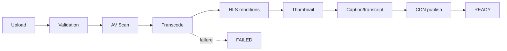

# TalentSphere — API_CONTRACTS.md v6.0

## 1. Contract-first Rule

Public APIs describe business capabilities rather than accidental database structure.

## 2. API Standard

REST/JSON + OpenAPI 3.1.

## 3. Canonical mutation flow

```text
request
→ authn
→ authz
→ validation
→ domain/use case
→ transaction
→ audit/event
→ response
```

## 4. Error Contract

Use canonical error codes and request IDs. Do not leak stack traces or storage/provider internals.

## 5. Pagination

Cursor-based pagination for large collections. Server-side allow-listed filters/sorts.

## 6. Idempotency

Required for externally observable retryable mutations.

## 7. Provider Webhooks

Signature + replay window + provider event ID + idempotent processing.

## 8. Source Behavioral Contract

## 13. API, Event, Integration, Queue, Realtime & Media Contracts

All external and cross-domain interfaces are contract-first. Public API behavior must not accidentally mirror internal tables. Every mutation specifies authorization, validation, idempotency, rate limits, errors, audit, and observability.

### 25.1 Complete Service Contract Register (SCI-01..SCI-54)

| ID | Operation | Actor | Idempotency |
|---|---|---|---|
| SCI-01 | Create job | Org recruiter | Client `jobIdempotencyKey` |
| SCI-02 | Apply to job | Candidate | Natural (unique job+applicant) |
| SCI-03 | Send message | Participant | `clientMessageId` |
| SCI-04 | Submit challenge | Candidate | Submission idempotency key |
| SCI-05 | AI suggest | Authed user | Deterministic heuristic |
| SCI-06 | Payment webhook | Stripe | Stripe `event.id` |
| SCI-07 | Moderate content | Moderator/Admin | Action key |
| SCI-08 | Enroll in course | Learner | Partial unique active |
| SCI-09 | Purchase license pool | Institution Admin | PO + Stripe event ID |
| SCI-10 | Bulk import students | Institution Admin | import_batch_id + row hash |
| SCI-11 | Batch course assignment | Institution Admin | (pool_id, batch_id) |
| SCI-12 | Seat assign/revoke/reassign | Institution Admin | (pool_id, learner_id) |
| SCI-13 | Add media source | Course Author | (content_item_id, provider, external_id) |
| SCI-14 | Import playlist | Course Author | (playlist_source_id, import_run_id) |
| SCI-15 | Reorder content | Course Author | Client operation ID |
| SCI-16 | Record playback progress | Learner | (learner_id, content_item_id) |
| SCI-17 | Certificate issue / verify | System / Public | UNIQUE(enrollment_id) |
| SCI-18 | Graduate learner | System / Learner | (learner_id, transition_id) |
| SCI-19 | Create course version | Course Author | Version key |
| SCI-20 | Submit course for review | Course Author | Submission id |
| SCI-21 | Attempt quiz | Learner | (quiz, user, attempt_no) |
| SCI-22 | Submit assignment | Learner | (assignment, learner, attempt_no) |
| SCI-23 | Assign peer review | System | (submission, reviewer) |
| SCI-24 | Enrol in path | Learner | (path, user) active |
| SCI-25 | Abort / rollback migration | System / User | (migration_id, stage) |
| SCI-26 | Purchase course | Learner | PaymentIntent id |
| SCI-27 | Submit payout settlement | System | (period, creator) |
| SCI-28 | Q&A post / accept answer | Learner / Instructor | Client post id |
| SCI-29 | Create contest | Instructor / Org | Contest key |
| SCI-30 | Register for contest | Learner | (contest, user) |
| SCI-31 | Submit contest entry | Learner | (contest, challenge, user, submission_key) |
| SCI-32 | Attempt certification | Learner | (certification, user, attempt_no) |
| SCI-33 | Publish post | Author | Client post id |
| SCI-34 | Send newsletter issue | Author | Issue key |
| SCI-35 | Skill CRUD / relationship / market signal / traversal | Admin / Public | — |
| SCI-36 | Career graph query / benchmark / opt-in | Candidate | — |
| SCI-37 | Salary submission / aggregate / withdrawal | Candidate | Submission key |
| SCI-38 | Assessment lifecycle | Recruiter/Interviewer | Assessment id |
| SCI-39 | Recording lifecycle | Recruiter/Interviewer | Recording id |
| SCI-40 | Readiness computation / gap analysis | Candidate | Recompute key |
| SCI-41 | Recruiter search / pool CRUD | Recruiter | — |
| SCI-42 | Credential issue / verify / revoke / endorse | System / Public / Peer | UNIQUE(enrollment) |
| SCI-43 | Correlation query / instructor analytics | Instructor / Admin | — |
| SCI-44 | Exam CRUD | Admin | — |
| SCI-45 | Emerging skill proposal | System | — |
| SCI-46 | Relationship validation | System | — |
| SCI-47 | Introduction path discovery | Candidate | — |
| SCI-48 | Introduction request lifecycle | Candidate | (path_id, requester) |
| SCI-49 | Feedback CRUD | Recruiter | Feedback key |
| SCI-50 | Feedback request | Candidate | Request key |
| SCI-51 | Freshness query | Candidate | — |
| SCI-52 | Re-verification | Candidate | Verification key |
| SCI-53 | Referral request lifecycle | Candidate | (job_id, referrer_id) |
| SCI-54 | Alumni affiliation / group lifecycle | User | Affiliation key |

### 25.2 Error Taxonomy

| Error Class | HTTP | Client-Visible Behavior |
|---|---|---|
| Validation | 422 | Field-level actionable messages |
| Authentication | 401 | "Sign in to continue" |
| Authorization / RLS denial | 403 / 404-equivalent | Generic "not permitted"; no existence leakage |
| Not found | 404 | RLS-masked |
| Conflict | 409 | "Changed since you loaded it — refresh" |
| Rate limit | 429 | Retry-After respected |
| Dependency failure | 503 / degraded | Never a false success |
| Timeout | 504 | Idempotent resume |
| Realtime failure | RPC error | Resubscribe + reconcile/poll |
| AI failure | 503 | Heuristic fallback + badge |
| Billing failure | 503 | Entitlements unchanged |
| Scheduler failure | Retry / DLQ | Skip reason surfaced |

---

### 26.1 Integration Register

| Integration | Direction | Purpose | Phase |
|---|---|---|---|
| Supabase (Auth/DB/Storage/Realtime/Edge) | Core | Platform substrate | MVP |
| Stripe | Bidirectional | Billing, webhooks, metering, invoicing | MVP (demo-guard) |
| Google / GitHub OAuth | Inbound | Social login | MVP |
| Resend / Postmark | Outbound | Transactional email | MVP |
| Gemini / Claude | Outbound | AI via `lib/ai/service.ts` | MVP heuristic; LLM Ph4 |
| BYO AI key | Outbound | Zero-platform-cost AI | MVP |
| managed hosting provider | Deploy | Hosting/edge | MVP |
| Sentry / managed hosting provider Analytics / PostHog | Outbound | Observability | MVP |
| HaveIBeenPwned | Outbound | Breached-password check | MVP |
| Mux / Cloudflare Stream | Outbound | Transcode + CDN | Ph2 (OD-14) |
| Kaltura / Panopto / MS Stream | Outbound | Enterprise video gateways | Ph6 |
| MS Entra / Google Workspace / Okta SSO | Inbound | Institutional SSO | Ph6 |
| Workday / SAP / BambooHR | Bidirectional | HRIS sync | Ph6 |
| Moodle / Canvas / Blackboard / SIS | Bidirectional | LMS interop | Ph6 |
| LinkedIn | Outbound/inbound | Job cross-post, extension scan, OIDC bootstrap, migration source | Post-MVP |
| Slack / Cal.com | Outbound | Notifications/scheduling | Post-MVP |
| IDV vendor | Outbound | Identity verification | Ph9 (OD-27) |
| Proctoring vendor | Outbound | Exam proctoring | Ph10 (OD-35) |
| Zapier / Make | Outbound | Automation | Future |

### 26.2 Integration Layer Doctrine (ADR-009)

```
Core Domain ← Integration Layer (ProviderAdapter + anti-corruption mappers) ← Provider Adapters
```

**Rules:**
- Server-side only for secrets
- Idempotency keys on webhook-triggered operations
- Circuit breakers with degraded modes
- Status visible in admin health
- Every dependency has an owner and documented degraded mode
- Removal drill (VER-021) gates every integration-touching release

---

### 27.1 Dual-Queue Boundary (ADR-009)

| Queue | Infra | Workloads | SLA |
|---|---|---|---|
| Transactional | Postgres `background_jobs` (SKIP LOCKED) | XP settle, notifications, webhooks, digests, rollups, retention purge, search reindex | Enqueue <10ms; process <5s |
| Heavy async | Dedicated worker pool (Redis/BullMQ or equivalent, OD-38) | Video transcode, AI enrichment, 5k+ row imports, large exports, embedding generation | Enqueue <100ms; process best-effort; DLQ after 3 retries |

### 27.2 Transactional Job Catalog

| Kind | Cadence | Retries |
|---|---|---|
| `notification.digest` | Daily 07:30 | 5 |
| `notification.fanout` | On event | 5 |
| `xp.settle` | Event or hourly | 3 |
| `streak.rollover` | Daily 00:05 | 5 |
| `leaderboard.rebuild` | Daily off-peak | 3 |
| `metrics.rollup` | Hourly/daily | 5 |
| `retention.purge` | Daily 02:00 | 5 |
| `stripe.sync` | On backlog | 5 |
| `search.reindex` | On write + nightly | 3 |
| `skill.market_signal_update` | Daily | 3 |
| `career.benchmark_compute` | Nightly | 3 |
| `salary.aggregate` | Nightly | 3 |
| `learning.outcome_correlation` | Nightly | 3 |
| `emerging_skill.detect` | Weekly | 3 |

### 27.3 Heavy Job Catalog

| Kind | Cadence | Retries |
|---|---|---|
| `media.transcode` | On upload | 3 → DLQ |
| `media.enrich` | On transcode complete | 3 → DLQ |
| `media.healthcheck` | Periodic | 3 |
| `institutional.import` | On request | 3 |
| `migration.parse` / `.commit` / `.purge-archive` | On request | 3 |
| `feed.fanout` | On post publish | 3 |
| `earnings.settle` | Monthly | 5 |
| `coupon.expiry_scan` | Daily | 3 |
| `interview.ai_analysis` | On session complete | 3 |

### 27.4 Job Schema

```
id UUID · kind · payload jsonb · status (queued/running/succeeded/failed/dead)
attempts · run_after · lock_expires_at · last_error (≤4KB)
idempotency_key UNIQUE(kind, idempotency_key) · created_at · updated_at
```

---

### 28.1 Realtime vs Polling Boundary

| Surface | Mechanism |
|---|---|
| Direct messaging | Supabase Realtime |
| Notification badges | Supabase Realtime |
| Presence (workspace) | Supabase Realtime |
| Feed | Cursor polling (30s) |
| Job listings | Cursor polling |
| Community posts | Cursor polling |
| Leaderboards | Polling + optimistic |
| Contest live leaderboard | Realtime (bounded) |

### 28.2 Channel Contract

- Payload ≤4KB `{type, entity, id, ts}` + monotonic cursor
- No raw rows; server RLS projection
- JWT-authenticated channels; RLS applied before event body
- Channel registry `<channelType>:<boundedId>`

### 28.3 Resilience

- Reconnect backoff 1s → 8s
- >3 failures → polling path with cursor resync
- Server cap 50 events/s/channel
- Overflow → `refresh` signal
- Launch capacity target ≤2,500 concurrent / 40 topics

---

### 29.1 Unified Content Model

```
Course → Section → ContentItem (VIDEO | PLAYLIST | ARTICLE | PDF | QUIZ | ASSIGNMENT | EXTERNAL_LINK)
                → MediaSource
                → ProviderAdapter
                → ProviderPlayer
```

### 29.2 Delivery Modes

| Mode | Description | Storage | Playback |
|---|---|---|---|
| A — Upload | File uploaded, validated, transcoded, CDN-delivered | Platform | Platform player |
| B — External video | URL normalized, validated, metadata fetched | Provider-hosted | Provider embed |
| C — Playlist embed | External playlist embedded | Provider-hosted | Provider playlist |
| D — Playlist import | Items imported as individual content items | Reference only | Provider players |
| E — External link | Provider prohibits embedding | N/A | External link |

### 29.3 Provider Capability System

Each provider declares: `canEmbed`, `canPlayPlaylist`, `canTrackPlayback`, `canTrackProgress`, `supportsCaptions`, `supportsSubtitles`, `supportsTranscript`, `supportsPlaybackSpeed`, `supportsStartTime`, `supportsEndTime`, `supportsFullscreen`, `supportsPictureInPicture`, `supportsThumbnail`, `supportsMetadataLookup`, `supportsOAuth`.

### 29.4 Media Pipeline



### 29.5 Media Security

> [!WARNING]
> No arbitrary HTML/JS from authors. Provider-specific renderers only. Domain allowlist in CSP `frame-src`. Reject `javascript:`, `data:`, unknown iframes. SSRF allow-list on server fetches. iframe sandboxing where compatible. Never download protected third-party content.

---

## 9. Provider Boundary

Business logic depends on normalized adapter interfaces, not raw provider payloads.

## 10. Event Rules

Every important event defines:
- name;
- version;
- producer;
- consumer;
- payload;
- idempotency;
- retry;
- observability.
