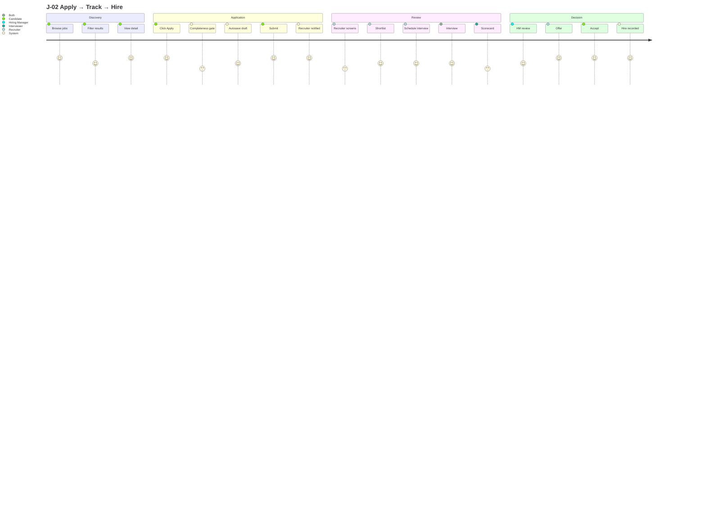

# TalentSphere — APP_FLOW.md v6.0

## 1. Navigation Model

### Public
`/`, `/login`, `/register`, `/verify/:hash`

### Authenticated core
`/dashboard`, `/profile`, `/jobs`, `/applications`, `/courses`, `/challenges`, `/messages`, `/notifications`, `/settings`

### Career intelligence
`/career/readiness`, `/career/transition`, `/career/benchmarks`, `/salaries`

### Recruiter
`/recruiter/search`, `/recruiter/pools`, `/recruiter/analytics`, `/hm/dashboard`

### Learning
`/paths`, `/teach/*`, `/cart`, `/checkout`, `/orders`

### Social
`/feed`, `/posts/:id`, `/articles/:id`, `/communities`, `/events`

### Institutional
`/institution/*`

## 2. Universal Request Flow

```text
User action
→ UI validation
→ API request
→ AuthN
→ AuthZ + purpose policy
→ domain validation
→ transaction
→ event/audit
→ response
→ query/cache update
→ user feedback
```

## 3. Candidate Core Flow

```text
Landing
→ Sign up / Sign in
→ Onboarding
→ Career goal
→ Skill profile
→ Gap analysis
→ Learning
→ Practice
→ Evidence
→ Career profile
→ Job discovery
→ Match explanation
→ Application
→ Interview
→ Outcome
→ Feedback
→ Next action
```

## 4. Recruiter Flow

```text
Organization setup
→ Job creation
→ Publish readiness
→ Candidate discovery
→ Evidence-aware review
→ Shortlist
→ Communication
→ Interview
→ Scorecard
→ Decision
→ Outcome record
```

## 5. Institution Flow

```text
Create tenant
→ Configure programs
→ Manage seats/users
→ Assign learning
→ Track progress
→ Assess
→ Credential
→ Employer transition
→ Graduation / independence
```

## 6. Recovery

```text
Failure
→ Explain what failed
→ Preserve user work
→ Retry safely
→ Offer alternate path
→ Confirm final state
```

## 7. State Preservation

Refresh/back/forward/mobile interruption must not cause silent data loss.

## 8. Critical Error Screens

- 401: session expired → reauthenticate without losing return intent.
- 403: explain access scope → do not leak existence-sensitive information.
- 404: safe not-found experience.
- 409: concurrency/idempotency conflict → show current state + recovery.
- 429: rate limit → show retry timing.
- 5xx: generic user message + request ID + retry.
- Maintenance: explain scope and retry path.

## 9. Assessment Flow

```text
Start assessment
→ bind session/policy
→ load protected content
→ answer
→ autosave
→ warning checkpoints
→ submit
→ server validation
→ score
→ result
```

No AI candidate assistance during AI_PROHIBITED.

## 10. Evidence Flow

```text
Evidence created
→ provenance recorded
→ validation
→ verification (when required)
→ status
→ capability update
→ matching/recommendation recalculation
→ audit
```

## 11. Detailed Behavioral Corpus

The complete 31-journey, 66-workflow and 53-state-machine corpus from the source baseline remains canonical in SSOT Part V. This document is the navigation/application-flow view; do not duplicate those definitions here.


---

## 11. Complete Behavioral Corpus (Source-preserved detail)

### 16.1 Complete Journey Register (J-01..J-28)

| ID | Name | Persona | Terminal |
|---|---|---|---|
| J-01 | Learn → Prove → Showcase | P-A, P-B | Portfolio with verified signals |
| J-02 | Apply → Track → Hire | P-A, P-B | Offer accepted |
| J-03 | Post → Source → Hire | P-C, P-E, P-S | Offer extended |
| J-04 | Org Setup → Team → Launch | P-C, P-E | First hire |
| J-05 | Profile → Network → Referral | P-A, P-B | Referred hire |
| J-06 | AI Career Path: Gap → Plan → Execute | P-B | Gaps addressed |
| J-07 | Creator: Author → Publish → Monetize | P-G | Revenue |
| J-08 | Mentor: Match → Guide → Impact | P-H | Impact measured |
| J-09 | Institution: Cohort → Place → Track | P-I | Placement reported |
| J-10 | Agency: Multi-Org → Pipeline → Bill | P-F | Client invoice |
| J-11 | Extension: Install → Local-First → Sync | P-A | Profile diff applied |
| J-12 | B2B2C Graduation Flywheel | P-I, ML | Independent candidate |
| J-13 | Institutional Media Authoring | P-G, P-K | Course assigned to batch |
| J-14 | Institutional Procurement & Licensing | P-J | Seats provisioned |
| J-15 | Faculty: Teach → Monitor → Intervene | P-K | At-risk students intervened |
| J-16 | Corporate L&D: Mandate → Track → Certify | P-L, P-T | Certification + HRIS sync |
| J-17 | LinkedIn Migration On-ramp | New user | Native account complete |
| J-18 | Creator: Author → Publish → Sell → Payout | P-G | Monthly settlement |
| J-19 | Self-Paced Learner: Discover → Certify | P-M | Path enrolled |
| J-20 | Learner: Path → Courses → Capstone → Cert | P-M | Program certificate |
| J-21 | Contestant: Register → Compete → Rank → Certify | P-Q | Certification badge |
| J-22 | Researcher: Company → Reviews → Compare → Apply | P-O | Apply started |
| J-23 | Author: Post → Engage → Article → Newsletter | P-N | Audience established |
| J-24 | Reviewer: Write → Moderate → Publish → Response | Any verified user | Published review |
| J-25 | Peer Reviewer: Assigned → Rubric Review → Feedback | Student | Grade finalized |
| J-26 | Career Switcher: Assess → Plan → Transition | P-R | Role transition confirmed |
| J-27 | Hiring Manager: Define → Assess → Hire → Track | P-S | Post-hire outcome recorded |
| J-28 | Skills Analyst: Analyze → Recommend → Measure | P-T | Learning program impact reported |

### 16.2 J-02 Apply → Track → Hire (Detailed)



### 16.3 J-26 Career Switcher (Detailed)

```mermaid
flowchart LR
    A[Target role identified] --> B[F-91 Career Readiness]
    B --> C{Skills gap?}
    C -->|Yes| D[F-95 Career Transition Plan]
    D --> E[F-84 suggests learning]
    E --> F[F-07 enroll courses]
    F --> G[F-08 challenges + F-69 assignments]
    G --> H[F-96 Skill Evidence]
    H --> I[F-85 Career Graph comparison]
    I --> J{Ready?}
    J -->|Yes| K[Apply via F-04]
    J -->|No| D
    K --> L[F-88 Interview Platform]
    L --> M[Hired + outcome tracked]
```



---

### 17.1 Complete Workflow Register (WF-01..WF-66)

| ID | Workflow | Terminal |
|---|---|---|
| WF-01 | Candidate Discovery → Application | Application submitted |
| WF-02 | Recruiter Sourcing Pipeline | Shortlist confirmed |
| WF-03 | Course Enrollment & Completion | Certificate + XP |
| WF-04 | Challenge Participation & Scoring | Score recorded |
| WF-05 | Application Review & Decision | Hired / rejected |
| WF-06 | Offer Management & Negotiation | Offer accepted / expired |
| WF-07 | AI Career Assistant Conversation | User-accepted action |
| WF-08 | Content Moderation & Enforcement | Resolution logged |
| WF-09 | Subscription Purchase & Upgrade | Active entitlement |
| WF-10 | Messaging Thread & Response | Message persisted + ack |
| WF-11 | XP Earning & Level Progression | Ledger row + level |
| WF-12 | Onboarding & First-Experience | First meaningful action |
| WF-13 | Reported Content Review | Action logged + appeal window |
| WF-14 | Invitation & Team Growth | Membership active |
| WF-15 | Employer Brand Profile Setup | Profile published + verified |
| WF-16 | Institutional License Purchase | Pool active + invoice reconciled |
| WF-17 | Bulk Student Import | Students provisioned + report |
| WF-18 | Batch Course Assignment | Batch enrolled + seats exact |
| WF-19 | Media Ingestion & Validation | Media validated + ready |
| WF-20 | License Revocation & Seat Reassignment | Seat returned + reassigned |
| WF-21 | Graduation Transition (B2B2C) | Independent profile active |
| WF-22 | Institutional Renewal | Renewal confirmed |
| WF-23 | Purchase Approval | Purchase approved + PO issued |
| WF-24 | Course Publish Review | Approved / rejected with feedback |
| WF-25 | Course Purchase & Enrolment | Enrolled |
| WF-26 | Coupon Redemption | Discount applied |
| WF-27 | Refund Request → Review → Refund/Deny | Refunded / denied |
| WF-28 | Instructor Payout Settlement | Payout paid |
| WF-29 | Quiz Attempt & Grading | Grade recorded |
| WF-30 | Assignment Submit → Grade / Peer Review | Grade finalized |
| WF-31 | Path Enrolment & Progression | Path completed |
| WF-32 | Contest Lifecycle | Results published |
| WF-33 | Certification Exam Attempt | Pass / fail / expired |
| WF-34 | Post Publish → Feed Distribution | Post visible in feed |
| WF-35 | Newsletter Issue Send | Sent / paused |
| WF-36 | Company Review Moderation | Published / removed |
| WF-37 | Salary Report Aggregation | Aggregated |
| WF-38 | Recommendation Request → Give → Accept → Display | Displayed / declined |
| WF-39 | Outreach Credit Send → Reply → Refund | Replied / expired |
| WF-40 | Profile View Logging | Logged per privacy mode |
| WF-41 | LinkedIn Migration Import | Native account complete |
| WF-42 | Skill Gap Assessment → Learning Plan | Learning plan activated |
| WF-43 | Career Readiness Evaluation | Readiness score computed |
| WF-44 | Salary Data Submission → Aggregation | Aggregated |
| WF-45 | Technical Interview Assessment | Assessment completed |
| WF-46 | Interview Recording + AI Feedback | Feedback report generated |
| WF-47 | Skill Evidence Issuance | Credential verified |
| WF-48 | Contribution Verification | Commit impact verified |
| WF-49 | Peer Mentorship Match → Session | Session completed |
| WF-50 | Expert Network Call Request | Call concluded |
| WF-51 | Custom Assessment Creation → Deployment | Assessment live |
| WF-52 | Post-Hire Outcome Tracking | Outcome recorded |
| WF-53 | Certification Exam Attempt | Pass/fail/expired |
| WF-54 | Emerging Skill Detection → Publication | New skill added to taxonomy |
| WF-55 | Warm Introduction Request → Delivery | Intro delivered |
| WF-56 | Application Feedback → Learning Loop | Improvement action |
| WF-57 | Skill Freshness → Re-verification | Freshness restored |
| WF-58 | Referral Request → Hire | Referral outcome |
| WF-59 | Alumni Network Join → Connect | Alumni connection |
| WF-60 | Reputation Signal → Score Update | Score recomputed |
| WF-61 | Recommendation → Acceptance → Learning | Feedback loop |
| WF-62 | Activity Tracking → Discovery | Behavioral signal |
| WF-63 | Interview Prep → Session → Feedback | Prep completed |
| WF-64 | Adaptive Learning → Mastery | Skill mastered |
| WF-65 | PDP Goal → Milestone → Achievement | Goal achieved |
| WF-66 | Internal Mobility Match → Transition | Internal move |

### 17.2 Workflow Integrity Traces (WIT-001..WIT-025)

| WF | Name | Trace | Terminal Exit | Primary Guard |
|---|---|---|---|---|
| WF-01 | Candidate Discovery → Application | WIT-001 | Application submitted + confirmation | Idempotency-Key + draft restore |
| WF-02 | Recruiter Sourcing Pipeline | WIT-002 | Shortlist confirmed + invite sent | Tenant-scoped RLS + optimistic locking |
| WF-03 | Course Enrollment & Completion | WIT-003 | Enrollment completed + certificate + XP | Unique enrollment guard + idempotent XP |
| WF-04 | Challenge Participation & Scoring | WIT-004 | Scored (≥70%) + XP | Sandbox ≤30s + idempotent score |
| WF-05 | Application Review & Decision | WIT-005 | Terminal hired/rejected + event | Mandatory scorecard precondition |
| WF-06 | Offer Management & Negotiation | WIT-006 | Offer accepted or expired | Single active offer constraint |
| WF-07 | AI Career Assistant Conversation | WIT-007 | User-accepted action (or dismissal) | `<user_content>` sanitization + heuristic fallback |
| WF-08 | Content Moderation & Enforcement | WIT-008 | Resolution logged + notice sent | Append-only queue + two-human review on bans |
| WF-09 | Subscription Purchase & Upgrade | WIT-009 | Active entitlement reconciled with Stripe | Webhook signature + idempotent credit |
| WF-10 | Messaging Thread & Response | WIT-010 | Message persisted + delivery ack | clientMessageId dedupe + Realtime RLS |
| WF-11 | XP Earning & Level Progression | WIT-011 | XP ledger row + recomputed level | UNIQUE(user_id, reference_type, reference_id) |
| WF-12 | Onboarding & First-Experience | WIT-012 | First meaningful action complete | Resumable onboarding + email verify retry |
| WF-13 | Reported Content Review | WIT-013 | Admin action logged + appeal window open | Severity SLA escalation + immutable audit |
| WF-14 | Invitation & Team Growth | WIT-014 | Membership active with mapped role | Unique crypto token + 7-day TTL |
| WF-15 | Employer Brand Profile Setup | WIT-015 | Profile published & verified | Domain verification gate |
| WF-16 | Institutional License Purchase | WIT-016 | Pool active + invoice reconciled | Idempotency (PO number + Stripe event.id) |
| WF-17 | Bulk Student Import | WIT-017 | Students provisioned + error report | Validate-then-commit |
| WF-18 | Batch Course Assignment | WIT-018 | Batch enrolled + seats consumed exactly N | Row lock + CHECK used≤total |
| WF-19 | Media Ingestion & Validation | WIT-019 | Media validated + asset ready | Validation states + SSRF allow-list |
| WF-20 | License Revocation & Seat Reassignment | WIT-020 | Seat returned + reassigned exactly once | Row lock + progress retained |
| WF-21 | Graduation Transition (B2B2C) | WIT-021 | Independent profile active | Never auto-convert + transactional |
| WF-22 | Institutional Renewal | WIT-022 | Renewal confirmed or graceful expiry path | Expiry scan job + grace period |
| WF-23 | Purchase Approval | WIT-023 | Purchase approved + PO issued | Configurable chain + RBAC per level |
| WF-24 | Course Publish Review | WIT-024 | Approved / rejected with feedback | Admin review SLA ≤72h + max 3 rejections |
| WF-25 | Course Purchase & Enrolment | WIT-025 | Enrolled | Webhook-owned fulfillment |

---

### 18.1 Complete State Machine Index

| Entity | Terminal States |
|---|---|
| Application | hired, rejected, withdrawn, stale_withdrawn, candidate_unresponsive |
| Job | closed, archived |
| Offer | hired, closed |
| Enrollment | completed, dropped, expired |
| Organization | active, archived |
| Interview | completed, cancelled |
| Mentor Relationship | completed, cancelled |
| Certificate | verified, revoked, expired |
| Moderation | approved, rejected |
| Challenge Submission | passed, failed, error |
| Background Job | succeeded, dead |
| License/Seat | expired, revoked, returned |
| Managed Learner | independent, archived |
| Media Asset | ready, failed, archived |
| Purchase Request | purchased, cancelled |
| Course (authoring) | published, archived, unpublished |
| Course Version | current, superseded |
| Quiz Attempt | graded |
| Assignment | graded, returned |
| Peer Review | completed |
| Learning Path Enrollment | completed, dropped |
| Course Order | enrolled, cancelled, refunded |
| Coupon | exhausted, expired, revoked |
| Payout | paid, failed |
| Company Review | published, removed |
| Salary Report | aggregated |
| Interview Question | published, rejected |
| Contest | results_published, archived |
| Certification Attempt | passed, failed, expired |
| Post | deleted, hidden_by_moderation |
| Comment | deleted, removed_by_moderation |
| Newsletter Issue | sent, failed |
| Recommendation | displayed, declined, withdrawn |
| Outreach Message | replied, expired |
| Group Membership | left, removed |
| Event | completed, cancelled |
| Migration Job | completed, failed, cancelled |
| Instructor | active, retired |
| Skill (F-84) | Merged |
| Credential (F-96) | revoked, expired |
| Interview Assessment (F-88) | reviewed, cancelled, no_show |
| Career Readiness (F-91) | completed, abandoned |
| Mentorship Session (F-90) | rated, declined, cancelled |
| Certification Attempt (F-115) | certified |
| Skill Freshness (F-123) | demoted |