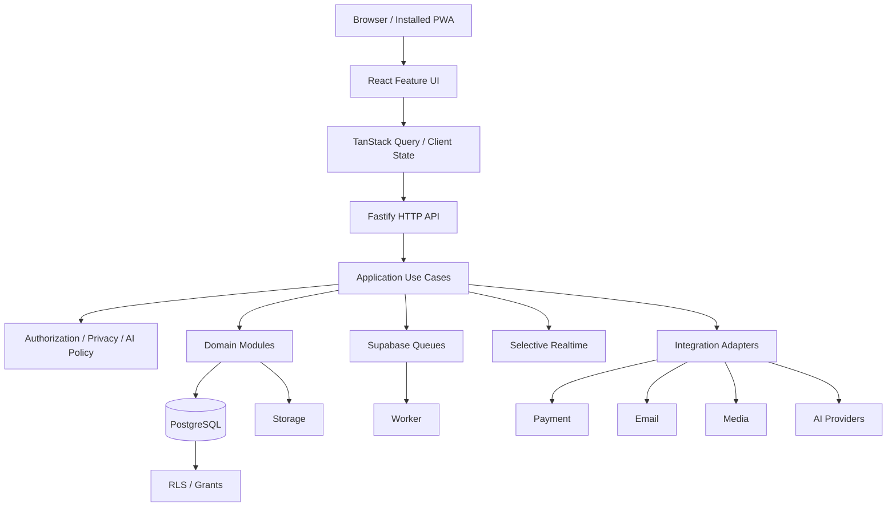
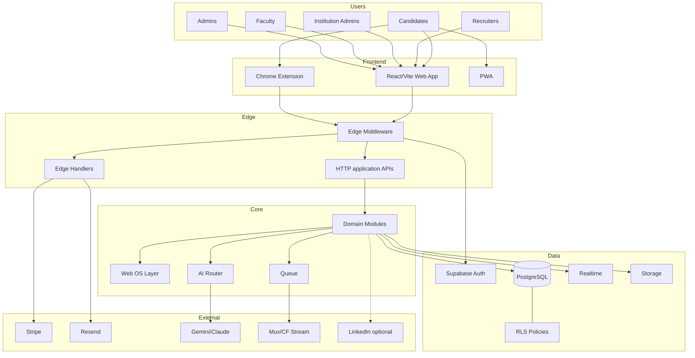
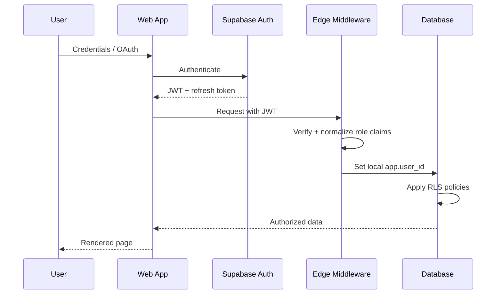
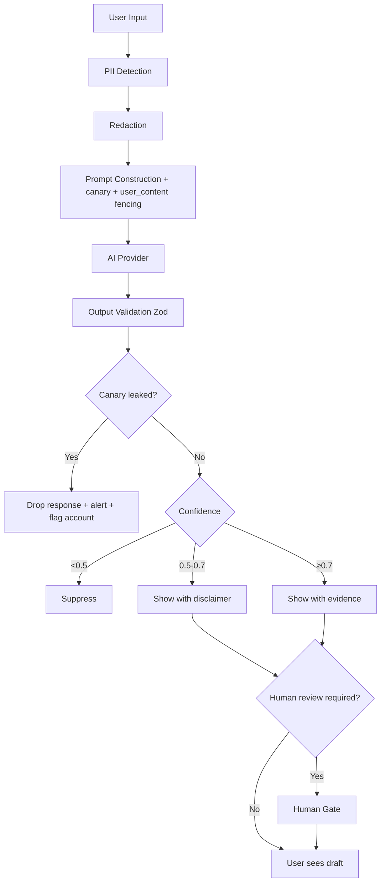

# TalentSphere — ARCHITECTURE.md v6.0

## 1. Decision

Build a **modular monolith first**.

The system must remain:
- domain-oriented;
- contract-first;
- auditable;
- replaceable at provider boundaries;
- capable of later extraction.

## 2. Runtime Architecture



## 3. Repository

```text
/
├── apps/
│   ├── web/
│   │   └── src/
│   │       ├── app/
│   │       ├── features/
│   │       ├── pages/
│   │       ├── shared/
│   │       ├── pwa/
│   │       └── config/
│   ├── api/
│   │   └── src/
│   │       ├── modules/
│   │       ├── routes/
│   │       ├── middleware/
│   │       ├── policies/
│   │       ├── adapters/
│   │       └── server.ts
│   └── worker/
│       └── src/
│           ├── jobs/
│           ├── consumers/
│           └── worker.ts
├── packages/
│   ├── ui/
│   ├── contracts/
│   ├── domain/
│   ├── observability/
│   ├── config/
│   └── testing/
├── supabase/
│   ├── migrations/
│   ├── functions/
│   ├── tests/
│   └── seed/
├── scripts/
├── tests/
├── docs/
├── .github/
├── package.json
└── SSOT.md
```

## 4. Domain Boundaries

Core domains:
`identity`, `profile`, `ontology`, `evidence`, `verification`, `learning`, `assessment`, `credential`, `opportunity`, `application`, `hiring`, `interview`, `matching`, `recommendation`, `career`, `networking`, `messaging`, `organization`, `institution`, `reputation`, `notification`, `billing`, `analytics`, `moderation`, `trust`, `ai`, `integration`, `admin`, `audit`.

## 5. Import Rules

```text
UI → application API
Application → domain
Infrastructure → ports
Domain → no framework/provider dependency
Feature → own local components first
Cross-domain → application interface/event
```

Circular dependencies are prohibited.

## 6. Persistence

Postgres is authoritative for relational state. Storage is authoritative for binary objects. Queue state is operational state, not business truth.

## 7. API Boundary

Browser calls application APIs. Direct table access is not the primary application contract.

## 8. Async

Use queue for:
- file processing;
- media processing;
- notification fan-out;
- recommendation refresh;
- analytics aggregation;
- plagiarism/similarity;
- credential propagation;
- scheduled maintenance.

## 9. Realtime

Use for:
- messaging;
- presence;
- non-critical live progress;
- selected dashboards.

Do not use realtime as the only path for:
- payment state;
- authorization;
- assessment scoring;
- credential issuance;
- audit persistence.

## 10. Scale Evolution

Do not introduce microservices by default. Extraction requires:
- measurable load/latency evidence;
- domain ownership;
- failure-isolation need;
- operational readiness;
- migration plan.


---

## 11. Source-Derived Detailed Architecture Corpus

### 20.1 System Context



### 20.2 Logical Architecture

| Layer | Contents | Technology |
|---|---|---|
| Presentation | Web app, extension, PWA, admin | React + TypeScript + Vite PWA, React 18+, Tailwind, Radix |
| Application | HTTP application APIs, route handlers, use cases | TypeScript strict |
| Domain | Aggregates, entities, VOs, domain events, business rules | Pure TS |
| Infrastructure | Repositories, adapters, integrations | Supabase, Stripe, providers |
| Data | PostgreSQL with RLS, storage buckets, realtime channels | Supabase |
| External | AI providers, payment, media, email, IDV | Integration Layer |

### 20.3 Authentication Flow



### 20.4 AI Safety Flow



---

### 21.1 Bounded Contexts (7 + Shared Kernel)

| Context | Contents | Aggregates |
|---|---|---|
| `identity` | Auth, profiles, orgs, tenancy, managed learners, instructor approval | User, Profile, Organization, Membership |
| `marketplace` | Jobs, requisitions, applications, offers, interviews, employer insights | Job, Application, Offer, CompanyReview |
| `learning` | Courses, lessons/content items, media, enrolments, progress, quizzes, assignments, paths, certificates, XP/gamification, contests, certifications | Course, Enrolment, Assessment, XPLedger, Contest |
| `community` | Connections, follows, posts/articles/newsletters, comments/reactions/reposts, groups, events, messaging, notifications | Thread, Post, Community |
| `billing` | Subscriptions, entitlements, course commerce, coupons, orders, refunds, licence pools, procurement, payouts | Subscription, Order, LicencePool, Payout |
| `governance` | Admin, moderation, trust, audit, flags, verification | Report, ModerationAction, FeatureFlag |
| `analytics` | Event tracking, KPIs, dashboards, experimentation | AnalyticsEvent, KPISnapshot |
| **Shared kernel** | Event backbone, UOM, TIG, automation, agents, healing, liquidity, DQ, health, media engine, integrations, AI service, UI kit, types, utilities | DomainEvent, MediaSource, ProviderAdapter |

### 21.2 Domain Boundary Rules

- Domain layer pure TS (ARCH-013)
- Application layer orchestrates; HTTP application APIs are thin adapters (ARCH-014)
- Infrastructure implements domain ports (ARCH-015)
- Cross-feature imports via `index.ts` barrels only (ARCH-016)
- Atomic promotion rule (ARCH-017)
- Cross-context via events or application-service interfaces (ARCH-018)
- Zero circular dependencies (ARCH-019)
- Routes are thin composition (ARCH-020)

### 21.3 ADRs (Locked at 13)

| ID | Decision |
|---|---|
| ADR-001 | Supabase Auth sole session authority |
| ADR-002 | Modular monolith (React/Vite + Supabase + managed hosting provider) |
| ADR-003 | 50 canonical tables + RLS deny-by-default |
| ADR-004 | Supabase Realtime messaging authority |
| ADR-005 | Stripe webhook idempotency + demo stubs |
| ADR-006 | Chrome extension local-first |
| ADR-007 | Provider-agnostic media |
| ADR-008 | Institutional tenancy |
| ADR-009 | Dual-queue boundary |
| ADR-010 | RLS policy template generator |
| ADR-011 | Media model is authority for lesson content |
| ADR-012 | DDD + Feature-Based + Atomic Design combination |
| ADR-013 | Cross-domain via events or application-service interfaces only |

---


## 12. V6 Corrections to Historical Architecture
- Browser/PWA domain mutations use the Fastify application API.
- Supabase RLS remains the database authorization boundary, not the complete business authorization model.
- `shared/platform` remains intentionally small; no business domain moves into a generic shared kernel merely to avoid imports.
- The previous Web OS concept is represented as a Career Workspace feature boundary.
- AI is accessed through the central AI Gateway/Orchestrator.
- Search/realtime/cache infrastructure remains measurement-gated.
