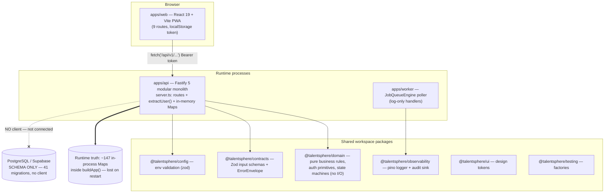

# TalentSphere — ARCHITECTURE.md

**Status:** Canonical architectural Single Source of Truth for the repository _as actually implemented_.
**Basis:** Direct inspection of the working tree at branch `main` (commit `8afc6d7`), October 2026.
**Governs:** Implementation decisions that cannot be safely inferred from reading individual files: ownership, boundaries, dependency direction, extension points, and stop conditions.
**Does NOT document:** Product vision, the 173-feature portfolio, UX micro-interactions, or future intent. Those live in `SSOT.md` and `docs/`. Where those documents describe systems that do not exist in this repository (Supabase Auth JWT flow, TanStack Query, Stripe adapters, Edge Functions, RLS enforcement in a live database, feature folders in `apps/web/src/features/`), **this file wins for "what exists today"** and the divergence is recorded in §24.
**Note on `AGENTS.md`:** its "Before coding → read `ARCHITECTURE.md`" step refers to **this root file**; `docs/engineering/ARCHITECTURE.md` is the intended/target architecture corpus.

---

## 1. Document Purpose

This document preserves architectural intent that source code alone cannot reveal. It exists because:

1. **Documentation and implementation materially disagree.** `SSOT.md` declares itself "GREENFIELD / 0% VERIFIED" while the repository contains a large, tested Fastify API, a pure-TypeScript domain package, a React PWA shell, SQL migrations, and CI. A new engineer (or AI agent) reading only `SSOT.md` or only `docs/engineering/ARCHITECTURE.md` would build the wrong things (e.g., wiring Supabase Auth into an app whose auth is HMAC session tokens signed by `packages/domain/src/auth.ts`).
2. **Deliberate choices look like defects.** In-memory Maps as the runtime store, a single 11k-line `server.ts`, log-only worker handlers, and a local-heuristic AI engine are the _current_ architecture; agents must not "fix" them casually (§3, §24).
3. **Duplicate ownership already exists** (design tokens in two places, per-route inline auth parsing) and must not grow (§5).

**Audience:** human developers and AI coding agents. Agents must treat §25 (Invariants), §26 (Decision Register), and §27 (Quick Reference) as binding before making changes. This document ranks **ACTUAL IMPLEMENTATION > OLD DOCUMENTATION > ASSUMPTION**; every major claim here carries file-path evidence (§28 conventions: CONFIRMED / INFERRED / UNKNOWN).

Relationship to other docs: `AGENTS.md`/`CLAUDE.md` define agent workflow and verification tooling (Reticle); `SSOT.md` and `docs/**` define _intended_ product architecture; this file defines _enforceable current_ architecture. On conflict about what exists, this file governs. On conflict about what should eventually exist, `SSOT.md` governs — but only after explicit human-approved work, never silently during unrelated tasks.

---

## 2. Architecture At A Glance

TalentSphere is a **pnpm monorepo modular monolith**: one browser app, one HTTP API process, one async worker process, sharing pure-TypeScript workspace packages. Persistence is currently **in-process memory inside the API**; SQL schema exists but is **not connected to any runtime**.

```mermaid
flowchart TD
    subgraph Browser
        WEB["apps/web — React 19 + Vite PWA<br/>(9 routes, localStorage token)"]
    end
    subgraph Runtime processes
        API["apps/api — Fastify 5 modular monolith<br/>server.ts: routes + extractUser() + in-memory Maps"]
        WORKER["apps/worker — JobQueueEngine poller<br/>(log-only handlers)"]
    end
    subgraph Shared workspace packages
        DOM["@talentsphere/domain — pure business rules,<br/>auth primitives, state machines (no I/O)"]
        CON["@talentsphere/contracts — Zod input schemas + ErrorEnvelope"]
        CFG["@talentsphere/config — env validation (zod)"]
        OBS["@talentsphere/observability — pino logger + audit sink"]
        UI["@talentsphere/ui — design tokens"]
        TST["@talentsphere/testing — factories"]
    end
    PG[("PostgreSQL / Supabase<br/>SCHEMA ONLY — 41 migrations, no client")]
    MEM[("Runtime truth: ~147 in-process Maps<br/>inside buildApp() — lost on restart")]

    WEB -- "fetch('/api/v1/...') Bearer token" --> API
    API --> DOM
    API --> CON
    API --> CFG
    WORKER --> OBS
    API ==> MEM
    API -. "NO client — not connected" .-x PG
```

Key facts (CONFIRMED):

- **API surface:** 265 route registrations, all under `/api/v1/*` plus `/health` and `/api/v1/health` (`grep app.get/post/patch/delete apps/api/src/server.ts`).
- **Persistence gap:** zero Postgres/Supabase clients anywhere in `apps/` or `packages/` (verified by `tests/unit/persistence-honesty.test.ts`, which asserts no `pg`/`postgres`/`@supabase/supabase-js`/`knex`/`typeorm` dependency exists).
- **No production queue broker:** the worker polls its own in-process `JobQueueEngine` (`apps/worker/src/queue.ts`); nothing enqueues into it from the API process.
- **AI is local:** `generateCareerAssistantResponse` is a deterministic heuristic (`packages/domain/src/ai-gateway.ts`, `executionMode: 'local_heuristic'`); no LLM provider SDK exists.
- **Verification layer:** the web app is instrumented with Reticle (`@reticlehq/vite-plugin` in `apps/web/vite.config.ts`, `src/reticle-dev.ts`) per `CLAUDE.md`.

---

## 3. System Boundary

| Area                               | Responsibility                | Inside System?                  | Notes                                                                                                                                        |
| ---------------------------------- | ----------------------------- | ------------------------------- | -------------------------------------------------------------------------------------------------------------------------------------------- |
| Authentication                     | Register/login/session tokens | Yes                             | Own code: `packages/domain/src/auth.ts` (PBKDF2 + HMAC tokens). **Supabase Auth is NOT integrated** despite env keys existing.               |
| Authorization                      | Role checks, ownership checks | Yes                             | Server-side in `apps/api/src/server.ts` via `extractUser` + role assertions + domain functions (`canViewProfile`, `assertPlatformAdmin`, …). |
| Database                           | Relational persistence        | **No (disconnected)**           | 41 SQL migrations exist under `supabase/migrations/`; no runtime connects to them. Truth lives in in-process Maps.                           |
| Payments                           | Card processing               | No — and **no provider exists** | Checkout collects raw card fields in the browser (`CheckoutPage.tsx`) and calls a mock billing API. No Stripe/MID dependency anywhere.       |
| Notifications delivery             | Email/push/SMS                | No                              | Worker handler only logs ("Delivering queued notification", `apps/worker/src/index.ts`).                                                     |
| AI inference                       | Career assistant              | Partially                       | Local heuristic inside domain package. External providers (Gemini/Claude) documented in SSOT but **not implemented**.                        |
| Storage buckets                    | Avatars/resumes/etc.          | No                              | Env vars defined (`SUPABASE_BUCKET_*`) but no storage client code.                                                                           |
| Identity provider                  | OAuth/social login            | No                              | Not implemented; email+password only.                                                                                                        |
| Analytics                          | Product events                | Yes (in-memory)                 | `POST /api/v1/analytics/events` records into an in-process array.                                                                            |
| Cloud infra (Supabase/Vercel/etc.) | Hosting/managed services      | No                              | Only referenced by config/docs; nothing in CI deploys.                                                                                       |
| Verification tooling               | Reticle MCP                   | External tool, inside dev loop  | Dev-time only (`@reticlehq/react` is a devDependency).                                                                                       |

External providers claimed by docs but absent from code (do NOT assume they exist): Supabase (auth/storage/realtime/queues), Stripe, Resend, Gemini/Claude, Mux, LinkedIn.

---

## 4. QUESTION 01 — WHAT'S IN THE SYSTEM?

**Component: `apps/api` (@talentsphere/api)**

- Purpose: the only server-side application surface. Fastify 5 modular monolith.
- Owns: HTTP routing, request lifecycle, canonical error mapping, **all runtime state (in-memory Maps)**, endpoint-level authorization wiring.
- Consumes: `@talentsphere/domain`, `@talentsphere/contracts`, `@talentsphere/config`.
- Produces: JSON responses conforming to contracts; `ErrorEnvelope` on failure; `x-request-id` header on every response.
- Depends on: fastify, @fastify/cors|helmet|rate-limit, zod, node:crypto.
- Must not: contain business rules inline when a domain function exists; add a second error envelope shape; introduce direct DB access without an approved persistence decision (§8).
- Primary location: `apps/api/src/server.ts` (`buildApp()` factory), `apps/api/src/index.ts` (bootstrap, skips listen under `NODE_ENV=test`).

**Component: `packages/domain` (@talentsphere/domain)**

- Purpose: canonical business logic — entities, invariants, state machines, policy gates, and the auth crypto primitives. Pure TypeScript, no framework, no I/O.
- Owns: `Role`/`UserStatus` unions, `DomainError` + codes, application/job/subscription/evidence/notification state machines, XP caps & badge rules, AI quota tables & prompt sanitizer, assessment AI policy (`isAIAssistanceAllowed`), password hashing & session-token signing/verification.
- Consumes: nothing (leaf; `core.ts` has zero imports by design).
- Produces: exported functions/classes consumed by API, tests, and `@talentsphere/testing`.
- Depends on: node:crypto only (auth.ts).
- Must not: import its own barrel `index.ts` (documented cycle rule, `docs/engineering/ARCHITECTURE.md` §5.1); depend on Fastify/Zod/Supabase; perform I/O.
- Primary location: `packages/domain/src/*.ts` (~45 modules, one per bounded context; barrel `index.ts` re-exports only).

**Component: `packages/contracts` (@talentsphere/contracts)**

- Purpose: the shared API contract — Zod schemas for every request body/query, pagination shapes, and the canonical `ErrorEnvelope`.
- Owns: input validation schemas (single source), `ErrorEnvelopeSchema`.
- Must not: duplicate entity definitions owned by domain (it validates payloads; domain defines entities).
- Primary location: `packages/contracts/src/index.ts` (1679 lines, flat schema list).

**Component: `apps/web` (@talentsphere/web)**

- Purpose: React 19 + Vite PWA consumer shell. 9 routes only (`App.tsx`: `/`, dashboard, login, checkout, evidence, assessments, jobs, privacy, terms).
- Owns: routing, page composition, client form state, localStorage session keys (`talentsphere_token`, `talentsphere_user`), offline-status UI (`pwa.ts`), PWA manifest/icons.
- Consumes: `@talentsphere/ui` tokens; API via relative `fetch('/api/v1/...')`.
- Must not: hold business rules; mint/simulate authoritative state as if persisted (see CURRENT GAPs §24); call anything except the API.
- Primary location: `apps/web/src/{pages,components,hooks}`. Note: components live in `apps/web/src/components/ui/`, largely duplicating `packages/ui` scope (§24 risk R-3).

**Component: `apps/worker` (@talentsphere/worker)**

- Purpose: async job consumer skeleton. `JobQueueEngine` with retry/backoff-to-requeue, idempotency-key set, and dead-letter queue.
- Owns: queue semantics (`enqueue`, `processNext`, DLQ, `registerHandler`).
- Consumes: `@talentsphere/observability`.
- Must not: be assumed durable across restarts (queue is in-memory, per-process); be treated as wired to the API (no producer exists).
- Primary location: `apps/worker/src/queue.ts`, `apps/worker/src/index.ts` (poll loop, 2 s idle sleep).

**Component: `packages/config`**

- Purpose: zod-validated environment schema (`ServerEnvSchema`) — the single definition of every env var incl. `TOKEN_SECRET` (min 32 chars, optional with documented random-per-process fallback), CORS origins, rate limits, AI policy flags.
- Primary location: `packages/config/src/env.ts`.

**Component: `packages/observability`**

- Purpose: pino logger factory with standard redaction list (authorization headers, password, token, apiKey, secret, accessToken, refreshToken) and an `AuditEvent`/`AuditSink` interface with an in-memory implementation.
- Must not: log unredacted credentials; become the only audit trail (admin audit currently lives in API Maps, not this sink — §24 R-6).

**Component: `packages/ui` + `packages/testing`**

- `packages/ui`: canonical design tokens (`colors`, `spacing`) per WCAG-oriented design system. No components.
- `packages/testing`: mock factories (`createMockUser/Profile/Evidence`) used by unit tests.

**Component: `supabase/migrations` + `scripts/`**

- 41 numbered SQL migrations defining the _intended_ schema with RLS statements; validated only as text by `tests/unit/database-migrations.test.ts` ("SQL text assertions, does NOT execute SQL"). `scripts/migrate.mjs` deliberately refuses to claim execution and points at `supabase db push` (guarded by `persistence-honesty.test.ts`). `scripts/start-e2e-api.mjs` boots the built API for Playwright.

**Communication paths (CONFIRMED):** Browser → API (HTTP, Bearer token) → domain functions → in-memory Maps. Worker runs standalone. Tests hit the API in-process (`buildApp()` + `app.inject`) or over HTTP for E2E. There is **no** API→Worker path, **no** API→DB path, **no** realtime channel, **no** outbound external integration.

---

## 5. QUESTION 02 — WHO'S RESPONSIBLE FOR WHAT?

| Responsibility                                        | Single Owner                                                                                                                                      | Location                                                                 | Notes                                                                                                     |
| ----------------------------------------------------- | ------------------------------------------------------------------------------------------------------------------------------------------------- | ------------------------------------------------------------------------ | --------------------------------------------------------------------------------------------------------- |
| Password hashing / verification                       | `hashPassword`/`verifyPassword`                                                                                                                   | `packages/domain/src/auth.ts`                                            | PBKDF2-SHA512, constant-time compare.                                                                     |
| Session token mint/verify/expiry                      | `createSessionToken`/`verifySessionToken`                                                                                                         | `packages/domain/src/auth.ts`                                            | HMAC-SHA256, base64url payload.signature, TTL 86400 s default.                                            |
| Extracting identity from a request                    | `extractUser` closure                                                                                                                             | `apps/api/src/server.ts:672`                                             | Canonical helper; see duplication risk R-2.                                                               |
| Role/permission rules                                 | Domain functions (`assertPlatformAdmin`, `canViewProfile`, `assertModeratorAuthority`, `assertThreadParticipant`, `assertAIAssistanceAllowed`, …) | `packages/domain/src/{admin,profile,moderation,messaging,assessment}.ts` | API routes call them; routes also do some inline `session.roles.includes('platform_admin')` checks (R-2). |
| Application lifecycle states                          | `ALLOWED_APPLICATION_TRANSITIONS` + `transitionApplicationState`                                                                                  | `packages/domain/src/core.ts` + `applications.ts`                        | The state machine is canonical in domain.                                                                 |
| Evidence lifecycle (verify/dispute/revoke/provenance) | domain `evidence.ts` functions                                                                                                                    | `packages/domain/src/evidence.ts`                                        |                                                                                                           |
| Billing plans/entitlements/subscriptions              | domain `billing.ts` (`PLATFORM_PLANS`, `getPlanEntitlements`, `createSubscription`, `cancelSubscription`)                                         | `packages/domain/src/billing.ts`                                         | Payment _processing_ is owned by nobody (mock webhook only).                                              |
| AI quota/policy/sanitization                          | domain `ai-gateway.ts` (`AI_QUOTA_LIMITS`, `assertWithinAIQuota`, `sanitizePromptInput`)                                                          | `packages/domain/src/ai-gateway.ts`                                      | Tier selection currently hardcoded `'free'` at route level (`server.ts:5198`) — R-4.                      |
| Request-payload validation                            | `@talentsphere/contracts` Zod schemas                                                                                                             | `packages/contracts/src/index.ts`                                        | `.parse(req.body)` inside route handlers; ZodError → 400 centrally.                                       |
| Error→HTTP status mapping                             | Global `setErrorHandler`                                                                                                                          | `apps/api/src/server.ts` (~lines 470–545)                                | Sole translator of `DomainError.code` → status + `ErrorEnvelope`.                                         |
| Runtime persistence                                   | In-process Maps inside `buildApp()`                                                                                                               | `apps/api/src/server.ts:571+`                                            | Deliberate current-state owner; replacement requires §8 stop-condition.                                   |
| Intended relational schema                            | SQL migrations                                                                                                                                    | `supabase/migrations/*.sql`                                              | Text-verified only; not executed by app.                                                                  |
| Async job semantics (retry/DLQ/idempotency)           | `JobQueueEngine`                                                                                                                                  | `apps/worker/src/queue.ts`                                               | Handlers registered in `worker/src/index.ts`.                                                             |
| Client session storage                                | Web pages/Layout                                                                                                                                  | `apps/web/src/pages/LoginPage.tsx`, `Layout.tsx`                         | localStorage keys `talentsphere_token`/`talentsphere_user`.                                               |
| Design tokens                                         | `packages/ui/tokens.ts`                                                                                                                           | `packages/ui/src/tokens.ts`                                              | Competes with `apps/web/src/components/ui/` — R-3.                                                        |
| Audit logging (admin actions)                         | `createAdminAuditLog` + `adminAuditLogs` array                                                                                                    | domain `admin.ts` + API Map                                              | `packages/observability/audit.ts` sink exists but is unused by API — R-6.                                 |
| Test fixtures                                         | `packages/testing/factories.ts`                                                                                                                   |                                                                          |                                                                                                           |

**ARCHITECTURAL RISK — duplicated ownership**

- **R-2 (MEDIUM-HIGH):** Authorization is _mostly_ delegated to domain predicates, but many routes additionally do inline `session.roles.includes('platform_admin')` checks, and several endpoints re-implement token extraction inline (`server.ts` lines 804–812, 979–987, 1022–1030 parse `authorization` manually instead of calling `extractUser`). Canonical owner: domain predicates called through `extractUser`-provided sessions. Human confirmation needed before consolidating (behavior must stay identical; security suite covers it).
- **R-3 (MEDIUM):** UI primitives exist in `apps/web/src/components/ui/` while `packages/ui` holds only tokens. Not yet conflicting, but a second component library must not appear in `packages/ui` without a decision.
- **R-4 (HIGH, security-adjacent):** AI tier is hardcoded `'free'` in the route even though subscription entitlements exist in domain/billing; the canonical owner of "which tier is this user" is undefined between `subscriptionsByUserId` Map and `ai-gateway.ts`. STOP-and-ask applies.

Rule: if you are adding code for any responsibility above, extend its listed owner. Creating a second implementation of any row is an architectural violation (§27).

---

## 6. QUESTION 03 — WHY IS IT BUILT THIS WAY?

**D1 — Modular monolith (one API process, many domain modules).**
Status: KNOWN DECISION (`SSOT.md` Founder Amendment A.1; `docs/engineering/ARCHITECTURE.md` §1). Reason: contract-first, auditable, later-extractable system without premature microservices. Alternative: service-per-domain. Rejected: operational cost + no measured load evidence. Trade-off: a single 11k-line `server.ts` concentrates routing/state wiring. Revisit when: a bounded context needs independent scaling/deploy, evidenced by measurement.

**D2 — Business logic lives in a pure `@talentsphere/domain` package; API holds no rules.**
Status: KNOWN DECISION (import-rule section of `docs/engineering/ARCHITECTURE.md` §5; enforced structurally — domain has zero framework deps). Reason: rules must be testable without HTTP and reusable by worker/tests. Alternative: logic in Fastify services. Rejected: untestable duplication. Trade-off: routes become thin but numerous. Revisit: never (candidate invariant INV-002).

**D3 — In-memory Maps as runtime persistence.**
Status: INFERRED DECISION — the code comment says "In-memory repositories for modular monolith runtime state" (`server.ts:571`) and `persistence-honesty.test.ts` actively _guards_ against pretending a DB is connected. Strong evidence this is a deliberate staging choice pending Supabase wiring, not an oversight. Alternative: wire Postgres now. Not selected: no DB client dependency exists by design; honesty tests enforce that. Trade-off accepted: **all runtime state is lost on restart**. Justifies revisiting: first deployment target requiring durability (requires human decision — §8, §28 U-1).

**D4 — Self-signed HMAC session tokens instead of Supabase Auth/JWT.**
Status: KNOWN DECISION rationale recorded in-code (`auth.ts` TOKEN_SECRET comment: hardcoded fallback key would let anyone mint privileged tokens; random per-process key keeps tokens unforgeable at the cost of surviving restarts). Alternative: Supabase Auth (documented in `docs/engineering/ARCHITECTURE.md` §20.3 — NOT implemented). Trade-off: no refresh mechanism, no revocation list, sessions die with process unless `TOKEN_SECRET` set. Revisit when real auth provider is introduced — escalation required (`AGENTS.md`: security architecture changes).

**D5 — Centralized error translation via `DomainError` codes + one global handler.**
Status: CONFIRMED pattern. Every failure path funnels through `setErrorHandler` producing `ErrorEnvelope` with `request_id`. Alternative: per-route try/catch. Rejected implicitly — none exists. Preserve: adding a second error shape fragments client handling.

**D6 — Contracts-first validation with shared Zod package.**
Status: CONFIRMED. One schema per mutation in `@talentsphere/contracts`, parsed at the route boundary; VALIDATION_FAILED (400) produced centrally. Keeps browser/tests/API agreeing on payloads.

**D7 — Deterministic local-heuristic AI behind domain functions.**
Status: KNOWN DECISION direction (SSOT C: "AI Gateway foundational"; env flags `AI_CLOUD_FALLBACK_ENABLED=false` default) + INFERRED implementation choice: heuristics avoid paid inference for free users (SSOT cost invariant) and keep tests deterministic. Quota enforcement (`FREE_USER_AI_QUOTA_EXCEEDED` → 402) is real code. Revisit when a provider adapter is explicitly approved.

**D8 — Worker with in-process queue engine and log-only handlers.**
Status: INFERRED DECISION (skeleton-first; `queue.ts` implements retry/DLQ/idempotency properly, handlers don't do work yet). Trade-off: async pipeline is not durable and not connected. Any real producer/consumer wiring = new infrastructure decision → ask.

**D9 — Schema-as-text with honesty-guarded migration script.**
Status: KNOWN DECISION (`migrate.mjs` validates contiguity and refuses success-claims; `database-migrations.test.ts` title states "does NOT execute SQL"). Reason: prevent "documented = implemented" drift the repo explicitly fights.

**D10 — pnpm workspace with strict layered dependencies.**
Status: CONFIRMED (`pnpm-workspace.yaml`; apps depend on packages, packages depend on nothing but zod/pino/crypto). Alternatives considered: UNKNOWN.

**UNKNOWN — HUMAN DECISION REQUIRED**

- U-1: Target hosting/topology (nothing deploys; no Dockerfile/IaC found).
- U-2: Whether relative `/api/v1` fetches imply a planned same-origin proxy/gateway (none configured in `vite.config.ts`).
- U-3: Ownership model for multi-tenancy beyond `TENANT_ISOLATION_VIOLATION` error code and org-scoped maps.

---

## 7. QUESTION 04 — WHAT'S ALLOWED TO TOUCH WHAT?

**Allowed Direction:**
`apps/web → apps/api → (@talentsphere/contracts validation → @talentsphere/domain rules) → in-memory Maps (runtime) / supabase schema (text only)`
`apps/worker → @talentsphere/observability`
Everything may depend on `@talentsphere/config` (processes) and `@talentsphere/testing` (tests only).

**Allowed:**

- UI → API HTTP only (relative `/api/v1/*`).
- API route → contracts schema `.parse()` → domain function → Map store.
- Domain → `core.ts` leaf and sibling declaring-module imports (never its own barrel).

**Forbidden Dependencies**

| Source                   | Must Not Depend On                                                                  | Reason                                                                                                                |
| ------------------------ | ----------------------------------------------------------------------------------- | --------------------------------------------------------------------------------------------------------------------- |
| `apps/web`               | PostgreSQL/Supabase clients, service-role keys                                      | Browser cannot hold privileged credentials; API is the sole authority (SSOT A.2).                                     |
| `apps/web`               | `@talentsphere/domain` internals as business authority                              | Client checks are UX conveniences; server enforcement is mandatory (INV-004).                                         |
| `packages/domain`        | fastify, zod, supabase clients, any provider SDK, network/fs I/O                    | Purity is why domain is testable everywhere; breaks tree-shaking & reuse.                                             |
| `packages/domain` module | its own `index.ts` barrel                                                           | Documented circular-import regression rule (`docs/engineering/ARCHITECTURE.md` §5.1).                                 |
| `packages/contracts`     | `@talentsphere/domain`                                                              | Contracts must stay independently consumable (today: zero coupling).                                                  |
| `apps/api` route handler | direct `verifySessionToken(...)` ad-hoc parsing where `extractUser` applies         | Prevents divergent auth behavior (existing violations = R-2, do not add more).                                        |
| `apps/api`               | inventing response/error shapes outside `ErrorEnvelope`/contract schemas            | One canonical envelope; parallel shapes break clients and tests.                                                      |
| `apps/worker`            | `@talentsphere/domain`… currently allowed, but must not reach into API process Maps | They are separate processes; there is no shared memory — cross-process state transfer requires a real queue decision. |
| Any `apps/*`             | committing secrets / `TOKEN_SECRET` / service-role keys                             | `.env.example` is the only committed env artifact; env is validated fail-fast in config.                              |
| Tests                    | weakening assertions to pass                                                        | `CLAUDE.md`/Reticle rules + CI retries=0; a red test is a finding.                                                    |

**Existing coupling to watch (do not extend):**

- `server.ts` is a god-file: all Maps, helpers, and 265 routes share one closure. New features land _inside_ it following the per-feature Map + route block pattern until a human approves decomposition.
- Hidden coupling: `vitest.config.ts`/`playwright.config.ts` pin `TEST_TOKEN_SECRET` because tests import domain **from source** while the API imports the **built** package — two copies of `auth.ts` must agree on the signing key. Changing token logic requires updating both loaders' assumptions.
- No circular dependencies detected among workspace packages (domain is the leaf; api depends on domain/contracts/config; web depends on ui only). Keep it that way.

---

## 8. QUESTION 05 — HOW DOES DATA ACTUALLY MOVE?

### Flow A — Login / session establishment (security-critical)

Trigger: user submits credentials.
`LoginPage.tsx handleSubmit` → `POST /api/v1/auth/login` → `LoginInputSchema.parse` → route looks up `usersByEmail` Map → `verifyPassword` (domain, timing-safe) → `createSessionToken(userId,email,roles)` → `{token,user,profile}` → UI writes `localStorage['talentsphere_token'|'talentsphere_user']` → redirect `/dashboard`.
Authenticated requests: `Authorization: Bearer <token>` → `extractUser` → `verifySessionToken` (HMAC + expiry) → session payload `{userId,email,roles}` drives all downstream checks.
Failure path: unknown user or bad password → `DomainError UNAUTHENTICATED` → 401 `ErrorEnvelope`. Expired/tampered token → verify returns null → 401.
**CURRENT GAP (P0-01, audit):** on non-OK response the UI falls back to `demo_token_<timestamp>` + fake identity and still "logs in". This is a defect, not architecture — do not replicate; do not remove without fixing the real path (tests depend on flows).
State transition: anonymous → authenticated. Ownership: token payload roles are trusted **only** because HMAC-verified server-side; localStorage is convenience copy, not truth.

### Flow B — Evidence creation & verification (core product loop)

`EvidencePage`/client → `POST /api/v1/evidence` → parse → `extractUser` → domain `createEvidence` (status `pending`, provenance recorded) → stored in evidence Maps → response. Verifier role → `POST .../verify|dispute|revoke` → domain transitions (`verifyEvidence` etc. enforce who may move which state) → updated record; public proof generation available (`generatePublicProof`).
Failure: wrong role → `FORBIDDEN`/`UNAUTHORIZED` 403; bad state → `INVALID_STATE_TRANSITION` 422.
Ownership: evidence state truth = API Maps (runtime) / `public.evidence` table (intended, disconnected).
**CURRENT GAP (P0-07):** `EvidencePage.tsx:133` fabricates `sha256:` hashes with `Math.random()` client-side — simulation, not transaction.

### Flow C — Job application submission (business transaction)

`JobsPage` → `POST /api/v1/jobs/:id/apply` → `SubmitApplicationInputSchema` → participant checks → `submitJobApplication` (domain) → recruiter transitions via `transitionApplicationState` guarded by `ALLOWED_APPLICATION_TRANSITIONS` (draft→submitted→in_review→shortlisted→interviewing→offered→hired|rejected|withdrawn; terminal states immutable).
Failure: illegal edge → 422 `INVALID_STATE_TRANSITION`; non-party → 403.
**CURRENT GAP (P0-07):** `JobsPage.tsx:79-82,218` shows "Application Transmitted" from local React state without fetching — UI simulates the transaction.

### Flow D — Subscription checkout (money-adjacent)

`CheckoutPage` → (raw card fields collected client-side — **CURRENT GAP P0-03**, no processor/tokenizer exists) → `POST /api/v1/billing/subscribe` with Bearer token + client-generated `idempotencyKey` → domain `createSubscription` against `PLATFORM_PLANS` → `subscriptionsByUserId`/`entitlementsByUserId` Maps + invoice record. Cancel → `cancelSubscription` (at-period-end semantics). Webhook `POST /api/v1/billing/webhook` dedupes via `billingEventsByIdempotency` Map.
Failure: **swallowed** — UI uses `.catch(() => null)` then unconditionally renders "Subscription Confirmed!" (**CURRENT GAP P0-02**). Webhook is unsigned (**P0-05**, acknowledged in `docs/quality/SECURITY.md` §9).
Ownership: subscription/entitlement truth = domain functions + API Maps. Nothing external is source of truth.

### Flow E — AI assistant query (policy-critical)

Client → `POST /api/v1/ai/chat` → `extractUser` → `sanitizePromptInput` → tier (hardcoded `'free'` — R-4) → `getOrCreateAIUsageMeter` → `assertWithinAIQuota` (tokens/day, requests/day) → `generateCareerAssistantResponse` (local heuristic) → message + `AIProvenance{executionMode:'local_heuristic', disclaimer}` persisted in Maps. Assessment context: `assertAIAssistanceAllowed(policyMode)` blocks AI during `AI_PROHIBITED` sessions server-side → 403 `ASSESSMENT_AI_PROHIBITED`; quota breach → 402 `FREE_USER_AI_QUOTA_EXCEEDED`.
Ownership: quota meters in API Maps; limits in domain constants.

### Flow F — Async jobs (designed, not connected)

Intended: producer → `queueEngine.enqueue(type,payload,{idempotencyKey})` → poll loop `processNext` → registered handler → completion or requeue (≤ maxRetries=3) → DLQ. Actual: **no producer exists in the API process**; handlers log only. Treat `evidence.propagate`, `notifications.send`, `analytics.aggregate` as reserved contracts, not behavior.

Cross-cutting: every response carries `x-request-id` (echoing inbound header or generated `req_uuid`) — the correlation primitive for logs and `ErrorEnvelope.request_id`.

---

## 9. QUESTION 06 — WHAT CAN NEVER BREAK?

1. **Server-side authorization is mandatory.** Frontend gating is cosmetic; every protected route must verify the HMAC token and delegate rules to domain predicates. A change that moves enforcement client-side is stopped.
2. **Session tokens must remain unforgeable.** Never reintroduce a hardcoded/default signing secret; `TOKEN_SECRET` optional-fallback randomness (`auth.ts`) is intentional.
3. **Business rules live only in `@talentsphere/domain`.** State machines (`ALLOWED_APPLICATION_TRANSITIONS`, evidence lifecycle, subscription cancel semantics, AI quotas, XP caps) have exactly one definition. Routes call, never reimplement.
4. **One error contract.** All failures return `ErrorEnvelope` translated by the single global handler; `DomainError.code` → status mapping stays centralized.
5. **Secrets never ship to the client or the repo.** Service-role keys, `TOKEN_SECRET`, and card data stay out of `apps/web`, bundles, and commits. (Card data currently violates this as a documented GAP — it must never spread further.)
6. **Honesty guards stay green.** `tests/unit/persistence-honesty.test.ts` and `database-migrations.test.ts` encode "documented ≠ implemented": never add code or claims that pretend DB/queue/provider connectivity.
7. **Free-user AI cost invariant.** `AI_FREE_USER_PAID_INFERENCE=false` default and `assertWithinAIQuota` must not be bypassed; paid inference for free users requires explicit founder-level policy change.
8. **Assessment integrity propagates server-side.** During `AI_PROHIBITED`, every AI entry point is blocked by domain check; hiding UI affordances is not enforcement (SSOT D).
9. **New infrastructure (DB client, queue broker, payment/AI provider, auth provider) requires a human architectural decision** — it is an escalation category in `AGENTS.md`, not an implementation detail.

Violating any of these justifies stopping implementation (§11/§27), not working around it.

---

## 10. QUESTION 07 — WHERE DOES NEW CODE BELONG?

| New Requirement                   | Correct Location                                                                                                                                                              | Existing Pattern to Follow                                                                        | Must Not Do                                                                                                               |
| --------------------------------- | ----------------------------------------------------------------------------------------------------------------------------------------------------------------------------- | ------------------------------------------------------------------------------------------------- | ------------------------------------------------------------------------------------------------------------------------- |
| New business rule / state machine | `packages/domain/src/<context>.ts`; shared primitives go to `core.ts` only if no feature owns them                                                                            | Export pure function throwing `DomainError(code,...)`; unit-test in `tests/unit/*-domain.test.ts` | Inline the rule in a route; duplicate an existing predicate.                                                              |
| New API endpoint                  | Add a route block in `apps/api/src/server.ts` under `/api/v1/<context>` using `extractUser` + contract schema + domain call + Maps                                            | See Jobs/Evidence blocks; register feature flag in `featureFlags` Map if gated                    | Create a second router file/framework, another error shape, or a parallel version namespace.                              |
| New request/response shape        | `packages/contracts/src/index.ts` Zod schema                                                                                                                                  | `<Verb><Noun>InputSchema` naming                                                                  | Define ad-hoc object types in server.ts.                                                                                  |
| New persistent entity (runtime)   | A dedicated `Map` group inside `buildApp()` keyed by id + owner                                                                                                               | e.g. `talentPoolsById` + `talentPoolsByOrgId`                                                     | Write to the API process from the worker (separate process, no shared memory).                                            |
| New table/column                  | Append next-numbered `supabase/migrations/000NN_*.sql` (sequence must stay contiguous — `migrate.mjs` enforces) + text assertions in `tests/unit/database-migrations.test.ts` | RLS enabled per existing migrations                                                               | Claim the schema is "live"; connect a driver without §28 approval.                                                        |
| New background task               | Register handler type in `apps/worker/src/index.ts`; enqueue via `queueEngine.enqueue` with `idempotencyKey`                                                                  | `evidence.propagate` style                                                                        | Build an independent scheduler/`setInterval` runner or a second queue class.                                              |
| New notification type             | Extend `NotificationType` + `shouldDeliverNotification` in domain `notifications.ts`; preferences via `createDefaultNotificationPreferences`                                  | Route persists Notification entity; delivery remains worker's reserved concern                    | Send email/SMS directly from a route.                                                                                     |
| New validation                    | Zod schema in contracts (shape) + domain guard (semantics/invariant)                                                                                                          | 400 vs 422 handled centrally                                                                      | Validate only in the browser.                                                                                             |
| New page/route (web)              | `apps/web/src/pages/XPage.tsx` + `<Route>` in `App.tsx` + nav entry in `Layout.tsx navLinks`                                                                                  | Existing 9-route pattern; `usePageMeta` hook for titles                                           | Introduce a router abstraction or fetch from anything but `/api/v1`.                                                      |
| New shared UI component           | `apps/web/src/components/ui/` consuming tokens from `@talentsphere/ui`                                                                                                        | Button/Card/Input/Modal patterns                                                                  | Add colors/spacing literals; start a component library inside `packages/ui` without a decision (R-3).                     |
| New client state                  | Local `useState`/`useEffect` per page (current convention; no global store exists)                                                                                            | Layout reads localStorage user copy                                                               | Add Redux/TanStack Query/Zustand because docs mention them — that is a new-pattern decision.                              |
| New env var                       | `packages/config/src/env.ts` schema (+ `.env.example`)                                                                                                                        | zod defaults + comments explaining trade-offs                                                     | Read `process.env` directly outside config (exception: `auth.ts` TOKEN_SECRET by design, `logger.ts` LOG_LEVEL fallback). |
| New external integration          | Propose an adapter module first — **STOP and ask** (§11). No adapter directory exists yet.                                                                                    | —                                                                                                 | Call a provider SDK from a route or the browser.                                                                          |
| New test                          | Unit: `tests/unit/<context>-domain.test.ts`; API behavior: `tests/integration/*.test.ts` via `buildApp()+inject`; journey: `tests/e2e/*.spec.ts`                              | Pin nothing new around tokens — configs already pin `TEST_TOKEN_SECRET`                           | Weaken an assertion to get green.                                                                                         |

---

## 11. QUESTION 08 — WHEN DOES THE AGENT STOP AND ASK?

**Default instruction (binding):** If completing a task means breaking any rule in §9, §25, or §7:

1. STOP before writing code.
2. Name the conflict directly.
3. Identify affected files/modules.
4. Identify the affected architectural boundary.
5. Identify the affected responsibility owner (§5).
6. Explain the smallest change that resolves the conflict.
7. Do not silently bypass the rule.
8. Do not introduce an alternative architecture without human approval.

Also STOP when:

- Two owners compete for a responsibility (known cases: R-2 auth-check duplication, R-4 AI-tier ownership) and your change touches either.
- Required behavior has no obvious home (e.g., "real payments", "push delivery", "search index") — the current architecture has no slot for them.
- The task needs a new infrastructure dependency (DB driver, Redis/queue broker, Stripe, LLM SDK, Supabase client, auth provider). Per `AGENTS.md` these are escalation categories.
- Documentation contradicts implementation materially (e.g., `docs/engineering/ARCHITECTURE.md` §20.3 Supabase-Auth sequence diagram vs actual HMAC tokens) and the task depends on which is true.
- A change would alter `ErrorEnvelope`, `DomainErrorCode` semantics, or the central error handler behavior (contract-wide blast radius).
- A schema change alters tables covered by `database-migrations.test.ts` text assertions or RLS statements.
- You would cross a security boundary: expose service-role keys, move authorization client-side, accept card data in a new place, skip quota checks, or disable redaction.
- Multiple equally valid architectural homes exist (e.g., put freshness logic in `skill-decay.ts` vs `skills.ts`).
- Durability is requested ("make login survive restart") — that collides with decision D3 and requires the human persistence decision (U-1).

---

## 12. Authentication & Authorization Architecture

- **Provider:** self-owned. No external IdP is integrated (CONFIRMED: no `@supabase/supabase-js`, no JWT libs).
- **Login mechanisms:** email+password only (`/api/v1/auth/register`, `/login`). Registration assigns a single role from the `Role` union (10 roles, `core.ts`).
- **Token model:** stateless HMAC-SHA256 `base64url(payload).signature`, payload `{userId,email,roles,issuedAt,expiresAt}`, default TTL 24 h (`auth.ts`). **No refresh token, no logout endpoint, no server-side revocation** — logout is purely client-side key deletion (`Layout.tsx:285-286`). Expiry enforced in `verifySessionToken`.
- **Storage:** browser localStorage (`talentsphere_token`, `talentsphere_user`). CURRENT GAP: XSS-readable; acceptable only because the whole app is pre-production (audit P0-01 context).
- **Request authentication:** `extractUser(req)` (`server.ts:672`) parses `Authorization: Bearer`, verifies, throws `UNAUTHENTICATED` → 401. Optional-auth endpoints (public profile/evidence views that adapt to the viewer) use `maybeExtractUser` (`server.ts:686`), which returns `null` on missing/invalid tokens; some routes additionally re-implement this inline (R-2 — do not add more).
- **Authorization model:** role membership + resource ownership + tenant/org checks, all implemented as domain predicates surfaced through route calls (`assertPlatformAdmin`, `canViewProfile` honoring `ProfilePrivacy`, `assertModeratorAuthority`, `assertThreadParticipant`, `areConnected`, `TENANT_ISOLATION_VIOLATION` code). Feature availability additionally gated by `featureFlags` Map and maintenance-mode flag.
- **Frontend authorization:** decorative navigation gating only; the API never trusts client claims beyond the signed token.
- **Service-to-service:** none exists (`service_account` role is declared but unused).
- **Canonical identity truth:** the signed token payload + `usersByEmail/usersById` Maps. localStorage copies are caches.
- **Failure behavior:** uniform 401/403 `ErrorEnvelope` with `request_id`; `AUTH_RATE_LIMIT_MAX_REQUESTS` is defined in config but **never referenced by any code** (CONFIRMED via grep) — per-route auth rate limiting is NOT implemented; only the global limiter applies. Optional-auth endpoints use the documented `maybeExtractUser` helper (`server.ts:686`) which returns `null` instead of throwing.

---

## 13. Data Architecture

- **Primary stores:** (1) authoritative-at-runtime: ~147 in-process Maps + arrays inside `buildApp()`; (2) authoritative-at-design: PostgreSQL schema in 41 migrations (`profiles`, `evidence`, `organizations`, `jobs`, `job_applications`, `audit_logs`, `feature_flags`, plus per-context tables), including RLS policies — **never executed by the application**.
- **Repositories:** none as classes; the Map groups ARE the repositories, accessed only within route closures. Keying convention: by-id plus by-owner/by-org secondary indexes (`talentPoolsById` + `talentPoolsByOrgId`).
- **Transactions/consistency:** single-process synchronous JS mutation sequences; no ACID guarantees; multi-Map writes can partially fail (no rollback) — acceptable only under the ephemeral-state premise.
- **Caching/local persistence:** none server-side; browser localStorage session cache; PWA capability detection only (`pwa.ts`), no offline sync engine.
- **Migrations:** numbering contract `000NN_name.sql` contiguous from 00001 (enforced by `scripts/migrate.mjs`, which refuses to run against a placeholder DB URL and directs real application to `supabase db push`). Seed: `supabase/seed/01_initial_seed.sql`, `scripts/seed.mjs`.
- **Sensitive data:** passwords stored as PBKDF2 `salt:hash`; emails lowercased keys; salary reports & interview recordings carry consent flows (`updateRecordingConsent`); erasure/export implemented in domain `settings.ts` (`executeLogicalAnonymization`, `compileDataExportArchive`) against Maps.
- **Retention/deletion:** GDPR-style request workflows exist as code paths; actual retention policy values are configuration per SSOT G — UNKNOWN beyond that.
- **Who may touch the database:** today, nobody (no client). When persistence lands, only an approved repository layer inside `apps/api` may hold a DB client — never domain, never web (INV-005).

---

## 14. API Architecture

- **Style:** REST-ish JSON over HTTP, versioned prefix `/api/v1` (single version; `/health` unversioned). No GraphQL/OpenAPI generation found.
- **Routing structure:** flat registrations on the Fastify instance grouped by commented feature blocks inside `buildApp()`; 265 endpoints covering auth/profile/evidence/skills/jobs/applications/challenges/assessments/LMS/messaging/notifications/AI/resumes/networking/portfolio/gamification/settings/billing/admin/search/moderation/saved-searches/drafts/analytics/templates/salaries/feedback/skill-decay/interviews/reputation/warm-intros/referrals/activity/instructors/alumni/employers/forecasting/career-trajectory/learning-impact/talent-pools/behavioral/segmentation/work-history.
- **Request flow:** plugin hooks (helmet → cors → rate-limit) → route → `Schema.parse(body/query/params)` → `extractUser` → domain guard/function → Map mutation → JSON reply. Unknown routes → 404 `NOT_FOUND` envelope.
- **Response conventions:** resource objects serialized from domain types; errors exclusively `ErrorEnvelope {error:{code,message,request_id,details?}}`; `x-request-id` on every response; pagination schemas exist in contracts (`PaginationQuerySchema`, `PaginatedMetaSchema`) though not every list endpoint uses them (INFERRED partial adoption).
- **Validation:** contracts at boundary (400 VALIDATION_FAILED) + domain semantic invariants (422).
- **AuthN/AuthZ:** Bearer HMAC token; role/ownership predicates per §12.
- **Rate limiting:** global `@fastify/rate-limit` (default 100 req/15 min window, env-tunable; E2E raises to 100000). 429 mapped to `RATE_LIMIT_EXCEEDED` envelope.
- **Idempotency:** implemented for billing webhook (`billingEventsByIdempotency`) and accepted on subscribe (`idempotencyKey` passthrough); not generalized elsewhere.
- **Retries/timeouts:** none server-side; browser checkout imposes an 800 ms AbortController timeout (and swallows the result — gap).
- **Contract owner:** `@talentsphere/contracts` is the sole definition of request shapes; `docs/engineering/API_CONTRACTS.md` describes them but the Zod package is executable truth.

---

## 15. Frontend Architecture

- **Bootstrap:** `index.html` → `main.tsx` mounts `<App/>` in StrictMode; Vite dev server port 5173; Reticle plugin wraps React.
- **Routing:** `react-router-dom` v7 `BrowserRouter`, one `Layout` wrapper with `<Outlet/>`, 9 leaf routes + catch-all `NotFoundPage`. `/dashboard`, `/evidence` and `/assessments` sit behind `RequireAuth` (App.tsx): no session → replace-redirect to `/login?return=<path>`, and LoginPage resumes that path after sign-in (`resolveReturnPath` rejects open redirects). The guard is UX, not the security boundary — the server still rejects bad tokens regardless.
- **Hierarchy:** pages → `components/Layout` + `components/ui/*` primitives → tokens from `@talentsphere/ui`.
- **State management:** per-component `useState`/`useEffect` only; no store library; session cached in localStorage; online/offline via window events.
- **Data fetching:** `apiFetch` (`apps/web/src/lib/api.ts`) for authenticated calls — attaches the bearer token and turns a 401 into a `/login?return=<path>` bounce (clears the dead session first); LoginPage keeps a bare `fetch` so wrong credentials surface as a form error, never a redirect; several pages render hardcoded/demo data instead (audit findings) — treat demo data as CURRENT GAP, not a pattern to extend.
- **Forms/validation:** local client checks (e.g., CVC format) mirroring but not replacing server Zod.
- **Auth state:** localStorage presence = "logged-in" signal for UI chrome; authoritative only server-side.
- **Error/loading states:** manual `loading`/`error` booleans per page; no global error boundary.
- **PWA:** `manifest.webmanifest` + icons + `pwa.ts` capability detection; no custom service worker registration found in src (offlineReady reported via existing controller only).
- **Allowed directly:** render, navigate, collect input, call `/api/v1`. **Must delegate:** any decision with security, money, evidence, quota, or state-machine consequences.

---

## 16. Backend Architecture

- **Process:** single Fastify instance created by `buildApp(customEnv?)` — the DI seam: tests inject env overrides and boot without listening (`index.ts` honors `NODE_ENV=test`).
- **Middleware/hooks:** helmet (CSP only in production), cors (allowlist from env, credentials on), global rate limit, `onSend` x-request-id echo, 404 handler, unified error handler. No auth middleware globally — per-route `extractUser` (deliberate: mixed public/protected endpoints).
- **Controllers/routes:** thin handlers; each parses contracts, calls domain, mutates Maps.
- **Business layer:** `@talentsphere/domain` — canonical location for ALL business logic (INV-002).
- **Repositories/adapters:** Maps (runtime) only; no DB adapter, no external adapters exist.
- **Jobs/queues:** none in API; worker stands alone (§18).
- **Observability:** Fastify's pino with redaction; admin audit array in-process; health endpoints `/health`, `/api/v1/health`; admin diagnostics endpoint guarded by honesty tests against fake `dbConnected:true`.
- **Configuration:** `validateServerEnv()` fail-fast at boot; every knob documented inline in `env.ts`.

---

## 17. External Systems & Integrations

**There are none implemented.** No provider SDK, webhook receiver (the billing "webhook" is a plain internal endpoint), SMTP, SMS, storage upload, or LLM call exists in code. Env variables (`SUPABASE_*`, bucket names) and doc references (Stripe/Resend/Gemini/Mux/LinkedIn in `docs/engineering/ARCHITECTURE.md` §20.1) are **reserved placeholders, not integrations** — CONFIRMED absence via dependency scans.

Consequence: any task that says "integrate X" hits §11 stop conditions immediately. The agreed landing shape (per SSOT replaceability principle) would be: adapter module inside `apps/api` (or a new `packages/integrations` upon approval), credentials only via `packages/config` env schema, timeouts/retries explicit, and failure behavior returning `DomainError` mapped through the central handler. Until a human picks that structure, do not improvise it.

---

## 18. Asynchronous Architecture

- **Engine:** `JobQueueEngine` (`apps/worker/src/queue.ts`) — FIFO array, per-job `maxRetries` (default 3) with immediate requeue (no backoff delay), idempotency via in-memory `processedKeys` Set, unregistered types and exhausted-retry jobs go to an in-memory DLQ (`getDLQ/getDLQCount` exposed for ops/tests).
- **Consumers:** poll loop in `worker/src/index.ts` — `processNext()` else sleep 2 s. Registered types: `evidence.propagate`, `notifications.send`, `analytics.aggregate` — **all log-only**.
- **Producers:** none (API does not enqueue; no broker bridges processes).
- **Ordering:** single-worker FIFO; **durability:** none (restart loses queue + DLQ); **dead-letter behavior:** retained in memory only.
- Full chain today: `handler registration → in-memory queue → poll → log line → completed`. Treat everything beyond the engine mechanics as designed-but-unimplemented.

---

## 19. Error & Failure Architecture

- **Canonical mechanism:** throw `DomainError(code, message, details)` (domain) or ZodError (contracts) → global `setErrorHandler` → status map (`UNAUTHENTICATED`→401, `UNAUTHORIZED/FORBIDDEN/TENANT_ISOLATION_VIOLATION/ASSESSMENT_AI_PROHIBITED`→403, `NOT_FOUND`→404, `CONFLICT`→409, `VALIDATION_FAILED/INVALID_STATE_TRANSITION/POLICY_VIOLATION`→422, `FREE_USER_AI_QUOTA_EXCEEDED`→402, `RATE_LIMIT_EXCEEDED`→429) → `ErrorEnvelope` with `request_id`. Production masks internal messages ("unexpected internal error"); non-production leaks `error.message` (dev aid — do not rely on it client-side).
- **Infrastructure failures:** effectively unreachable (no DB/network deps in-process); plugin HTTP errors honored via statusCode branch.
- **Retryable vs not:** only the worker distinguishes (attempt count). Client side: none standardized.
- **User-visible errors:** pages show local strings; two pages swallow errors (gaps P0-01/P0-02) — fixes should propagate errors visibly, matching `docs/experience/UI_UX_DESIGN_SYSTEM.md` §UX-MICRO-05, without creating a second client error framework.
- **Logging/telemetry:** pino structured logs with redaction; analytics events endpoint stores in-memory `AnalyticsEvent`s (`recordAnalyticsEvent`, `computeKPIs`). No metrics exporter/tracing backend.
- Prohibition: no per-route try/catch that converts errors into ad-hoc JSON; no new error class outside `DomainErrorCode` without extending the central map deliberately.

---

## 20. Security Architecture

**Implemented boundaries (CONFIRMED):**

- Trust boundary at the token signature: privileges come only from HMAC-verified payloads; random per-process key fallback documented and defended (`auth.ts` comment).
- Password storage: PBKDF2-SHA512 10 000 iters, per-user salt, constant-time verify.
- Log redaction lists in both `packages/observability` and Fastify logger config (authorization headers, password/token/secret/apiKey/accessToken/refreshToken).
- Helmet + allowlisted CORS + global rate limit; CSP enabled in production mode.
- Server-side enforcement of profile privacy, thread participation, moderation authority, platform-admin actions (each admin mutation appends `AdminAuditLog`), assessment AI policy, AI quotas, application state legality.
- Secrets hygiene: `.env.example` only; env validated fail-fast; `test-secrets.mjs` isolates test signing key from any real secret.

**CURRENT GAPS (do not present as intended design; do not widen):**

- G-1 P0-01 demo-token login fallback in `LoginPage.tsx` (auth bypass UX).
- G-2 P0-02 checkout confirms success despite failed backend call.
- G-3 P0-03 raw PAN/CVC fields handled by browser app with no tokenizer/processor.
- G-4 P0-05 billing webhook accepts unauthenticated callers (acknowledged in `SECURITY.md` §9).
- G-5 localStorage token exposure (standard XSS surface).
- G-6 No refresh/revocation; 24 h stolen-token window.
- G-7 Fake evidence hashes / simulated submissions in web pages (misleading trust artifacts).
- G-8 Compliance marketing copy ("GDPR & CCPA Compliant", "SOC2 Type II Ready") unsupported by controls (audit finding 22.6).
  Each gap is a fix candidate **only** as an explicit, tested remediation task; agents must not add code that deepens them (e.g., new client-side auth shortcuts, new unsigned callback endpoints).

---

## 21. Observability & Operations

- **Logging:** pino JSON, ISO timestamps, levels via `LOG_LEVEL`; request logs via Fastify with `req.id` correlation; redaction as §20.
- **Health:** `/health` (liveness) and `/api/v1/health` (adds environment); admin `health-diagnostics` guarded by honesty tests so it cannot claim DB connectivity that isn't measured.
- **Metrics/tracing/alerts/dashboards:** none implemented; `x-request-id` is the only tracing primitive. Analytics KPI computation exists but reads in-memory events only.
- **Audit:** two disjoint trails — admin actions in API Map array (`adminAuditLogs`) and the unused `AuditSink` interface in observability (R-6: pick one owner when persistence lands; human decision).
- **Operational levers:** feature flags (`GET /api/v1/feature-flags` public read, admin toggle), maintenance mode switch, DLQ introspection methods on the worker.
- Ownership: API process emits all runtime signals; worker logs under name `talentsphere-worker`.

---

## 22. Testing Architecture

| Layer                       | Home                                                                                                               | Convention                                                                                                    |
| --------------------------- | ------------------------------------------------------------------------------------------------------------------ | ------------------------------------------------------------------------------------------------------------- |
| Pure business rules         | `tests/unit/*-domain.test.ts` (Vitest)                                                                             | Import domain **from source** (`packages/domain/src`); one suite per context module.                          |
| Honesty/architecture guards | `tests/unit/persistence-honesty.test.ts`, `database-migrations.test.ts`, `foundation.test.ts`, `web-shell.test.ts` | Static source/dependency assertions — these encode architecture; changing them IS an architecture change.     |
| API behavior                | `tests/integration/*.test.ts`                                                                                      | `buildApp(customEnv)` + Fastify `inject`; full route→domain→Map path.                                         |
| Security                    | `tests/security/api-security.test.ts` (`pnpm test:security`)                                                       | Token forgery, authz bypass, redaction probes.                                                                |
| Complete journeys           | `tests/e2e/*.spec.ts` (Playwright, chromium, workers=1, retries=0)                                                 | Boots real built API (`start-e2e-api.mjs`) + preview web build; mints tokens with pinned `TEST_TOKEN_SECRET`. |
| A11y / performance          | `accessibility.spec.ts`, `performance.spec.ts` (dedicated npm scripts)                                             | Perf baseline artifact uploaded in CI.                                                                        |
| Fixtures/factories          | `packages/testing`                                                                                                 | Mock domain entities only.                                                                                    |
| Agent-facing verification   | Reticle flows (`CLAUDE.md`)                                                                                        | UI-affecting changes require a driven verdict before "done".                                                  |

Both Vitest and Playwright pin the same token secret because source-built and dist-built copies of `auth.ts` coexist (§7 hidden coupling). CI gate order: prettier → tsc → vitest suites → build → Playwright (`ci.yml`; documented as hard release gate — note audit P0-08: trunk CI was red at typecheck on 2026-10-03; verifying current CI color is UNKNOWN from this snapshot).

---

## 23. Deployment & Runtime Architecture

- **Build:** root `pnpm build` = packages first, then apps (`tsc` for api/worker/packages; `tsc && vite build` for web). Node ≥ 24 in CI; ESM throughout (`"type":"module"`).
- **Runtimes:** three independent processes — API (`node dist/index.js`, PORT/HOST from env), Worker (`node dist/index.js`), Web static bundle (`dist/`, served by `vite preview` in E2E only). No container, IaC, or deploy pipeline exists — **hosting: UNKNOWN, human decision (U-1)**.
- **Environments:** `NODE_ENV ∈ development|test|staging|production` validated by config; staging/production have no distinct infra in-repo. Test env is fully local (in-memory everything).
- **Config/secrets:** all via env vars enumerated in `packages/config/src/env.ts` mirrored in `.env.example`; nothing else loads secrets.
- **Migrations/release:** apply SQL via Supabase CLI (`supabase db push`) per migrate script guidance; no automated rollback — rollback assumption: UNKNOWN.
- **CI/CD:** GitHub Actions verify-only (no deploy step). Concurrency-cancel, 30-min timeout, artifact uploads for playwright + perf baselines.

---

## 24. Architectural Risks & Drift

| #      | Issue                                                                                                              | Evidence                                                                                   | Affected       | Why It Matters                                                            | Current State                                                                          | Recommended Direction                                                                     | Human Decision?                    |
| ------ | ------------------------------------------------------------------------------------------------------------------ | ------------------------------------------------------------------------------------------ | -------------- | ------------------------------------------------------------------------- | -------------------------------------------------------------------------------------- | ----------------------------------------------------------------------------------------- | ---------------------------------- |
| CRIT-1 | Runtime state evaporates on restart while product promises durable careers/billing                                 | `server.ts:571` Maps; honesty tests                                                        | API, all flows | Blocks any production claim; invites accidental persistence assumptions   | Deliberate staging choice (D3)                                                         | Approved persistence layer inside API only                                                | **Yes**                            |
| CRIT-2 | Auth/payment client-side simulations contradict server truth                                                       | LoginPage fallback, CheckoutPage swallow, JobsPage fake transmit, EvidencePage random hash | Web            | Users/agents may believe flows work; security theater                     | Recorded P0 gaps in audit report                                                       | Remediate behind tests, one flow at a time                                                | No (fix), Yes (if redesign)        |
| HIGH-3 | `server.ts` god-file (11 232 lines, 265 routes, 147 Maps in one closure)                                           | wc/grep counts                                                                             | API            | Merge conflicts, hidden coupling, no module isolation for extraction plan | Matches "modular monolith" wording loosely; modularity lives in domain, not API layout | Split per-context route modules sharing injected stores — refactor, keep contracts stable | Suggested yes (large blast radius) |
| HIGH-4 | Duplicate/inline auth handling beside `extractUser`                                                                | manual `verifySessionToken` at lines 804/979/1022                                          | API            | Divergent auth semantics = security drift                                 | R-2                                                                                    | Consolidate onto `extractUser` + typed optional-auth decorator                            | Yes                                |
| HIGH-5 | AI tier hardcoded `'free'` ignoring subscriptions                                                                  | `server.ts:5198`                                                                           | AI, billing    | Entitlement inconsistency; quota/monetization mismatch                    | R-4                                                                                    | Define single tier-resolution owner (billing → ai-gateway)                                | **Yes**                            |
| MED-6  | Two audit mechanisms (API Map vs `AuditSink`)                                                                      | `admin.ts`/`server.ts` vs `observability/audit.ts` (unused)                                | Admin, ops     | Unclear operational truth once DB lands                                   | R-6                                                                                    | Pick sink-backed audit at persistence time                                                | Yes                                |
| MED-7  | Docs depict unimplemented architecture (Supabase Auth JWT, TanStack Query, Edge Functions, Stripe, Tailwind/Radix) | `docs/engineering/ARCHITECTURE.md` §20.x vs code                                           | Whole repo     | Agents may build against fiction                                          | Governance already separates DOCUMENTED≠IMPLEMENTED                                    | Treat docs as roadmap; this file as current law                                           | No                                 |
| MED-8  | Web fetches relative `/api/v1` with no configured proxy                                                            | `vite.config.ts` lacks proxy; preview origin differs from API origin                       | Web↔API        | Dev cross-origin behavior undocumented (U-2)                              | Works in E2E because tests use API directly/page copy                                  | Decide gateway/dev-proxy explicitly                                                       | Yes                                |
| LOW-9  | Dual lockfiles (`package-lock.json` + `pnpm-lock.yaml`) from unmerged CI-fix attempt                               | root listing; audit Rev C                                                                  | Toolchain      | Ambiguous package manager; `packageManager` field says pnpm               | P0-08 remediation in flight                                                            | Remove stray lockfile after CI fix lands                                                  | Minor                              |
| LOW-10 | Pagination contracts defined but inconsistently applied                                                            | `PaginationQuerySchema` vs plain-list endpoints                                            | API            | Clients can't rely on paging                                              | Partial adoption                                                                       | Adopt progressively on list endpoints                                                     | No                                 |

Dead/experimental paths noted, not documented as architecture: `TalentSphere/` Obsidian vault, `BRAIN/` memory files, `test-secrets.mjs` (active test utility), `reticle-dev.ts` (dev instrumentation).

---

## 25. ARCHITECTURAL INVARIANTS

- **INVARIANT-001:** Authorization is enforced server-side on every protected route; client checks are advisory only.
- **INVARIANT-002:** Every business rule/state machine has exactly one definition in `@talentsphere/domain`; routes and UI call it, never restate it.
- **INVARIANT-003:** `packages/domain` never imports frameworks, providers, or performs I/O; `core.ts` never imports anything; no domain module imports its own barrel.
- **INVARIANT-004:** All API failures are expressed as `DomainError`/`ZodError` and rendered solely through the global handler's `ErrorEnvelope` with a `request_id`.
- **INVARIANT-005:** Only code inside `apps/api` (once an approved persistence layer exists) may hold a database client; neither `apps/web`, `packages/domain`, nor `packages/contracts` ever may.
- **INVARIANT-006:** Session tokens are signed with `TOKEN_SECRET` or a random per-process key — never a committed/hardcoded secret.
- **INVARIANT-007:** Free-tier AI usage always passes `assertWithinAIQuota`; paid inference for free users requires the explicit env policy flag plus human approval.
- **INVARIANT-008:** During `AI_PROHIBITED` assessment sessions, every AI entry point is rejected server-side (`ASSESSMENT_AI_PROHIBITED`).
- **INVARIANT-009:** Migration filenames form a contiguous sequence from `00001`; nothing in the repo claims SQL execution that didn't happen (honesty tests are part of the contract).
- **INVARIANT-010:** Application records move only along `ALLOWED_APPLICATION_TRANSITIONS`; terminal states are immutable.
- **INVARIANT-011:** New infrastructure technology (DB driver, broker, provider SDK, auth provider) enters the system only through a recorded human decision (ADR added to §26).
- **INVARIANT-012:** The worker's queue engine is the sole job-execution mechanism; no second scheduler/queue appears in any process.

---

## 26. DECISION REGISTER

| ID      | Decision                                                         | Reason                                                                                  | Trade-off                                                               | Revisit When                                  |
| ------- | ---------------------------------------------------------------- | --------------------------------------------------------------------------------------- | ----------------------------------------------------------------------- | --------------------------------------------- |
| ADR-001 | Modular monolith (Fastify single API) over microservices         | SSOT founder amendment; extraction-ready boundaries via domain package                  | Big single `server.ts`; deploy granularity limited                      | Measured scale/ownership need                 |
| ADR-002 | Pure domain package owning all rules                             | Testability, reuse, single source of truth                                              | Thin-but-numerous routes; indirection                                   | Never (invariant)                             |
| ADR-003 | In-memory Maps as runtime persistence                            | Pre-production honesty: no fake DB claims; fastest honest iteration                     | Total state loss on restart                                             | First durability requirement — human decision |
| ADR-004 | HMAC self-signed session tokens over Supabase Auth               | Zero external dependency; unforgeable without committed secret; documented key strategy | No refresh/revocation; restart kills sessions (unless TOKEN_SECRET set) | Real IdP adoption approved                    |
| ADR-005 | Zod contracts package as single validation source                | Browser/tests/API share one schema truth                                                | Flat 1.7k-line file                                                     | File split when contexts stabilize            |
| ADR-006 | Central DomainError→status→ErrorEnvelope handler                 | Uniform client handling, traceable failures                                             | Mapping table must be extended deliberately                             | New error taxonomy (escalate)                 |
| ADR-007 | Local-heuristic AI behind gateway-shaped domain API              | Cost invariant for free users; deterministic tests; provider-swappable seam             | Not real LLM quality                                                    | Approved provider adapter                     |
| ADR-008 | Queue engine with retry/DLQ/idempotency built ahead of producers | Contract-first async; engine is tested                                                  | Not durable, not connected                                              | Broker selection (human)                      |
| ADR-009 | SQL migrations as text + honesty-guarded migrate script          | Prevents "documented=implemented" drift                                                 | Schema unexecuted/unverified against live DB                            | Persistence decision ADR-003 revisit          |
| ADR-010 | pnpm workspace, packages-before-apps build order                 | Explicit layering; frozen-lockfile CI                                                   | Requires dist builds before api dev/test runs                           | Toolchain change (escalate)                   |
| ADR-011 | Reticle-based agent verification loop for UI changes             | "Done" requires a driven verdict, not diff reading                                      | Extra tool-call cost per UI change                                      | Never (workflow invariant)                    |

---

## 27. QUICK REFERENCE FOR AI CODING AGENTS

**Before changing code**

1. Name the responsibility (§5 table) → its single owner.
2. Locate the layer (web / api / domain / contracts / config / observability / worker / migrations).
3. Find the existing extension point (§10 table) — there is almost always one.
4. Check dependency direction (§7) and forbidden edges.
5. Check relevant invariants (§25) and critical flows (§8).
6. Check whether the request conflicts with a rule → if yes, §11 protocol.

**Before adding new code, ask**
Does this capability already exist (search `server.ts` route blocks and `packages/domain` — 265 endpoints/45 modules cover most of the product)? Who owns it? Where does similar code live (copy the nearest commented feature block)? Am I creating a second implementation (auth check, error shape, queue, scheduler, store, component library)? Am I crossing a forbidden boundary (browser→infra, domain→framework, route→inline rule)? Am I introducing a new pattern (store library, ORM, provider SDK)?

**STOP CONDITIONS** — stop and ask when:

- ownership is ambiguous (R-2/R-4 touchpoints);
- architecture conflicts with the request (durability, real payments, real AI, push delivery);
- `SSOT.md`/`docs/**` and code disagree materially and the task depends on which wins (this file wins for _current_ behavior);
- a new infrastructure dependency seems necessary (INV-011);
- a security boundary must be crossed or a CURRENT GAP would widen;
- you'd need to weaken a test (especially honesty/migration/security suites) to proceed;
- multiple equally valid homes exist;
- correct extension point can't be established after searching domain + server.ts + contracts.

**DO NOT**

- Add business rules to routes, pages, or contracts.
- Return hand-written error JSON outside `ErrorEnvelope`/global handler.
- Create a second auth helper, token verifier, queue, scheduler, audit trail, state store, or UI kit.
- Wire a DB client, Supabase/Stripe/LLM/email SDK, or any provider without an approved ADR.
- Copy demo-fallback patterns (demo tokens, swallowed catches, simulated confirmations, fabricated hashes) into new code.
- Claim "implemented" from documentation, or "verified" without tests/a Reticle verdict where applicable.
- Reorder/renumber historical migrations; leave gaps in the sequence.
- Commit secrets or read `process.env` outside `packages/config` (documented exceptions aside).

---

## 28. EVIDENCE & CONFIDENCE

Classification used throughout: **CONFIRMED** (direct file/line evidence), **INFERRED** (strong structural signal), **UNKNOWN** (not determinable from repo).

Representative evidence anchors:

- Monolith topology & deps: `package.json`, `pnpm-workspace.yaml`, each workspace `package.json`.
- 265 routes / 147 Maps / god-file size: `grep`/`wc` on `apps/api/src/server.ts` (11 232 lines).
- Auth mechanics: `packages/domain/src/auth.ts` (PBKDF2 params, TOKEN_SECRET comment, TTL), `server.ts:672` `extractUser`, register/login blocks 699–763.
- Error contract: `server.ts` `setErrorHandler` status map; `ErrorEnvelopeSchema` in contracts.
- State machines: `core.ts` `ALLOWED_APPLICATION_TRANSITIONS`; billing/evidence/notification modules.
- AI policy & quotas: `ai-gateway.ts` (`AI_QUOTA_LIMITS`, sanitizer, heuristic generator, `executionMode:'local_heuristic'`), `server.ts:5198` hardcoded tier.
- Worker semantics: `queue.ts` (retry/DLQ/idempotency), `index.ts` (log-only handlers, poll loop).
- Persistence honesty: `persistence-honesty.test.ts`, `database-migrations.test.ts`, `migrate.mjs`, absence of pg/supabase deps (dependency manifests).
- Frontend reality: `App.tsx` 9 routes, `LoginPage.tsx:39-58`, `CheckoutPage.tsx:105-124`, `Layout.tsx:285-286`, `vite.config.ts` (no proxy), `pwa.ts`.
- CI/testing: `.github/workflows/ci.yml`, `vitest.config.ts`, `playwright.config.ts`, `start-e2e-api.mjs`, `test-secrets.mjs`.
- Known gaps: `docs/reports/PRODUCTION_AUDIT_2026-10-03.md` (P0-01…P0-08, externally verified against this tree) and `docs/quality/SECURITY.md` §9 (unsigned webhook).

Explicitly UNKNOWN / requiring human decision: hosting & deployment model (U-1), API gateway/proxy intent for relative fetches (U-2), tenancy isolation policy depth (U-3), canonical tier-resolution owner (R-4), audit-sink consolidation (R-6), current CI status at HEAD (audit-era failure documented; not re-executed here).

Nothing in this document should be read as endorsing the CURRENT GAPs; they are recorded so agents neither imitate them nor "discover" them as fresh assumptions.
