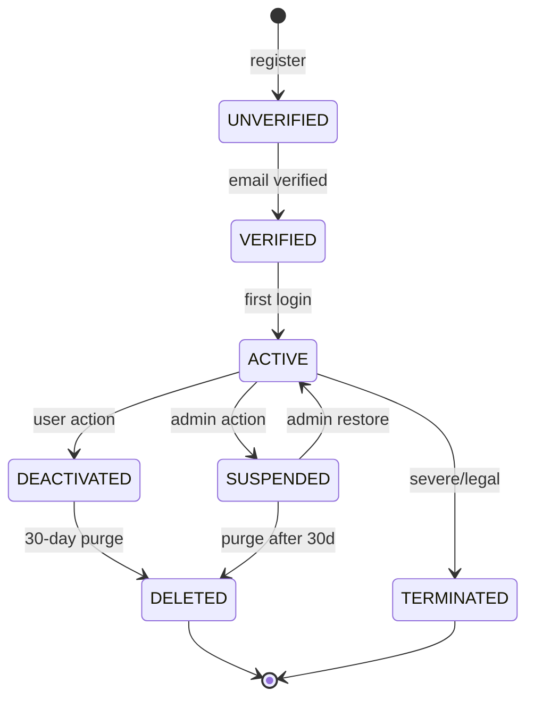
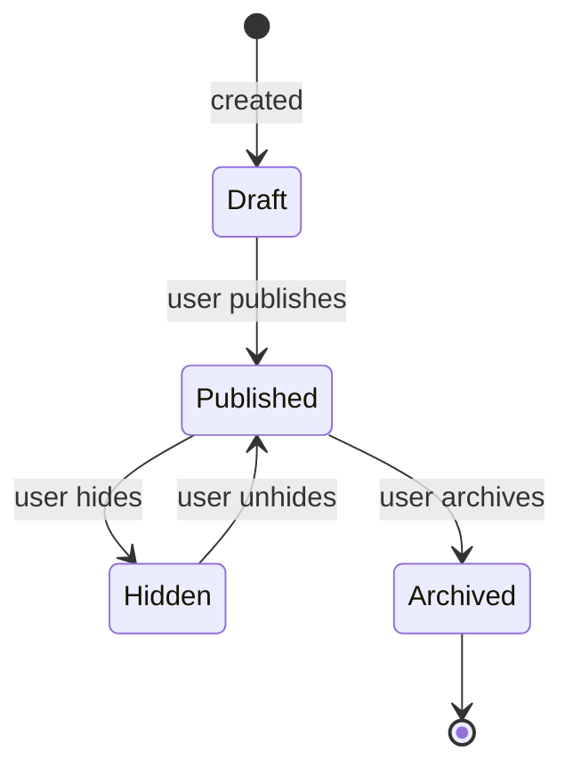
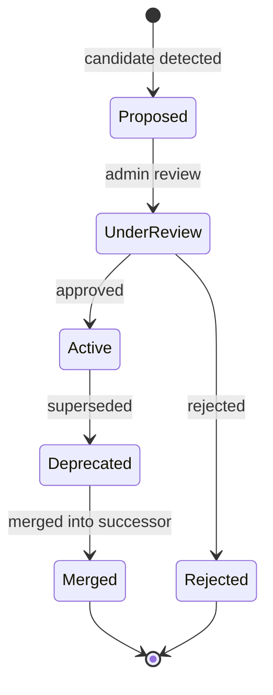
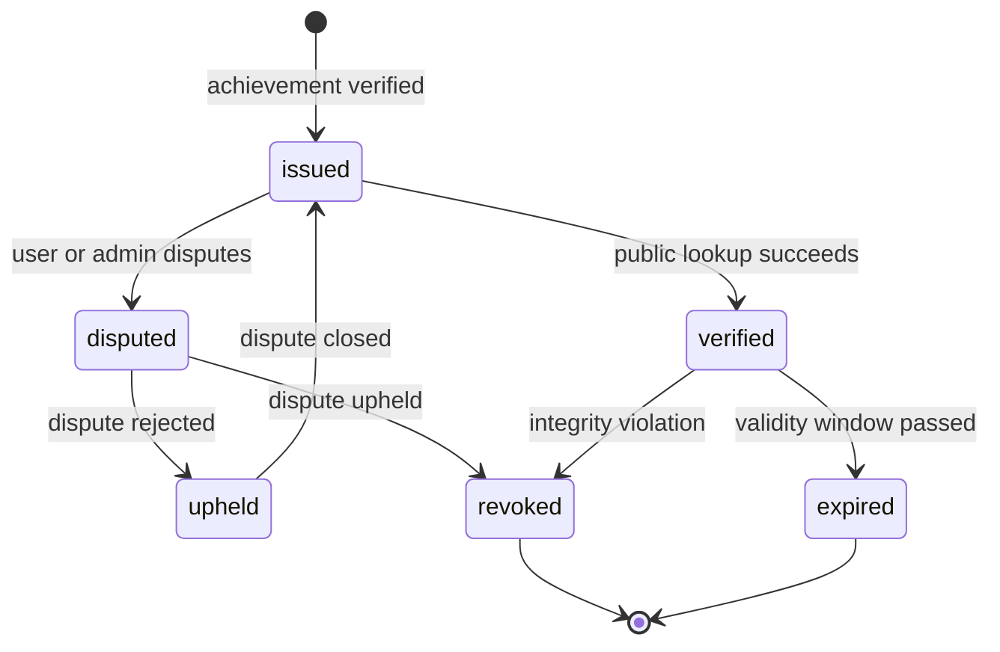

# TalentSphere — FEATURE_REGISTRY.md v6.0

## Authority

This file contains the canonical 173-feature identity/register and preserves the source-level detailed feature corpus. Implementation status is **GREENFIELD / UNVERIFIED** unless current executable evidence is attached.

## Portfolio rule

173 features = capability inventory, not a promise of simultaneous GA scope.

## Canonical register

### 6.1 Baseline & Core Features (F-01 … F-120)

| ID | Feature | Category | P | Phase | Key dependencies |
|---|---|---|---|---|---|
| F-01 | Authentication & Session | Identity | 10 | Ph0 | – |
| F-02 | Landing Page | Shell | 3 | Ph0 | – |
| F-03 | Dashboard (Role-Adaptive) | Shell | 10 | Ph0 | F-01 |
| F-04 | Job Marketplace | Marketplace | 9 | Ph2 | F-01, F-12 |
| F-05 | Post Job Studio | Marketplace | 8 | Ph2 | F-04 |
| F-06 | ATS / Candidate Pipeline | Recruiting | 9 | Ph2–3 | F-04, F-05 |
| F-07 | Learning Management System | Learning | 9 | Ph1 | F-01, F-12 |
| F-08 | Challenges Arena | Assessment | 9 | Ph1 | F-01, F-12 |
| F-09 | Professional Networking | Social | 8 | Ph2 | F-12 |
| F-10 | Direct Messaging | Communication | 10 | Ph0 | F-01 |
| F-11 | AI Career Assistant (Basic) | AI | 8 | Ph1/Ph4 | F-12 |
| F-12 | Profile Management | Identity | 10 | Ph0 | F-01 |
| F-13 | Resume Builder | Identity | 7 | Ph1 | F-12 |
| F-14 | Notification Center | Communication | 10 | Ph0 | F-01 |
| F-15 | Settings | Shell | 10 | Ph0 | F-01 |
| F-16 | Billing & Subscriptions | Monetization | 7 | Ph5 | F-01 |
| F-17 | Admin Console | Governance | 10 | Ph0 | F-01 |
| F-18 | Chrome Extension Companion | Edge | 5 | Ph2 | F-01 |
| F-19 | Product Analytics | Telemetry | 7 | Ph1 | F-01 |
| F-20 | Command Search (⌘K) | Shell | 7 | Ph2 | F-01 |
| F-21 | Error Recovery & Resilience | Shell | 10 | Ph0 | F-01 |
| F-22 | Gamification & XP Ledger | Engagement | 8 | Ph1 | F-07, F-08 |
| F-23 | Leaderboard & Badges | Engagement | 7 | Ph2 | F-22 |
| F-24 | Trust, Safety & Moderation | Safety | 8 | Ph2 | F-01 |
| F-25 | Job Detail View | Marketplace | 7 | Ph2 | F-04 |
| F-26 | Portfolio Showcase | Identity | 8 | Ph1 | F-12 |
| F-27 | Local Resume Match Preview | Edge | 6 | Ph2 | F-18 |
| F-28 | External Job Page Scanner | Edge | 6 | Ph2 | F-18 |
| F-29 | Scheduled Notification Digest | Communication | 7 | Ph2 | F-14 |
| F-30 | Networking Stale-Request Nudges | Engagement | 6 | Ph2 | F-09 |
| F-31 | KPI Aggregation & Rollups | Analytics | 6 | Ph2 | F-19 |
| F-32 | Saved Searches & Job Alerts | Candidate | 7 | Ph2 | F-04 |
| F-33 | Video Interview Rooms | Communication | 8 | Ph3 | F-10 |
| F-34 | Multi-Entity Backend Search | Platform | 7 | Ph2 | F-04, F-07 |
| F-35 | Feature Flag Console | Administration | 6 | Ph2 | F-17 |
| F-36 | Application Draft Autosave | Candidate | 7 | Ph1 | F-04 |
| F-37 | Job Templates | Recruiting | 6 | Ph2 | F-05 |
| F-38 | Legacy Chat Service (DEPRECATED) | Communication | 0 | – | – |
| F-39 | Unified Backend Stub (DEPRECATED) | Platform | 0 | – | – |
| F-40 | Institutional Managed Learning | Institutions | 8 | Ph3 | F-01, F-07 |
| F-41 | Procurement & Seat Licensing | Institutions | 6 | Ph6 | F-40, F-16 |
| F-42 | Provider-Agnostic Media Engine | Platform | 8 | Ph2 | F-07 |
| F-43 | B2B2C Graduation Flywheel | Institutions | 6 | Ph3 | F-40 |
| F-44 | AI Media Enrichment | Learning | 6 | Ph4 | F-42, F-11 |
| F-45 | Proctoring (Third-Party, vendor-gated OD-35) | Learning | 4 | Ph10 | F-40, F-115 |
| F-46 | Institutional Analytics | Institutions | 6 | Ph3 | F-40 |
| F-47 | Faculty Dashboard | Institutions | 6 | Ph3 | F-40 |
| F-48 | OS Shell & Workbench | OS | 4 | Ph2+ | F-01, F-03 |
| F-49 | Automation & Agents | OS | 4 | Ph3+ | F-48 |
| F-50 | Institutional Course Marketplace | Institutions | 6 | Ph3 | F-40, F-42 |
| F-51 | Media Health Monitoring | Platform | 6 | Ph4 | F-42 |
| F-52 | Certificate Verification | Verification | 8 | Ph3 | F-07 |
| F-53 | Professional Social Graph & Feed | Networking | 5 | Ph8 | F-12 |
| F-54 | Content Publishing | Networking | 5 | Ph8 | F-12 |
| F-55 | Groups & Communities | Community | 5 | Ph8 | F-53 |
| F-56 | Organization & Institution Pages | Recruiting | 5 | Ph8 | F-12, F-40 |
| F-57 | Events & Webinars | Community | 5 | Ph8 | F-53 |
| F-58 | Written Recommendations | Networking | 6 | Ph8 | F-53 |
| F-59 | Outreach Credits (TalentMail) | Recruiting | 5 | Ph8 | F-10 |
| F-60 | Profile Views & Privacy Controls | Networking | 6 | Ph8 | F-12 |
| F-61 | Premium Candidate Tier (OD-34 gated) | Business | 4 | Ph10+ | F-60 |
| F-62 | Sponsored Content (NOT RECOMMENDED) | Business | 0 | Ph10+ | – |
| F-63 | Business-Development Graph (NOT RECOMMENDED) | Intelligence | 0 | Ph10+ | – |
| F-64 | LinkedIn Migration Engine | Integration | 5 | Ph1/2 | F-12 |
| F-65 | LinkedIn Decoupling & Independence | Foundation | 8 | Ph1/2 | F-64 |
| F-66 | Course Creation Studio | Learning | 8 | Ph7 | F-07, F-42 |
| F-67 | Categories, Discovery & Comparison | Learning | 6 | Ph7 | F-07, F-145 |
| F-68 | Quizzes, Practice Tests & Final Exams | Learning | 8 | Ph7 | F-07 |
| F-69 | Assignments & Peer Review | Learning | 8 | Ph7 | F-07 |
| F-70 | Learning Paths, Programs & Specializations | Learning | 8 | Ph7 | F-07, F-66 |
| F-71 | Course Q&A, Discussions, Notes | Learning | 6 | Ph7 | F-07 |
| F-72 | Course Reviews & Ratings | Learning | 6 | Ph7 | F-07 |
| F-73 | Course Commerce | Learning | 6 | Ph7 | F-07, F-16 |
| F-74 | Instructor Platform | Learning | 6 | Ph7 | F-07, F-66 |
| F-75 | Employer Insights | Intelligence | 7 | Ph9 | F-12, F-56 |
| F-76 | Coding Contests & Live Leaderboards | Assessment | 5 | Ph9 | F-08 |
| F-77 | Skill Certification Exams | Assessment | 8 | Ph3 | F-08 |
| F-78 | Practice Sets & Interview Prep | Learning | 5 | Ph9 | F-08 |
| F-79 | Articles & Newsletters | Networking | 5 | Ph8 | F-54 |
| F-80 | Profile Enhancements | Profile | 6 | Ph1/Ph8 | F-12 |
| F-81 | Identity Verification | Verification | 3 | Ph9 | F-12 |
| F-82 | Student Learning Analytics | Analytics | 6 | Ph7 | F-07 |
| F-83 | Admin Platform Expansion | Administration | 3 | Ph8 | F-17 |
| F-84 | Skills Graph & Taxonomy | Platform | 10 | Ph1–2 | F-12, F-07, F-08 |
| F-85 | Career Graph & Progression | Intelligence | 9 | Ph3 | F-12, F-04, F-06, F-84 |
| F-86 | Salary Intelligence | Intelligence | 9 | Ph3 | F-04, F-06, F-56 |
| F-87 | Interview Experience Repository | Candidate | 7 | Ph4 | F-04, F-56, F-88 |
| F-88 | Technical Interview Platform | Hiring | 9 | Ph3 | F-08, F-33, F-06 |
| F-89 | Contribution Verification System | Verification | 5 | Ph8 | F-26, F-12 |
| F-90 | Peer Mentorship & Advisor Network | Community | 5 | Ph4 | F-12, F-10, F-55 |
| F-91 | Career Readiness Assessment | Career | 9 | Ph2 | F-84, F-08, F-12 |
| F-92 | Advanced Recruiter Search | Recruiting | 9 | Ph3 | F-12, F-34, F-08, F-96 |
| F-93 | Interview Video Recording & AI Feedback | Hiring | 7 | Ph4 | F-33, F-06, F-88 |
| F-94 | Verified Work History & References | Verification | 7 | Ph3 | F-12, F-58 |
| F-95 | Career Transition Planning | Career | 7 | Ph4 | F-84, F-91, F-07 |
| F-96 | Skill Evidence & Digital Credentials | Verification | 10 | Ph2 | F-12, F-26 |
| F-97 | Real-Time Job Market Analytics | Intelligence | 5 | Ph4 | F-04, F-06 |
| F-98 | Employer Equity & Compensation Intelligence | Intelligence | 7 | Ph3 | F-56, F-86 |
| F-99 | AI Career Coach (Enhanced) | AI | 7 | Ph4 | F-12, F-84, F-91, F-07 |
| F-100 | Peer Project Collaboration | Learning | 4 | Ph5 | F-07, F-69, F-10 |
| F-101 | Badge Marketplace & Recognition | Gamification | 4 | Ph8 | F-23, F-26 |
| F-102 | Hiring Manager Portal | Recruiting | 8 | Ph3 | F-06, F-88 |
| F-103 | Candidate Comparison & Rubric | Recruiting | 6 | Ph3 | F-06, F-92 |
| F-104 | Pre-Hire Assessment Customization | Hiring | 7 | Ph3 | F-06, F-08, F-88 |
| F-105 | Post-Hire Analytics & ROI Tracking | Analytics | 4 | Ph4 | F-102, F-93 |
| F-106 | Skill Prerequisite Engine | Learning | 7 | Ph5 | F-07, F-70, F-84 |
| F-107 | Live Q&A with Instructors | Learning | 6 | Ph5 | F-07, F-71, F-10 |
| F-108 | Expert Network Matching | Networking | 4 | Ph7 | F-09, F-12, F-10 |
| F-109 | Salary Negotiation Guidance | Career | 5 | Ph8 | F-86, F-98 |
| F-110 | Verified Skill Endorsements | Verification | 7 | Ph8 | F-96, F-12, F-58 |
| F-111 | Industry-Specific Learning Hubs | Learning | 4 | Ph8 | F-07, F-55 |
| F-112 | Resume Parsing & Optimization | Candidate | 6 | Ph8 | F-13, F-12 |
| F-113 | Recruiter Outreach Analytics | Recruiting | 6 | Ph8 | F-59, F-06 |
| F-114 | Learning Impact Tracking | Analytics | 9 | Ph4 | F-07, F-04, F-06 |
| F-115 | Certification Exam Platform | Assessment | 9 | Ph3 | F-77, F-45 |
| F-116 | Accessibility & Inclusive Learning | Platform | 7 | Ph8 | F-07, F-44 |
| F-117 | Mobile-First Job Application | Candidate | 5 | Ph8 | F-04, F-33 |
| F-118 | Emerging Skills Detection | Intelligence | 4 | Ph8 | F-84 |
| F-119 | Diversity & Inclusion Analytics | Hiring | 4 | Ph8 | F-06 |
| F-120 | API & Integration Platform | Platform | 2 | Ph10 | F-01, F-34 |

### 6.2 v2.1 Integration Family (F-121 … F-143) — preserved numbering

| ID | Feature | Category | P | Phase | Key dependencies |
|---|---|---|---|---|---|
| F-121 | Warm Introduction Paths | Networking | 8 | Ph4 | F-09, F-12, F-56, F-125 |
| F-122 | Application Feedback Loop | Jobs | 9 | Ph3 | F-06, F-04 |
| F-123 | Skill Decay Tracking (Freshness Engine) | Verification | 9 | Ph3 | F-84, F-96 |
| F-124 | Project Marketplace | Learning | 5 | Ph5 | F-07, F-26, F-100 |
| F-125 | Alumni Networks | Networking | 7 | Ph4 | F-12, F-09, F-40 |
| F-126 | Interview Prep Marketplace | Careers | 5 | Ph4 | F-87, F-90, F-88 |
| F-127 | Company Culture Assessment | Companies | 4 | Ph5 | F-56, F-75 |
| F-128 | Offer Comparison Tool | Careers | 7 | Ph4 | F-86, F-98, F-109 |
| F-129 | Leadership Development | Learning | 3 | Ph5 | F-07, F-84 |
| F-130 | Freelance Marketplace | Jobs | 3 | Ph7 | F-04, F-100, F-124 |
| F-131 | Apprenticeship Matching | Jobs | 3 | Ph6 | F-04, F-40 |
| F-132 | Scholarship Discovery | Learning | 3 | Ph6 | F-40, F-07 |
| F-133 | Volunteer Matching | Community | 2 | Ph7 | F-26, F-100 |
| F-134 | Code Review Practice | Skills | 4 | Ph5 | F-08, F-26 |
| F-135 | System Design Practice | Skills | 4 | Ph5 | F-88, F-08 |
| F-136 | Micro-Learning | Learning | 2 | Ph4 | F-07, F-42 |
| F-137 | Spaced Repetition | Learning | 2 | Ph6 | F-07, F-68 |
| F-138 | Study Accountability Partners | Learning | 3 | Ph6 | F-07, F-55 |
| F-139 | Local Communities & Meetups | Networking | 3 | Ph7 | F-09, F-55, F-57 |
| F-140 | Affinity Groups | Community | 3 | Ph7 | F-55, F-09 |
| F-141 | Onboarding Preparation | Careers | 1 | Ph8 | F-06, F-33 |
| F-142 | Referral Request System | Jobs | 8 | Ph4 | F-09, F-04 |
| F-143 | OSS Contribution Discovery | Portfolio | 4 | Ph8 | F-89, F-26 |

### 6.3 Gap-Analysis Family (F-144 … F-173) — renumbered (former F-121 … F-150)

| ID | Feature | Category | P | Phase | Key dependencies |
|---|---|---|---|---|---|
| F-144 | Reputation Engine (multi-context) | Platform | 9 | Ph2 | F-96, F-58, F-72 |
| F-145 | Recommendation Engine Core | Platform | 8 | Ph2–3 | F-84, F-144 |
| F-146 | Activity & Contribution Tracking | Platform | 7 | Ph3 | F-123, F-84, F-144 |
| F-147 | Unified Search & Discovery | Platform | 8 | Ph2 | F-84, F-145 |
| F-148 | Instructor Reputation System | Reputation | 8 | Ph7 | F-72, F-144 |
| F-149 | Employer Reputation & Brand System | Reputation | 7 | Ph8 | F-75, F-56, F-144 |
| F-150 | Peer Credibility Networks | Reputation | 7 | Ph8 | F-110, F-144 |
| F-151 | Skill Supply/Demand Forecasting | Intelligence | 7 | Ph4 | F-84, F-86, F-97 |
| F-152 | Career Trajectory Analysis | Intelligence | 7 | Ph4 | F-85, F-86, F-93 |
| F-153 | Learning Impact Dashboard (Enhanced) | Intelligence | 7 | Ph4 | F-114, F-85, F-86 |
| F-154 | Interview Prediction & Benchmarking | Intelligence | 6 | Ph4 | F-88, F-102, F-105 |
| F-155 | Adaptive Learning System | Personalization | 6 | Ph5 | F-07, F-84, F-145 |
| F-156 | Professional Development Plan System | Career | 6 | Ph4–5 | F-91, F-95, F-145 |
| F-157 | Skills Co-Learning Path Optimizer | Learning | 4 | Ph5 | F-84, F-114, F-07 |
| F-158 | Talent Pool Intelligence & Analytics | Recruiting | 6 | Ph3 | F-92, F-84, F-144 |
| F-159 | Behavioral Talent Discovery | Discovery | 6 | Ph4 | F-123, F-84, F-144 |
| F-160 | Talent Segmentation & Classification | Analytics | 5 | Ph4 | F-84, F-85, F-144 |
| F-161 | Internal Mobility & Succession Platform | Enterprise | 3 | Ph6–7 | F-84, F-91, F-132 |
| F-162 | Verified Work History Network & Graph | Verification | 5 | Ph4 | F-94, F-84 |
| F-163 | Credential Wallet & Portability | Credential | 3 | Ph5 | F-96 |
| F-164 | Skills Evidence Narrative & Storytelling | Credential | 4 | Ph5 | F-96, F-26 |
| F-165 | Diversity, Equity & Inclusion Data System | Analytics | 3 | Ph8 | F-119 |
| F-166 | Interview Performance Benchmarking | Analytics | 5 | Ph4 | F-88, F-102 |
| F-167 | Candidate Comparison & Rubric (Enhanced) | Hiring | 5 | Ph3 | F-88, F-103 |
| F-168 | Hiring Prediction & Success Modeling | Analytics | 3 | Ph5 | F-88, F-105 |
| F-169 | Community Contribution Scoring & Recognition | Community | 5 | Ph7 | F-55, F-144 |
| F-170 | Expert Network (Enhanced) | Community | 4 | Ph7 | F-144, F-90 |
| F-171 | Employer Brand Management System | Company | 3 | Ph8 | F-56, F-75, F-149 |
| F-172 | Advanced Compensation Intelligence | Analytics | 4 | Ph8 | F-86, F-98, F-109 |
| F-173 | Company-to-Skills Mapping | Intelligence | 3 | Ph4 | F-84, F-04 |

### 6.4 Distribution Summary

## Detailed feature contracts

The inherited source contains detailed contracts for high-leverage features. Those detailed records remain part of the canonical source corpus; their global rules are governed by v6 SSOT amendments.

## 9. Detailed Feature Specifications

The detailed records below cover the highest-leverage features first. The 173-feature register in §7 remains the complete inventory; this section supplies deeper canonical behavior for priority foundation/core features without redefining their identities.

### F-01 Authentication & Session

| Attribute | Value |
|---|---|
| **Feature ID** | F-01 |
| **Priority** | 10 |
| **Phase** | Ph0 |
| **Purpose** | Establish and maintain authenticated user sessions with role claims |
| **Business Objective** | Enable secure identity for all platform interactions |
| **User Problem Solved** | Users need a secure, frictionless way to access the platform |
| **Actors** | Anonymous visitor, Candidate, Recruiter, Admin, Institution Admin |
| **Preconditions** | Supabase Auth configured; RLS baseline migrations applied |
| **Postconditions** | Authenticated session with normalized role claims |

**Core Behavior (Step-by-Step):**

1. **Registration** — User submits email + password (or OAuth via Google/GitHub). Server validates: unique email (`auth.users.email`), password strength (zxcvbn ≥3), age gate (DOB ≥16 years), no banned email domain. On success: `auth.users` row created → trigger `on_auth_user_created` inserts `profiles` + `user_settings` → verification email sent via Resend → user lands on onboarding wizard.
2. **Email Verification** — User clicks tokenized link (TTL 24h, single-use). `profiles.email_verified_at` set. Account state → VERIFIED.
3. **Login** — User submits credentials. Rate limit enforced (10/min/IP for login; 5/min/IP for password reset). On success: Supabase Auth issues JWT (1h access, 30-day sliding refresh) + refresh token. Session cookie set: `sb-access-token` (HttpOnly, Secure, SameSite=Lax).
4. **Role Normalization** — Edge middleware reads JWT `app_metadata.role` and normalizes to `ROLE_USER` / `ROLE_RECRUITER` / `ROLE_ADMIN`. Missing/invalid role → default `ROLE_USER`.
5. **Session Restore** — On page load, client checks cookie. If expired, silent refresh attempt. If refresh fails, redirect to `/login` with `?return=` param. Partial session cleared on fatal auth error.
6. **Logout** — Server revokes JWT via `jti` denylist. Cookie cleared. Redirect to `/`.
7. **Password Reset** — User submits email → rate limited (5/min/IP). Tokenized link sent (TTL 30 min, single-use). On submission: new password validated → session revoked globally → user re-authenticated.
8. **OAuth Flow** — Google/GitHub: PKCE exchange → Supabase Auth callback → profile merged with existing email if match (no silent account takeover; consent prompt if email collision).

**Business Rules:** BR-001 (auth required), BR-002 (role separation), AUTH-001..017

**Permissions:** Public: register/login/reset · Authenticated: logout/refresh/change password · Admin: revoke any session

**Data Dependencies:** `auth.users` (Supabase-managed), `profiles`, `user_settings`, `audit_logs`

**API Dependencies:** `POST /api/v1/auth/register`, `POST /api/v1/auth/login`, `POST /api/v1/auth/reset-password`, `POST /api/v1/auth/logout` (SCI-04)

**UI Dependencies:** `/login`, `/register`, `/forgot-password`, `/reset-password`, `/verify-email`

**External Dependencies:** Supabase Auth (GoTrue), Resend (transactional email), Google OAuth, GitHub OAuth

**Security Requirements:** HDN-008 (rate limits, lockout, jti denylist) · HDN-014 (TLS, no plaintext credentials) · MFA readiness (AUTH-008) · age gate (AUTH-017)

**Failure Modes:**
- OAuth provider unavailable → fallback to email/password login (visible message)
- Email provider down → queue verification email; show "pending" state
- Supabase Auth outage → redirect to maintenance page with honest status

**Edge Cases:**
- Multi-tab session collision → last-write-wins with warning toast
- JWT clock skew >30s → reject with "check your system clock"
- Duplicate OAuth email (GitHub vs Google) → merge prompt, never silent

**Analytics Events:** EVT-001 `user_registered`, EVT-002 `session_active`

**Notifications:** Welcome email (immediate) · Verification email (immediate) · Password reset email (immediate) · Suspicious login alert (immediate, post-MVP)

**State Machine:**



**Acceptance Criteria:**
- Login p95 latency <300ms
- 100% duplicate email rejection
- 100% weak password rejection
- Zero plaintext secrets in client bundle
- Rate limits enforced at edge
- Age gate blocks <16

**Test Requirements:** Unit (password policy, email normalization) · Integration (register→verify→login E2E) · RLS (own-row isolation) · Security (rate limits, lockout) · Accessibility (form keyboard nav)

**Feature Dependencies:** None (foundation)

---

### F-12 Profile Management

| Attribute | Value |
|---|---|
| **Feature ID** | F-12 |
| **Priority** | 10 |
| **Phase** | Ph0 |
| **Purpose** | Canonical professional identity record |
| **Problem Solved** | No single source of truth for candidate identity |
| **Actors** | Candidate, Recruiter, Admin |

**Core Behavior (Step-by-Step):**

1. **Profile Auto-creation** — On `auth.users` insert, trigger creates `profiles` row with `id` (FK to auth.users), `email`, `role` (from JWT), `created_at`.
2. **Basic Info Edit** — User navigates to `/profile`. Form fields: `full_name` (required, ≤120 chars), `headline` (≤120), `summary` (≤2000, sanitized markdown), `location` (city-level), `avatar_url` (upload ≤4MB, JPEG/PNG/WebP, MIME sniffed, EXIF stripped), `phone_number` (encrypted at rest AES-256-GCM, masked on public view).
3. **Skills Management** — User adds skills via typeahead from canonical skills taxonomy (F-84). Each entry: `skill_id`, `proficiency` (Beginner/Intermediate/Advanced/Expert), `years` (optional), `self_reported` (boolean — becomes verified upon platform signal).
4. **Experience** — CRUD on `profile_experience` rows: `role`, `company`, `start_date`, `end_date` (nullable for current), `description` (≤2000 sanitized markdown), `location`. Company name validated against `organizations` table when possible.
5. **Education** — CRUD on `profile_education`: `institution`, `degree`, `field_of_study`, `start_year`, `end_year`, `grade` (optional). Institution matched against known list when possible.
6. **Certifications** — CRUD on `profile_certifications`: `title`, `issuer`, `issue_date`, `expiry_date` (optional), `credential_id`, `credential_url` (HTTPS-only). Verification status flag.
7. **Portfolio** — CRUD on `profile_portfolios`: `title`, `description`, `demo_url`, `repo_url`, `media_assets` (images/PDFs ≤50MB), `tech_stack` (canonical skills). Public visibility toggle.
8. **Completeness Score** — Recomputed on every edit. Formula: weighted sum of filled sections (basic 20%, skills 15%, experience 20%, education 15%, certifications 10%, portfolio 10%, summary 10%). Score 0–100.
9. **Visibility Toggles** — Per-section control: `public` / `connections_only` / `recruiters_only` / `private`.
10. **Public View** — `/profile/[userId]` renders public-safe columns only. PII columns (`phone_number`, `tax_id`) never exposed.
11. **Data Residency** — `data_residency_region` set at signup from locale (US/EU). Gates AI routing.

**Business Rules:** BR-005 (own-edit only), BR-061 (≥70% completeness for job applications), PROFILE-001..035

**Permissions:** Own-row edit only. Admin can edit any. Public read of public-safe columns.

**Data Dependencies:** `profiles`, `profile_skills`, `profile_experience`, `profile_education`, `profile_portfolios`, `profile_certifications`, `profile_media`, `career_signals`, `user_settings`

**API Dependencies:** `GET /api/v1/profile`, `PUT /api/v1/profile`, `POST /api/v1/profile/resume/parse`, `POST /api/v1/profile/portfolio`, `GET /api/v1/profile/{userId}/public`

**UI Dependencies:** `/profile`, `/profile/[userId]`, resume upload drawer, portfolio gallery, skills taxonomy typeahead

**External Dependencies:** Supabase Storage, HaveIBeenPwned (password breach check), AI service (resume parsing)

**Security Requirements:** RLS own-row + public-safe view · Field-level encryption (phone_number, tax_id) · XSS sanitization on rich text · Upload pipeline

**Failure Modes:**
- Resume parse failure → manual entry fallback with error toast
- File upload failure → retry with resume, no partial save
- Public view permission denied → 404-equivalent (no existence leak)

**Edge Cases:**
- Concurrent edit collision → optimistic concurrency via `version` column; 409 on conflict
- Empty profile on first login → onboarding wizard with guided steps
- Deleted company in experience → graceful degradation, keep text
- Vanity slug collision → suggest alternatives, block reserved words

**Analytics Events:** EVT-003 `profile_completed`, EVT-004 `resume_uploaded`, EVT-005 `verified_signal_added`

**Notifications:** Profile completeness nudges (weekly digest if <70%) · Verification badge unlocked (immediate)

**State Machine:** (Profile itself is stateful only for visibility)



**Acceptance Criteria:**
- Profile save p95 <250ms
- Public view never exposes PII columns
- Completeness score 100% reproducible
- Avatar upload succeeds for supported formats only
- Concurrent edit returns 409 with clear message

**Test Requirements:** Unit (validation, completeness formula) · Integration (CRUD + RLS) · E2E (J-01 profile build) · Contract (resume parser adapter) · A11y (form keyboard, screen reader)

**Feature Dependencies:** F-01 · **Blocks:** All domain features

---

### F-84 Skills Graph & Taxonomy System ★

| Attribute | Value |
|---|---|
| **Feature ID** | F-84 |
| **Priority** | 10 |
| **Phase** | Ph1–2 |
| **Purpose** | Canonical semantic model of skills: relationships, prerequisites, correlations, market demand |
| **Problem Solved** | Recommendations, matching, and career guidance are impossible without understanding skill relationships |
| **Actors** | Platform Admin (taxonomy curation), all users (read), recommendation engine (read), instructors (tag content) |
| **Preconditions** | Profile (F-12), LMS (F-07), Arena (F-08) exist |
| **Postconditions** | Every course, challenge, job, and profile references canonical skills |

**Core Behavior (Step-by-Step):**

1. **Taxonomy Curation (Admin)** — Platform Admin manages the canonical `skills` table: create, edit, deprecate, merge (with redirect map). Each skill: `id`, `canonical_name`, `slug`, `category` (nested ≤3 levels), `description`, `aliases` (array), `status` (active/deprecated), `created_at`. Target: 2,000+ skills at scale.
2. **Skill Relationships (Admin + Computed)** — `skill_relationships` table edges:
   - `prerequisite_of` — directional, acyclic (validated at write)
   - `subskill_of` — hierarchical decomposition
   - `supersedes` — replacement (deprecated → current)
   - `complements` — bidirectional co-occurrence
   - `correlates_with` — bidirectional, computed statistically (never manual)
3. **Content Tagging** — Every course, module, lesson, challenge, job, portfolio project, and user skill entry references a canonical `skill_id`. No freeform skill strings allowed (BR-144).
4. **Market Signal Collection** — Daily job aggregation: `skill_market_signals` table tracks per skill: `demand_index`, `salary_premium`, `growth_rate`, `region`, `window_start`, `window_end`. Aggregated from job postings, salary reports, and hiring outcomes.
5. **Graph Traversal** — Read operations:
   - **Skill gap** — Given target skill, traverse `prerequisite_of` backwards to find unmet prerequisites
   - **Related skills** — Given skill, traverse `correlates_with` edges (top N by weight)
   - **Role readiness** — Given role (job family), aggregate required skills; compute candidate overlap
   - **Path suggestion** — Dijkstra-style shortest path from candidate's skills → target role's required skills
6. **Emerging Skills Detection** — Weekly computation (F-118 dependency): new skill candidates from job postings with `occurrence_count ≥5` in the last 30 days but not in taxonomy → candidate queue for admin review.
7. **Search & Typeahead** — Full-text search over `canonical_name` + `aliases`. Used in profile, course, job, and challenge forms.
8. **Public API** — `GET /api/v1/skills/{id}` returns skill + relationships + market signals (public read). `GET /api/v1/skills/search?q=` for typeahead.
9. **Caching** — Read-heavy; cache hot skills (top 500 by traversal count) in memory with 15-min TTL. Invalidation on taxonomy write.

**Business Rules:** BR-141..BR-148
- BR-141: Curated by Platform Admin; no user creation of canonical skills
- BR-142: Relationships directional
- BR-143: Correlations computed, not manual
- BR-144: All tagging references canonical skill
- BR-145: Market signals update daily
- BR-146: Traversal depth bounded (max 5 hops)
- BR-147: `prerequisite_of` acyclic (validated)
- BR-148: Emerging skills require ≥5 independent signals before promotion

**Permissions:** Public read. Admin write. Instructor/Course Author can propose skill tags (subject to moderation).

**Data Dependencies:** `skills`, `skill_relationships`, `skill_market_signals`, `course_skills`, `challenge_skills`, `job_skills`, `profile_skills`, `portfolio_skills`

**API Dependencies:** SCI-35 (Skill CRUD, relationship CRUD, market signal query, traversal), SCI-45 (emerging skill proposal), SCI-46 (relationship validation)

**UI Dependencies:** Admin taxonomy manager · Typeahead components · Skill detail card (shows relationships, market signals) · Skill gap visualizer

**External Dependencies:** None required. Optional: licensed market data feed (OD-46).

**Security Requirements:** Public read of taxonomy · Admin-only writes · No PII in graph · RLS enforced on tagging tables · Rate limits on search API

**Failure Modes:**
- Taxonomy read failure → fallback to cached top 500
- Traversal cycle detected (data corruption) → alert + refuse traversal, log incident
- Market signal computation fails → serve last-known-good data with staleness banner

**Edge Cases:**
- Admin merges two skills → all references updated transactionally, redirect map retained
- Skill deprecated mid-course → course continues, skill tag shows "deprecated" badge
- Path traversal exceeds depth → return partial result with caveat
- Correlated skill with low sample count → hide until minimum threshold

**Analytics Events:** `skill_searched`, `skill_relationship_traversed`, `skill_tagged`, `emerging_skill_promoted`, `skill_merged`

**Notifications:** Admin digest of emerging skills (weekly) · Taxonomy change alerts to instructors with affected courses

**State Machine (Skill):**



**Acceptance Criteria:**
- Skill search p95 <100ms (cached)
- Traversal p95 <200ms for depth ≤3
- 100% of course/challenge/job skill tags reference canonical skills
- Zero cycles in `prerequisite_of` graph
- Market signal updates daily (measure via scheduler)
- Typeahead returns relevant results for common typos

**Test Requirements:**
- Unit: traversal algorithms, cycle detection, merge logic
- Integration: CRUD, RLS on tagging tables, market signal computation
- E2E: admin curates taxonomy → instructor tags course → learner typeahead shows skill
- Contract: skill API schema, adapter pattern
- Performance: traversal under load (10k concurrent)
- Data: graph integrity checks (cycles, orphans, unreferenced skills)

**Feature Dependencies:** F-12, F-07, F-08 · **Blocks:** F-91, F-95, F-99, F-106, F-114, F-118

---

### F-96 Skill Evidence & Digital Credentials ★

| Attribute | Value |
|---|---|
| **Feature ID** | F-96 |
| **Priority** | 10 |
| **Phase** | Ph2 |
| **Purpose** | Cryptographic, auditable proof of skill via projects, assessments, work history, peer review |
| **Problem Solved** | LinkedIn endorsements are gamed; platform needs verified evidence |
| **Actors** | Candidate (evidence contributor), Instructor/Peer (verifier), Recruiter (verifier), Employer (consumer) |

**Core Behavior (Step-by-Step):**

1. **Evidence Types** — Every credential belongs to one of:
   - `course_completion` — from LMS with ≥70% final grade
   - `challenge_pass` — from Arena with verified score
   - `certification` — from exam platform (F-115)
   - `project_submission` — from portfolio with peer/instructor review
   - `work_history` — employer-confirmed
   - `endorsement` — peer skill verification (weighted by endorser credibility)
   - `contribution` — GitHub/GitLab commit verification (F-89)
2. **Credential Issuance** — When an evidence source triggers (e.g., course completion event), the system:
   - Creates `verified_credentials` row: `id`, `user_id`, `skill_id`, `evidence_type`, `evidence_source_id`, `issued_at`, `verification_hash` (SHA-256), `status` (issued)
   - Creates `credential_evidence` rows linking to underlying artifacts (course enrollment, submission, etc.)
   - Publishes public verification URL: `/verify/{hash}`
   - Updates `profiles.xp_balance` if applicable
   - Emits `EVT-005 verified_signal_added` (if first signal)
3. **Credential Verification (Public)** — `GET /verify/{hash}` returns: holder name (first name + last initial for privacy), skill, evidence type, issuer, issue date, status. Never exposes full profile or PII.
4. **Credential Revocation** — Admin-only action (academic integrity violation, employer retraction, etc.). Revocation creates a new record with `revoked_at` + `revocation_reason`. Original row retained (append-only). Public URL shows "INVALID" state. XP clawback logged.
5. **Endorsement Weighting** — When a peer endorses a skill:
   - Endorser's credential weight = `min(their_verified_reputation_score, 1.0)`
   - Relationship proximity boost: +0.2 if direct connection, +0.1 if 2nd degree
   - Final weight stored in `endorsement_weights`
   - Endorsements from unverified users (no reputation) count as 0.1 (weak signal)
6. **Evidence Display** — On profile: "Verified by TalentSphere" badge on each skill with ≥1 credential. Click expands evidence list (course, challenge, or endorsement).
7. **Portable Export** — User can export all credentials as JSON (DSR Art. 20). Export includes verification URLs.
8. **Privacy-Preserving Proof** — Optional zero-knowledge-style proof: prove skill without revealing full profile (e.g., "I have a verified Python credential" without exposing other data). Uses hash-based commitment (not true ZK, but privacy-friendly).

**Business Rules:** BR-149..BR-156
- BR-149: Append-only; revocation creates new record
- BR-150: Public verification URL, no PII
- BR-151: Evidence links immutable once issued
- BR-152: Endorsement weights from reputation + proximity
- BR-153: Anonymous endorsements prohibited
- BR-154: Appeal path with ≤7-day SLA
- BR-155: Privacy-preserving proofs allowed
- BR-156: Credential requires platform-verified achievement

**Permissions:** User: issue (via achievement), view own, export. Public: verify via hash. Admin: revoke. Peer: endorse connected users.

**Data Dependencies:** `verified_credentials`, `credential_evidence`, `endorsement_weights`, `profiles`, `xp_transactions`, `skill_endorsements`

**API Dependencies:** SCI-42 (credential CRUD, verification, revocation, endorsement), SCI-17 (certificate issue/verify from media)

**UI Dependencies:** `/verify/{hash}` public page · Profile evidence drawer · Endorsement UI · Credential export in settings

**Security Requirements:** SHA-256 hashing · Public verify endpoint rate-limited (60/min/IP) · No PII in verify response · RLS own-row for full credential list · Append-only enforcement at DB layer

**Failure Modes:**
- Hash collision (astronomically unlikely) → reject issuance, alert
- Verification endpoint unavailable → cached verification for 24h
- Endorsement spam → rate limit + reputation threshold for endorsers

**Edge Cases:**
- Credential issued, then course retroactively revoked → credential revoked with reason
- User deletes account → credentials anonymized (holder name removed), verification URL shows "deleted user"
- Dispute: "I didn't endorse this skill" → endorsement revocable by endorser within 30 days
- Recruiter needs bulk verification → API with rate limit + audit

**Analytics Events:** `credential_issued`, `credential_verified`, `credential_revoked`, `endorsement_added`, `endorsement_withdrawn`, `evidence_exported`

**Notifications:**
- Credential issued (learner, immediate)
- Credential verified by recruiter (learner, immediate, opt-in)
- Endorsement received (learner, immediate)
- Credential revoked (learner, immediate, with appeal link)

**State Machine (Credential):**



**Acceptance Criteria:**
- Credential issuance <500ms
- Public verify <200ms (cached)
- Zero PII exposure in public verify
- 100% append-only enforcement (DB grants)
- Endorsement weight computation deterministic
- Appeal resolved within 7 days SLA

**Test Requirements:**
- Unit: hash generation, weight computation, appeal logic
- Integration: issuance from each evidence source, revocation, RLS
- E2E: complete course → credential issued → recruiter verifies
- Security: hash tamper detection, PII leakage scan on verify endpoint
- Contract: verification URL schema

**Feature Dependencies:** F-12, F-26 · **Blocks:** F-89, F-92, F-94, F-110, F-115

---

## Required contract for every feature

```text
Feature ID
Name
Purpose
User value
Business value
Target roles
Dependencies
Entry points
Journey
Behavior
Rules
Inputs/outputs
States
Permissions
Data
API/events
Frontend
Backend
Integrations
Analytics
Security/privacy
Performance
Observability
Errors
Edge cases
Recovery
Tests
Acceptance
Evidence/status
Decision
Future extension
```

## Status rule

```text
PLANNED
→ IN DEVELOPMENT
→ IMPLEMENTED
→ VERIFIED
→ RELEASED
```

Alternative states:
`BLOCKED`, `DEPRECATED`, `REJECTED`.

Documentation alone cannot advance a feature to IMPLEMENTED.
