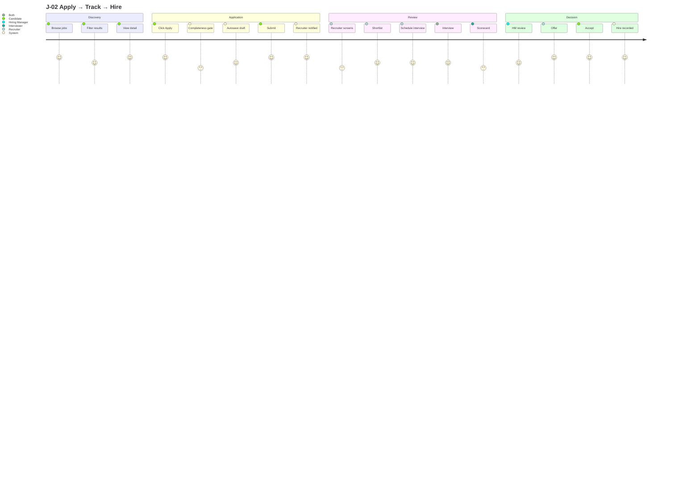

# TalentSphere — JOURNEY_REGISTRY.md v6.0

## Authority

Canonical user journeys are J-01 through J-28.

## Journey register

### 16.1 Complete Journey Register (J-01..J-28)

| ID | Name | Persona | Terminal |
|---|---|---|---|
| J-01 | Learn → Prove → Showcase | P-A, P-B | Portfolio with verified signals |
| J-02 | Apply → Track → Hire | P-A, P-B | Offer accepted |
| J-03 | Post → Source → Hire | P-C, P-E, P-S | Offer extended |
| J-04 | Org Setup → Team → Launch | P-C, P-E | First hire |
| J-05 | Profile → Network → Referral | P-A, P-B | Referred hire |
| J-06 | AI Career Path: Gap → Plan → Execute | P-B | Gaps addressed |
| J-07 | Creator: Author → Publish → Monetize | P-G | Revenue |
| J-08 | Mentor: Match → Guide → Impact | P-H | Impact measured |
| J-09 | Institution: Cohort → Place → Track | P-I | Placement reported |
| J-10 | Agency: Multi-Org → Pipeline → Bill | P-F | Client invoice |
| J-11 | Extension: Install → Local-First → Sync | P-A | Profile diff applied |
| J-12 | B2B2C Graduation Flywheel | P-I, ML | Independent candidate |
| J-13 | Institutional Media Authoring | P-G, P-K | Course assigned to batch |
| J-14 | Institutional Procurement & Licensing | P-J | Seats provisioned |
| J-15 | Faculty: Teach → Monitor → Intervene | P-K | At-risk students intervened |
| J-16 | Corporate L&D: Mandate → Track → Certify | P-L, P-T | Certification + HRIS sync |
| J-17 | LinkedIn Migration On-ramp | New user | Native account complete |
| J-18 | Creator: Author → Publish → Sell → Payout | P-G | Monthly settlement |
| J-19 | Self-Paced Learner: Discover → Certify | P-M | Path enrolled |
| J-20 | Learner: Path → Courses → Capstone → Cert | P-M | Program certificate |
| J-21 | Contestant: Register → Compete → Rank → Certify | P-Q | Certification badge |
| J-22 | Researcher: Company → Reviews → Compare → Apply | P-O | Apply started |
| J-23 | Author: Post → Engage → Article → Newsletter | P-N | Audience established |
| J-24 | Reviewer: Write → Moderate → Publish → Response | Any verified user | Published review |
| J-25 | Peer Reviewer: Assigned → Rubric Review → Feedback | Student | Grade finalized |
| J-26 | Career Switcher: Assess → Plan → Transition | P-R | Role transition confirmed |
| J-27 | Hiring Manager: Define → Assess → Hire → Track | P-S | Post-hire outcome recorded |
| J-28 | Skills Analyst: Analyze → Recommend → Measure | P-T | Learning program impact reported |

### 16.2 J-02 Apply → Track → Hire (Detailed)

### 16.3 J-26 Career Switcher (Detailed)

```mermaid
flowchart LR
    A[Target role identified] --> B[F-91 Career Readiness]
    B --> C{Skills gap?}
    C -->|Yes| D[F-95 Career Transition Plan]
    D --> E[F-84 suggests learning]
    E --> F[F-07 enroll courses]
    F --> G[F-08 challenges + F-69 assignments]
    G --> H[F-96 Skill Evidence]
    H --> I[F-85 Career Graph comparison]
    I --> J{Ready?}
    J -->|Yes| K[Apply via F-04]
    J -->|No| D
    K --> L[F-88 Interview Platform]
    L --> M[Hired + outcome tracked]
```

---

## Journey contract

Every journey must define entry conditions, actors, permissions, main path, alternate paths, failure/recovery, terminal state, analytics, observability and acceptance evidence.

## Journey status

A journey is not complete until its critical feature chain is testable end-to-end.
