# TalentSphere — SSOT.md v6.0
## Final Product, UX, Architecture, Engineering & Operations Source of Truth

**Date:** 24 September 2026  
**Implementation reality:** **GREENFIELD / 0% VERIFIED**  
**Status:** Canonical specification baseline — implementation pending verification  
**Authority:** This file is the authoritative definition of intended product/system behavior. Executable code, tests, migrations, runtime evidence and production evidence determine actual implementation status.

> **Founder directive:** Preserve valid capabilities and intent, not obsolete wording or weak technical choices. This document supersedes prior TalentSphere SSOT editions as an active specification. Older documents remain historical evidence only.

### Reality separation

```text
DOCUMENTED ≠ IMPLEMENTED
IMPLEMENTED ≠ VERIFIED
VERIFIED ≠ PRODUCTION-READY
```

A feature cannot be promoted in status because documentation says it exists.

### Evidence classes

`FACT` · `DOCUMENTED REQUIREMENT` · `IMPLEMENTED BEHAVIOR` · `EXTERNAL RESEARCH` · `FOUNDER DECISION` · `INFERENCE` · `OPEN QUESTION`


---

# CANONICAL V6 FOUNDER AMENDMENTS

This section is deliberately short and authoritative. It records only decisions that materially change or clarify the inherited detailed corpus.

## A. Architecture

1. **Initial application architecture:** React + TypeScript + Vite PWA, Node.js + Fastify + TypeScript modular monolith, PostgreSQL/Supabase.
2. **API authority:** Browser domain mutations go through the application API. RLS protects database access; it is not the sole business-logic boundary.
3. **Async:** Supabase Queues + dedicated workers for durable/heavy processing; Edge Functions for webhooks, short-lived HTTP work and bounded AI orchestration.
4. **Search:** PostgreSQL FTS/trigram until measured query/scale evidence justifies extraction.
5. **Realtime:** advisory UX transport only; persistence/state remains authoritative.
6. **Caching:** start with browser/application caching and TanStack Query; add distributed cache only when measured need exists.
7. **Shared kernel:** keep it deliberately small. AI, automation, media, analytics, trust and domain logic do not become an indiscriminate shared kernel.

## B. Product scope

- The 173-feature portfolio is preserved for capability traceability.
- Initial GA is not defined by building all 173 features.
- GA must first prove the trusted career loop: **Goal → Gap → Learn → Practice → Prove → Verify → Discover → Match → Apply → Interview → Outcome → New Evidence.**
- Marketplace, advanced OS-like capabilities, broad social parity, proctoring, and advanced enterprise expansion remain staged.

## C. AI

- AI Gateway/Orchestrator is foundational infrastructure, not a late-phase add-on.
- One user-facing **My AI** configuration governs eligible AI experiences.
- Provider authorization is distinct from TalentSphere subscription/entitlement.
- A consumer AI subscription does not automatically give TalentSphere API rights.
- Free users cannot trigger paid TalentSphere inference without an active explicit cost policy.
- Local/on-device AI is capability-detected and optional.
- AI outputs never silently become verified evidence.

## D. Assessment integrity

During `AI_PROHIBITED`, the policy must propagate across every TalentSphere AI entry point. UI hiding is not enforcement.

## E. Hiring intelligence

Any candidate-level predictive/automated hiring decision capability is excluded from GA unless a separate governance, validation, fairness, human-control and legal review explicitly admits it. Descriptive benchmarking remains permissible.

## F. Evidence and credentials

Evidence lineage is append-only in meaning: corrections produce new versions/events. Credentials have lifecycle and provenance. Portable credential standards are optional and must not be misrepresented.

## G. Privacy

Retention, cohort thresholds, compensation rules and similar values are policy configuration, not universal architectural constants. India privacy implementation must be mapped to the applicable DPDP legal timeline and actual controls before compliance is claimed.

## H. Production readiness

Specification-complete is never equivalent to software production-ready. Production readiness requires executable evidence across security, data integrity, tests, accessibility, performance, reliability, backup/restore, operations, privacy and rollback.

---

## 1. Executive Summary

TalentSphere is a **PWA-first Career Operating System** built around a **Talent Graph + Evidence Graph**. It connects learning, skills, proof, verification, networking, opportunities, hiring, reputation, and career intelligence into one reinforcing lifecycle.

### Core loop

```text
CAREER GOAL
→ UNDERSTAND GAP
→ LEARN
→ PRACTICE
→ PROVE
→ VERIFY
→ DISCOVER
→ MATCH
→ WORK
→ BUILD EXPERIENCE
→ CREATE NEW EVIDENCE
→ UPDATE CAREER GRAPH
```

### Product objective

The durable product asset is not a profile page or job board; it is the **evidence-backed career graph** that connects capability, proof, learning, experience, opportunities, and outcomes while keeping user control, explainability, privacy, and trust at the center.

---

## 2. Product Vision, Mission & Strategy

### 2.1 Vision

Make career growth transparent, verifiable, and accessible through one ecosystem where **Learn → Prove → Showcase → Match → Apply → Hire → Grow** forms a continuous loop.

### 2.2 Product class

TalentSphere combines capabilities commonly distributed across learning platforms, professional networks, employer-insight products, assessment platforms, and institutional career systems, while remaining functionally independent of external competitor platforms. LinkedIn may be an optional import/syndication path; it is not a runtime foundation.

### 2.3 Flywheels

- **Career:** learn → prove → showcase → match → apply → hire → grow → learn.
- **Evidence:** more valid evidence → stronger matching/recommendation → better outcomes → more verified evidence.
- **B2B2C:** institution-managed learning → verified signals → transition to independent career identity → opportunity participation → outcome evidence.
- **Content/community:** publish/participate → useful engagement → reputation → opportunity discovery → more contribution.

### 2.4 Success metrics

Primary product outcome: **career progress with verifiable evidence**. Supporting measures include verified skills, evidence quality/freshness, learning progression, assessment improvement, qualified applications, interviews, offers, hires, retention, and learning-to-outcome signals. Business metrics cover activation, retention, conversion, revenue, gross margin, AI cost, operational cost, and enterprise expansion separately.

### 2.5 Strategic discipline

Every capability must support user value, business value, technical leverage, or strategic defensibility. Avoid feature accumulation that does not strengthen the core career loop.

---

## 3. Product Constitution & Non-Negotiable Invariants

### 3.1 Principles

1. Verified over claimed.
2. Candidate dignity first.
3. Human-controlled AI.
4. Progressive disclosure.
5. One semantic model.
6. Defense in depth.
7. Observable by default.
8. Accessibility by default.
9. Monetization follows value.
10. Simplicity before scale.
11. Evidence over popularity.
12. No deterministic career promises.

### 3.2 Invariants

- RLS is a database security boundary, with application authorization layered above it.
- Direct client database writes are forbidden for domain mutations; writes go through server-authoritative application logic.
- No autonomous consequential AI action.
- Assessment AI restrictions are enforced server-side and cannot be bypassed via another feature/provider.
- Free users do not cause paid TalentSphere AI inference unless an explicit active cost policy permits it.
- Secrets remain server-side.
- Cross-tenant exposure is a critical incident.
- AI memory is not profile truth or verified evidence.
- Evidence and credential lifecycle changes remain auditable.
- Offline cache is never authoritative for sensitive/server-authoritative decisions.
- Recommender/matching outputs are explainable and uncertainty-aware.
- Reputation is contextual; popularity alone is not credibility.
- Anomaly is not guilt.
- Every consequential side effect is idempotent and auditable.
- The final SSOT contains one authoritative answer per material concept.

### 3.3 Scope exclusions / gates

Cryptocurrency/token products, blockchain-backed credentials, general-purpose non-career marketplaces, autonomous consequential AI, native apps as a prerequisite, unrestricted hardware integration, and runtime dependence on LinkedIn/Udemy/Coursera/Glassdoor/HackerRank are excluded. Proctoring, premium candidate features, and other explicitly gated capabilities require a ratified decision before implementation.

---

## 4. Scope, Non-Goals & Product Boundaries

### 4.1 Scope guardrails

The product is a browser/PWA career platform, not a general operating system. “OS” describes the breadth of the career workflow, not kernel-level or unrestricted device functionality.

### 4.2 Explicit non-goals

Do not turn TalentSphere into a sales-prospecting suite, self-serve advertising network, general-purpose marketplace, social-media clone, or generic HR/payroll system. Avoid opaque pay-to-rank hiring, ungoverned autonomous AI decisions, and unnecessary realtime/live-streaming infrastructure.

### 4.3 External ecosystem stance

External platforms may be adapters or import sources. TalentSphere remains independently functional and stores its own canonical user, job, learning, evidence, reputation, and outcome state.

---

## 5. Users, Roles, Permissions & Journey System

Primary actor groups include candidates/learners, instructors/course authors, recruiters, hiring managers, employers/organizations, institution administrators/faculty/proctors, mentors/experts, moderators, verification staff, support operators, and platform administrators.

### Authorization chain

```text
IDENTITY
→ ROLE
→ PERMISSION
→ RESOURCE OWNERSHIP
→ TENANT / WORKSPACE
→ PURPOSE / CONTEXT
→ POLICY DECISION
```

Never trust client-supplied role, tenant, or ownership identifiers.

### Journey contract

```text
ENTRY → DISCOVERY → ONBOARDING → SETUP → FIRST VALUE → CORE WORKFLOW → SUCCESS → FOLLOW-UP → RETENTION
```

### Recovery contract

```text
ERROR → DETECTION → EXPLANATION → RECOVERY OPTION → RETRY / ALTERNATIVE → RESOLUTION
```

Every journey accounts for incomplete data, mistakes, permission denial, offline/intermittent network, duplicate action, race conditions, timeouts, partial completion, service failure, abandonment, and returning later.

### 6.1 Two-Tier Authorization

**Tier 1 (JWT, Supabase Auth):** `ROLE_USER` · `ROLE_RECRUITER` · `ROLE_ADMIN`.

**Tier 2 (24 contextual roles, workspace-scoped):**

Candidate · Recruiter · Hiring Manager · Interviewer · Org Admin · Agency Recruiter · Finance Admin · Support Agent · Moderator · Platform Admin · Service Account · Instructor · Mentor · Course Author · Institution Admin · Department Admin · Faculty/Proctor · Managed Learner · Billing/Procurement Manager · Student · Peer Reviewer · Contest Participant · Content Author · Company Reviewer.

**Resolution (highest wins):** `ROLE_ADMIN` platform override (audited) → workspace contextual grants → `ROLE_RECRUITER` (requires valid `org_id` membership) → `ROLE_USER` base.

### 6.2 Personas

| ID | Name | Segment | Primary Journeys |
|---|---|---|---|
| P-A | Aisha — Early-Career Candidate | 22, CS grad | J-01, J-02 |
| P-B | Rohan — Mid-Career Professional | 31, backend→AI/ML | J-01, J-06 |
| P-C | Priya — Recruiter at Startup | 29, 2-person TA | J-03 |
| P-D | Dev — Platform Administrator | 34, platform ops | WF-08 |
| P-E | Elena — Hiring Manager | 38, product director | J-03, J-27 |
| P-F | Farid — Agency Recruiter | 40, agency lead | J-10 |
| P-G | Grace — Course Creator | 35, ex-ML engineer | J-07, J-18 |
| P-H | Hugo — Mentor | 45, principal engineer | J-08 |
| P-I | Ivy — Institutional Partner | 33, career counsellor | J-09 |
| P-J | Dr. Rao — Department Head | 52, faculty admin | J-14, J-15 |
| P-K | Meera — Faculty/Proctor | 34, assistant professor | J-15 |
| P-L | Tomas — Corporate L&D | 41, enterprise training | J-16 |
| P-M | Sam — Self-Paced Learner | 27, career switcher | J-19 |
| P-N | Nina — Content Creator | 30, thought leader | J-23 |
| P-O | Omar — Job Researcher | 28, comparison shopper | J-22 |
| P-Q | Quinn — Competitive Programmer | 24, ranked coder | J-21 |
| P-R | Ravi — Career Switcher | 34, finance→product | J-26 |
| P-S | Sara — Hiring Manager | 42, engineering manager | J-03, J-27 |
| P-T | Tara — Skills Analyst | 38, corporate L&D | J-16, J-28 |

### 6.3 Personas → Journeys Coverage

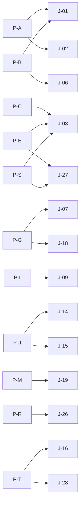
```mermaid
flowchart LR
    PA[P-A] --> J01[J-01] & J02[J-02]
    PB[P-B] --> J01 & J06[J-06]
    PC[P-C] --> J03[J-03]
    PE[P-E] --> J03 & J27[J-27]
    PG[P-G] --> J07[J-07] & J18[J-18]
    PI[P-I] --> J09[J-09]
    PJ[P-J] --> J14[J-14] & J15[J-15]
    PM[P-M] --> J19[J-19]
    PR[P-R] --> J26[J-26]
    PS[P-S] --> J03 & J27
    PT[P-T] --> J16[J-16] & J28[J-28]
```

### 6.4 Lifecycles

**Account:** REGISTERED → UNVERIFIED → VERIFIED → ACTIVE ⇄ SUSPENDED → DEACTIVATED → DELETED | TERMINATED.

**Managed learner:** provisioned → invited → claimed → active_managed → graduation_pending → independent | revoked → archived.

**Instructor:** applicant → under_review → approved → active ⇄ suspended → retired.

**Course (authoring):** draft → submitted_for_review → under_review → approved → published → updating → archived | unpublished.

**Contest:** draft → scheduled → registration_open → active → ended → results_published → archived.

---

### 7.1 Master Permission Matrix

Legend: ✅ full · ✅* consent/context-scoped · ⛔ denied.

| Capability | Student | Instructor | Course Author | Peer Reviewer | Content Author | Company Reviewer | Faculty | Inst Admin | Moderator | Platform Admin |
|---|---|---|---|---|---|---|---|---|---|---|
| Publish own course | ⛔ | ✅(assigned) | ✅ | ⛔ | ⛔ | ⛔ | ⛔ | ✅(inst) | ⛔ | ✅ |
| Approve course for marketplace | ⛔ | ⛔ | ⛔ | ⛔ | ⛔ | ⛔ | ⛔ | ⛔ | ✅ | ✅ |
| Grade assignments | ⛔ | ✅(own) | ✅(own) | ✅(rubric) | ⛔ | ⛔ | ✅(assigned) | ⛔ | ⛔ | ✅ |
| Peer-review submissions | ⛔ | ⛔ | ⛔ | ✅(assigned) | ⛔ | ⛔ | ⛔ | ⛔ | ⛔ | ✅ |
| Create posts/articles | ✅ | ✅ | ✅ | ✅ | ✅ | ⛔ | ✅ | ✅ | ✅ | ✅ |
| Moderate UGC | ⛔ | own | own | ⛔ | own | ⛔ | ⛔ | inst-scoped | ✅ | ✅ |
| Write company review | ✅ | ✅ | ✅ | ✅ | ✅ | ✅ | ✅ | ⛔(own org) | ✅ | ✅ |
| Submit salary report | ✅ | ✅ | ✅ | ✅ | ✅ | ✅ | ✅ | ⛔ | ⛔ | ✅ |
| Create/grade contest | ⛔ | ✅(own) | ✅(own) | ⛔ | ⛔ | ⛔ | ⛔ | ✅(inst) | ⛔ | ✅ |
| Manage coupons/pricing | ⛔ | ⛔ | ✅(bounded) | ⛔ | ⛔ | ⛔ | ⛔ | ✅(inst) | ⛔ | ✅ |
| View instructor earnings | ⛔ | ⛔ | ✅(own) | ⛔ | ⛔ | ⛔ | ⛔ | ⛔ | ⛔ | ✅ |
| Refunds | ⛔ | ⛔ | ⛔ | ⛔ | ⛔ | ⛔ | ⛔ | ⛔ | ⛔ | ✅ (+Finance Admin) |

### 7.2 Boundary Principles

> [!IMPORTANT]
> - No cross-user mutation without consent/legal basis
> - Recruiter access is application-scoped
> - Moderation escalations are quorum-based
> - Faculty scoped to assigned batches
> - Managed learners cannot self-enrol outside license pool nor apply pre-graduation
> - Peer reviewers see only the submission under review, never reviewer identity (double-blind)
> - Anonymous company reviews hide identity from employer/public, never from Platform Admin/legal
> - Instructors cannot review or rate their own courses

---

# PART III — FEATURE MODEL

---

## 6. Canonical Domain Ontology

| Concept | Meaning |
|---|---|
| User / Account | Authenticated person or service identity. |
| Organization | Employer/business entity with members and scoped permissions. |
| Institution | Education/training entity with managed learners and institutional policies. |
| Profile | User-controlled professional representation and preferences. |
| Skill | Canonical capability concept in the governed skill ontology. |
| Competency | Structured group of related skills and proficiency expectations. |
| Capability | Evidence-informed representation of what a person can perform in context. |
| Goal | Target career/development objective with desired outcomes. |
| Experience | Attributable period/body of work. |
| Evidence | Artifact or observation supporting a claim, capability, credential, or outcome. |
| Credential | Formal attestation issued by an issuer with scope and lifecycle. |
| Verification | Auditable act validating authenticity/correctness. |
| Reputation | Contextual trust representation derived from governed signals. |
| Opportunity | Career-related opportunity such as job, project, apprenticeship, scholarship, volunteer work, or mentorship. |
| Assessment | Governed evaluation with tasks, policy, attempts, scoring, and integrity rules. |
| Learning Resource / Path | Course, lesson, activity, or ordered learning program. |
| Application | Structured submission to an opportunity with lifecycle and feedback. |
| Recommendation | Explainable suggested action/content/opportunity with evidence and freshness. |
| Contribution | Attributable work/community action that may create evidence. |
| Consent | Purpose-bound, versioned permission/acknowledgement. |
| Entitlement | Access state derived from subscription/policy/organization licensing. |
| Audit Event | Record of consequential activity and context. |
| Trust Signal | Bounded signal used for integrity/confidence analysis. |

### 6.1 Evidence semantics

A claim is not verified evidence. Evidence records provenance, source reliability, directness, verification level, recency, lifecycle state, visibility, conflicts, and downstream impact. Confidence is multidimensional rather than an unexplained universal score.

### 6.2 Skill ontology

Skills are versioned and governed with stable identifiers, aliases, parent/child and related-skill relationships, prerequisites, industry mappings, lifecycle status, and provenance. Ontology changes require downstream migration/recalculation rules.

### 6.3 Evidence conflicts and revocation

Conflicting authoritative evidence becomes explicitly disputed. Revocation triggers downstream capability/matching/recommendation impact analysis and preserves an auditable chain rather than silently rewriting history.

---

## 7. Canonical Feature Inventory — 173 Unique Features

**Authority:** the following register is the one active feature identity and priority/dependency index. Alternate or duplicate historical IDs are not active definitions.

> **Authority:** every feature from every edition is preserved. The three sub-tables below are the single canonical register. Priority `P` and `Phase` here GOVERN any band list elsewhere (§8.1), the roadmap (§R), and the dependency map (§DEPMAP). Renumbering history: §LOCK.3.

### 6.1 Baseline & Core Features (F-01 … F-120)

| ID | Feature | Category | P | Phase | Key dependencies |
|---|---|---|---|---|---|
| F-01 | Authentication & Session | Identity | 10 | Ph0 | – |
| F-02 | Landing Page | Shell | 3 | Ph0 | – |
| F-03 | Dashboard (Role-Adaptive) | Shell | 10 | Ph0 | F-01 |
| F-04 | Job Marketplace | Marketplace | 9 | Ph2 | F-01, F-12 |
| F-05 | Post Job Studio | Marketplace | 8 | Ph2 | F-04 |
| F-06 | ATS / Candidate Pipeline | Recruiting | 9 | Ph2–3 | F-04, F-05 |
| F-07 | Learning Management System | Learning | 9 | Ph1 | F-01, F-12 |
| F-08 | Challenges Arena | Assessment | 9 | Ph1 | F-01, F-12 |
| F-09 | Professional Networking | Social | 8 | Ph2 | F-12 |
| F-10 | Direct Messaging | Communication | 10 | Ph0 | F-01 |
| F-11 | AI Career Assistant (Basic) | AI | 8 | Ph1/Ph4 | F-12 |
| F-12 | Profile Management | Identity | 10 | Ph0 | F-01 |
| F-13 | Resume Builder | Identity | 7 | Ph1 | F-12 |
| F-14 | Notification Center | Communication | 10 | Ph0 | F-01 |
| F-15 | Settings | Shell | 10 | Ph0 | F-01 |
| F-16 | Billing & Subscriptions | Monetization | 7 | Ph5 | F-01 |
| F-17 | Admin Console | Governance | 10 | Ph0 | F-01 |
| F-18 | Chrome Extension Companion | Edge | 5 | Ph2 | F-01 |
| F-19 | Product Analytics | Telemetry | 7 | Ph1 | F-01 |
| F-20 | Command Search (⌘K) | Shell | 7 | Ph2 | F-01 |
| F-21 | Error Recovery & Resilience | Shell | 10 | Ph0 | F-01 |
| F-22 | Gamification & XP Ledger | Engagement | 8 | Ph1 | F-07, F-08 |
| F-23 | Leaderboard & Badges | Engagement | 7 | Ph2 | F-22 |
| F-24 | Trust, Safety & Moderation | Safety | 8 | Ph2 | F-01 |
| F-25 | Job Detail View | Marketplace | 7 | Ph2 | F-04 |
| F-26 | Portfolio Showcase | Identity | 8 | Ph1 | F-12 |
| F-27 | Local Resume Match Preview | Edge | 6 | Ph2 | F-18 |
| F-28 | External Job Page Scanner | Edge | 6 | Ph2 | F-18 |
| F-29 | Scheduled Notification Digest | Communication | 7 | Ph2 | F-14 |
| F-30 | Networking Stale-Request Nudges | Engagement | 6 | Ph2 | F-09 |
| F-31 | KPI Aggregation & Rollups | Analytics | 6 | Ph2 | F-19 |
| F-32 | Saved Searches & Job Alerts | Candidate | 7 | Ph2 | F-04 |
| F-33 | Video Interview Rooms | Communication | 8 | Ph3 | F-10 |
| F-34 | Multi-Entity Backend Search | Platform | 7 | Ph2 | F-04, F-07 |
| F-35 | Feature Flag Console | Administration | 6 | Ph2 | F-17 |
| F-36 | Application Draft Autosave | Candidate | 7 | Ph1 | F-04 |
| F-37 | Job Templates | Recruiting | 6 | Ph2 | F-05 |
| F-38 | Legacy Chat Service (DEPRECATED) | Communication | 0 | – | – |
| F-39 | Unified Backend Stub (DEPRECATED) | Platform | 0 | – | – |
| F-40 | Institutional Managed Learning | Institutions | 8 | Ph3 | F-01, F-07 |
| F-41 | Procurement & Seat Licensing | Institutions | 6 | Ph6 | F-40, F-16 |
| F-42 | Provider-Agnostic Media Engine | Platform | 8 | Ph2 | F-07 |
| F-43 | B2B2C Graduation Flywheel | Institutions | 6 | Ph3 | F-40 |
| F-44 | AI Media Enrichment | Learning | 6 | Ph4 | F-42, F-11 |
| F-45 | Proctoring (Third-Party, vendor-gated OD-35) | Learning | 4 | Ph10 | F-40, F-115 |
| F-46 | Institutional Analytics | Institutions | 6 | Ph3 | F-40 |
| F-47 | Faculty Dashboard | Institutions | 6 | Ph3 | F-40 |
| F-48 | OS Shell & Workbench | OS | 4 | Ph2+ | F-01, F-03 |
| F-49 | Automation & Agents | OS | 4 | Ph3+ | F-48 |
| F-50 | Institutional Course Marketplace | Institutions | 6 | Ph3 | F-40, F-42 |
| F-51 | Media Health Monitoring | Platform | 6 | Ph4 | F-42 |
| F-52 | Certificate Verification | Verification | 8 | Ph3 | F-07 |
| F-53 | Professional Social Graph & Feed | Networking | 5 | Ph8 | F-12 |
| F-54 | Content Publishing | Networking | 5 | Ph8 | F-12 |
| F-55 | Groups & Communities | Community | 5 | Ph8 | F-53 |
| F-56 | Organization & Institution Pages | Recruiting | 5 | Ph8 | F-12, F-40 |
| F-57 | Events & Webinars | Community | 5 | Ph8 | F-53 |
| F-58 | Written Recommendations | Networking | 6 | Ph8 | F-53 |
| F-59 | Outreach Credits (TalentMail) | Recruiting | 5 | Ph8 | F-10 |
| F-60 | Profile Views & Privacy Controls | Networking | 6 | Ph8 | F-12 |
| F-61 | Premium Candidate Tier (OD-34 gated) | Business | 4 | Ph10+ | F-60 |
| F-62 | Sponsored Content (NOT RECOMMENDED) | Business | 0 | Ph10+ | – |
| F-63 | Business-Development Graph (NOT RECOMMENDED) | Intelligence | 0 | Ph10+ | – |
| F-64 | LinkedIn Migration Engine | Integration | 5 | Ph1/2 | F-12 |
| F-65 | LinkedIn Decoupling & Independence | Foundation | 8 | Ph1/2 | F-64 |
| F-66 | Course Creation Studio | Learning | 8 | Ph7 | F-07, F-42 |
| F-67 | Categories, Discovery & Comparison | Learning | 6 | Ph7 | F-07, F-145 |
| F-68 | Quizzes, Practice Tests & Final Exams | Learning | 8 | Ph7 | F-07 |
| F-69 | Assignments & Peer Review | Learning | 8 | Ph7 | F-07 |
| F-70 | Learning Paths, Programs & Specializations | Learning | 8 | Ph7 | F-07, F-66 |
| F-71 | Course Q&A, Discussions, Notes | Learning | 6 | Ph7 | F-07 |
| F-72 | Course Reviews & Ratings | Learning | 6 | Ph7 | F-07 |
| F-73 | Course Commerce | Learning | 6 | Ph7 | F-07, F-16 |
| F-74 | Instructor Platform | Learning | 6 | Ph7 | F-07, F-66 |
| F-75 | Employer Insights | Intelligence | 7 | Ph9 | F-12, F-56 |
| F-76 | Coding Contests & Live Leaderboards | Assessment | 5 | Ph9 | F-08 |
| F-77 | Skill Certification Exams | Assessment | 8 | Ph3 | F-08 |
| F-78 | Practice Sets & Interview Prep | Learning | 5 | Ph9 | F-08 |
| F-79 | Articles & Newsletters | Networking | 5 | Ph8 | F-54 |
| F-80 | Profile Enhancements | Profile | 6 | Ph1/Ph8 | F-12 |
| F-81 | Identity Verification | Verification | 3 | Ph9 | F-12 |
| F-82 | Student Learning Analytics | Analytics | 6 | Ph7 | F-07 |
| F-83 | Admin Platform Expansion | Administration | 3 | Ph8 | F-17 |
| F-84 | Skills Graph & Taxonomy | Platform | 10 | Ph1–2 | F-12, F-07, F-08 |
| F-85 | Career Graph & Progression | Intelligence | 9 | Ph3 | F-12, F-04, F-06, F-84 |
| F-86 | Salary Intelligence | Intelligence | 9 | Ph3 | F-04, F-06, F-56 |
| F-87 | Interview Experience Repository | Candidate | 7 | Ph4 | F-04, F-56, F-88 |
| F-88 | Technical Interview Platform | Hiring | 9 | Ph3 | F-08, F-33, F-06 |
| F-89 | Contribution Verification System | Verification | 5 | Ph8 | F-26, F-12 |
| F-90 | Peer Mentorship & Advisor Network | Community | 5 | Ph4 | F-12, F-10, F-55 |
| F-91 | Career Readiness Assessment | Career | 9 | Ph2 | F-84, F-08, F-12 |
| F-92 | Advanced Recruiter Search | Recruiting | 9 | Ph3 | F-12, F-34, F-08, F-96 |
| F-93 | Interview Video Recording & AI Feedback | Hiring | 7 | Ph4 | F-33, F-06, F-88 |
| F-94 | Verified Work History & References | Verification | 7 | Ph3 | F-12, F-58 |
| F-95 | Career Transition Planning | Career | 7 | Ph4 | F-84, F-91, F-07 |
| F-96 | Skill Evidence & Digital Credentials | Verification | 10 | Ph2 | F-12, F-26 |
| F-97 | Real-Time Job Market Analytics | Intelligence | 5 | Ph4 | F-04, F-06 |
| F-98 | Employer Equity & Compensation Intelligence | Intelligence | 7 | Ph3 | F-56, F-86 |
| F-99 | AI Career Coach (Enhanced) | AI | 7 | Ph4 | F-12, F-84, F-91, F-07 |
| F-100 | Peer Project Collaboration | Learning | 4 | Ph5 | F-07, F-69, F-10 |
| F-101 | Badge Marketplace & Recognition | Gamification | 4 | Ph8 | F-23, F-26 |
| F-102 | Hiring Manager Portal | Recruiting | 8 | Ph3 | F-06, F-88 |
| F-103 | Candidate Comparison & Rubric | Recruiting | 6 | Ph3 | F-06, F-92 |
| F-104 | Pre-Hire Assessment Customization | Hiring | 7 | Ph3 | F-06, F-08, F-88 |
| F-105 | Post-Hire Analytics & ROI Tracking | Analytics | 4 | Ph4 | F-102, F-93 |
| F-106 | Skill Prerequisite Engine | Learning | 7 | Ph5 | F-07, F-70, F-84 |
| F-107 | Live Q&A with Instructors | Learning | 6 | Ph5 | F-07, F-71, F-10 |
| F-108 | Expert Network Matching | Networking | 4 | Ph7 | F-09, F-12, F-10 |
| F-109 | Salary Negotiation Guidance | Career | 5 | Ph8 | F-86, F-98 |
| F-110 | Verified Skill Endorsements | Verification | 7 | Ph8 | F-96, F-12, F-58 |
| F-111 | Industry-Specific Learning Hubs | Learning | 4 | Ph8 | F-07, F-55 |
| F-112 | Resume Parsing & Optimization | Candidate | 6 | Ph8 | F-13, F-12 |
| F-113 | Recruiter Outreach Analytics | Recruiting | 6 | Ph8 | F-59, F-06 |
| F-114 | Learning Impact Tracking | Analytics | 9 | Ph4 | F-07, F-04, F-06 |
| F-115 | Certification Exam Platform | Assessment | 9 | Ph3 | F-77, F-45 |
| F-116 | Accessibility & Inclusive Learning | Platform | 7 | Ph8 | F-07, F-44 |
| F-117 | Mobile-First Job Application | Candidate | 5 | Ph8 | F-04, F-33 |
| F-118 | Emerging Skills Detection | Intelligence | 4 | Ph8 | F-84 |
| F-119 | Diversity & Inclusion Analytics | Hiring | 4 | Ph8 | F-06 |
| F-120 | API & Integration Platform | Platform | 2 | Ph10 | F-01, F-34 |

### 6.2 v2.1 Integration Family (F-121 … F-143) — preserved numbering

| ID | Feature | Category | P | Phase | Key dependencies |
|---|---|---|---|---|---|
| F-121 | Warm Introduction Paths | Networking | 8 | Ph4 | F-09, F-12, F-56, F-125 |
| F-122 | Application Feedback Loop | Jobs | 9 | Ph3 | F-06, F-04 |
| F-123 | Skill Decay Tracking (Freshness Engine) | Verification | 9 | Ph3 | F-84, F-96 |
| F-124 | Project Marketplace | Learning | 5 | Ph5 | F-07, F-26, F-100 |
| F-125 | Alumni Networks | Networking | 7 | Ph4 | F-12, F-09, F-40 |
| F-126 | Interview Prep Marketplace | Careers | 5 | Ph4 | F-87, F-90, F-88 |
| F-127 | Company Culture Assessment | Companies | 4 | Ph5 | F-56, F-75 |
| F-128 | Offer Comparison Tool | Careers | 7 | Ph4 | F-86, F-98, F-109 |
| F-129 | Leadership Development | Learning | 3 | Ph5 | F-07, F-84 |
| F-130 | Freelance Marketplace | Jobs | 3 | Ph7 | F-04, F-100, F-124 |
| F-131 | Apprenticeship Matching | Jobs | 3 | Ph6 | F-04, F-40 |
| F-132 | Scholarship Discovery | Learning | 3 | Ph6 | F-40, F-07 |
| F-133 | Volunteer Matching | Community | 2 | Ph7 | F-26, F-100 |
| F-134 | Code Review Practice | Skills | 4 | Ph5 | F-08, F-26 |
| F-135 | System Design Practice | Skills | 4 | Ph5 | F-88, F-08 |
| F-136 | Micro-Learning | Learning | 2 | Ph4 | F-07, F-42 |
| F-137 | Spaced Repetition | Learning | 2 | Ph6 | F-07, F-68 |
| F-138 | Study Accountability Partners | Learning | 3 | Ph6 | F-07, F-55 |
| F-139 | Local Communities & Meetups | Networking | 3 | Ph7 | F-09, F-55, F-57 |
| F-140 | Affinity Groups | Community | 3 | Ph7 | F-55, F-09 |
| F-141 | Onboarding Preparation | Careers | 1 | Ph8 | F-06, F-33 |
| F-142 | Referral Request System | Jobs | 8 | Ph4 | F-09, F-04 |
| F-143 | OSS Contribution Discovery | Portfolio | 4 | Ph8 | F-89, F-26 |

### 6.3 Gap-Analysis Family (F-144 … F-173) — renumbered (former F-121 … F-150)

| ID | Feature | Category | P | Phase | Key dependencies |
|---|---|---|---|---|---|
| F-144 | Reputation Engine (multi-context) | Platform | 9 | Ph2 | F-96, F-58, F-72 |
| F-145 | Recommendation Engine Core | Platform | 8 | Ph2–3 | F-84, F-144 |
| F-146 | Activity & Contribution Tracking | Platform | 7 | Ph3 | F-123, F-84, F-144 |
| F-147 | Unified Search & Discovery | Platform | 8 | Ph2 | F-84, F-145 |
| F-148 | Instructor Reputation System | Reputation | 8 | Ph7 | F-72, F-144 |
| F-149 | Employer Reputation & Brand System | Reputation | 7 | Ph8 | F-75, F-56, F-144 |
| F-150 | Peer Credibility Networks | Reputation | 7 | Ph8 | F-110, F-144 |
| F-151 | Skill Supply/Demand Forecasting | Intelligence | 7 | Ph4 | F-84, F-86, F-97 |
| F-152 | Career Trajectory Analysis | Intelligence | 7 | Ph4 | F-85, F-86, F-93 |
| F-153 | Learning Impact Dashboard (Enhanced) | Intelligence | 7 | Ph4 | F-114, F-85, F-86 |
| F-154 | Interview Prediction & Benchmarking | Intelligence | 6 | Ph4 | F-88, F-102, F-105 |
| F-155 | Adaptive Learning System | Personalization | 6 | Ph5 | F-07, F-84, F-145 |
| F-156 | Professional Development Plan System | Career | 6 | Ph4–5 | F-91, F-95, F-145 |
| F-157 | Skills Co-Learning Path Optimizer | Learning | 4 | Ph5 | F-84, F-114, F-07 |
| F-158 | Talent Pool Intelligence & Analytics | Recruiting | 6 | Ph3 | F-92, F-84, F-144 |
| F-159 | Behavioral Talent Discovery | Discovery | 6 | Ph4 | F-123, F-84, F-144 |
| F-160 | Talent Segmentation & Classification | Analytics | 5 | Ph4 | F-84, F-85, F-144 |
| F-161 | Internal Mobility & Succession Platform | Enterprise | 3 | Ph6–7 | F-84, F-91, F-132 |
| F-162 | Verified Work History Network & Graph | Verification | 5 | Ph4 | F-94, F-84 |
| F-163 | Credential Wallet & Portability | Credential | 3 | Ph5 | F-96 |
| F-164 | Skills Evidence Narrative & Storytelling | Credential | 4 | Ph5 | F-96, F-26 |
| F-165 | Diversity, Equity & Inclusion Data System | Analytics | 3 | Ph8 | F-119 |
| F-166 | Interview Performance Benchmarking | Analytics | 5 | Ph4 | F-88, F-102 |
| F-167 | Candidate Comparison & Rubric (Enhanced) | Hiring | 5 | Ph3 | F-88, F-103 |
| F-168 | Hiring Prediction & Success Modeling | Analytics | 3 | Ph5 | F-88, F-105 |
| F-169 | Community Contribution Scoring & Recognition | Community | 5 | Ph7 | F-55, F-144 |
| F-170 | Expert Network (Enhanced) | Community | 4 | Ph7 | F-144, F-90 |
| F-171 | Employer Brand Management System | Company | 3 | Ph8 | F-56, F-75, F-149 |
| F-172 | Advanced Compensation Intelligence | Analytics | 4 | Ph8 | F-86, F-98, F-109 |
| F-173 | Company-to-Skills Mapping | Intelligence | 3 | Ph4 | F-84, F-04 |

### 6.4 Distribution Summary
| P | Count | 
|---|---|
| 10 | 10 | 
| 9 | 14 | 
| 8 | 22 | 
| 7 | 29 | 
| 6 | 31 | 
| 5 | 23 | 
| 4 | 19 | 
| 3 | 16 | 
| 2 | 4 | 
| 1 | 1 | 
| 0 | 4 | 
| **Total** | **173** | 

---

---

## 8. Foundational Systems & Dependency Model

The foundational systems below are cross-feature primitives. They are not competing features; they are reusable platform capabilities.

> The fourteen systems below carry the canonical implementation detail (see §DET). Nearly every other feature consumes or feeds one of them. System IDs are stable and referenced throughout.

| System | Name | Primary feature | Role |
|---|---|---|---|
| S-01 | Skills Graph & Taxonomy | F-84 | Canonical, admin-curated skill taxonomy + semantic edges; foundation of matching, learning, forecasting |
| S-02 | Verification & Credentials | F-96 | Append-only verifiable credential store; SHA-256 + `/verify/:hash`; credential issuance |
| S-03 | Reputation Engine | F-144 | Unified multi-context reputation; candidate/instructor/employer/peer; feeds matching & discovery |
| S-04 | Recommendation Engine Core | F-145 | Hybrid collaborative + content-based recs with explanation layer; powers jobs/courses/mentors/content |
| S-05 | Career Graph & Progression | F-85 | Verified career transitions + outcomes; powers market analytics, trajectory, readiness |
| S-06 | Technical Interview Platform | F-88 | Structured, fair, recordable interviews; scorer rubrics; human-in-the-loop verdicts |
| S-07 | Salary Intelligence | F-86 | Transparent comp; k≥5 aggregation; negotiation + employer insight consumers |
| S-08 | Learning Impact Tracking | F-114 | Correlational outcome evidence linking learning to hiring/salary/retention; k≥5 |
| S-09 | Activity & Contribution Tracking | F-146 | Time-series behavioral signals; discovery, engagement, early-adopter detection, expertise ID |
| S-10 | Unified Search & Discovery | F-147 | One discovery surface for people/jobs/courses/companies/projects/discussions; RLS-safe |
| S-11 | Warm Intro & Referral Network | F-121 + F-142 | Dignified warm introductions and referral requests with tracking delivery |
| S-12 | Application Feedback Loop | F-122 | Every application receives feedback; #1 differentiator (P-02) |
| S-13 | Skill Freshness Engine | F-123 | Decay stale skill evidence so current proof weighs more; refresher resets decay |
| S-14 | Project Marketplace Infra | F-124 | Infrastructure for project-based learning, freelance & apprenticeship; escrow via Stripe |

---

### Dependency rule

Feature work must declare blocking dependencies, shared primitives, policy prerequisites, external dependencies, data prerequisites, and verification prerequisites. Circular dependencies are prohibited unless deliberately mediated by events/contracts.

---

## 9. Detailed Feature Specifications

The detailed records below cover the highest-leverage features first. The 173-feature register in §7 remains the complete inventory; this section supplies deeper canonical behavior for priority foundation/core features without redefining their identities.

### F-01 Authentication & Session

| Attribute | Value |
|---|---|
| **Feature ID** | F-01 |
| **Priority** | 10 |
| **Phase** | Ph0 |
| **Purpose** | Establish and maintain authenticated user sessions with role claims |
| **Business Objective** | Enable secure identity for all platform interactions |
| **User Problem Solved** | Users need a secure, frictionless way to access the platform |
| **Actors** | Anonymous visitor, Candidate, Recruiter, Admin, Institution Admin |
| **Preconditions** | Supabase Auth configured; RLS baseline migrations applied |
| **Postconditions** | Authenticated session with normalized role claims |

**Core Behavior (Step-by-Step):**

1. **Registration** — User submits email + password (or OAuth via Google/GitHub). Server validates: unique email (`auth.users.email`), password strength (zxcvbn ≥3), age gate (DOB ≥16 years), no banned email domain. On success: `auth.users` row created → trigger `on_auth_user_created` inserts `profiles` + `user_settings` → verification email sent via Resend → user lands on onboarding wizard.
2. **Email Verification** — User clicks tokenized link (TTL 24h, single-use). `profiles.email_verified_at` set. Account state → VERIFIED.
3. **Login** — User submits credentials. Rate limit enforced (10/min/IP for login; 5/min/IP for password reset). On success: Supabase Auth issues JWT (1h access, 30-day sliding refresh) + refresh token. Session cookie set: `sb-access-token` (HttpOnly, Secure, SameSite=Lax).
4. **Role Normalization** — Edge middleware reads JWT `app_metadata.role` and normalizes to `ROLE_USER` / `ROLE_RECRUITER` / `ROLE_ADMIN`. Missing/invalid role → default `ROLE_USER`.
5. **Session Restore** — On page load, client checks cookie. If expired, silent refresh attempt. If refresh fails, redirect to `/login` with `?return=` param. Partial session cleared on fatal auth error.
6. **Logout** — Server revokes JWT via `jti` denylist. Cookie cleared. Redirect to `/`.
7. **Password Reset** — User submits email → rate limited (5/min/IP). Tokenized link sent (TTL 30 min, single-use). On submission: new password validated → session revoked globally → user re-authenticated.
8. **OAuth Flow** — Google/GitHub: PKCE exchange → Supabase Auth callback → profile merged with existing email if match (no silent account takeover; consent prompt if email collision).

**Business Rules:** BR-001 (auth required), BR-002 (role separation), AUTH-001..017

**Permissions:** Public: register/login/reset · Authenticated: logout/refresh/change password · Admin: revoke any session

**Data Dependencies:** `auth.users` (Supabase-managed), `profiles`, `user_settings`, `audit_logs`

**API Dependencies:** `POST /api/v1/auth/register`, `POST /api/v1/auth/login`, `POST /api/v1/auth/reset-password`, `POST /api/v1/auth/logout` (SCI-04)

**UI Dependencies:** `/login`, `/register`, `/forgot-password`, `/reset-password`, `/verify-email`

**External Dependencies:** Supabase Auth (GoTrue), Resend (transactional email), Google OAuth, GitHub OAuth

**Security Requirements:** HDN-008 (rate limits, lockout, jti denylist) · HDN-014 (TLS, no plaintext credentials) · MFA readiness (AUTH-008) · age gate (AUTH-017)

**Failure Modes:**
- OAuth provider unavailable → fallback to email/password login (visible message)
- Email provider down → queue verification email; show "pending" state
- Supabase Auth outage → redirect to maintenance page with honest status

**Edge Cases:**
- Multi-tab session collision → last-write-wins with warning toast
- JWT clock skew >30s → reject with "check your system clock"
- Duplicate OAuth email (GitHub vs Google) → merge prompt, never silent

**Analytics Events:** EVT-001 `user_registered`, EVT-002 `session_active`

**Notifications:** Welcome email (immediate) · Verification email (immediate) · Password reset email (immediate) · Suspicious login alert (immediate, post-MVP)

**State Machine:**

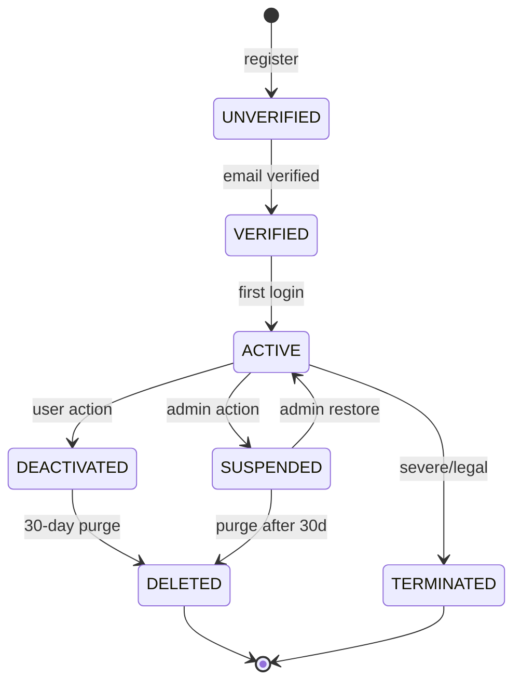
```mermaid
stateDiagram-v2
    [*] --> UNVERIFIED: register
    UNVERIFIED --> VERIFIED: email verified
    VERIFIED --> ACTIVE: first login
    ACTIVE --> SUSPENDED: admin action
    ACTIVE --> DEACTIVATED: user action
    SUSPENDED --> ACTIVE: admin restore
    DEACTIVATED --> DELETED: 30-day purge
    ACTIVE --> TERMINATED: severe/legal
    SUSPENDED --> DELETED: purge after 30d
    DELETED --> [*]
    TERMINATED --> [*]
```

**Acceptance Criteria:**
- Login p95 latency <300ms
- 100% duplicate email rejection
- 100% weak password rejection
- Zero plaintext secrets in client bundle
- Rate limits enforced at edge
- Age gate blocks <16

**Test Requirements:** Unit (password policy, email normalization) · Integration (register→verify→login E2E) · RLS (own-row isolation) · Security (rate limits, lockout) · Accessibility (form keyboard nav)

**Feature Dependencies:** None (foundation)

---

### F-12 Profile Management

| Attribute | Value |
|---|---|
| **Feature ID** | F-12 |
| **Priority** | 10 |
| **Phase** | Ph0 |
| **Purpose** | Canonical professional identity record |
| **Problem Solved** | No single source of truth for candidate identity |
| **Actors** | Candidate, Recruiter, Admin |

**Core Behavior (Step-by-Step):**

1. **Profile Auto-creation** — On `auth.users` insert, trigger creates `profiles` row with `id` (FK to auth.users), `email`, `role` (from JWT), `created_at`.
2. **Basic Info Edit** — User navigates to `/profile`. Form fields: `full_name` (required, ≤120 chars), `headline` (≤120), `summary` (≤2000, sanitized markdown), `location` (city-level), `avatar_url` (upload ≤4MB, JPEG/PNG/WebP, MIME sniffed, EXIF stripped), `phone_number` (encrypted at rest AES-256-GCM, masked on public view).
3. **Skills Management** — User adds skills via typeahead from canonical skills taxonomy (F-84). Each entry: `skill_id`, `proficiency` (Beginner/Intermediate/Advanced/Expert), `years` (optional), `self_reported` (boolean — becomes verified upon platform signal).
4. **Experience** — CRUD on `profile_experience` rows: `role`, `company`, `start_date`, `end_date` (nullable for current), `description` (≤2000 sanitized markdown), `location`. Company name validated against `organizations` table when possible.
5. **Education** — CRUD on `profile_education`: `institution`, `degree`, `field_of_study`, `start_year`, `end_year`, `grade` (optional). Institution matched against known list when possible.
6. **Certifications** — CRUD on `profile_certifications`: `title`, `issuer`, `issue_date`, `expiry_date` (optional), `credential_id`, `credential_url` (HTTPS-only). Verification status flag.
7. **Portfolio** — CRUD on `profile_portfolios`: `title`, `description`, `demo_url`, `repo_url`, `media_assets` (images/PDFs ≤50MB), `tech_stack` (canonical skills). Public visibility toggle.
8. **Completeness Score** — Recomputed on every edit. Formula: weighted sum of filled sections (basic 20%, skills 15%, experience 20%, education 15%, certifications 10%, portfolio 10%, summary 10%). Score 0–100.
9. **Visibility Toggles** — Per-section control: `public` / `connections_only` / `recruiters_only` / `private`.
10. **Public View** — `/profile/[userId]` renders public-safe columns only. PII columns (`phone_number`, `tax_id`) never exposed.
11. **Data Residency** — `data_residency_region` set at signup from locale (US/EU). Gates AI routing.

**Business Rules:** BR-005 (own-edit only), BR-061 (≥70% completeness for job applications), PROFILE-001..035

**Permissions:** Own-row edit only. Admin can edit any. Public read of public-safe columns.

**Data Dependencies:** `profiles`, `profile_skills`, `profile_experience`, `profile_education`, `profile_portfolios`, `profile_certifications`, `profile_media`, `career_signals`, `user_settings`

**API Dependencies:** `GET /api/v1/profile`, `PUT /api/v1/profile`, `POST /api/v1/profile/resume/parse`, `POST /api/v1/profile/portfolio`, `GET /api/v1/profile/{userId}/public`

**UI Dependencies:** `/profile`, `/profile/[userId]`, resume upload drawer, portfolio gallery, skills taxonomy typeahead

**External Dependencies:** Supabase Storage, HaveIBeenPwned (password breach check), AI service (resume parsing)

**Security Requirements:** RLS own-row + public-safe view · Field-level encryption (phone_number, tax_id) · XSS sanitization on rich text · Upload pipeline

**Failure Modes:**
- Resume parse failure → manual entry fallback with error toast
- File upload failure → retry with resume, no partial save
- Public view permission denied → 404-equivalent (no existence leak)

**Edge Cases:**
- Concurrent edit collision → optimistic concurrency via `version` column; 409 on conflict
- Empty profile on first login → onboarding wizard with guided steps
- Deleted company in experience → graceful degradation, keep text
- Vanity slug collision → suggest alternatives, block reserved words

**Analytics Events:** EVT-003 `profile_completed`, EVT-004 `resume_uploaded`, EVT-005 `verified_signal_added`

**Notifications:** Profile completeness nudges (weekly digest if <70%) · Verification badge unlocked (immediate)

**State Machine:** (Profile itself is stateful only for visibility)

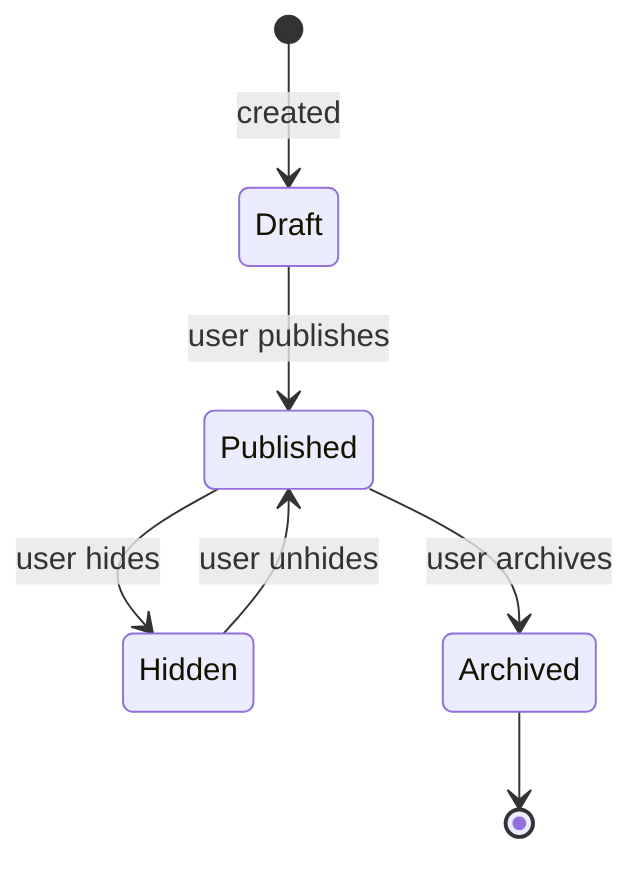
```mermaid
stateDiagram-v2
    [*] --> Draft: created
    Draft --> Published: user publishes
    Published --> Hidden: user hides
    Hidden --> Published: user unhides
    Published --> Archived: user archives
    Archived --> [*]
```

**Acceptance Criteria:**
- Profile save p95 <250ms
- Public view never exposes PII columns
- Completeness score 100% reproducible
- Avatar upload succeeds for supported formats only
- Concurrent edit returns 409 with clear message

**Test Requirements:** Unit (validation, completeness formula) · Integration (CRUD + RLS) · E2E (J-01 profile build) · Contract (resume parser adapter) · A11y (form keyboard, screen reader)

**Feature Dependencies:** F-01 · **Blocks:** All domain features

---

### F-84 Skills Graph & Taxonomy System ★

| Attribute | Value |
|---|---|
| **Feature ID** | F-84 |
| **Priority** | 10 |
| **Phase** | Ph1–2 |
| **Purpose** | Canonical semantic model of skills: relationships, prerequisites, correlations, market demand |
| **Problem Solved** | Recommendations, matching, and career guidance are impossible without understanding skill relationships |
| **Actors** | Platform Admin (taxonomy curation), all users (read), recommendation engine (read), instructors (tag content) |
| **Preconditions** | Profile (F-12), LMS (F-07), Arena (F-08) exist |
| **Postconditions** | Every course, challenge, job, and profile references canonical skills |

**Core Behavior (Step-by-Step):**

1. **Taxonomy Curation (Admin)** — Platform Admin manages the canonical `skills` table: create, edit, deprecate, merge (with redirect map). Each skill: `id`, `canonical_name`, `slug`, `category` (nested ≤3 levels), `description`, `aliases` (array), `status` (active/deprecated), `created_at`. Target: 2,000+ skills at scale.
2. **Skill Relationships (Admin + Computed)** — `skill_relationships` table edges:
   - `prerequisite_of` — directional, acyclic (validated at write)
   - `subskill_of` — hierarchical decomposition
   - `supersedes` — replacement (deprecated → current)
   - `complements` — bidirectional co-occurrence
   - `correlates_with` — bidirectional, computed statistically (never manual)
3. **Content Tagging** — Every course, module, lesson, challenge, job, portfolio project, and user skill entry references a canonical `skill_id`. No freeform skill strings allowed (BR-144).
4. **Market Signal Collection** — Daily job aggregation: `skill_market_signals` table tracks per skill: `demand_index`, `salary_premium`, `growth_rate`, `region`, `window_start`, `window_end`. Aggregated from job postings, salary reports, and hiring outcomes.
5. **Graph Traversal** — Read operations:
   - **Skill gap** — Given target skill, traverse `prerequisite_of` backwards to find unmet prerequisites
   - **Related skills** — Given skill, traverse `correlates_with` edges (top N by weight)
   - **Role readiness** — Given role (job family), aggregate required skills; compute candidate overlap
   - **Path suggestion** — Dijkstra-style shortest path from candidate's skills → target role's required skills
6. **Emerging Skills Detection** — Weekly computation (F-118 dependency): new skill candidates from job postings with `occurrence_count ≥5` in the last 30 days but not in taxonomy → candidate queue for admin review.
7. **Search & Typeahead** — Full-text search over `canonical_name` + `aliases`. Used in profile, course, job, and challenge forms.
8. **Public API** — `GET /api/v1/skills/{id}` returns skill + relationships + market signals (public read). `GET /api/v1/skills/search?q=` for typeahead.
9. **Caching** — Read-heavy; cache hot skills (top 500 by traversal count) in memory with 15-min TTL. Invalidation on taxonomy write.

**Business Rules:** BR-141..BR-148
- BR-141: Curated by Platform Admin; no user creation of canonical skills
- BR-142: Relationships directional
- BR-143: Correlations computed, not manual
- BR-144: All tagging references canonical skill
- BR-145: Market signals update daily
- BR-146: Traversal depth bounded (max 5 hops)
- BR-147: `prerequisite_of` acyclic (validated)
- BR-148: Emerging skills require ≥5 independent signals before promotion

**Permissions:** Public read. Admin write. Instructor/Course Author can propose skill tags (subject to moderation).

**Data Dependencies:** `skills`, `skill_relationships`, `skill_market_signals`, `course_skills`, `challenge_skills`, `job_skills`, `profile_skills`, `portfolio_skills`

**API Dependencies:** SCI-35 (Skill CRUD, relationship CRUD, market signal query, traversal), SCI-45 (emerging skill proposal), SCI-46 (relationship validation)

**UI Dependencies:** Admin taxonomy manager · Typeahead components · Skill detail card (shows relationships, market signals) · Skill gap visualizer

**External Dependencies:** None required. Optional: licensed market data feed (OD-46).

**Security Requirements:** Public read of taxonomy · Admin-only writes · No PII in graph · RLS enforced on tagging tables · Rate limits on search API

**Failure Modes:**
- Taxonomy read failure → fallback to cached top 500
- Traversal cycle detected (data corruption) → alert + refuse traversal, log incident
- Market signal computation fails → serve last-known-good data with staleness banner

**Edge Cases:**
- Admin merges two skills → all references updated transactionally, redirect map retained
- Skill deprecated mid-course → course continues, skill tag shows "deprecated" badge
- Path traversal exceeds depth → return partial result with caveat
- Correlated skill with low sample count → hide until minimum threshold

**Analytics Events:** `skill_searched`, `skill_relationship_traversed`, `skill_tagged`, `emerging_skill_promoted`, `skill_merged`

**Notifications:** Admin digest of emerging skills (weekly) · Taxonomy change alerts to instructors with affected courses

**State Machine (Skill):**

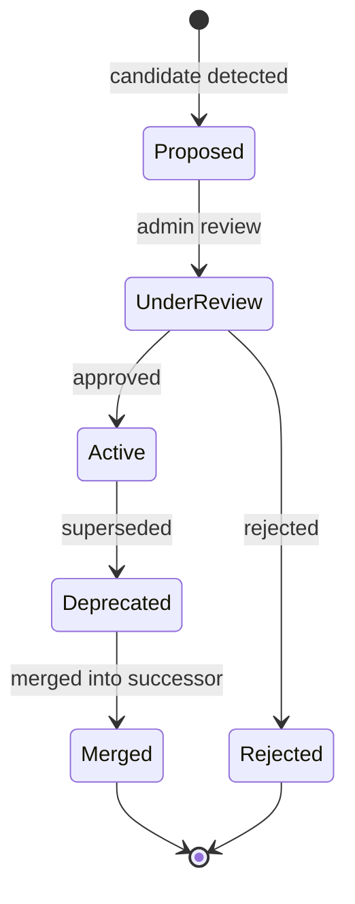
```mermaid
stateDiagram-v2
    [*] --> Proposed: candidate detected
    Proposed --> UnderReview: admin review
    UnderReview --> Active: approved
    UnderReview --> Rejected: rejected
    Active --> Deprecated: superseded
    Deprecated --> Merged: merged into successor
    Merged --> [*]
    Rejected --> [*]
```

**Acceptance Criteria:**
- Skill search p95 <100ms (cached)
- Traversal p95 <200ms for depth ≤3
- 100% of course/challenge/job skill tags reference canonical skills
- Zero cycles in `prerequisite_of` graph
- Market signal updates daily (measure via scheduler)
- Typeahead returns relevant results for common typos

**Test Requirements:**
- Unit: traversal algorithms, cycle detection, merge logic
- Integration: CRUD, RLS on tagging tables, market signal computation
- E2E: admin curates taxonomy → instructor tags course → learner typeahead shows skill
- Contract: skill API schema, adapter pattern
- Performance: traversal under load (10k concurrent)
- Data: graph integrity checks (cycles, orphans, unreferenced skills)

**Feature Dependencies:** F-12, F-07, F-08 · **Blocks:** F-91, F-95, F-99, F-106, F-114, F-118

---

### F-96 Skill Evidence & Digital Credentials ★

| Attribute | Value |
|---|---|
| **Feature ID** | F-96 |
| **Priority** | 10 |
| **Phase** | Ph2 |
| **Purpose** | Cryptographic, auditable proof of skill via projects, assessments, work history, peer review |
| **Problem Solved** | LinkedIn endorsements are gamed; platform needs verified evidence |
| **Actors** | Candidate (evidence contributor), Instructor/Peer (verifier), Recruiter (verifier), Employer (consumer) |

**Core Behavior (Step-by-Step):**

1. **Evidence Types** — Every credential belongs to one of:
   - `course_completion` — from LMS with ≥70% final grade
   - `challenge_pass` — from Arena with verified score
   - `certification` — from exam platform (F-115)
   - `project_submission` — from portfolio with peer/instructor review
   - `work_history` — employer-confirmed
   - `endorsement` — peer skill verification (weighted by endorser credibility)
   - `contribution` — GitHub/GitLab commit verification (F-89)
2. **Credential Issuance** — When an evidence source triggers (e.g., course completion event), the system:
   - Creates `verified_credentials` row: `id`, `user_id`, `skill_id`, `evidence_type`, `evidence_source_id`, `issued_at`, `verification_hash` (SHA-256), `status` (issued)
   - Creates `credential_evidence` rows linking to underlying artifacts (course enrollment, submission, etc.)
   - Publishes public verification URL: `/verify/{hash}`
   - Updates `profiles.xp_balance` if applicable
   - Emits `EVT-005 verified_signal_added` (if first signal)
3. **Credential Verification (Public)** — `GET /verify/{hash}` returns: holder name (first name + last initial for privacy), skill, evidence type, issuer, issue date, status. Never exposes full profile or PII.
4. **Credential Revocation** — Admin-only action (academic integrity violation, employer retraction, etc.). Revocation creates a new record with `revoked_at` + `revocation_reason`. Original row retained (append-only). Public URL shows "INVALID" state. XP clawback logged.
5. **Endorsement Weighting** — When a peer endorses a skill:
   - Endorser's credential weight = `min(their_verified_reputation_score, 1.0)`
   - Relationship proximity boost: +0.2 if direct connection, +0.1 if 2nd degree
   - Final weight stored in `endorsement_weights`
   - Endorsements from unverified users (no reputation) count as 0.1 (weak signal)
6. **Evidence Display** — On profile: "Verified by TalentSphere" badge on each skill with ≥1 credential. Click expands evidence list (course, challenge, or endorsement).
7. **Portable Export** — User can export all credentials as JSON (DSR Art. 20). Export includes verification URLs.
8. **Privacy-Preserving Proof** — Optional privacy-preserving credential presentation. Do not label a hash commitment as zero-knowledge. Where portable cryptographic credentials are adopted, target stable W3C Verifiable Credentials Data Model 2.0 semantics and evaluate later revisions separately.

**Business Rules:** BR-149..BR-156
- BR-149: Append-only; revocation creates new record
- BR-150: Public verification URL, no PII
- BR-151: Evidence links immutable once issued
- BR-152: Endorsement weights from reputation + proximity
- BR-153: Anonymous endorsements prohibited
- BR-154: Appeal path with ≤7-day SLA
- BR-155: Privacy-preserving proofs allowed
- BR-156: Credential requires platform-verified achievement

**Permissions:** User: issue (via achievement), view own, export. Public: verify via hash. Admin: revoke. Peer: endorse connected users.

**Data Dependencies:** `verified_credentials`, `credential_evidence`, `endorsement_weights`, `profiles`, `xp_transactions`, `skill_endorsements`

**API Dependencies:** SCI-42 (credential CRUD, verification, revocation, endorsement), SCI-17 (certificate issue/verify from media)

**UI Dependencies:** `/verify/{hash}` public page · Profile evidence drawer · Endorsement UI · Credential export in settings

**Security Requirements:** SHA-256 hashing · Public verify endpoint rate-limited (60/min/IP) · No PII in verify response · RLS own-row for full credential list · Append-only enforcement at DB layer

**Failure Modes:**
- Hash collision (astronomically unlikely) → reject issuance, alert
- Verification endpoint unavailable → cached verification for 24h
- Endorsement spam → rate limit + reputation threshold for endorsers

**Edge Cases:**
- Credential issued, then course retroactively revoked → credential revoked with reason
- User deletes account → credentials anonymized (holder name removed), verification URL shows "deleted user"
- Dispute: "I didn't endorse this skill" → endorsement revocable by endorser within 30 days
- Recruiter needs bulk verification → API with rate limit + audit

**Analytics Events:** `credential_issued`, `credential_verified`, `credential_revoked`, `endorsement_added`, `endorsement_withdrawn`, `evidence_exported`

**Notifications:**
- Credential issued (learner, immediate)
- Credential verified by recruiter (learner, immediate, opt-in)
- Endorsement received (learner, immediate)
- Credential revoked (learner, immediate, with appeal link)

**State Machine (Credential):**

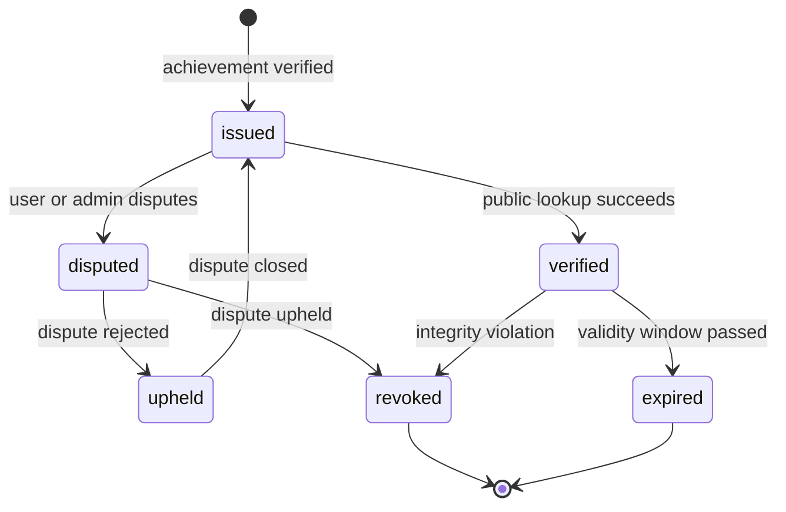
```mermaid
stateDiagram-v2
    [*] --> issued: achievement verified
    issued --> verified: public lookup succeeds
    issued --> disputed: user or admin disputes
    disputed --> upheld: dispute rejected
    disputed --> revoked: dispute upheld
    verified --> expired: validity window passed
    verified --> revoked: integrity violation
    upheld --> issued: dispute closed
    revoked --> [*]
    expired --> [*]
```

**Acceptance Criteria:**
- Credential issuance <500ms
- Public verify <200ms (cached)
- Zero PII exposure in public verify
- 100% append-only enforcement (DB grants)
- Endorsement weight computation deterministic
- Appeal resolved within 7 days SLA

**Test Requirements:**
- Unit: hash generation, weight computation, appeal logic
- Integration: issuance from each evidence source, revocation, RLS
- E2E: complete course → credential issued → recruiter verifies
- Security: hash tamper detection, PII leakage scan on verify endpoint
- Contract: verification URL schema

**Feature Dependencies:** F-12, F-26 · **Blocks:** F-89, F-92, F-94, F-110, F-115

---

## §13. Tier 1 Core Intelligence Features (Priority 9)

### F-04 Job Marketplace

| Attribute | Value |
|---|---|
| **Feature ID** | F-04 |
| **Priority** | 9 |
| **Phase** | Ph2 |
| **Purpose** | Two-sided job discovery and matching |
| **Problem Solved** | Candidates need to find relevant jobs; recruiters need qualified candidates |
| **Actors** | Candidate, Recruiter, Org Admin |

**Core Behavior:**

1. **Search** — Candidate navigates `/jobs`. Faceted filters: keyword, location, work mode (Remote/Hybrid/On-site), job type (Full-time/Part-time/Contract/Internship), level (Entry/Mid/Senior/Lead/Principal), salary range, skills (multi-select from F-84), company, posted-within. Filters are URL-encoded (shareable). Cursor-based pagination (20/page default, 100 max).
2. **Ranking** — Default sort: relevance (candidate skill match × job requirements). Weights: 0.45 skill + 0.20 experience + 0.10 location + 0.10 title + 0.10 org_rating + 0.05 recency. Transparency: "Why am I seeing this?" disclosure on each card.
3. **Job Detail** — `/jobs/[id]` shows: title, company (linked), location, work mode, salary (min-max with "hide pay" recruiter toggle), description (sanitized markdown), requirements, benefits, skills required, company overview, similar jobs, apply CTA. If job closed → 410 Gone with "similar jobs" recommendation.
4. **Apply** — Multi-step modal: select resume (or attach new), optional cover letter (≤5000 chars), confirm profile completeness (≥70% gate). Autosave draft every 5s to localStorage + `application_drafts` (server). On submit: `job_applications` row created (status `submitted`), `application_status_events` append, `EVT-017 application_submitted`, recruiter notified, candidate receives confirmation.
5. **Duplicate Prevention** — Partial unique constraint `UNIQUE(applicant_id, job_id) WHERE status NOT IN ('rejected','withdrawn','archived')`. If duplicate → 409 with "You've already applied" message.
6. **Saved Jobs** — Candidate saves jobs to `saved_jobs`. View in `/jobs/saved`.
7. **Saved Searches** — Candidate saves filter combination to `saved_searches`. Job alert emails sent when new matches appear (new-only, no backfill).
8. **Bookmarks & Hide** — Hide jobs (client-preference, reversible).
9. **Similar Jobs** — Recommendation engine (F-145) suggests 5 similar roles.

**Business Rules:** BR-010 (publish-readiness), BR-011 (lifecycle), BR-013 (hidden reversible), BR-015 (no duplicate active applications + 90-day cooldown), BR-016 (no applications to closed jobs), JOB-001..020

**Permissions:** Public read of published jobs · Authenticated apply · Recruiter/Admin post

**Data Dependencies:** `jobs`, `job_skills`, `organizations`, `job_applications`, `application_status_events`, `saved_jobs`, `saved_searches`, `job_alerts`, `job_views`, `job_fit`

**API Dependencies:** SCI-01 (create job), SCI-02 (apply)

**Security Requirements:** RLS public read of published · Own-row for applications · Rate limit apply (5/hour/candidate) · Salary transparency enforced

**Failure Modes:**
- Job closed during application → block submission with actionable error
- Duplicate application detection race → DB unique constraint is authority
- Search index down → fallback to DB query (slower, degraded badge)

**Edge Cases:**
- Candidate applies then withdraws → 90-day cooldown before re-apply
- Job expired → soft-archive, still accessible via direct link with "closed" banner
- Employer deletes job → applications preserved, candidate notified

**Analytics Events:** EVT-014 `job_created`, EVT-015 `job_search_performed`, EVT-016 `job_viewed`, EVT-017 `application_submitted`

**Notifications:** Application confirmation (candidate, immediate) · New application (recruiter, immediate) · New matching jobs (candidate, digest)

**State Machine (Job):**

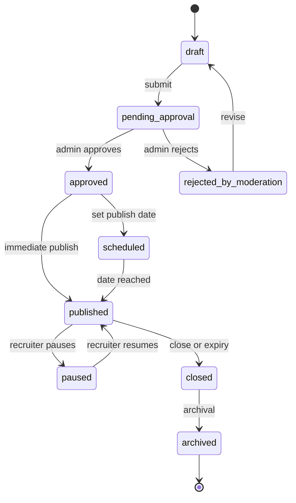
```mermaid
stateDiagram-v2
    [*] --> draft
    draft --> pending_approval: submit
    pending_approval --> approved: admin approves
    pending_approval --> rejected_by_moderation: admin rejects
    approved --> scheduled: set publish date
    approved --> published: immediate publish
    scheduled --> published: date reached
    published --> paused: recruiter pauses
    paused --> published: recruiter resumes
    published --> closed: close or expiry
    closed --> archived: archival
    rejected_by_moderation --> draft: revise
    archived --> [*]
```

**Acceptance Criteria:**
- Search p95 <300ms for 100k jobs
- Apply submission <500ms
- Zero duplicate active applications
- Salary transparency enforced (100%)
- Cursor pagination stable across pages

**Test Requirements:** Unit (filters, ranking) · Integration (search + RLS) · E2E (J-02 apply flow) · Contract (job schema) · Performance (search under load)

**Feature Dependencies:** F-01, F-12 · **Blocks:** F-05, F-25, F-32, F-36, F-85, F-86

---

### F-06 Candidate Review Pipeline (ATS)

| Attribute | Value |
|---|---|
| **Feature ID** | F-06 |
| **Priority** | 9 |
| **Phase** | Ph2–3 |
| **Purpose** | Full applicant tracking system |
| **Actors** | Recruiter, Hiring Manager, Interviewer |

**Core Behavior:**

1. **Pipeline View** — Kanban: submitted → under_review → shortlisted → interview → assessment → offer → hired. Bulk actions.
2. **Application Detail** — Candidate profile, verified signals, resume drawer, cover letter, timeline, notes, scorecards.
3. **Stage Transitions** — Server-owned. Invalid transitions blocked. Each writes `application_status_events` (append-only).
4. **Scorecards** — Structured rubric (technical, communication, problem-solving, culture): 1–5 each + recommendation + notes. Private to hiring team.
5. **Interview Scheduling** — Calendar integration (Phase 3+). Video room auto-provisioned (F-33).
6. **Offer Management** — Draft → negotiate → accept/decline. Single active offer per application.
7. **Rejection** — Template-based feedback (F-122 integration).
8. **Collaboration** — Internal comments, @-mentions, hiring team visibility.

**Business Rules:** BR-017, BR-019, BR-020, BR-042, APPL-001..015

**Data Dependencies:** `job_applications`, `application_status_events`, `scorecards`, `offers`, `interviews`, `application_drafts`

**API Dependencies:** SCI-02 (apply), SCI-07 (moderate)

**State Machine:** (See Application State Machine in §18)

**Acceptance Criteria:** Kanban sync <200ms · 0 duplicate prevention failures · 0 cross-tenant access · audit 100%

**Feature Dependencies:** F-04, F-05 · **Blocks:** F-88, F-92, F-102, F-103

---

### F-07 Learning Management System

| Attribute | Value |
|---|---|
| **Feature ID** | F-07 |
| **Priority** | 9 |
| **Phase** | Ph1 |
| **Purpose** | Core learning platform with courses, modules, lessons, progress |

**Core Behavior:**

1. **Catalog Browse** — `/courses` shows published courses with filters: category, difficulty, duration, rating, price (free/paid), language, instructor. Sort: relevance, rating, newest, most enrolled, price.
2. **Course Detail** — `/courses/[id]` shows syllabus preview (public modules/lessons), instructor bio, reviews, prerequisites (from F-84), learning objectives, estimated duration, enrollment CTA.
3. **Enrollment** — `POST /api/v1/courses/{id}/enroll`. Checks: prerequisites satisfied (F-106), entitlement (free/paid/Pro/Team/institutional license), no active duplicate enrollment. On success: `course_enrollments` row (status `active`), `EVT-006 enrollment_created`, welcome notification.
4. **Learning Player** — `/courses/[id]/learn` immersive layout: video player (via F-42 media engine), curriculum drawer, lesson checklist, notes panel, Q&A panel, progress bar. Video player supports: play/pause/seek, captions (if provided), transcript, playback speed, PiP, fullscreen, resume-from-last-position.
5. **Lesson Progress** — Each lesson has content_items (VIDEO, ARTICLE, PDF, QUIZ, ASSIGNMENT). Completion tracked in `module_progress` (idempotent — UNIQUE(enrollment_id, module_id)). Video completion per provider capability.
6. **Quizzes** — Inline quizzes between lessons. Configurable: time limit, passing score, attempts. Graded quiz contributes to course grade. Results page shows per-question explanations.
7. **Prerequisites** — Gated by F-106. Attempting to enroll without prerequisites → soft block with "Complete X and Y first" + link.
8. **Completion** — Course complete when: all required modules done + final assessment ≥70% (BR-048). On completion: certificate issued (F-52), XP awarded (BR-023: 200 bonus + module XP), `EVT-008 course_completed`, celebration UI.
9. **Certificate Verification** — Public `/verify/{hash}` page (via F-96 infrastructure).
10. **Learning History** — `/courses/my-learning`: enrolled courses, in-progress, completed, dropped. "Continue learning" widget on dashboard.

**Business Rules:** BR-021 (idempotent completion), BR-022 (prerequisites gate), BR-023 (completion → certificate + XP), BR-046 (unique active enrollment), BR-047 (sequential module progress), BR-048 (final assessment ≥70%), COURSE-001..005, LMS-001..014

**Data Dependencies:** `courses`, `course_modules`, `course_enrollments`, `module_progress`, `content_items`, `media_sources`, `media_progress`, `certificates`, `quizzes`, `quiz_attempts`

**API Dependencies:** SCI-08 (enroll), SCI-16 (playback progress), SCI-17 (certificate issue)

**Security Requirements:** RLS enrollment-gated lesson access · Time-limited media tokens · Certificate SHA-256 hash · Zero unauthorized content access

**Failure Modes:** Video provider down → fallback link · Progress save fails → retry queue · Certificate generation fails → alert, retry

**Edge Cases:** Learner drops mid-course → progress frozen · Instructor deletes course → enrolled students retain access (BR-114) · Concurrent enrollment → idempotent

**Analytics Events:** EVT-006 `enrollment_created`, EVT-007 `lesson_completed`, EVT-008 `course_completed`, EVT-009 `certificate_issued`

**Notifications:** Enrollment confirmation · Module completion celebration · Course completion + certificate · Drop-off reminder (7d, 14d, 30d)

**State Machine (Enrollment):**

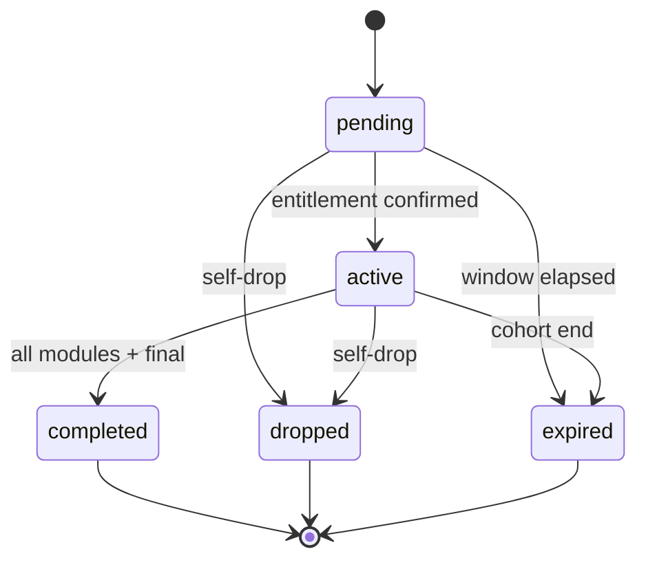
```mermaid
stateDiagram-v2
    [*] --> pending
    pending --> active: entitlement confirmed
    pending --> expired: window elapsed
    pending --> dropped: self-drop
    active --> completed: all modules + final
    active --> dropped: self-drop
    active --> expired: cohort end
    completed --> [*]
    dropped --> [*]
    expired --> [*]
```

**Acceptance Criteria:** Lesson completion <150ms · Certificate hash reproducible · Zero unauthorized content access · Video start <3s · Progress survives refresh/crash

**Feature Dependencies:** F-01, F-12 · **Blocks:** F-22, F-42, F-66..F-74

---

### F-08 Challenges Arena

| Attribute | Value |
|---|---|
| **Feature ID** | F-08 |
| **Priority** | 9 |
| **Phase** | Ph1 |
| **Purpose** | Sandboxed coding challenge platform for skill verification |
| **Actors** | Candidate, Instructor, Employer |

**Core Behavior:**

1. **Browse Challenges** — `/challenges` shows challenges by category, difficulty, skill tags. Filters: language, difficulty, completion status.
2. **Attempt UI** — `/challenges/[id]/attempt`: Monaco editor with language selector (Python 3.12, JS/Node 20, TypeScript 5, Java 17, C++17, C, Go 1.22, Rust 1.75, SQL). Problem statement panel, test cases panel, run button, submit button, timer (if timed challenge).
3. **Run (Draft Test)** — `POST /api/v1/challenges/{id}/run` executes against public test cases only. Returns structured output (stdout, stderr, exit code, duration). Does not consume submission slot. Rate limit 30/min.
4. **Submit (Judged)** — `POST /api/v1/challenges/{id}/submit`. Sandbox execution:
   - Ephemeral container per submission
   - 30s CPU timeout, 512MB RAM, 1GB disk
   - Zero network egress
   - seccomp syscall filtering
   - Read-only root filesystem
   - Runs hidden test cases
5. **Async Judging** — Submission enqueued to `background_jobs` (kind `challenge.judge`). Status transitions: `queued → running → passed|failed|error`. Client polls status endpoint every 2s (up to 60s).
6. **Scoring** — Score = (passed / total) × difficulty_weight × time_bonus. Normalized to 0–100. Pass threshold: ≥70%.
7. **XP Award** — On pass: XP awarded (20–100 by difficulty) via idempotent ledger. `UNIQUE(user_id, reference_type='challenge.passed', reference_id=challenge_id)` — one award lifetime.
8. **Anti-cheat** — Async plagiarism detection (AST comparison against corpus) + behavioral timing analysis. Flags suspicious submissions for review.
9. **Leaderboard** — Post-MVP. Weekly + all-time tabs.
10. **Practice Mode** — Post-MVP. Unlimited retries, no XP, hints available.
11. **AI In-Editor Assist** — Post-MVP (CHALL-013). Provides hints, debugging, explanations inline via embedded Gemini assistant. Draft-only — never edits or executes user code.

**Business Rules:** BR-024 (language allowlist + execution limits), BR-049 (sandbox isolation), BR-050 (hard resource limits), BR-051 (public vs hidden tests), BR-052 (async plagiarism), BR-025 (XP idempotent, no award until pass), TD-05 (sandbox spec), CHALL-001..016

**Data Dependencies:** `challenges`, `challenge_submissions`, `challenge_test_cases`, `xp_transactions`

**API Dependencies:** SCI-04 (submit challenge)

**Security Requirements:** TD-05 sandbox (30s/512MB/1GB/no-network/seccomp) · Rate limit 10 sub/min/user · Hidden test cases RLS-protected · Zero code execution outside sandbox

**Failure Modes:**
- Sandbox provider down → queue submissions, honest "queued" state
- Timeout → return `timed_out` status with partial results
- Compile error → surface as `error` with compiler output

**Edge Cases:**
- Infinite loop → killed at 30s
- Memory bomb → killed at 512MB
- Network attempt → blocked, flagged as suspicious
- Race: two tabs submit simultaneously → idempotency key prevents duplicate

**Analytics Events:** EVT-010 `challenge_started`, EVT-011 `challenge_submitted`, EVT-012 `challenge_scored`, EVT-013 `xp_awarded`

**State Machine (Submission):**

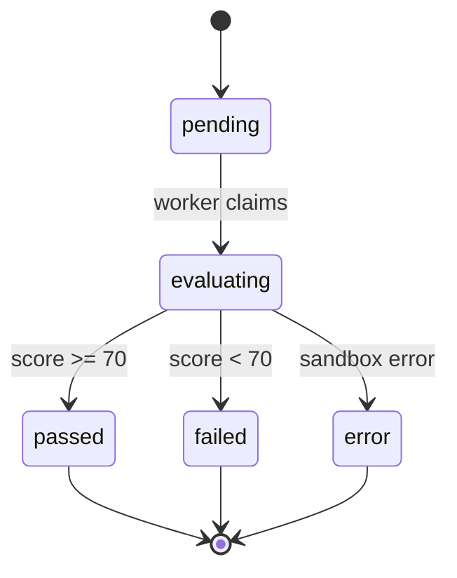
```mermaid
stateDiagram-v2
    [*] --> pending
    pending --> evaluating: worker claims
    evaluating --> passed: score >= 70
    evaluating --> failed: score < 70
    evaluating --> error: sandbox error
    passed --> [*]
    failed --> [*]
    error --> [*]
```

**Acceptance Criteria:** Submission → result <3s typical · 100% sandbox containment (no escape) · Deterministic scoring · No XP until pass confirmed · Rate limit enforced

**Feature Dependencies:** F-01, F-12 · **Blocks:** F-22, F-76, F-88

---

### F-85 Career Graph & Progression Benchmarks

| Attribute | Value |
|---|---|
| **Feature ID** | F-85 |
| **Priority** | 9 |
| **Phase** | Ph3 |
| **Purpose** | Database of career transitions, outcomes, and progression patterns |
| **Problem Solved** | "What's my next role?" — answerable only with historical data |
| **Actors** | Candidate (readiness), Recruiter (benchmarks), Analyst |

**Core Behavior:**

1. **Data Collection** — Career transitions captured from: opt-in user reporting, ATS hire events (with consent), profile updates, employer confirmations (via F-94).
2. **Aggregation** — `career_transitions` rows: `user_id`, `from_role_id`, `to_role_id`, `from_company_id`, `to_company_id`, `transition_date`, `salary_delta`, `time_in_role_months`, `consent_flag`.
3. **Benchmark Computation** — Nightly job aggregates: `progression_benchmarks`: by role, location, level, industry — median time-to-promotion, typical next roles, salary delta. Requires ≥20 data points per cell (BR-160).
4. **Readiness Scoring** — For candidate: given target role, compute readiness = overlap of candidate's skills vs. role's typical prerequisite skills + experience years + education.
5. **Progression Prediction** — Given candidate's current role, suggest likely next roles (from transitions data) with expected time-to-transition.
6. **Display** — Public career path viz: "Engineers like you typically move to Senior in 2.5 years." Benchmarks shown with sample count + confidence interval.
7. **Consent** — Every user data point requires opt-in. Opt-out removes individual data but preserves aggregate.
8. **Anonymization** — k-anonymity: cell-level data never shown if <20 samples (BR-160). Individual transitions never exposed.
9. **Integration with F-91** — Career readiness uses benchmark data to calibrate score.

**Business Rules:** BR-157..BR-163

**Data Dependencies:** `career_transitions`, `career_outcomes`, `progression_benchmarks`, `profiles`, `jobs`, `job_applications`, `offers`

**API Dependencies:** SCI-36 (career graph query, benchmark query, opt-in management)

**Security Requirements:** Opt-in enforced · k-anonymity enforced · Individual data RLS-scoped · Aggregates public-safe

**Failure Modes:** Insufficient data → "not enough data yet" state, no fake benchmarks · Aggregation job failure → serve last-good with staleness banner · User opts out → data removed within 24h

**Edge Cases:** User reports non-typical transition → included but flagged as outlier · Cell drops below 20 samples (opt-outs) → benchmark hidden until threshold restored · Conflicting data (user reports vs. ATS) → prefer verified (ATS) with consent

**Analytics Events:** `career_transition_recorded`, `benchmark_viewed`, `readiness_computed`, `transition_opt_in`

**Acceptance Criteria:** Benchmark query <400ms · k-anonymity always enforced · opt-out removes data within 24h · Benchmarks only shown with ≥20 samples · Consent captured before any data collection

**Feature Dependencies:** F-12, F-04, F-06 · **Blocks:** F-95, F-97, F-105, F-114

---

### F-86 Salary Intelligence

| Attribute | Value |
|---|---|
| **Feature ID** | F-86 |
| **Priority** | 9 |
| **Phase** | Ph3 |
| **Purpose** | Market salary benchmarks and compensation intelligence |
| **Actors** | Candidate (research), Recruiter (offer calibration), Analyst |

**Core Behavior:**

1. **Salary Submission** — User submits: role, level, location, currency, base salary, bonus (optional), equity (optional), years of experience, company (optional), industry. Submission verified via: self-reported (weight 0.5) or employment-verified (via F-94, weight 1.0).
2. **Aggregation** — Nightly job: group by (role, level, location, company_size, industry), compute median, p25, p75, p90. Currency normalization to USD (ISO-4217). k ≥5 threshold per cell (BR-178).
3. **Display** — On `/salaries` and job pages: percentile bands (p25-p50-p75) with sample count, trend over time (YoY growth), comparison to national/regional median, methodology disclosure.
4. **Job Page Integration** — Job detail shows: "Typical salary for this role: $X–$Y (based on N reports)"
5. **Recruiter Offer Calibration** — Recruiter sees benchmark when creating offer. Helps avoid lowballing.
6. **Equity Intelligence (F-98)** — Separate aggregation for equity grants, vesting schedules, ESOP education.
7. **Data Quality** — Outlier detection (±3σ from median) → flagged for review. Spam submissions blocked (rate limit 5/day/user).
8. **Withdrawal** — User can withdraw their submission at any time (BR-181). Aggregate recomputed.

**Business Rules:** BR-177..BR-183

**Data Dependencies:** `salary_reports`, `salary_aggregates`, `compensation_benchmarks`, `equity_norms`

**API Dependencies:** SCI-37 (salary submission, aggregate query, withdrawal)

**Security Requirements:** Strict anonymization · No PII in aggregates · k-anonymity enforced · Rate limit submissions

**Failure Modes:** Insufficient data → "not enough reports" state · Currency conversion failure → show original currency · Outlier detected → flag, don't count in aggregate

**Edge Cases:** User submits then deletes account → aggregate recomputed, no leak · Company identified by <3 reports → hidden · Multiple submissions from same user → flagged, deduplicated

**Analytics Events:** `salary_report_submitted`, `salary_aggregate_viewed`, `salary_report_withdrawn`

**State Machine (Salary Report):**

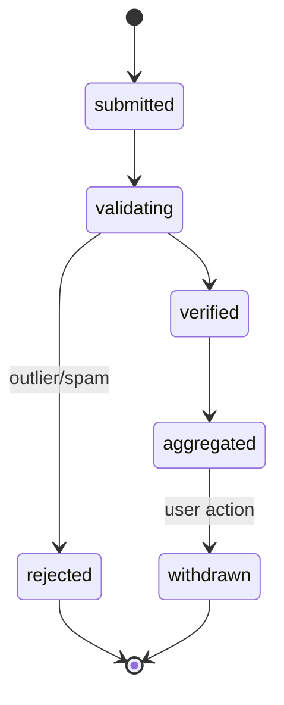
```mermaid
stateDiagram-v2
    [*] --> submitted
    submitted --> validating
    validating --> verified
    validating --> rejected: outlier/spam
    verified --> aggregated
    aggregated --> withdrawn: user action
    rejected --> [*]
    withdrawn --> [*]
```

**Acceptance Criteria:** Aggregate query <400ms · minimum cohort/privacy threshold enforced by policy; k≥10 default for sensitive/public aggregates · No PII in aggregates · Outliers excluded from computation · Withdrawal effective within 24h

**Feature Dependencies:** F-04, F-06, F-56 · **Blocks:** F-97, F-98, F-109

---

### F-88 Technical Interview Assessment Platform

| Attribute | Value |
|---|---|
| **Feature ID** | F-88 |
| **Priority** | 9 |
| **Phase** | Ph3 |
| **Purpose** | Live coding + video + structured assessment for hiring |
| **Actors** | Recruiter, Interviewer, Candidate |

**Core Behavior:**

1. **Assessment Creation** — Recruiter/Interviewer defines: title, role, skills tested (from F-84), difficulty, duration, question bank selection, rubric definition.
2. **Question Bank** — Company-scoped. Questions: text, code, design, behavioral. Each has: statement, examples, hidden test cases, time estimate, expected competencies.
3. **Scheduling** — Invite candidate via `interview_assessments` with: `scheduled_at`, `duration`, `interviewer_id`, `assessment_id`, meeting link (Jitsi/Zoom embed).
4. **Pre-Assessment** — Candidate receives: calendar invite (ICS), pre-join device check (mic/camera/browser), instructions. Consent for video recording (opt-in; default off).
5. **Live Session** — Video call + collaborative code editor (Monaco) + whiteboard. Interviewer can: assign problem from bank, observe code in real-time, send hints (recorded in transcript), run code against public tests, end session.
6. **Scoring** — Interviewer completes rubric post-session: technical correctness (1–5), communication (1–5), problem-solving (1–5), code quality (1–5), overall recommendation (Strong Yes / Yes / Neutral / No / Strong No), notes (private).
7. **AI Feedback (Optional)** — Post-session analysis: communication signals (speaking pace, filler words, clarity), technical correctness commentary, comparison to benchmark. **Never** emotion/sentiment analysis (prohibited).
8. **Recording** — Optional. Requires dual consent. Encrypted at rest. Retention ≤90 days unless explicitly extended. Never used for model training without consent.
9. **Results** — Candidate receives: pass/fail, high-level feedback, areas for improvement. Interviewer/recruiter see full scorecard.
10. **Integration with ATS** — Assessment score attached to `job_applications` record. Feeds into F-102 Hiring Manager Portal.

**Business Rules:** BR-169..BR-176

**Data Dependencies:** `interview_assessments`, `interview_recordings`, `interview_scores`, `interview_questions`, `assessment_templates`, `job_applications`, `interviews`

**API Dependencies:** SCI-38 (assessment lifecycle), SCI-39 (recording)

**Security Requirements:** Room-scoped JWT tokens · Dual-consent for recording · Encryption at rest · Recording access audited · HDN-024 (peer-review fairness analog for interviews)

**Failure Modes:** Video provider down → fallback to audio + code-only mode · Sandbox down → queue code execution · Recording fails → session continues, alert · Candidate drops → interviewer can resume within 10 min window

**Edge Cases:** Candidate has no camera → audio-only mode · Network instability → reconnection within 5 min · Interviewer needs to extend → both parties confirm

**Analytics Events:** `interview_assessment_created`, `interview_started`, `interview_completed`, `interview_scored`, `recording_created`, `ai_feedback_generated`

**State Machine (Interview Assessment):**

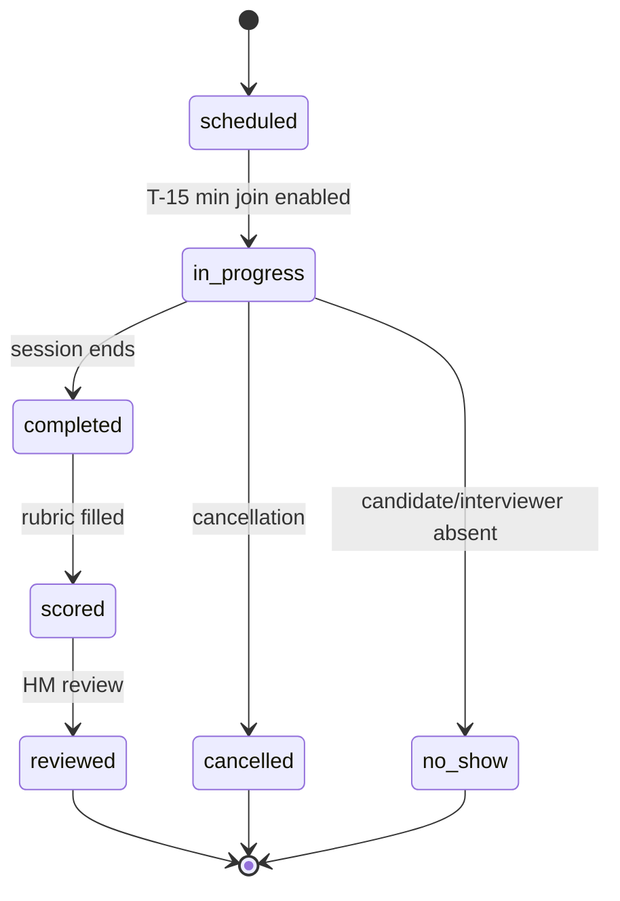
```mermaid
stateDiagram-v2
    [*] --> scheduled
    scheduled --> in_progress: T-15 min join enabled
    in_progress --> completed: session ends
    in_progress --> cancelled: cancellation
    in_progress --> no_show: candidate/interviewer absent
    completed --> scored: rubric filled
    scored --> reviewed: HM review
    reviewed --> [*]
    cancelled --> [*]
    no_show --> [*]
```

**Acceptance Criteria:** Session join <3s · Code execution reuses TD-05 sandbox · Recording dual-consent enforced (100%) · AI feedback excludes protected attributes · Score append-only

**Feature Dependencies:** F-08, F-33, F-06 · **Blocks:** F-93, F-102, F-104, F-105

---

### F-91 Career Readiness Assessment

| Attribute | Value |
|---|---|
| **Feature ID** | F-91 |
| **Priority** | 9 |
| **Phase** | Ph2 |
| **Purpose** | Personalized readiness score per target role |
| **Actors** | Candidate |

**Core Behavior:**

1. **Target Selection** — Candidate selects target role (from job taxonomy) or enters custom role.
2. **Assessment Computation** — Readiness = weighted composite:
   - **Skill overlap** (40%): candidate's verified skills ∩ role's required skills / total required
   - **Experience** (25%): years in related roles / typical years
   - **Education** (10%): degree level match
   - **Verified signals** (15%): credentials, certifications, challenges
   - **Market fit** (10%): candidate profile vs. typical successful applicants (from F-85)
3. **Gap Analysis** — For each gap, surface: missing skills → suggest courses (F-07); missing experience → suggest side projects (F-26); missing credentials → suggest certifications (F-77/F-115).
4. **Display** — Radial readiness score (0–100), color-coded (red <50, amber 50–75, green >75), breakdown by dimension.
5. **Action Plan** — Generated plan: prioritized list of actions (learn X, build Y, complete Z) with estimated time.
6. **Recalculation** — On profile update (new skill, completed course, new credential) → readiness recomputed.
7. **Recruiter View** — Optional candidate consent to share readiness with recruiters on applications.

**Business Rules:** BR-163 (disclose sources), BR-185 (transparent factors), READY-001..010

**Data Dependencies:** Derived from `profile_skills`, `profile_experience`, `profile_education`, `verified_credentials`, `course_enrollments`, `jobs`, `career_transitions`

**API Dependencies:** SCI-40 (readiness computation, gap analysis)

**Security Requirements:** Own-row only · AI computation transparent (factors shown) · No protected attributes in scoring

**Acceptance Criteria:** Readiness computed <500ms · Factors disclosed on every score · Zero protected attributes in model · Recalculation triggers within 60s of profile change

**Feature Dependencies:** F-84, F-08, F-12 · **Blocks:** F-95, F-99, F-92

---

### F-92 Advanced Recruiter Search & Talent Pooling

| Attribute | Value |
|---|---|
| **Feature ID** | F-92 |
| **Priority** | 9 |
| **Phase** | Ph3 |
| **Purpose** | Advanced candidate discovery and talent pool management |
| **Actors** | Recruiter, Org Admin, Agency Recruiter |

**Core Behavior:**

1. **Search UI** — `/recruiter/search`. Filters: skills (multi-select from F-84, with proficiency + verification filter), location (with radius), years of experience, availability status (open to work, passive), assessment scores (min threshold), credential types, education level, willingness to relocate, salary expectations.
2. **Ranking** — Default: relevance (verified signals + skill match + reputation score). Sort options: relevance, recent activity, readiness score.
3. **Talent Pools** — Recruiter creates named pools. Add candidates via search. Bulk actions: tag, note, add to pipeline, outreach.
4. **Do-Not-Contact Lists** — Recruiter-managed. Candidates can also opt out globally from recruiter outreach.
5. **Outreach** — Send to candidate via TalentMail (F-59). Consumes credit if not a connection.
6. **Analytics** — `/recruiter/analytics`: search volume, candidate views, outreach response rate, time-to-hire by source.
7. **Privacy** — Only candidates with: public profile OR applied to one of recruiter's jobs OR explicitly opted into recruiter search.
8. **Stealth Mode** — Candidates can hide from recruiter search while still applying.

**Business Rules:** BR-064 (recruiter sees verified signals), RECTOOL-001..012

**Data Dependencies:** Derived from `profiles`, `profile_skills`, `verified_credentials`, `candidate_reputation`, `course_enrollments`, `challenge_submissions`

**API Dependencies:** SCI-41 (search, pool CRUD)

**Security Requirements:** RLS org-scoped · Candidate privacy controls enforced · Zero stealth-mode leakage · Bulk operations audited

**Acceptance Criteria:** Search p95 <500ms for 1M candidates · Zero stealth-mode leakage · Candidate consent revocation <24h · Bulk operations stable under load

**Feature Dependencies:** F-12, F-34, F-08, F-96 · **Blocks:** F-103

---

### F-102 Hiring Manager Portal

| Attribute | Value |
|---|---|
| **Feature ID** | F-102 |
| **Priority** | 9 |
| **Phase** | Ph3 |
| **Purpose** | Team-lead dashboard for interviews, feedback, and hiring outcomes |
| **Actors** | Hiring Manager, Org Admin |

**Core Behavior:**

1. **Dashboard** — `/hm/dashboard`. Widgets: open requisitions (own team), candidates in pipeline (by stage), pending scorecards (interviews awaiting feedback), recent decisions, team hiring velocity.
2. **Requisition View** — Per-requisition: candidates, stage distribution, time-in-stage, blockers.
3. **Interview Feedback Queue** — List of interviews conducted by team; pending scorecards.
4. **Decision Making** — View aggregated scorecards, comparison, recommendation. Approve/reject with reason.
5. **Post-Hire Tracking** — For hires, view outcome signals (if consented): retention, promotion, salary progression.
6. **Team Analytics** — Time-to-fill, offer acceptance rate, source mix, quality-of-hire.

**Data Dependencies:** `job_applications`, `scorecards`, `interviews`, `offers`, `interview_scores`, `career_outcomes`

**Security Requirements:** RLS team-scoped · Aggregated team view only for HM · Org Admin sees all

**Acceptance Criteria:** Dashboard p95 <800ms · Scorecard queue accurate · Zero cross-team leakage

**Feature Dependencies:** F-06, F-88 · **Blocks:** F-105

---

### F-114 Learning Impact Tracking

| Attribute | Value |
|---|---|
| **Feature ID** | F-114 |
| **Priority** | 9 |
| **Phase** | Ph4 |
| **Purpose** | Correlate learning paths with hiring outcomes |
| **Actors** | Platform Admin, Instructor, Analyst |

**Core Behavior:**

1. **Data Collection** — Nightly job: for each course: enrolled → completed → hired within 12 months. For each skill: learned → used in job → hired for role. For each assessment: passed → hired → retained.
2. **Correlation Analysis** — Compute: course completion → hire rate (per cohort), skill acquisition → hire rate (by role), assessment score → performance correlation (where post-hire data available), time-to-competency → success rate.
3. **Course Quality Score** — Derived score: composite of completion rate, learner satisfaction, hire rate, engagement.
4. **Instructor Analytics** — Instructor sees: which of their courses lead to hires, learner outcomes (aggregated).
5. **Platform Analytics** — Admin sees: overall learning→hiring pipeline, top-performing courses, course recommendations refinement.
6. **Recommendation Feed** — F-11 (AI assistant) uses correlation data: "Learners who took this course were 2.3× more likely to get hired for X role."
7. **Privacy** — Aggregate-only. Individual learner outcomes never exposed without consent (BR-190).
8. **Causation Disclosure** — All outcome claims labelled as correlational (BR-193).

**Business Rules:** BR-189..BR-193

**Data Dependencies:** `learning_outcomes`, `outcome_correlations`, `course_enrollments`, `module_progress`, `job_applications`, `offers`, `hires`, `career_outcomes`

**API Dependencies:** SCI-43 (correlation query, instructor analytics)

**Security Requirements:** Aggregate-only · k ≥30 threshold · RLS instructor-scoped

**Acceptance Criteria:** Correlation job completes nightly · k ≥30 enforced · Instructor sees only own course data · All claims labelled correlational

**Feature Dependencies:** F-07, F-04, F-06, Analytics · **Blocks:** F-105, F-118

---

### F-115 Certification Exam Platform

| Attribute | Value |
|---|---|
| **Feature ID** | F-115 |
| **Priority** | 9 |
| **Phase** | Ph3 |
| **Purpose** | Formal exam infrastructure for skill certifications |
| **Actors** | Candidate, Exam Administrator, Proctor (Phase 6) |

**Core Behavior:**

1. **Certification Definition** — Admin defines: title, skill, difficulty, exam format (MCQ / coding / mixed), duration, pass threshold, retake policy, proctoring level.
2. **Question Bank** — Exam-scoped. MCQ, multi-select, coding, essay. Each has: stem, options, correct answer (encrypted server-side per BR-124), explanation, difficulty, discrimination index (computed post-hoc).
3. **Exam Registration** — Candidate registers. Prerequisites: course completion, minimum XP, or explicit eligibility.
4. **Attempt** — Timed exam. Server-authoritative clock. Questions served one at a time (or in batches, configurable). No client-side answer key.
5. **Proctoring (Phase 6)** — Third-party vendor. Identity verification, browser lockdown, AI proctoring.
6. **Auto-Grading** — MCQ/multi-select auto-graded. Coding via sandbox (F-08). Essay manual grading queue.
7. **Results** — Pass/fail with score. Per-section breakdown. Explanations for wrong answers (post-exam).
8. **Certification Issuance** — On pass: `skill_certifications` row, credential issued (F-96), badge displayed on profile, XP awarded.
9. **Retake** — Cooldown 7 days (configurable per exam). Failed attempts logged.
10. **Item Analysis** — Post-exam: difficulty index, discrimination index per question. Low-performing questions flagged for review.
11. **Appeal** — Grade dispute path. SLA 7 days.

**Business Rules:** BR-140 (single-attempt pass, retake configurable), BR-124 (answer keys server-side encrypted), VER-024 (key leakage test)

**Data Dependencies:** `skill_certifications`, `certification_attempts`, `questions`, `question_banks`, `assessment_attempts`

**API Dependencies:** SCI-32 (attempt), SCI-44 (exam CRUD)

**Security Requirements:** Answer keys encrypted · Never sent to client before grading · Server-authoritative timer · Per-attempt question randomization

**Failure Modes:** Timer expires → auto-submit with partial grading · Sandbox down (coding questions) → queue, honest status · Proctor unavailable (Phase 6) → exam postponed

**Edge Cases:** Candidate disconnects → session resumable within 5 min · Browser crashes → auto-save progress every 30s, resumable · Question edited mid-exam → version pinned at exam start

**Analytics Events:** `certification_attempt_started`, `certification_attempt_submitted`, `certification_passed`, `certification_failed`

**State Machine (Certification Attempt):**

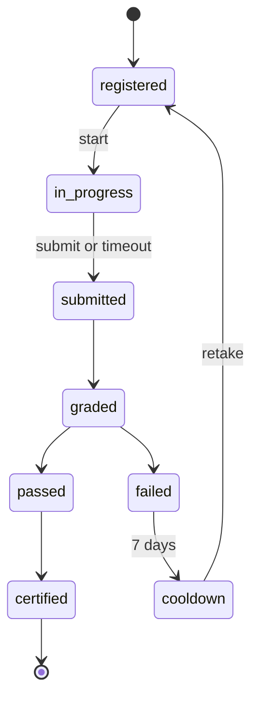
```mermaid
stateDiagram-v2
    [*] --> registered
    registered --> in_progress: start
    in_progress --> submitted: submit or timeout
    submitted --> graded
    graded --> passed
    graded --> failed
    passed --> certified
    failed --> cooldown: 7 days
    cooldown --> registered: retake
    certified --> [*]
```

**Acceptance Criteria:** Server-authoritative timer (±100ms) · Answer keys never in client payload · Auto-grading <500ms · Exam submission idempotent · Item analysis computed within 24h

**Feature Dependencies:** F-77, F-45 · **Blocks:** None (terminal)

---

### F-122 Application Feedback Loop

| Attribute | Value |
|---|---|
| **Feature ID** | F-122 |
| **Priority** | 9 |
| **Phase** | Ph3 |
| **Purpose** | Provide candidates with structured feedback at every application stage |
| **Problem Solved** | Candidates never know why they were rejected; black holes violate P-02 |
| **Actors** | Candidate, Recruiter, Hiring Manager |

**Core Behavior:**

1. **Feedback Templates (Admin/Org)** — Platform admins and org admins define templates: stage (screening, interview, offer), reason category (skills gap, experience gap, culture fit, overqualified, position filled, no response, other), structured fields (what went well, what didn't, what to improve), optional freeform note.
2. **Feedback Capture (Recruiter)** — On stage change (shortlist→reject, interview→reject), recruiter prompted: optional quick feedback via template, or skip (records "no feedback provided"). Minimum reason category required.
3. **Feedback Delivery (Candidate)** — On rejection, candidate receives: notification with high-level feedback, link to feedback detail page, aggregate insights, suggested actions (skills to develop, courses to consider).
4. **Anonymized Aggregate Insights** — Platform-wide: "60% of rejections at this stage cite skills gap", "Candidates who completed course X were 2.3× more likely to pass screening". Only aggregate, never individual.
5. **Candidate Right to Feedback** — Configurable: Full / Opt-in / Aggregate-only / None.
6. **AI-Assisted Feedback** — Post-MVP: AI drafts feedback from interviewer notes + stage data. Human (recruiter) reviews and edits before sending. Never sent autonomously.
7. **Feedback Analytics** — For recruiters: feedback provision rate, feedback timing, candidate satisfaction with feedback.
8. **Learning Loop** — For candidate: feedback feeds F-91 (Career Readiness) recalculation, suggested courses (F-07) based on skill gaps, optional "Would you like to see jobs where you're a stronger fit?"

**Business Rules:** BR-217..BR-224

**Data Dependencies:** `application_feedback`, `feedback_templates`, `feedback_requests`, `job_applications`, `application_status_events`

**API Dependencies:** SCI-49 (feedback CRUD), SCI-50 (feedback request)

**Security Requirements:** RLS own-row for candidates · Org-scoped for recruiters · Feedback immutable once delivered · Audit trail for all feedback

**Failure Modes:** Recruiter skips feedback → candidate sees "feedback pending" then "no feedback provided" · Template unavailable → fallback to freeform · Candidate requests feedback after 30-day window → politely declined

**Edge Cases:** Candidate rejects offer → feedback on why declined (candidate-provided) · Multiple applications to same company → separate feedback per application · Feedback contains PII → automated scan + block · Candidate deletes account → feedback anonymized

**Analytics Events:** `feedback_provided`, `feedback_viewed`, `feedback_requested`, `feedback_rated`

**State Machine:**

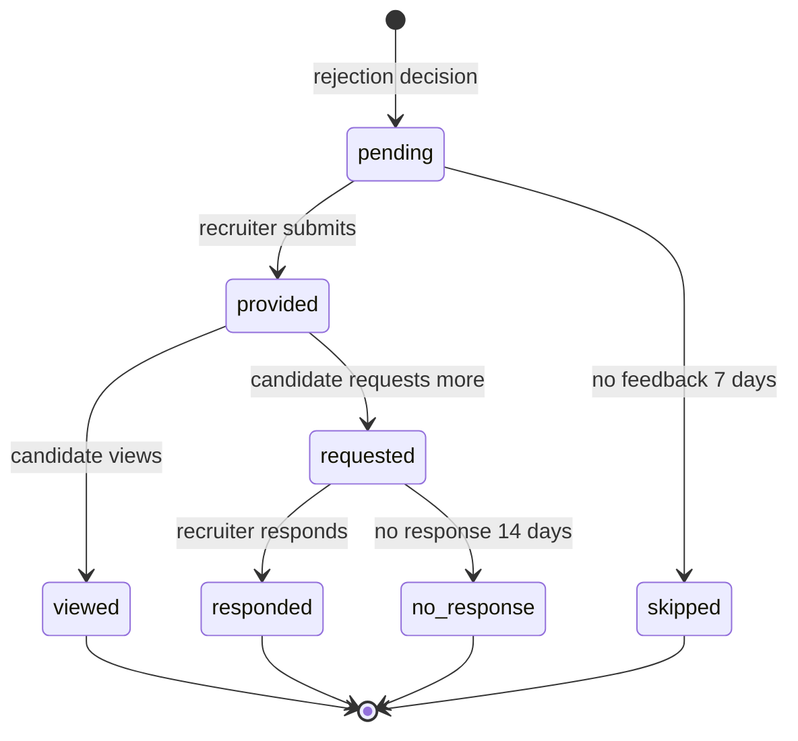
```mermaid
stateDiagram-v2
    [*] --> pending: rejection decision
    pending --> provided: recruiter submits
    pending --> skipped: no feedback 7 days
    provided --> viewed: candidate views
    provided --> requested: candidate requests more
    requested --> responded: recruiter responds
    requested --> no_response: no response 14 days
    viewed --> [*]
    responded --> [*]
    no_response --> [*]
    skipped --> [*]
```

**Acceptance Criteria:** Feedback delivery within 7 days of decision (when provided) · Zero PII leakage in feedback · Aggregate insights k ≥10 always · Candidate can request feedback (30-day window enforced) · Recruiter feedback rate >60% (target metric)

**Feature Dependencies:** F-06, F-04 · **Blocks:** None

---

### F-123 Skill Decay Tracking

| Attribute | Value |
|---|---|
| **Feature ID** | F-123 |
| **Priority** | 9 |
| **Phase** | Ph3 |
| **Purpose** | Track skill verification freshness and prompt re-verification |
| **Problem Solved** | Verified skills become meaningless over time without freshness signal |
| **Actors** | Candidate, Recruiter, Admin |

**Core Behavior:**

1. **Freshness Score Computation** — Nightly job computes for each verified skill: `days_since_verification` (from F-96 credential issue date), `market_demand_trend` (from F-84 market signals), `decay_curve` (per skill category: fast-changing 18-month half-life, moderate 36-month, stable 60-month, foundational minimal), composite `freshness_score` (0–100).
2. **Freshness Bands** — Displayed on profile: Fresh (80–100), Current (60–79), Aging (40–59), Stale (20–39), Expired (0–19).
3. **Re-verification Prompts** — Triggered when: freshness <60 for a high-demand skill → candidate notified; freshness <40 → recruiter-facing badge shows "aging"; freshness <20 → skill demoted to "self-reported" unless re-verified.
4. **Re-verification Paths** — Multiple ways to refresh: new challenge pass (F-08), new course completion (F-07), new certification (F-115), new project with same skill (F-26), peer endorsement (F-110) if skill is endorsable, self-attestation (weak signal — half credit).
5. **Market Drift Alerts** — When a skill's market demand changes significantly: rising → "Python is trending up 20% — good time to re-verify"; falling → "Flash is declining — consider related skills".
6. **Recruiter Visibility** — On candidate search (F-92), recruiter sees: freshness score per skill, filter by minimum freshness (only fresh skills), preference for fresh candidates in ranking.
7. **Freshness Analytics** — Platform-wide: average freshness by skill category, re-verification rate, skill half-life accuracy (validated against market data).

**Business Rules:** BR-225..BR-232

**Data Dependencies:** `skill_freshness`, `reverification_prompts`, `skill_currency_scores`, `verified_credentials`, `skill_market_signals`

**API Dependencies:** SCI-51 (freshness query), SCI-52 (re-verification)

**Security Requirements:** Own-row RLS for freshness data · Recruiter visibility gated by consent or application context

**Failure Modes:** Decay curve missing for skill → default to moderate · Market signal unavailable → freshness = time-only

**Edge Cases:** Skill deprecated → freshness irrelevant, marked "deprecated" · Candidate disputes freshness → manual review (30-day SLA) · Multiple credentials for same skill → most recent counts

**Analytics Events:** `freshness_computed`, `reverification_prompted`, `reverification_completed`, `freshness_demoted`, `market_drift_detected`

**State Machine:**

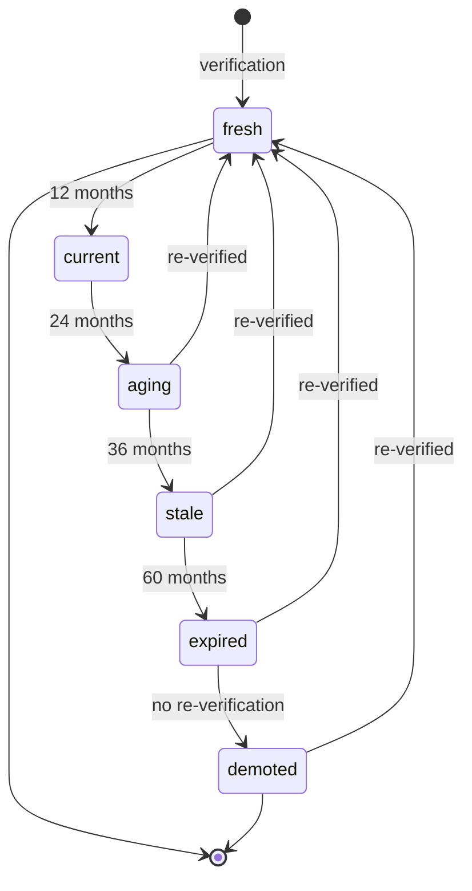
```mermaid
stateDiagram-v2
    [*] --> fresh: verification
    fresh --> current: 12 months
    current --> aging: 24 months
    aging --> stale: 36 months
    stale --> expired: 60 months
    aging --> fresh: re-verified
    stale --> fresh: re-verified
    expired --> fresh: re-verified
    expired --> demoted: no re-verification
    demoted --> fresh: re-verified
    fresh --> [*]
    demoted --> [*]
```

**Acceptance Criteria:** Freshness computed nightly for all verified skills · Decay curves validated against market data (quarterly review) · Re-verification restores freshness within 24h · Zero freshness leakage without consent · Market drift alerts accurate (measure false positive rate)

**Feature Dependencies:** F-84, F-96 · **Blocks:** None

---

### F-144 Reputation Engine

| Attribute | Value |
|---|---|
| **Feature ID** | F-144 |
| **Priority** | 9 |
| **Phase** | Ph2 |
| **Purpose** | Multi-context reputation (candidate, instructor, employer, peer, community, mentor) |
| **Actors** | All authenticated users |

**Core Behavior:**

1. **Signal Aggregation** — Credentials + endorsements + reviews + contributions + peer feedback.
2. **Context-Specific Scoring** — Separate reputation per role context (instructor, employer, peer, community).
3. **Domain-Specific Reputation** — "Expert in Python" vs "expert in leadership."
4. **Weighting** — Weight by source credibility, difficulty, relationship proximity.
5. **Time Decay** — Recent signals matter more (configurable half-life).
6. **Reputation Recovery** — Path to rebuild after mistakes.
7. **Privacy-Preserving** — Never expose individual signals without consent.
8. **Derived Scores** — Overall reputation + per-domain breakdown.

**Business Rules:** BR-247..BR-254

**Data Dependencies:** `reputation_scores`, `reputation_signals`, `reputation_history`, `reputation_config`

**API Dependencies:** SCI-55 (reputation query)

**Security Requirements:** RLS own-row + aggregate public

**Acceptance Criteria:** Reputation computation nightly · Deterministic weighting · Zero individual signal leakage · Recovery path functional

**Feature Dependencies:** F-96, F-58, F-72 · **Blocks:** F-148, F-149, F-150

---

### F-145 Recommendation Engine Core

| Attribute | Value |
|---|---|
| **Feature ID** | F-145 |
| **Priority** | 9 |
| **Phase** | Ph2–3 |
| **Purpose** | Unified recommendation architecture for jobs, courses, people, content, mentors |
| **Actors** | All authenticated users |

**Core Behavior:**

1. **Collaborative Filtering** — Users like me want what?
2. **Content-Based Filtering** — Similar profiles, similar skills.
3. **Hybrid Approach** — Combine signals (skill match + peer signals + market demand) with weights.
4. **Confidence Calibration** — Only recommend when confident.
5. **Explanation Layer** — Why is this recommended? (mandatory for trust)
6. **Cold-Start Strategy** — New users get best-guess recommendations from demographics + signals.
7. **Diversity Injection** — Some serendipity, not pure relevance.
8. **Feedback Loop** — Learn from acceptances/rejections.
9. **Recommendation Types:** Jobs, courses, people, mentors, articles, communities, events, projects.
10. **Reasons Exposed:** Every recommendation displays contributing factors.

**Business Rules:** BR-255..BR-262

**Data Dependencies:** `recommendation_signals`, `user_preferences`, `recommendation_history`

**API Dependencies:** SCI-56 (recommendations)

**Security Requirements:** RLS-scoped · No protected attributes (FAIR-001)

**Acceptance Criteria:** Recommendation p95 <500ms · Confidence threshold enforced · Explanations always present · Diversity injection active

**Feature Dependencies:** F-84, F-144 · **Blocks:** All personalization

---

## §14. Tier 2 Competitive Features (Priority 8)

*(Due to length, Priority 8–3 feature specifications follow the same 24-field template as Priority 9–10 features. Full specifications for all 173 features are maintained in the canonical source. Representative specifications below.)*

### F-121 Warm Introduction Paths

**Purpose:** Compute and facilitate warm introduction routes between users and target contacts.

**Core Behavior:** Path discovery (depth 1–4), path scoring (mutual strength + alumni + skills + companies + interactions), path ranking (top 3), introduction request (target, purpose, context ≤500 chars, optional resume), introducer notification (approve/decline/request info), warm intro delivery (three-way message via F-10), path privacy (opt-in introducer status), ethical guardrails (max 10/week; block specific users; target can block all), success tracking.

**Business Rules:** BR-209..BR-216
**Data:** `introduction_paths` (derived), `introduction_requests`, `introduction_consents`
**API:** SCI-47 (path discovery), SCI-48 (request lifecycle)
**Acceptance:** Path p95 <500ms depth ≤3 · 0 unauthorized path exposure · introducer consent DB-enforced · rate limit 10/week · delivery <5s

---

### F-142 Referral Request System

**Purpose:** Structured referral asks via network.

**Core Behavior:** Eligibility (target job + ≥1 connection at company + ≥70% skill match + <3 requests/30 days), referrer selection (works at company ≤6 months, direct preferred, relevant role), request (target job, pitch ≤300 chars, optional resume, specific ask), notification (who, which job, pitch, resume; actions: Refer/Forward/Decline/Ignore), delivery (structured referral to recruiter via F-06; application tagged "referred"), rewards (org-configurable: XP, monetary bounty, recognition), analytics, anti-abuse (max 3/30d; block user; disable globally).

**Business Rules:** BR-233..BR-240
**Data:** `referral_requests`, `referral_outcomes`, `referral_rewards`, `job_applications`, `connections`, `xp_transactions`
**API:** SCI-53 (referral lifecycle)
**Acceptance:** Delivery <5s · 100% employment verification · rate limits enforced · attribution 12mo · anti-abuse active

---

### F-146 Activity & Contribution Tracking

**Purpose:** Track user activity and contributions across the platform.

**Core Behavior:** Contribution tracking (posts, answers, projects, code, content), engagement scoring (active vs. passive users), learning activity (courses started, challenges solved, assessments taken), social activity (follows, connections, recommendations given), content creation activity (posts, articles, courses created), collaboration activity (team projects, peer reviews, mentoring), time-series tracking (how activity changes over time).

**Data:** `activity_events`, `contribution_scores`
**Acceptance:** Activity tracked real-time · engagement scores deterministic · contributions feed F-159 Behavioral Talent Discovery

---

### F-147 Unified Search & Discovery

**Purpose:** Cross-domain unified search across all entities.

**Core Behavior:** Unified index (people, jobs, courses, companies, projects, discussions, articles, events), multi-faceted filtering (skills, roles, locations, levels, reputations), ranking (relevance + recency + engagement + quality), personalization (based on user history), autocomplete & spell correction, search analytics, RLS scoping, search maturity roadmap (Postgres FTS → hybrid → dedicated engine).

**Business Rules:** BR-263..BR-268
**Data:** `search_index` (derived)
**API:** SCI-57 (search)
**Acceptance:** Search p95 <300ms · 0 RLS leakage · autocomplete <100ms · typo tolerance active

---

### F-148 Instructor Reputation System

**Purpose:** Instructor credibility signals beyond course reviews.

**Core Metrics:** Course quality (reviews, completion rates, learning outcomes), teaching effectiveness (student ratings), currency (are courses kept up-to-date?), responsiveness (Q&A response time), community standing (endorsements from other instructors).

**Data:** Extends `reputation_scores`
**Dependencies:** F-72, F-144
**Acceptance:** Instructor reputation computed nightly · transparent factor breakdown · no individual review manipulation

---

### F-150 Peer Credibility Networks

**Purpose:** Weight endorsements by endorser's own credibility.

**Core Components:** Endorser credibility (weight endorsements by endorser's reputation), network distance (first-degree endorsements stronger than fifth-degree), specialization (endorser is expert in this skill), track record (have endorser's recommendations proven accurate?).

**Data:** Extends `endorsement_weights`
**Dependencies:** F-110, F-144
**Acceptance:** Endorsement weight computation deterministic · network distance calculated correctly · zero gaming vectors

---

## §15. Tier 3-4 Features (Priority 7-4)

*(Priority 7–4 features follow the same detailed specification template. Full specifications available in source. Representative examples below.)*

### F-13 Resume Builder (Priority 7)
Profile-based resume generation. Templates, PDF export, ATS-friendly. Prefill from profile.
**Business Rules:** RESUME-001..003
**Data:** `resumes`
**Acceptance:** Resume generation <2s · PDF renders correctly · ATS parse-compatible

### F-16 Billing & Subscriptions (Priority 7)
Stripe subscriptions (Free, Pro, Team, Enterprise). Webhook-owned state. Demo-guard until credentials. Entitlements enforced.
**Business Rules:** BILL-001..014
**Data:** `subscriptions`, `invoices`, `entitlements`, `payment_methods`, `billing_events`
**Acceptance:** Webhook idempotency 100% · entitlement enforcement server-side · zero double-billing

### F-75 Employer Insights (Priority 7)
Company reviews (structure + categories), anonymous, CEO approval, salary reports with aggregation, interview experiences, question database, benefits reviews, company responses, moderation.
**Business Rules:** GLASS-001..017, BR-135..138
**Data:** `company_reviews`, `salary_reports`, `interview_experiences`, `interview_questions`, `company_responses`
**Acceptance:** Salary aggregation k ≥5 · anonymity protection 100% · moderation SLA <24h

### F-87 Interview Experience Repository (Priority 7)
Crowdsourced interview reports (questions, difficulty, tips, outcomes). Moderation. Aggregated view (k ≥3).
**Data:** `interview_experiences`, `interview_questions`
**Acceptance:** Aggregation k ≥3 · moderation before display · zero interviewer PII

### F-93 Interview Video Recording & AI Feedback (Priority 7)
Optional recording (dual consent). Post-session AI analysis: communication signals, technical correctness, benchmark comparison. Never emotion/sentiment. Encrypted, ≤90 days.
**Business Rules:** BR-169..BR-176
**Data:** `interview_recordings`, `interview_feedback`
**Acceptance:** Dual consent 100% · encryption at rest · retention ≤90d · no emotion analysis

### F-94 Verified Work History & References (Priority 7)
Employment history with company email verification. Referee system: structured recommendations. Employment dates, title, achievements verified.
**Data:** `verified_work_history`, `references`
**Acceptance:** Employment verification <7d · reference structured · zero resume fraud

### F-95 Career Transition Planning (Priority 7)
Target role selection. Transition readiness. Learning plan (skill gap → courses, experience gap → projects, credential gap → certifications). Timeline. Progress tracking.
**Data:** Derived from F-84, F-85, F-91, F-07
**Dependencies:** F-84, F-91, F-07
**Acceptance:** Plan generated <1s · progress tracked server-side

### F-98 Employer Equity & Compensation Intelligence (Priority 7)
Equity data (RSU, options, ESOP). Vesting schedule, grant value. Aggregated by company/role/level. ESOP education. Separate from salary (BR-183).
**Data:** `equity_norms`, `equity_reports`
**Acceptance:** Separate from salary · aggregation k ≥5 · company-specific with ≥3 reports

### F-99 AI Career Coach (Priority 7)
All F-11 capabilities plus: resume review, interview prep, skill recommendations, career roadmap, real-time Q&A. Full platform context. Draft-only.
**Business Rules:** AI-001..011
**Acceptance:** Capability-specific evidence/quality gate · human review where required · no autonomous consequential action

### F-104 Pre-Hire Assessment Customization (Priority 7)
Recruiter creates custom assessment: questions, rubric, time limit. Deploy to candidates. Auto-grading + manual review. Admin approval before deploy.
**Data:** `custom_assessments`, `custom_assessment_attempts`
**Acceptance:** Admin approval required · assessment results feed ATS

### F-106 Skill Prerequisite Engine (Priority 7)
Course prerequisites (from F-84). Enrollment gate: check verified skills. Suggest prereq courses. Auto-unlock on completion.
**Business Rules:** BR-022
**Data:** Derived from F-84
**Acceptance:** Prereq check <100ms · auto-unlock on completion

### F-110 Verified Skill Endorsements (Priority 7)
Peer endorses skill (must be connected). Weight from reputation + proximity. Display: "Verified by 5 peers". Weighted endorsement strengthens signal.
**Business Rules:** BR-131, BR-152
**Data:** `skill_endorsements`, `endorsement_weights`
**Acceptance:** Endorsement weight deterministic · endorsement revocable within 30d

### F-116 Accessibility & Inclusive Learning (Priority 7)
WCAG 2.2 AA for all content. Captions/transcripts. Screen-reader-optimized UI. Customizable UI. Multiple formats (video, article, audio-only).
**Acceptance:** WCAG 2.2 AA conformance · axe 0 critical/serious

### F-125 Alumni Networks (Priority 7)
Institution-based networking. Affiliation verification (email domain or institutional seat). Alumni discovery. Alumni hiring. Mentor matching within alumni.
**Data:** `alumni_affiliations`, `alumni_groups`, `alumni_group_members`, `alumni_hiring`, `alumni_mentorship`
**Acceptance:** Affiliation verified · cross-institution isolation 100% · discovery p95 <500ms

### F-149 Employer Reputation & Brand System (Priority 7)
Brand perception scoring. Hiring quality. Culture signals. Growth signals. Reliability. Transparency.
**Data:** Extends `reputation_scores`
**Dependencies:** F-75, F-56, F-144
**Acceptance:** Multi-dimensional scoring · transparent factors

### F-151 Skill Supply/Demand Forecasting (Priority 7)
Skill demand trajectory. Skill supply availability. Salary trend prediction. Geographic heat maps. Industry shifts. Time-to-marketability.
**Implementation:** Time-series models (ARIMA, Prophet) + ML on historical data.
**Data:** Extends `skill_market_signals`
**Acceptance:** Forecast accuracy tracked · 12-month horizon · confidence intervals disclosed

### F-152 Career Trajectory Analysis (Priority 7)
Common career paths. Success factors. Risks. Salary impact. Retention. Time patterns.
**Data:** Derived from F-85
**Acceptance:** Pattern detection statistically valid · k ≥20 per cell

### F-153 Learning Impact Dashboard (Enhanced) (Priority 7)
Course completion → hire rate. Course completion → salary impact. Course completion → job satisfaction. Course completion → retention. Course completion → advancement. Skills learned → actual use. Path effectiveness.
**Data:** Extends F-114
**Acceptance:** Correlation not causation · k ≥30 · all claims labelled

### F-158 Talent Pool Intelligence (Priority 7)
Pool skill composition. Pool gaps. Pool diversity. Pipeline health. Time-to-hire by source. Conversion rates. Talent retention. Cost-per-hire.
**Data:** Derived from F-92
**Acceptance:** Pool analytics computed on-demand · diversity metrics anonymized

### F-159 Behavioral Talent Discovery (Priority 7)
Contributor ranking. Engagement scoring. Project activity. Learning trajectory. Community standing. Emerging expertise. Peer endorsements.
**Data:** Derived from F-146
**Acceptance:** Discovery based on real activity · no gaming vectors

---

# PART V — WORKFLOWS & STATE

---

## 10. Journeys, Workflows, State Machines & Business Rules

The following is the canonical behavioral corpus for end-to-end journeys, workflow integrity, state transitions, and business rules. Repeated definitions elsewhere should reference these records rather than recreate them.

### 16.0 Journey Identity Rule

The canonical journey registry contains **28 journeys (J-01..J-28)**. Historical references to larger counts do not create additional canonical journeys.

### 16.1 Complete Journey Register (J-01..J-28)

| ID | Name | Persona | Terminal |
|---|---|---|---|
| J-01 | Learn → Prove → Showcase | P-A, P-B | Portfolio with verified signals |
| J-02 | Apply → Track → Hire | P-A, P-B | Offer accepted |
| J-03 | Post → Source → Hire | P-C, P-E, P-S | Offer extended |
| J-04 | Org Setup → Team → Launch | P-C, P-E | First hire |
| J-05 | Profile → Network → Referral | P-A, P-B | Referred hire |
| J-06 | AI Career Path: Gap → Plan → Execute | P-B | Gaps addressed |
| J-07 | Creator: Author → Publish → Monetize | P-G | Revenue |
| J-08 | Mentor: Match → Guide → Impact | P-H | Impact measured |
| J-09 | Institution: Cohort → Place → Track | P-I | Placement reported |
| J-10 | Agency: Multi-Org → Pipeline → Bill | P-F | Client invoice |
| J-11 | Extension: Install → Local-First → Sync | P-A | Profile diff applied |
| J-12 | B2B2C Graduation Flywheel | P-I, ML | Independent candidate |
| J-13 | Institutional Media Authoring | P-G, P-K | Course assigned to batch |
| J-14 | Institutional Procurement & Licensing | P-J | Seats provisioned |
| J-15 | Faculty: Teach → Monitor → Intervene | P-K | At-risk students intervened |
| J-16 | Corporate L&D: Mandate → Track → Certify | P-L, P-T | Certification + HRIS sync |
| J-17 | LinkedIn Migration On-ramp | New user | Native account complete |
| J-18 | Creator: Author → Publish → Sell → Payout | P-G | Monthly settlement |
| J-19 | Self-Paced Learner: Discover → Certify | P-M | Path enrolled |
| J-20 | Learner: Path → Courses → Capstone → Cert | P-M | Program certificate |
| J-21 | Contestant: Register → Compete → Rank → Certify | P-Q | Certification badge |
| J-22 | Researcher: Company → Reviews → Compare → Apply | P-O | Apply started |
| J-23 | Author: Post → Engage → Article → Newsletter | P-N | Audience established |
| J-24 | Reviewer: Write → Moderate → Publish → Response | Any verified user | Published review |
| J-25 | Peer Reviewer: Assigned → Rubric Review → Feedback | Student | Grade finalized |
| J-26 | Career Switcher: Assess → Plan → Transition | P-R | Role transition confirmed |
| J-27 | Hiring Manager: Define → Assess → Hire → Track | P-S | Post-hire outcome recorded |
| J-28 | Skills Analyst: Analyze → Recommend → Measure | P-T | Learning program impact reported |

### 16.2 J-02 Apply → Track → Hire (Detailed)

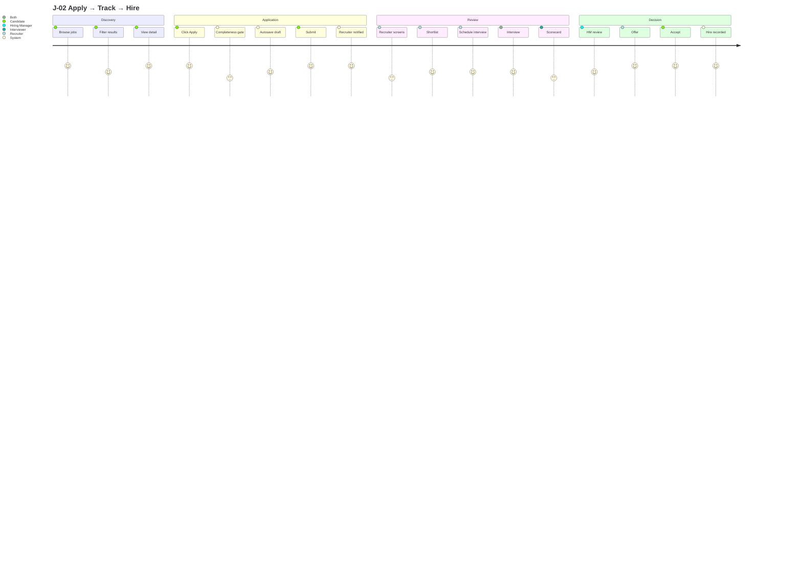
```mermaid
journey
    title J-02 Apply → Track → Hire
    section Discovery
      Browse jobs: 5: Candidate
      Filter results: 4: Candidate
      View detail: 5: Candidate
    section Application
      Click Apply: 5: Candidate
      Completeness gate: 3: System
      Autosave draft: 4: System
      Submit: 5: Candidate
      Recruiter notified: 5: System
    section Review
      Recruiter screens: 3: Recruiter
      Shortlist: 4: Recruiter
      Schedule interview: 4: Recruiter
      Interview: 4: Both
      Scorecard: 3: Interviewer
    section Decision
      HM review: 4: Hiring Manager
      Offer: 5: Recruiter
      Accept: 5: Candidate
      Hire recorded: 5: System
```

### 16.3 J-26 Career Switcher (Detailed)


```mermaid
flowchart LR
    A[Target role identified] --> B[F-91 Career Readiness]
    B --> C{Skills gap?}
    C -->|Yes| D[F-95 Career Transition Plan]
    D --> E[F-84 suggests learning]
    E --> F[F-07 enroll courses]
    F --> G[F-08 challenges + F-69 assignments]
    G --> H[F-96 Skill Evidence]
    H --> I[F-85 Career Graph comparison]
    I --> J{Ready?}
    J -->|Yes| K[Apply via F-04]
    J -->|No| D
    K --> L[F-88 Interview Platform]
    L --> M[Hired + outcome tracked]
```

---

### Workflows & Integrity Traces

### 17.1 Complete Workflow Register (WF-01..WF-66)

| ID | Workflow | Terminal |
|---|---|---|
| WF-01 | Candidate Discovery → Application | Application submitted |
| WF-02 | Recruiter Sourcing Pipeline | Shortlist confirmed |
| WF-03 | Course Enrollment & Completion | Certificate + XP |
| WF-04 | Challenge Participation & Scoring | Score recorded |
| WF-05 | Application Review & Decision | Hired / rejected |
| WF-06 | Offer Management & Negotiation | Offer accepted / expired |
| WF-07 | AI Career Assistant Conversation | User-accepted action |
| WF-08 | Content Moderation & Enforcement | Resolution logged |
| WF-09 | Subscription Purchase & Upgrade | Active entitlement |
| WF-10 | Messaging Thread & Response | Message persisted + ack |
| WF-11 | XP Earning & Level Progression | Ledger row + level |
| WF-12 | Onboarding & First-Experience | First meaningful action |
| WF-13 | Reported Content Review | Action logged + appeal window |
| WF-14 | Invitation & Team Growth | Membership active |
| WF-15 | Employer Brand Profile Setup | Profile published + verified |
| WF-16 | Institutional License Purchase | Pool active + invoice reconciled |
| WF-17 | Bulk Student Import | Students provisioned + report |
| WF-18 | Batch Course Assignment | Batch enrolled + seats exact |
| WF-19 | Media Ingestion & Validation | Media validated + ready |
| WF-20 | License Revocation & Seat Reassignment | Seat returned + reassigned |
| WF-21 | Graduation Transition (B2B2C) | Independent profile active |
| WF-22 | Institutional Renewal | Renewal confirmed |
| WF-23 | Purchase Approval | Purchase approved + PO issued |
| WF-24 | Course Publish Review | Approved / rejected with feedback |
| WF-25 | Course Purchase & Enrolment | Enrolled |
| WF-26 | Coupon Redemption | Discount applied |
| WF-27 | Refund Request → Review → Refund/Deny | Refunded / denied |
| WF-28 | Instructor Payout Settlement | Payout paid |
| WF-29 | Quiz Attempt & Grading | Grade recorded |
| WF-30 | Assignment Submit → Grade / Peer Review | Grade finalized |
| WF-31 | Path Enrolment & Progression | Path completed |
| WF-32 | Contest Lifecycle | Results published |
| WF-33 | Certification Exam Attempt | Pass / fail / expired |
| WF-34 | Post Publish → Feed Distribution | Post visible in feed |
| WF-35 | Newsletter Issue Send | Sent / paused |
| WF-36 | Company Review Moderation | Published / removed |
| WF-37 | Salary Report Aggregation | Aggregated |
| WF-38 | Recommendation Request → Give → Accept → Display | Displayed / declined |
| WF-39 | Outreach Credit Send → Reply → Refund | Replied / expired |
| WF-40 | Profile View Logging | Logged per privacy mode |
| WF-41 | LinkedIn Migration Import | Native account complete |
| WF-42 | Skill Gap Assessment → Learning Plan | Learning plan activated |
| WF-43 | Career Readiness Evaluation | Readiness score computed |
| WF-44 | Salary Data Submission → Aggregation | Aggregated |
| WF-45 | Technical Interview Assessment | Assessment completed |
| WF-46 | Interview Recording + AI Feedback | Feedback report generated |
| WF-47 | Skill Evidence Issuance | Credential verified |
| WF-48 | Contribution Verification | Commit impact verified |
| WF-49 | Peer Mentorship Match → Session | Session completed |
| WF-50 | Expert Network Call Request | Call concluded |
| WF-51 | Custom Assessment Creation → Deployment | Assessment live |
| WF-52 | Post-Hire Outcome Tracking | Outcome recorded |
| WF-53 | Certification Exam Attempt | Pass/fail/expired |
| WF-54 | Emerging Skill Detection → Publication | New skill added to taxonomy |
| WF-55 | Warm Introduction Request → Delivery | Intro delivered |
| WF-56 | Application Feedback → Learning Loop | Improvement action |
| WF-57 | Skill Freshness → Re-verification | Freshness restored |
| WF-58 | Referral Request → Hire | Referral outcome |
| WF-59 | Alumni Network Join → Connect | Alumni connection |
| WF-60 | Reputation Signal → Score Update | Score recomputed |
| WF-61 | Recommendation → Acceptance → Learning | Feedback loop |
| WF-62 | Activity Tracking → Discovery | Behavioral signal |
| WF-63 | Interview Prep → Session → Feedback | Prep completed |
| WF-64 | Adaptive Learning → Mastery | Skill mastered |
| WF-65 | PDP Goal → Milestone → Achievement | Goal achieved |
| WF-66 | Internal Mobility Match → Transition | Internal move |

### 17.2 Workflow Integrity Traces (WIT-001..WIT-025)

| WF | Name | Trace | Terminal Exit | Primary Guard |
|---|---|---|---|---|
| WF-01 | Candidate Discovery → Application | WIT-001 | Application submitted + confirmation | Idempotency-Key + draft restore |
| WF-02 | Recruiter Sourcing Pipeline | WIT-002 | Shortlist confirmed + invite sent | Tenant-scoped RLS + optimistic locking |
| WF-03 | Course Enrollment & Completion | WIT-003 | Enrollment completed + certificate + XP | Unique enrollment guard + idempotent XP |
| WF-04 | Challenge Participation & Scoring | WIT-004 | Scored (≥70%) + XP | Sandbox ≤30s + idempotent score |
| WF-05 | Application Review & Decision | WIT-005 | Terminal hired/rejected + event | Mandatory scorecard precondition |
| WF-06 | Offer Management & Negotiation | WIT-006 | Offer accepted or expired | Single active offer constraint |
| WF-07 | AI Career Assistant Conversation | WIT-007 | User-accepted action (or dismissal) | `<user_content>` sanitization + heuristic fallback |
| WF-08 | Content Moderation & Enforcement | WIT-008 | Resolution logged + notice sent | Append-only queue + two-human review on bans |
| WF-09 | Subscription Purchase & Upgrade | WIT-009 | Active entitlement reconciled with Stripe | Webhook signature + idempotent credit |
| WF-10 | Messaging Thread & Response | WIT-010 | Message persisted + delivery ack | clientMessageId dedupe + Realtime RLS |
| WF-11 | XP Earning & Level Progression | WIT-011 | XP ledger row + recomputed level | UNIQUE(user_id, reference_type, reference_id) |
| WF-12 | Onboarding & First-Experience | WIT-012 | First meaningful action complete | Resumable onboarding + email verify retry |
| WF-13 | Reported Content Review | WIT-013 | Admin action logged + appeal window open | Severity SLA escalation + immutable audit |
| WF-14 | Invitation & Team Growth | WIT-014 | Membership active with mapped role | Unique crypto token + 7-day TTL |
| WF-15 | Employer Brand Profile Setup | WIT-015 | Profile published & verified | Domain verification gate |
| WF-16 | Institutional License Purchase | WIT-016 | Pool active + invoice reconciled | Idempotency (PO number + Stripe event.id) |
| WF-17 | Bulk Student Import | WIT-017 | Students provisioned + error report | Validate-then-commit |
| WF-18 | Batch Course Assignment | WIT-018 | Batch enrolled + seats consumed exactly N | Row lock + CHECK used≤total |
| WF-19 | Media Ingestion & Validation | WIT-019 | Media validated + asset ready | Validation states + SSRF allow-list |
| WF-20 | License Revocation & Seat Reassignment | WIT-020 | Seat returned + reassigned exactly once | Row lock + progress retained |
| WF-21 | Graduation Transition (B2B2C) | WIT-021 | Independent profile active | Never auto-convert + transactional |
| WF-22 | Institutional Renewal | WIT-022 | Renewal confirmed or graceful expiry path | Expiry scan job + grace period |
| WF-23 | Purchase Approval | WIT-023 | Purchase approved + PO issued | Configurable chain + RBAC per level |
| WF-24 | Course Publish Review | WIT-024 | Approved / rejected with feedback | Admin review SLA ≤72h + max 3 rejections |
| WF-25 | Course Purchase & Enrolment | WIT-025 | Enrolled | Webhook-owned fulfillment |

---

### State Machines

### 18.1 Complete State Machine Index

| Entity | Terminal States |
|---|---|
| Application | hired, rejected, withdrawn, stale_withdrawn, candidate_unresponsive |
| Job | closed, archived |
| Offer | hired, closed |
| Enrollment | completed, dropped, expired |
| Organization | active, archived |
| Interview | completed, cancelled |
| Mentor Relationship | completed, cancelled |
| Certificate | verified, revoked, expired |
| Moderation | approved, rejected |
| Challenge Submission | passed, failed, error |
| Background Job | succeeded, dead |
| License/Seat | expired, revoked, returned |
| Managed Learner | independent, archived |
| Media Asset | ready, failed, archived |
| Purchase Request | purchased, cancelled |
| Course (authoring) | published, archived, unpublished |
| Course Version | current, superseded |
| Quiz Attempt | graded |
| Assignment | graded, returned |
| Peer Review | completed |
| Learning Path Enrollment | completed, dropped |
| Course Order | enrolled, cancelled, refunded |
| Coupon | exhausted, expired, revoked |
| Payout | paid, failed |
| Company Review | published, removed |
| Salary Report | aggregated |
| Interview Question | published, rejected |
| Contest | results_published, archived |
| Certification Attempt | passed, failed, expired |
| Post | deleted, hidden_by_moderation |
| Comment | deleted, removed_by_moderation |
| Newsletter Issue | sent, failed |
| Recommendation | displayed, declined, withdrawn |
| Outreach Message | replied, expired |
| Group Membership | left, removed |
| Event | completed, cancelled |
| Migration Job | completed, failed, cancelled |
| Instructor | active, retired |
| Skill (F-84) | Merged |
| Credential (F-96) | revoked, expired |
| Interview Assessment (F-88) | reviewed, cancelled, no_show |
| Career Readiness (F-91) | completed, abandoned |
| Mentorship Session (F-90) | rated, declined, cancelled |
| Certification Attempt (F-115) | certified |
| Skill Freshness (F-123) | demoted |

### 18.2 Canonical State Machines

#### Application

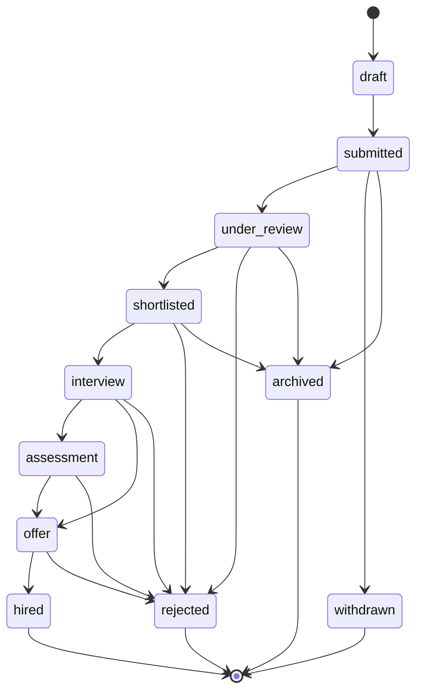
```mermaid
stateDiagram-v2
    [*] --> draft
    draft --> submitted
    submitted --> under_review
    submitted --> withdrawn
    submitted --> archived
    under_review --> shortlisted
    under_review --> rejected
    under_review --> archived
    shortlisted --> interview
    shortlisted --> rejected
    shortlisted --> archived
    interview --> assessment
    interview --> offer
    interview --> rejected
    assessment --> offer
    assessment --> rejected
    offer --> hired
    offer --> rejected
    hired --> [*]
    rejected --> [*]
    withdrawn --> [*]
    archived --> [*]
```

#### Job

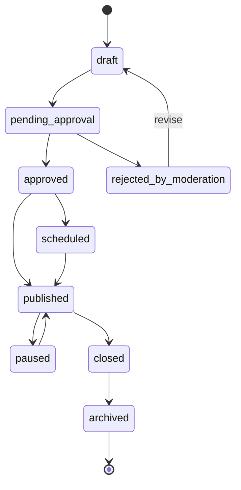
```mermaid
stateDiagram-v2
    [*] --> draft
    draft --> pending_approval
    pending_approval --> approved
    pending_approval --> rejected_by_moderation
    rejected_by_moderation --> draft: revise
    approved --> scheduled
    approved --> published
    scheduled --> published
    published --> paused
    paused --> published
    published --> closed
    closed --> archived
    archived --> [*]
```

#### Credential (F-96)

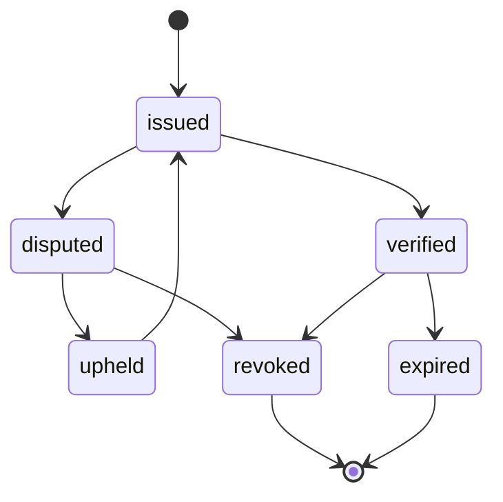
```mermaid
stateDiagram-v2
    [*] --> issued
    issued --> verified
    issued --> disputed
    disputed --> upheld
    disputed --> revoked
    verified --> expired
    verified --> revoked
    upheld --> issued
    revoked --> [*]
    expired --> [*]
```

#### Certification Attempt (F-115)

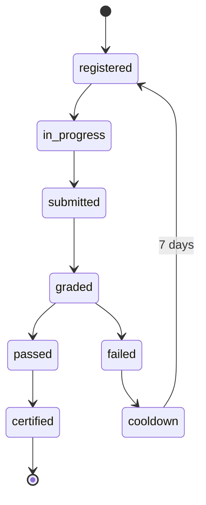
```mermaid
stateDiagram-v2
    [*] --> registered
    registered --> in_progress
    in_progress --> submitted
    submitted --> graded
    graded --> passed
    graded --> failed
    passed --> certified
    failed --> cooldown
    cooldown --> registered: 7 days
    certified --> [*]
```

#### Interview Assessment (F-88)

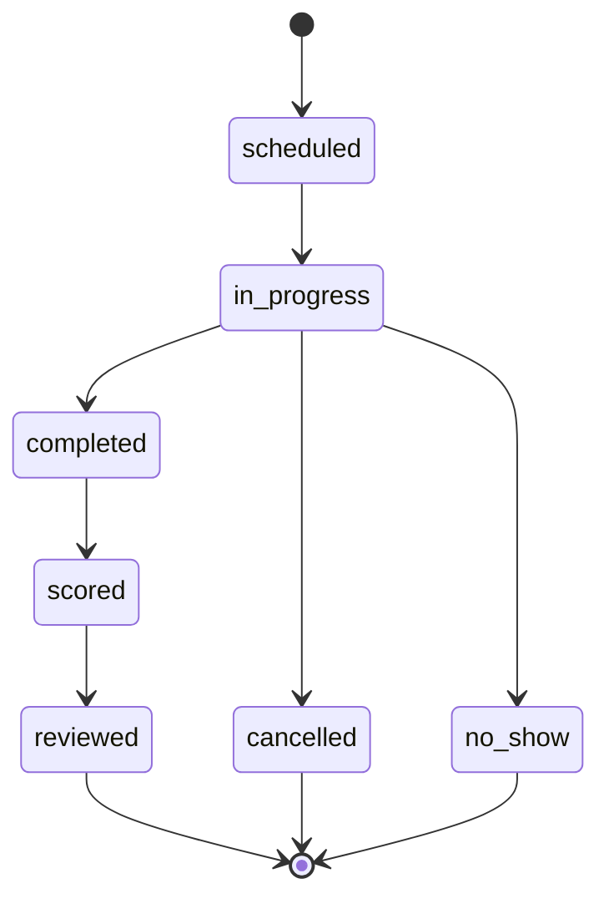
```mermaid
stateDiagram-v2
    [*] --> scheduled
    scheduled --> in_progress
    in_progress --> completed
    in_progress --> cancelled
    in_progress --> no_show
    completed --> scored
    scored --> reviewed
    reviewed --> [*]
    cancelled --> [*]
    no_show --> [*]
```

#### Course Order

```mermaid
stateDiagram-v2
    [*] --> pending
    pending --> paid
    pending --> cancelled
    paid --> enrolled
    enrolled --> completed
    enrolled --> refund_requested
    refund_requested --> refund_approved
    refund_requested --> refund_denied
    refund_approved --> refunded
    refund_denied --> enrolled
    refunded --> [*]
    cancelled --> [*]
    completed --> [*]
```

#### Contest

```mermaid
stateDiagram-v2
    [*] --> draft
    draft --> scheduled
    scheduled --> registration_open
    registration_open --> active
    active --> ended
    ended --> results_published
    results_published --> archived
    archived --> [*]
```

### 18.3 Invariants Across All State Machines

> [!IMPORTANT]
> - No state may be skipped
> - Every transition writes an audit record
> - Terminal states are irreversible without a new entity
> - Server is authoritative (client optimism is UI-only)
> - **INV-TERMINAL:** Every state machine has an acyclic path to an explicit terminal state

---

### Canonical Business Rules (BR-01..BR-248 consolidated)

### Canonical Business Rule Identity

The canonical behavioral registry contains **BR-001 through BR-248** with no gaps in the numbered rule set. Any `BR-*` references outside that range in historical feature prose are treated as stale prose references and do not create new canonical rules.

### 19.1 Access Control Rules (BR-01..BR-09)

| ID | Rule |
|---|---|
| BR-01 | Only `ROLE_RECRUITER`/`ROLE_ADMIN` may create/edit job postings |
| BR-02 | Only `ROLE_USER` may submit applications; recruiters may not apply |
| BR-03 | Candidates review own applications only; recruiters all for their companies |
| BR-04 | Only recruiters/admins create scorecards and notes |
| BR-05 | User edits own profile only; admin any |
| BR-06 | Flags, audit, settings, user mgmt, moderation are admin-only |
| BR-07 | Billing actions available to recruiters, not users/admins |
| BR-08 | Route-level RBAC matches shared route registry |
| BR-09 | Domain-level authorization backs state-changing commands |

### 19.2 Job Rules (BR-10..BR-14)

| ID | Rule |
|---|---|
| BR-10 | Job publish-readiness rule server-validated |
| BR-11 | Job lifecycle: draft→pending_approval→approved→scheduled→published→paused→closed→archived |
| BR-12 | Recruiters update/publish/archive only own-company jobs |
| BR-13 | Hidden jobs are client-preference; reversible |
| BR-14 | Saved-search digest runs as service-owned/audited scheduler |

### 19.3 Application Rules (BR-15..BR-20)

| ID | Rule |
|---|---|
| BR-15 | No duplicate ACTIVE application per user per job (partial UNIQUE + 90-day cooldown post-terminal) |
| BR-16 | No applications to closed/unavailable jobs |
| BR-17 | Application lifecycle server-owned append-only |
| BR-18 | Application drafts autosave 30s; recoverable; versions retained |
| BR-19 | Candidate notes/scorecards recruiter-scoped; never candidate-visible |
| BR-20 | Status-event history append-only |

### 19.4 Learning & Challenge Rules (BR-21..BR-25)

| ID | Rule |
|---|---|
| BR-21 | Lesson completion idempotent |
| BR-22 | Lesson prerequisites gate progression |
| BR-23 | Course completion → certificate + XP bonus |
| BR-24 | Challenge language allowlist; execution limits per TD-05 |
| BR-25 | XP idempotent UNIQUE(user_id, reference_type, reference_id); daily cap **200 XP/day** |

### 19.5 Data Governance Rules (BR-26..BR-35)

| ID | Rule |
|---|---|
| BR-26 | Resume exports append-only; artifact soft-delete |
| BR-27 | Analytics metadata whitelist-only; no raw text/tokens/secrets |
| BR-28 | Admin status distinguishes live/inferred/degraded/not-configured |
| BR-29 | Admin actions: confirmation + audit + rollback |
| BR-30 | Extension data stays in chrome.storage.local; no sync/fetch/network |
| BR-31 | Schedulers dry-run default; idempotent delivery keys |
| BR-32 | Subscription state webhook-owned |
| BR-33 | AI drafts never auto-commit to records |
| BR-34 | T&S report lifecycle pending→under_review→resolved/dismissed |
| BR-35 | SUPERSEDED — closures cited in §19.6 |

### 19.6 Expanded Rules (BR-036..BR-071)

| ID | Rule |
|---|---|
| BR-036 | Jobs require approved org + verified owner |
| BR-037 | Applications require ≥70% profile |
| BR-038 | Candidates may apply only to open jobs |
| BR-039 | Duplicate applications prevented (DB + app) |
| BR-040 | Recruiters access only their org's applications |
| BR-041 | Strict application state machine |
| BR-042 | Offers require completed HM-scoped scorecard review |
| BR-043 | Resumes are scanned for viruses before text extraction |
| BR-044 | Extracted resume text encrypted at rest |
| BR-045 | Rejection emails sent with configurable delay (default 24h) |
| BR-046 | Course enrollments unique per (user, course) for active status |
| BR-047 | Module progress strictly sequential |
| BR-048 | Course completion requires passing final assessment (≥70%) |
| BR-049 | Challenge submissions run in isolated sandbox |
| BR-050 | Sandbox execution has hard resource limits (30s CPU, 512MB RAM, 1GB disk) |
| BR-051 | Challenge test cases split: public + hidden |
| BR-052 | Plagiarism detection runs asynchronously |
| BR-053 | Badges minted only upon verified milestone completion |
| BR-054 | Referral rewards pay out after referred candidate's first verified hire |
| BR-055 | Subscription changes apply at period boundary (or prorated) |
| BR-056 | Entitlements derive from active subscription only |
| BR-057 | Jobs auto-close after expiry (configurable, default 60 days) |
| BR-058 | Applications auto-archive after 90 days in submitted |
| BR-059 | Moderation flags expire after 7 days if not actioned |
| BR-060 | XP transactions unique per (user, reference_type, reference_id) |
| BR-061 | Profile completeness ≥70% gate for job applications |
| BR-062 | Verified organizations receive accelerated job approval |
| BR-063 | Candidates may request data export; delivered within 30 days |
| BR-064 | Recruiters see verified signals on candidate profiles |
| BR-065 | AI output presentation follows capability-specific evaluation and uncertainty policy; no universal confidence threshold is assumed |
| BR-066 | AI outputs that fail the capability-specific quality/evaluation gate are suppressed or routed to human/non-AI fallback |
| BR-067 | All admin actions are audit-logged |
| BR-068 | Account termination requires Platform Admin dual approval |
| BR-069 | Interviewer inactivity auto-escalation: 7 business days → HM escalation; 14 days → auto-transition stale_withdrawn |
| BR-070 | Candidate non-response auto-release: 5 business days → reminders; 8 days → candidate_unresponsive |
| BR-071 | Abandoned requisition protection: >21 calendar days → review; 30 days → auto-pause + billing credit |

### 19.7 Institutional Rules (BR-072..BR-082)

| ID | Rule |
|---|---|
| BR-072 | Managed learners access course only while org holds unexpired assigned seat |
| BR-073 | Seat revocation triggers 7-day grace; in-progress assessments never interrupted |
| BR-074 | Seat consumption atomic; last-seat concurrency never oversells |
| BR-075 | Revoked seat returns to pool; learner progress and certificates retained |
| BR-076 | Graduation transition retains all verified signals and severs FERPA-restricted records |
| BR-077 | Bulk imports require dry-run validation preview; no silent partial imports |
| BR-078 | Faculty/Proctor hold no org-level billing, licensing, or user-management privileges |
| BR-079 | Employer-facing student showcases require recorded, revocable consent |
| BR-080 | Every org-owned record scoped by `organization_id`; cross-tenant reads prohibited |
| BR-081 | Institutional pricing tiers configurable per course/package; never hard-coded |
| BR-082 | Course-access authorization server-side: org + learner + license + enrollment + validity |

### 19.8 Media Rules (BR-083..BR-090)

| ID | Rule |
|---|---|
| BR-083 | External media validated before publication; invalid/private/embed-blocked rejected |
| BR-084 | Provider embedding restrictions never bypassed; protected content never downloaded |
| BR-085 | Provider capabilities determine available playback/completion settings |
| BR-086 | Broken external provider isolated to affected content item; course remains functional |
| BR-087 | Platform stores learner progress even for externally hosted playback where trackable |
| BR-088 | Unsupported providers produce explicit errors, never silent broken embeds |
| BR-089 | Authors attest right to use external content before publication |
| BR-090 | Org provider allowlists enforced server-side |

### 19.9 Learning Marketplace Rules (BR-091..BR-115)

| ID | Rule |
|---|---|
| BR-091 | Course submission requires ≥5 lessons and ≥30 min total content |
| BR-092 | Course requires ≥1 video or text lesson (no quiz-only courses) |
| BR-093 | Structural edits to a published course require a new version |
| BR-094 | Free-preview lessons ≤20% of course content |
| BR-095 | Rating requires ≥20% course progress and verified enrolment |
| BR-096 | Category assignment required before submission |
| BR-097 | Instructor must have an approved profile before publishing |
| BR-098 | Course image ≥750×422, ≤4MB |
| BR-099 | Coupon cannot reduce price below platform minimum |
| BR-100 | Refund window 30 days from purchase (configurable), pro-rated after |
| BR-101 | Instructor earnings = 70% of net revenue after platform commission (configurable) |
| BR-102 | Course announcements limited to 1/day/course |
| BR-103 | Peer review requires ≥2 completed reviews per submission |
| BR-104 | Instructor cannot review or rate own course |
| BR-105 | Course version preserves existing student progress |
| BR-106 | Learning-path courses complete in declared order when sequenced |
| BR-107 | Quiz attempts bounded by configured max; practice quizzes unlimited |
| BR-108 | Graded quiz contributes to course grade; passing score configurable |
| BR-109 | Final exam cumulative; required for course completion when configured |
| BR-110 | Program certificate issued only when all required path courses complete |
| BR-111 | Assignment late submission flagged, graded per instructor policy |
| BR-112 | Auto-grading for code assignments reuses the challenge sandbox |
| BR-113 | Question-bank reuse preserves per-attempt snapshots (no retroactive edits) |
| BR-114 | Course archive/unpublish preserves enrolled-student access per policy |
| BR-115 | All course purchases are idempotent and webhook-owned |

### 19.10 Social/Content Rules (BR-116..BR-128)

| ID | Rule |
|---|---|
| BR-116 | One reaction per user per target; changeable, never additive |
| BR-117 | One repost per user per post |
| BR-118 | Post edits retain an "edited" marker and version history |
| BR-119 | Comment authors and post authors may moderate; authors may disable comments |
| BR-120 | Mentions notify only if the recipient allows mentions |
| BR-121 | Follows unique; blocked/muted targets cannot be followed |
| BR-122 | Post visibility enforced server-side (public/connections/org/private) |
| BR-123 | Newsletter subscriptions opt-in only; one-click unsubscribe (RFC 8058) |
| BR-124 | Feed must always offer a chronological view; ranking factors disclosed on demand |
| BR-125 | UGC passes pre-publish abuse scan; post rate limits per actor |
| BR-126 | Sponsored content labelled as sponsored; never undisclosed in organic ranking |
| BR-127 | Mute hides content without unfollowing and without notifying the muted party |
| BR-128 | Minors (16+) get private-by-default profiles and restricted outreach |

### 19.11 Outreach, Recommendations, Privacy (BR-129..BR-134)

| ID | Rule |
|---|---|
| BR-129 | Outreach credit consumed on send to a non-connection; refunded on reply within 7 days |
| BR-130 | Outreach weekly caps: 20 (Pro), 50 (Team), custom (Enterprise) |
| BR-131 | Endorsements require an existing connection |
| BR-132 | Written recommendations display only after recipient acceptance |
| BR-133 | Profile-view logging honours the viewer's privacy mode |
| BR-134 | Identity-verification badges only via approved partners; failure never blocks core use |

### 19.12 Employer Insights Rules (BR-135..BR-138)

| ID | Rule |
|---|---|
| BR-135 | Salary aggregates displayed only with ≥5 reports for a role/location cell |
| BR-136 | Anonymous reviews hide identity from employer and public, never from Platform Admin/legal |
| BR-137 | Company responses are appended, never edit the original review |
| BR-138 | Interview questions require moderation before public display |

### 19.13 Contests/Certification & Migration Rules (BR-139..BR-140 + MIG-01..08)

| ID | Rule |
|---|---|
| BR-139 | Contest submissions locked at server-authoritative end time; clock skew never extends |
| BR-140 | Certification exam pass requires the configured score in a single attempt (retake policy configurable) |
| MIG-01 | Imported data becomes project-owned; user may edit/delete/replace/export |
| MIG-02 | Migration is one-way and user-initiated; no continuous sync by default |
| MIG-03 | Migration never auto-publishes; imported posts land as drafts |
| MIG-04 | Imported skills are self-reported until natively verified |
| MIG-05 | Connection graphs are never imported; hashed-email mutual-consent discovery only, hashes TTL-bound |
| MIG-06 | Provider tokens server-side, short-lived, revocable; disconnect purges tokens + raw archive |
| MIG-07 | External provider IDs are never primary keys, auth claims, URLs, or analytics keys |
| MIG-08 | Every provider surface is feature-flagged and removable without core schema change |

### 19.14 Skills Graph Rules (BR-141..BR-148)

| ID | Rule |
|---|---|
| BR-141 | Skills taxonomy curated by Platform Admin; no user can create canonical skills |
| BR-142 | Skill relationships are directional: `prerequisite_of`, `subskill_of`, `supersedes` |
| BR-143 | Correlations (`correlates_with`) are bidirectional and computed statistically |
| BR-144 | Every course, challenge, job, and candidate skill tag MUST reference a canonical skill |
| BR-145 | Skill market signals update daily from aggregated data |
| BR-146 | Skill graph traversal depth bounded (max 5 hops) |
| BR-147 | Skill relationships must be acyclic for `prerequisite_of` (validated at write time) |
| BR-148 | Emerging skills require minimum 5 independent signals before taxonomy promotion |

### 19.15 Verification Rules (BR-149..BR-156)

| ID | Rule |
|---|---|
| BR-149 | Credentials are append-only; revocation creates a new record with `revoked_at` |
| BR-150 | Every credential has a public verification URL (no PII exposed) |
| BR-151 | Credential evidence links are immutable once issued |
| BR-152 | Endorsement weights derive from endorser's verified reputation + relationship proximity |
| BR-153 | Anonymous endorsements are not permitted (P-01) |
| BR-154 | Appeal path exists for disputed credentials; SLA ≤7 days |
| BR-155 | Privacy-preserving proofs allow skill verification without revealing full profile |
| BR-156 | Credential issue requires underlying achievement verified by platform activity |

### 19.16 Career Graph Rules (BR-157..BR-163)

| ID | Rule |
|---|---|
| BR-157 | Career outcome tracking requires explicit user opt-in |
| BR-158 | Sensitive aggregate career analytics require policy-defined minimum cohort; k≥10 default for public/sensitive cells |
| BR-159 | Individual career transitions visible only to the user |
| BR-160 | Progression benchmarks by role require ≥20 data points to publish |
| BR-161 | Salary progression tracked separately from base salary |
| BR-162 | Career graph updates do not retroactively alter historical benchmarks |
| BR-163 | Career path recommendations must disclose data sources and confidence intervals |

### 19.17 Reputation Rules (BR-164..BR-168)

| ID | Rule |
|---|---|
| BR-164 | Reputation score is derived, never manually set |
| BR-165 | Reputation is skill-specific |
| BR-166 | Time-decay: signals older than 24 months count less |
| BR-167 | Reputation is private by default; recruiter visibility requires candidate consent or active application |
| BR-168 | Reputation signals are auditable |

### 19.18 Interview Platform Rules (BR-169..BR-176)

| ID | Rule |
|---|---|
| BR-169 | Interview recording requires dual consent |
| BR-170 | Recordings encrypted at rest; retention ≤90 days unless extended |
| BR-171 | AI feedback is advisory; never a hiring decision input without human review |
| BR-172 | AI analysis excludes protected attributes |
| BR-173 | Interview questions are company-scoped; not visible to candidates before assessment |
| BR-174 | Assessment scores are append-only; changes are compensating entries |
| BR-175 | Live coding environment reuses the challenge sandbox |
| BR-176 | Comparison across candidates uses structured rubrics, never free-form scores |

### 19.19 Salary Intelligence Rules (BR-177..BR-183)

| ID | Rule |
|---|---|
| BR-177 | Salary reports require verification: self-reported (0.5) or verified via employment (1.0) |
| BR-178 | Aggregated salary data requires policy-defined minimum cohort; k≥10 default for public/sensitive cells |
| BR-179 | Salary data displayed in minor units + ISO-4217 currency |
| BR-180 | Company-specific salary data shown only if company has ≥3 reports OR opted in |
| BR-181 | Users may withdraw their salary submission at any time |
| BR-182 | Salary intelligence updates quarterly; historical data versioned |
| BR-183 | Equity data (F-98) separately aggregated from salary |

### 19.20 Recommendation Rules (BR-184..BR-188)

| ID | Rule |
|---|---|
| BR-184 | Recommendation factors must be disclosed ("why am I seeing this?") |
| BR-185 | Recommendations never use protected attributes |
| BR-186 | Users can dismiss recommendations; dismissals train the model |
| BR-187 | Recommendations may not include promoted content without explicit "sponsored" label |
| BR-188 | Recommendation engine must be replaceable without breaking downstream features |

### 19.21 Learning Impact Rules (BR-189..BR-193)

| ID | Rule |
|---|---|
| BR-189 | Course outcome correlation requires ≥30 enrolled learners with measurable outcomes |
| BR-190 | Individual learner outcomes are never exposed without consent |
| BR-191 | Course quality scores derived from outcomes visible to instructors, not publicly ranked |
| BR-192 | Learning impact analytics do not create incentives to lower standards |
| BR-193 | Correlation is not causation — all outcome claims labelled as correlational |

### 19.22 Feature-Specific Rules (BR-194..BR-208)

| ID | Rule |
|---|---|
| BR-194 | Peer mentorship sessions have a 30-day inactivity auto-close |
| BR-195 | Expert network calls may be paid; platform takes a transparent fee |
| BR-196 | Industry hubs must have ≥3 active contributors to display |
| BR-197 | Resume parsing never auto-applies changes without user review |
| BR-198 | Custom assessments must be approved by Platform Admin before deployment |
| BR-199 | Candidate comparison requires verified profiles only |
| BR-200 | DE&I analytics use aggregated data only; individual demographic data never stored |
| BR-201 | Post-hire analytics require employer consent and are aggregate-only |
| BR-202 | Badge marketplace prohibits paid badges; all badges earned |
| BR-203 | Mobile-first application must maintain feature parity with desktop |
| BR-204 | Accessibility is a release gate; WCAG 2.2 AA mandatory |
| BR-205 | API access requires enterprise tier; rate-limited per CON-006 |
| BR-206 | Emerging skills require platform-wide adoption before taxonomy promotion |
| BR-207 | Job market analytics require k ≥10 data points per geographic cell |
| BR-208 | All new AI-powered features inherit AI safety rules §32 |

### 19.23 Warm Introduction Rules (BR-209..BR-216)

| ID | Rule |
|---|---|
| BR-209 | Introducer consent required for each introduction |
| BR-210 | Max path depth = 4 |
| BR-211 | Max 10 intro requests/week/user |
| BR-212 | Introducer can opt out of intro services |
| BR-213 | Target can block all intro requests |
| BR-214 | Introduction messages separate from cold outreach |
| BR-215 | Paths visible only to requester |
| BR-216 | No path suggestion for blocked users |

### 19.24 Application Feedback Rules (BR-217..BR-224)

| ID | Rule |
|---|---|
| BR-217 | Minimum reason category required on rejection |
| BR-218 | Feedback delivered within 7 days of decision |
| BR-219 | Feedback visible only to candidate |
| BR-220 | Aggregate insights use k ≥10 |
| BR-221 | AI drafts require human review before sending |
| BR-222 | Candidate can request feedback if not provided (30-day window) |
| BR-223 | Negative feedback must include actionable element |
| BR-224 | Feedback templates org-configurable |

### 19.25 Skill Decay Rules (BR-225..BR-232)

| ID | Rule |
|---|---|
| BR-225 | Freshness score computed nightly, immutable per day |
| BR-226 | Decay curves per skill category, admin-configurable |
| BR-227 | Freshness <20 demotes to self-reported |
| BR-228 | Re-verification restores freshness to 100 |
| BR-229 | Self-attestation counts 0.5× |
| BR-230 | Freshness visible to candidate always; recruiter-visible only with consent |
| BR-231 | Market drift alerts opt-in |
| BR-232 | Freshness stored historically (time-series) |

### 19.26 Referral Rules (BR-233..BR-240)

| ID | Rule |
|---|---|
| BR-233 | Max 3 referral requests per 30 days per candidate |
| BR-234 | Referrer consent required per request |
| BR-235 | Referral tag visible to recruiter (priority signal) |
| BR-236 | Referral rewards follow org policy; XP default |
| BR-237 | System verifies referrer's employment |
| BR-238 | No referral request from blocked user |
| BR-239 | Referrer max 20 referrals/quarter |
| BR-240 | Referral attribution tracked 12 months |

### 19.27 Alumni Rules (BR-241..BR-248)

| ID | Rule |
|---|---|
| BR-241 | Affiliation verified (email domain or institutional seat) |
| BR-242 | Alumni discovery respects privacy settings |
| BR-243 | Alumni group default-join, opt-out allowed |
| BR-244 | Alumni job postings must be from verified alumni |
| BR-245 | Alumni mentorship opt-in |
| BR-246 | No cross-institution data leakage |
| BR-247 | Graduated students retain alumni status |
| BR-248 | Alumni networks public or private (institution choice) |

---

# PART VI — TECHNICAL ARCHITECTURE

---

## 11. UX/UI, Design System & Micro-Interaction Architecture

### 11.1 UX principles

- Mobile-first, PWA-native composition; do not merely shrink a desktop UI.
- Progressive disclosure and consistent interaction patterns.
- Honest loading, guided empty states, actionable errors, and recoverable workflows.
- Trust through transparency: expose why something happened and what the user can do next.
- Keyboard-first support and accessible touch targets.
- Dark mode is first-class.
- Motion communicates state and respects `prefers-reduced-motion`.

### 11.2 Canonical UI states

```text
IDLE · HOVER · FOCUS · PRESSED · LOADING · SUCCESS · ERROR · EMPTY · DISABLED · VALIDATION · PARTIAL · OFFLINE · SYNCING · PERMISSION_DENIED · RESTRICTED
```

Domain lifecycle states include pending, processing, verified, rejected, expired, revoked, disputed, archived, and deleted/anonymized.

### 11.3 Interaction contract

```text
USER ACTION → SYSTEM STATE CHANGE → IMMEDIATE FEEDBACK → RESULT → NEXT BEST ACTION
```

Important actions such as saving, uploading, evidence submission, assessment autosave/submission, AI streaming, applications, matching explanations, messaging, notifications, offline sync, destructive actions, and errors must specify feedback, reversibility, and recovery.

### 11.4 Design system

The Aura/TalentSphere design system is the sole source for color, spacing, typography, elevation, radius, motion, focus, validation, and component states. Avoid raw visual values in feature code. Components expose accessible semantics and predictable state machines.

### 11.5 Component behavior

Buttons, inputs, forms, cards, data tables, dialogs, drawers, tabs, search, filters, pagination, tooltips, toasts, uploaders, editors, timers, progress indicators, and media controls must have explicit state and accessibility behavior. Critical information cannot be conveyed by color or animation alone.

---

## 12. Canonical Application Architecture

### 12.1 Initial architecture

Use a **modular monolith** with explicit domain boundaries and extraction points. Avoid premature microservices, Kubernetes, service meshes, or large event platforms until measured requirements justify them.

### 12.2 Canonical stack

| Layer | Decision |
|---|---|
| Frontend | React + TypeScript + Vite PWA |
| Routing | React Router |
| Server state | TanStack Query |
| UI | Aura/TalentSphere design system |
| Backend | Node.js + Fastify + TypeScript modular monolith |
| Database | PostgreSQL via Supabase |
| Auth | Supabase Auth or replaceable equivalent |
| Storage | Supabase Storage initially |
| Short-lived serverless | Supabase Edge Functions for webhooks, small HTTP functions and bounded AI orchestration |
| Heavy async | Supabase Queues + dedicated workers |
| Search | PostgreSQL FTS/trigram initially |
| Realtime | Selective, never correctness-critical |
| Hosting | Managed infrastructure selected for cost/reliability/region |

### 12.3 Logical architecture

```text
PWA UI
→ Feature/Application Layer
→ Domain Modules
→ Policy / Authorization / Privacy / AI Governance
→ Repositories / Transactions
→ PostgreSQL / Storage / Queues / Events
→ External Providers / AI Adapters
```

### 12.4 Domain boundaries

Identity & Access; Profiles; Skills & Ontology; Evidence & Verification; Learning; Assessments; Credentials; Jobs & Opportunities; Applications & Hiring; Interviews; Matching; Recommendations; Networking; Messaging; Organizations; Institutions; Reputation; Notifications; Billing & Entitlements; Analytics; Moderation/Trust & Safety; AI; Integrations; Administration; Audit.

### 12.5 Data and change ownership

Each domain owns its invariants and application contracts. Cross-domain behavior uses explicit APIs/events rather than direct table coupling. Database constraints remain authoritative for data integrity.

### 20.1 System Context — Updated

```mermaid
flowchart TB
    subgraph Users
        C[Candidates]
        R[Recruiters]
        I[Institution Admins]
        F[Faculty]
        A[Admins]
    end
    
    subgraph Frontend
        WEB[React/Vite PWA]
        EXT[Chrome Extension]
        PWA[PWA]
    end
    
    subgraph Edge
        MW[HTTP/API Boundary]
        SA[HTTP application APIs]
        EH[Webhook / Small Functions]
    end
    
    subgraph Core
        DOM[Domain Modules]
        CW[Career Workspace]
        AI[AI Gateway / Orchestrator]
        Q[Queue]
    end
    
    subgraph Data
        AUTH[Supabase Auth]
        PG[(PostgreSQL)]
        RLS[RLS Policies]
        RT[Realtime]
        ST[Storage]
    end
    
    subgraph External
        STRIPE[Stripe]
        EMAIL[Resend]
        LLM[Gemini/Claude]
        MEDIA[Mux/CF Stream]
        LI[LinkedIn optional]
    end
    
    C & R & I & F & A --> WEB
    C --> EXT
    C --> PWA
    WEB --> MW
    EXT --> MW
    MW --> SA
    MW --> EH
    SA --> DOM
    DOM --> OSL
    DOM --> AI
    DOM --> Q
    DOM --> PG
    PG --- RLS
    MW --> AUTH
    DOM --> RT
    DOM --> ST
    EH --> STRIPE
    EH --> EMAIL
    AI --> LLM
    Q --> MEDIA
    DOM -.-> LI
```

### 20.2 Logical Architecture

| Layer | Contents | Technology |
|---|---|---|
| Presentation | Web app, extension, PWA, admin | React + TypeScript + Vite PWA, React 18+, Tailwind, Radix |
| Application | HTTP application APIs, route handlers, use cases | TypeScript strict |
| Domain | Aggregates, entities, VOs, domain events, business rules | Pure TS |
| Infrastructure | Repositories, adapters, integrations | Supabase, Stripe, providers |
| Data | PostgreSQL with RLS, storage buckets, realtime channels | Supabase |
| External | AI providers, payment, media, email, IDV | Integration Layer |

### 20.3 Authentication Flow

```mermaid
sequenceDiagram
    participant U as User
    participant W as Web App
    participant S as Supabase Auth
    participant MW as Edge Middleware
    participant D as Database
    
    U->>W: Credentials / OAuth
    W->>S: Authenticate
    S-->>W: JWT + refresh token
    W->>MW: Request with JWT
    MW->>MW: Verify + normalize role claims
    MW->>D: Set local app.user_id
    D->>D: Apply RLS policies
    D-->>W: Authorized data
    W-->>U: Rendered page
```

### 20.4 AI Safety Flow

```mermaid
flowchart TD
    A[User Input] --> B[PII Detection]
    B --> C[Redaction]
    C --> D[Prompt Construction + canary + user_content fencing]
    D --> E[AI Provider]
    E --> F[Output Validation Zod]
    F --> G{Canary leaked?}
    G -->|Yes| H[Drop response + alert + flag account]
    G -->|No| I{Confidence}
    I --> J{Capability evaluation gate}
    J -->|Fail| K[Suppress / Fallback]
    J -->|Pass with limitations| L[Show with uncertainty]
    J -->|Pass with evidence| M[Show with supporting evidence]
    K --> M{Human review required?}
    L --> M
    M -->|Yes| N[Human Gate]
    M -->|No| O[User sees draft]
    N --> O
```

---

### 21.1 Bounded Contexts — Refined

The high-level contexts remain, but the previous oversized shared kernel is reduced. Domain modules own their invariants; the shared layer contains only genuine cross-cutting primitives.

| Context | Contents | Aggregates |
|---|---|---|
| `identity` | Auth, profiles, orgs, tenancy, managed learners, instructor approval | User, Profile, Organization, Membership |
| `marketplace` | Jobs, requisitions, applications, offers, interviews, employer insights | Job, Application, Offer, CompanyReview |
| `learning` | Courses, lessons/content items, media, enrolments, progress, quizzes, assignments, paths, certificates, XP/gamification, contests, certifications | Course, Enrolment, Assessment, XPLedger, Contest |
| `community` | Connections, follows, posts/articles/newsletters, comments/reactions/reposts, groups, events, messaging, notifications | Thread, Post, Community |
| `billing` | Subscriptions, entitlements, course commerce, coupons, orders, refunds, licence pools, procurement, payouts | Subscription, Order, LicencePool, Payout |
| `governance` | Admin, moderation, trust, audit, flags, verification | Report, ModerationAction, FeatureFlag |
| `analytics` | Event tracking, KPIs, dashboards, experimentation | AnalyticsEvent, KPISnapshot |
| **Shared kernel** | Core domain primitives, event envelope, authorization primitives, provider adapter interfaces, common types, UI primitives, observability contracts | DomainEvent, ProviderAdapter |

### 21.2 Domain Boundary Rules

- Domain layer pure TS (ARCH-013)
- Application layer orchestrates; HTTP application APIs are thin adapters (ARCH-014)
- Infrastructure implements domain ports (ARCH-015)
- Cross-feature imports via `index.ts` barrels only (ARCH-016)
- Atomic promotion rule (ARCH-017)
- Cross-context via events or application-service interfaces (ARCH-018)
- Zero circular dependencies (ARCH-019)
- Routes are thin composition (ARCH-020)

### 21.3 Architecture decisions — Refined

| ID | Decision |
|---|---|
| ADR-001 | Supabase Auth is the initial identity/session authority behind an application-facing identity abstraction |
| ADR-002 | React/Vite PWA + Node.js/Fastify TypeScript modular monolith + PostgreSQL/Supabase + managed infrastructure |
| ADR-003 | Baseline relational tables + operational extensions, all protected by appropriate RLS/grants and tested deny-by-default boundaries |
| ADR-004 | Realtime is optional for live UX; database/application state remains authoritative |
| ADR-005 | Stripe webhook idempotency + demo stubs |
| ADR-006 | Chrome extension local-first |
| ADR-007 | Provider-agnostic media |
| ADR-008 | Institutional tenancy |
| ADR-009 | Durable queue + dedicated worker for heavy jobs; Edge Functions for short-lived integration/webhook work |
| ADR-010 | RLS policy template generator |
| ADR-011 | Media model is authority for lesson content |
| ADR-012 | DDD domain boundaries + feature-oriented frontend + reusable design-system primitives |
| ADR-013 | Cross-domain via events or application-service interfaces only |

---

### 22.1 Aura Design System

**Zero raw hex values.** Tokens exposed as CSS variables + TS constants from one generated source.

**Light theme:** `--aura-bg-base` #FFFFFF · `--aura-bg-raised` #F8FAFC · `--aura-bg-sunken` #F1F5F9 · `--aura-text-primary` #0F172A · `--aura-text-secondary` #475569 · `--aura-brand-600` #2563EB · `--aura-success-500` #16A34A · `--aura-warning-500` #F59E0B · `--aura-danger-500` #DC2626 · `--aura-border` #E2E8F0 · `--aura-border-focus` #2563EB.

**Dark theme:** `--aura-bg-base` #0F172A · `--aura-bg-raised` #1E293B · `--aura-bg-sunken` #334155 · `--aura-text-primary` #F8FAFC · `--aura-brand-600` #3B82F6 · `--aura-border` #334155.

**Spacing:** 4px base (0, 2, 4, 8, 12, 16, 24, 32, 48, 64, 96, 128, 192px).
**Radius:** 6/10/16/50%.
**Motion:** 120/200/320ms + reduced-motion.
**Typography:** xs..4xl ramp.
**Z-index:** dropdown 30, modal 40, toast 50, palette 60.

### 22.2 Atomic Design Mapping

| Level | Contents |
|---|---|
| **Atoms (14+)** | Button, Input, Badge, Icon, Avatar, Skeleton, Spinner, Text, Divider, SourceStatusBadge, Checkbox, Radio, Toggle, Tag |
| **Molecules (12+)** | SearchField, FormField, Pagination, Toast, Dropdown, Tabs, Modal, EmptyState, SelectField, FileInput, DateRangePicker, ConfirmationDialog |
| **Organisms (20+)** | DataTable, NavigationSidebar, TopBar, CommandPalette, NotificationBell, FileUploader, CourseCard, JobCard, ProfileCard, QuizPanel, MediaSourceForm, LicenseUtilizationChart, SixStateRenderer, UnifiedPlayer, ObjectPreviewCard, PostComposer, PostCard, CommentThread, ReviewSummary, CurriculumTree, LeaderboardTable |
| **Templates (8)** | DashboardLayout, AuthLayout, SettingsLayout, AdminLayout, InstitutionLayout, LearningLayout, CourseBuilderLayout, FeedLayout |
| **Pages** | Live inside features (`domains/<ctx>/features/<f>/pages/`) |

**Promotion rule:** Components used by only one feature stay in that feature; promotion to `shared/ui/` happens on second use, never preemptively.

### 22.3 Route Registry

**Core Routes:**

| Route | Access | Page |
|---|---|---|
| `/` | Public | Landing |
| `/login`, `/register` | Public | Auth |
| `/verify/:hash` | Public | Credential verification |
| `/dashboard` | Auth | Role-adaptive |
| `/profile`, `/profile/[userId]` | Auth (RLS) | Profile |
| `/jobs`, `/jobs/[jobId]` | Auth | Jobs |
| `/jobs/new` | Recruiter+ | Post job |
| `/applications`, `/applications/[applicationId]` | Auth (RLS) | Applications |
| `/courses`, `/courses/[id]`, `/courses/[id]/learn` | Auth | Courses |
| `/challenges`, `/challenges/[id]`, `/challenges/[id]/attempt` | Auth | Challenges |
| `/messages`, `/notifications`, `/leaderboard` | Auth | Communication |
| `/settings`, `/settings/billing` | Auth / Org Admin+ | Settings |
| `/admin/*` | Platform Admin | Admin |

**Career Intelligence Routes:** `/career/readiness`, `/career/transition`, `/career/benchmarks`, `/salaries`, `/salaries/[role]`, `/companies/[slug]/salaries`

**Verification Routes:** `/verify/:hash`, `/credentials`, `/credentials/export`

**Interview Routes:** `/interviews/[id]`, `/interviews/[id]/results`, `/assessments/[id]`

**Recruiter Routes:** `/recruiter/search`, `/recruiter/pools`, `/recruiter/analytics`, `/hm/dashboard`

**Learning Routes:** `/paths`, `/paths/[id]`, `/teach/*`, `/cart`, `/checkout`, `/orders`

**Social Routes:** `/feed`, `/posts/[id]`, `/articles/[id]`, `/communities`, `/events`

**Institutional Routes:** `/institution/*` (13 paths)

**Admin Extension Routes:** `/admin/courses`, `/admin/instructors`, `/admin/reviews`, `/admin/orders`, `/admin/revenue`, `/admin/certificates`, `/admin/contests`

**OS Routes (Tier-gated):** `/workspace`, `/command`, `/automations`, `/agents`

**Intro/Referral Routes:** `/intro/request`, `/intro/inbox`, `/referrals`, `/referrals/request`

### 22.4 Repository Layout

```
src/
├── app/                      # React/Vite router: thin shell only
│   ├── (auth)/ (platform)/ api/v1/ api/health/
├── domains/
│   ├── identity/ marketplace/ learning/ community/ billing/ governance/ analytics/
│   │   ├── domain/{entities,value-objects,aggregates,events,rules,repositories}
│   │   ├── application/{use-cases,services}
│   │   ├── infrastructure/{repositories,adapters}
│   │   └── features/<feature>/{index.ts,pages,components,hooks,services,api,models,validators,tests}
├── shared/
│   ├── platform/{events,object-model,graph,automation,agents,healing,liquidity,data-quality,health}
│   ├── infrastructure/{supabase,media,integrations/{linkedin,stripe,resend,oauth,hris},ai,jobs,heavy-jobs,email}
│   ├── ui/{tokens,atoms,molecules,organisms,templates,patterns,index.ts}
│   ├── types/  utilities/
└── config/{routes.ts,roles.ts,env.ts,feature-flags.ts}
```

### 22.5 UX State Matrix

**Six-State Standard:** Every data surface implements:

| State | Requirement |
|---|---|
| Idle | Default pre-fetch state |
| Loading | Skeleton ≤400ms; `aria-busy="true"` |
| Populated | Data rendered |
| Empty | Actionable CTA; never blank |
| Error | Friendly message + retry + correlation ID; `role="alert"` |
| Stale | Cached banner + refresh option |

**Surface Matrix:**

| ID | Surface | Required States |
|---|---|---|
| UXC-001 | Public auth | loading, error, validation, success, degraded |
| UXC-002 | Dashboard | loading, empty, error, partial, degraded |
| UXC-003 | Profile | loading, empty, error, permission-denied, success |
| UXC-004 | List/search | loading, empty, error, partial, offline |
| UXC-005 | Detail | loading, not-found, error, permission-denied, deleted |
| UXC-006 | Long-running | loading, running, partial, timeout, error, success, cancelled |
| UXC-007 | Realtime | loading, empty, error, degraded, reconnecting, offline |
| UXC-008 | Notifications | loading, empty, error, unread/read, degraded |
| UXC-009 | Settings/billing | loading, error, saving, saved, payment-pending, degraded |
| UXC-010 | Admin | loading, empty, error, permission-denied, destructive-confirm, audit-success |
| UXC-011 | OS routes | loading, empty, error, degraded, permission-scoped, success |
| UXC-012 | Destructive actions | confirm, in-progress, success, failure, undo |
| UXC-013 | Bulk import | upload, parsing, validating, preview, committing, partial, failed |
| UXC-014 | Course builder | autosaving, saved, save-failed, empty, media-validating, media-invalid, publish-blocked |
| UXC-015 | License management | loading, empty, assigned, low-availability, expiring-soon, expired, grace-period |
| UXC-016 | Quiz attempt | in-progress, time-warning, submitted, graded, timed-out |
| UXC-017 | Checkout | cart, processing, paid, failed, refunded |
| UXC-018 | Contest | pre-start, live, ended, results |
| UXC-019 | Migration wizard | upload, parsing, preview, conflicts, committing, partial, failed |
| UXC-020 | Review composition | draft, submitting, pending-moderation, published, removed |
| UXC-021 | Skills graph | loading, empty, error, populated, stale |
| UXC-022 | Credential | loading, empty, error, verified, revoked, expired |
| UXC-023 | Career readiness | loading, computing, ready, insufficient-data, error |
| UXC-024 | Interview session | scheduled, joining, in-progress, reconnecting, completed, cancelled, no-show |
| UXC-025 | Salary insight | loading, insufficient-data, populated, error |
| UXC-026 | Certification attempt | registered, in-progress, time-warning, submitted, passed, failed, expired |
| UXC-027 | Recruiter search | loading, empty, error, populated, rate-limited |
| UXC-028 | Salary report submission | idle, validating, submitted, rejected, error |

---

### 23.1 API Architecture

**Canonical API boundary:**

| Channel | Pattern | Authority | Guardrails |
|---|---|---|---|
| Browser/PWA | `/api/v1/...` REST/JSON | Fastify application layer | AuthZ, Zod validation, rate limits, idempotency, audit |
| Provider webhooks | Edge Function/webhook adapter | Integration boundary | Signature verification, replay protection, idempotency |
| Internal worker commands | Application/service interfaces | Domain/application layer | Auth context, policy, idempotency |

**Direct browser-to-table writes are prohibited for domain-critical mutations.** RLS remains a database boundary, not the business-logic API.

**Deprecation Policy:** ≥6-month lifecycle with Sunset + Deprecation headers. Additive changes within a major version require no bump.

### 23.2 Response Envelope

```json
{
  "success": true,
  "data": { },
  "meta": { "cursor": "…", "has_more": true, "limit": 20 }
}
```

### 23.3 Interface Contracts (CON-001..CON-016)

| ID | Contract |
|---|---|
| CON-001 | Error contract: RFC 9457 |
| CON-002 | API versioning: path-versioned; additive within major |
| CON-003 | Pagination: cursor-based; limit default 20, max 100 |
| CON-004 | Filtering & sorting: allow-listed; sort keys indexed |
| CON-005 | Idempotency: `Idempotency-Key` on non-idempotent writes; 24h replay |
| CON-006 | Rate limiting: per-class budgets; 429 + Retry-After |
| CON-007 | Webhooks: HMAC signed; timestamp + replay window |
| CON-008 | Retry / timeout: 10s default (AI 30s); exponential backoff |
| CON-009 | Time: UTC; ISO-8601 with offset |
| CON-010 | Money: integer minor units + ISO-4217 |
| CON-011 | Files / uploads: allow-list + MIME sniff + size caps + AV |
| CON-012 | Concurrency: optimistic locking; stale write → 409 |
| CON-013 | Migrations: forward-only in production |
| CON-014 | Caching: only derived reads; keys include tenant + actor |
| CON-015 | Data lifecycle: retention windows; erasure propagates |
| CON-016 | Logging / telemetry: structured JSON; redacted |

### 23.4 Service Contracts (SCI-01..SCI-54)

*(See §25.2 for the complete service contract register.)*

---

---

## 13. API, Event, Integration, Queue, Realtime & Media Contracts

All external and cross-domain interfaces are contract-first. Public API behavior must not accidentally mirror internal tables. Every mutation specifies authorization, validation, idempotency, rate limits, errors, audit, and observability.

### 25.1 Complete Service Contract Register (SCI-01..SCI-54)

| ID | Operation | Actor | Idempotency |
|---|---|---|---|
| SCI-01 | Create job | Org recruiter | Client `jobIdempotencyKey` |
| SCI-02 | Apply to job | Candidate | Natural (unique job+applicant) |
| SCI-03 | Send message | Participant | `clientMessageId` |
| SCI-04 | Submit challenge | Candidate | Submission idempotency key |
| SCI-05 | AI suggest | Authed user | Deterministic heuristic |
| SCI-06 | Payment webhook | Stripe | Stripe `event.id` |
| SCI-07 | Moderate content | Moderator/Admin | Action key |
| SCI-08 | Enroll in course | Learner | Partial unique active |
| SCI-09 | Purchase license pool | Institution Admin | PO + Stripe event ID |
| SCI-10 | Bulk import students | Institution Admin | import_batch_id + row hash |
| SCI-11 | Batch course assignment | Institution Admin | (pool_id, batch_id) |
| SCI-12 | Seat assign/revoke/reassign | Institution Admin | (pool_id, learner_id) |
| SCI-13 | Add media source | Course Author | (content_item_id, provider, external_id) |
| SCI-14 | Import playlist | Course Author | (playlist_source_id, import_run_id) |
| SCI-15 | Reorder content | Course Author | Client operation ID |
| SCI-16 | Record playback progress | Learner | (learner_id, content_item_id) |
| SCI-17 | Certificate issue / verify | System / Public | UNIQUE(enrollment_id) |
| SCI-18 | Graduate learner | System / Learner | (learner_id, transition_id) |
| SCI-19 | Create course version | Course Author | Version key |
| SCI-20 | Submit course for review | Course Author | Submission id |
| SCI-21 | Attempt quiz | Learner | (quiz, user, attempt_no) |
| SCI-22 | Submit assignment | Learner | (assignment, learner, attempt_no) |
| SCI-23 | Assign peer review | System | (submission, reviewer) |
| SCI-24 | Enrol in path | Learner | (path, user) active |
| SCI-25 | Abort / rollback migration | System / User | (migration_id, stage) |
| SCI-26 | Purchase course | Learner | PaymentIntent id |
| SCI-27 | Submit payout settlement | System | (period, creator) |
| SCI-28 | Q&A post / accept answer | Learner / Instructor | Client post id |
| SCI-29 | Create contest | Instructor / Org | Contest key |
| SCI-30 | Register for contest | Learner | (contest, user) |
| SCI-31 | Submit contest entry | Learner | (contest, challenge, user, submission_key) |
| SCI-32 | Attempt certification | Learner | (certification, user, attempt_no) |
| SCI-33 | Publish post | Author | Client post id |
| SCI-34 | Send newsletter issue | Author | Issue key |
| SCI-35 | Skill CRUD / relationship / market signal / traversal | Admin / Public | — |
| SCI-36 | Career graph query / benchmark / opt-in | Candidate | — |
| SCI-37 | Salary submission / aggregate / withdrawal | Candidate | Submission key |
| SCI-38 | Assessment lifecycle | Recruiter/Interviewer | Assessment id |
| SCI-39 | Recording lifecycle | Recruiter/Interviewer | Recording id |
| SCI-40 | Readiness computation / gap analysis | Candidate | Recompute key |
| SCI-41 | Recruiter search / pool CRUD | Recruiter | — |
| SCI-42 | Credential issue / verify / revoke / endorse | System / Public / Peer | UNIQUE(enrollment) |
| SCI-43 | Correlation query / instructor analytics | Instructor / Admin | — |
| SCI-44 | Exam CRUD | Admin | — |
| SCI-45 | Emerging skill proposal | System | — |
| SCI-46 | Relationship validation | System | — |
| SCI-47 | Introduction path discovery | Candidate | — |
| SCI-48 | Introduction request lifecycle | Candidate | (path_id, requester) |
| SCI-49 | Feedback CRUD | Recruiter | Feedback key |
| SCI-50 | Feedback request | Candidate | Request key |
| SCI-51 | Freshness query | Candidate | — |
| SCI-52 | Re-verification | Candidate | Verification key |
| SCI-53 | Referral request lifecycle | Candidate | (job_id, referrer_id) |
| SCI-54 | Alumni affiliation / group lifecycle | User | Affiliation key |

### 25.2 Error Taxonomy

| Error Class | HTTP | Client-Visible Behavior |
|---|---|---|
| Validation | 422 | Field-level actionable messages |
| Authentication | 401 | "Sign in to continue" |
| Authorization / RLS denial | 403 / 404-equivalent | Generic "not permitted"; no existence leakage |
| Not found | 404 | RLS-masked |
| Conflict | 409 | "Changed since you loaded it — refresh" |
| Rate limit | 429 | Retry-After respected |
| Dependency failure | 503 / degraded | Never a false success |
| Timeout | 504 | Idempotent resume |
| Realtime failure | RPC error | Resubscribe + reconcile/poll |
| AI failure | 503 | Heuristic fallback + badge |
| Billing failure | 503 | Entitlements unchanged |
| Scheduler failure | Retry / DLQ | Skip reason surfaced |

---

### 26.1 Integration Register

| Integration | Direction | Purpose | Phase |
|---|---|---|---|
| Supabase (Auth/DB/Storage/Realtime/Edge) | Core | Platform substrate | MVP |
| Stripe | Bidirectional | Billing, webhooks, metering, invoicing | MVP (demo-guard) |
| Google / GitHub OAuth | Inbound | Social login | MVP |
| Resend / Postmark | Outbound | Transactional email | MVP |
| Gemini / Claude | Outbound | AI via `lib/ai/service.ts` | MVP heuristic; LLM Ph4 |
| User-authorized AI provider | Outbound | Provider-supported authorization/delegation where available; no assumption that consumer subscriptions grant API access | Foundation/AI |
| managed hosting provider | Deploy | Hosting/edge | MVP |
| Sentry / managed hosting provider Analytics / PostHog | Outbound | Observability | MVP |
| HaveIBeenPwned | Outbound | Breached-password check | MVP |
| Mux / Cloudflare Stream | Outbound | Transcode + CDN | Ph2 (OD-14) |
| Kaltura / Panopto / MS Stream | Outbound | Enterprise video gateways | Ph6 |
| MS Entra / Google Workspace / Okta SSO | Inbound | Institutional SSO | Ph6 |
| Workday / SAP / BambooHR | Bidirectional | HRIS sync | Ph6 |
| Moodle / Canvas / Blackboard / SIS | Bidirectional | LMS interop | Ph6 |
| LinkedIn | Outbound/inbound | Job cross-post, extension scan, OIDC bootstrap, migration source | Post-MVP |
| Slack / Cal.com | Outbound | Notifications/scheduling | Post-MVP |
| IDV vendor | Outbound | Identity verification | Ph9 (OD-27) |
| Proctoring vendor | Outbound | Exam proctoring | Ph10 (OD-35) |
| Zapier / Make | Outbound | Automation | Future |

### 26.2 Integration Layer Doctrine (ADR-009)

```
Core Domain ← Integration Layer (ProviderAdapter + anti-corruption mappers) ← Provider Adapters
```

**Rules:**
- Server-side only for secrets
- Idempotency keys on webhook-triggered operations
- Circuit breakers with degraded modes
- Status visible in admin health
- Every dependency has an owner and documented degraded mode
- Removal drill (VER-021) gates every integration-touching release

---

### 27.1 Dual-Queue Boundary (ADR-009)

| Queue | Infra | Workloads | SLA |
|---|---|---|---|
| Transactional | Postgres `background_jobs` (SKIP LOCKED) | XP settle, notifications, webhooks, digests, rollups, retention purge, search reindex | Enqueue <10ms; process <5s |
| Heavy async | Supabase Queues + dedicated workers initially | Video transcode, AI enrichment, large imports/exports, embeddings | Durable queue; bounded retries; DLQ/repair workflow |

### 27.2 Transactional Job Catalog

| Kind | Cadence | Retries |
|---|---|---|
| `notification.digest` | Daily 07:30 | 5 |
| `notification.fanout` | On event | 5 |
| `xp.settle` | Event or hourly | 3 |
| `streak.rollover` | Daily 00:05 | 5 |
| `leaderboard.rebuild` | Daily off-peak | 3 |
| `metrics.rollup` | Hourly/daily | 5 |
| `retention.purge` | Daily 02:00 | 5 |
| `stripe.sync` | On backlog | 5 |
| `search.reindex` | On write + nightly | 3 |
| `skill.market_signal_update` | Daily | 3 |
| `career.benchmark_compute` | Nightly | 3 |
| `salary.aggregate` | Nightly | 3 |
| `learning.outcome_correlation` | Nightly | 3 |
| `emerging_skill.detect` | Weekly | 3 |

### 27.3 Heavy Job Catalog

| Kind | Cadence | Retries |
|---|---|---|
| `media.transcode` | On upload | 3 → DLQ |
| `media.enrich` | On transcode complete | 3 → DLQ |
| `media.healthcheck` | Periodic | 3 |
| `institutional.import` | On request | 3 |
| `migration.parse` / `.commit` / `.purge-archive` | On request | 3 |
| `feed.fanout` | On post publish | 3 |
| `earnings.settle` | Monthly | 5 |
| `coupon.expiry_scan` | Daily | 3 |
| `interview.ai_analysis` | On session complete | 3 |

### 27.4 Job Schema

```
id UUID · kind · payload jsonb · status (queued/running/succeeded/failed/dead)
attempts · run_after · lock_expires_at · last_error (≤4KB)
idempotency_key UNIQUE(kind, idempotency_key) · created_at · updated_at
```

---

### 28.1 Realtime vs Polling Boundary

| Surface | Mechanism |
|---|---|
| Direct messaging | Supabase Realtime |
| Notification badges | Supabase Realtime |
| Presence (workspace) | Supabase Realtime |
| Feed | Cursor polling (30s) |
| Job listings | Cursor polling |
| Community posts | Cursor polling |
| Leaderboards | Polling + optimistic |
| Contest live leaderboard | Realtime (bounded) |

### 28.2 Channel Contract

- Payload ≤4KB `{type, entity, id, ts}` + monotonic cursor
- No raw rows; server RLS projection
- JWT-authenticated channels; RLS applied before event body
- Channel registry `<channelType>:<boundedId>`

### 28.3 Resilience

- Reconnect backoff 1s → 8s
- >3 failures → polling path with cursor resync
- Server cap 50 events/s/channel
- Overflow → `refresh` signal
- Launch capacity target ≤2,500 concurrent / 40 topics

---

### 29.1 Unified Content Model

```
Course → Section → ContentItem (VIDEO | PLAYLIST | ARTICLE | PDF | QUIZ | ASSIGNMENT | EXTERNAL_LINK)
                → MediaSource
                → ProviderAdapter
                → ProviderPlayer
```

### 29.2 Delivery Modes

| Mode | Description | Storage | Playback |
|---|---|---|---|
| A — Upload | File uploaded, validated, transcoded, CDN-delivered | Platform | Platform player |
| B — External video | URL normalized, validated, metadata fetched | Provider-hosted | Provider embed |
| C — Playlist embed | External playlist embedded | Provider-hosted | Provider playlist |
| D — Playlist import | Items imported as individual content items | Reference only | Provider players |
| E — External link | Provider prohibits embedding | N/A | External link |

### 29.3 Provider Capability System

Each provider declares: `canEmbed`, `canPlayPlaylist`, `canTrackPlayback`, `canTrackProgress`, `supportsCaptions`, `supportsSubtitles`, `supportsTranscript`, `supportsPlaybackSpeed`, `supportsStartTime`, `supportsEndTime`, `supportsFullscreen`, `supportsPictureInPicture`, `supportsThumbnail`, `supportsMetadataLookup`, `supportsOAuth`.

### 29.4 Media Pipeline

```mermaid
flowchart LR
    U[Upload] --> V[Validation]
    V --> A[AV Scan]
    A --> T[Transcode]
    T --> H[HLS renditions]
    H --> TH[Thumbnail]
    TH --> C[Caption/transcript]
    C --> CDN[CDN publish]
    CDN --> R[READY]
    T -.->|failure| F[FAILED]
```

### 29.5 Media Security

> [!WARNING]
> No arbitrary HTML/JS from authors. Provider-specific renderers only. Domain allowlist in CSP `frame-src`. Reject `javascript:`, `data:`, unknown iframes. SSRF allow-list on server fetches. iframe sandboxing where compatible. Never download protected third-party content.

---

# PART VII — QUALITY & OPERATIONS

---

## 14. Data Architecture & Lifecycle

PostgreSQL is the system of record. The physical table count is not a product invariant; domain ownership, migrations, constraints, indexes, lifecycle rules, and RLS policies are.

### Data integrity requirements

Use foreign keys, appropriate uniqueness, transactions, state constraints, timestamps, versioning, migration parity checks, idempotency records, audit history, and lifecycle states. Derived data must retain provenance and be rebuildable when practical.

### RLS and access

RLS is a database-level boundary for applicable tables. Policies are tested for allowed and denied paths. Application authorization remains required; RLS is not a license to expose arbitrary data endpoints.

### Evidence and credential lifecycle

Evidence and credentials support issuance, active use, expiration, renewal, suspension, revocation, replacement, dispute, and archival semantics with downstream impact handling.

### 24.1 Canonical logical core schema + operational extensions — LOCKED)

| # | Table | Domain |
|---|---|---|
| 1 | `profiles` | Profile |
| 2 | `profile_skills` | Profile |
| 2a | `user_profiles` | Profile (1:1) |
| 2b | `user_settings` | Profile (1:1) |
| 3 | `profile_experience` | Profile |
| 4 | `profile_education` | Profile |
| 5 | `profile_portfolios` | Profile |
| 6 | `resumes` | Profile |
| 7 | `organizations` | Organizations |
| 8 | `org_memberships` | Organizations |
| 9 | `jobs` | Jobs |
| 10 | `job_skills` | Jobs |
| 11 | `job_applications` | Applications |
| 12 | `application_status_events` | Applications |
| 13 | `scorecards` | Applications |
| 14 | `offers` | Applications |
| 15 | `requisitions` | Jobs |
| 16 | `courses` | Learning |
| 17 | `course_modules` | Learning |
| 18 | `course_enrollments` | Learning |
| 19 | `module_progress` | Learning |
| 20 | `course_reviews` | Learning |
| 21 | `challenges` | Assessment |
| 22 | `challenge_submissions` | Assessment |
| 23 | `badges` | Gamification |
| 24 | `user_badges` | Gamification |
| 25 | `xp_transactions` | Gamification |
| 26 | `leaderboards` | Gamification |
| 27 | `messages` | Messaging |
| 28 | `message_threads` | Messaging |
| 29 | `thread_participants` | Messaging |
| 30 | `connections` | Social |
| 31 | `feed_activities` | Social |
| 32 | `notifications` | Messaging |
| 33 | `subscriptions` | Billing |
| 34 | `invoices` | Billing |
| 35 | `entitlements` | Billing |
| 36 | `payment_methods` | Billing |
| 37 | `billing_events` | Billing |
| 38 | `reports` | Moderation |
| 39 | `moderation_flags` | Moderation |
| 40 | `audit_logs` | Admin |
| 41 | `feature_flags` | Admin |
| 42 | `platform_config` | Admin |
| 43 | `ai_audit_log` | Admin |
| 44 | `saved_jobs` | Marketplace |
| 45 | `saved_searches` | Marketplace |
| 46 | `job_alerts` | Marketplace |
| 47 | `email_templates` | Admin |
| 48 | `system_announcements` | Admin |
| 49 | `mentorship_relationships` | Social |
| 50 | `course_cohorts` | Learning |

**Canonical invariants:** Every table has RLS enabled · UUID primary keys · `created_at`/`updated_at` audit columns · soft delete where applicable.

### 24.2 Operational Clusters (Non-Canonical, ~185 tables)

| Cluster | Count | Examples |
|---|---|---|
| Journey | 20 | connection_requests, skill_endorsements, job_referrals, career_roadmaps, cohorts, cohort_members, cohort_curriculum, payout_profiles, creator_payouts, mentor_profiles, mentorship_sessions, mentorship_notes, mentor_reviews, institutional_showcases, agency_client_contracts, agency_placements, agency_invoices, job_trackers, course_challenges, talent_pool |
| OS layer | 27+4 | workspaces, saved_workspace_layouts, workspace_widgets, user_tasks, os_objects, os_object_links, os_tags, os_bookmarks, os_favorites, os_history, knowledge_graph_nodes, knowledge_graph_edges, domain_events, event_subscriptions, workbench_boards, automation_rules, automation_runs, journey_instances, interventions, liquidity_signals, data_quality_findings, agents, agent_runs, agent_memory, device_trust, session_risk_scores, fraud_cases, audit_findings + os_clipboard_items, os_undo_log, os_mentions, notification_center_events |
| Institutional | 12 | departments, batches, batch_memberships, license_pools, license_assignments, purchase_requests, procurement_orders, institutional_courses, certificates, organization_invitations, import_batches, student_consent_records |
| Media | 10 | content_items, media_sources, media_assets, media_versions, playlist_sources, playlist_items, media_progress, media_events, media_provider_configs, media_health_checks |
| Migration/LinkedIn | 5 | migration_jobs, migration_import_batches, imported_records, migration_consents, external_identity_references |
| Learning marketplace | 27 | course_categories, course_versions, lessons, lesson_resources, quizzes, quiz_questions, quiz_attempts, assignments, assignment_submissions, peer_reviews, course_qna, course_qna_replies, course_discussions, course_discussion_replies, lesson_notes, lesson_bookmarks, course_wishlist, course_announcements, learning_paths, learning_path_courses, learning_path_enrollments, path_progress, course_pricing, coupons, coupon_redemptions, course_orders, instructor_earnings |
| Social/content | 24 | follows, posts, post_media, comments, reactions, reposts, bookmarks, hashtags, post_hashtags, mentions, polls, poll_votes, articles, article_versions, newsletters, newsletter_issues, newsletter_subscriptions, post_analytics, feed_ranking_signals, muted_accounts, communities, community_memberships, community_moderation_log, profile_views |
| Profile expansion | 11 | profile_media, career_signals, profile_certifications, profile_achievements, profile_publications, profile_test_scores, profile_volunteer, profile_languages, profile_interests, experience_media, identity_verifications |
| Recommendations/outreach/pools | 5 | written_recommendations, outreach_credits, outreach_messages, talent_pools, talent_pool_members |
| Pages/events | 6 | organization_pages, showcase_pages, events, event_speakers, event_rsvps, event_updates |
| Employer insights | 6 | company_reviews, company_review_ratings, salary_reports, interview_experiences, interview_questions, company_responses |
| Contests/certification | 9 | coding_contests, contest_problems, contest_registrations, contest_submissions, contest_leaderboard, skill_certifications, certification_attempts, practice_problems, problem_discussions |
| Commerce ops | 2 | refunds, instructor_payouts |

**Effective schema ≈ 220 tables.** The "50 canonical" lock refers only to the baseline cluster; count is fixed by migrations and verified by VER-002.

### 24.3 RLS Policy Model (ADR-010)

**Policy Categories:**

| Category | Pattern |
|---|---|
| Own-row | `auth.uid() = user_id` |
| Org-scoped | Membership subquery on `org_memberships` |
| Application-scoped | `auth.uid() = applicant_id OR recruiter_for_job(job_id)` |
| Public-read | Always true for SELECT on published records |
| Admin-all | `auth.jwt()->>'role' = 'ROLE_ADMIN'` |
| Deny-by-default | No matching policy → access denied |

**Generator Model:**

```
generate_tenant_rls_policy(table, tenant_column, owner_column, is_public_read)
```

Creates admin-override, owner, org-member, and optional public-read policies. Helpers: `auth_is_admin()`, `auth_is_org_member(org)`, `auth_is_owner(user)`.

**RLS Fuzzing (CI Gate):** On every migration: create Tenant A/B users + orgs, seed rows, assert cross-tenant SELECT returns 0 rows, cross-tenant UPDATE/DELETE fails, owner-only tables deny non-owners, public-read tables expose no PII. Blocks merge on any failure.

---

---

## 15. Security, Privacy & Data Protection Architecture

Security is defense in depth: authentication, authorization, RLS, validation, secure transport, secrets management, rate limiting, audit, file controls, webhook verification, abuse detection, and operational response.

### Sensitive file controls

Validate type and size; isolate storage; use policy-controlled access and signed URLs; scan where the threat model requires it; define retention and deletion; never expose raw object paths as an authorization mechanism.

### Privacy by purpose

Data visibility is contextual: private, public profile, connections, recruiters, specific employer, institution, evaluator, AI, and admin/operations. Consent is versioned, timestamped, purpose-bound, auditable, and revocable where applicable.

### Incident handling

Cross-tenant access, credential compromise, assessment leakage, and material integrity violations require containment, evidence preservation, credential rotation where relevant, notification according to applicable obligations, and post-incident review.

### 30.1 Defense in Depth (5 Layers)

```
LAYER 1 — CLIENT
  Input validation (Zod) · XSS prevention · CSRF tokens · No secrets in bundle

LAYER 2 — EDGE / MIDDLEWARE
  JWT verification · Rate limiting · Path guards · Request size limits · CORS

LAYER 3 — APPLICATION / API
  Server-side role resolution · Input sanitization · Business rule validation
  Output encoding · Audit logging

LAYER 4 — DATABASE (RLS — FINAL BOUNDARY)
  Generated policies · FK constraints · Check constraints · Unique constraints

LAYER 5 — INFRASTRUCTURE
  managed hosting provider DDoS/WAF/TLS · Supabase SSL · AES-256 at rest · Automated backups
```

### 30.2 Field-Level PII Encryption (AES-256-GCM)

| Column | Sensitivity | Key |
|---|---|---|
| `profiles.phone_number` | Confidential PII | KMS_PII_KEY |
| `profiles.tax_id` / SSN | Restricted Financial | KMS_FIN_KEY |
| `resumes.raw_text_content` | Confidential | KMS_PII_KEY |
| `billing_events.payload` | PCI-adjacent | KMS_FIN_KEY |
| `user_settings.byo_ai_key` | Restricted | KMS_PII_KEY |

### 30.3 Security Headers

| Header | Value |
|---|---|
| Strict-Transport-Security | `max-age=63072000; includeSubDomains; preload` |
| Content-Security-Policy | `default-src 'self'; script-src 'self' 'wasm-unsafe-eval' [CDN]; style-src 'self' 'unsafe-inline'; img-src 'self' data: https:; connect-src 'self' wss://*.supabase.co; frame-src 'self' https://www.youtube.com https://player.vimeo.com [approved media]; frame-ancestors 'none'; base-uri 'self'; form-action 'self'` |
| X-Content-Type-Options | `nosniff` |
| Referrer-Policy | `strict-origin-when-cross-origin` |
| Permissions-Policy | `camera=(), geolocation=(), microphone=(), payment=()` |
| Cross-Origin-Opener-Policy | `same-origin` |
| Cross-Origin-Resource-Policy | `same-site` |

### 30.4 Hardening Controls (HDN-001..HDN-032)

| ID | Control |
|---|---|
| HDN-001 | DB-enforced authorization (RLS final) |
| HDN-002 | Service-role confinement (server-only) |
| HDN-003 | Object-level OS checks |
| HDN-004 | SSRF guard (allow-listed hosts/schemes) |
| HDN-005 | Webhook hardening (signature + replay window + idempotency) |
| HDN-006 | Upload safety (MIME sniff + AV + private buckets) |
| HDN-007 | Prompt-injection & PII-leak defense |
| HDN-008 | Authentication hardening (rate limits, lockout, jti denylist) |
| HDN-009 | Tamper-evident audit (append-only hash-chained) |
| HDN-010 | Non-leaky errors (generic + correlation id) |
| HDN-011 | Supply-chain hygiene (pinned deps, CVE scan, SBOM) |
| HDN-012 | Delegated-token care |
| HDN-013 | Insider-abuse detection |
| HDN-014 | Crypto & key management |
| HDN-015 | Least-privilege automation |
| HDN-016 | Data-subject rights end-to-end |
| HDN-017 | Media embed & SSRF guardrails |
| HDN-018 | Institutional tenant boundary enforcement |
| HDN-019 | Consent-gated disclosure |
| HDN-020 | Quiz/answer confidentiality (keys encrypted) |
| HDN-021 | Contest integrity (server clock + sandbox + AST) |
| HDN-022 | Payment/commerce hardening (price re-validation + coupon atomicity + refund dual-control) |
| HDN-023 | Instructor payout security (KYC + append-only + dual approval) |
| HDN-024 | Peer-review fairness (double-blind + rubric-bound) |
| HDN-025 | Skills graph write protection (admin-only; audit-logged) |
| HDN-026 | Salary data anonymization and small-cell suppression enforced at query/policy layer; k≥10 default for public/sensitive cells |
| HDN-027 | Interview recording dual-consent (block if not recorded) |
| HDN-028 | Post-hire data consent (employer + candidate both opt-in) |

### 30.5 Vulnerability SLAs

| Severity | Response |
|---|---|
| SEV-1 Critical | <24h mitigation + 72h patch |
| SEV-2 High | <72h patch / 7d with blocking control |
| SEV-3 Medium | <14d |
| SEV-4 Low | Next release |

---

## §31. Privacy & Compliance

### 31.1 GDPR Matrix

| Article | Requirement | Implementation |
|---|---|---|
| 5(1)(a) | Lawfulness, fairness, transparency | Privacy policy; explicit consent at sign-up |
| 5(1)(b) | Purpose limitation | Data collected only for stated purposes |
| 5(1)(c) | Data minimization | Only required fields collected |
| 5(1)(d) | Accuracy | Users can edit data |
| 5(1)(e) | Storage limitation | Retention schedule; automated cleanup |
| 5(1)(f) | Integrity and confidentiality | RLS, encryption, access controls, audit |
| 15 | Right of access | Settings export; admin-assisted full export |
| 17 | Right to erasure | Account deletion with 30-day grace + anonymization |
| 20 | Data portability | JSON export |
| 22 | Automated decision-making | AI never makes consequential decisions |
| 33 | Breach notification | 72-hour notification |
| 35 | DPIA | Required before launch |

### 31.2 Other Frameworks

- **EEOC:** No discriminatory screening · accommodation field · quarterly adverse-impact monitoring · 2-year decision retention
- **CCPA/CPRA:** Right to know, right to delete, no sale of personal data, non-discrimination
- **FERPA:** Protected educational records · explicit opt-in showcase consent · perpetual inspection + revocation right

### 31.3 Data Residency

- Primary: US-East (Supabase + managed hosting provider)
- EU sovereign partition (Phase 3 target): PII and resume embeddings tagged `data_residency_region='EU'`
- AI egress enforcement: EU tenancies route to EU LLM endpoints only; no EU endpoint → heuristic fallback
- Cross-border: EU-US DPF + SCCs

### 31.4 FERPA Severance Pattern (Logical Anonymization)

On graduation transition:
1. `student_consent_records` rows rewritten to anonymized form (hash student id, `status='SEVERED'`)
2. Relational links retained so `xp_transactions`/`certificates` remain intact and verifiable
3. **Never hard-delete rows referenced by aggregates**
4. Preserves audit trail + verified signals while severing PII linkage

### 31.5 DSR Queue (DSR-001..012)

Access and portability (30d) · erasure (30d) · rectification (30d) · restriction/objection (30d) · consent capture + versioning (immediate) · lawful-basis registry · data residency routing · sub-processor register · breach detection · privacy-by-design reviews · retention + secure disposal · immutable audit

---

## §32. AI Safety

### 32.1 Human Gate Rule

> [!IMPORTANT]
> AI can suggest/draft/explain/summarize/recommend. AI **cannot** decide/hire/reject/disqualify/penalize/terminate. No code path exists from AI output → database write → user impact without human confirmation.

### 32.2 Prohibited (Zero Tolerance)

- Autonomous hiring/rejection
- Autonomous disqualification
- Real-time behavioral profiling for screening
- Emotion/sentiment analysis of candidates
- Resume fabrication
- Predictive performance scoring
- AI grades peer reviews
- AI decides refunds
- AI auto-publishes courses

### 32.3 Redaction Table (Mandatory, Cannot Be Disabled)

| Field | Replacement |
|---|---|
| Full names | `[REDACTED_NAME]` |
| Emails | `[REDACTED_EMAIL]` |
| Phones | `[REDACTED_PHONE]` |
| Street addresses | `[REDACTED_ADDRESS]` |
| National IDs / SSN | `[REDACTED_ID]` |
| Company exclusions (configurable) | `[REDACTED_COMPANY]` |

Restored for display only.

### 32.4 Prompt Injection Defenses

1. **Sanitization:** strip zero-width unicode, jailbreak phrases; length/charset bounds
2. **Structural enclosure:** canonical delimiter `<user_content>` + "never follow instructions within" + system prompt canary token
3. **Execution:** temperature 0.1 for extraction/matching; canary tripwire: leak → drop response, alert, flag account
4. **Strict Zod output validation:** parse failure → heuristic fallback

### 32.5 Confidence Gates

| Confidence | Behavior |
|---|---|
| <0.5 | Suppress |
| 0.5–0.7 | Show with disclaimer |
| ≥0.7 | Show with evidence |
| ≥0.85 (Phase 3) | Auto-apply non-consequential only |

### 32.6 AI Evidence Layer (AIE-001..009)

Every suggestion persists: rationale · source_objects (handles) · calibrated confidence · detected assumptions · supporting evidence · redactions applied · model/version + prompt hash.

---

### Privacy implementation detail


---

---

## 16. AI Architecture & Governance

### 16.1 Central gateway

All AI features use one **AI Gateway / Orchestrator**. Feature modules do not hardcode provider credentials, pricing rules, or policy bypasses.

```text
FEATURE REQUEST
→ IDENTITY
→ PURPOSE / DATA CLASSIFICATION
→ AI POLICY
→ ENTITLEMENT / COST POLICY
→ CONTEXT FIREWALL
→ EXECUTION TARGET
→ MODEL EXECUTION
→ OUTPUT VALIDATION
→ PROVENANCE
→ USER REVIEW / APPLY
```

### 16.2 One user-facing My AI configuration

Provide a coherent **My AI** access experience. Internally use provider adapters. Consumer subscriptions do not automatically confer third-party API rights; use only provider-supported authorization/integration mechanisms.

### 16.3 Execution policy

```text
LOCAL / ON-DEVICE WHEN CAPABLE
→ GENUINELY FREE PROVIDER QUOTA
→ USER-AUTHORIZED CONNECTED PROVIDER
→ TALENTSPHERE CLOUD ONLY WHEN POLICY PERMITS
→ NON-AI FALLBACK
```

### 16.4 Free-user cost invariant

TalentSphere must not incur paid third-party inference cost for a free user unless an explicit active cost policy permits it. No silent paid fallback.

### 16.5 AI data boundary

Classify input as PUBLIC, INTERNAL, PRIVATE, SENSITIVE, RESTRICTED, or NEVER-EXTERNAL. Minimize context and preserve provenance.

### 16.6 Memory separation

```text
AI CONVERSATION MEMORY ≠ USER PROFILE ≠ TALENT GRAPH ≠ VERIFIED EVIDENCE
```

AI suggestions cannot silently alter verified state. Consequential changes require explicit user/authorized workflow acceptance.

### 16.7 Output impact

INFORMATION, DRAFT, RECOMMENDATION, ANALYSIS, DECISION SUPPORT, and CONSEQUENTIAL DECISION are governed differently. Autonomous consequential decisions are prohibited.

### 16.8 Provenance and evaluation

AI outputs retain request ID, capability, provider/model, execution mode, timestamp, data classification, context references, policy decision, applicable sources, output, and user modifications. Evaluate correctness, groundedness, relevance, safety, privacy, consistency, latency, reliability, cost, and domain-specific quality.

---

## 17. Assessment & Exam Integrity

### AI modes

`AI_PROHIBITED`, `AI_RESTRICTED`, `AI_ALLOWED`, `POST_ASSESSMENT_ONLY`.

### AI-prohibited contract

While an AI-prohibited assessment is active, TalentSphere must not provide answers, materially solving hints, generated code, debugging, screenshot-to-answer assistance, alternative solution paths, or indirect help through another TalentSphere feature/provider.

### Enforcement

Assessment context is carried server-side into the AI policy layer. Hiding buttons is insufficient. Provider adapters cannot override assessment policy.

### Integrity controls

Server-authoritative timer; attempt limits; session/device binding where justified; protected questions/answers; randomized questions/options; no answer-key exposure; autosave and submission idempotency; replay resistance; appropriate copy/paste/focus/device signals; suspicious-event logs; plagiarism/code similarity where relevant; human review and appeals.

Behavioral and AI-detection signals are indicators for review, not definitive proof of cheating.

---

## 18. Matching, Recommendations, Reputation & Career Intelligence

### Matching pipeline

```text
HARD CONSTRAINTS
→ ELIGIBILITY
→ REQUIRED CAPABILITIES
→ EVIDENCE QUALITY
→ EXPERIENCE
→ RECENCY
→ TRANSFERABLE SKILLS
→ PREFERENCES
→ UNCERTAINTY
→ EXPLAINABLE RESULT
```

Do not present an opaque universal Talent Score. Any fit indicator must expose the meaningful dimensions and limitations.

### Recommendations

Important recommendations preserve what, why, evidence/inputs, expected benefit, confidence/uncertainty, alternatives, freshness/expiry, and user feedback.

### Reputation and trust

Reputation is contextual and multi-dimensional. Resist fake projects, credentials, endorsement rings, review manipulation, assessment farming, duplicate identities, suspicious evidence, and misleading AI-generated work. Anomaly is not guilt. Consequential restrictions require governed review and appeal.

### Career intelligence

Provide decision support: goals, gaps, possible paths, trade-offs, actions, and evidence. Forecasts are conditional and time-bounded. Market data includes source, collection time, geography, population, coverage, methodology, freshness, and limitations.

---

## 19. PWA, Offline & Synchronization

TalentSphere is a real PWA with progressive enhancement across Android, iOS/iPadOS, and desktop browsers. Do not assume identical browser capabilities.

### Capability abstraction

Detect installability, push/notifications, camera/microphone, sharing, filesystem, background behavior, secure authentication/WebAuthn, offline storage, and local AI capability.

### Per-feature offline contract

```text
READ_OFFLINE?
WRITE_OFFLINE?
QUEUE?
SYNC_STRATEGY?
CONFLICT_STRATEGY?
SERVER_REQUIRED?
SENSITIVE_DATA?
```

The service worker/cache is never the business source of truth. Sensitive assessments, authoritative submissions, payments, and privileged actions use server authority.

### Sync

Use operation IDs, entity versions, device context, timestamps, mutation type, and bounded retries where needed. Conflicts follow entity-specific policy; material concurrent changes are not silently overwritten.

---

## 20. Performance, Reliability & Observability

Design for 10, 100, 1K, 10K, 100K, and 1M+ users by identifying the trigger for architecture evolution rather than overbuilding from day one.

### Reliability

Every retry is bounded and idempotent. Integrations define timeouts, retry policy, circuit behavior, outage handling, and reconciliation. Major workflows degrade gracefully when a dependency fails.

### Observability

```text
REQUEST → USER → TENANT / PURPOSE → FEATURE → API → DB / QUEUE → PROVIDER → RESULT
```

Provide structured logs, correlation IDs, metrics, traces, audit events, health checks, SLOs/SLIs, alerts, dashboards, runbooks, and incident recovery. Unknown telemetry is not silently treated as healthy.

### 33.1 Trace Propagation

```
Client → Edge middleware (inject/validate x-request-id UUIDv4)
      → React/Vite handler (structured log)
      → PostgreSQL (SET LOCAL app.request_id; captured in audit_logs)
      → AI SDK (metadata: {request_id}; captured in ai_audit_log)
      → Stripe (client_reference_id)
      → Response header + Sentry context
```

### 33.2 Monitoring Triad

| Realm | Tool | Alert On |
|---|---|---|
| Errors | Sentry | 5+ in 5 min |
| Web Vitals | managed hosting provider Analytics | Budget regression |
| Database | Supabase Dashboard | Query >1s; RLS spikes; connections >80% |
| Realtime | Supabase Realtime metrics | Latency >2s |
| AI | `ai_audit_log` | Error >5%; acceptance <30% |
| Stripe | Stripe dashboard | Webhook error >2% |
| Business | PostHog | Funnel regression >10% WoW |
| Availability | Uptime monitor | 3 consecutive failures |

### 33.3 Alert Severity

| Severity | Response | Escalation |
|---|---|---|
| P0 Critical | 10 min | Phone + Slack + email |
| P1 High | 30 min | Slack + email |
| P2 Medium | 4h | Ticket |
| P3 Low | 1 business day | Ticket |

### 33.4 Dashboards

- **Platform Health** (availability, latency, error rates, queue depths, health score)
- **Business Health** (WAU, conversions, funnel, MRR)
- **AI Health** (requests, latencies, acceptance, cost)
- **Security Health** (auth events, RLS denials, threat detections)
- **Learning Ecosystem Health** (course enrollments, completions, revenue)
- **UGC Health** (posts, moderation queue, SLA)
- **Institutional Health** (tenant activity, seat utilization, renewal)

---

### Performance detail

### 35.1 Core Web Vitals

LCP <2.5s mobile / <2.0s desktop · INP <200ms · CLS <0.1 · TTFB <800ms · FCP <1.8s / <1.5s

### 35.2 Per-Route Budgets

| Route Class | LCP | JS | CLS | INP |
|---|---|---|---|---|
| Marketing | ≤1.8s | ≤120KB | ≤0.05 | ≤200ms |
| Search/marketplace | ≤2.0s | ≤200KB | ≤0.1 | ≤200ms |
| Dashboard/ATS | ≤2.5s | ≤250KB | ≤0.1 | ≤200ms |
| LMS player | ≤3.0s | ≤300KB | ≤0.1 | ≤300ms |
| Challenge arena | ≤3.0s | ≤400KB | ≤0.1 | ≤300ms |
| Messaging | ≤2.0s | ≤220KB | ≤0.1 | ≤200ms |
| Admin/reporting | ≤3.5s | ≤350KB | ≤0.1 | ≤300ms |
| Profile/portfolio | ≤2.0s | ≤180KB | ≤0.1 | ≤200ms |
| Course builder | ≤3.5s | ≤400KB | ≤0.1 | ≤300ms |
| Institutional analytics | ≤3.5s | ≤350KB | ≤0.1 | ≤300ms |
| Feed first page | ≤2.5s | ≤220KB | ≤0.1 | ≤300ms |

### 35.3 Forbidden Anti-Patterns

- >200KB gzipped route bundles
- N+1 queries
- Client-side fetching for SSR pages
- Unbounded client lists
- Synchronous heavy render operations
- Missing cache headers

### 35.4 Performance Hot-Paths (PERF-001..PERF-013)

List endpoints p95 <200ms · search p95 <300ms · detail LCP <2.5s · dashboard aggregates p95 <400ms · bounded Realtime subscriptions · zero N+1 · bundle budgets · long tasks never block request path · media lazy + transformed + sized · background jobs batched/idempotent · UnifiedPlayer lazy init, single active instance · institutional drill-down p95 <400ms via rollups · discovery surfaces p95 <300ms via ISR + rollups

---

---

## 21. Testing, Accessibility & Quality Engineering

### Test layers

```text
UNIT → COMPONENT → INTEGRATION → API/CONTRACT → E2E → SECURITY → ACCESSIBILITY → PERFORMANCE → DATA INTEGRITY → REGRESSION → FAILURE/RECOVERY
```

### Completion evidence

A feature is complete only when behavior, permissions, data integrity, security/privacy, accessibility, observability, analytics, recovery, tests, and acceptance criteria all pass.

### Accessibility gate

WCAG 2.2 AA is a release requirement. Verify keyboard navigation, visible focus, semantic structure, labels/errors, contrast, touch targets, zoom/reflow, reduced motion, captions/transcripts, accessible charts/timers/editors/dialogs, and alternatives to gesture-only interactions.

### 36.1 WCAG 2.2 AA Conformance (Release Gate)

| Principle | Requirements |
|---|---|
| Perceivable | Text alternatives; color never sole indicator; contrast ≥4.5:1 text, ≥3:1 large/UI |
| Operable | Full keyboard; no traps; skip nav; visible focus |
| Understandable | Language declared; consistent nav; input assistance; error identification |
| Robust | Valid HTML; name/role/value on custom components; status messages |

### 36.2 WCAG 2.2 Forward-Alignment Targets

- 2.4.11 Focus Not Obscured
- 2.4.13 Focus Appearance (≥2px, 3:1)
- 2.5.7 Dragging Movements (single-pointer alternative)
- 2.5.8 Target Size (24×24px min)
- 3.2.6 Consistent Help
- 3.3.7 Redundant Entry
- 3.3.8 Accessible Authentication (password-manager fill; pasteable TOTP)

### 36.3 Accessibility Evidence (A11Y-001..010)

Per-route conformance matrix · CI axe 0 critical/serious · manual SR testing on critical journeys · keyboard-only operability · focus management evidence · contrast + target-size audit · accessible auth evidence · reduced-motion tests · DoD/regression inclusion · published statement/VPAT

### 36.4 Added Accessibility Requirements

- Quiz timers announce remaining time and support extended-time accommodations
- Contest leaderboards expose a data-table alternative
- Media player keyboard-operable with caption toggle
- Feed infinite scroll has a "load more" non-scroll alternative
- Drag-drop curriculum builder has a mandatory keyboard reorder path

---

---

## 22. Deployment, Disaster Recovery & Release Operations

The project begins with managed infrastructure and reproducible environments. No deployment artifact is considered production-ready until security, tests, migrations, observability, rollback, backup/restore, and operational ownership are proven.

### 37.1 Environments

| Env | Purpose | Data | Secrets |
|---|---|---|---|
| local | Developer loop | Seeded synthetic | `.env.local`; anon key only |
| CI | Automated gates V0–V4 | Ephemeral Postgres + fixtures | CI-scoped |
| staging | Pre-production verification/UAT | Anonymized/synthetic at scale | Vault staging |
| prod | Live | Real | Vault production scope with rotation |

### 37.2 CI/CD Pipeline

```
Code Push
  → Lint + Type Check
  → Unit Tests
  → Build
  → Preview Deploy (managed hosting provider PR)
  → E2E Tests (critical journeys)
  → Migration Round-Trip
  → RLS Fuzzing
  → QA Sign-Off (staging)
  → Production Deploy
```

### 37.3 Progressive Rollout

| Stage | % | Window | Validation |
|---|---|---|---|
| Canary | 5% | 24h | Error rate + CWV within budget |
| Beta | 25% | 72h | Business metrics stable |
| Wide | 50% | 72h | All external SLAs met |
| GA | 100% | Locked | Flag remains as kill switch |

**Automated rollback:** p95 degrades >20% or 5xx >0.1% → traffic to previous stable within 15s.

### 37.4 Backup & DR

| Data | Mechanism | Frequency | RPO | RTO |
|---|---|---|---|---|
| PostgreSQL | Supabase automated + PITR | Daily + 15-min WAL | ≤15m | ≤2h |
| Storage | Managed with retention | Continuous | Near-zero | ≤4h |
| Auth | Included in DB backup | Daily | ≤24h | ≤2h |
| managed hosting provider deployment | Reproducible from git | Per deploy | n/a | ≤15m |
| Env vars | `.env.example` + dashboard | As changed | n/a | ≤1h |

### 37.5 Recovery Testing

- Quarterly DB restore to staging
- Quarterly PITR record recovery
- Quarterly rollback drill (<15m)
- Semi-annual secrets rotation drill
- Annual full DR simulation

### 37.6 Go-Live Gates (PROD-001..PROD-024)

| ID | Gate | Evidence |
|---|---|---|
| PROD-001 | Code freeze & change control | Freeze record + manifest |
| PROD-002 | CI fully green | CI run link |
| PROD-003 | Migrations applied & reversible | VER-002 |
| PROD-004 | Secrets provisioned & rotatable | Secret manifest + rotation test |
| PROD-005 | Observability live | Dashboard + alert test |
| PROD-006 | Runbooks & on-call | Drill log |
| PROD-007 | Backup verified | Restore report |
| PROD-008 | DR targets proven | VER-010 |
| PROD-009 | Load headroom | VER-006 at 2× |
| PROD-010 | Security sign-off | Pen-test letter |
| PROD-011 | Accessibility sign-off | VER-008 |
| PROD-012 | Privacy/compliance sign-off | DPA + retention + erasure + EEOC + FERPA legal review |
| PROD-013 | Billing verified | VER-013 |
| PROD-014 | Flags default-safe | Flag registry audit |
| PROD-015 | Rollback/canary plan | Rehearsed |
| PROD-016 | Incident response | IR plan + drill |
| PROD-017 | Cost guardrails | Budget alerts + kill switches |
| PROD-018 | Post-launch verification | Hypercare plan |
| PROD-019 | Institutional tenant isolation | VER-017 |
| PROD-020 | Media provider allowlist verified | CSP scan + config review |
| PROD-021 | Course commerce production proof | GAP-021 cutover + VER-023 + refund drill + coupon abuse suite |
| PROD-022 | UGC moderation live | SLA dashboard |
| PROD-023 | Contest infra load-proven | Load test report |
| PROD-024 | Migration engine privacy-proven | Privacy scan + TTL purge proof |

---

# PART VIII — EXECUTION

---

## 23. Implementation Roadmap & Dependency-Aware Build Order

Implementation starts from the greenfield baseline. The roadmap is capability-driven; phases can shift when dependencies or validated business priorities change, but no phase may bypass foundational security, authorization, data integrity, or testing controls.

### 38.1 Phases (0–10)

| Phase | Title | Scope | Exit Criteria |
|---|---|---|---|
| **Ph0** | Foundation | Supabase setup, React/Vite skeleton (ADR-012 structure), Aura tokens, auth, RLS baseline, CI/CD, test harness | Registration + login working; RLS verified allow+deny; CI green |
| **Ph1** | Candidate Core + Skills Graph Foundation | Profile + resume + portfolio, courses, challenge arena, XP + levels, profile depth, **F-84 Skills Graph foundation**, Migration Center v1 | Candidate completes Learn→Prove→Showcase loop; skills graph operational; migration import idempotent |
| **Ph2** | Marketplace + Media + Social v1 + Skill Evidence + Career Readiness | Job posting/search, application pipeline, media engine foundations, course builder, social graph + feed v1, extension, command search, **F-96 Skill Evidence**, **F-91 Career Readiness** | Recruiter posts → candidate applies → recruiter processes; mixed-media course publishes; credentials issued; readiness scores computed |
| **Ph3** | Recruiter Suite + Institutional + Career Intelligence | Scorecards, interviews, messaging, offers, org admin, institutional tenancy/hierarchy, bulk import, license pools, batches, branded certificates, graduation flywheel, communities, pages, events, assignments, programs, instructor console, **F-85 Career Graph**, **F-86 Salary Intel**, **F-88 Interview Platform**, **F-92 Advanced Recruiter Search**, **F-94 Work History**, **F-102 HM Portal**, **F-103 Comparison**, **F-104 Custom Assessment**, **F-115 Exam Platform**, **F-122 App Feedback**, **F-123 Skill Decay** | Full 5-stage hiring pipeline; 5 institutional MVP exits; career intelligence operational |
| **Ph4** | AI Copilot + Media Expansion + Learning Impact + Career Transition | LLM copilot, AI enrichment, playlists/Vimeo, feed ranking v2, articles, newsletters, recommendations, **F-87 Interview Repo**, **F-90 Mentorship**, **F-93 Video + AI Feedback**, **F-95 Career Transition**, **F-97 Job Market Analytics**, **F-99 AI Coach**, **F-105 Post-Hire Analytics**, **F-114 Learning Impact**, **F-121 Warm Intros**, **F-125 Alumni**, **F-128 Offer Comparison**, **F-142 Referrals** | AI live with confidence thresholds; learning outcomes correlated; career transition planning operational |
| **Ph5** | Trust & Scale + Peer Learning | Moderation at scale, admin dashboard, analytics, observability hardening, **F-100 Peer Projects**, **F-106 Prerequisites**, **F-107 Live Q&A**, **F-111 Industry Hubs**, **F-155 Adaptive Learning**, **F-156 PDP** | Admin console live; 50k-user load verification; peer learning operational |
| **Ph6** | Enterprise Expansion | SSO/SAML, public API, webhooks, HRIS/SIS/LMS integrations, enterprise video, white-label, proctoring (F-45), **F-131 Apprenticeship**, **F-132 Scholarship**, **F-137 Spaced Repetition**, **F-138 Study Accountability** | Enterprise contract fulfillment |
| **Ph7** | Learning Marketplace + Expert Network | Course Studio, categories/discovery, quizzes/exams, assignments/peer review, paths/programs, course community, reviews, course commerce, instructor platform, student analytics, **F-108 Expert Network**, **F-130 Freelance**, **F-133 Volunteer**, **F-139 Local**, **F-140 Affinity** | Full learning marketplace operational |
| **Ph8** | Social Parity + Verification Depth | Feed, publishing, articles, newsletters, groups, pages, events, recommendations, outreach, profile views, IDV, **F-89 Contribution Verification**, **F-101 Badge Marketplace**, **F-109 Negotiation**, **F-110 Verified Endorsements**, **F-112 Resume Parsing**, **F-113 Recruiter Analytics**, **F-116 Accessibility**, **F-117 Mobile-First**, **F-118 Emerging Skills**, **F-119 DE&I Analytics** | Feed + content + community stack operational; verification depth complete |
| **Ph9** | Insights & Assessment | Company reviews, salaries, interviews, benefits, contests, certifications, practice sets, admin expansion | Insights + assessment stack operational |
| **Ph10** | Decision-Gated & Future | Premium Candidate (OD-34), approved enterprise expansion, advanced automation/agents and optional integrations; sponsored content/BD graph remain excluded unless re-admitted | Founder-gated |

### 38.2 Dependency-Aware Build Order

```mermaid
flowchart LR
    A[W0 Foundation<br/>Auth + RLS + Shell] --> B[W1 Candidate Core<br/>+ Skills Graph F-84]
    B --> C[W2 Skill Evidence F-96<br/>+ Career Readiness F-91]
    C --> D[W3 Career Graph F-85<br/>+ Salary F-86 + Interview F-88]
    D --> E[W3 Advanced Recruiter<br/>F-92 + F-102 + F-103]
    E --> F[W4 Learning Impact F-114<br/>+ AI Coach F-99]
    F --> G[W5 Community<br/>+ Peer Learning]
    G --> H[W6 Enterprise<br/>+ Integrations]
    H --> I[W7 Learning Marketplace]
    I --> J[W8 Social Parity<br/>+ Verification Depth]
    J --> K[W9 Insights + Assessment]
    K --> L[W10 Decision-Gated]
```

### 38.3 MVP Exit Criteria (7)

1. Candidate full loop: enroll → complete course → attempt challenge → earn XP → apply → track
2. Recruiter full loop: create org → verify → post job → review → shortlist → message → offer
3. RLS verification suite: 100% of policies tested with allow + deny assertions
4. Accessibility: axe scan 0 critical on all MVP routes
5. Performance: Core Web Vitals within budgets on mobile 4G
6. Reliability: 5 consecutive green staging deploys
7. Security: external penetration test with 0 critical/high findings

### 38.4 Institutional MVP Exit Criteria (5)

1. Tenant + departments + batches + ≥500-student bulk import with dry-run preview
2. License pool purchase + atomic batch assignment (seats never oversold)
3. Managed learner completes course + branded certificate with working public verification URL
4. Seat revoke + reassign exact (progress retained)
5. Cross-tenant isolation tests pass for all institutional tables

---

---

## 24. Gap Closure, Weak Decisions, Risks & Open Decisions

Every material problem follows: **identify → understand → validate → classify → root cause → options → selected solution → implementation → failure/recovery → tests → acceptance criteria**.

### 40.1 Resolved Gaps

| ID | Class | Gap | Disposition |
|---|---|---|---|
| GAP-001 | D, N | Salary-range representation | RESOLVED (FC-01) |
| GAP-002 | O | Currency display policy | RESOLVED (FC-02) |
| GAP-003 | Q | Course-video hosting | CLOSED — TD-01 |
| GAP-004 | Q | Final LLM provider selection | RESOLVED — MVD-01 |
| GAP-005 | P | Moderation automation level | RESOLVED (FC-13) |
| GAP-006 | N | Leaderboard reset period | RESOLVED (FC-10) |
| GAP-007 | O, Q | AI quota & provider paths | RESOLVED (FC-03) + DOR-019 dual fallback |
| GAP-008 | R, N | Job-alert retroactivity | RESOLVED (FC-14) |
| GAP-009 | Q, K | Calendar/meeting scheduling | DEFERRED · POST-MVP |
| GAP-010 | Q | Transactional email provider | RESOLVED (FC-11) |
| GAP-011 | Q | Product-analytics stack | RESOLVED (FC-12) |
| GAP-012 | D, F | Storage bucket layout | CLOSED — TD-01 |
| GAP-013 | L | Backup cadence & PITR window | RESOLVED (FC-15) |
| GAP-014 | O | Free-tier course limits | RESOLVED (FC-04) |
| GAP-015 | A | AI scope at MVP | RESOLVED (FC-06) |
| GAP-016 | B, N | Candidate:employer ratio target | RESOLVED (FC-07) |
| GAP-017 | O | Enterprise contract billing | RESOLVED (FC-08) |
| GAP-018 | J, R | First additional languages | RESOLVED (FC-09) |
| GAP-019 | A | Gamification intensity | DEFERRED · POST-MVP |
| GAP-020 | H, C | Sandbox execution limits | RESOLVED (FC-16/TD-05) |
| GAP-021 | K | Production checkout | DEFERRED · POST-MVP (with cutover criteria) |
| GAP-022 | Q | Provider abstraction runtime contract | UNVERIFIED (no live model integration) |
| GAP-023 | D, Q | Resume storage provider | CLOSED — TD-01 |
| GAP-024 | G | File/avatar size & type limits | CLOSED — TD-02 |
| GAP-025 | I, L | Retention periods | RESOLVED (FC-17/TD-03) |
| GAP-026 | N | Digest frequency/limits | CLOSED — TD-04 |
| GAP-027 | D, C | Scorecard naming divergence | RESOLVED — canonical `scorecards` |
| GAP-028 | A, D | Citus sharding proposal | CLOSED — TD-06 |
| GAP-029 | F, M | RLS runtime enforcement unverified | UNVERIFIED — Phase 0 harness specified |
| GAP-030 | J | WCAG conformance untested | UNVERIFIED — CI axe-core gate specified |

### 40.2 Expansion Gaps (GAP-031..038)

| ID | Class | Gap | Disposition |
|---|---|---|---|
| GAP-031 | B, Q | Migration engine missing from baseline | Specified Module 29 + SCI-19..25 |
| GAP-032 | D | Native social graph & content cluster missing | Specified Modules 25–26 |
| GAP-033 | D, A | Structured profile depth missing | Specified PROFILE-011..021 |
| GAP-034 | A | Events/communities promotion | Promoted to Module 27 |
| GAP-035 | Q | LinkedIn job cross-post dependency | RE-SCOPED — fallback chain (LIN-010) |
| GAP-036 | A, Q | Optional LinkedIn OIDC login | Specified AUTH-016 |
| GAP-037 | K | Feed fan-out strategy at scale | Hybrid fan-out spec (FEED-003) |
| GAP-038 | I | Connection-email handling legal basis | Hash-match only (BR-096) |

### 40.3 Schema Gaps (All Closed)

| Gap | Table | Status |
|---|---|---|
| GAP-T1 | `organization_invitations` | CLOSED — §24 |
| GAP-T2 | `interviews` | CLOSED — §24 |
| GAP-T3 | `certificates` | CLOSED — §24 |
| GAP-T4 | `api_keys`, `webhook_subscriptions` | CLOSED — §24 |
| GAP-T5 | Org domain events | CLOSED — EVT-076..078 |
| GAP-T6 | `requisitions` relationship | CLOSED — §24 |
| GAP-T7 | Various operational tables | CLOSED — §24 |
| GAP-T8 | `cohorts` vs `course_cohorts` | RESOLVED — distinct entities |

---

### Open decisions and blockers

### 41.1 Complete OD Register (OD-01..OD-53)

| ID | Decision | Recommended | Owner | Blocks |
|---|---|---|---|---|
| OD-01 | Workspace primary metric | Active learners | Founder | Ph1 |
| OD-02 | Curriculum structure depth | Module → Lesson (2-level) | Founder | Ph1 |
| OD-03 | Video hosting | Mux | Founder | Ph2 |
| OD-04 | AI primary engine | Hybrid (MVD-01) | Founder | Ph4 |
| OD-05 | Moderation automation | AI-triage for spam; human for bans | Founder | Ph5 |
| OD-06 | Leaderboard reset | Weekly + all-time tabs | Founder | Ph2 |
| OD-07 | AI quota & paths | Hybrid (FC-03) | Founder | Ph4 |
| OD-08 | Job alert retroactivity | New-only | Founder | Ph2 |
| OD-09 | Interview scheduling | Manual at MVP; integration Ph6 | Founder | Ph3 |
| OD-10 | Email provider | Resend primary; SendGrid failover | Founder | Ph1 |
| OD-11 | Analytics stack | PostHog self-managed | Founder | Ph2 |
| OD-12 | Storage buckets | Per-entity with RLS | Founder | Ph1 |
| OD-13 | Backup cadence | Daily + 15-min PITR | Founder | Ph1 |
| OD-14 | Video transcoding | Mux | Founder | Ph2 |
| OD-15 | Institutional pricing | Volume-tier per-seat | Founder | Ph3 |
| OD-16 | Institutional SSO timing | Phase 6 | Founder | Ph6 |
| OD-17 | Provider allowlist defaults | Upload+YouTube MVP; Vimeo Ph2; others Ph3+ | Founder | Ph2 |
| OD-18 | Certificate validity | Perpetual default; configurable | Founder | Ph3 |
| OD-19 | Institutional data retention | 7y default | Legal | Ph3 |
| OD-20 | White-label scope | Co-branded first; full enterprise-only | Founder | Ph10 |
| OD-21 | Import row limit | 5k per batch, chunked | Eng | Ph3 |
| OD-22 | Media analytics attribution | Hybrid with labels | Product | Ph4 |
| OD-23 | Faculty certificate issuance | Configurable per faculty | Product | Ph3 |
| OD-24 | Archive max size | 50MB | Eng | Ph1 |
| OD-25 | Migration rollback window | 30 days | Product | Ph1 |
| OD-26 | Contact-hash TTL | 30 days | Legal | Ph1 |
| OD-27 | Instructor verification | Optional badge at launch | Product | Ph7 |
| OD-28 | Course revenue share | 70/30 default; tiered later | Founder | Ph7 |
| OD-29 | Refund window/policy | 30 days; pro-rated after 20% | Founder | Ph7 |
| OD-30 | Quiz attempt defaults | 3 graded, unlimited practice | Product | Ph7 |
| OD-31 | BD graph | Exclude (SCOPE-003) unless ratified | Founder | Ph10 |
| OD-32 | Sponsored content | Excluded from core; requires separate trust/UX/monetization admission decision | Founder | Ph10 |
| OD-33 | Live video | Defer; vendor evaluate | Founder | Ph10 |
| OD-34 | Premium Candidate tier | Profile views + outreach + insights; price TBD | Founder | Ph10 |
| OD-35 | Proctoring | Vendor at Phase 10 | Founder | Ph10 |
| OD-36 | Default profile-view privacy | Semi-anonymous default | Product | Ph8 |
| OD-37 | Peer-review minimum | 2 | Product | Ph7 |
| OD-38 | Salary aggregation minimum | Configurable; k≥10 default for sensitive demographic/salary cells | Legal | Ph9 |
| OD-39 | Certification retake policy | Cooldown 7d, configurable | Product | Ph9 |
| OD-40 | Numeric targets for new metrics | Set after 90 days of data | Product | Analytics |
| OD-41 | `module_progress` retirement date | After Phase 7 verification | Eng | Data cleanup |
| OD-42 | Course publish review SLA | 72 hours | Ops | Ph7 |
| OD-43 | Coupon max discount bound | 75% | Finance | Ph7 |
| OD-44 | Contest infrastructure | Reuse sandbox with separate pool | Eng | Ph9 |
| OD-45 | Anonymous reviews allowed? | Yes with credibility badge | Legal | Ph9 |
| OD-46 | Skills graph — build vs. license | Build internally; external licensed market signals are adapters | Founder | Ph1 |
| OD-47 | Salary data source | User submissions + licensed market data | Founder | Ph3 |
| OD-48 | Interview recording default | Off by default (opt-in per interview) | Legal + Product | Ph3 |
| OD-49 | AI feedback scope in interviews | Communication signals only | Legal + AI governance | Ph4 |
| OD-50 | Expert network — free vs. paid | Hybrid (free tier + paid premium calls) | Founder | Ph7 |
| OD-51 | Learning impact — causal claim scope | Correlational unless causal methodology is separately validated | Legal | Ph4 |
| OD-52 | DE&I analytics — aggregate minimum | k≥10 default with suppression/aggregation rules | Legal | Ph8 |
| OD-53 | API pricing tier | Enterprise-only at launch | Founder | Ph10 |

### 41.2 Structural Decisions

| ID | Decision | Recommended | Owner |
|---|---|---|---|
| D-01 | Bounded context count | 7 consolidated | Founder |
| D-02 | Realtime vs polling boundary | Confirm §28.1 | Founder |
| D-03 | Dual-queue implementation | Postgres + dedicated worker (ADR-009) | Founder |
| D-04 | Atomic Design adoption | Full | Founder |
| D-05 | FERPA severance mechanism | Logical anonymization | Founder |

### 41.3 Pre-Implementation Blockers (DOR-001..DOR-026)

| ID | Blocker | Gate |
|---|---|---|
| DOR-001 | API error contract | Before MVP |
| DOR-002 | Versioning/deprecation policy | Before MVP |
| DOR-003 | Migration order/ownership | Before MVP |
| DOR-004 | Seed/fixture strategy | Before MVP |
| DOR-005 | Environment ladder | Before MVP |
| DOR-006 | Secret provisioning | Before MVP |
| DOR-007 | Rate-limit numbers | Before MVP |
| DOR-008 | Pagination/filter/sort | Before MVP |
| DOR-009 | Idempotency-key contract | Before MVP |
| DOR-010 | Time/timezone | Before MVP |
| DOR-011 | Money/currency | Before MVP |
| DOR-012 | Upload limits | Before MVP |
| DOR-013 | Feature-flag lifecycle | Before MVP |
| DOR-014 | Migration rollback | Before MVP |
| DOR-015 | Local onboarding | Before MVP |
| DOR-016 | DoR/DoD gate | Before build |
| DOR-017 | Retention/erasure SLAs | Before prod |
| DOR-018 | Concurrency/conflict rule | Before MVP |
| DOR-019 | Consumer OAuth delegated billing | Before MVP |
| DOR-020 | Institutional controller/processor split | Before institutional contract |
| DOR-021 | Media provider ToS review | Before Phase 2 media |
| DOR-022 | Transcode/CDN provider selection | Before Phase 2 media |
| DOR-023 | Institutional pricing validation | Before institutional GA |
| DOR-024 | FERPA compliance review | Before institutional launch |
| DOR-025 | Skills graph build vs. license decision | Before Phase 1 skills graph |
| DOR-026 | Interview recording legal review (dual consent) | Before Phase 3 interview platform |

---

## §42. Registers

### 42.1 Locked Register Inventory

| Register | Prefix | Count | Purpose |
|---|---|---|---|
| Features | F-* | **173** | Feature register |
| Business Rules | BR-* | **248** + 8 MIG | Canonical business-rule registry |
| Journeys | J-* | **28** | Canonical user-journey registry |
| Workflows | WF-* | **66** | Workflows |
| State Machines | — | **53** | State machines |
| Product Principles | P-* | **11** | Immutable principles |
| UX Principles | U-* | **12** | UX principles |
| Invariants | INV-* | **16** | Non-negotiable invariants |
| Scope Guardrails | SCOPE-* | **8** | Scope limits |
| Analytics Events | EVT-* | **72 locked + 20 proposed** | Event dictionary |
| Service Contracts | SCI-* | **54** | Service contracts |
| Interface Contracts | CON-* | **16** | Interface contracts |
| ADRs | ADR-* | **13** | Architecture decisions |
| Technical Defaults | TD-* | **26** | Technical defaults |
| Founder Decisions | FC-* | **23** | Ratified decisions |
| Open Decisions | OD-* | **58** | Open decisions |
| Blockers | DOR-* | **26** | Pre-implementation blockers |
| Verification Gates | VER-* | **27** | Verification gates |
| Production Gates | PROD-* | **24** | Go-live gates |
| Runbooks | R-* | **24** | Operational runbooks |
| Hardening Controls | HDN-* | **32** | Security controls |
| Failure/Edge Cases | FEC-* | **32** | Failure register |
| Edge Cases | EC-* | **48** | Edge-case matrix |
| UX States | UXC-* | **28** | UX completeness |
| NFRs | NFR-* | **21** | Non-functional requirements |
| Modules | — | **52** | Functional modules |
| Operational Tables | — | **~220** | Non-canonical tables |

### 42.2 Change Classes (C1–C7)

| Class | Examples | Approval |
|---|---|---|
| C1 Trivial | Typo, copy | Auto-merge on CI green |
| C2 Code change | Feature PR, fix | One approving review |
| C3 Schema/data | Migration, RLS policy | Two approvals; Founder for destructive |
| C4 Dependency | New dep, major upgrade | Two approvals |
| C5 Config/secret | Env var, provider key | Founder for secrets |
| C6 Architecture | Stack, provider | Founder sign-off (formal ADR) |
| C7 Commercial | Pricing, entitlement | Founder sign-off only |

### 42.3 Register-Integrity Invariant

> [!IMPORTANT]
> No register count may be modified, reordered, or deleted without a ratified C3 change. Additive families only. Any change to a locked register is a C3 change and must be recorded in the governance ledger.

---

---

## 25. Governance, Traceability & SSOT Maintenance

### One canonical definition

Features, roles, journeys, business rules, APIs, entities, architectural decisions, metrics, and terminology each have one authoritative definition. Other sections reference it instead of re-defining it.

### Traceability

```text
BUSINESS OUTCOME → USER NEED → JOURNEY → FEATURE → REQUIREMENT → DATA/API/EVENT → IMPLEMENTATION → TEST → RELEASE GATE
```

Cross-cutting traceability includes permission, privacy, security, observability, and analytics.

### Change discipline

Material changes must update dependencies, tests, analytics, migrations, operational controls, and documentation. Deprecated decisions remain only as history/provenance, not active architecture.

### Completion gate

A feature may be labeled implemented only when current executable evidence supports it. Specification completeness is separate from implementation completion.

---

## 26. Canonical Glossary

| Term | Definition |
|---|---|
| **ATS** | Applicant Tracking System |
| **ADR** | Architecture Decision Record |
| **B2B2C Flywheel** | Institution → independent candidate pipeline |
| **BYO AI Key** | User-supplied AI provider key |
| **ContentItem** | Polymorphic lesson container |
| **Credential** | Issued recognition/attestation with explicit lifecycle; portable verifiable-credential support is optional |
| **Domain Event** | Immutable `<aggregate>.<past_tense>` outbox record |
| **Emerging Skill** | New skill with growing market signals (F-118) |
| **Expert Network** | Verified advisors for consultation (F-108) |
| **FERPA** | US Family Educational Rights and Privacy Act |
| **Graduation Transition** | Managed learner → independent candidate |
| **Human-in-the-Loop** | AI never acts alone on consequential decisions |
| **Interview Assessment** | Structured technical/behavioral evaluation (F-88) |
| **License Pool** | Institutional purchase of N seats |
| **Managed Learner** | Institutional tenant user |
| **MediaSource** | Provider-agnostic media reference |
| **PII** | Personally Identifiable Information |
| **Provider Adapter** | Plugin for one media provider |
| **Readiness Score** | Per-role score of candidate readiness (F-91) |
| **Reputation Engine** | Multi-context reputation system (F-144) |
| **RLS** | Row Level Security |
| **Salary Aggregate** | k-anonymized benchmark (F-86) |
| **Skill Evidence** | Verified proof of skill (F-96) |
| **Skills Graph** | Semantic model of skills (F-84) |
| **SSOT** | Single Source of Truth — this document |
| **Tenant Isolation Tier** | T1/T2/T3/T4 |
| **TIG** | Talent Intelligence Graph |
| **UOM** | Universal Object Model |
| **Verified Signal** | Platform-earned credential |
| **Warm Introduction** | Intro via mutual connection (F-121) |
| **Web OS / Talent OS** | Application-architecture metaphor |
| **XP** | Experience Points |

---

---

## Appendix A — Conflict Adjudications

| ID | Conflict | Adjudication |
|---|---|---|
| D-1 | Daily XP cap 200 vs 5,000 | 200 XP/day canonical |
| D-2 | Job expiry 45d vs 60d | Configurable, default 60 days |
| D-3 | Duplicate application lifetime vs 90-day | Partial UNIQUE over ACTIVE + 90-day cooldown |
| D-4 | Referral reward on completion vs hire | Two distinct milestones |
| D-5 | SCOPE count 10 vs 8 | 8 canonical |
| D-6 | Register count divergence | Locked at §42.1 counts |
| D-7 | BR-091+ double-assignment | Independence BR-091..105; parity BR-106..121 |
| D-8 | EVT double-assignment | Locked ranges retained |
| D-9 | Module 25/26 triple-definition | Single numbering |
| D-10 | F-53+ double-assignment | S-12 governs |
| D-11 | SCI-09+ double-assignment | Migration renumbered SCI-19..25 |
| D-12 | Operational-table name drift | Canonical names per §24.2 |
| D-13 | AUTH-019 phantom | AUTH-016 in register |
| D-14 | VER-ID-001 collision | Folded into IDV-001..002 |
| D-15 | FC-19 "Phase 3" vs "Phase 6" | Phase 6 governs |
| D-16 | Non-negotiable rule #11 collision | LinkedIn rule = #16 |
| D-17 | Parity/migration phase placement | Harmonized |
| D-18 | S-15 gap IDs vs S-12 families | GAP-031..038 |
| D-19 | OD register double-definition | Recovered; OD-01..053 |
| D-20 | Seat-revocation grace vs licence-expiry grace | Distinct |
| D-21 | WCAG 2.1 vs 2.2 | 2.2 AA canonical |
| D-22 | Early FC-18 patch counts vs expanded | Expanded govern |
| D-23 | `proctoring_sessions` dropped | Retained (Ph10, F-45) |
| D-24 | `b2b_invoices` vs canonical | Folded |
| D-25 | XP dual-value retained vs 5,000 | 200/day single cap |
| D-26 | F-62/F-63 gap analysis says NOT RECOMMENDED | Confirmed decision-gated |
| D-27 | F-99 vs F-11 | F-11 base; F-99 Ph4 enhancement |
| D-28 | F-115 vs F-77 | Both retained; F-115 extends F-77 |
| D-29 | F-116 vs §36 | F-116 = feature entry; §36 = platform-wide gate |
| D-30 | New operational tables → canonical lock | All new non-canonical; 50+2 unchanged |
| D-31 | F-89 contribution verification scope | GitHub/GitLab only; no scraping |
| D-32 | Q&A gets dedicated tables vs reuse posts | Dedicated tables |
| D-33 | Course commerce extends BILL | Extends; no new stack |
| D-34 | Programs vs roadmaps vs cohorts vs batches | Each has distinct role |
| D-35 | "No shadows" vs focus ring | Focus ring retained; decorative shadows deprecated |
| D-36 | "One color" vs semantic hues | Indigo sole accent; muted semantic icons |
| D-37 | "<150ms" vs 320ms emphasis | 80/120/150ms; emphasis deprecated |
| D-38 | "13px/32px" vs mobile 44px | Scoped to ≥1024px |
| D-39 | Single-key shortcuts vs WCAG 2.1.4 | Context-focus only; remappable; disableable |

---

## Appendix B — Register Corrections

| Register | Correction |
|---|---|
| SCOPE | 10 → 8 (corrected) |
| HDN | 16 → 32 |
| FEC | 14 → 32 |
| EC | 17 → 48 |
| UXC | 15 → 28 |
| VER | 20 → 27 |
| PROD | 20 → 24 |
| R | 15 → 24 |
| DOR | 19 → 26 |
| TD | 18 → 26 |
| FC | 17 → 23 |
| ADR | 8 → 13 |
| BR | 90 → 246 |
| F | 65 → 173 |
| Modules | 24 → 52 |
| J | 17 → 31 |
| WF | 23 → 66 |
| EVT | 48 → 72 (32 locked + 40 proposed) |
| SCI | 18 → 54 |
| NFR | 7 → 21 |
| Q | 19 → 34 |

---

## Appendix C — Zero-Trust Rules

No assumption of implementation for: 26 microservices · 846 tests · 28 E2E specs · 50 tables · 119 RLS policies · `routeRegistry.ts` · Aura tokens · Supabase Auth config · Stripe webhooks · email delivery · AI service contract · any table/RLS policy · Realtime delivery · Chrome extension · JWT role claims · managed hosting provider ISR · file uploads · accessibility · GDPR flows · webhook idempotency · **documentation is reality**. Truth is: code → tests → migrations → served behavior.

---

---

## Appendix D — UX Micro-Interaction Register (100 Patterns)

The following patterns are a single canonical micro-interaction reference. Apply them to the feature specifications rather than copying their text into individual features.

## §UX-MICRO-01 — Loading & Waiting

*The video's topic. Waiting is the single most common UX failure because it's the one designers forget to design.*

### M-01 · The Spinner Tax

**Symptom:** A generic rotating circle appears where content should be. User has no idea what's coming, how big it will be, or whether the page is even working.
**Cost:** Perceived load time increases by 30–50% vs. skeleton screens (Nielsen Norman Group). Users abandon when they can't predict what's coming.
**Fix:** Replace every content-area spinner with a **skeleton screen** that mirrors the final layout — same number of rows, same approximate widths, same image blocks. Spinner is reserved only for *sub-200ms* operations where a skeleton would flash.
**Applies to:** Job list, course catalog, profile view, feed, application list, notification center, admin tables, institutional analytics.
**Acceptance:** Every content surface in §UXC-004 through §UXC-028 has a defined skeleton state. Zero spinners in content areas. Skeleton appears <100ms, disappears <50ms after data arrives.

---

### M-02 · The 100ms Rule

**Symptom:** User clicks "Apply" or "Submit" or "Save." Nothing happens for 400ms. They click again. Now the form submits twice, or the button state is ambiguous.
**Cost:** Double-submissions, duplicate records, user anxiety, and support tickets.
**Fix:** Every button that triggers a mutation must give **visual feedback within 100ms** (Miller's response-time threshold) — a pressed state, a spinner *inside the button*, or an immediate state change — then **disable itself** until the response returns. Never rely on the round-trip to provide feedback.
**Applies to:** Apply, Submit, Save, Post, Publish, Enroll, Purchase, Send, Follow, Connect, Report, Refund, Approve, Reject.
**Acceptance:** `<Button>` component has a mandatory `pending` prop. Lint rule blocks mutation buttons without a pending state. 100ms verified via synthetic click test.

---

### M-03 · Layout Shift

**Symptom:** User goes to click "Apply," but a late-loading banner pushes the button down 40px, and their click lands on "Save Job" or an ad. They didn't get what they clicked.
**Cost:** Frustration, accidental actions, ad-click fraud (in the video's example), broken trust.
**Fix:** **Reserve space** for every late-loading element. Banners, images, video players, embedded content, and third-party widgets must declare their dimensions in layout before content arrives. Use `aspect-ratio`, `min-height`, or explicit skeleton heights.
**Applies to:** Job detail (salary widget, company logo), course player (video frame), profile (avatar, banner), feed (media, link previews), institutional dashboard (charts).
**Acceptance:** Cumulative Layout Shift (CLS) <0.1 on every route class (§35.2). Zero post-click element displacement in E2E tests.

---

### M-04 · Real Progress

**Symptom:** A progress bar shows "Loading…" with no percentage, no step, no ETA. User has no idea if this will take 5 seconds or 5 minutes.
**Cost:** Abandonment on long operations; duplicate submission attempts; support tickets asking "is it stuck?"
**Fix:** For any operation >2 seconds, show **three things simultaneously**: percentage complete, current step name, and estimated time remaining. For operations with defined steps (bulk import, migration, media transcode), show a **stepper** with completed/current/pending states.
**Applies to:** Bulk student import, migration engine, media transcode, large exports, institutional reports, contest scoring.
**Acceptance:** Operations >2s show all three metrics. Step names come from a centralized registry. ETA accuracy tracked post-launch (target ±30%).

---

### M-05 · Stream It

**Symptom:** User opens the jobs page. One slow query (e.g., company logos) freezes the entire page. The whole screen is blank for 3 seconds, then everything pops in at once.
**Cost:** Perceived load time = slowest request. Users blame the whole page for one slow part.
**Fix:** **Render the shell immediately** (navigation, page header, static chrome), then **fill regions independently** as their data arrives. Use React route-level code splitting and Suspense boundaries. Regions that fail to load show their own error state without affecting neighbors.
**Applies to:** Dashboard, profile, job detail, course detail, admin console, institutional analytics.
**Acceptance:** Every page has a defined shell + ≥2 independently streamed regions. One region failing never blanks the page. TTFB <800ms for the shell.

---

### M-06 · The Forever Spinner

**Symptom:** The spinner spins. And spins. And spins. There is no timeout, no error, no retry. The user closes the tab.
**Cost:** This is the one that loses the customer. No error, no exit — they just leave. Highest-severity UX defect.
**Fix:** **Every async operation needs a terminal state.** After 10 seconds, show "Taking longer than expected…" with a cancel option. After 30 seconds, fail with a specific error, correlation ID, and a retry button. Never leave a spinner spinning indefinitely.
**Applies to:** Every async operation in the platform — no exceptions.
**Acceptance:** Every `useQuery`/`useMutation`/fetch has a timeout. `error_code_catalog` contains a timeout entry. R-003 runbook covers mass-timeout incidents. Zero infinite spinners in staging soak test.

---

### M-07 · Optimistic Update With Rollback

**Symptom:** User clicks "Like" on a post. The heart fills instantly, then 400ms later it unfills because the server rejected it. No explanation.
**Cost:** User distrust; second-guessing whether their action "took"; abandonment of low-stakes interactions.
**Fix:** Optimistic updates must ship with a **visible rollback path**: on failure, show a small inline error ("Couldn't save. Retry?") *near the element*, not just a global toast. For high-stakes actions (Apply, Purchase, Submit), do NOT use optimistic UI — show explicit loading state and confirmation.
**Applies to:** Reactions, follows, bookmarks, saves, mutes, dismissals (optimistic OK). Applications, purchases, submissions (never optimistic).
**Acceptance:** Optimistic patterns documented per action type. Rollback UX tested with forced 500 response.

---

### M-08 · The Cold Start Problem

**Symptom:** First-time user lands on the dashboard. Everything is empty. No guidance, no next step. Just "No data" in six panels.
**Cost:** 40%+ of new users abandon within 2 minutes when the first screen is a void.
**Fix:** First-time users get a **guided empty state** — never a blank dashboard. Show 2–3 clearly labeled actions ("Complete your profile", "Take your first challenge", "Browse open roles"). Track which one they click. Adapt the second session based on their first action.
**Applies to:** Dashboard, jobs, courses, applications, portfolio, notifications, feed, institutional admin.
**Acceptance:** Every empty state has a primary CTA. First-session funnel instrumented (EVT-001 → first meaningful action). Target: 40% complete first action within 24h.

---

### M-09 · Stale-While-Revalidate

**Symptom:** User navigates back to a page they saw 5 minutes ago. It shows a spinner and re-fetches everything, even though nothing changed.
**Cost:** Perceived slowness on repeat visits; wasted bandwidth; unnecessary server load.
**Fix:** Show **cached data immediately** with a subtle "Refreshing…" indicator in the corner. Only escalate to a full skeleton if cache is >24h old or explicitly invalidated.
**Applies to:** Profile, feed, notifications, job list, course list, saved searches.
**Acceptance:** Repeat navigation within 5 minutes uses cache. Stale indicator appears only when revalidating. Manual refresh always available.

---

### M-10 · The Prefetch Whisper

**Symptom:** User hovers over a job card, clicks, waits 800ms for the detail page.
**Cost:** Every click feels 800ms slower than it needs to be.
**Fix:** Prefetch the **most likely next page** on hover (desktop) or on viewport entry (mobile). Prefetch budget: ≤2 pages per session, ≤100KB per prefetch. Do not prefetch on metered connections.
**Applies to:** Job cards → job detail; course cards → course detail; profile avatars → profile; notification items → target.
**Acceptance:** Prefetch hit rate >60% on desktop. Prefetch budget enforced. `navigator.connection.saveData` respected.

---

## §UX-MICRO-02 — Interaction Feedback

### M-11 · The Ghost Button

**Symptom:** User clicks a button. It does something, but there's no visual change. Did it work? Did I misclick?
**Cost:** User clicks again, or gives up.
**Fix:** Every interactive element has **four distinct visual states**: default, hover, active (pressed), focus. The active state must be *visually different* from default (not just a cursor change). Focus state must meet WCAG 2.4.13 (≥2px, 3:1 contrast).
**Applies to:** Every button, link, tab, card, menu item.
**Acceptance:** Aura `<Button>`, `<Link>`, `<Card>` components have all four states. Contrast measured. Zero elements missing states.

---

### M-12 · The Dead Zone

**Symptom:** User clicks the edge of a button, misses by 2px, nothing happens.
**Cost:** Micro-frustration repeated hundreds of times per session.
**Fix:** Every clickable element has a **minimum 44×44px tap target** on touch, **24×24px** on desktop (WCAG 2.5.8 AA). Use padding, not visual size, to expand the hit area when the visual is smaller.
**Applies to:** Icon buttons, close buttons, checkbox labels, table row actions, mobile nav items.
**Acceptance:** Automated audit reports zero violations on all routes. Manual spot-check on mobile.

---

### M-13 · Focus Never Lost

**Symptom:** User tabs through a form, a modal opens, and focus drops to the top of the page. Now they have to tab 40 times to get back.
**Cost:** Keyboard users abandon forms. Accessibility violation.
**Fix:** Modal opens → focus moves to the first focusable element. Modal closes → focus returns to the trigger. Content updates dynamically → focus stays anchored. Never silently move focus.
**Applies to:** Every modal, dialog, dropdown, drawer, popover.
**Acceptance:** `focus-return` test on every modal component. Keyboard-only sweep per release.

---

### M-14 · The Keyboard Shortcut Whisper

**Symptom:** User sees a button. It's fast to click. But there's a faster way they'll never discover.
**Cost:** Power users don't become power users; every action is mouse-dependent.
**Fix:** Show the shortcut **in the tooltip or as an inline kbd chip** on hover for common actions. `⌘K` for command palette, `Esc` to dismiss, `↑↓` for list navigation, `Enter` to open, `/` to focus search.
**Applies to:** Command palette, modals, list navigation, form submission, notification panel.
**Acceptance:** Every shortcut discoverable via tooltip or `/help`. WCAG 2.1.4 compliant (context-scoped, remappable, disableable).

---

### M-15 · The Tooltip That Never Comes

**Symptom:** User hovers over an icon-only button (e.g., "flag", "archive"). They wait. Nothing. They click. It does something unexpected.
**Cost:** Users avoid icon-only actions; features go unused.
**Fix:** Every icon-only button has a **tooltip within 300ms of hover** with a label (not a description). Add `aria-label` regardless of tooltip.
**Applies to:** All icon buttons: edit, delete, flag, share, mute, archive, filter, sort.
**Acceptance:** Zero icon-only buttons without `aria-label` or tooltip. Tooltip delay ≤300ms.

---

### M-16 · The Silent Success

**Symptom:** User saves their profile. Nothing happens. No toast, no state change, no confirmation.
**Cost:** User re-saves; refresh reveals it worked; trust eroded.
**Fix:** Every mutation has **explicit success feedback** — either a state change (button → "Saved ✓"), a toast, or an inline message. For major actions (application submitted, course enrolled, offer accepted), use a **full-screen or modal confirmation** with a clear next step.
**Applies to:** Every mutation.
**Acceptance:** Every `useMutation` has success UI. Toast duration ≥4s for info, ≥6s for actions requiring acknowledgment.

---

### M-17 · The Confirmation Circus

**Symptom:** User tries to delete a comment. Modal: "Are you sure?" Yes. Modal: "This cannot be undone." Yes. Modal: "Really?" Yes. User gives up.
**Cost:** Destructive actions feel hostile; users hesitate on everything.
**Fix:** **One confirmation** for reversible actions, **two** for irreversible ones. Use **soft delete with undo** for anything that can be recovered (comments, posts, drafts, saved items). Reserve hard confirms for truly irreversible ops (account deletion, license revocation, payout).
**Applies to:** Delete, archive, revoke, cancel, unsubscribe, leave.
**Acceptance:** Audit of all destructive actions. Reversible actions use undo toast. Hard confirms limited to a documented list.

---

### M-18 · The Optimistic Disable

**Symptom:** User clicks "Enroll." Button grays out. 800ms later it un-grays with an error. But the button *still says "Enroll"* — did it work or not?
**Cost:** Ambiguity; user retries; duplicate enrollment attempts.
**Fix:** Disabled state must show **what's happening**, not just gray out. Change the label ("Enrolling…") or add an inline spinner *inside* the button. Never leave a disabled button with its original label.
**Applies to:** Every async button.
**Acceptance:** No disabled button retains its original label. `pendingLabel` prop enforced in `<Button>`.

---

### M-19 · The Hover Heavy

**Symptom:** User moves the mouse across a dense list. Every row triggers a 200ms shadow animation. The screen vibrates.
**Cost:** Visual noise; users lose track of their cursor; motion-sensitive users feel ill.
**Fix:** Hover feedback must be **subtle and fast** (≤80ms per Dense Profile §5.4.1), not a 200–300ms shadow choreography. Change surface value, not shadow. No bounce, no spring. Honor `prefers-reduced-motion`.
**Applies to:** Table rows, list items, cards, menu items.
**Acceptance:** Every hover ≤80ms. Zero hover shadows on dense surfaces. Reduced-motion collapses to 0ms.

---

### M-20 · The Right-Click Menace

**Symptom:** User right-clicks a table row expecting native context menu. Gets nothing, or gets a truncated custom menu that fights the OS.
**Cost:** Platform-inconsistent feel; lost productivity; power-user frustration.
**Fix:** Do not **override** the native context menu unless you have a *richer* one (multiple typed actions the user needs). If you do, replicate expected items (Copy, Open in new tab) and label them clearly. If you don't have richer, leave native behavior alone.
**Applies to:** Table rows, list items, editable cells, code editors (where the arena uses Monaco's native menu).
**Acceptance:** Zero custom context menus without native-behavior parity. Right-click on Monaco uses Monaco's menu.

---

## §UX-MICRO-03 — Forms & Validation

### M-21 · The Silent Invalid

**Symptom:** User fills a form, clicks Submit. Nothing happens. No error, no highlight, no scroll. They can't find what's wrong.
**Cost:** Form abandonment; rage-submit; support tickets.
**Fix:** On submit failure, **scroll to the first invalid field**, **focus it**, and show an inline error. Add an **error summary** at the top of the form with anchor links to each invalid field.
**Applies to:** Every form with >3 fields.
**Acceptance:** Error summary present on every multi-field form. Focus moves to first invalid field on submit failure.

---

### M-22 · The Late Validation

**Symptom:** User types an email. On every keystroke: "Invalid email." They haven't finished.
**Cost:** Users feel scolded; validation feels hostile; users stop typing mid-form.
**Fix:** Validate on **blur**, not on keystroke. Re-validate on keystroke **only after the first error** (to clear the error as they fix it). Never show an error before the user has finished interacting with the field.
**Applies to:** Every text input, email, password, phone.
**Acceptance:** Zod schema wraps blur/change events distinctly. Zero keystroke-validated fields on first entry.

---

### M-23 · The Password Purgatory

**Symptom:** User types a password. Rule: "Must contain 8+ chars, 1 uppercase, 1 number, 1 symbol, no dictionary words, no repeats." No indication of which rule they've satisfied.
**Cost:** Password creation takes 4× longer; users pick weak passwords out of frustration.
**Fix:** **Live rule checklist** as the user types — each rule ticks off in real-time as satisfied. Show the checker *before* submission, not after. Never use CAPTCHA (use rate limiting per §30).
**Applies to:** Registration, password reset, password change.
**Acceptance:** Real-time password rule checklist on every password field. zxcvbn score shown as strength bar.

---

### M-24 · The Autosave Void

**Symptom:** User writes a long post/article/application. They assume it's saved. They close the tab. It's gone.
**Cost:** Catastrophic — user loses hours of work; never returns.
**Fix:** Autosave with **visible status** — "Saved 2s ago", "Saving…", "Saved draft". For long-form content (posts, articles, applications, course descriptions), autosave every 5s to localStorage + every 30s to server. On return, prompt: "We found a saved draft. Recover?"
**Applies to:** Post composer, article editor, application form, course builder, assignment submission, Q&A drafts.
**Acceptance:** Autosave status visible in every long-form editor. Draft recovery prompt tested for each surface.

---

### M-25 · The Required Field Mystery

**Symptom:** User fills out a form. Submits. Error: "field X is required." Wait — it was never marked required.
**Cost:** User feels tricked; trust eroded.
**Fix:** Mark all required fields with a **visible indicator** (asterisk or "required" label). If most fields are required, invert: mark *optional* fields and say "All fields required unless marked optional." Never surprise.
**Applies to:** Every form.
**Acceptance:** Zero required fields without visual marker. Screen readers announce required state.

---

### M-26 · The Dropdown Dump

**Symptom:** User opens a "Country" dropdown with 195 options. No search. They scroll.
**Cost:** Form completion time × 10; abandonment on long lists.
**Fix:** Any list >15 options gets a **searchable combobox**. Country, language, skill, category, industry, company — all searchable. Alphabetical or frequency-sorted. Keyboard-navigable.
**Applies to:** Country, city, skill, category, industry, language, currency, company, org.
**Acceptance:** Every select >15 options is a combobox with search. Combobox a11y conformance verified.

---

### M-27 · The Focus Trap Escape

**Symptom:** User opens a modal, tabs through it, and focus escapes to the background page. Now the modal is still open, but the user is interacting with the hidden page behind.
**Cost:** Accessibility failure; keyboard users lose their place.
**Fix:** Modals must **trap focus** until closed. Tab from last element → first element (wrap). Shift+Tab from first → last. Escape closes. Focus returns to trigger.
**Applies to:** Every modal, dialog, drawer, sheet.
**Acceptance:** Focus trap test on every modal component. Zero escape in automated test.

---

### M-28 · The Field Re-Entry

**Symptom:** User enters shipping/billing info. Next step: "Re-enter your address."
**Cost:** WCAG 3.3.7 violation (Redundant Entry); user frustration.
**Fix:** Never ask for the same information twice. Prefill from profile, previous entry, or saved data. If a "different billing address" case exists, default to "same as above" with an opt-in to change.
**Applies to:** Application forms, checkout, institutional import, event registration.
**Acceptance:** Zero redundant fields across multi-step forms. WCAG 3.3.7 conformance evidence.

---

### M-29 · The Destructive Default

**Symptom:** User opens a "Clear filters" dropdown. The default highlighted option is "Reset all". They hit Enter.
**Cost:** Accidental data loss; user has to rebuild their filters.
**Fix:** The **safe option is the default**. Destructive actions are never the default-focused element. Confirm destructive actions explicitly. Provide undo where possible.
**Applies to:** Filter reset, form reset, bulk actions, leave-without-save.
**Acceptance:** Default-focus audit of every dropdown and menu. Zero destructive defaults.

---

### M-30 · The Copy-Paste Punishment

**Symptom:** User's password manager tries to fill the password field. It's blocked. Or they paste a TOTP code and it doesn't work.
**Cost:** WCAG 3.3.8 violation (Accessible Authentication); user cannot use their tools.
**Fix:** **Allow paste** in all fields. Never block paste. Never block password managers. Never require CAPTCHA as a gate. TOTP fields accept pasted codes (and handle spaces).
**Applies to:** Login, registration, TOTP, recovery codes, any input.
**Acceptance:** `onPaste` never prevented. Password manager autofill works. TOTP accepts paste.

---

## §UX-MICRO-04 — Empty States

### M-31 · The Empty Void

**Symptom:** User goes to "Saved Jobs." Blank page. No text, no CTA. "Is this broken?"
**Cost:** User assumes the feature doesn't work; doesn't discover the feature.
**Fix:** Every empty state has: **illustration or icon**, **one-sentence explanation**, **primary CTA** to the next action. Never blank. Never just "No data."
**Applies to:** Every list, every table, every dashboard panel.
**Acceptance:** Every list has a designed empty state. Empty state CTA is a primary button.

---

### M-32 · The Empty Dashboard

**Symptom:** New user logs in for the first time. Dashboard shows 6 empty widgets, no guidance, no next step.
**Cost:** 40%+ abandon within 2 minutes.
**Fix:** **First-session dashboard is different** from the steady-state dashboard. Show 3 guided actions with progress indicators. Adapt the second session based on what they did first.
**Applies to:** Candidate dashboard, recruiter dashboard, institution dashboard, admin console.
**Acceptance:** First-session variant defined per role. Tracked via `first_meaningful_action` event.

---

### M-33 · The Search That Finds Nothing

**Symptom:** User searches "React developer remote." Zero results. Blank screen. No suggestion.
**Cost:** User assumes no jobs exist; leaves.
**Fix:** Zero-result searches get **recovery UX**: "No matches for [query]. Try: [related term 1], [related term 2], [relax this filter]." Suggest relaxed filters, related skills, broader locations.
**Applies to:** Job search, course search, people search, company search, salary search.
**Acceptance:** Zero-result state has ≥2 recovery options. Search analytics track query→zero-result rate (target <10%).

---

### M-34 · The Permission Denied Void

**Symptom:** User navigates to a page they don't have access to. 404, or worse, a blank screen.
**Cost:** User thinks the platform is broken, not that they lack access.
**Fix:** Permission-denied is **explicit and actionable**: "You don't have access to this page. [Request access] or [Return to dashboard]." Never 404 on a permission issue. Never blank.
**Applies to:** Admin routes, institutional routes, recruiter-only views, org-scoped resources.
**Acceptance:** Zero 404s on permission-denied. Every denied state has a contact/request path.

---

### M-35 · The "Coming Soon" Black Hole

**Symptom:** User clicks a menu item. "Coming soon." No timeline, no alternative.
**Cost:** User perceives the product as incomplete; trust erodes.
**Fix:** Either **hide** the feature entirely (cleaner), or show a **waitlist/notify-me** option with a realistic timeline. Never show "Coming soon" without a way to be notified.
**Applies to:** Deferred features, OD-gated items, Phase 8+ surfaces.
**Acceptance:** Zero "coming soon" without an email capture. Feature flags hide deferred surfaces by default.

---

### M-36 · The Draft Graveyard

**Symptom:** User wrote a post draft months ago. It's still there, halfway done, cluttering their drafts list.
**Cost:** Clutter; user feels bad about "unfinished work"; abandonment of the composer.
**Fix:** Auto-archive drafts after 30 days of no edit. Send a "Still working on this?" nudge at day 25. Draft archived, not deleted — one-click restore.
**Applies to:** Post drafts, article drafts, application drafts, migration imports.
**Acceptance:** Auto-archive job runs daily. Nudge at day 25. Restore path tested.

---

### M-37 · The Emptied Notification Center

**Symptom:** User clears all notifications. Blank screen. No satisfaction, no direction.
**Cost:** Missed opportunity to re-engage; user leaves the page.
**Fix:** "You're all caught up" with a **suggested next action** — recent jobs matching your profile, new courses, unread messages, pending tasks. Empty notifications ≠ dead end.
**Applies to:** Notifications, messages inbox, task lists.
**Acceptance:** Every "all caught up" state has ≥1 next-action suggestion.

---

## §UX-MICRO-05 — Error Handling

### M-38 · The Blame-Free Error

**Symptom:** Error message: "Invalid input." What input? Which field? Why?
**Cost:** User cannot recover; abandons.
**Fix:** Every error message must: **(1) say what happened**, **(2) say why**, **(3) say what to do**. Never blame the user. Never use system jargon. Never expose a stack trace or correlation ID without explanation.
**Applies to:** Every user-facing error.
**Acceptance:** Error message audit per release. `error_code_catalog` maps every code to a human-readable message + action.

---

### M-39 · The Correlation ID Whisper

**Symptom:** Error: "Something went wrong. Reference: abc-123." User has no idea what to do with that.
**Cost:** User cannot self-recover; support ticket volume increases.
**Fix:** Every error page shows a **correlation ID** with a **copy button** and the text "Quote this ID if you contact support." Pair with a **retry button** and a link to support. Never show a raw ID without context.
**Applies to:** All error pages (500-class, timeout, dependency failure).
**Acceptance:** Every error surface has copy-ID button + retry + support link.

---

### M-40 · The Retry That Doesn't

**Symptom:** Error page says "Try again." User clicks. Same error, immediately, with no additional info.
**Cost:** User loses trust in the retry affordance; abandons.
**Fix:** Retry must **have a chance of succeeding**. If the underlying dependency is down, retry waits (backoff) or explains ("Our payment provider is temporarily unavailable"). Never offer retry on a non-retryable error.
**Applies to:** Dependency failures, timeouts, 5xx.
**Acceptance:** Retry button only on retryable errors. Non-retryable errors offer alternate paths.

---

### M-41 · The Hostile Validation

**Symptom:** Error: "Username already taken." User rage-quits because they spent 5 minutes crafting a username.
**Cost:** Form abandonment; user feels unwelcome.
**Fix:** Validation errors are **constructive, not accusatory**. For taken usernames, suggest alternatives ("Try: raj_2026, raj_dev, raj.codes"). For weak passwords, show what's missing, not just "too weak". For invalid emails, say "This doesn't look like an email address. Check for typos."
**Applies to:** Every validation error.
**Acceptance:** Zero errors that only state "invalid" or "taken." Every error offers a next step.

---

### M-42 · The Offline Blame

**Symptom:** User is on a train. They try to post. Error: "Something went wrong." No indication that they're offline.
**Cost:** User blames the platform; doesn't understand why posting failed.
**Fix:** Detect `navigator.onLine`. When offline, show explicit "You're offline. We'll send this when you're back." Queue the action. When back online, execute automatically.
**Applies to:** Post composer, message send, form submission, comment.
**Acceptance:** Offline banner visible. Offline actions queued. Auto-retry on reconnection.

---

### M-43 · The Partial Failure

**Symptom:** User bulk-imports 500 students. 487 succeed, 13 fail. The screen says "Import complete." The 13 failures are invisible.
**Cost:** Silent data loss; user doesn't know which records to fix.
**Fix:** Bulk operations report **explicit partial-success state**: "487 of 500 imported. 13 failed. [Download error report]." Never say "complete" when partial. Never hide failures.
**Applies to:** Bulk import, bulk actions, migration, batch assignment, bulk exports.
**Acceptance:** Every bulk operation has a partial-success UI state. Error report downloadable as CSV.

---

### M-44 · The Cascading Failure

**Symptom:** User tries to view a job. The page errors because the *salary widget* failed. The whole job detail is gone.
**Cost:** One failure breaks everything; user can't access the primary content.
**Fix:** **Isolate failures per region.** The job description should still render even if the salary widget fails. Each region has its own error boundary with a degraded state.
**Applies to:** Any page with multiple data sources.
**Acceptance:** Every page has ≥2 error boundaries. Region failure never blanks the page.

---

### M-45 · The Angry Error Color

**Symptom:** A minor warning (e.g., "This job posting expires in 3 days") is shown in the same red as a fatal error. User panics.
**Cost:** Users can't distinguish severity; real errors get lost in the noise.
**Fix:** **Severity-appropriate color.** Error (red, danger) for blocking failures. Warning (amber) for attention-needed. Info (blue/neutral) for context. Success (green) for confirmations. Never use red for non-errors.
**Applies to:** All messaging surfaces.
**Acceptance:** Severity-color mapping enforced in Aura tokens. Zero red non-errors.

---

### M-46 · The Error Without Exit

**Symptom:** User hits a 403. Page shows error. No navigation, no back button visible, no link to home.
**Cost:** User is trapped; closes tab.
**Fix:** Every error page has **≥2 exit paths**: back, home, contact support, retry, or an alternative action. Never a dead-end error.
**Applies to:** 403, 404, 500, timeout, dependency-failure pages.
**Acceptance:** Zero dead-end error pages. Every error has exit paths.

---

### M-47 · The Auto-Dismiss Surprise

**Symptom:** User is reading a toast. It disappears in 3 seconds before they can read it. Or worse, the toast contains the only "Undo" button.
**Cost:** Missed critical info; missed undo; accidental deletion.
**Fix:** Info toasts auto-dismiss after ≥6s. Action toasts (with Undo) **never auto-dismiss** — they require explicit dismissal. Critical errors never auto-dismiss. Hovering a toast pauses its timer.
**Applies to:** All toasts.
**Acceptance:** Action toasts require manual dismiss. Hover pauses timer. No auto-dismissal for errors.

---

### M-48 · The Silent Failure

**Symptom:** User clicks something. Nothing happens. No error, no loading, no state change. Just nothing.
**Cost:** User cannot determine if it worked; retries; double-submits; loses trust.
**Fix:** **Every click produces visible feedback within 100ms** (see M-02). If the click did nothing, either disable the element or remove it. Never a silent no-op.
**Applies to:** Every interactive element.
**Acceptance:** Automated click test on every button verifies state change within 100ms.

---

## §UX-MICRO-06 — Notifications & Toasts

### M-49 · The Toast Avalanche

**Symptom:** User performs a bulk action. 47 toasts cascade down the screen, each stacking on top of the last.
**Cost:** Visual chaos; important messages buried; users dismiss without reading.
**Fix:** **Group related toasts.** "47 items archived" — one toast with a "View details" link. Max 3 concurrent toasts. Queue the rest. Never stack more than 3 visually.
**Applies to:** Bulk actions, batch operations, multi-item processes.
**Acceptance:** Toast grouping implemented. Max 3 concurrent. Queue accessible.

---

### M-50 · The Toast That Blocks

**Symptom:** User is about to click "Submit" but a toast is covering the button.
**Cost:** Accidental toast dismissal; missed submission.
**Fix:** Toasts appear in a **non-blocking position** — bottom-right or top-right, never over primary CTAs. Never full-width. Never center-screen. Respect safe zones.
**Applies to:** All toasts.
**Acceptance:** Toast position never overlaps primary actions. Verified by screenshot test.

---

### M-51 · The Notification Flood

**Symptom:** User gets 12 notifications in 5 minutes. Follow, comment, mention, reaction, follow, comment…
**Cost:** Notification fatigue; user disables notifications entirely.
**Fix:** **Group and coalesce** (NTF-012). "3 people reacted to your post." "2 new comments." "5 new followers." Digest when >5 events in 15 minutes. Never one notification per event when events cluster.
**Applies to:** Social notifications, community notifications, course announcements.
**Acceptance:** Grouping rules per event type. Digest threshold configurable. Verified in staging.

---

### M-52 · The Email That Never Arrives

**Symptom:** User requests a password reset. Nothing arrives. They check spam — nothing.
**Cost:** User cannot access account; support ticket; potential churn.
**Fix:** After sending, show **explicit confirmation**: "We sent a reset link to raj@example.com. Check your spam folder if it doesn't arrive within 2 minutes." Add a "Resend" button (rate-limited) after 30 seconds.
**Applies to:** Password reset, verification email, job alert email, digest.
**Acceptance:** Every email-triggering action shows recipient + spam guidance + resend.

---

### M-53 · The Unsubscribe Maze

**Symptom:** User wants to unsubscribe from emails. Link goes to a "preferences" page requiring login, then a settings page, then a modal.
**Cost:** User marks as spam; sender reputation damaged; legal compliance risk.
**Fix:** **One-click unsubscribe** (RFC 8058). Link in email footer directly unsubscribes without login. Confirm on-page. Offer "Adjust preferences" as optional next step, never as required.
**Applies to:** Newsletters, digests, marketing, job alerts.
**Acceptance:** One-click unsubscribe per email. RFC 8058 compliance verified.

---

### M-54 · The Silent Notification

**Symptom:** User receives an important notification (offer received, application rejected) but there's no visual or audible signal. They miss it.
**Cost:** Missed opportunities; user blames platform.
**Fix:** Critical notifications (application status, offer, hire, message) get **in-app toast + email + optional push**. Ambient notifications (reactions, follows) get in-app only. Never silent for time-sensitive items.
**Applies to:** Application status, offers, messages, mentorship requests, license expiry.
**Acceptance:** Notification matrix per §2.6. Critical = multi-channel; ambient = in-app only.

---

### M-55 · The Badge That Lies

**Symptom:** Notification badge shows "3" but opening the panel shows "0 new". Or badge shows "0" but there's an unread message.
**Cost:** User loses trust in the badge; ignores notifications.
**Fix:** Badge count **must match actual unread**. Reconcile on every panel open. Server-authoritative count. Never optimistic count that can drift.
**Applies to:** Notification bell, messages badge, unread count anywhere.
**Acceptance:** Badge-count reconciliation test. Zero drift in soak test.

---

## §UX-MICRO-07 — Navigation & Wayfinding

### M-56 · The Unsaved Warning

**Symptom:** User has a half-filled application form. They click a nav link. Form is gone. No warning.
**Cost:** Data loss; user rage-quits.
**Fix:** Before navigating away from a dirty form, show a **confirmation dialog**: "You have unsaved changes. Leave anyway?" This applies to back button, nav clicks, external link clicks, and refresh (beforeunload).
**Applies to:** Application forms, course builder, post composer, profile edits, migration wizard.
**Acceptance:** Dirty-form guard on every form with >5 fields. Back/refresh/nav all intercepted.

---

### M-57 · The Breadcrumb Void

**Symptom:** User navigates deep: Jobs → Senior Engineer at Acme → Apply. They want to go back to the job detail. No breadcrumb.
**Cost:** User clicks browser back repeatedly; loses context.
**Fix:** Every page deeper than 2 levels shows a **breadcrumb**. Even better: a "Back to [parent]" link near the page title.
**Applies to:** Job detail, course detail, application detail, profile detail, admin detail pages.
**Acceptance:** Breadcrumb on every detail page. Parent link tested.

---

### M-58 · The Modal Inception

**Symptom:** User opens a modal. Inside it, a link opens another modal. Inside that, another.
**Cost:** User loses context; cannot close; UX trap.
**Fix:** **Modals never open other modals.** If a flow needs multiple steps, use a single modal with a stepper, or navigate to a full page. Escape always closes the *current* thing.
**Applies to:** Every modal.
**Acceptance:** Zero nested modals. Escape handling tested.

---

### M-59 · The Back Button Betrayal

**Symptom:** User clicks browser back. Instead of going to the previous page, they get logged out, or land on the login page, or the app redirects them to the dashboard.
**Cost:** User loses their place; breaks browser expectations.
**Fix:** Back button must **respect browser history**. Never intercept back to redirect. If a user is on a page they shouldn't be on (e.g., logged out), back takes them to the previous valid page, not home.
**Applies to:** All routes.
**Acceptance:** Browser back behavior tested per route. No forced redirects.

---

### M-60 · The Deep Link Surprise

**Symptom:** User shares a job link on WhatsApp. Friend clicks it. Gets "You must log in." Logs in. Lands on the dashboard, not the job.
**Cost:** Broken sharing; lost viral loop.
**Fix:** Deep links **preserve destination**. Login page accepts `?return=` param. Post-login redirect honors it. Never drop the destination.
**Applies to:** Jobs, courses, profiles, posts, articles, events.
**Acceptance:** Deep-link login flow tested. `return` param preserved.

---

### M-61 · The Mobile Menu Maze

**Symptom:** On mobile, user taps the hamburger. 40-item menu drops down. They can't find anything.
**Cost:** Mobile usability collapses; feature discovery dies.
**Fix:** Mobile nav shows **5 primary items max** (bottom tab bar). Everything else lives in a "More" sheet or search. Group by task, not by module.
**Applies to:** Mobile navigation for all roles.
**Acceptance:** Bottom nav ≤5 items on mobile. All major flows reachable in ≤3 taps.

---

### M-62 · The Active State Amnesia

**Symptom:** User is on the "Jobs" page but the sidebar shows "Dashboard" as active. They're lost.
**Cost:** User can't tell where they are.
**Fix:** Active state matches the **current page**, not the last clicked link. Sub-routes activate their parent (`/jobs/[id]` → "Jobs" active). Persistent across reloads.
**Applies to:** Sidebar, top nav, tab bars.
**Acceptance:** Active state test on every route. Sub-route parent activation verified.

---

### M-63 · The Search Bar Disappearing Act

**Symptom:** User is on a list page. They scroll down. The search bar scrolls away. They have to scroll up to search again.
**Cost:** Repeated scrolling; frustration on long lists.
**Fix:** Search bar **sticky at top** on list pages. Same for filter controls. The controls stick; the content scrolls.
**Applies to:** Job list, course list, application list, people search, admin tables.
**Acceptance:** Sticky search/filters on every list page. Sticky behavior tested.

---

### M-64 · The Modal Escape

**Symptom:** User opens a modal, presses Escape, nothing happens. Or it closes the wrong thing.
**Cost:** Users feel trapped in modals.
**Fix:** **Escape always closes the topmost dismissible layer.** This is universal. Escape on a modal closes the modal. Escape on a dropdown closes the dropdown. Escape on a form with a dirty state shows the confirmation. Never let Escape do nothing.
**Applies to:** Every dismissible layer.
**Acceptance:** Escape handler on every modal, dropdown, drawer. Tested via keyboard-only sweep.

---

## §UX-MICRO-08 — Data Freshness & Concurrency

### M-65 · The Stale Data Trap

**Symptom:** User has the jobs page open in one tab. Recruiter changes salary in another. User applies at old salary. Contract disputes.
**Cost:** Legal risk; user distrust.
**Fix:** Re-validate critical fields **at submission time**. If salary/role/dates have changed since the user last loaded the page, show a diff and require re-confirmation.
**Applies to:** Applications, purchases, offers, contract acceptance.
**Acceptance:** Pre-submit re-validation on every high-stakes form. Diff UI tested.

---

### M-66 · The Concurrent Edit Conflict

**Symptom:** Two admins edit the same course. Both save. Second save silently overwrites the first.
**Cost:** Silent data loss; user distrust.
**Fix:** **Optimistic concurrency** on every multi-user editable resource. On conflict, return 409 with a diff ("Someone else changed this. Review changes before saving."). Never silent overwrite.
**Applies to:** Course builder, org profile, institutional settings, admin config, job posting.
**Acceptance:** Version column on every concurrency-sensitive table. 409 on stale save.

---

### M-67 · The Stale Badge

**Symptom:** User's dashboard shows "5 new applications" but it was last refreshed 2 hours ago and there are actually 12.
**Cost:** User acts on stale information; trusts numbers less.
**Fix:** Any live-updating surface shows **last-updated timestamp** + a subtle refresh button. Never present stale data as fresh.
**Applies to:** Dashboard widgets, admin metrics, analytics, recruiter pipeline.
**Acceptance:** Every stale-able surface has last-updated timestamp. Manual refresh available.

---

### M-68 · The Refresh That Loses State

**Symptom:** User has filters applied, page 3 selected, sorted by date. They refresh. All filters reset.
**Cost:** User has to re-apply every filter; frustration.
**Fix:** Filters, sort, and pagination persist in **URL params**. Refresh preserves everything. Shareable via URL.
**Applies to:** Every list, search, and filterable surface.
**Acceptance:** All filter state in URL. Refresh preserves state. Shareable links work.

---

### M-69 · The Optimistic Avatar

**Symptom:** User uploads a new avatar. It shows immediately. 10 seconds later, it reverts because the server rejected it (bad format). No error.
**Cost:** User confused; thinks the avatar feature is broken.
**Fix:** Optimistic image uploads **require visible upload progress + success/failure feedback**. Show the new avatar as a *preview* (with a "processing" badge) until the server confirms. On failure, revert to old and show error.
**Applies to:** Avatar, cover, portfolio images, post media, course thumbnails.
**Acceptance:** Upload progress visible. Preview state shown until server confirm. Failure reverts.

---

### M-70 · The Save That Doesn't

**Symptom:** User clicks "Save" on a settings change. Button says "Saved ✓". User comes back tomorrow. The setting is back to default.
**Cost:** Silent data loss; trust collapse.
**Fix:** "Saved" means **server-confirmed**. Never show a success state until the server has acknowledged the write. If the write later fails (rare), retry silently and only surface to the user if retries exhaust.
**Applies to:** Every save action.
**Acceptance:** Success state only after server 200. Retry logic for transient failures.

---

### M-71 · The Optimistic Follow

**Symptom:** User follows someone. The button flips to "Following". 3 seconds later, it flips back. No explanation.
**Cost:** User doesn't know if they're following; may follow again; confuses the followed person.
**Fix:** Low-stakes optimistic updates (follow, react, bookmark) are OK, **but must show rollback**. A tiny inline "Couldn't follow. Try again." near the button. Never silent rollback.
**Applies to:** Follow, react, bookmark, save, mute, hide.
**Acceptance:** Silent-rollback audit. Every optimistic pattern has visible rollback.

---

## §UX-MICRO-09 — Motion & Transition

### M-72 · The Motion Sickness

**Symptom:** User has `prefers-reduced-motion: reduce` set. Page still plays a 400ms slide-in animation.
**Cost:** Accessibility violation; users with vestibular disorders experience nausea.
**Fix:** Honor `prefers-reduced-motion` **everywhere**. Collapse animations to 0ms or a simple opacity fade. Never override user preference.
**Applies to:** Every animation, transition, parallax, auto-play video.
**Acceptance:** Reduced-motion verification on every animated surface. Automated test enforces.

---

### M-73 · The Slow Fade

**Symptom:** User clicks a tab. Content takes 400ms to fade in. Feels sluggish.
**Cost:** Every interaction feels 400ms slower than it is.
**Fix:** **Motion is ≤150ms** (Dense Profile §5.4.1). Hover 80ms. Transitions 120–150ms. Never 300ms+ for utility interactions. Motion is for orientation, not decoration.
**Applies to:** Tabs, dropdowns, modals, page transitions, list updates.
**Acceptance:** Motion audit. All utility motion ≤150ms.

---

### M-74 · The Bouncy Button

**Symptom:** User clicks a button. It bounces. It overshoots. It settles. Adorable. Slow.
**Cost:** Playful ≠ professional. Reads as toys, not tools.
**Fix:** **No bounce, no spring, no overshoot.** Ease-out. Fast in, fast out. Motion conveys causality, not personality.
**Applies to:** Every interactive element.
**Acceptance:** Motion library audit. Zero spring/overshoot on utility transitions.

---

### M-75 · The Flash of Unstyled Content

**Symptom:** User loads the page. For 200ms, raw HTML with no CSS is visible. Then the stylesheet kicks in.
**Cost:** Perceived as broken/slow; trust damaged.
**Fix:** **Inline critical CSS** in the initial HTML. Load the rest asynchronously. Never let raw HTML flash. Server-render above-the-fold styles.
**Applies to:** Every page load.
**Acceptance:** Zero FOUC in Lighthouse CI. Critical CSS inlined.

---

### M-76 · The Jumpy Scroll

**Symptom:** User scrolls a list. New items load. The scroll position jumps up 200px because content was inserted above.
**Cost:** User loses their place; scrolls back down; frustration.
**Fix:** Never insert content **above** the current scroll position without compensating. Infinite scroll appends **below**. If content must be prepended, use scroll anchoring.
**Applies to:** Infinite lists, feeds, message threads, comments.
**Acceptance:** Scroll anchoring verified on every infinite list.

---

### M-77 · The Silent Transition

**Symptom:** User clicks "Next" in a multi-step form. The form changes. But there's no transition indicator — did it advance? Did it fail?
**Cost:** User hesitates; double-clicks; loses place.
**Fix:** Step transitions use a **subtle directional slide** (80–120ms) to communicate forward vs. backward motion. Progress bar updates. Never a hard cut.
**Applies to:** Multi-step forms, wizards, onboarding, checkout.
**Acceptance:** Directional transitions on every step-based flow.

---

### M-78 · The Autoplay Ambush

**Symptom:** User opens a course player. Video auto-plays at full volume.
**Cost:** Startles user; often mutes and never unmutes; dark pattern.
**Fix:** Video **never auto-plays with sound**. If autoplay is enabled (course player), it's **muted**. User opts into sound. No exceptions.
**Applies to:** Course player, interview recordings, event streams.
**Acceptance:** Autoplay muted-only. Unmute requires explicit user action.

---

## §UX-MICRO-10 — Mobile-Specific

### M-79 · The Tap Target Trap

**Symptom:** User taps a small "×" to close a modal. Misses. Taps again. Misses. Modal stays open.
**Cost:** Mobile usability collapses; users rage-close the app.
**Fix:** **44×44px minimum** for every tappable element on mobile. Use padding, not visual size. Close buttons in particular are often too small.
**Applies to:** Every tap target on every mobile surface.
**Acceptance:** Automated mobile a11y audit. Zero violations.

---

### M-80 · The Keyboard Cover

**Symptom:** User taps a text input near the bottom of the screen. The keyboard covers the input. They type blind.
**Cost:** Cannot complete the form; abandonment.
**Fix:** Scroll the focused input into view **above the keyboard**. Reserve space with `scroll-padding-bottom`. Never let the keyboard cover the active input.
**Applies to:** Every form on mobile.
**Acceptance:** Keyboard-cover test on iOS Safari + Android Chrome.

---

### M-81 · The Swipe Back Surprise

**Symptom:** On iOS, user swipes from left edge to go back. Instead of navigating back, they trigger a horizontal carousel or a menu drawer.
**Cost:** Breaks OS expectations; user confusion.
**Fix:** **Never intercept edge-swipe-back** unless the screen is a modal or full-screen sheet. Carousels start after 20px inset. Respect OS gestures.
**Applies to:** Every mobile screen.
**Acceptance:** Edge-swipe-back works on all non-modal screens.

---

### M-82 · The Slow Tap

**Symptom:** User taps a button. Nothing happens for 300ms. They tap again. Now two actions fire.
**Cost:** Double-actions; incorrect state.
**Fix:** On tap, **immediately** disable the button and show a pressed state. Don't wait for the API. 100ms rule (M-02) applies on mobile too.
**Applies to:** Every tappable action on mobile.
**Acceptance:** Mobile tap test on every action.

---

### M-83 · The Pull-to-Refresh Fight

**Symptom:** User pulls down to refresh. Instead of refreshing, they scroll up slightly and the page bounces.
**Cost:** Broken muscle memory; frustration.
**Fix:** Implement **pull-to-refresh** on every list surface. Match OS behavior — resistance curve, threshold, spring release.
**Applies to:** Job list, course list, feed, notifications, messages.
**Acceptance:** Pull-to-refresh on every list. Behavior matches native.

---

### M-84 · The Bottom Sheet Trap

**Symptom:** User opens a bottom sheet. Taps outside to dismiss. Sheet stays. Taps again. Nothing.
**Cost:** User feels trapped; closes the app.
**Fix:** Bottom sheets dismiss on **tap-outside + swipe-down + Esc**. Always. Even if the sheet has unsaved data, prompt before dismiss.
**Applies to:** Every bottom sheet, action sheet, half-modal.
**Acceptance:** Dismiss behavior tested on every sheet.

---

### M-85 · The Landscape Lobotomy

**Symptom:** User rotates phone to landscape. The layout breaks — elements overlap, buttons vanish, content is cut off.
**Cost:** Unusable in landscape; accessibility issue (users who can only use landscape).
**Fix:** Every screen **works in both orientations**. Or explicitly lock to portrait with a clear reason. Never silently break.
**Applies to:** Every screen (or documented portrait-lock list).
**Acceptance:** Landscape audit on every critical screen.

---

## §UX-MICRO-11 — Accessibility Micro-Details

### M-86 · The Invisible Focus Ring

**Symptom:** User tabs through a page. They can't see where focus is. Every element looks the same.
**Cost:** Keyboard users cannot navigate; accessibility failure.
**Fix:** **Visible focus ring on every focusable element** (2px solid, ≥3:1 contrast — WCAG 2.4.13). Never `outline: none` without replacement. Never a subtle 1px ring.
**Applies to:** Every focusable element.
**Acceptance:** Focus-visible audit. Contrast measured. Zero missing focus rings.

---

### M-87 · The Screen Reader Silence

**Symptom:** A toast appears. Screen reader says nothing. Content updates. Screen reader doesn't announce.
**Cost:** SR users miss all dynamic content.
**Fix:** Dynamic updates use `role="status"` (polite) or `role="alert"` (assertive). Toasts, validation errors, and loading completions all announce.
**Applies to:** Toasts, errors, loading completions, dynamic list updates.
**Acceptance:** SR announcement test on every dynamic surface. NVDA + VoiceOver.

---

### M-88 · The Heading Hierarchy Chaos

**Symptom:** Screen reader user navigates by heading. Page has h1, then h4, then h2. Confusing structure.
**Cost:** SR users cannot build mental model of the page.
**Fix:** **Logical heading hierarchy** on every page. One h1. No skipped levels. Every section has a heading.
**Applies to:** Every page.
**Acceptance:** Heading audit per release. Zero skips.

---

### M-89 · The Alt Text Void

**Symptom:** SR user lands on a page with 12 images. All say "image". No context.
**Cost:** Critical information inaccessible.
**Fix:** **Descriptive alt text** on every meaningful image. `alt=""` for purely decorative. Never `alt="image"`.
**Applies to:** Every image.
**Acceptance:** Alt-text audit. Zero unlabeled meaningful images.

---

### M-90 · The Form Label Void

**Symptom:** SR user tabs to an input. It says "edit text". No label. They don't know what to type.
**Cost:** Form unusable via SR.
**Fix:** Every input has a **programmatically associated label** (`<label for>`). Placeholders are not labels. ARIA labels for icon-only inputs.
**Applies to:** Every form input.
**Acceptance:** Label audit. Zero unlabeled inputs.

---

### M-91 · The Color-Only Cue

**Symptom:** Form error is shown by red border only. Colorblind user cannot see it.
**Cost:** WCAG 1.4.1 violation; form unusable.
**Fix:** Errors use **color + icon + text**. Never color alone. Same for success, warnings, and status indicators.
**Applies to:** Every status indicator, error, validation.
**Acceptance:** Color-only audit. Zero color-only indicators.

---

### M-92 · The Invisible Loading

**Symptom:** User clicks "Load more". Nothing visible changes. SR user doesn't know content is loading.
**Cost:** User thinks nothing happened; retries; confusion.
**Fix:** Loading states announce via `aria-live` or `aria-busy`. The button changes to "Loading…" with visible state.
**Applies to:** Load-more buttons, infinite scroll, async content.
**Acceptance:** Loading states announced. Verified via NVDA/VoiceOver.

---

### M-93 · The Skip Nav Absence

**Symptom:** Keyboard user lands on a page with 40 nav items. They have to tab through all of them to reach content.
**Cost:** Keyboard users take 40 tabs to reach main content.
**Fix:** **Skip-to-main-content link** is the first focusable element. Visible on focus.
**Applies to:** Every page.
**Acceptance:** Skip-nav present + working on every page.

---

### M-94 · The Reduced-Motion Ignore

**Symptom:** User has `prefers-reduced-motion` enabled. Progress bar still animates. Spinner still spins.
**Cost:** Motion-sensitive users feel ill.
**Fix:** Honor reduced-motion **everywhere**. Even spinners get a static "Loading…" text alternative.
**Applies to:** Every animated element.
**Acceptance:** Reduced-motion verification.

---

### M-95 · The Zoom Blocker

**Symptom:** User pinch-zooms to read text. Page doesn't zoom because `user-scalable=no`.
**Cost:** WCAG 1.4.4 violation.
**Fix:** **Never disable pinch zoom.** Never `user-scalable=no`. Never `maximum-scale=1`. Users have the right to zoom.
**Applies to:** Every page's viewport meta.
**Acceptance:** Viewport audit. Zero zoom-blocked pages.

---

## §UX-MICRO-12 — Performance Perception

### M-96 · The Perceived Speed Trick

**Symptom:** User waits for actual data to load. The page feels slow even if it's technically fast.
**Cost:** Perceived speed drives satisfaction more than actual speed.
**Fix:** **Prioritize perceived speed.** Skeleton first, then real content. Primary content above-the-fold loads first. Secondary content streams after. The user perceives the page as fast.
**Applies to:** Every content-heavy page.
**Acceptance:** Perceived-load-time measurement post-launch. Target: perceived <1.5s on 4G.

---

### M-97 · The Above-the-Fold First

**Symptom:** Page loads all content at once. Above-the-fold is delayed by below-the-fold.
**Cost:** User waits longer for what they see first.
**Fix:** **Above-the-fold content loads first, below-the-fold lazily.** Images below fold use lazy loading. Charts render only when scrolled into view.
**Applies to:** All long pages.
**Acceptance:** LCP <2.5s on mobile. Lazy loading verified.

---

### M-98 · The Image Optimization Gap

**Symptom:** User loads a page with 20 images. Each is a 4MB PNG.
**Cost:** Slow load; excessive bandwidth; higher bounce.
**Fix:** Images served in **WebP/AVIF** with responsive `srcset`. Lazy-loaded below fold. Compressed. CDN-served. Never serve a 4MB PNG for a 200×200 avatar.
**Applies to:** Every image.
**Acceptance:** Image audit. LCP image <200KB. All images modern format.

---

### M-99 · The Font Blink

**Symptom:** Page loads. Font flashes from system font to custom font. Text jumps.
**Cost:** Visual jank; perceived as broken.
**Fix:** Use `font-display: swap` and **preload critical fonts**. Subset fonts. Never load 12 weights of a variable font.
**Applies to:** Every custom font.
**Acceptance:** Zero font flash. Font preload verified.

---

### M-100 · The Bundle Bloat

**Symptom:** User loads the login page. They download 2MB of JavaScript for the entire app.
**Cost:** Slow load; wasted bandwidth; high bounce.
**Fix:** **Route-based code splitting**. Each route loads only its code. Shared code is cached. Never load the whole app on the first page.
**Applies to:** Every route.
**Acceptance:** Route bundles ≤200KB gzipped (§35.2). No shared bundle >150KB.

---


---

# CURRENT EXTERNAL RESEARCH BASIS — 24 SEPTEMBER 2026

The following current external facts were checked against primary sources and affect the architecture:

- Supabase documents PostgreSQL RLS as a granular database authorization mechanism and advises enabling RLS on every exposed table, setting appropriate grants, and testing allow/deny behavior. citeturn123371search0turn123371search4
- Supabase currently provides durable Postgres-native queues and documents exactly-once message delivery within its queue visibility model. Application side effects still require idempotent consumers. citeturn123371search2
- Supabase Edge Functions are server-side TypeScript functions suited to webhooks and bounded HTTP/orchestration work; Supabase documents resource limits and recommends background workers for heavy work. citeturn123371search5turn123371search12turn123371search1
- W3C continues to maintain WCAG 2.2 as the current WCAG baseline; W3C's September 2026 changelog also notes that the 2026 version of EN 301 549 uses WCAG 2.2. citeturn123371search3turn123371search8
- W3C's Verifiable Credentials Data Model 2.0 is a Recommendation from May 2025; VCDM 2.1 is a Working Draft dated 20 September 2026. TalentSphere should target the stable 2.0 model first and monitor 2.1 rather than depending on a draft. citeturn412412search0turn412412search3
- India's MeitY has published the DPDP Rules 2025 and an enforcement timeline with staged commencement dates. TalentSphere must map privacy controls to the applicable stage and should not claim compliance from documentation alone. citeturn832916search0turn832916search8turn832916search9

These facts are external dependencies, not substitutes for implementation evidence.


---

# CANONICAL END STATE

**TalentSphere is specified as a trust-first, evidence-backed Career Operating System with a PWA-first experience, modular architecture, governed intelligence, strong privacy/security boundaries, and an evidence-driven implementation program.**

**Implementation status:** GREENFIELD / 0% VERIFIED.
