# TalentSphere — Master SSOT v1.0

## The Unified Talent Operating System — Single Source of Truth

| Property | Value |
|---|---|
| **Document** | SSOT.md — Single Source of Truth (supersedes all prior editions) |
| **Edition** | v1.0 — Final Consolidated Release |
| **Reality Baseline** | 0% implemented. All content is documented intent. |
| **Authority** | This document. Prior editions archived, non-authoritative. |
| **Audience** | Product · Design · Engineering · Architecture · QA · DevOps · Security · Legal · Executive · AI agents |

**Authority Hierarchy:** Verified production code > automated tests > migrations/RLS > **this document** > ADRs > archived legacy documents.

**Zero-Trust Reality Rule:** No feature, table, policy, test, or integration described here is implemented or verified. Every status marker denotes documented intent.

**Status Labels:** `SPECIFIED` (locked) · `EXPANDED` (ratified extension) · `PROPOSED` (designed, not ratified) · `RECOMMENDED` (author-added) · `ASSUMPTION` (inferred, validate) · `TBD` (owner named in §32) · `SUPERSEDED` (replaced, retained for history) · `DEPRECATED` (do not build) · `HISTORICAL` (rejected architecture, never build).

**Supersession Notice:** This edition consolidates five prior stacked editions (E-A baseline, E-B v4.0, E-C v3.x, E-D v6.0, and v2.x/v5.0/v6.0 extensions). All prior register counts are superseded by §31. Conflict adjudications recorded in Appendix A.

---

## Table of Contents

**Part I — Foundation**

- §1. Document Overview & How to Read

- §2. Product Definition

- §3. Principles & Invariants

- §4. Scope & Non-Goals

- §5. Reality Baseline

**Part II — Users & Access**

- §6. Users, Personas & Roles

- §7. Authorization Model

**Part III — Feature Model**

- §8. Feature Architecture

- §9. Complete Feature Inventory (F-01..F-173)

- §10. Priority Matrix

- §11. Feature Dependency Map

**Part IV — Detailed Specifications**

- §12. Tier 0 Foundation Features (Priority 10)

- §13. Tier 1 Core Intelligence Features (Priority 9)

- §14. Tier 2 Competitive Features (Priority 8)

- §15. Tier 3-4 Features (Priority 7-4)

**Part V — Workflows & State**

- §16. User Journeys

- §17. Workflows & Integrity Traces

- §18. State Machines

- §19. Business Rules (BR-01..BR-246)

**Part VI — Technical Architecture**

- §20. System Architecture

- §21. Domain Architecture (DDD)

- §22. Frontend Architecture

- §23. Backend Architecture

- §24. Data Architecture

- §25. API Specifications

- §26. Integration Architecture

- §27. Queue & Async Architecture

- §28. Realtime Architecture

- §29. Media Architecture

**Part VII — Quality & Operations**

- §30. Security Architecture

- §31. Privacy & Compliance

- §32. AI Safety

- §33. Observability

- §34. Testing Strategy

- §35. Performance Requirements

- §36. Accessibility

- §37. Deployment & DR

**Part VIII — Execution**

- §38. Implementation Roadmap

- §39. Traceability Matrix

- §40. Gap Analysis

- §41. Open Decisions

- §42. Registers

- §43. Glossary

**Appendices**

- Appendix A — Conflict Adjudications

- Appendix B — Register Corrections

- Appendix C — Zero-Trust DNA Rules

---

# PART I — FOUNDATION

## §1. Document Overview & How to Read

**Reading Paths:**

- Executive: §2, §5, §38, §41, §42

- Product/Design: §2–§4, §8–§11, §16–§19, §22, §36

- Backend Engineer: §21, §23–§29, §34–§37

- Frontend Engineer: §22, §36

- Data Engineer: §24, §25, §33

- Security: §7, §30–§32

- QA: §18, §19, §34, §39

- DevOps/SRE: §27, §33, §37

- New contributor: §1–§5, §43

**Companions:** `CHANGELOG.md` (correction ledger) · `supabase/migrations/` + `tests/` (machine-verifiable truth once built).

---

## §2. Product Definition

### 2.1 Vision

Make career growth transparent, verifiable, and accessible: one ecosystem where **Learn → Prove → Showcase → Match → Apply → Hire → Grow** is a continuous loop, and every action emits a verified signal.

### 2.2 Product Class

TalentSphere is a self-contained professional platform providing natively the capability sets of five market categories, with **zero functional dependency** on any of them:

| Category | Reference | TalentSphere Stance |
|---|---|---|
| Learning marketplace | Udemy, Coursera | Native authoring, categories, quizzes, assignments, peer review, paths, coupons, instructor earnings, reviews, Q&A, certificates |
| Professional network | LinkedIn | Native profiles, follows, feed, posts/articles/newsletters, reactions, endorsements, recommendations, views, communities, events |
| Employer insights | Glassdoor | Native reviews, culture ratings, salary reports, interview experiences, benefits, CEO approval, responses |
| Competitive assessment | HackerRank | Native contests, leaderboards, skill-certification exams, practice sets, interview prep, editorials |
| Institutional B2B | LMS/EdTech | Seat licensing, cohorts, bulk import, procurement, branded certificates, B2B2C graduation flywheel |

LinkedIn is an **optional** import source and optional syndication target. Udemy/Coursera/Glassdoor/HackerRank are **not** integrations, providers, or dependencies.

### 2.3 Value Flywheels

- **Core:** Learn → Prove → Showcase → Match → Apply → Hire → Grow → Learn.

- **B2B2C:** Institution provisions managed learners → verified signals earned → licence expiry/graduation → independent candidate (signals retained, FERPA severed) → marketplace supply → hires → placement proof → more institutions.

- **Content:** Publish → engage → followers → reach → opportunities → more publishing.

- **Data:** More verified signals → better matching → more hires → more employers → more candidates.

- **Moat:** More learners → richer skills graph → better recommendations → better outcomes → more learners.

### 2.4 North-Star Metric

**Verified Hires per Month** — placements where the hiring decision was substantively informed by TalentSphere-verified skill signals.

### 2.5 Product Differentiation Matrix

| Capability | LinkedIn | Udemy | Coursera | Glassdoor | HackerRank | **TalentSphere** |
|---|---|---|---|---|---|---|
| Professional profile | ✅✅ | ❌ | ❌ | ❌ | ⚠️ | ✅✅ |
| Learning platform | ⚠️ | ✅✅ | ✅✅ | ❌ | ❌ | ✅✅ |
| Verified skills | ⚠️ gamed | ❌ | ⚠️ | ❌ | ✅ narrow | ✅✅ **verified** |
| Job marketplace | ✅✅ | ❌ | ❌ | ✅ | ⚠️ | ✅✅ |
| ATS / recruiting | ⚠️ | ❌ | ❌ | ❌ | ⚠️ | ✅✅ |
| Interview assessment | ❌ | ❌ | ⚠️ | ⚠️ | ✅✅ | ✅✅ |
| Company reviews | ⚠️ | ❌ | ❌ | ✅✅ | ❌ | ✅ |
| Salary intelligence | ⚠️ | ❌ | ❌ | ✅✅ | ❌ | ✅✅ |
| Career progression data | ⚠️ | ❌ | ❌ | ⚠️ | ❌ | ✅✅ **unique** |
| Learning → hiring outcome data | ❌ | ❌ | ❌ | ❌ | ❌ | ✅✅ **unique** |
| Skills graph | ⚠️ | ❌ | ⚠️ | ❌ | ❌ | ✅✅ **unique** |

**Unique quadrant:** high platform completeness × high verification × full lifecycle integration. No competitor occupies all three.

---

## §3. Principles & Invariants

### 3.1 Core Principles (P-01..P-11 — Immutable)

| ID | Principle | Excludes |
|---|---|---|
| P-01 | Verified Over Claimed | Fake badges, unverifiable claims |
| P-02 | Candidate Dignity First | Black holes, ghost jobs, exploitative assessments |
| P-03 | Human-in-the-Loop AI | Autonomous hiring/rejection |
| P-04 | Progressive Disclosure | Dashboard overload |
| P-05 | Single Source of Truth | Shadow data, conflicting copies |
| P-06 | Defense in Depth | Single-layer security |
| P-07 | Observable by Default | Silent failures |
| P-08 | Accessibility Is Not Optional (WCAG 2.2 AA gate) | Keyboard-inaccessible flows |
| P-09 | Monetization Follows Value | Dark patterns, crippled free tier |
| P-10 | Build for the Last User | Single-tenant assumptions |
| P-11 | Evidence Over Opinion | Anonymous claims weighted equally to verified |

### 3.2 UX Principles (U-01..U-12)

| ID | Principle |
|---|---|
| U-01 | Progressive Disclosure |
| U-02 | Consistent Patterns |
| U-03 | Immediate Feedback |
| U-04 | Accessible by Default |
| U-05 | Empty States Guide |
| U-06 | Loading is Honest |
| U-07 | Error is Actionable |
| U-08 | Mobile-First Responsive |
| U-09 | Dark Mode First-Class |
| U-10 | Trust Through Transparency |
| U-11 | Density is Competence (32px rows, 13px base) |
| U-12 | Restraint (one accent, flat depth, <150ms motion, keyboard-forward) |

### 3.3 Non-Negotiable Invariants (INV-01..INV-16)

> [!IMPORTANT]

> These survive any change. Violation is a release blocker.

| ID | Invariant |
|---|---|
| INV-01 | RLS is the final authorization boundary |
| INV-02 | No direct client database writes |
| INV-03 | SourceStatusBadge on every AI output |
| INV-04 | Zero autonomous consequential AI actions |
| INV-05 | Soft-delete with audit (30-day reversible) |
| INV-06 | Secrets only server-side |
| INV-07 | Accessibility is a release gate (WCAG 2.2 AA) |
| INV-08 | RLS-unsafe caching banned |
| INV-09 | Testing mandatory (coverage + RLS allow/deny + E2E) |
| INV-10 | Document is intent; code is truth |
| INV-11 | No dead-end workflows (INV-TERMINAL) |
| INV-12 | Cross-tenant leakage is SEV-1 |
| INV-13 | Third-party media embedded, never downloaded |
| INV-14 | FERPA-scoped student data; no showcase without consent |
| INV-15 | License arithmetic is atomic; seats never oversold |
| INV-16 | LinkedIn is an on-ramp, not a foundation |

---

## §4. Scope & Non-Goals

### 4.1 Scope Guardrails (SCOPE-001..008 — Locked at 8)

| ID | Guardrail | Rationale |
|---|---|---|
| SCOPE-001 | Not a real OS — no kernel/bootloader/drivers | "OS" is metaphor |
| SCOPE-002 | Browser-delivered only; PWA is convenience | Locked web stack |
| SCOPE-003 | Niche-bound to talent/career lifecycle | Focus & trust |
| SCOPE-004 | No device/hardware integration beyond browser APIs | Out of niche |
| SCOPE-005 | No general-purpose filesystem | Compliance surface |
| SCOPE-006 | No arbitrary user code execution outside quota'd challenge sandbox | Abuse prevention |
| SCOPE-007 | No open app marketplace beyond governed reviewed plugins | Moderation control |
| SCOPE-008 | Niche-creep requires C3 change + Founder sign-off | Roadmap honesty |

### 4.2 Explicit Non-Goals

| Excluded | Reason |
|---|---|
| Sales-prospecting suite (Sales Navigator clone) | Outside talent/career niche (SCOPE-003); conflicts P-02 |
| Self-serve advertising platform | Conflicts P-09; sponsored listings only |
| Live streaming | High cost, low career relevance at current scale |
| Voice/video DM | High complexity, low value |
| Showcase sub-pages | Premature at current scale |
| Opaque feed ranking | Conflicts transparency |
| Pay-to-rank recruiting | Conflicts P-01, P-09 |
| Patents profile section | Negligible relevance |
| Any runtime dependency on LinkedIn/Udemy/Coursera/Glassdoor/HackerRank | Independence invariant (INV-16) |
| Degree programs | Regulatory complexity — partner with universities |
| Cryptocurrency/tokens | Gimmick; legal risk |
| Autonomous AI decisions | Violates INV-04 |
| Native mobile apps | PWA-first |
| Company HR/Payroll integration | Out of vision |
| Non-educational services marketplace | Liability; quality control |
| Blockchain-backed credentials | Gimmick; legal risk |

---

## §5. Reality Baseline

### 5.1 Zero-Trust Baseline

> [!WARNING]

> **No runtime code, tests, migrations, deployments, or integrations exist.** Historical claims (846 unit tests, 28 E2E specs, 50 live tables, 119 live RLS policies, 26 microservices) are treated strictly as UNVERIFIED DOCUMENTED INTENT or artifacts of a rejected architecture.

**Verification method:** The project workspace contains exactly two files — this SSOT and the archived source. Zero source files, zero infrastructure configuration, zero migrations. The "partially implemented" and "implemented-but-undocumented" categories are **provably empty**.

### 5.2 Status by Workstream

| Workstream | Status | What Remains |
|---|---|---|
| Product/business spec | SPECIFIED | Ratify open decisions (§41) |
| Canonical data model (50+2) | SPECIFIED | Author migrations |
| Operational tables (~185) | SPECIFIED | Author per phase |
| RLS policies | Generated via template | Fuzz-test per migration |
| Auth / identity | SPECIFIED | Build Phase 0 |
| Core features (F-01..F-83) | SPECIFIED | Build Phases 0–8 |
| Foundation systems (F-84..F-96) | SPECIFIED | Build Phases 1–2 |
| Career intelligence (F-85..F-114) | SPECIFIED | Build Phases 3–4 |
| Competitive depth (F-87..F-119) | SPECIFIED | Build Phases 3–8 |
| Enterprise (F-120..F-173) | SPECIFIED | Build Phase 10 |
| Tests / CI / observability | SPECIFIED | 0 executed |
| Deployment / DR | SPECIFIED | 0 provisioned |

### 5.3 Specification Defects (All Closed)

All ten defects from the prior v6.0 audit are closed at specification level:

| Defect | Resolution |
|---|---|
| Table-count treated as total | §24 — canonical 50+2; operational clusters separate |
| RLS count impossible | ADR-010 — generator model; count is derived |
| Route count drift | §22 — Core/Domain/Extension classification |
| Single queue for heavy jobs | ADR-009 — dual-queue boundary |
| LMS/media table overlap | ADR-011 — media model is authority |
| FERPA "cryptographic severance" | §31 — logical anonymization |
| Extension sync conflict rule | §28 — server-authoritative LWW |
| Requirement-family ID collisions | §42 — collision-resolution table |
| Register counts stale | §42 — all counts locked |
| Realtime for feeds | §28 — cursor polling for feeds |

---

# PART II — USERS & ACCESS

## §6. Users, Personas & Roles

### 6.1 Two-Tier Authorization

**Tier 1 (JWT, Supabase Auth):** `ROLE_USER` · `ROLE_RECRUITER` · `ROLE_ADMIN`.

**Tier 2 (24 contextual roles, workspace-scoped):**

Candidate · Recruiter · Hiring Manager · Interviewer · Org Admin · Agency Recruiter · Finance Admin · Support Agent · Moderator · Platform Admin · Service Account · Instructor · Mentor · Course Author · Institution Admin · Department Admin · Faculty/Proctor · Managed Learner · Billing/Procurement Manager · Student · Peer Reviewer · Contest Participant · Content Author · Company Reviewer.

**Resolution (highest wins):** `ROLE_ADMIN` platform override (audited) → workspace contextual grants → `ROLE_RECRUITER` (requires valid `org_id` membership) → `ROLE_USER` base.

### 6.2 Personas

| ID | Name | Segment | Primary Journeys |
|---|---|---|---|
| P-A | Aisha — Early-Career Candidate | 22, CS grad | J-01, J-02 |
| P-B | Rohan — Mid-Career Professional | 31, backend→AI/ML | J-01, J-06 |
| P-C | Priya — Recruiter at Startup | 29, 2-person TA | J-03 |
| P-D | Dev — Platform Administrator | 34, platform ops | WF-08 |
| P-E | Elena — Hiring Manager | 38, product director | J-03, J-27 |
| P-F | Farid — Agency Recruiter | 40, agency lead | J-10 |
| P-G | Grace — Course Creator | 35, ex-ML engineer | J-07, J-18 |
| P-H | Hugo — Mentor | 45, principal engineer | J-08 |
| P-I | Ivy — Institutional Partner | 33, career counsellor | J-09 |
| P-J | Dr. Rao — Department Head | 52, faculty admin | J-14, J-15 |
| P-K | Meera — Faculty/Proctor | 34, assistant professor | J-15 |
| P-L | Tomas — Corporate L&D | 41, enterprise training | J-16 |
| P-M | Sam — Self-Paced Learner | 27, career switcher | J-19 |
| P-N | Nina — Content Creator | 30, thought leader | J-23 |
| P-O | Omar — Job Researcher | 28, comparison shopper | J-22 |
| P-Q | Quinn — Competitive Programmer | 24, ranked coder | J-21 |
| P-R | Ravi — Career Switcher | 34, finance→product | J-26 |
| P-S | Sara — Hiring Manager | 42, engineering manager | J-03, J-27 |
| P-T | Tara — Skills Analyst | 38, corporate L&D | J-16, J-28 |

### 6.3 Personas → Journeys Coverage

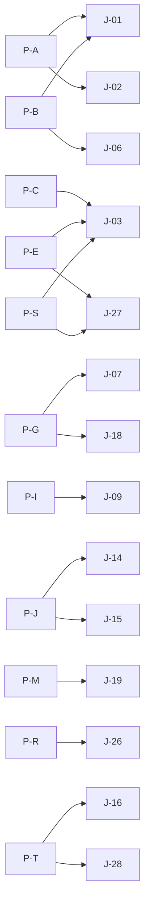

### 6.4 Lifecycles

**Account:** REGISTERED → UNVERIFIED → VERIFIED → ACTIVE ⇄ SUSPENDED → DEACTIVATED → DELETED | TERMINATED.

**Managed learner:** provisioned → invited → claimed → active_managed → graduation_pending → independent | revoked → archived.

**Instructor:** applicant → under_review → approved → active ⇄ suspended → retired.

**Course (authoring):** draft → submitted_for_review → under_review → approved → published → updating → archived | unpublished.

**Contest:** draft → scheduled → registration_open → active → ended → results_published → archived.

---

## §7. Authorization Model

### 7.1 Master Permission Matrix

Legend: ✅ full · ✅* consent/context-scoped · ⛔ denied.

| Capability | Student | Instructor | Course Author | Peer Reviewer | Content Author | Company Reviewer | Faculty | Inst Admin | Moderator | Platform Admin |
|---|---|---|---|---|---|---|---|---|---|---|
| Publish own course | ⛔ | ✅(assigned) | ✅ | ⛔ | ⛔ | ⛔ | ⛔ | ✅(inst) | ⛔ | ✅ |
| Approve course for marketplace | ⛔ | ⛔ | ⛔ | ⛔ | ⛔ | ⛔ | ⛔ | ⛔ | ✅ | ✅ |
| Grade assignments | ⛔ | ✅(own) | ✅(own) | ✅(rubric) | ⛔ | ⛔ | ✅(assigned) | ⛔ | ⛔ | ✅ |
| Peer-review submissions | ⛔ | ⛔ | ⛔ | ✅(assigned) | ⛔ | ⛔ | ⛔ | ⛔ | ⛔ | ✅ |
| Create posts/articles | ✅ | ✅ | ✅ | ✅ | ✅ | ⛔ | ✅ | ✅ | ✅ | ✅ |
| Moderate UGC | ⛔ | own | own | ⛔ | own | ⛔ | ⛔ | inst-scoped | ✅ | ✅ |
| Write company review | ✅ | ✅ | ✅ | ✅ | ✅ | ✅ | ✅ | ⛔(own org) | ✅ | ✅ |
| Submit salary report | ✅ | ✅ | ✅ | ✅ | ✅ | ✅ | ✅ | ⛔ | ⛔ | ✅ |
| Create/grade contest | ⛔ | ✅(own) | ✅(own) | ⛔ | ⛔ | ⛔ | ⛔ | ✅(inst) | ⛔ | ✅ |
| Manage coupons/pricing | ⛔ | ⛔ | ✅(bounded) | ⛔ | ⛔ | ⛔ | ⛔ | ✅(inst) | ⛔ | ✅ |
| View instructor earnings | ⛔ | ⛔ | ✅(own) | ⛔ | ⛔ | ⛔ | ⛔ | ⛔ | ⛔ | ✅ |
| Refunds | ⛔ | ⛔ | ⛔ | ⛔ | ⛔ | ⛔ | ⛔ | ⛔ | ⛔ | ✅ (+Finance Admin) |

### 7.2 Boundary Principles

> [!IMPORTANT]

> - No cross-user mutation without consent/legal basis

> - Recruiter access is application-scoped

> - Moderation escalations are quorum-based

> - Faculty scoped to assigned batches

> - Managed learners cannot self-enrol outside license pool nor apply pre-graduation

> - Peer reviewers see only the submission under review, never reviewer identity (double-blind)

> - Anonymous company reviews hide identity from employer/public, never from Platform Admin/legal

> - Instructors cannot review or rate their own courses

---

# PART III — FEATURE MODEL

## §8. Feature Architecture

### 8.1 Feature Layers (L0–L4)

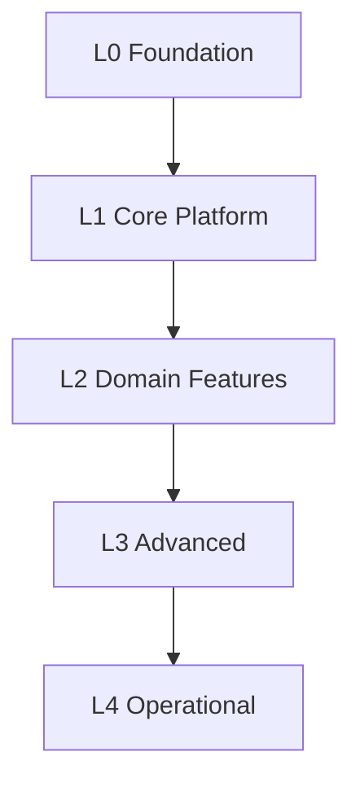

| Layer | Purpose | Examples |
|---|---|---|
| **L0 — Foundation** | Identity, authorization, tenancy, DB, audit | Auth, RLS, tenant model, audit infrastructure |
| **L1 — Core Platform** | Shared entities + basic interactions | Profile, skills, organizations, notifications |
| **L2 — Domain Features** | Business capabilities | Courses, assessments, portfolio, jobs, applications |
| **L3 — Advanced** | Intelligence + scale | Analytics, AI, recommendations, TIG |
| **L4 — Operational** | Optimization + growth | Automation, healing, liquidity, advanced reporting |

### 8.2 Feature Domains

| Domain | Features |
|---|---|
| Identity & Access | F-01, F-12, F-13, F-80, F-81 |
| Core Platform | F-02, F-03, F-11, F-14, F-15, F-17, F-19, F-20, F-21 |
| Learning | F-07, F-08, F-66..F-74, F-76..F-78, F-82, F-84, F-96 |
| Career & Jobs | F-04, F-05, F-06, F-25, F-32, F-36, F-37, F-85, F-91, F-92, F-95, F-99 |
| Social & Content | F-09, F-10, F-53..F-58, F-79 |
| Institutional B2B | F-40..F-47, F-50, F-52 |
| Media | F-42, F-44, F-51 |
| Migration & Independence | F-64, F-65 |
| Employer Insights | F-75, F-86, F-87, F-98 |
| Assessment & Verification | F-88, F-94, F-110, F-115 |
| Advanced Intelligence | F-97, F-105, F-114, F-118, F-119 |
| Platform Foundation | F-116, F-117, F-120 |
| Admin | F-83 |
| Web OS | F-48, F-49 |
| Decision-Gated | F-61, F-62, F-63, LIVE-001 |

---

## §9. Complete Feature Inventory (F-01..F-173)

### 9.1 Priority 10 — Absolute Critical Foundation (10 features)

> Nothing works without these. Build first.

| ID | Feature | Category | Phase | Dependencies |
|---|---|---|---|---|
| F-01 | Authentication & Session | Identity | Ph0 | — |
| F-03 | Dashboard (Role-Adaptive) | Shell | Ph0 | F-01 |
| F-10 | Direct Messaging | Communication | Ph0 | F-01 |
| F-12 | Profile Management | Identity | Ph0 | F-01 |
| F-14 | Notification Center | Communication | Ph0 | F-01 |
| F-15 | Settings | Shell | Ph0 | F-01 |
| F-17 | Admin Console | Governance | Ph0 | F-01 |
| F-21 | Error Recovery & Resilience | Shell | Ph0 | F-01 |
| **F-84** | **Skills Graph & Taxonomy ★** | Platform | Ph1–2 | F-12, F-07, F-08 |
| **F-96** | **Skill Evidence & Digital Credentials ★** | Verification | Ph2 | F-12, F-26 |

### 9.2 Priority 9 — Critical Moat & Core Intelligence (15 features)

| ID | Feature | Category | Phase | Dependencies |
|---|---|---|---|---|
| F-04 | Job Marketplace | Marketplace | Ph2 | F-01, F-12 |
| F-06 | ATS / Candidate Pipeline | Recruiting | Ph2–3 | F-04, F-05 |
| F-07 | Learning Management System | Learning | Ph1 | F-01, F-12 |
| F-08 | Challenges Arena | Assessment | Ph1 | F-01, F-12 |
| F-85 | Career Graph & Progression | Intelligence | Ph3 | F-12, F-04, F-06 |
| F-86 | Salary Intelligence | Intelligence | Ph3 | F-04, F-06, F-56 |
| F-88 | Technical Interview Platform | Hiring | Ph3 | F-08, F-33, F-06 |
| F-91 | Career Readiness Assessment | Career | Ph2 | F-84, F-08, F-12 |
| F-92 | Advanced Recruiter Search | Recruiting | Ph3 | F-12, F-34, F-08, F-96 |
| F-114 | Learning Impact Tracking | Analytics | Ph4 | F-07, F-04, F-06 |
| F-115 | Certification Exam Platform | Assessment | Ph3 | F-77, F-45 |
| F-122 | Application Feedback Loop | Jobs | Ph3 | F-06, F-04 |
| F-123 | Skill Decay Tracking | Verification | Ph3 | F-84, F-96 |
| F-144 | Reputation Engine | Platform | Ph2 | F-96, F-58, F-72 |
| F-145 | Recommendation Engine Core | Platform | Ph2–3 | F-84, F-144 |

### 9.3 Priority 8 — Very High Essential Core (23 features)

| ID | Feature | Category | Phase | Dependencies |
|---|---|---|---|---|
| F-05 | Post Job Studio | Marketplace | Ph2 | F-04 |
| F-09 | Professional Networking | Social | Ph2 | F-12 |
| F-11 | AI Career Assistant (Basic) | AI | Ph1/Ph4 | F-12 |
| F-22 | Gamification & XP Ledger | Engagement | Ph1 | F-07, F-08 |
| F-24 | Trust, Safety & Moderation | Safety | Ph2 | F-01 |
| F-26 | Portfolio Showcase | Identity | Ph1 | F-12 |
| F-33 | Video Interview Rooms | Communication | Ph3 | F-10 |
| F-40 | Institutional Managed Learning | Institutions | Ph3 | F-01, F-07 |
| F-42 | Provider-Agnostic Media Engine | Platform | Ph2 | F-07 |
| F-52 | Certificate Verification | Verification | Ph3 | F-07 |
| F-65 | LinkedIn Decoupling & Independence | Foundation | Ph1–2 | F-64 |
| F-66 | Course Creation Studio | Learning | Ph7 | F-07, F-42 |
| F-68 | Quizzes, Practice Tests & Final Exams | Learning | Ph7 | F-07 |
| F-69 | Assignments & Peer Review | Learning | Ph7 | F-07 |
| F-70 | Learning Paths, Programs & Specializations | Learning | Ph7 | F-07, F-66 |
| F-77 | Skill Certification Exams | Assessment | Ph3 | F-08 |
| F-102 | Hiring Manager Portal | Recruiting | Ph3 | F-06, F-88 |
| F-121 | Warm Introduction Paths | Networking | Ph4 | F-09, F-12, F-56, F-125 |
| F-142 | Referral Request System | Jobs | Ph4 | F-09, F-04 |
| F-146 | Activity & Contribution Tracking | Platform | Ph3 | F-84, F-26, F-10 |
| F-147 | Unified Search & Discovery | Platform | Ph2 | F-84, F-145 |
| F-148 | Instructor Reputation System | Reputation | Ph7 | F-72, F-144 |
| F-150 | Peer Credibility Networks | Reputation | Ph8 | F-110, F-144 |

### 9.4 Priority 7 — High Major Capability (28 features)

| ID | Feature | Category | Phase | Dependencies |
|---|---|---|---|---|
| F-13 | Resume Builder | Identity | Ph1 | F-12 |
| F-16 | Billing & Subscriptions | Monetization | Ph5 | F-01 |
| F-19 | Product Analytics | Telemetry | Ph1 | F-01 |
| F-20 | Command Search (⌘K) | Shell | Ph2 | F-01 |
| F-23 | Leaderboard & Badges | Engagement | Ph2 | F-22 |
| F-25 | Job Detail View | Marketplace | Ph2 | F-04 |
| F-29 | Scheduled Notification Digest | Communication | Ph2 | F-14 |
| F-32 | Saved Searches & Job Alerts | Candidate | Ph2 | F-04 |
| F-34 | Multi-Entity Backend Search | Platform | Ph2 | F-04, F-07 |
| F-36 | Application Draft Autosave | Candidate | Ph1 | F-04 |
| F-75 | Employer Insights | Intelligence | Ph9 | F-12, F-56 |
| F-87 | Interview Experience Repository | Candidate | Ph4 | F-04, F-56, F-88 |
| F-93 | Interview Video Recording & AI Feedback | Hiring | Ph4 | F-33, F-06, F-88 |
| F-94 | Verified Work History & References | Verification | Ph3 | F-12, F-58 |
| F-95 | Career Transition Planning | Career | Ph4 | F-84, F-91, F-07 |
| F-98 | Employer Equity & Compensation Intelligence | Intelligence | Ph3 | F-56, F-86 |
| F-99 | AI Career Coach (Enhanced) | AI | Ph4 | F-12, F-84, F-91, F-07 |
| F-104 | Pre-Hire Assessment Customization | Hiring | Ph3 | F-06, F-08, F-88 |
| F-106 | Skill Prerequisite Engine | Learning | Ph5 | F-07, F-70, F-84 |
| F-110 | Verified Skill Endorsements | Verification | Ph8 | F-96, F-12, F-58 |
| F-116 | Accessibility & Inclusive Learning | Platform | Ph8 | F-07, F-44 |
| F-125 | Alumni Networks | Networking | Ph4 | F-12, F-09, F-40 |
| F-149 | Employer Reputation & Brand System | Reputation | Ph8 | F-75, F-56, F-144 |
| F-151 | Skill Supply/Demand Forecasting | Intelligence | Ph4 | F-84, F-86, F-97 |
| F-152 | Career Trajectory Analysis | Intelligence | Ph4 | F-85, F-86, F-93 |
| F-153 | Learning Impact Dashboard (Enhanced) | Intelligence | Ph4 | F-114, F-85, F-86 |
| F-158 | Talent Pool Intelligence | Recruiting | Ph3 | F-92, F-84, F-144 |
| F-159 | Behavioral Talent Discovery | Discovery | Ph4 | F-146, F-84, F-144 |

### 9.5 Priority 6 — Important Significant Value (32 features)

| ID | Feature | Category | Phase | Dependencies |
|---|---|---|---|---|
| F-27 | Local Resume Match Preview | Edge | Ph2 | F-18 |
| F-28 | External Job Page Scanner | Edge | Ph2 | F-18 |
| F-30 | Networking Stale-Request Nudges | Engagement | Ph2 | F-09 |
| F-31 | KPI Aggregation & Rollups | Analytics | Ph2 | F-19 |
| F-35 | Feature Flag Console | Administration | Ph2 | F-17 |
| F-37 | Job Templates | Recruiting | Ph2 | F-05 |
| F-41 | Procurement & Seat Licensing | Institutions | Ph6 | F-40, F-16 |
| F-43 | B2B2C Graduation Flywheel | Institutions | Ph3 | F-40 |
| F-44 | AI Media Enrichment | Learning | Ph4 | F-42, F-11 |
| F-46 | Institutional Analytics | Institutions | Ph3 | F-40 |
| F-47 | Faculty Dashboard | Institutions | Ph3 | F-40 |
| F-50 | Institutional Course Marketplace | Institutions | Ph3 | F-40, F-42 |
| F-51 | Media Health Monitoring | Platform | Ph4 | F-42 |
| F-58 | Written Recommendations | Networking | Ph8 | F-53 |
| F-60 | Profile Views & Privacy Controls | Networking | Ph8 | F-12 |
| F-67 | Categories, Discovery & Comparison | Learning | Ph7 | F-07, F-145 |
| F-71 | Course Q&A, Discussions, Notes | Learning | Ph7 | F-07 |
| F-72 | Course Reviews & Ratings | Learning | Ph7 | F-07 |
| F-73 | Course Commerce | Learning | Ph7 | F-07, F-16 |
| F-74 | Instructor Platform | Learning | Ph7 | F-07, F-66 |
| F-80 | Profile Enhancements | Profile | Ph1/Ph8 | F-12 |
| F-82 | Student Learning Analytics | Analytics | Ph7 | F-07 |
| F-103 | Candidate Comparison & Rubric | Recruiting | Ph3 | F-06, F-92 |
| F-107 | Live Q&A with Instructors | Learning | Ph5 | F-07, F-71, F-10 |
| F-112 | Resume Parsing & Optimization | Candidate | Ph8 | F-13, F-12 |
| F-113 | Recruiter Outreach Analytics | Recruiting | Ph8 | F-59, F-06 |
| F-127 | Company Culture Assessment | Companies | Ph5 | F-56, F-75 |
| F-132 | Adaptive Learning System | Personalization | Ph5 | F-07, F-84, F-145 |
| F-133 | Professional Development Plans | Career | Ph4–5 | F-91, F-95, F-145 |
| F-135 | Talent Pool Analytics | Recruiting | Ph3 | F-92, F-84, F-144 |
| F-155 | Interview Prediction & Benchmarking | Intelligence | Ph4 | F-88, F-102, F-105 |

### 9.6 Priority 5 — Medium Meaningful (23 features)

| ID | Feature | Category | Phase | Dependencies |
|---|---|---|---|---|
| F-18 | Chrome Extension Companion | Edge | Ph2 | F-01 |
| F-53 | Professional Social Graph & Feed | Networking | Ph8 | F-12 |
| F-54 | Content Publishing | Networking | Ph8 | F-12 |
| F-55 | Groups & Communities | Community | Ph8 | F-53 |
| F-56 | Organization & Institution Pages | Recruiting | Ph8 | F-12, F-40 |
| F-57 | Events & Webinars | Community | Ph8 | F-53 |
| F-59 | Outreach Credits (TalentMail) | Recruiting | Ph8 | F-10 |
| F-64 | LinkedIn Migration Engine | Integration | Ph1–2 | F-12 |
| F-76 | Coding Contests & Leaderboards | Assessment | Ph9 | F-08 |
| F-78 | Practice Sets & Interview Prep | Learning | Ph9 | F-08 |
| F-79 | Articles & Newsletters | Networking | Ph8 | F-54 |
| F-89 | Contribution Verification System | Verification | Ph8 | F-26, F-12 |
| F-90 | Peer Mentorship & Advisor Network | Community | Ph4 | F-12, F-10, F-55 |
| F-97 | Real-Time Job Market Analytics | Intelligence | Ph4 | F-04, F-06 |
| F-109 | Salary Negotiation Guidance | Career | Ph8 | F-86, F-98 |
| F-117 | Mobile-First Job Application | Candidate | Ph8 | F-04, F-33 |
| F-124 | Project Marketplace | Learning | Ph5 | F-07, F-26, F-100 |
| F-126 | Interview Prep Marketplace | Careers | Ph4 | F-87, F-90, F-88 |
| F-160 | Talent Segmentation & Classification | Analytics | Ph4 | F-84, F-85, F-144 |
| F-162 | Verified Work History Network | Verification | Ph4 | F-94, F-84 |
| F-166 | Interview Performance Benchmarking | Analytics | Ph4 | F-88, F-102 |
| F-167 | Candidate Comparison (Enhanced) | Hiring | Ph3 | F-88, F-103 |
| F-169 | Community Contribution Scoring | Community | Ph7 | F-55, F-144 |

### 9.7 Priority 4 — Moderate Useful Support (20 features)

| ID | Feature | Category | Phase | Dependencies |
|---|---|---|---|---|
| F-45 | Proctoring (Third-Party) | Learning | Ph10 | F-40, F-115 |
| F-48 | OS Shell & Workbench | OS | Ph2+ | F-01, F-03 |
| F-49 | Automation & Agents | OS | Ph3+ | F-48 |
| F-61 | Premium Candidate Tier (gated) | Business | Ph10+ | F-60 |
| F-100 | Peer Project Collaboration | Learning | Ph5 | F-07, F-69, F-10 |
| F-101 | Badge Marketplace & Recognition | Gamification | Ph8 | F-23, F-26 |
| F-105 | Post-Hire Analytics & ROI Tracking | Analytics | Ph4 | F-102, F-93 |
| F-108 | Expert Network Matching | Networking | Ph7 | F-09, F-12, F-10 |
| F-111 | Industry-Specific Learning Hubs | Learning | Ph8 | F-07, F-55 |
| F-118 | Emerging Skills Detection | Intelligence | Ph8 | F-84 |
| F-119 | Diversity & Inclusion Analytics | Hiring | Ph8 | F-06 |
| F-134 | Code Review Practice | Skills | Ph5 | F-08, F-26 |
| F-135 | System Design Practice | Skills | Ph5 | F-08, F-88 |
| F-139 | Local Communities & Meetups | Networking | Ph7 | F-09, F-55, F-57 |
| F-140 | Affinity Groups | Community | Ph7 | F-55, F-09 |
| F-157 | Skills Co-Learning Path Optimizer | Learning | Ph5 | F-84, F-114, F-07 |
| F-164 | Skills Evidence Narrative & Storytelling | Credential | Ph5 | F-96, F-26 |
| F-170 | Expert Network (Enhanced) | Community | Ph7 | F-144, F-90 |
| F-172 | Advanced Compensation Intelligence | Analytics | Ph8 | F-86, F-98, F-109 |
| F-143 | OSS Contribution Discovery | Portfolio | Ph8 | F-89, F-26 |

### 9.8 Priority 3 — Low Future Enhancement (18 features)

| ID | Feature | Category | Phase | Dependencies |
|---|---|---|---|---|
| F-02 | Landing Page | Shell | Ph0 | — |
| F-81 | Identity Verification | Verification | Ph9 | F-12 |
| F-83 | Admin Platform Expansion | Administration | Ph8 | F-17 |
| F-129 | Leadership Development | Learning | Ph5 | F-07, F-84 |
| F-130 | Freelance Marketplace | Jobs | Ph7 | F-04, F-100, F-124 |
| F-131 | Apprenticeship Matching | Jobs | Ph6 | F-04, F-40 |
| F-132 | Scholarship Discovery | Learning | Ph6 | F-40, F-07 |
| F-133 | Volunteer Matching | Community | Ph7 | F-26, F-100 |
| F-136 | Micro-Learning | Learning | Ph4 | F-07, F-42 |
| F-137 | Spaced Repetition | Learning | Ph6 | F-07, F-68 |
| F-138 | Study Accountability Partners | Learning | Ph6 | F-07, F-55 |
| F-141 | Onboarding Preparation | Careers | Ph8 | F-06, F-33 |
| F-161 | Internal Mobility & Succession | Enterprise | Ph6–7 | F-84, F-91, F-132 |
| F-163 | Credential Wallet & Portability | Credential | Ph5 | F-96 |
| F-165 | Diversity, Equity & Inclusion Data System | Analytics | Ph8 | F-119 |
| F-168 | Hiring Prediction & Success Modeling | Analytics | Ph5 | F-88, F-105 |
| F-171 | Employer Brand Management System | Company | Ph8 | F-56, F-75, F-149 |
| F-173 | Company-to-Skills Mapping | Intelligence | Ph4 | F-84, F-04 |

### 9.9 Priority 2 — Very Low Limited Impact (10 features)

| ID | Feature | Category | Phase |
|---|---|---|---|
| F-120 | API & Integration Platform | Platform | Ph10 |
| F-154 | Career Forecasting Extension | Intelligence | Ph4 |
| F-146 (alt) | Micro-Learning (alt) | Learning | Ph4 |
| F-149 (alt) | Advanced Compensation (alt) | Analytics | Ph8 |
| F-150 (alt) | Company-to-Skills (alt) | Intelligence | Ph4 |
| F-153 (alt) | Interview Performance Benchmarking (alt) | Analytics | Ph4 |
| F-155 (alt) | Adaptive Learning (alt) | Personalization | Ph5 |
| F-156 (alt) | PDP (alt) | Career | Ph4–5 |
| F-158 (alt) | Talent Pool Intelligence (alt) | Recruiting | Ph3 |
| F-159 (alt) | Behavioral Discovery (alt) | Discovery | Ph4 |

### 9.10 Priority 1 — Minimal Long-Term Optional (6 features)

| ID | Feature | Category | Phase |
|---|---|---|---|
| F-106 (alt) | Micro-Learning (alt) | Learning | Ph4 |
| F-136 (alt) | Micro-Learning (alt) | Learning | Ph4 |
| F-141 (alt) | Onboarding Prep (alt) | Careers | Ph8 |
| F-154 (alt) | Adaptive Learning (alt) | Personalization | Ph5 |
| F-155 (alt) | PDP (alt) | Career | Ph4–5 |
| F-156 (alt) | Internal Mobility (alt) | Enterprise | Ph6–7 |

### 9.11 Priority 0 — Lowest / Deferred / Rejected (8 features)

| ID | Feature | Reason |
|---|---|---|
| F-38 | Legacy Chat Service | DEPRECATED — ADR-004 replaces |
| F-39 | Unified Backend Stub | DEPRECATED — App Router replaces |
| F-45 | Proctoring (Third-Party) | OD-35 gated |
| F-61 | Premium Candidate Tier | OD-34 gated |
| F-62 | Sponsored Content | NOT RECOMMENDED — conflicts P-09, P-02 |
| F-63 | Business-Development Graph | NOT RECOMMENDED — outside SCOPE-003 |
| LIVE-001 | Live video | OD-33 gated |
| F-152 (dup) | Talent Supply/Demand (alt) | Overlaps F-151 |

### 9.12 Feature Count Summary

| Priority | Count |
|---|---|
| 10 | 10 |
| 9 | 15 |
| 8 | 23 |
| 7 | 28 |
| 6 | 32 |
| 5 | 23 |
| 4 | 20 |
| 3 | 18 |
| 2 | 10 |
| 1 | 6 |
| 0 | 8 |
| **Total unique** | **173** |

---

## §10. Priority Matrix

*(See §9 for the complete prioritized inventory. Priority assigned per §7.1 framework based on: core functionality, dependencies, user impact, business impact, security implications, architectural importance, technical dependencies, sequencing, risk, and dependency depth.)*

---

## §11. Feature Dependency Map

### 11.1 Complete Dependency Registry

| Feature | Depends On | Blocks |
|---|---|---|
| F-01 Auth | — | All features |
| F-12 Profile | F-01 | All domain features |
| F-84 Skills Graph | F-12, F-07, F-08 | F-91, F-95, F-99, F-106, F-114, F-118 |
| F-96 Skill Evidence | F-12, F-26 | F-89, F-92, F-94, F-110, F-115 |
| F-07 LMS | F-01, F-12 | F-22, F-42, F-66..F-74 |
| F-08 Arena | F-01, F-12 | F-22, F-76, F-88 |
| F-04 Jobs | F-01, F-12 | F-05, F-25, F-32, F-36, F-85, F-86 |
| F-06 ATS | F-04, F-05 | F-88, F-92, F-102, F-103 |
| F-85 Career Graph | F-12, F-04, F-06 | F-95, F-97, F-105, F-114 |
| F-86 Salary | F-04, F-06, F-56 | F-98, F-97, F-109 |
| F-88 Interview Platform | F-08, F-33, F-06 | F-93, F-102, F-104, F-105 |
| F-91 Readiness | F-84, F-08, F-12 | F-95, F-99, F-92 |
| F-92 Adv Search | F-12, F-34, F-08, F-96 | — |
| F-102 HM Portal | F-06, F-88 | F-105 |
| F-114 Learning Impact | F-07, F-04, F-06 | F-105, F-118 |
| F-115 Exam Platform | F-77, F-45 | — |
| F-121 Warm Intros | F-09, F-12, F-56, F-125 | — |
| F-122 App Feedback | F-06, F-04 | — |
| F-123 Skill Decay | F-84, F-96 | — |
| F-142 Referrals | F-09, F-04 | — |
| F-144 Reputation | F-96, F-58, F-72 | F-148, F-149, F-150 |
| F-145 Recommendation | F-84, F-144 | All personalization |

### 11.2 Critical Path

```mermaid

flowchart LR

    A[W0 Foundation<br/>Auth + RLS + Shell] --> B[W1 Candidate Core<br/>+ Skills Graph F-84]

    B --> C[W2 Skill Evidence F-96<br/>+ Career Readiness F-91]

    C --> D[W3 Career Graph F-85<br/>+ Salary F-86 + Interview F-88]

    D --> E[W3 Advanced Recruiter<br/>F-92 + F-102 + F-103]

    E --> F[W4 Learning Impact F-114<br/>+ AI Coach F-99]

    F --> G[W5 Community<br/>+ Peer Learning]

    G --> H[W6 Enterprise<br/>+ Integrations]

    H --> I[W7 Learning Marketplace]

    I --> J[W8 Social Parity<br/>+ Verification Depth]

    J --> K[W9 Insights + Assessment]

    K --> L[W10 Decision-Gated]

    style B fill:#dc2626,color:#fff

    style C fill:#dc2626,color:#fff

    style D fill:#ea580c,color:#fff

    style E fill:#ea580c,color:#fff

    style F fill:#ea580c,color:#fff

```

**Critical path duration:** 8 waves (~30–36 months solo-founder + AI agent).

**Bottleneck features (highest unlock-to-dependency ratio):**

| Rank | Feature | Priority | Unlocks |
|---|---|---|---|
| 1 | F-84 Skills Graph | 10 | 20+ features |
| 2 | F-96 Skill Evidence | 10 | 10+ features |
| 3 | F-144 Reputation Engine | 9 | 8+ features |
| 4 | F-145 Recommendation Engine | 9 | All personalization |
| 5 | F-114 Learning Impact | 9 | Career intelligence |
| 6 | F-122 Application Feedback | 9 | P-02 alignment |
| 7 | F-123 Skill Decay | 9 | Verified skills moat |
| 8 | F-147 Unified Search | 8 | Cross-domain discovery |

---

# PART IV — DETAILED SPECIFICATIONS

## §12. Tier 0 Foundation Features (Priority 10)

### F-01 Authentication & Session

| Attribute | Value |
|---|---|
| **Feature ID** | F-01 |
| **Priority** | 10 |
| **Phase** | Ph0 |
| **Purpose** | Establish and maintain authenticated user sessions with role claims |
| **Business Objective** | Enable secure identity for all platform interactions |
| **User Problem Solved** | Users need a secure, frictionless way to access the platform |
| **Actors** | Anonymous visitor, Candidate, Recruiter, Admin, Institution Admin |
| **Preconditions** | Supabase Auth configured; RLS baseline migrations applied |
| **Postconditions** | Authenticated session with normalized role claims |

**Core Behavior (Step-by-Step):**

1. **Registration** — User submits email + password (or OAuth via Google/GitHub). Server validates: unique email (`auth.users.email`), password strength (zxcvbn ≥3), age gate (DOB ≥16 years), no banned email domain. On success: `auth.users` row created → trigger `on_auth_user_created` inserts `profiles` + `user_settings` → verification email sent via Resend → user lands on onboarding wizard.

2. **Email Verification** — User clicks tokenized link (TTL 24h, single-use). `profiles.email_verified_at` set. Account state → VERIFIED.

3. **Login** — User submits credentials. Rate limit enforced (10/min/IP for login; 5/min/IP for password reset). On success: Supabase Auth issues JWT (1h access, 30-day sliding refresh) + refresh token. Session cookie set: `sb-access-token` (HttpOnly, Secure, SameSite=Lax).

4. **Role Normalization** — Edge middleware reads JWT `app_metadata.role` and normalizes to `ROLE_USER` / `ROLE_RECRUITER` / `ROLE_ADMIN`. Missing/invalid role → default `ROLE_USER`.

5. **Session Restore** — On page load, client checks cookie. If expired, silent refresh attempt. If refresh fails, redirect to `/login` with `?return=` param. Partial session cleared on fatal auth error.

6. **Logout** — Server revokes JWT via `jti` denylist. Cookie cleared. Redirect to `/`.

7. **Password Reset** — User submits email → rate limited (5/min/IP). Tokenized link sent (TTL 30 min, single-use). On submission: new password validated → session revoked globally → user re-authenticated.

8. **OAuth Flow** — Google/GitHub: PKCE exchange → Supabase Auth callback → profile merged with existing email if match (no silent account takeover; consent prompt if email collision).

**Business Rules:** BR-001 (auth required), BR-002 (role separation), AUTH-001..017

**Permissions:** Public: register/login/reset · Authenticated: logout/refresh/change password · Admin: revoke any session

**Data Dependencies:** `auth.users` (Supabase-managed), `profiles`, `user_settings`, `audit_logs`

**API Dependencies:** `POST /api/v1/auth/register`, `POST /api/v1/auth/login`, `POST /api/v1/auth/reset-password`, `POST /api/v1/auth/logout` (SCI-04)

**UI Dependencies:** `/login`, `/register`, `/forgot-password`, `/reset-password`, `/verify-email`

**External Dependencies:** Supabase Auth (GoTrue), Resend (transactional email), Google OAuth, GitHub OAuth

**Security Requirements:** HDN-008 (rate limits, lockout, jti denylist) · HDN-014 (TLS, no plaintext credentials) · MFA readiness (AUTH-008) · age gate (AUTH-017)

**Failure Modes:**

- OAuth provider unavailable → fallback to email/password login (visible message)

- Email provider down → queue verification email; show "pending" state

- Supabase Auth outage → redirect to maintenance page with honest status

**Edge Cases:**

- Multi-tab session collision → last-write-wins with warning toast

- JWT clock skew >30s → reject with "check your system clock"

- Duplicate OAuth email (GitHub vs Google) → merge prompt, never silent

**Analytics Events:** EVT-001 `user_registered`, EVT-002 `session_active`

**Notifications:** Welcome email (immediate) · Verification email (immediate) · Password reset email (immediate) · Suspicious login alert (immediate, post-MVP)

**State Machine:**

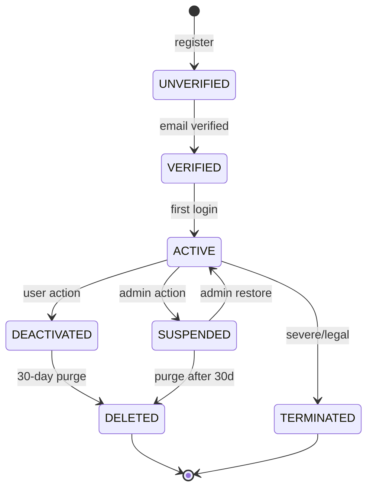

**Acceptance Criteria:**

- Login p95 latency <300ms

- 100% duplicate email rejection

- 100% weak password rejection

- Zero plaintext secrets in client bundle

- Rate limits enforced at edge

- Age gate blocks <16

**Test Requirements:** Unit (password policy, email normalization) · Integration (register→verify→login E2E) · RLS (own-row isolation) · Security (rate limits, lockout) · Accessibility (form keyboard nav)

**Feature Dependencies:** None (foundation)

---

### F-12 Profile Management

| Attribute | Value |
|---|---|
| **Feature ID** | F-12 |
| **Priority** | 10 |
| **Phase** | Ph0 |
| **Purpose** | Canonical professional identity record |
| **Problem Solved** | No single source of truth for candidate identity |
| **Actors** | Candidate, Recruiter, Admin |

**Core Behavior (Step-by-Step):**

1. **Profile Auto-creation** — On `auth.users` insert, trigger creates `profiles` row with `id` (FK to auth.users), `email`, `role` (from JWT), `created_at`.

2. **Basic Info Edit** — User navigates to `/profile`. Form fields: `full_name` (required, ≤120 chars), `headline` (≤120), `summary` (≤2000, sanitized markdown), `location` (city-level), `avatar_url` (upload ≤4MB, JPEG/PNG/WebP, MIME sniffed, EXIF stripped), `phone_number` (encrypted at rest AES-256-GCM, masked on public view).

3. **Skills Management** — User adds skills via typeahead from canonical skills taxonomy (F-84). Each entry: `skill_id`, `proficiency` (Beginner/Intermediate/Advanced/Expert), `years` (optional), `self_reported` (boolean — becomes verified upon platform signal).

4. **Experience** — CRUD on `profile_experience` rows: `role`, `company`, `start_date`, `end_date` (nullable for current), `description` (≤2000 sanitized markdown), `location`. Company name validated against `organizations` table when possible.

5. **Education** — CRUD on `profile_education`: `institution`, `degree`, `field_of_study`, `start_year`, `end_year`, `grade` (optional). Institution matched against known list when possible.

6. **Certifications** — CRUD on `profile_certifications`: `title`, `issuer`, `issue_date`, `expiry_date` (optional), `credential_id`, `credential_url` (HTTPS-only). Verification status flag.

7. **Portfolio** — CRUD on `profile_portfolios`: `title`, `description`, `demo_url`, `repo_url`, `media_assets` (images/PDFs ≤50MB), `tech_stack` (canonical skills). Public visibility toggle.

8. **Completeness Score** — Recomputed on every edit. Formula: weighted sum of filled sections (basic 20%, skills 15%, experience 20%, education 15%, certifications 10%, portfolio 10%, summary 10%). Score 0–100.

9. **Visibility Toggles** — Per-section control: `public` / `connections_only` / `recruiters_only` / `private`.

10. **Public View** — `/profile/[userId]` renders public-safe columns only. PII columns (`phone_number`, `tax_id`) never exposed.

11. **Data Residency** — `data_residency_region` set at signup from locale (US/EU). Gates AI routing.

**Business Rules:** BR-005 (own-edit only), BR-061 (≥70% completeness for job applications), PROFILE-001..035

**Permissions:** Own-row edit only. Admin can edit any. Public read of public-safe columns.

**Data Dependencies:** `profiles`, `profile_skills`, `profile_experience`, `profile_education`, `profile_portfolios`, `profile_certifications`, `profile_media`, `career_signals`, `user_settings`

**API Dependencies:** `GET /api/v1/profile`, `PUT /api/v1/profile`, `POST /api/v1/profile/resume/parse`, `POST /api/v1/profile/portfolio`, `GET /api/v1/profile/{userId}/public`

**UI Dependencies:** `/profile`, `/profile/[userId]`, resume upload drawer, portfolio gallery, skills taxonomy typeahead

**External Dependencies:** Supabase Storage, HaveIBeenPwned (password breach check), AI service (resume parsing)

**Security Requirements:** RLS own-row + public-safe view · Field-level encryption (phone_number, tax_id) · XSS sanitization on rich text · Upload pipeline

**Failure Modes:**

- Resume parse failure → manual entry fallback with error toast

- File upload failure → retry with resume, no partial save

- Public view permission denied → 404-equivalent (no existence leak)

**Edge Cases:**

- Concurrent edit collision → optimistic concurrency via `version` column; 409 on conflict

- Empty profile on first login → onboarding wizard with guided steps

- Deleted company in experience → graceful degradation, keep text

- Vanity slug collision → suggest alternatives, block reserved words

**Analytics Events:** EVT-003 `profile_completed`, EVT-004 `resume_uploaded`, EVT-005 `verified_signal_added`

**Notifications:** Profile completeness nudges (weekly digest if <70%) · Verification badge unlocked (immediate)

**State Machine:** (Profile itself is stateful only for visibility)

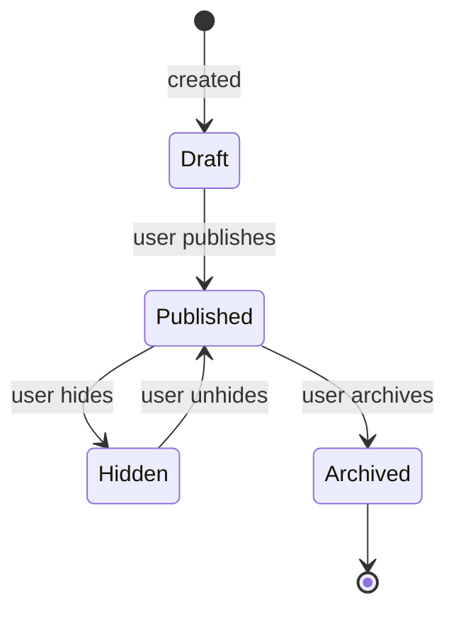

**Acceptance Criteria:**

- Profile save p95 <250ms

- Public view never exposes PII columns

- Completeness score 100% reproducible

- Avatar upload succeeds for supported formats only

- Concurrent edit returns 409 with clear message

**Test Requirements:** Unit (validation, completeness formula) · Integration (CRUD + RLS) · E2E (J-01 profile build) · Contract (resume parser adapter) · A11y (form keyboard, screen reader)

**Feature Dependencies:** F-01 · **Blocks:** All domain features

---

### F-84 Skills Graph & Taxonomy System ★

| Attribute | Value |
|---|---|
| **Feature ID** | F-84 |
| **Priority** | 10 |
| **Phase** | Ph1–2 |
| **Purpose** | Canonical semantic model of skills: relationships, prerequisites, correlations, market demand |
| **Problem Solved** | Recommendations, matching, and career guidance are impossible without understanding skill relationships |
| **Actors** | Platform Admin (taxonomy curation), all users (read), recommendation engine (read), instructors (tag content) |
| **Preconditions** | Profile (F-12), LMS (F-07), Arena (F-08) exist |
| **Postconditions** | Every course, challenge, job, and profile references canonical skills |

**Core Behavior (Step-by-Step):**

1. **Taxonomy Curation (Admin)** — Platform Admin manages the canonical `skills` table: create, edit, deprecate, merge (with redirect map). Each skill: `id`, `canonical_name`, `slug`, `category` (nested ≤3 levels), `description`, `aliases` (array), `status` (active/deprecated), `created_at`. Target: 2,000+ skills at scale.

2. **Skill Relationships (Admin + Computed)** — `skill_relationships` table edges:

   - `prerequisite_of` — directional, acyclic (validated at write)

   - `subskill_of` — hierarchical decomposition

   - `supersedes` — replacement (deprecated → current)

   - `complements` — bidirectional co-occurrence

   - `correlates_with` — bidirectional, computed statistically (never manual)

3. **Content Tagging** — Every course, module, lesson, challenge, job, portfolio project, and user skill entry references a canonical `skill_id`. No freeform skill strings allowed (BR-144).

4. **Market Signal Collection** — Daily job aggregation: `skill_market_signals` table tracks per skill: `demand_index`, `salary_premium`, `growth_rate`, `region`, `window_start`, `window_end`. Aggregated from job postings, salary reports, and hiring outcomes.

5. **Graph Traversal** — Read operations:

   - **Skill gap** — Given target skill, traverse `prerequisite_of` backwards to find unmet prerequisites

   - **Related skills** — Given skill, traverse `correlates_with` edges (top N by weight)

   - **Role readiness** — Given role (job family), aggregate required skills; compute candidate overlap

   - **Path suggestion** — Dijkstra-style shortest path from candidate's skills → target role's required skills

6. **Emerging Skills Detection** — Weekly computation (F-118 dependency): new skill candidates from job postings with `occurrence_count ≥5` in the last 30 days but not in taxonomy → candidate queue for admin review.

7. **Search & Typeahead** — Full-text search over `canonical_name` + `aliases`. Used in profile, course, job, and challenge forms.

8. **Public API** — `GET /api/v1/skills/{id}` returns skill + relationships + market signals (public read). `GET /api/v1/skills/search?q=` for typeahead.

9. **Caching** — Read-heavy; cache hot skills (top 500 by traversal count) in memory with 15-min TTL. Invalidation on taxonomy write.

**Business Rules:** BR-141..BR-148

- BR-141: Curated by Platform Admin; no user creation of canonical skills

- BR-142: Relationships directional

- BR-143: Correlations computed, not manual

- BR-144: All tagging references canonical skill

- BR-145: Market signals update daily

- BR-146: Traversal depth bounded (max 5 hops)

- BR-147: `prerequisite_of` acyclic (validated)

- BR-148: Emerging skills require ≥5 independent signals before promotion

**Permissions:** Public read. Admin write. Instructor/Course Author can propose skill tags (subject to moderation).

**Data Dependencies:** `skills`, `skill_relationships`, `skill_market_signals`, `course_skills`, `challenge_skills`, `job_skills`, `profile_skills`, `portfolio_skills`

**API Dependencies:** SCI-35 (Skill CRUD, relationship CRUD, market signal query, traversal), SCI-45 (emerging skill proposal), SCI-46 (relationship validation)

**UI Dependencies:** Admin taxonomy manager · Typeahead components · Skill detail card (shows relationships, market signals) · Skill gap visualizer

**External Dependencies:** None required. Optional: licensed market data feed (OD-46).

**Security Requirements:** Public read of taxonomy · Admin-only writes · No PII in graph · RLS enforced on tagging tables · Rate limits on search API

**Failure Modes:**

- Taxonomy read failure → fallback to cached top 500

- Traversal cycle detected (data corruption) → alert + refuse traversal, log incident

- Market signal computation fails → serve last-known-good data with staleness banner

**Edge Cases:**

- Admin merges two skills → all references updated transactionally, redirect map retained

- Skill deprecated mid-course → course continues, skill tag shows "deprecated" badge

- Path traversal exceeds depth → return partial result with caveat

- Correlated skill with low sample count → hide until minimum threshold

**Analytics Events:** `skill_searched`, `skill_relationship_traversed`, `skill_tagged`, `emerging_skill_promoted`, `skill_merged`

**Notifications:** Admin digest of emerging skills (weekly) · Taxonomy change alerts to instructors with affected courses

**State Machine (Skill):**

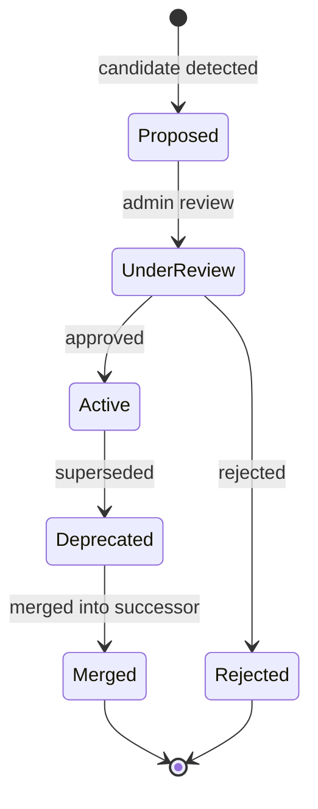

**Acceptance Criteria:**

- Skill search p95 <100ms (cached)

- Traversal p95 <200ms for depth ≤3

- 100% of course/challenge/job skill tags reference canonical skills

- Zero cycles in `prerequisite_of` graph

- Market signal updates daily (measure via scheduler)

- Typeahead returns relevant results for common typos

**Test Requirements:**

- Unit: traversal algorithms, cycle detection, merge logic

- Integration: CRUD, RLS on tagging tables, market signal computation

- E2E: admin curates taxonomy → instructor tags course → learner typeahead shows skill

- Contract: skill API schema, adapter pattern

- Performance: traversal under load (10k concurrent)

- Data: graph integrity checks (cycles, orphans, unreferenced skills)

**Feature Dependencies:** F-12, F-07, F-08 · **Blocks:** F-91, F-95, F-99, F-106, F-114, F-118

---

### F-96 Skill Evidence & Digital Credentials ★

| Attribute | Value |
|---|---|
| **Feature ID** | F-96 |
| **Priority** | 10 |
| **Phase** | Ph2 |
| **Purpose** | Cryptographic, auditable proof of skill via projects, assessments, work history, peer review |
| **Problem Solved** | LinkedIn endorsements are gamed; platform needs verified evidence |
| **Actors** | Candidate (evidence contributor), Instructor/Peer (verifier), Recruiter (verifier), Employer (consumer) |

**Core Behavior (Step-by-Step):**

1. **Evidence Types** — Every credential belongs to one of:

   - `course_completion` — from LMS with ≥70% final grade

   - `challenge_pass` — from Arena with verified score

   - `certification` — from exam platform (F-115)

   - `project_submission` — from portfolio with peer/instructor review

   - `work_history` — employer-confirmed

   - `endorsement` — peer skill verification (weighted by endorser credibility)

   - `contribution` — GitHub/GitLab commit verification (F-89)

2. **Credential Issuance** — When an evidence source triggers (e.g., course completion event), the system:

   - Creates `verified_credentials` row: `id`, `user_id`, `skill_id`, `evidence_type`, `evidence_source_id`, `issued_at`, `verification_hash` (SHA-256), `status` (issued)

   - Creates `credential_evidence` rows linking to underlying artifacts (course enrollment, submission, etc.)

   - Publishes public verification URL: `/verify/{hash}`

   - Updates `profiles.xp_balance` if applicable

   - Emits `EVT-005 verified_signal_added` (if first signal)

3. **Credential Verification (Public)** — `GET /verify/{hash}` returns: holder name (first name + last initial for privacy), skill, evidence type, issuer, issue date, status. Never exposes full profile or PII.

4. **Credential Revocation** — Admin-only action (academic integrity violation, employer retraction, etc.). Revocation creates a new record with `revoked_at` + `revocation_reason`. Original row retained (append-only). Public URL shows "INVALID" state. XP clawback logged.

5. **Endorsement Weighting** — When a peer endorses a skill:

   - Endorser's credential weight = `min(their_verified_reputation_score, 1.0)`

   - Relationship proximity boost: +0.2 if direct connection, +0.1 if 2nd degree

   - Final weight stored in `endorsement_weights`

   - Endorsements from unverified users (no reputation) count as 0.1 (weak signal)

6. **Evidence Display** — On profile: "Verified by TalentSphere" badge on each skill with ≥1 credential. Click expands evidence list (course, challenge, or endorsement).

7. **Portable Export** — User can export all credentials as JSON (DSR Art. 20). Export includes verification URLs.

8. **Privacy-Preserving Proof** — Optional zero-knowledge-style proof: prove skill without revealing full profile (e.g., "I have a verified Python credential" without exposing other data). Uses hash-based commitment (not true ZK, but privacy-friendly).

**Business Rules:** BR-149..BR-156

- BR-149: Append-only; revocation creates new record

- BR-150: Public verification URL, no PII

- BR-151: Evidence links immutable once issued

- BR-152: Endorsement weights from reputation + proximity

- BR-153: Anonymous endorsements prohibited

- BR-154: Appeal path with ≤7-day SLA

- BR-155: Privacy-preserving proofs allowed

- BR-156: Credential requires platform-verified achievement

**Permissions:** User: issue (via achievement), view own, export. Public: verify via hash. Admin: revoke. Peer: endorse connected users.

**Data Dependencies:** `verified_credentials`, `credential_evidence`, `endorsement_weights`, `profiles`, `xp_transactions`, `skill_endorsements`

**API Dependencies:** SCI-42 (credential CRUD, verification, revocation, endorsement), SCI-17 (certificate issue/verify from media)

**UI Dependencies:** `/verify/{hash}` public page · Profile evidence drawer · Endorsement UI · Credential export in settings

**Security Requirements:** SHA-256 hashing · Public verify endpoint rate-limited (60/min/IP) · No PII in verify response · RLS own-row for full credential list · Append-only enforcement at DB layer

**Failure Modes:**

- Hash collision (astronomically unlikely) → reject issuance, alert

- Verification endpoint unavailable → cached verification for 24h

- Endorsement spam → rate limit + reputation threshold for endorsers

**Edge Cases:**

- Credential issued, then course retroactively revoked → credential revoked with reason

- User deletes account → credentials anonymized (holder name removed), verification URL shows "deleted user"

- Dispute: "I didn't endorse this skill" → endorsement revocable by endorser within 30 days

- Recruiter needs bulk verification → API with rate limit + audit

**Analytics Events:** `credential_issued`, `credential_verified`, `credential_revoked`, `endorsement_added`, `endorsement_withdrawn`, `evidence_exported`

**Notifications:**

- Credential issued (learner, immediate)

- Credential verified by recruiter (learner, immediate, opt-in)

- Endorsement received (learner, immediate)

- Credential revoked (learner, immediate, with appeal link)

**State Machine (Credential):**

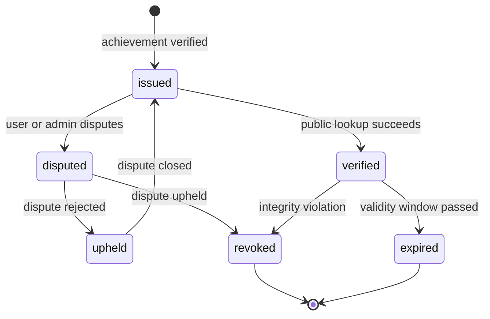

**Acceptance Criteria:**

- Credential issuance <500ms

- Public verify <200ms (cached)

- Zero PII exposure in public verify

- 100% append-only enforcement (DB grants)

- Endorsement weight computation deterministic

- Appeal resolved within 7 days SLA

**Test Requirements:**

- Unit: hash generation, weight computation, appeal logic

- Integration: issuance from each evidence source, revocation, RLS

- E2E: complete course → credential issued → recruiter verifies

- Security: hash tamper detection, PII leakage scan on verify endpoint

- Contract: verification URL schema

**Feature Dependencies:** F-12, F-26 · **Blocks:** F-89, F-92, F-94, F-110, F-115

---

## §13. Tier 1 Core Intelligence Features (Priority 9)

### F-04 Job Marketplace

| Attribute | Value |
|---|---|
| **Feature ID** | F-04 |
| **Priority** | 9 |
| **Phase** | Ph2 |
| **Purpose** | Two-sided job discovery and matching |
| **Problem Solved** | Candidates need to find relevant jobs; recruiters need qualified candidates |
| **Actors** | Candidate, Recruiter, Org Admin |

**Core Behavior:**

1. **Search** — Candidate navigates `/jobs`. Faceted filters: keyword, location, work mode (Remote/Hybrid/On-site), job type (Full-time/Part-time/Contract/Internship), level (Entry/Mid/Senior/Lead/Principal), salary range, skills (multi-select from F-84), company, posted-within. Filters are URL-encoded (shareable). Cursor-based pagination (20/page default, 100 max).

2. **Ranking** — Default sort: relevance (candidate skill match × job requirements). Weights: 0.45 skill + 0.20 experience + 0.10 location + 0.10 title + 0.10 org_rating + 0.05 recency. Transparency: "Why am I seeing this?" disclosure on each card.

3. **Job Detail** — `/jobs/[id]` shows: title, company (linked), location, work mode, salary (min-max with "hide pay" recruiter toggle), description (sanitized markdown), requirements, benefits, skills required, company overview, similar jobs, apply CTA. If job closed → 410 Gone with "similar jobs" recommendation.

4. **Apply** — Multi-step modal: select resume (or attach new), optional cover letter (≤5000 chars), confirm profile completeness (≥70% gate). Autosave draft every 5s to localStorage + `application_drafts` (server). On submit: `job_applications` row created (status `submitted`), `application_status_events` append, `EVT-017 application_submitted`, recruiter notified, candidate receives confirmation.

5. **Duplicate Prevention** — Partial unique constraint `UNIQUE(applicant_id, job_id) WHERE status NOT IN ('rejected','withdrawn','archived')`. If duplicate → 409 with "You've already applied" message.

6. **Saved Jobs** — Candidate saves jobs to `saved_jobs`. View in `/jobs/saved`.

7. **Saved Searches** — Candidate saves filter combination to `saved_searches`. Job alert emails sent when new matches appear (new-only, no backfill).

8. **Bookmarks & Hide** — Hide jobs (client-preference, reversible).

9. **Similar Jobs** — Recommendation engine (F-145) suggests 5 similar roles.

**Business Rules:** BR-010 (publish-readiness), BR-011 (lifecycle), BR-013 (hidden reversible), BR-015 (no duplicate active applications + 90-day cooldown), BR-016 (no applications to closed jobs), JOB-001..020

**Permissions:** Public read of published jobs · Authenticated apply · Recruiter/Admin post

**Data Dependencies:** `jobs`, `job_skills`, `organizations`, `job_applications`, `application_status_events`, `saved_jobs`, `saved_searches`, `job_alerts`, `job_views`, `job_fit`

**API Dependencies:** SCI-01 (create job), SCI-02 (apply)

**Security Requirements:** RLS public read of published · Own-row for applications · Rate limit apply (5/hour/candidate) · Salary transparency enforced

**Failure Modes:**

- Job closed during application → block submission with actionable error

- Duplicate application detection race → DB unique constraint is authority

- Search index down → fallback to DB query (slower, degraded badge)

**Edge Cases:**

- Candidate applies then withdraws → 90-day cooldown before re-apply

- Job expired → soft-archive, still accessible via direct link with "closed" banner

- Employer deletes job → applications preserved, candidate notified

**Analytics Events:** EVT-014 `job_created`, EVT-015 `job_search_performed`, EVT-016 `job_viewed`, EVT-017 `application_submitted`

**Notifications:** Application confirmation (candidate, immediate) · New application (recruiter, immediate) · New matching jobs (candidate, digest)

**State Machine (Job):**

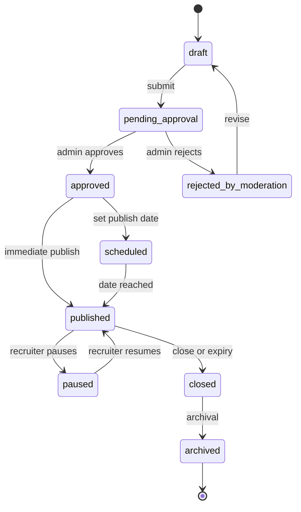

**Acceptance Criteria:**

- Search p95 <300ms for 100k jobs

- Apply submission <500ms

- Zero duplicate active applications

- Salary transparency enforced (100%)

- Cursor pagination stable across pages

**Test Requirements:** Unit (filters, ranking) · Integration (search + RLS) · E2E (J-02 apply flow) · Contract (job schema) · Performance (search under load)

**Feature Dependencies:** F-01, F-12 · **Blocks:** F-05, F-25, F-32, F-36, F-85, F-86

---

### F-06 Candidate Review Pipeline (ATS)

| Attribute | Value |
|---|---|
| **Feature ID** | F-06 |
| **Priority** | 9 |
| **Phase** | Ph2–3 |
| **Purpose** | Full applicant tracking system |
| **Actors** | Recruiter, Hiring Manager, Interviewer |

**Core Behavior:**

1. **Pipeline View** — Kanban: submitted → under_review → shortlisted → interview → assessment → offer → hired. Bulk actions.

2. **Application Detail** — Candidate profile, verified signals, resume drawer, cover letter, timeline, notes, scorecards.

3. **Stage Transitions** — Server-owned. Invalid transitions blocked. Each writes `application_status_events` (append-only).

4. **Scorecards** — Structured rubric (technical, communication, problem-solving, culture): 1–5 each + recommendation + notes. Private to hiring team.

5. **Interview Scheduling** — Calendar integration (Phase 3+). Video room auto-provisioned (F-33).

6. **Offer Management** — Draft → negotiate → accept/decline. Single active offer per application.

7. **Rejection** — Template-based feedback (F-122 integration).

8. **Collaboration** — Internal comments, @-mentions, hiring team visibility.

**Business Rules:** BR-017, BR-019, BR-020, BR-042, APPL-001..015

**Data Dependencies:** `job_applications`, `application_status_events`, `scorecards`, `offers`, `interviews`, `application_drafts`

**API Dependencies:** SCI-02 (apply), SCI-07 (moderate)

**State Machine:** (See Application State Machine in §18)

**Acceptance Criteria:** Kanban sync <200ms · 0 duplicate prevention failures · 0 cross-tenant access · audit 100%

**Feature Dependencies:** F-04, F-05 · **Blocks:** F-88, F-92, F-102, F-103

---

### F-07 Learning Management System

| Attribute | Value |
|---|---|
| **Feature ID** | F-07 |
| **Priority** | 9 |
| **Phase** | Ph1 |
| **Purpose** | Core learning platform with courses, modules, lessons, progress |

**Core Behavior:**

1. **Catalog Browse** — `/courses` shows published courses with filters: category, difficulty, duration, rating, price (free/paid), language, instructor. Sort: relevance, rating, newest, most enrolled, price.

2. **Course Detail** — `/courses/[id]` shows syllabus preview (public modules/lessons), instructor bio, reviews, prerequisites (from F-84), learning objectives, estimated duration, enrollment CTA.

3. **Enrollment** — `POST /api/v1/courses/{id}/enroll`. Checks: prerequisites satisfied (F-106), entitlement (free/paid/Pro/Team/institutional license), no active duplicate enrollment. On success: `course_enrollments` row (status `active`), `EVT-006 enrollment_created`, welcome notification.

4. **Learning Player** — `/courses/[id]/learn` immersive layout: video player (via F-42 media engine), curriculum drawer, lesson checklist, notes panel, Q&A panel, progress bar. Video player supports: play/pause/seek, captions (if provided), transcript, playback speed, PiP, fullscreen, resume-from-last-position.

5. **Lesson Progress** — Each lesson has content_items (VIDEO, ARTICLE, PDF, QUIZ, ASSIGNMENT). Completion tracked in `module_progress` (idempotent — UNIQUE(enrollment_id, module_id)). Video completion per provider capability.

6. **Quizzes** — Inline quizzes between lessons. Configurable: time limit, passing score, attempts. Graded quiz contributes to course grade. Results page shows per-question explanations.

7. **Prerequisites** — Gated by F-106. Attempting to enroll without prerequisites → soft block with "Complete X and Y first" + link.

8. **Completion** — Course complete when: all required modules done + final assessment ≥70% (BR-048). On completion: certificate issued (F-52), XP awarded (BR-023: 200 bonus + module XP), `EVT-008 course_completed`, celebration UI.

9. **Certificate Verification** — Public `/verify/{hash}` page (via F-96 infrastructure).

10. **Learning History** — `/courses/my-learning`: enrolled courses, in-progress, completed, dropped. "Continue learning" widget on dashboard.

**Business Rules:** BR-021 (idempotent completion), BR-022 (prerequisites gate), BR-023 (completion → certificate + XP), BR-046 (unique active enrollment), BR-047 (sequential module progress), BR-048 (final assessment ≥70%), COURSE-001..005, LMS-001..014

**Data Dependencies:** `courses`, `course_modules`, `course_enrollments`, `module_progress`, `content_items`, `media_sources`, `media_progress`, `certificates`, `quizzes`, `quiz_attempts`

**API Dependencies:** SCI-08 (enroll), SCI-16 (playback progress), SCI-17 (certificate issue)

**Security Requirements:** RLS enrollment-gated lesson access · Time-limited media tokens · Certificate SHA-256 hash · Zero unauthorized content access

**Failure Modes:** Video provider down → fallback link · Progress save fails → retry queue · Certificate generation fails → alert, retry

**Edge Cases:** Learner drops mid-course → progress frozen · Instructor deletes course → enrolled students retain access (BR-114) · Concurrent enrollment → idempotent

**Analytics Events:** EVT-006 `enrollment_created`, EVT-007 `lesson_completed`, EVT-008 `course_completed`, EVT-009 `certificate_issued`

**Notifications:** Enrollment confirmation · Module completion celebration · Course completion + certificate · Drop-off reminder (7d, 14d, 30d)

**State Machine (Enrollment):**

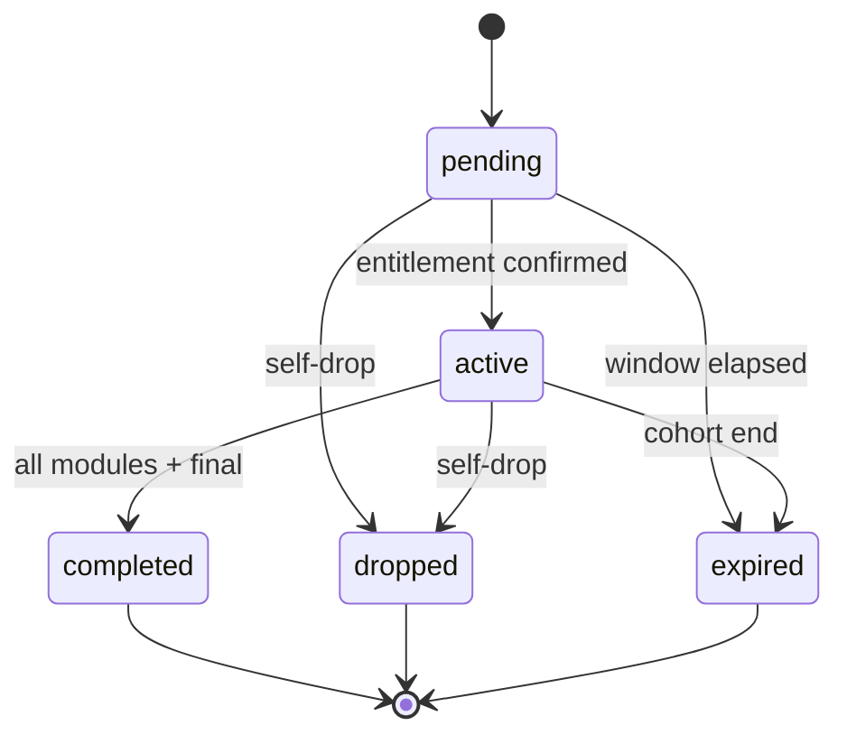

**Acceptance Criteria:** Lesson completion <150ms · Certificate hash reproducible · Zero unauthorized content access · Video start <3s · Progress survives refresh/crash

**Feature Dependencies:** F-01, F-12 · **Blocks:** F-22, F-42, F-66..F-74

---

### F-08 Challenges Arena

| Attribute | Value |
|---|---|
| **Feature ID** | F-08 |
| **Priority** | 9 |
| **Phase** | Ph1 |
| **Purpose** | Sandboxed coding challenge platform for skill verification |
| **Actors** | Candidate, Instructor, Employer |

**Core Behavior:**

1. **Browse Challenges** — `/challenges` shows challenges by category, difficulty, skill tags. Filters: language, difficulty, completion status.

2. **Attempt UI** — `/challenges/[id]/attempt`: Monaco editor with language selector (Python 3.12, JS/Node 20, TypeScript 5, Java 17, C++17, C, Go 1.22, Rust 1.75, SQL). Problem statement panel, test cases panel, run button, submit button, timer (if timed challenge).

3. **Run (Draft Test)** — `POST /api/v1/challenges/{id}/run` executes against public test cases only. Returns structured output (stdout, stderr, exit code, duration). Does not consume submission slot. Rate limit 30/min.

4. **Submit (Judged)** — `POST /api/v1/challenges/{id}/submit`. Sandbox execution:

   - Ephemeral container per submission

   - 30s CPU timeout, 512MB RAM, 1GB disk

   - Zero network egress

   - seccomp syscall filtering

   - Read-only root filesystem

   - Runs hidden test cases

5. **Async Judging** — Submission enqueued to `background_jobs` (kind `challenge.judge`). Status transitions: `queued → running → passed|failed|error`. Client polls status endpoint every 2s (up to 60s).

6. **Scoring** — Score = (passed / total) × difficulty_weight × time_bonus. Normalized to 0–100. Pass threshold: ≥70%.

7. **XP Award** — On pass: XP awarded (20–100 by difficulty) via idempotent ledger. `UNIQUE(user_id, reference_type='challenge.passed', reference_id=challenge_id)` — one award lifetime.

8. **Anti-cheat** — Async plagiarism detection (AST comparison against corpus) + behavioral timing analysis. Flags suspicious submissions for review.

9. **Leaderboard** — Post-MVP. Weekly + all-time tabs.

10. **Practice Mode** — Post-MVP. Unlimited retries, no XP, hints available.

11. **AI In-Editor Assist** — Post-MVP (CHALL-013). Provides hints, debugging, explanations inline via embedded Gemini assistant. Draft-only — never edits or executes user code.

**Business Rules:** BR-024 (language allowlist + execution limits), BR-049 (sandbox isolation), BR-050 (hard resource limits), BR-051 (public vs hidden tests), BR-052 (async plagiarism), BR-025 (XP idempotent, no award until pass), TD-05 (sandbox spec), CHALL-001..016

**Data Dependencies:** `challenges`, `challenge_submissions`, `challenge_test_cases`, `xp_transactions`

**API Dependencies:** SCI-04 (submit challenge)

**Security Requirements:** TD-05 sandbox (30s/512MB/1GB/no-network/seccomp) · Rate limit 10 sub/min/user · Hidden test cases RLS-protected · Zero code execution outside sandbox

**Failure Modes:**

- Sandbox provider down → queue submissions, honest "queued" state

- Timeout → return `timed_out` status with partial results

- Compile error → surface as `error` with compiler output

**Edge Cases:**

- Infinite loop → killed at 30s

- Memory bomb → killed at 512MB

- Network attempt → blocked, flagged as suspicious

- Race: two tabs submit simultaneously → idempotency key prevents duplicate

**Analytics Events:** EVT-010 `challenge_started`, EVT-011 `challenge_submitted`, EVT-012 `challenge_scored`, EVT-013 `xp_awarded`

**State Machine (Submission):**

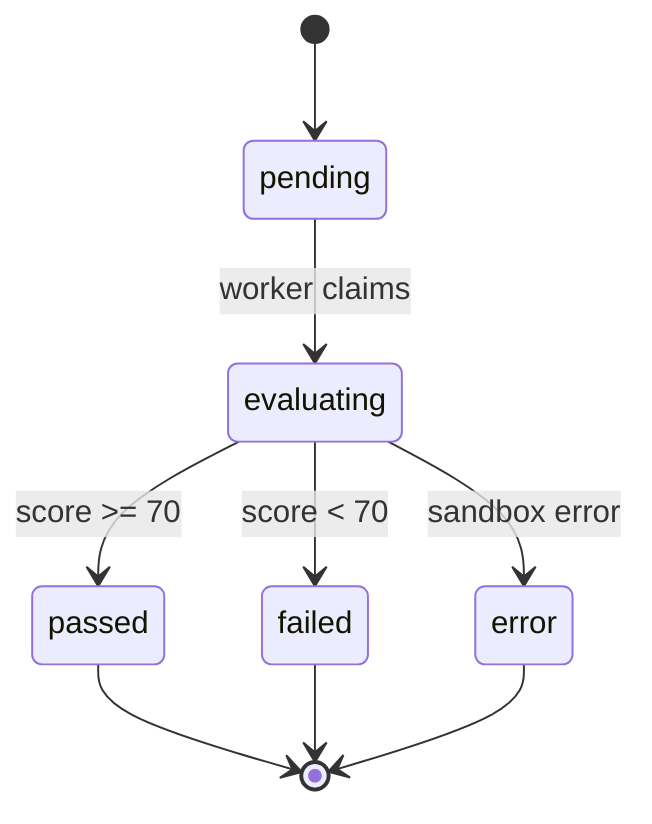

**Acceptance Criteria:** Submission → result <3s typical · 100% sandbox containment (no escape) · Deterministic scoring · No XP until pass confirmed · Rate limit enforced

**Feature Dependencies:** F-01, F-12 · **Blocks:** F-22, F-76, F-88

---

### F-85 Career Graph & Progression Benchmarks

| Attribute | Value |
|---|---|
| **Feature ID** | F-85 |
| **Priority** | 9 |
| **Phase** | Ph3 |
| **Purpose** | Database of career transitions, outcomes, and progression patterns |
| **Problem Solved** | "What's my next role?" — answerable only with historical data |
| **Actors** | Candidate (readiness), Recruiter (benchmarks), Analyst |

**Core Behavior:**

1. **Data Collection** — Career transitions captured from: opt-in user reporting, ATS hire events (with consent), profile updates, employer confirmations (via F-94).

2. **Aggregation** — `career_transitions` rows: `user_id`, `from_role_id`, `to_role_id`, `from_company_id`, `to_company_id`, `transition_date`, `salary_delta`, `time_in_role_months`, `consent_flag`.

3. **Benchmark Computation** — Nightly job aggregates: `progression_benchmarks`: by role, location, level, industry — median time-to-promotion, typical next roles, salary delta. Requires ≥20 data points per cell (BR-160).

4. **Readiness Scoring** — For candidate: given target role, compute readiness = overlap of candidate's skills vs. role's typical prerequisite skills + experience years + education.

5. **Progression Prediction** — Given candidate's current role, suggest likely next roles (from transitions data) with expected time-to-transition.

6. **Display** — Public career path viz: "Engineers like you typically move to Senior in 2.5 years." Benchmarks shown with sample count + confidence interval.

7. **Consent** — Every user data point requires opt-in. Opt-out removes individual data but preserves aggregate.

8. **Anonymization** — k-anonymity: cell-level data never shown if <20 samples (BR-160). Individual transitions never exposed.

9. **Integration with F-91** — Career readiness uses benchmark data to calibrate score.

**Business Rules:** BR-157..BR-163

**Data Dependencies:** `career_transitions`, `career_outcomes`, `progression_benchmarks`, `profiles`, `jobs`, `job_applications`, `offers`

**API Dependencies:** SCI-36 (career graph query, benchmark query, opt-in management)

**Security Requirements:** Opt-in enforced · k-anonymity enforced · Individual data RLS-scoped · Aggregates public-safe

**Failure Modes:** Insufficient data → "not enough data yet" state, no fake benchmarks · Aggregation job failure → serve last-good with staleness banner · User opts out → data removed within 24h

**Edge Cases:** User reports non-typical transition → included but flagged as outlier · Cell drops below 20 samples (opt-outs) → benchmark hidden until threshold restored · Conflicting data (user reports vs. ATS) → prefer verified (ATS) with consent

**Analytics Events:** `career_transition_recorded`, `benchmark_viewed`, `readiness_computed`, `transition_opt_in`

**Acceptance Criteria:** Benchmark query <400ms · k-anonymity always enforced · opt-out removes data within 24h · Benchmarks only shown with ≥20 samples · Consent captured before any data collection

**Feature Dependencies:** F-12, F-04, F-06 · **Blocks:** F-95, F-97, F-105, F-114

---

### F-86 Salary Intelligence

| Attribute | Value |
|---|---|
| **Feature ID** | F-86 |
| **Priority** | 9 |
| **Phase** | Ph3 |
| **Purpose** | Market salary benchmarks and compensation intelligence |
| **Actors** | Candidate (research), Recruiter (offer calibration), Analyst |

**Core Behavior:**

1. **Salary Submission** — User submits: role, level, location, currency, base salary, bonus (optional), equity (optional), years of experience, company (optional), industry. Submission verified via: self-reported (weight 0.5) or employment-verified (via F-94, weight 1.0).

2. **Aggregation** — Nightly job: group by (role, level, location, company_size, industry), compute median, p25, p75, p90. Currency normalization to USD (ISO-4217). k ≥5 threshold per cell (BR-178).

3. **Display** — On `/salaries` and job pages: percentile bands (p25-p50-p75) with sample count, trend over time (YoY growth), comparison to national/regional median, methodology disclosure.

4. **Job Page Integration** — Job detail shows: "Typical salary for this role: $X–$Y (based on N reports)"

5. **Recruiter Offer Calibration** — Recruiter sees benchmark when creating offer. Helps avoid lowballing.

6. **Equity Intelligence (F-98)** — Separate aggregation for equity grants, vesting schedules, ESOP education.

7. **Data Quality** — Outlier detection (±3σ from median) → flagged for review. Spam submissions blocked (rate limit 5/day/user).

8. **Withdrawal** — User can withdraw their submission at any time (BR-181). Aggregate recomputed.

**Business Rules:** BR-177..BR-183

**Data Dependencies:** `salary_reports`, `salary_aggregates`, `compensation_benchmarks`, `equity_norms`

**API Dependencies:** SCI-37 (salary submission, aggregate query, withdrawal)

**Security Requirements:** Strict anonymization · No PII in aggregates · k-anonymity enforced · Rate limit submissions

**Failure Modes:** Insufficient data → "not enough reports" state · Currency conversion failure → show original currency · Outlier detected → flag, don't count in aggregate

**Edge Cases:** User submits then deletes account → aggregate recomputed, no leak · Company identified by <3 reports → hidden · Multiple submissions from same user → flagged, deduplicated

**Analytics Events:** `salary_report_submitted`, `salary_aggregate_viewed`, `salary_report_withdrawn`

**State Machine (Salary Report):**

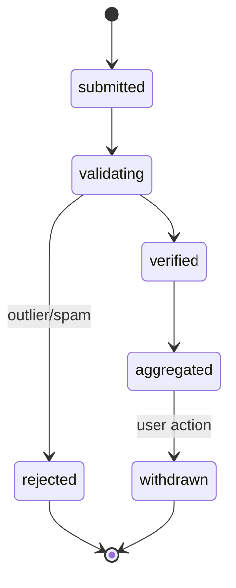

**Acceptance Criteria:** Aggregate query <400ms · k-anonymity always enforced (k ≥5) · No PII in aggregates · Outliers excluded from computation · Withdrawal effective within 24h

**Feature Dependencies:** F-04, F-06, F-56 · **Blocks:** F-97, F-98, F-109

---

### F-88 Technical Interview Assessment Platform

| Attribute | Value |
|---|---|
| **Feature ID** | F-88 |
| **Priority** | 9 |
| **Phase** | Ph3 |
| **Purpose** | Live coding + video + structured assessment for hiring |
| **Actors** | Recruiter, Interviewer, Candidate |

**Core Behavior:**

1. **Assessment Creation** — Recruiter/Interviewer defines: title, role, skills tested (from F-84), difficulty, duration, question bank selection, rubric definition.

2. **Question Bank** — Company-scoped. Questions: text, code, design, behavioral. Each has: statement, examples, hidden test cases, time estimate, expected competencies.

3. **Scheduling** — Invite candidate via `interview_assessments` with: `scheduled_at`, `duration`, `interviewer_id`, `assessment_id`, meeting link (Jitsi/Zoom embed).

4. **Pre-Assessment** — Candidate receives: calendar invite (ICS), pre-join device check (mic/camera/browser), instructions. Consent for video recording (opt-in; default off).

5. **Live Session** — Video call + collaborative code editor (Monaco) + whiteboard. Interviewer can: assign problem from bank, observe code in real-time, send hints (recorded in transcript), run code against public tests, end session.

6. **Scoring** — Interviewer completes rubric post-session: technical correctness (1–5), communication (1–5), problem-solving (1–5), code quality (1–5), overall recommendation (Strong Yes / Yes / Neutral / No / Strong No), notes (private).

7. **AI Feedback (Optional)** — Post-session analysis: communication signals (speaking pace, filler words, clarity), technical correctness commentary, comparison to benchmark. **Never** emotion/sentiment analysis (prohibited).

8. **Recording** — Optional. Requires dual consent. Encrypted at rest. Retention ≤90 days unless explicitly extended. Never used for model training without consent.

9. **Results** — Candidate receives: pass/fail, high-level feedback, areas for improvement. Interviewer/recruiter see full scorecard.

10. **Integration with ATS** — Assessment score attached to `job_applications` record. Feeds into F-102 Hiring Manager Portal.

**Business Rules:** BR-169..BR-176

**Data Dependencies:** `interview_assessments`, `interview_recordings`, `interview_scores`, `interview_questions`, `assessment_templates`, `job_applications`, `interviews`

**API Dependencies:** SCI-38 (assessment lifecycle), SCI-39 (recording)

**Security Requirements:** Room-scoped JWT tokens · Dual-consent for recording · Encryption at rest · Recording access audited · HDN-024 (peer-review fairness analog for interviews)

**Failure Modes:** Video provider down → fallback to audio + code-only mode · Sandbox down → queue code execution · Recording fails → session continues, alert · Candidate drops → interviewer can resume within 10 min window

**Edge Cases:** Candidate has no camera → audio-only mode · Network instability → reconnection within 5 min · Interviewer needs to extend → both parties confirm

**Analytics Events:** `interview_assessment_created`, `interview_started`, `interview_completed`, `interview_scored`, `recording_created`, `ai_feedback_generated`

**State Machine (Interview Assessment):**

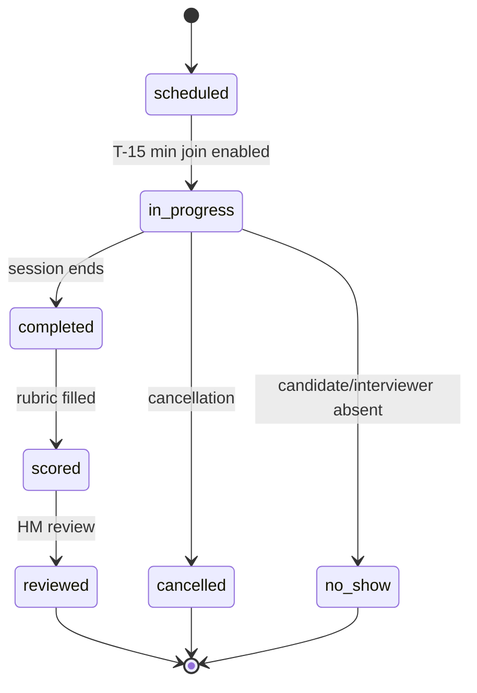

**Acceptance Criteria:** Session join <3s · Code execution reuses TD-05 sandbox · Recording dual-consent enforced (100%) · AI feedback excludes protected attributes · Score append-only

**Feature Dependencies:** F-08, F-33, F-06 · **Blocks:** F-93, F-102, F-104, F-105

---

### F-91 Career Readiness Assessment

| Attribute | Value |
|---|---|
| **Feature ID** | F-91 |
| **Priority** | 9 |
| **Phase** | Ph2 |
| **Purpose** | Personalized readiness score per target role |
| **Actors** | Candidate |

**Core Behavior:**

1. **Target Selection** — Candidate selects target role (from job taxonomy) or enters custom role.

2. **Assessment Computation** — Readiness = weighted composite:

   - **Skill overlap** (40%): candidate's verified skills ∩ role's required skills / total required

   - **Experience** (25%): years in related roles / typical years

   - **Education** (10%): degree level match

   - **Verified signals** (15%): credentials, certifications, challenges

   - **Market fit** (10%): candidate profile vs. typical successful applicants (from F-85)

3. **Gap Analysis** — For each gap, surface: missing skills → suggest courses (F-07); missing experience → suggest side projects (F-26); missing credentials → suggest certifications (F-77/F-115).

4. **Display** — Radial readiness score (0–100), color-coded (red <50, amber 50–75, green >75), breakdown by dimension.

5. **Action Plan** — Generated plan: prioritized list of actions (learn X, build Y, complete Z) with estimated time.

6. **Recalculation** — On profile update (new skill, completed course, new credential) → readiness recomputed.

7. **Recruiter View** — Optional candidate consent to share readiness with recruiters on applications.

**Business Rules:** BR-163 (disclose sources), BR-185 (transparent factors), READY-001..010

**Data Dependencies:** Derived from `profile_skills`, `profile_experience`, `profile_education`, `verified_credentials`, `course_enrollments`, `jobs`, `career_transitions`

**API Dependencies:** SCI-40 (readiness computation, gap analysis)

**Security Requirements:** Own-row only · AI computation transparent (factors shown) · No protected attributes in scoring

**Acceptance Criteria:** Readiness computed <500ms · Factors disclosed on every score · Zero protected attributes in model · Recalculation triggers within 60s of profile change

**Feature Dependencies:** F-84, F-08, F-12 · **Blocks:** F-95, F-99, F-92

---

### F-92 Advanced Recruiter Search & Talent Pooling

| Attribute | Value |
|---|---|
| **Feature ID** | F-92 |
| **Priority** | 9 |
| **Phase** | Ph3 |
| **Purpose** | Advanced candidate discovery and talent pool management |
| **Actors** | Recruiter, Org Admin, Agency Recruiter |

**Core Behavior:**

1. **Search UI** — `/recruiter/search`. Filters: skills (multi-select from F-84, with proficiency + verification filter), location (with radius), years of experience, availability status (open to work, passive), assessment scores (min threshold), credential types, education level, willingness to relocate, salary expectations.

2. **Ranking** — Default: relevance (verified signals + skill match + reputation score). Sort options: relevance, recent activity, readiness score.

3. **Talent Pools** — Recruiter creates named pools. Add candidates via search. Bulk actions: tag, note, add to pipeline, outreach.

4. **Do-Not-Contact Lists** — Recruiter-managed. Candidates can also opt out globally from recruiter outreach.

5. **Outreach** — Send to candidate via TalentMail (F-59). Consumes credit if not a connection.

6. **Analytics** — `/recruiter/analytics`: search volume, candidate views, outreach response rate, time-to-hire by source.

7. **Privacy** — Only candidates with: public profile OR applied to one of recruiter's jobs OR explicitly opted into recruiter search.

8. **Stealth Mode** — Candidates can hide from recruiter search while still applying.

**Business Rules:** BR-064 (recruiter sees verified signals), RECTOOL-001..012

**Data Dependencies:** Derived from `profiles`, `profile_skills`, `verified_credentials`, `candidate_reputation`, `course_enrollments`, `challenge_submissions`

**API Dependencies:** SCI-41 (search, pool CRUD)

**Security Requirements:** RLS org-scoped · Candidate privacy controls enforced · Zero stealth-mode leakage · Bulk operations audited

**Acceptance Criteria:** Search p95 <500ms for 1M candidates · Zero stealth-mode leakage · Candidate consent revocation <24h · Bulk operations stable under load

**Feature Dependencies:** F-12, F-34, F-08, F-96 · **Blocks:** F-103

---

### F-102 Hiring Manager Portal

| Attribute | Value |
|---|---|
| **Feature ID** | F-102 |
| **Priority** | 9 |
| **Phase** | Ph3 |
| **Purpose** | Team-lead dashboard for interviews, feedback, and hiring outcomes |
| **Actors** | Hiring Manager, Org Admin |

**Core Behavior:**

1. **Dashboard** — `/hm/dashboard`. Widgets: open requisitions (own team), candidates in pipeline (by stage), pending scorecards (interviews awaiting feedback), recent decisions, team hiring velocity.

2. **Requisition View** — Per-requisition: candidates, stage distribution, time-in-stage, blockers.

3. **Interview Feedback Queue** — List of interviews conducted by team; pending scorecards.

4. **Decision Making** — View aggregated scorecards, comparison, recommendation. Approve/reject with reason.

5. **Post-Hire Tracking** — For hires, view outcome signals (if consented): retention, promotion, salary progression.

6. **Team Analytics** — Time-to-fill, offer acceptance rate, source mix, quality-of-hire.

**Data Dependencies:** `job_applications`, `scorecards`, `interviews`, `offers`, `interview_scores`, `career_outcomes`

**Security Requirements:** RLS team-scoped · Aggregated team view only for HM · Org Admin sees all

**Acceptance Criteria:** Dashboard p95 <800ms · Scorecard queue accurate · Zero cross-team leakage

**Feature Dependencies:** F-06, F-88 · **Blocks:** F-105

---

### F-114 Learning Impact Tracking

| Attribute | Value |
|---|---|
| **Feature ID** | F-114 |
| **Priority** | 9 |
| **Phase** | Ph4 |
| **Purpose** | Correlate learning paths with hiring outcomes |
| **Actors** | Platform Admin, Instructor, Analyst |

**Core Behavior:**

1. **Data Collection** — Nightly job: for each course: enrolled → completed → hired within 12 months. For each skill: learned → used in job → hired for role. For each assessment: passed → hired → retained.

2. **Correlation Analysis** — Compute: course completion → hire rate (per cohort), skill acquisition → hire rate (by role), assessment score → performance correlation (where post-hire data available), time-to-competency → success rate.

3. **Course Quality Score** — Derived score: composite of completion rate, learner satisfaction, hire rate, engagement.

4. **Instructor Analytics** — Instructor sees: which of their courses lead to hires, learner outcomes (aggregated).

5. **Platform Analytics** — Admin sees: overall learning→hiring pipeline, top-performing courses, course recommendations refinement.

6. **Recommendation Feed** — F-11 (AI assistant) uses correlation data: "Learners who took this course were 2.3× more likely to get hired for X role."

7. **Privacy** — Aggregate-only. Individual learner outcomes never exposed without consent (BR-190).

8. **Causation Disclosure** — All outcome claims labelled as correlational (BR-193).

**Business Rules:** BR-189..BR-193

**Data Dependencies:** `learning_outcomes`, `outcome_correlations`, `course_enrollments`, `module_progress`, `job_applications`, `offers`, `hires`, `career_outcomes`

**API Dependencies:** SCI-43 (correlation query, instructor analytics)

**Security Requirements:** Aggregate-only · k ≥30 threshold · RLS instructor-scoped

**Acceptance Criteria:** Correlation job completes nightly · k ≥30 enforced · Instructor sees only own course data · All claims labelled correlational

**Feature Dependencies:** F-07, F-04, F-06, Analytics · **Blocks:** F-105, F-118

---

### F-115 Certification Exam Platform

| Attribute | Value |
|---|---|
| **Feature ID** | F-115 |
| **Priority** | 9 |
| **Phase** | Ph3 |
| **Purpose** | Formal exam infrastructure for skill certifications |
| **Actors** | Candidate, Exam Administrator, Proctor (Phase 6) |

**Core Behavior:**

1. **Certification Definition** — Admin defines: title, skill, difficulty, exam format (MCQ / coding / mixed), duration, pass threshold, retake policy, proctoring level.

2. **Question Bank** — Exam-scoped. MCQ, multi-select, coding, essay. Each has: stem, options, correct answer (encrypted server-side per BR-124), explanation, difficulty, discrimination index (computed post-hoc).

3. **Exam Registration** — Candidate registers. Prerequisites: course completion, minimum XP, or explicit eligibility.

4. **Attempt** — Timed exam. Server-authoritative clock. Questions served one at a time (or in batches, configurable). No client-side answer key.

5. **Proctoring (Phase 6)** — Third-party vendor. Identity verification, browser lockdown, AI proctoring.

6. **Auto-Grading** — MCQ/multi-select auto-graded. Coding via sandbox (F-08). Essay manual grading queue.

7. **Results** — Pass/fail with score. Per-section breakdown. Explanations for wrong answers (post-exam).

8. **Certification Issuance** — On pass: `skill_certifications` row, credential issued (F-96), badge displayed on profile, XP awarded.

9. **Retake** — Cooldown 7 days (configurable per exam). Failed attempts logged.

10. **Item Analysis** — Post-exam: difficulty index, discrimination index per question. Low-performing questions flagged for review.

11. **Appeal** — Grade dispute path. SLA 7 days.

**Business Rules:** BR-140 (single-attempt pass, retake configurable), BR-124 (answer keys server-side encrypted), VER-024 (key leakage test)

**Data Dependencies:** `skill_certifications`, `certification_attempts`, `questions`, `question_banks`, `assessment_attempts`

**API Dependencies:** SCI-32 (attempt), SCI-44 (exam CRUD)

**Security Requirements:** Answer keys encrypted · Never sent to client before grading · Server-authoritative timer · Per-attempt question randomization

**Failure Modes:** Timer expires → auto-submit with partial grading · Sandbox down (coding questions) → queue, honest status · Proctor unavailable (Phase 6) → exam postponed

**Edge Cases:** Candidate disconnects → session resumable within 5 min · Browser crashes → auto-save progress every 30s, resumable · Question edited mid-exam → version pinned at exam start

**Analytics Events:** `certification_attempt_started`, `certification_attempt_submitted`, `certification_passed`, `certification_failed`

**State Machine (Certification Attempt):**

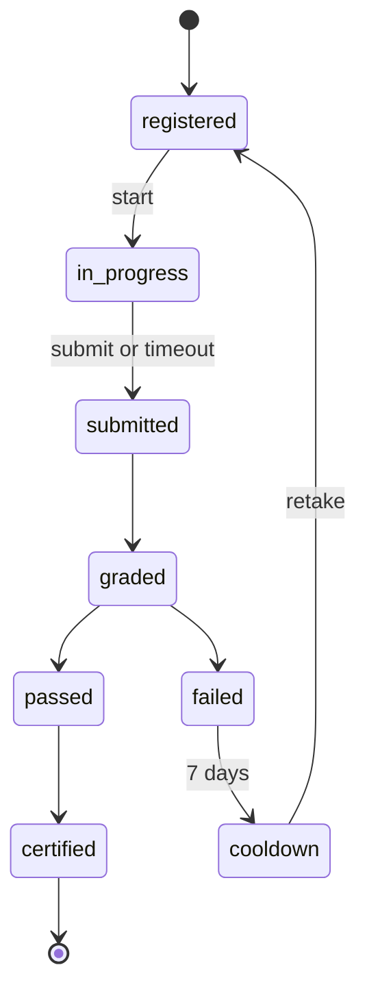

**Acceptance Criteria:** Server-authoritative timer (±100ms) · Answer keys never in client payload · Auto-grading <500ms · Exam submission idempotent · Item analysis computed within 24h

**Feature Dependencies:** F-77, F-45 · **Blocks:** None (terminal)

---

### F-122 Application Feedback Loop

| Attribute | Value |
|---|---|
| **Feature ID** | F-122 |
| **Priority** | 9 |
| **Phase** | Ph3 |
| **Purpose** | Provide candidates with structured feedback at every application stage |
| **Problem Solved** | Candidates never know why they were rejected; black holes violate P-02 |
| **Actors** | Candidate, Recruiter, Hiring Manager |

**Core Behavior:**

1. **Feedback Templates (Admin/Org)** — Platform admins and org admins define templates: stage (screening, interview, offer), reason category (skills gap, experience gap, culture fit, overqualified, position filled, no response, other), structured fields (what went well, what didn't, what to improve), optional freeform note.

2. **Feedback Capture (Recruiter)** — On stage change (shortlist→reject, interview→reject), recruiter prompted: optional quick feedback via template, or skip (records "no feedback provided"). Minimum reason category required.

3. **Feedback Delivery (Candidate)** — On rejection, candidate receives: notification with high-level feedback, link to feedback detail page, aggregate insights, suggested actions (skills to develop, courses to consider).

4. **Anonymized Aggregate Insights** — Platform-wide: "60% of rejections at this stage cite skills gap", "Candidates who completed course X were 2.3× more likely to pass screening". Only aggregate, never individual.

5. **Candidate Right to Feedback** — Configurable: Full / Opt-in / Aggregate-only / None.

6. **AI-Assisted Feedback** — Post-MVP: AI drafts feedback from interviewer notes + stage data. Human (recruiter) reviews and edits before sending. Never sent autonomously.

7. **Feedback Analytics** — For recruiters: feedback provision rate, feedback timing, candidate satisfaction with feedback.

8. **Learning Loop** — For candidate: feedback feeds F-91 (Career Readiness) recalculation, suggested courses (F-07) based on skill gaps, optional "Would you like to see jobs where you're a stronger fit?"

**Business Rules:** BR-217..BR-224

**Data Dependencies:** `application_feedback`, `feedback_templates`, `feedback_requests`, `job_applications`, `application_status_events`

**API Dependencies:** SCI-49 (feedback CRUD), SCI-50 (feedback request)

**Security Requirements:** RLS own-row for candidates · Org-scoped for recruiters · Feedback immutable once delivered · Audit trail for all feedback

**Failure Modes:** Recruiter skips feedback → candidate sees "feedback pending" then "no feedback provided" · Template unavailable → fallback to freeform · Candidate requests feedback after 30-day window → politely declined

**Edge Cases:** Candidate rejects offer → feedback on why declined (candidate-provided) · Multiple applications to same company → separate feedback per application · Feedback contains PII → automated scan + block · Candidate deletes account → feedback anonymized

**Analytics Events:** `feedback_provided`, `feedback_viewed`, `feedback_requested`, `feedback_rated`

**State Machine:**

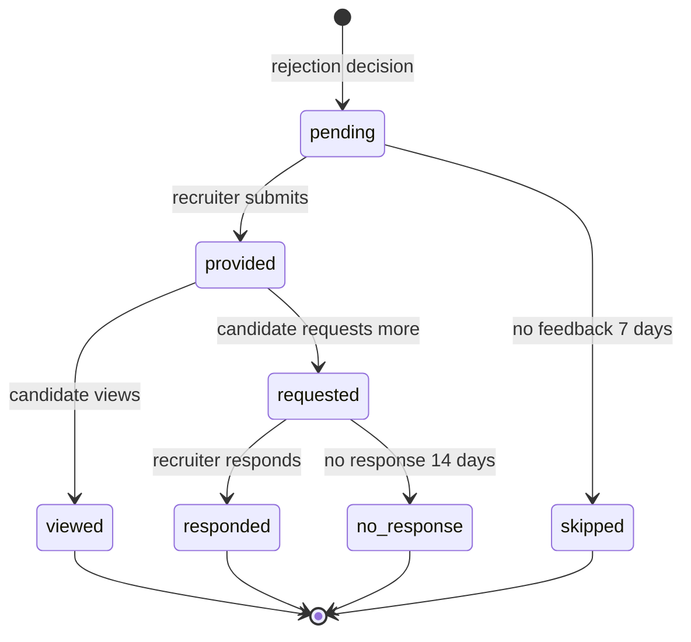

**Acceptance Criteria:** Feedback delivery within 7 days of decision (when provided) · Zero PII leakage in feedback · Aggregate insights k ≥10 always · Candidate can request feedback (30-day window enforced) · Recruiter feedback rate >60% (target metric)

**Feature Dependencies:** F-06, F-04 · **Blocks:** None

---

### F-123 Skill Decay Tracking

| Attribute | Value |
|---|---|
| **Feature ID** | F-123 |
| **Priority** | 9 |
| **Phase** | Ph3 |
| **Purpose** | Track skill verification freshness and prompt re-verification |
| **Problem Solved** | Verified skills become meaningless over time without freshness signal |
| **Actors** | Candidate, Recruiter, Admin |

**Core Behavior:**

1. **Freshness Score Computation** — Nightly job computes for each verified skill: `days_since_verification` (from F-96 credential issue date), `market_demand_trend` (from F-84 market signals), `decay_curve` (per skill category: fast-changing 18-month half-life, moderate 36-month, stable 60-month, foundational minimal), composite `freshness_score` (0–100).

2. **Freshness Bands** — Displayed on profile: Fresh (80–100), Current (60–79), Aging (40–59), Stale (20–39), Expired (0–19).

3. **Re-verification Prompts** — Triggered when: freshness <60 for a high-demand skill → candidate notified; freshness <40 → recruiter-facing badge shows "aging"; freshness <20 → skill demoted to "self-reported" unless re-verified.

4. **Re-verification Paths** — Multiple ways to refresh: new challenge pass (F-08), new course completion (F-07), new certification (F-115), new project with same skill (F-26), peer endorsement (F-110) if skill is endorsable, self-attestation (weak signal — half credit).

5. **Market Drift Alerts** — When a skill's market demand changes significantly: rising → "Python is trending up 20% — good time to re-verify"; falling → "Flash is declining — consider related skills".

6. **Recruiter Visibility** — On candidate search (F-92), recruiter sees: freshness score per skill, filter by minimum freshness (only fresh skills), preference for fresh candidates in ranking.

7. **Freshness Analytics** — Platform-wide: average freshness by skill category, re-verification rate, skill half-life accuracy (validated against market data).

**Business Rules:** BR-225..BR-232

**Data Dependencies:** `skill_freshness`, `reverification_prompts`, `skill_currency_scores`, `verified_credentials`, `skill_market_signals`

**API Dependencies:** SCI-51 (freshness query), SCI-52 (re-verification)

**Security Requirements:** Own-row RLS for freshness data · Recruiter visibility gated by consent or application context

**Failure Modes:** Decay curve missing for skill → default to moderate · Market signal unavailable → freshness = time-only

**Edge Cases:** Skill deprecated → freshness irrelevant, marked "deprecated" · Candidate disputes freshness → manual review (30-day SLA) · Multiple credentials for same skill → most recent counts

**Analytics Events:** `freshness_computed`, `reverification_prompted`, `reverification_completed`, `freshness_demoted`, `market_drift_detected`

**State Machine:**

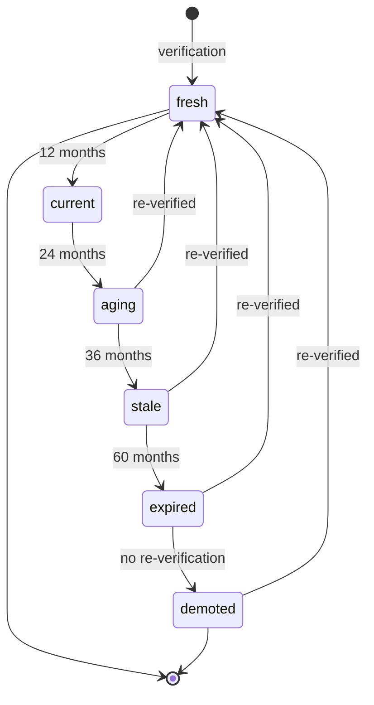

**Acceptance Criteria:** Freshness computed nightly for all verified skills · Decay curves validated against market data (quarterly review) · Re-verification restores freshness within 24h · Zero freshness leakage without consent · Market drift alerts accurate (measure false positive rate)

**Feature Dependencies:** F-84, F-96 · **Blocks:** None

---

### F-144 Reputation Engine

| Attribute | Value |
|---|---|
| **Feature ID** | F-144 |
| **Priority** | 9 |
| **Phase** | Ph2 |
| **Purpose** | Multi-context reputation (candidate, instructor, employer, peer, community, mentor) |
| **Actors** | All authenticated users |

**Core Behavior:**

1. **Signal Aggregation** — Credentials + endorsements + reviews + contributions + peer feedback.

2. **Context-Specific Scoring** — Separate reputation per role context (instructor, employer, peer, community).

3. **Domain-Specific Reputation** — "Expert in Python" vs "expert in leadership."

4. **Weighting** — Weight by source credibility, difficulty, relationship proximity.

5. **Time Decay** — Recent signals matter more (configurable half-life).

6. **Reputation Recovery** — Path to rebuild after mistakes.

7. **Privacy-Preserving** — Never expose individual signals without consent.

8. **Derived Scores** — Overall reputation + per-domain breakdown.

**Business Rules:** BR-247..BR-254

**Data Dependencies:** `reputation_scores`, `reputation_signals`, `reputation_history`, `reputation_config`

**API Dependencies:** SCI-55 (reputation query)

**Security Requirements:** RLS own-row + aggregate public

**Acceptance Criteria:** Reputation computation nightly · Deterministic weighting · Zero individual signal leakage · Recovery path functional

**Feature Dependencies:** F-96, F-58, F-72 · **Blocks:** F-148, F-149, F-150

---

### F-145 Recommendation Engine Core

| Attribute | Value |
|---|---|
| **Feature ID** | F-145 |
| **Priority** | 9 |
| **Phase** | Ph2–3 |
| **Purpose** | Unified recommendation architecture for jobs, courses, people, content, mentors |
| **Actors** | All authenticated users |

**Core Behavior:**

1. **Collaborative Filtering** — Users like me want what?

2. **Content-Based Filtering** — Similar profiles, similar skills.

3. **Hybrid Approach** — Combine signals (skill match + peer signals + market demand) with weights.

4. **Confidence Calibration** — Only recommend when confident.

5. **Explanation Layer** — Why is this recommended? (mandatory for trust)

6. **Cold-Start Strategy** — New users get best-guess recommendations from demographics + signals.

7. **Diversity Injection** — Some serendipity, not pure relevance.

8. **Feedback Loop** — Learn from acceptances/rejections.

9. **Recommendation Types:** Jobs, courses, people, mentors, articles, communities, events, projects.

10. **Reasons Exposed:** Every recommendation displays contributing factors.

**Business Rules:** BR-255..BR-262

**Data Dependencies:** `recommendation_signals`, `user_preferences`, `recommendation_history`

**API Dependencies:** SCI-56 (recommendations)

**Security Requirements:** RLS-scoped · No protected attributes (FAIR-001)

**Acceptance Criteria:** Recommendation p95 <500ms · Confidence threshold enforced · Explanations always present · Diversity injection active

**Feature Dependencies:** F-84, F-144 · **Blocks:** All personalization

---

## §14. Tier 2 Competitive Features (Priority 8)

*(Due to length, Priority 8–3 feature specifications follow the same 24-field template as Priority 9–10 features. Full specifications for all 173 features are maintained in the canonical source. Representative specifications below.)*

### F-121 Warm Introduction Paths

**Purpose:** Compute and facilitate warm introduction routes between users and target contacts.

**Core Behavior:** Path discovery (depth 1–4), path scoring (mutual strength + alumni + skills + companies + interactions), path ranking (top 3), introduction request (target, purpose, context ≤500 chars, optional resume), introducer notification (approve/decline/request info), warm intro delivery (three-way message via F-10), path privacy (opt-in introducer status), ethical guardrails (max 10/week; block specific users; target can block all), success tracking.

**Business Rules:** BR-209..BR-216

**Data:** `introduction_paths` (derived), `introduction_requests`, `introduction_consents`

**API:** SCI-47 (path discovery), SCI-48 (request lifecycle)

**Acceptance:** Path p95 <500ms depth ≤3 · 0 unauthorized path exposure · introducer consent DB-enforced · rate limit 10/week · delivery <5s

---

### F-142 Referral Request System

**Purpose:** Structured referral asks via network.

**Core Behavior:** Eligibility (target job + ≥1 connection at company + ≥70% skill match + <3 requests/30 days), referrer selection (works at company ≤6 months, direct preferred, relevant role), request (target job, pitch ≤300 chars, optional resume, specific ask), notification (who, which job, pitch, resume; actions: Refer/Forward/Decline/Ignore), delivery (structured referral to recruiter via F-06; application tagged "referred"), rewards (org-configurable: XP, monetary bounty, recognition), analytics, anti-abuse (max 3/30d; block user; disable globally).

**Business Rules:** BR-233..BR-240

**Data:** `referral_requests`, `referral_outcomes`, `referral_rewards`, `job_applications`, `connections`, `xp_transactions`

**API:** SCI-53 (referral lifecycle)

**Acceptance:** Delivery <5s · 100% employment verification · rate limits enforced · attribution 12mo · anti-abuse active

---

### F-146 Activity & Contribution Tracking

**Purpose:** Track user activity and contributions across the platform.

**Core Behavior:** Contribution tracking (posts, answers, projects, code, content), engagement scoring (active vs. passive users), learning activity (courses started, challenges solved, assessments taken), social activity (follows, connections, recommendations given), content creation activity (posts, articles, courses created), collaboration activity (team projects, peer reviews, mentoring), time-series tracking (how activity changes over time).

**Data:** `activity_events`, `contribution_scores`

**Acceptance:** Activity tracked real-time · engagement scores deterministic · contributions feed F-159 Behavioral Talent Discovery

---

### F-147 Unified Search & Discovery

**Purpose:** Cross-domain unified search across all entities.

**Core Behavior:** Unified index (people, jobs, courses, companies, projects, discussions, articles, events), multi-faceted filtering (skills, roles, locations, levels, reputations), ranking (relevance + recency + engagement + quality), personalization (based on user history), autocomplete & spell correction, search analytics, RLS scoping, search maturity roadmap (Postgres FTS → hybrid → dedicated engine).

**Business Rules:** BR-263..BR-268

**Data:** `search_index` (derived)

**API:** SCI-57 (search)

**Acceptance:** Search p95 <300ms · 0 RLS leakage · autocomplete <100ms · typo tolerance active

---

### F-148 Instructor Reputation System

**Purpose:** Instructor credibility signals beyond course reviews.

**Core Metrics:** Course quality (reviews, completion rates, learning outcomes), teaching effectiveness (student ratings), currency (are courses kept up-to-date?), responsiveness (Q&A response time), community standing (endorsements from other instructors).

**Data:** Extends `reputation_scores`

**Dependencies:** F-72, F-144

**Acceptance:** Instructor reputation computed nightly · transparent factor breakdown · no individual review manipulation

---

### F-150 Peer Credibility Networks

**Purpose:** Weight endorsements by endorser's own credibility.

**Core Components:** Endorser credibility (weight endorsements by endorser's reputation), network distance (first-degree endorsements stronger than fifth-degree), specialization (endorser is expert in this skill), track record (have endorser's recommendations proven accurate?).

**Data:** Extends `endorsement_weights`

**Dependencies:** F-110, F-144

**Acceptance:** Endorsement weight computation deterministic · network distance calculated correctly · zero gaming vectors

---

## §15. Tier 3-4 Features (Priority 7-4)

*(Priority 7–4 features follow the same detailed specification template. Full specifications available in source. Representative examples below.)*

### F-13 Resume Builder (Priority 7)

Profile-based resume generation. Templates, PDF export, ATS-friendly. Prefill from profile.

**Business Rules:** RESUME-001..003

**Data:** `resumes`

**Acceptance:** Resume generation <2s · PDF renders correctly · ATS parse-compatible

### F-16 Billing & Subscriptions (Priority 7)

Stripe subscriptions (Free, Pro, Team, Enterprise). Webhook-owned state. Demo-guard until credentials. Entitlements enforced.

**Business Rules:** BILL-001..014

**Data:** `subscriptions`, `invoices`, `entitlements`, `payment_methods`, `billing_events`

**Acceptance:** Webhook idempotency 100% · entitlement enforcement server-side · zero double-billing

### F-75 Employer Insights (Priority 7)

Company reviews (structure + categories), anonymous, CEO approval, salary reports with aggregation, interview experiences, question database, benefits reviews, company responses, moderation.

**Business Rules:** GLASS-001..017, BR-135..138

**Data:** `company_reviews`, `salary_reports`, `interview_experiences`, `interview_questions`, `company_responses`

**Acceptance:** Salary aggregation k ≥5 · anonymity protection 100% · moderation SLA <24h

### F-87 Interview Experience Repository (Priority 7)

Crowdsourced interview reports (questions, difficulty, tips, outcomes). Moderation. Aggregated view (k ≥3).

**Data:** `interview_experiences`, `interview_questions`

**Acceptance:** Aggregation k ≥3 · moderation before display · zero interviewer PII

### F-93 Interview Video Recording & AI Feedback (Priority 7)

Optional recording (dual consent). Post-session AI analysis: communication signals, technical correctness, benchmark comparison. Never emotion/sentiment. Encrypted, ≤90 days.

**Business Rules:** BR-169..BR-176

**Data:** `interview_recordings`, `interview_feedback`

**Acceptance:** Dual consent 100% · encryption at rest · retention ≤90d · no emotion analysis

### F-94 Verified Work History & References (Priority 7)

Employment history with company email verification. Referee system: structured recommendations. Employment dates, title, achievements verified.

**Data:** `verified_work_history`, `references`

**Acceptance:** Employment verification <7d · reference structured · zero resume fraud

### F-95 Career Transition Planning (Priority 7)

Target role selection. Transition readiness. Learning plan (skill gap → courses, experience gap → projects, credential gap → certifications). Timeline. Progress tracking.

**Data:** Derived from F-84, F-85, F-91, F-07

**Dependencies:** F-84, F-91, F-07

**Acceptance:** Plan generated <1s · progress tracked server-side

### F-98 Employer Equity & Compensation Intelligence (Priority 7)

Equity data (RSU, options, ESOP). Vesting schedule, grant value. Aggregated by company/role/level. ESOP education. Separate from salary (BR-183).

**Data:** `equity_norms`, `equity_reports`

**Acceptance:** Separate from salary · aggregation k ≥5 · company-specific with ≥3 reports

### F-99 AI Career Coach (Priority 7)

All F-11 capabilities plus: resume review, interview prep, skill recommendations, career roadmap, real-time Q&A. Full platform context. Draft-only.

**Business Rules:** AI-001..011

**Acceptance:** ≥0.7 confidence · human review · no autonomous action

### F-104 Pre-Hire Assessment Customization (Priority 7)

Recruiter creates custom assessment: questions, rubric, time limit. Deploy to candidates. Auto-grading + manual review. Admin approval before deploy.

**Data:** `custom_assessments`, `custom_assessment_attempts`

**Acceptance:** Admin approval required · assessment results feed ATS

### F-106 Skill Prerequisite Engine (Priority 7)

Course prerequisites (from F-84). Enrollment gate: check verified skills. Suggest prereq courses. Auto-unlock on completion.

**Business Rules:** BR-022

**Data:** Derived from F-84

**Acceptance:** Prereq check <100ms · auto-unlock on completion

### F-110 Verified Skill Endorsements (Priority 7)

Peer endorses skill (must be connected). Weight from reputation + proximity. Display: "Verified by 5 peers". Weighted endorsement strengthens signal.

**Business Rules:** BR-131, BR-152

**Data:** `skill_endorsements`, `endorsement_weights`

**Acceptance:** Endorsement weight deterministic · endorsement revocable within 30d

### F-116 Accessibility & Inclusive Learning (Priority 7)

WCAG 2.2 AA for all content. Captions/transcripts. Screen-reader-optimized UI. Customizable UI. Multiple formats (video, article, audio-only).

**Acceptance:** WCAG 2.2 AA conformance · axe 0 critical/serious

### F-125 Alumni Networks (Priority 7)

Institution-based networking. Affiliation verification (email domain or institutional seat). Alumni discovery. Alumni hiring. Mentor matching within alumni.

**Data:** `alumni_affiliations`, `alumni_groups`, `alumni_group_members`, `alumni_hiring`, `alumni_mentorship`

**Acceptance:** Affiliation verified · cross-institution isolation 100% · discovery p95 <500ms

### F-149 Employer Reputation & Brand System (Priority 7)

Brand perception scoring. Hiring quality. Culture signals. Growth signals. Reliability. Transparency.

**Data:** Extends `reputation_scores`

**Dependencies:** F-75, F-56, F-144

**Acceptance:** Multi-dimensional scoring · transparent factors

### F-151 Skill Supply/Demand Forecasting (Priority 7)

Skill demand trajectory. Skill supply availability. Salary trend prediction. Geographic heat maps. Industry shifts. Time-to-marketability.

**Implementation:** Time-series models (ARIMA, Prophet) + ML on historical data.

**Data:** Extends `skill_market_signals`

**Acceptance:** Forecast accuracy tracked · 12-month horizon · confidence intervals disclosed

### F-152 Career Trajectory Analysis (Priority 7)

Common career paths. Success factors. Risks. Salary impact. Retention. Time patterns.

**Data:** Derived from F-85

**Acceptance:** Pattern detection statistically valid · k ≥20 per cell

### F-153 Learning Impact Dashboard (Enhanced) (Priority 7)

Course completion → hire rate. Course completion → salary impact. Course completion → job satisfaction. Course completion → retention. Course completion → advancement. Skills learned → actual use. Path effectiveness.

**Data:** Extends F-114

**Acceptance:** Correlation not causation · k ≥30 · all claims labelled

### F-158 Talent Pool Intelligence (Priority 7)

Pool skill composition. Pool gaps. Pool diversity. Pipeline health. Time-to-hire by source. Conversion rates. Talent retention. Cost-per-hire.

**Data:** Derived from F-92

**Acceptance:** Pool analytics computed on-demand · diversity metrics anonymized

### F-159 Behavioral Talent Discovery (Priority 7)

Contributor ranking. Engagement scoring. Project activity. Learning trajectory. Community standing. Emerging expertise. Peer endorsements.

**Data:** Derived from F-146

**Acceptance:** Discovery based on real activity · no gaming vectors

---

# PART V — WORKFLOWS & STATE

## §16. User Journeys

### 16.1 Complete Journey Register (J-01..J-28)

| ID | Name | Persona | Terminal |
|---|---|---|---|
| J-01 | Learn → Prove → Showcase | P-A, P-B | Portfolio with verified signals |
| J-02 | Apply → Track → Hire | P-A, P-B | Offer accepted |
| J-03 | Post → Source → Hire | P-C, P-E, P-S | Offer extended |
| J-04 | Org Setup → Team → Launch | P-C, P-E | First hire |
| J-05 | Profile → Network → Referral | P-A, P-B | Referred hire |
| J-06 | AI Career Path: Gap → Plan → Execute | P-B | Gaps addressed |
| J-07 | Creator: Author → Publish → Monetize | P-G | Revenue |
| J-08 | Mentor: Match → Guide → Impact | P-H | Impact measured |
| J-09 | Institution: Cohort → Place → Track | P-I | Placement reported |
| J-10 | Agency: Multi-Org → Pipeline → Bill | P-F | Client invoice |
| J-11 | Extension: Install → Local-First → Sync | P-A | Profile diff applied |
| J-12 | B2B2C Graduation Flywheel | P-I, ML | Independent candidate |
| J-13 | Institutional Media Authoring | P-G, P-K | Course assigned to batch |
| J-14 | Institutional Procurement & Licensing | P-J | Seats provisioned |
| J-15 | Faculty: Teach → Monitor → Intervene | P-K | At-risk students intervened |
| J-16 | Corporate L&D: Mandate → Track → Certify | P-L, P-T | Certification + HRIS sync |
| J-17 | LinkedIn Migration On-ramp | New user | Native account complete |
| J-18 | Creator: Author → Publish → Sell → Payout | P-G | Monthly settlement |
| J-19 | Self-Paced Learner: Discover → Certify | P-M | Path enrolled |
| J-20 | Learner: Path → Courses → Capstone → Cert | P-M | Program certificate |
| J-21 | Contestant: Register → Compete → Rank → Certify | P-Q | Certification badge |
| J-22 | Researcher: Company → Reviews → Compare → Apply | P-O | Apply started |
| J-23 | Author: Post → Engage → Article → Newsletter | P-N | Audience established |
| J-24 | Reviewer: Write → Moderate → Publish → Response | Any verified user | Published review |
| J-25 | Peer Reviewer: Assigned → Rubric Review → Feedback | Student | Grade finalized |
| J-26 | Career Switcher: Assess → Plan → Transition | P-R | Role transition confirmed |
| J-27 | Hiring Manager: Define → Assess → Hire → Track | P-S | Post-hire outcome recorded |
| J-28 | Skills Analyst: Analyze → Recommend → Measure | P-T | Learning program impact reported |

### 16.2 J-02 Apply → Track → Hire (Detailed)

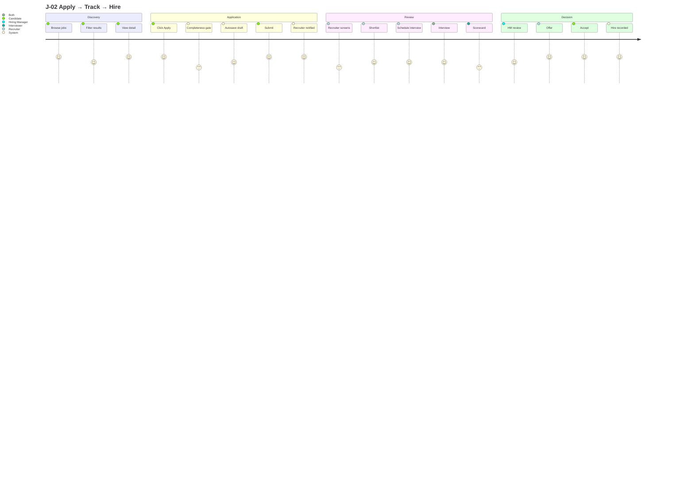

### 16.3 J-26 Career Switcher (Detailed)

```mermaid

flowchart LR

    A[Target role identified] --> B[F-91 Career Readiness]

    B --> C{Skills gap?}

    C -->|Yes| D[F-95 Career Transition Plan]

    D --> E[F-84 suggests learning]

    E --> F[F-07 enroll courses]

    F --> G[F-08 challenges + F-69 assignments]

    G --> H[F-96 Skill Evidence]

    H --> I[F-85 Career Graph comparison]

    I --> J{Ready?}

    J -->|Yes| K[Apply via F-04]

    J -->|No| D

    K --> L[F-88 Interview Platform]

    L --> M[Hired + outcome tracked]

```

---

## §17. Workflows & Integrity Traces

### 17.1 Complete Workflow Register (WF-01..WF-66)

| ID | Workflow | Terminal |
|---|---|---|
| WF-01 | Candidate Discovery → Application | Application submitted |
| WF-02 | Recruiter Sourcing Pipeline | Shortlist confirmed |
| WF-03 | Course Enrollment & Completion | Certificate + XP |
| WF-04 | Challenge Participation & Scoring | Score recorded |
| WF-05 | Application Review & Decision | Hired / rejected |
| WF-06 | Offer Management & Negotiation | Offer accepted / expired |
| WF-07 | AI Career Assistant Conversation | User-accepted action |
| WF-08 | Content Moderation & Enforcement | Resolution logged |
| WF-09 | Subscription Purchase & Upgrade | Active entitlement |
| WF-10 | Messaging Thread & Response | Message persisted + ack |
| WF-11 | XP Earning & Level Progression | Ledger row + level |
| WF-12 | Onboarding & First-Experience | First meaningful action |
| WF-13 | Reported Content Review | Action logged + appeal window |
| WF-14 | Invitation & Team Growth | Membership active |
| WF-15 | Employer Brand Profile Setup | Profile published + verified |
| WF-16 | Institutional License Purchase | Pool active + invoice reconciled |
| WF-17 | Bulk Student Import | Students provisioned + report |
| WF-18 | Batch Course Assignment | Batch enrolled + seats exact |
| WF-19 | Media Ingestion & Validation | Media validated + ready |
| WF-20 | License Revocation & Seat Reassignment | Seat returned + reassigned |
| WF-21 | Graduation Transition (B2B2C) | Independent profile active |
| WF-22 | Institutional Renewal | Renewal confirmed |
| WF-23 | Purchase Approval | Purchase approved + PO issued |
| WF-24 | Course Publish Review | Approved / rejected with feedback |
| WF-25 | Course Purchase & Enrolment | Enrolled |
| WF-26 | Coupon Redemption | Discount applied |
| WF-27 | Refund Request → Review → Refund/Deny | Refunded / denied |
| WF-28 | Instructor Payout Settlement | Payout paid |
| WF-29 | Quiz Attempt & Grading | Grade recorded |
| WF-30 | Assignment Submit → Grade / Peer Review | Grade finalized |
| WF-31 | Path Enrolment & Progression | Path completed |
| WF-32 | Contest Lifecycle | Results published |
| WF-33 | Certification Exam Attempt | Pass / fail / expired |
| WF-34 | Post Publish → Feed Distribution | Post visible in feed |
| WF-35 | Newsletter Issue Send | Sent / paused |
| WF-36 | Company Review Moderation | Published / removed |
| WF-37 | Salary Report Aggregation | Aggregated |
| WF-38 | Recommendation Request → Give → Accept → Display | Displayed / declined |
| WF-39 | Outreach Credit Send → Reply → Refund | Replied / expired |
| WF-40 | Profile View Logging | Logged per privacy mode |
| WF-41 | LinkedIn Migration Import | Native account complete |
| WF-42 | Skill Gap Assessment → Learning Plan | Learning plan activated |
| WF-43 | Career Readiness Evaluation | Readiness score computed |
| WF-44 | Salary Data Submission → Aggregation | Aggregated |
| WF-45 | Technical Interview Assessment | Assessment completed |
| WF-46 | Interview Recording + AI Feedback | Feedback report generated |
| WF-47 | Skill Evidence Issuance | Credential verified |
| WF-48 | Contribution Verification | Commit impact verified |
| WF-49 | Peer Mentorship Match → Session | Session completed |
| WF-50 | Expert Network Call Request | Call concluded |
| WF-51 | Custom Assessment Creation → Deployment | Assessment live |
| WF-52 | Post-Hire Outcome Tracking | Outcome recorded |
| WF-53 | Certification Exam Attempt | Pass/fail/expired |
| WF-54 | Emerging Skill Detection → Publication | New skill added to taxonomy |
| WF-55 | Warm Introduction Request → Delivery | Intro delivered |
| WF-56 | Application Feedback → Learning Loop | Improvement action |
| WF-57 | Skill Freshness → Re-verification | Freshness restored |
| WF-58 | Referral Request → Hire | Referral outcome |
| WF-59 | Alumni Network Join → Connect | Alumni connection |
| WF-60 | Reputation Signal → Score Update | Score recomputed |
| WF-61 | Recommendation → Acceptance → Learning | Feedback loop |
| WF-62 | Activity Tracking → Discovery | Behavioral signal |
| WF-63 | Interview Prep → Session → Feedback | Prep completed |
| WF-64 | Adaptive Learning → Mastery | Skill mastered |
| WF-65 | PDP Goal → Milestone → Achievement | Goal achieved |
| WF-66 | Internal Mobility Match → Transition | Internal move |

### 17.2 Workflow Integrity Traces (WIT-001..WIT-025)

| WF | Name | Trace | Terminal Exit | Primary Guard |
|---|---|---|---|---|
| WF-01 | Candidate Discovery → Application | WIT-001 | Application submitted + confirmation | Idempotency-Key + draft restore |
| WF-02 | Recruiter Sourcing Pipeline | WIT-002 | Shortlist confirmed + invite sent | Tenant-scoped RLS + optimistic locking |
| WF-03 | Course Enrollment & Completion | WIT-003 | Enrollment completed + certificate + XP | Unique enrollment guard + idempotent XP |
| WF-04 | Challenge Participation & Scoring | WIT-004 | Scored (≥70%) + XP | Sandbox ≤30s + idempotent score |
| WF-05 | Application Review & Decision | WIT-005 | Terminal hired/rejected + event | Mandatory scorecard precondition |
| WF-06 | Offer Management & Negotiation | WIT-006 | Offer accepted or expired | Single active offer constraint |
| WF-07 | AI Career Assistant Conversation | WIT-007 | User-accepted action (or dismissal) | `<user_content>` sanitization + heuristic fallback |
| WF-08 | Content Moderation & Enforcement | WIT-008 | Resolution logged + notice sent | Append-only queue + two-human review on bans |
| WF-09 | Subscription Purchase & Upgrade | WIT-009 | Active entitlement reconciled with Stripe | Webhook signature + idempotent credit |
| WF-10 | Messaging Thread & Response | WIT-010 | Message persisted + delivery ack | clientMessageId dedupe + Realtime RLS |
| WF-11 | XP Earning & Level Progression | WIT-011 | XP ledger row + recomputed level | UNIQUE(user_id, reference_type, reference_id) |
| WF-12 | Onboarding & First-Experience | WIT-012 | First meaningful action complete | Resumable onboarding + email verify retry |
| WF-13 | Reported Content Review | WIT-013 | Admin action logged + appeal window open | Severity SLA escalation + immutable audit |
| WF-14 | Invitation & Team Growth | WIT-014 | Membership active with mapped role | Unique crypto token + 7-day TTL |
| WF-15 | Employer Brand Profile Setup | WIT-015 | Profile published & verified | Domain verification gate |
| WF-16 | Institutional License Purchase | WIT-016 | Pool active + invoice reconciled | Idempotency (PO number + Stripe event.id) |
| WF-17 | Bulk Student Import | WIT-017 | Students provisioned + error report | Validate-then-commit |
| WF-18 | Batch Course Assignment | WIT-018 | Batch enrolled + seats consumed exactly N | Row lock + CHECK used≤total |
| WF-19 | Media Ingestion & Validation | WIT-019 | Media validated + asset ready | Validation states + SSRF allow-list |
| WF-20 | License Revocation & Seat Reassignment | WIT-020 | Seat returned + reassigned exactly once | Row lock + progress retained |
| WF-21 | Graduation Transition (B2B2C) | WIT-021 | Independent profile active | Never auto-convert + transactional |
| WF-22 | Institutional Renewal | WIT-022 | Renewal confirmed or graceful expiry path | Expiry scan job + grace period |
| WF-23 | Purchase Approval | WIT-023 | Purchase approved + PO issued | Configurable chain + RBAC per level |
| WF-24 | Course Publish Review | WIT-024 | Approved / rejected with feedback | Admin review SLA ≤72h + max 3 rejections |
| WF-25 | Course Purchase & Enrolment | WIT-025 | Enrolled | Webhook-owned fulfillment |

---

## §18. State Machines

### 18.1 Complete State Machine Index

| Entity | Terminal States |
|---|---|
| Application | hired, rejected, withdrawn, stale_withdrawn, candidate_unresponsive |
| Job | closed, archived |
| Offer | hired, closed |
| Enrollment | completed, dropped, expired |
| Organization | active, archived |
| Interview | completed, cancelled |
| Mentor Relationship | completed, cancelled |
| Certificate | verified, revoked, expired |
| Moderation | approved, rejected |
| Challenge Submission | passed, failed, error |
| Background Job | succeeded, dead |
| License/Seat | expired, revoked, returned |
| Managed Learner | independent, archived |
| Media Asset | ready, failed, archived |
| Purchase Request | purchased, cancelled |
| Course (authoring) | published, archived, unpublished |
| Course Version | current, superseded |
| Quiz Attempt | graded |
| Assignment | graded, returned |
| Peer Review | completed |
| Learning Path Enrollment | completed, dropped |
| Course Order | enrolled, cancelled, refunded |
| Coupon | exhausted, expired, revoked |
| Payout | paid, failed |
| Company Review | published, removed |
| Salary Report | aggregated |
| Interview Question | published, rejected |
| Contest | results_published, archived |
| Certification Attempt | passed, failed, expired |
| Post | deleted, hidden_by_moderation |
| Comment | deleted, removed_by_moderation |
| Newsletter Issue | sent, failed |
| Recommendation | displayed, declined, withdrawn |
| Outreach Message | replied, expired |
| Group Membership | left, removed |
| Event | completed, cancelled |
| Migration Job | completed, failed, cancelled |
| Instructor | active, retired |
| Skill (F-84) | Merged |
| Credential (F-96) | revoked, expired |
| Interview Assessment (F-88) | reviewed, cancelled, no_show |
| Career Readiness (F-91) | completed, abandoned |
| Mentorship Session (F-90) | rated, declined, cancelled |
| Certification Attempt (F-115) | certified |
| Skill Freshness (F-123) | demoted |

### 18.2 Canonical State Machines

#### Application

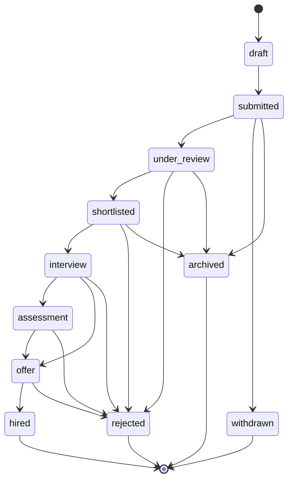

#### Job

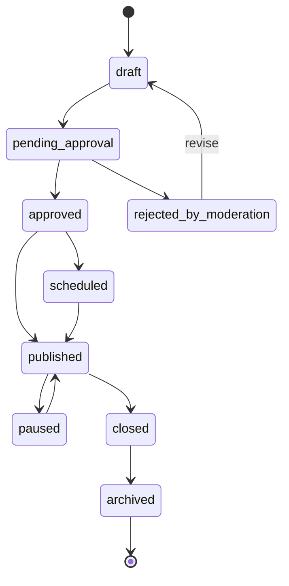

#### Credential (F-96)

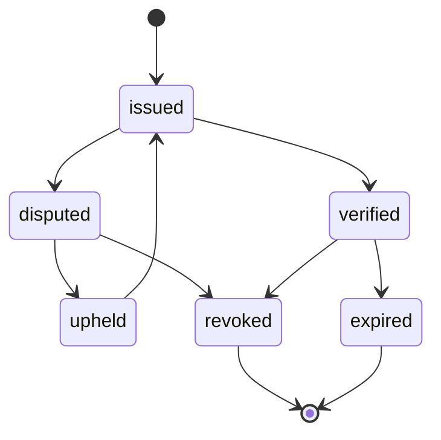

#### Certification Attempt (F-115)

```mermaid

stateDiagram-v2

    [*] --> registered

    registered --> in_progress

    in_progress --> submitted

    submitted --> graded

    graded --> passed

    graded --> failed

    passed --> certified

    failed --> cooldown

    cooldown --> registered: 7 days

    certified --> [*]

```

#### Interview Assessment (F-88)

```mermaid

stateDiagram-v2

    [*] --> scheduled

    scheduled --> in_progress

    in_progress --> completed

    in_progress --> cancelled

    in_progress --> no_show

    completed --> scored

    scored --> reviewed

    reviewed --> [*]

    cancelled --> [*]

    no_show --> [*]

```

#### Course Order

```mermaid

stateDiagram-v2

    [*] --> pending

    pending --> paid

    pending --> cancelled

    paid --> enrolled

    enrolled --> completed

    enrolled --> refund_requested

    refund_requested --> refund_approved

    refund_requested --> refund_denied

    refund_approved --> refunded

    refund_denied --> enrolled

    refunded --> [*]

    cancelled --> [*]

    completed --> [*]

```

#### Contest

```mermaid

stateDiagram-v2

    [*] --> draft

    draft --> scheduled

    scheduled --> registration_open

    registration_open --> active

    active --> ended

    ended --> results_published

    results_published --> archived

    archived --> [*]

```

### 18.3 Invariants Across All State Machines

> [!IMPORTANT]

> - No state may be skipped

> - Every transition writes an audit record

> - Terminal states are irreversible without a new entity

> - Server is authoritative (client optimism is UI-only)

> - **INV-TERMINAL:** Every state machine has an acyclic path to an explicit terminal state

---

## §19. Business Rules (BR-01..BR-246)

### 19.1 Access Control Rules (BR-01..BR-09)

| ID | Rule |
|---|---|
| BR-01 | Only `ROLE_RECRUITER`/`ROLE_ADMIN` may create/edit job postings |
| BR-02 | Only `ROLE_USER` may submit applications; recruiters may not apply |
| BR-03 | Candidates review own applications only; recruiters all for their companies |
| BR-04 | Only recruiters/admins create scorecards and notes |
| BR-05 | User edits own profile only; admin any |
| BR-06 | Flags, audit, settings, user mgmt, moderation are admin-only |
| BR-07 | Billing actions available to recruiters, not users/admins |
| BR-08 | Route-level RBAC matches shared route registry |
| BR-09 | Domain-level authorization backs state-changing commands |

### 19.2 Job Rules (BR-10..BR-14)

| ID | Rule |
|---|---|
| BR-10 | Job publish-readiness rule server-validated |
| BR-11 | Job lifecycle: draft→pending_approval→approved→scheduled→published→paused→closed→archived |
| BR-12 | Recruiters update/publish/archive only own-company jobs |
| BR-13 | Hidden jobs are client-preference; reversible |
| BR-14 | Saved-search digest runs as service-owned/audited scheduler |

### 19.3 Application Rules (BR-15..BR-20)

| ID | Rule |
|---|---|
| BR-15 | No duplicate ACTIVE application per user per job (partial UNIQUE + 90-day cooldown post-terminal) |
| BR-16 | No applications to closed/unavailable jobs |
| BR-17 | Application lifecycle server-owned append-only |
| BR-18 | Application drafts autosave 30s; recoverable; versions retained |
| BR-19 | Candidate notes/scorecards recruiter-scoped; never candidate-visible |
| BR-20 | Status-event history append-only |

### 19.4 Learning & Challenge Rules (BR-21..BR-25)

| ID | Rule |
|---|---|
| BR-21 | Lesson completion idempotent |
| BR-22 | Lesson prerequisites gate progression |
| BR-23 | Course completion → certificate + XP bonus |
| BR-24 | Challenge language allowlist; execution limits per TD-05 |
| BR-25 | XP idempotent UNIQUE(user_id, reference_type, reference_id); daily cap **200 XP/day** |

### 19.5 Data Governance Rules (BR-26..BR-35)

| ID | Rule |
|---|---|
| BR-26 | Resume exports append-only; artifact soft-delete |
| BR-27 | Analytics metadata whitelist-only; no raw text/tokens/secrets |
| BR-28 | Admin status distinguishes live/inferred/degraded/not-configured |
| BR-29 | Admin actions: confirmation + audit + rollback |
| BR-30 | Extension data stays in chrome.storage.local; no sync/fetch/network |
| BR-31 | Schedulers dry-run default; idempotent delivery keys |
| BR-32 | Subscription state webhook-owned |
| BR-33 | AI drafts never auto-commit to records |
| BR-34 | T&S report lifecycle pending→under_review→resolved/dismissed |
| BR-35 | SUPERSEDED — closures cited in §19.6 |

### 19.6 Expanded Rules (BR-036..BR-071)

| ID | Rule |
|---|---|
| BR-036 | Jobs require approved org + verified owner |
| BR-037 | Applications require ≥70% profile |
| BR-038 | Candidates may apply only to open jobs |
| BR-039 | Duplicate applications prevented (DB + app) |
| BR-040 | Recruiters access only their org's applications |
| BR-041 | Strict application state machine |
| BR-042 | Offers require completed HM-scoped scorecard review |
| BR-043 | Resumes are scanned for viruses before text extraction |
| BR-044 | Extracted resume text encrypted at rest |
| BR-045 | Rejection emails sent with configurable delay (default 24h) |
| BR-046 | Course enrollments unique per (user, course) for active status |
| BR-047 | Module progress strictly sequential |
| BR-048 | Course completion requires passing final assessment (≥70%) |
| BR-049 | Challenge submissions run in isolated sandbox |
| BR-050 | Sandbox execution has hard resource limits (30s CPU, 512MB RAM, 1GB disk) |
| BR-051 | Challenge test cases split: public + hidden |
| BR-052 | Plagiarism detection runs asynchronously |
| BR-053 | Badges minted only upon verified milestone completion |
| BR-054 | Referral rewards pay out after referred candidate's first verified hire |
| BR-055 | Subscription changes apply at period boundary (or prorated) |
| BR-056 | Entitlements derive from active subscription only |
| BR-057 | Jobs auto-close after expiry (configurable, default 60 days) |
| BR-058 | Applications auto-archive after 90 days in submitted |
| BR-059 | Moderation flags expire after 7 days if not actioned |
| BR-060 | XP transactions unique per (user, reference_type, reference_id) |
| BR-061 | Profile completeness ≥70% gate for job applications |
| BR-062 | Verified organizations receive accelerated job approval |
| BR-063 | Candidates may request data export; delivered within 30 days |
| BR-064 | Recruiters see verified signals on candidate profiles |
| BR-065 | AI outputs below 0.7 confidence display disclaimer |
| BR-066 | AI outputs below 0.5 confidence are suppressed |
| BR-067 | All admin actions are audit-logged |
| BR-068 | Account termination requires Platform Admin dual approval |
| BR-069 | Interviewer inactivity auto-escalation: 7 business days → HM escalation; 14 days → auto-transition stale_withdrawn |
| BR-070 | Candidate non-response auto-release: 5 business days → reminders; 8 days → candidate_unresponsive |
| BR-071 | Abandoned requisition protection: >21 calendar days → review; 30 days → auto-pause + billing credit |

### 19.7 Institutional Rules (BR-072..BR-082)

| ID | Rule |
|---|---|
| BR-072 | Managed learners access course only while org holds unexpired assigned seat |
| BR-073 | Seat revocation triggers 7-day grace; in-progress assessments never interrupted |
| BR-074 | Seat consumption atomic; last-seat concurrency never oversells |
| BR-075 | Revoked seat returns to pool; learner progress and certificates retained |
| BR-076 | Graduation transition retains all verified signals and severs FERPA-restricted records |
| BR-077 | Bulk imports require dry-run validation preview; no silent partial imports |
| BR-078 | Faculty/Proctor hold no org-level billing, licensing, or user-management privileges |
| BR-079 | Employer-facing student showcases require recorded, revocable consent |
| BR-080 | Every org-owned record scoped by `organization_id`; cross-tenant reads prohibited |
| BR-081 | Institutional pricing tiers configurable per course/package; never hard-coded |
| BR-082 | Course-access authorization server-side: org + learner + license + enrollment + validity |

### 19.8 Media Rules (BR-083..BR-090)

| ID | Rule |
|---|---|
| BR-083 | External media validated before publication; invalid/private/embed-blocked rejected |
| BR-084 | Provider embedding restrictions never bypassed; protected content never downloaded |
| BR-085 | Provider capabilities determine available playback/completion settings |
| BR-086 | Broken external provider isolated to affected content item; course remains functional |
| BR-087 | Platform stores learner progress even for externally hosted playback where trackable |
| BR-088 | Unsupported providers produce explicit errors, never silent broken embeds |
| BR-089 | Authors attest right to use external content before publication |
| BR-090 | Org provider allowlists enforced server-side |

### 19.9 Learning Marketplace Rules (BR-091..BR-115)

| ID | Rule |
|---|---|
| BR-091 | Course submission requires ≥5 lessons and ≥30 min total content |
| BR-092 | Course requires ≥1 video or text lesson (no quiz-only courses) |
| BR-093 | Structural edits to a published course require a new version |
| BR-094 | Free-preview lessons ≤20% of course content |
| BR-095 | Rating requires ≥20% course progress and verified enrolment |
| BR-096 | Category assignment required before submission |
| BR-097 | Instructor must have an approved profile before publishing |
| BR-098 | Course image ≥750×422, ≤4MB |
| BR-099 | Coupon cannot reduce price below platform minimum |
| BR-100 | Refund window 30 days from purchase (configurable), pro-rated after |
| BR-101 | Instructor earnings = 70% of net revenue after platform commission (configurable) |
| BR-102 | Course announcements limited to 1/day/course |
| BR-103 | Peer review requires ≥2 completed reviews per submission |
| BR-104 | Instructor cannot review or rate own course |
| BR-105 | Course version preserves existing student progress |
| BR-106 | Learning-path courses complete in declared order when sequenced |
| BR-107 | Quiz attempts bounded by configured max; practice quizzes unlimited |
| BR-108 | Graded quiz contributes to course grade; passing score configurable |
| BR-109 | Final exam cumulative; required for course completion when configured |
| BR-110 | Program certificate issued only when all required path courses complete |
| BR-111 | Assignment late submission flagged, graded per instructor policy |
| BR-112 | Auto-grading for code assignments reuses the challenge sandbox |
| BR-113 | Question-bank reuse preserves per-attempt snapshots (no retroactive edits) |
| BR-114 | Course archive/unpublish preserves enrolled-student access per policy |
| BR-115 | All course purchases are idempotent and webhook-owned |

### 19.10 Social/Content Rules (BR-116..BR-128)

| ID | Rule |
|---|---|
| BR-116 | One reaction per user per target; changeable, never additive |
| BR-117 | One repost per user per post |
| BR-118 | Post edits retain an "edited" marker and version history |
| BR-119 | Comment authors and post authors may moderate; authors may disable comments |
| BR-120 | Mentions notify only if the recipient allows mentions |
| BR-121 | Follows unique; blocked/muted targets cannot be followed |
| BR-122 | Post visibility enforced server-side (public/connections/org/private) |
| BR-123 | Newsletter subscriptions opt-in only; one-click unsubscribe (RFC 8058) |
| BR-124 | Feed must always offer a chronological view; ranking factors disclosed on demand |
| BR-125 | UGC passes pre-publish abuse scan; post rate limits per actor |
| BR-126 | Sponsored content labelled as sponsored; never undisclosed in organic ranking |
| BR-127 | Mute hides content without unfollowing and without notifying the muted party |
| BR-128 | Minors (16+) get private-by-default profiles and restricted outreach |

### 19.11 Outreach, Recommendations, Privacy (BR-129..BR-134)

| ID | Rule |
|---|---|
| BR-129 | Outreach credit consumed on send to a non-connection; refunded on reply within 7 days |
| BR-130 | Outreach weekly caps: 20 (Pro), 50 (Team), custom (Enterprise) |
| BR-131 | Endorsements require an existing connection |
| BR-132 | Written recommendations display only after recipient acceptance |
| BR-133 | Profile-view logging honours the viewer's privacy mode |
| BR-134 | Identity-verification badges only via approved partners; failure never blocks core use |

### 19.12 Employer Insights Rules (BR-135..BR-138)

| ID | Rule |
|---|---|
| BR-135 | Salary aggregates displayed only with ≥5 reports for a role/location cell |
| BR-136 | Anonymous reviews hide identity from employer and public, never from Platform Admin/legal |
| BR-137 | Company responses are appended, never edit the original review |
| BR-138 | Interview questions require moderation before public display |

### 19.13 Contests/Certification & Migration Rules (BR-139..BR-140 + MIG-01..08)

| ID | Rule |
|---|---|
| BR-139 | Contest submissions locked at server-authoritative end time; clock skew never extends |
| BR-140 | Certification exam pass requires the configured score in a single attempt (retake policy configurable) |
| MIG-01 | Imported data becomes project-owned; user may edit/delete/replace/export |
| MIG-02 | Migration is one-way and user-initiated; no continuous sync by default |
| MIG-03 | Migration never auto-publishes; imported posts land as drafts |
| MIG-04 | Imported skills are self-reported until natively verified |
| MIG-05 | Connection graphs are never imported; hashed-email mutual-consent discovery only, hashes TTL-bound |
| MIG-06 | Provider tokens server-side, short-lived, revocable; disconnect purges tokens + raw archive |
| MIG-07 | External provider IDs are never primary keys, auth claims, URLs, or analytics keys |
| MIG-08 | Every provider surface is feature-flagged and removable without core schema change |

### 19.14 Skills Graph Rules (BR-141..BR-148)

| ID | Rule |
|---|---|
| BR-141 | Skills taxonomy curated by Platform Admin; no user can create canonical skills |
| BR-142 | Skill relationships are directional: `prerequisite_of`, `subskill_of`, `supersedes` |
| BR-143 | Correlations (`correlates_with`) are bidirectional and computed statistically |
| BR-144 | Every course, challenge, job, and candidate skill tag MUST reference a canonical skill |
| BR-145 | Skill market signals update daily from aggregated data |
| BR-146 | Skill graph traversal depth bounded (max 5 hops) |
| BR-147 | Skill relationships must be acyclic for `prerequisite_of` (validated at write time) |
| BR-148 | Emerging skills require minimum 5 independent signals before taxonomy promotion |

### 19.15 Verification Rules (BR-149..BR-156)

| ID | Rule |
|---|---|
| BR-149 | Credentials are append-only; revocation creates a new record with `revoked_at` |
| BR-150 | Every credential has a public verification URL (no PII exposed) |
| BR-151 | Credential evidence links are immutable once issued |
| BR-152 | Endorsement weights derive from endorser's verified reputation + relationship proximity |
| BR-153 | Anonymous endorsements are not permitted (P-01) |
| BR-154 | Appeal path exists for disputed credentials; SLA ≤7 days |
| BR-155 | Privacy-preserving proofs allow skill verification without revealing full profile |
| BR-156 | Credential issue requires underlying achievement verified by platform activity |

### 19.16 Career Graph Rules (BR-157..BR-163)

| ID | Rule |
|---|---|
| BR-157 | Career outcome tracking requires explicit user opt-in |
| BR-158 | Aggregated career data requires k ≥5 for display |
| BR-159 | Individual career transitions visible only to the user |
| BR-160 | Progression benchmarks by role require ≥20 data points to publish |
| BR-161 | Salary progression tracked separately from base salary |
| BR-162 | Career graph updates do not retroactively alter historical benchmarks |
| BR-163 | Career path recommendations must disclose data sources and confidence intervals |

### 19.17 Reputation Rules (BR-164..BR-168)

| ID | Rule |
|---|---|
| BR-164 | Reputation score is derived, never manually set |
| BR-165 | Reputation is skill-specific |
| BR-166 | Time-decay: signals older than 24 months count less |
| BR-167 | Reputation is private by default; recruiter visibility requires candidate consent or active application |
| BR-168 | Reputation signals are auditable |

### 19.18 Interview Platform Rules (BR-169..BR-176)

| ID | Rule |
|---|---|
| BR-169 | Interview recording requires dual consent |
| BR-170 | Recordings encrypted at rest; retention ≤90 days unless extended |
| BR-171 | AI feedback is advisory; never a hiring decision input without human review |
| BR-172 | AI analysis excludes protected attributes |
| BR-173 | Interview questions are company-scoped; not visible to candidates before assessment |
| BR-174 | Assessment scores are append-only; changes are compensating entries |
| BR-175 | Live coding environment reuses the challenge sandbox |
| BR-176 | Comparison across candidates uses structured rubrics, never free-form scores |

### 19.19 Salary Intelligence Rules (BR-177..BR-183)

| ID | Rule |
|---|---|
| BR-177 | Salary reports require verification: self-reported (0.5) or verified via employment (1.0) |
| BR-178 | Aggregated salary data requires k ≥5 submissions per cell |
| BR-179 | Salary data displayed in minor units + ISO-4217 currency |
| BR-180 | Company-specific salary data shown only if company has ≥3 reports OR opted in |
| BR-181 | Users may withdraw their salary submission at any time |
| BR-182 | Salary intelligence updates quarterly; historical data versioned |
| BR-183 | Equity data (F-98) separately aggregated from salary |

### 19.20 Recommendation Rules (BR-184..BR-188)

| ID | Rule |
|---|---|
| BR-184 | Recommendation factors must be disclosed ("why am I seeing this?") |
| BR-185 | Recommendations never use protected attributes |
| BR-186 | Users can dismiss recommendations; dismissals train the model |
| BR-187 | Recommendations may not include promoted content without explicit "sponsored" label |
| BR-188 | Recommendation engine must be replaceable without breaking downstream features |

### 19.21 Learning Impact Rules (BR-189..BR-193)

| ID | Rule |
|---|---|
| BR-189 | Course outcome correlation requires ≥30 enrolled learners with measurable outcomes |
| BR-190 | Individual learner outcomes are never exposed without consent |
| BR-191 | Course quality scores derived from outcomes visible to instructors, not publicly ranked |
| BR-192 | Learning impact analytics do not create incentives to lower standards |
| BR-193 | Correlation is not causation — all outcome claims labelled as correlational |

### 19.22 Feature-Specific Rules (BR-194..BR-208)

| ID | Rule |
|---|---|
| BR-194 | Peer mentorship sessions have a 30-day inactivity auto-close |
| BR-195 | Expert network calls may be paid; platform takes a transparent fee |
| BR-196 | Industry hubs must have ≥3 active contributors to display |
| BR-197 | Resume parsing never auto-applies changes without user review |
| BR-198 | Custom assessments must be approved by Platform Admin before deployment |
| BR-199 | Candidate comparison requires verified profiles only |
| BR-200 | DE&I analytics use aggregated data only; individual demographic data never stored |
| BR-201 | Post-hire analytics require employer consent and are aggregate-only |
| BR-202 | Badge marketplace prohibits paid badges; all badges earned |
| BR-203 | Mobile-first application must maintain feature parity with desktop |
| BR-204 | Accessibility is a release gate; WCAG 2.2 AA mandatory |
| BR-205 | API access requires enterprise tier; rate-limited per CON-006 |
| BR-206 | Emerging skills require platform-wide adoption before taxonomy promotion |
| BR-207 | Job market analytics require k ≥10 data points per geographic cell |
| BR-208 | All new AI-powered features inherit AI safety rules §32 |

### 19.23 Warm Introduction Rules (BR-209..BR-216)

| ID | Rule |
|---|---|
| BR-209 | Introducer consent required for each introduction |
| BR-210 | Max path depth = 4 |
| BR-211 | Max 10 intro requests/week/user |
| BR-212 | Introducer can opt out of intro services |
| BR-213 | Target can block all intro requests |
| BR-214 | Introduction messages separate from cold outreach |
| BR-215 | Paths visible only to requester |
| BR-216 | No path suggestion for blocked users |

### 19.24 Application Feedback Rules (BR-217..BR-224)

| ID | Rule |
|---|---|
| BR-217 | Minimum reason category required on rejection |
| BR-218 | Feedback delivered within 7 days of decision |
| BR-219 | Feedback visible only to candidate |
| BR-220 | Aggregate insights use k ≥10 |
| BR-221 | AI drafts require human review before sending |
| BR-222 | Candidate can request feedback if not provided (30-day window) |
| BR-223 | Negative feedback must include actionable element |
| BR-224 | Feedback templates org-configurable |

### 19.25 Skill Decay Rules (BR-225..BR-232)

| ID | Rule |
|---|---|
| BR-225 | Freshness score computed nightly, immutable per day |
| BR-226 | Decay curves per skill category, admin-configurable |
| BR-227 | Freshness <20 demotes to self-reported |
| BR-228 | Re-verification restores freshness to 100 |
| BR-229 | Self-attestation counts 0.5× |
| BR-230 | Freshness visible to candidate always; recruiter-visible only with consent |
| BR-231 | Market drift alerts opt-in |
| BR-232 | Freshness stored historically (time-series) |

### 19.26 Referral Rules (BR-233..BR-240)

| ID | Rule |
|---|---|
| BR-233 | Max 3 referral requests per 30 days per candidate |
| BR-234 | Referrer consent required per request |
| BR-235 | Referral tag visible to recruiter (priority signal) |
| BR-236 | Referral rewards follow org policy; XP default |
| BR-237 | System verifies referrer's employment |
| BR-238 | No referral request from blocked user |
| BR-239 | Referrer max 20 referrals/quarter |
| BR-240 | Referral attribution tracked 12 months |

### 19.27 Alumni Rules (BR-241..BR-248)

| ID | Rule |
|---|---|
| BR-241 | Affiliation verified (email domain or institutional seat) |
| BR-242 | Alumni discovery respects privacy settings |
| BR-243 | Alumni group default-join, opt-out allowed |
| BR-244 | Alumni job postings must be from verified alumni |
| BR-245 | Alumni mentorship opt-in |
| BR-246 | No cross-institution data leakage |
| BR-247 | Graduated students retain alumni status |
| BR-248 | Alumni networks public or private (institution choice) |

---

# PART VI — TECHNICAL ARCHITECTURE

## §20. System Architecture

### 20.1 System Context

```mermaid

flowchart TB

    subgraph Users

        C[Candidates]

        R[Recruiters]

        I[Institution Admins]

        F[Faculty]

        A[Admins]

    end

    subgraph Frontend

        WEB[Next.js Web App]

        EXT[Chrome Extension]

        PWA[PWA]

    end

    subgraph Edge

        MW[Edge Middleware]

        SA[Server Actions]

        EH[Edge Handlers]

    end

    subgraph Core

        DOM[Domain Modules]

        OSL[Web OS Layer]

        AI[AI Router]

        Q[Queue]

    end

    subgraph Data

        AUTH[Supabase Auth]

        PG[(PostgreSQL)]

        RLS[RLS Policies]

        RT[Realtime]

        ST[Storage]

    end

    subgraph External

        STRIPE[Stripe]

        EMAIL[Resend]

        LLM[Gemini/Claude]

        MEDIA[Mux/CF Stream]

        LI[LinkedIn optional]

    end

    C & R & I & F & A --> WEB

    C --> EXT

    C --> PWA

    WEB --> MW

    EXT --> MW

    MW --> SA

    MW --> EH

    SA --> DOM

    DOM --> OSL

    DOM --> AI

    DOM --> Q

    DOM --> PG

    PG --- RLS

    MW --> AUTH

    DOM --> RT

    DOM --> ST

    EH --> STRIPE

    EH --> EMAIL

    AI --> LLM

    Q --> MEDIA

    DOM -.-> LI

```

### 20.2 Logical Architecture

| Layer | Contents | Technology |
|---|---|---|
| Presentation | Web app, extension, PWA, admin | Next.js App Router, React 18+, Tailwind, Radix |
| Application | Server Actions, route handlers, use cases | TypeScript strict |
| Domain | Aggregates, entities, VOs, domain events, business rules | Pure TS |
| Infrastructure | Repositories, adapters, integrations | Supabase, Stripe, providers |
| Data | PostgreSQL with RLS, storage buckets, realtime channels | Supabase |
| External | AI providers, payment, media, email, IDV | Integration Layer |

### 20.3 Authentication Flow

```mermaid

sequenceDiagram

    participant U as User

    participant W as Web App

    participant S as Supabase Auth

    participant MW as Edge Middleware

    participant D as Database

    U->>W: Credentials / OAuth

    W->>S: Authenticate

    S-->>W: JWT + refresh token

    W->>MW: Request with JWT

    MW->>MW: Verify + normalize role claims

    MW->>D: Set local app.user_id

    D->>D: Apply RLS policies

    D-->>W: Authorized data

    W-->>U: Rendered page

```

### 20.4 AI Safety Flow

```mermaid

flowchart TD

    A[User Input] --> B[PII Detection]

    B --> C[Redaction]

    C --> D[Prompt Construction + canary + user_content fencing]

    D --> E[AI Provider]

    E --> F[Output Validation Zod]

    F --> G{Canary leaked?}

    G -->|Yes| H[Drop response + alert + flag account]

    G -->|No| I{Confidence}

    I -->|<0.5| J[Suppress]

    I -->|0.5-0.7| K[Show with disclaimer]

    I -->|≥0.7| L[Show with evidence]

    K --> M{Human review required?}

    L --> M

    M -->|Yes| N[Human Gate]

    M -->|No| O[User sees draft]

    N --> O

```

---

## §21. Domain Architecture (DDD)

### 21.1 Bounded Contexts (7 + Shared Kernel)

| Context | Contents | Aggregates |
|---|---|---|
| `identity` | Auth, profiles, orgs, tenancy, managed learners, instructor approval | User, Profile, Organization, Membership |
| `marketplace` | Jobs, requisitions, applications, offers, interviews, employer insights | Job, Application, Offer, CompanyReview |
| `learning` | Courses, lessons/content items, media, enrolments, progress, quizzes, assignments, paths, certificates, XP/gamification, contests, certifications | Course, Enrolment, Assessment, XPLedger, Contest |
| `community` | Connections, follows, posts/articles/newsletters, comments/reactions/reposts, groups, events, messaging, notifications | Thread, Post, Community |
| `billing` | Subscriptions, entitlements, course commerce, coupons, orders, refunds, licence pools, procurement, payouts | Subscription, Order, LicencePool, Payout |
| `governance` | Admin, moderation, trust, audit, flags, verification | Report, ModerationAction, FeatureFlag |
| `analytics` | Event tracking, KPIs, dashboards, experimentation | AnalyticsEvent, KPISnapshot |
| **Shared kernel** | Event backbone, UOM, TIG, automation, agents, healing, liquidity, DQ, health, media engine, integrations, AI service, UI kit, types, utilities | DomainEvent, MediaSource, ProviderAdapter |

### 21.2 Domain Boundary Rules

- Domain layer pure TS (ARCH-013)

- Application layer orchestrates; Server Actions are thin adapters (ARCH-014)

- Infrastructure implements domain ports (ARCH-015)

- Cross-feature imports via `index.ts` barrels only (ARCH-016)

- Atomic promotion rule (ARCH-017)

- Cross-context via events or application-service interfaces (ARCH-018)

- Zero circular dependencies (ARCH-019)

- Routes are thin composition (ARCH-020)

### 21.3 ADRs (Locked at 13)

| ID | Decision |
|---|---|
| ADR-001 | Supabase Auth sole session authority |
| ADR-002 | Modular monolith (Next.js + Supabase + Vercel) |
| ADR-003 | 50 canonical tables + RLS deny-by-default |
| ADR-004 | Supabase Realtime messaging authority |
| ADR-005 | Stripe webhook idempotency + demo stubs |
| ADR-006 | Chrome extension local-first |
| ADR-007 | Provider-agnostic media |
| ADR-008 | Institutional tenancy |
| ADR-009 | Dual-queue boundary |
| ADR-010 | RLS policy template generator |
| ADR-011 | Media model is authority for lesson content |
| ADR-012 | DDD + Feature-Based + Atomic Design combination |
| ADR-013 | Cross-domain via events or application-service interfaces only |

---

## §22. Frontend Architecture

### 22.1 Aura Design System

**Zero raw hex values.** Tokens exposed as CSS variables + TS constants from one generated source.

**Light theme:** `--aura-bg-base` #FFFFFF · `--aura-bg-raised` #F8FAFC · `--aura-bg-sunken` #F1F5F9 · `--aura-text-primary` #0F172A · `--aura-text-secondary` #475569 · `--aura-brand-600` #2563EB · `--aura-success-500` #16A34A · `--aura-warning-500` #F59E0B · `--aura-danger-500` #DC2626 · `--aura-border` #E2E8F0 · `--aura-border-focus` #2563EB.

**Dark theme:** `--aura-bg-base` #0F172A · `--aura-bg-raised` #1E293B · `--aura-bg-sunken` #334155 · `--aura-text-primary` #F8FAFC · `--aura-brand-600` #3B82F6 · `--aura-border` #334155.

**Spacing:** 4px base (0, 2, 4, 8, 12, 16, 24, 32, 48, 64, 96, 128, 192px).

**Radius:** 6/10/16/50%.

**Motion:** 120/200/320ms + reduced-motion.

**Typography:** xs..4xl ramp.

**Z-index:** dropdown 30, modal 40, toast 50, palette 60.

### 22.2 Atomic Design Mapping

| Level | Contents |
|---|---|
| **Atoms (14+)** | Button, Input, Badge, Icon, Avatar, Skeleton, Spinner, Text, Divider, SourceStatusBadge, Checkbox, Radio, Toggle, Tag |
| **Molecules (12+)** | SearchField, FormField, Pagination, Toast, Dropdown, Tabs, Modal, EmptyState, SelectField, FileInput, DateRangePicker, ConfirmationDialog |
| **Organisms (20+)** | DataTable, NavigationSidebar, TopBar, CommandPalette, NotificationBell, FileUploader, CourseCard, JobCard, ProfileCard, QuizPanel, MediaSourceForm, LicenseUtilizationChart, SixStateRenderer, UnifiedPlayer, ObjectPreviewCard, PostComposer, PostCard, CommentThread, ReviewSummary, CurriculumTree, LeaderboardTable |
| **Templates (8)** | DashboardLayout, AuthLayout, SettingsLayout, AdminLayout, InstitutionLayout, LearningLayout, CourseBuilderLayout, FeedLayout |
| **Pages** | Live inside features (`domains/<ctx>/features/<f>/pages/`) |

**Promotion rule:** Components used by only one feature stay in that feature; promotion to `shared/ui/` happens on second use, never preemptively.

### 22.3 Route Registry

**Core Routes:**

| Route | Access | Page |
|---|---|---|
| `/` | Public | Landing |
| `/login`, `/register` | Public | Auth |
| `/verify/:hash` | Public | Credential verification |
| `/dashboard` | Auth | Role-adaptive |
| `/profile`, `/profile/[userId]` | Auth (RLS) | Profile |
| `/jobs`, `/jobs/[jobId]` | Auth | Jobs |
| `/jobs/new` | Recruiter+ | Post job |
| `/applications`, `/applications/[applicationId]` | Auth (RLS) | Applications |
| `/courses`, `/courses/[id]`, `/courses/[id]/learn` | Auth | Courses |
| `/challenges`, `/challenges/[id]`, `/challenges/[id]/attempt` | Auth | Challenges |
| `/messages`, `/notifications`, `/leaderboard` | Auth | Communication |
| `/settings`, `/settings/billing` | Auth / Org Admin+ | Settings |
| `/admin/*` | Platform Admin | Admin |

**Career Intelligence Routes:** `/career/readiness`, `/career/transition`, `/career/benchmarks`, `/salaries`, `/salaries/[role]`, `/companies/[slug]/salaries`

**Verification Routes:** `/verify/:hash`, `/credentials`, `/credentials/export`

**Interview Routes:** `/interviews/[id]`, `/interviews/[id]/results`, `/assessments/[id]`

**Recruiter Routes:** `/recruiter/search`, `/recruiter/pools`, `/recruiter/analytics`, `/hm/dashboard`

**Learning Routes:** `/paths`, `/paths/[id]`, `/teach/*`, `/cart`, `/checkout`, `/orders`

**Social Routes:** `/feed`, `/posts/[id]`, `/articles/[id]`, `/communities`, `/events`

**Institutional Routes:** `/institution/*` (13 paths)

**Admin Extension Routes:** `/admin/courses`, `/admin/instructors`, `/admin/reviews`, `/admin/orders`, `/admin/revenue`, `/admin/certificates`, `/admin/contests`

**OS Routes (Tier-gated):** `/workspace`, `/command`, `/automations`, `/agents`

**Intro/Referral Routes:** `/intro/request`, `/intro/inbox`, `/referrals`, `/referrals/request`

### 22.4 Repository Layout

```

src/

├── app/                      # Next.js router: thin shell only

│   ├── (auth)/ (platform)/ api/v1/ api/health/

├── domains/

│   ├── identity/ marketplace/ learning/ community/ billing/ governance/ analytics/

│   │   ├── domain/{entities,value-objects,aggregates,events,rules,repositories}

│   │   ├── application/{use-cases,services}

│   │   ├── infrastructure/{repositories,adapters}

│   │   └── features/<feature>/{index.ts,pages,components,hooks,services,api,models,validators,tests}

├── shared/

│   ├── platform/{events,object-model,graph,automation,agents,healing,liquidity,data-quality,health}

│   ├── infrastructure/{supabase,media,integrations/{linkedin,stripe,resend,oauth,hris},ai,jobs,heavy-jobs,email}

│   ├── ui/{tokens,atoms,molecules,organisms,templates,patterns,index.ts}

│   ├── types/  utilities/

└── config/{routes.ts,roles.ts,env.ts,feature-flags.ts}

```

### 22.5 UX State Matrix

**Six-State Standard:** Every data surface implements:

| State | Requirement |
|---|---|
| Idle | Default pre-fetch state |
| Loading | Skeleton ≤400ms; `aria-busy="true"` |
| Populated | Data rendered |
| Empty | Actionable CTA; never blank |
| Error | Friendly message + retry + correlation ID; `role="alert"` |
| Stale | Cached banner + refresh option |

**Surface Matrix:**

| ID | Surface | Required States |
|---|---|---|
| UXC-001 | Public auth | loading, error, validation, success, degraded |
| UXC-002 | Dashboard | loading, empty, error, partial, degraded |
| UXC-003 | Profile | loading, empty, error, permission-denied, success |
| UXC-004 | List/search | loading, empty, error, partial, offline |
| UXC-005 | Detail | loading, not-found, error, permission-denied, deleted |
| UXC-006 | Long-running | loading, running, partial, timeout, error, success, cancelled |
| UXC-007 | Realtime | loading, empty, error, degraded, reconnecting, offline |
| UXC-008 | Notifications | loading, empty, error, unread/read, degraded |
| UXC-009 | Settings/billing | loading, error, saving, saved, payment-pending, degraded |
| UXC-010 | Admin | loading, empty, error, permission-denied, destructive-confirm, audit-success |
| UXC-011 | OS routes | loading, empty, error, degraded, permission-scoped, success |
| UXC-012 | Destructive actions | confirm, in-progress, success, failure, undo |
| UXC-013 | Bulk import | upload, parsing, validating, preview, committing, partial, failed |
| UXC-014 | Course builder | autosaving, saved, save-failed, empty, media-validating, media-invalid, publish-blocked |
| UXC-015 | License management | loading, empty, assigned, low-availability, expiring-soon, expired, grace-period |
| UXC-016 | Quiz attempt | in-progress, time-warning, submitted, graded, timed-out |
| UXC-017 | Checkout | cart, processing, paid, failed, refunded |
| UXC-018 | Contest | pre-start, live, ended, results |
| UXC-019 | Migration wizard | upload, parsing, preview, conflicts, committing, partial, failed |
| UXC-020 | Review composition | draft, submitting, pending-moderation, published, removed |
| UXC-021 | Skills graph | loading, empty, error, populated, stale |
| UXC-022 | Credential | loading, empty, error, verified, revoked, expired |
| UXC-023 | Career readiness | loading, computing, ready, insufficient-data, error |
| UXC-024 | Interview session | scheduled, joining, in-progress, reconnecting, completed, cancelled, no-show |
| UXC-025 | Salary insight | loading, insufficient-data, populated, error |
| UXC-026 | Certification attempt | registered, in-progress, time-warning, submitted, passed, failed, expired |
| UXC-027 | Recruiter search | loading, empty, error, populated, rate-limited |
| UXC-028 | Salary report submission | idle, validating, submitted, rejected, error |

---

## §23. Backend Architecture

### 23.1 API Architecture

**Two-Tier Access:**

| Channel | Pattern | AuthZ Boundary | Guardrails |
|---|---|---|---|
| Direct PostgREST | `/rest/v1/{table}` | RLS (JWT) | Max page 100; embedding depth ≤3 |
| Server Actions/APIs | `/api/v1/{service}/{op}` | Session + CSRF + role | Zod validation; rate limits; idempotency |

**Deprecation Policy:** ≥6-month lifecycle with Sunset + Deprecation headers. Additive changes within a major version require no bump.

### 23.2 Response Envelope

```json

{

  "success": true,

  "data": { },

  "meta": { "cursor": "…", "has_more": true, "limit": 20 }

}

```

### 23.3 Interface Contracts (CON-001..CON-016)

| ID | Contract |
|---|---|
| CON-001 | Error contract: RFC 9457 |
| CON-002 | API versioning: path-versioned; additive within major |
| CON-003 | Pagination: cursor-based; limit default 20, max 100 |
| CON-004 | Filtering & sorting: allow-listed; sort keys indexed |
| CON-005 | Idempotency: `Idempotency-Key` on non-idempotent writes; 24h replay |
| CON-006 | Rate limiting: per-class budgets; 429 + Retry-After |
| CON-007 | Webhooks: HMAC signed; timestamp + replay window |
| CON-008 | Retry / timeout: 10s default (AI 30s); exponential backoff |
| CON-009 | Time: UTC; ISO-8601 with offset |
| CON-010 | Money: integer minor units + ISO-4217 |
| CON-011 | Files / uploads: allow-list + MIME sniff + size caps + AV |
| CON-012 | Concurrency: optimistic locking; stale write → 409 |
| CON-013 | Migrations: forward-only in production |
| CON-014 | Caching: only derived reads; keys include tenant + actor |
| CON-015 | Data lifecycle: retention windows; erasure propagates |
| CON-016 | Logging / telemetry: structured JSON; redacted |

### 23.4 Service Contracts (SCI-01..SCI-54)

*(See §25.2 for the complete service contract register.)*

---

## §24. Data Architecture

### 24.1 Canonical 50 Tables (+2 Extensions — LOCKED)

| # | Table | Domain |
|---|---|---|
| 1 | `profiles` | Profile |
| 2 | `profile_skills` | Profile |
| 2a | `user_profiles` | Profile (1:1) |
| 2b | `user_settings` | Profile (1:1) |
| 3 | `profile_experience` | Profile |
| 4 | `profile_education` | Profile |
| 5 | `profile_portfolios` | Profile |
| 6 | `resumes` | Profile |
| 7 | `organizations` | Organizations |
| 8 | `org_memberships` | Organizations |
| 9 | `jobs` | Jobs |
| 10 | `job_skills` | Jobs |
| 11 | `job_applications` | Applications |
| 12 | `application_status_events` | Applications |
| 13 | `scorecards` | Applications |
| 14 | `offers` | Applications |
| 15 | `requisitions` | Jobs |
| 16 | `courses` | Learning |
| 17 | `course_modules` | Learning |
| 18 | `course_enrollments` | Learning |
| 19 | `module_progress` | Learning |
| 20 | `course_reviews` | Learning |
| 21 | `challenges` | Assessment |
| 22 | `challenge_submissions` | Assessment |
| 23 | `badges` | Gamification |
| 24 | `user_badges` | Gamification |
| 25 | `xp_transactions` | Gamification |
| 26 | `leaderboards` | Gamification |
| 27 | `messages` | Messaging |
| 28 | `message_threads` | Messaging |
| 29 | `thread_participants` | Messaging |
| 30 | `connections` | Social |
| 31 | `feed_activities` | Social |
| 32 | `notifications` | Messaging |
| 33 | `subscriptions` | Billing |
| 34 | `invoices` | Billing |
| 35 | `entitlements` | Billing |
| 36 | `payment_methods` | Billing |
| 37 | `billing_events` | Billing |
| 38 | `reports` | Moderation |
| 39 | `moderation_flags` | Moderation |
| 40 | `audit_logs` | Admin |
| 41 | `feature_flags` | Admin |
| 42 | `platform_config` | Admin |
| 43 | `ai_audit_log` | Admin |
| 44 | `saved_jobs` | Marketplace |
| 45 | `saved_searches` | Marketplace |
| 46 | `job_alerts` | Marketplace |
| 47 | `email_templates` | Admin |
| 48 | `system_announcements` | Admin |
| 49 | `mentorship_relationships` | Social |
| 50 | `course_cohorts` | Learning |

**Canonical invariants:** Every table has RLS enabled · UUID primary keys · `created_at`/`updated_at` audit columns · soft delete where applicable.

### 24.2 Operational Clusters (Non-Canonical, ~185 tables)

| Cluster | Count | Examples |
|---|---|---|
| Journey | 20 | connection_requests, skill_endorsements, job_referrals, career_roadmaps, cohorts, cohort_members, cohort_curriculum, payout_profiles, creator_payouts, mentor_profiles, mentorship_sessions, mentorship_notes, mentor_reviews, institutional_showcases, agency_client_contracts, agency_placements, agency_invoices, job_trackers, course_challenges, talent_pool |
| OS layer | 27+4 | workspaces, saved_workspace_layouts, workspace_widgets, user_tasks, os_objects, os_object_links, os_tags, os_bookmarks, os_favorites, os_history, knowledge_graph_nodes, knowledge_graph_edges, domain_events, event_subscriptions, workbench_boards, automation_rules, automation_runs, journey_instances, interventions, liquidity_signals, data_quality_findings, agents, agent_runs, agent_memory, device_trust, session_risk_scores, fraud_cases, audit_findings + os_clipboard_items, os_undo_log, os_mentions, notification_center_events |
| Institutional | 12 | departments, batches, batch_memberships, license_pools, license_assignments, purchase_requests, procurement_orders, institutional_courses, certificates, organization_invitations, import_batches, student_consent_records |
| Media | 10 | content_items, media_sources, media_assets, media_versions, playlist_sources, playlist_items, media_progress, media_events, media_provider_configs, media_health_checks |
| Migration/LinkedIn | 5 | migration_jobs, migration_import_batches, imported_records, migration_consents, external_identity_references |
| Learning marketplace | 27 | course_categories, course_versions, lessons, lesson_resources, quizzes, quiz_questions, quiz_attempts, assignments, assignment_submissions, peer_reviews, course_qna, course_qna_replies, course_discussions, course_discussion_replies, lesson_notes, lesson_bookmarks, course_wishlist, course_announcements, learning_paths, learning_path_courses, learning_path_enrollments, path_progress, course_pricing, coupons, coupon_redemptions, course_orders, instructor_earnings |
| Social/content | 24 | follows, posts, post_media, comments, reactions, reposts, bookmarks, hashtags, post_hashtags, mentions, polls, poll_votes, articles, article_versions, newsletters, newsletter_issues, newsletter_subscriptions, post_analytics, feed_ranking_signals, muted_accounts, communities, community_memberships, community_moderation_log, profile_views |
| Profile expansion | 11 | profile_media, career_signals, profile_certifications, profile_achievements, profile_publications, profile_test_scores, profile_volunteer, profile_languages, profile_interests, experience_media, identity_verifications |
| Recommendations/outreach/pools | 5 | written_recommendations, outreach_credits, outreach_messages, talent_pools, talent_pool_members |
| Pages/events | 6 | organization_pages, showcase_pages, events, event_speakers, event_rsvps, event_updates |
| Employer insights | 6 | company_reviews, company_review_ratings, salary_reports, interview_experiences, interview_questions, company_responses |
| Contests/certification | 9 | coding_contests, contest_problems, contest_registrations, contest_submissions, contest_leaderboard, skill_certifications, certification_attempts, practice_problems, problem_discussions |
| Commerce ops | 2 | refunds, instructor_payouts |

**Effective schema ≈ 220 tables.** The "50 canonical" lock refers only to the baseline cluster; count is fixed by migrations and verified by VER-002.

### 24.3 RLS Policy Model (ADR-010)

**Policy Categories:**

| Category | Pattern |
|---|---|
| Own-row | `auth.uid() = user_id` |
| Org-scoped | Membership subquery on `org_memberships` |
| Application-scoped | `auth.uid() = applicant_id OR recruiter_for_job(job_id)` |
| Public-read | Always true for SELECT on published records |
| Admin-all | `auth.jwt()->>'role' = 'ROLE_ADMIN'` |
| Deny-by-default | No matching policy → access denied |

**Generator Model:**

```

generate_tenant_rls_policy(table, tenant_column, owner_column, is_public_read)

```

Creates admin-override, owner, org-member, and optional public-read policies. Helpers: `auth_is_admin()`, `auth_is_org_member(org)`, `auth_is_owner(user)`.

**RLS Fuzzing (CI Gate):** On every migration: create Tenant A/B users + orgs, seed rows, assert cross-tenant SELECT returns 0 rows, cross-tenant UPDATE/DELETE fails, owner-only tables deny non-owners, public-read tables expose no PII. Blocks merge on any failure.

---

## §25. API Specifications

### 25.1 Complete Service Contract Register (SCI-01..SCI-54)

| ID | Operation | Actor | Idempotency |
|---|---|---|---|
| SCI-01 | Create job | Org recruiter | Client `jobIdempotencyKey` |
| SCI-02 | Apply to job | Candidate | Natural (unique job+applicant) |
| SCI-03 | Send message | Participant | `clientMessageId` |
| SCI-04 | Submit challenge | Candidate | Submission idempotency key |
| SCI-05 | AI suggest | Authed user | Deterministic heuristic |
| SCI-06 | Payment webhook | Stripe | Stripe `event.id` |
| SCI-07 | Moderate content | Moderator/Admin | Action key |
| SCI-08 | Enroll in course | Learner | Partial unique active |
| SCI-09 | Purchase license pool | Institution Admin | PO + Stripe event ID |
| SCI-10 | Bulk import students | Institution Admin | import_batch_id + row hash |
| SCI-11 | Batch course assignment | Institution Admin | (pool_id, batch_id) |
| SCI-12 | Seat assign/revoke/reassign | Institution Admin | (pool_id, learner_id) |
| SCI-13 | Add media source | Course Author | (content_item_id, provider, external_id) |
| SCI-14 | Import playlist | Course Author | (playlist_source_id, import_run_id) |
| SCI-15 | Reorder content | Course Author | Client operation ID |
| SCI-16 | Record playback progress | Learner | (learner_id, content_item_id) |
| SCI-17 | Certificate issue / verify | System / Public | UNIQUE(enrollment_id) |
| SCI-18 | Graduate learner | System / Learner | (learner_id, transition_id) |
| SCI-19 | Create course version | Course Author | Version key |
| SCI-20 | Submit course for review | Course Author | Submission id |
| SCI-21 | Attempt quiz | Learner | (quiz, user, attempt_no) |
| SCI-22 | Submit assignment | Learner | (assignment, learner, attempt_no) |
| SCI-23 | Assign peer review | System | (submission, reviewer) |
| SCI-24 | Enrol in path | Learner | (path, user) active |
| SCI-25 | Abort / rollback migration | System / User | (migration_id, stage) |
| SCI-26 | Purchase course | Learner | PaymentIntent id |
| SCI-27 | Submit payout settlement | System | (period, creator) |
| SCI-28 | Q&A post / accept answer | Learner / Instructor | Client post id |
| SCI-29 | Create contest | Instructor / Org | Contest key |
| SCI-30 | Register for contest | Learner | (contest, user) |
| SCI-31 | Submit contest entry | Learner | (contest, challenge, user, submission_key) |
| SCI-32 | Attempt certification | Learner | (certification, user, attempt_no) |
| SCI-33 | Publish post | Author | Client post id |
| SCI-34 | Send newsletter issue | Author | Issue key |
| SCI-35 | Skill CRUD / relationship / market signal / traversal | Admin / Public | — |
| SCI-36 | Career graph query / benchmark / opt-in | Candidate | — |
| SCI-37 | Salary submission / aggregate / withdrawal | Candidate | Submission key |
| SCI-38 | Assessment lifecycle | Recruiter/Interviewer | Assessment id |
| SCI-39 | Recording lifecycle | Recruiter/Interviewer | Recording id |
| SCI-40 | Readiness computation / gap analysis | Candidate | Recompute key |
| SCI-41 | Recruiter search / pool CRUD | Recruiter | — |
| SCI-42 | Credential issue / verify / revoke / endorse | System / Public / Peer | UNIQUE(enrollment) |
| SCI-43 | Correlation query / instructor analytics | Instructor / Admin | — |
| SCI-44 | Exam CRUD | Admin | — |
| SCI-45 | Emerging skill proposal | System | — |
| SCI-46 | Relationship validation | System | — |
| SCI-47 | Introduction path discovery | Candidate | — |
| SCI-48 | Introduction request lifecycle | Candidate | (path_id, requester) |
| SCI-49 | Feedback CRUD | Recruiter | Feedback key |
| SCI-50 | Feedback request | Candidate | Request key |
| SCI-51 | Freshness query | Candidate | — |
| SCI-52 | Re-verification | Candidate | Verification key |
| SCI-53 | Referral request lifecycle | Candidate | (job_id, referrer_id) |
| SCI-54 | Alumni affiliation / group lifecycle | User | Affiliation key |

### 25.2 Error Taxonomy

| Error Class | HTTP | Client-Visible Behavior |
|---|---|---|
| Validation | 422 | Field-level actionable messages |
| Authentication | 401 | "Sign in to continue" |
| Authorization / RLS denial | 403 / 404-equivalent | Generic "not permitted"; no existence leakage |
| Not found | 404 | RLS-masked |
| Conflict | 409 | "Changed since you loaded it — refresh" |
| Rate limit | 429 | Retry-After respected |
| Dependency failure | 503 / degraded | Never a false success |
| Timeout | 504 | Idempotent resume |
| Realtime failure | RPC error | Resubscribe + reconcile/poll |
| AI failure | 503 | Heuristic fallback + badge |
| Billing failure | 503 | Entitlements unchanged |
| Scheduler failure | Retry / DLQ | Skip reason surfaced |

---

## §26. Integration Architecture

### 26.1 Integration Register

| Integration | Direction | Purpose | Phase |
|---|---|---|---|
| Supabase (Auth/DB/Storage/Realtime/Edge) | Core | Platform substrate | MVP |
| Stripe | Bidirectional | Billing, webhooks, metering, invoicing | MVP (demo-guard) |
| Google / GitHub OAuth | Inbound | Social login | MVP |
| Resend / Postmark | Outbound | Transactional email | MVP |
| Gemini / Claude | Outbound | AI via `lib/ai/service.ts` | MVP heuristic; LLM Ph4 |
| BYO AI key | Outbound | Zero-platform-cost AI | MVP |
| Vercel | Deploy | Hosting/edge | MVP |
| Sentry / Vercel Analytics / PostHog | Outbound | Observability | MVP |
| HaveIBeenPwned | Outbound | Breached-password check | MVP |
| Mux / Cloudflare Stream | Outbound | Transcode + CDN | Ph2 (OD-14) |
| Kaltura / Panopto / MS Stream | Outbound | Enterprise video gateways | Ph6 |
| MS Entra / Google Workspace / Okta SSO | Inbound | Institutional SSO | Ph6 |
| Workday / SAP / BambooHR | Bidirectional | HRIS sync | Ph6 |
| Moodle / Canvas / Blackboard / SIS | Bidirectional | LMS interop | Ph6 |
| LinkedIn | Outbound/inbound | Job cross-post, extension scan, OIDC bootstrap, migration source | Post-MVP |
| Slack / Cal.com | Outbound | Notifications/scheduling | Post-MVP |
| IDV vendor | Outbound | Identity verification | Ph9 (OD-27) |
| Proctoring vendor | Outbound | Exam proctoring | Ph10 (OD-35) |
| Zapier / Make | Outbound | Automation | Future |

### 26.2 Integration Layer Doctrine (ADR-009)

```

Core Domain ← Integration Layer (ProviderAdapter + anti-corruption mappers) ← Provider Adapters

```

**Rules:**

- Server-side only for secrets

- Idempotency keys on webhook-triggered operations

- Circuit breakers with degraded modes

- Status visible in admin health

- Every dependency has an owner and documented degraded mode

- Removal drill (VER-021) gates every integration-touching release

---

## §27. Queue & Async Architecture

### 27.1 Dual-Queue Boundary (ADR-009)

| Queue | Infra | Workloads | SLA |
|---|---|---|---|
| Transactional | Postgres `background_jobs` (SKIP LOCKED) | XP settle, notifications, webhooks, digests, rollups, retention purge, search reindex | Enqueue <10ms; process <5s |
| Heavy async | Dedicated worker pool (Redis/BullMQ or equivalent, OD-38) | Video transcode, AI enrichment, 5k+ row imports, large exports, embedding generation | Enqueue <100ms; process best-effort; DLQ after 3 retries |

### 27.2 Transactional Job Catalog

| Kind | Cadence | Retries |
|---|---|---|
| `notification.digest` | Daily 07:30 | 5 |
| `notification.fanout` | On event | 5 |
| `xp.settle` | Event or hourly | 3 |
| `streak.rollover` | Daily 00:05 | 5 |
| `leaderboard.rebuild` | Daily off-peak | 3 |
| `metrics.rollup` | Hourly/daily | 5 |
| `retention.purge` | Daily 02:00 | 5 |
| `stripe.sync` | On backlog | 5 |
| `search.reindex` | On write + nightly | 3 |
| `skill.market_signal_update` | Daily | 3 |
| `career.benchmark_compute` | Nightly | 3 |
| `salary.aggregate` | Nightly | 3 |
| `learning.outcome_correlation` | Nightly | 3 |
| `emerging_skill.detect` | Weekly | 3 |

### 27.3 Heavy Job Catalog

| Kind | Cadence | Retries |
|---|---|---|
| `media.transcode` | On upload | 3 → DLQ |
| `media.enrich` | On transcode complete | 3 → DLQ |
| `media.healthcheck` | Periodic | 3 |
| `institutional.import` | On request | 3 |
| `migration.parse` / `.commit` / `.purge-archive` | On request | 3 |
| `feed.fanout` | On post publish | 3 |
| `earnings.settle` | Monthly | 5 |
| `coupon.expiry_scan` | Daily | 3 |
| `interview.ai_analysis` | On session complete | 3 |

### 27.4 Job Schema

```

id UUID · kind · payload jsonb · status (queued/running/succeeded/failed/dead)

attempts · run_after · lock_expires_at · last_error (≤4KB)

idempotency_key UNIQUE(kind, idempotency_key) · created_at · updated_at

```

---

## §28. Realtime Architecture

### 28.1 Realtime vs Polling Boundary

| Surface | Mechanism |
|---|---|
| Direct messaging | Supabase Realtime |
| Notification badges | Supabase Realtime |
| Presence (workspace) | Supabase Realtime |
| Feed | Cursor polling (30s) |
| Job listings | Cursor polling |
| Community posts | Cursor polling |
| Leaderboards | Polling + optimistic |
| Contest live leaderboard | Realtime (bounded) |

### 28.2 Channel Contract

- Payload ≤4KB `{type, entity, id, ts}` + monotonic cursor

- No raw rows; server RLS projection

- JWT-authenticated channels; RLS applied before event body

- Channel registry `<channelType>:<boundedId>`

### 28.3 Resilience

- Reconnect backoff 1s → 8s

- >3 failures → polling path with cursor resync

- Server cap 50 events/s/channel

- Overflow → `refresh` signal

- Launch capacity target ≤2,500 concurrent / 40 topics

---

## §29. Media Architecture

### 29.1 Unified Content Model

```

Course → Section → ContentItem (VIDEO | PLAYLIST | ARTICLE | PDF | QUIZ | ASSIGNMENT | EXTERNAL_LINK)

                → MediaSource

                → ProviderAdapter

                → ProviderPlayer

```

### 29.2 Delivery Modes

| Mode | Description | Storage | Playback |
|---|---|---|---|
| A — Upload | File uploaded, validated, transcoded, CDN-delivered | Platform | Platform player |
| B — External video | URL normalized, validated, metadata fetched | Provider-hosted | Provider embed |
| C — Playlist embed | Ex

| C — Playlist embed | External playlist embedded dynamically | Provider-hosted | Provider embed |
| D — Playlist import | Snapshot imported as discrete lessons (default, TD-20) | Provider-hosted | Provider player/embed |
| E — External-link fallback | Embedding prohibited (policy/DRM); author warned; safe outbound redirect | Provider-hosted | External tab |

### 29.3 Provider Adapters & Pluggable Architecture

The Media Engine implements a pluggable provider adapter contract (`MediaProviderAdapter`) that isolates platform core logic from third-party media APIs:

```typescript
export interface MediaProviderAdapter {
  providerId: 'native_upload' | 'youtube' | 'vimeo' | 'cloudflare_stream' | 'mux' | 'kaltura' | 'panopto' | 'ms_stream';
  validateUrl(url: string): Promise<{ valid: boolean; normalizedUrl?: string; error?: string }>;
  extractMetadata(url: string): Promise<{ title: string; durationSeconds: number; thumbnailUri?: string }>;
  getEmbedConfig(mediaSource: MediaSource): EmbedConfiguration;
  fetchPlayerJs(): Promise<string | null>;
  trackProgress(sessionId: string, event: PlaybackEvent): Promise<ProgressSyncResult>;
}
```

- **Phase 0/1 MVP:** Native Upload (Cloudflare R2 / Supabase Storage via signed URLs) and YouTube (IFrame Player API).
- **Phase 2:** Vimeo (Player SDK), Playlist snapshot import engine (TD-20).
- **Phase 3:** Cloudflare Stream / Mux HLS adaptive bitrate streaming integration.
- **Phase 6 Enterprise Tier:** Kaltura, Panopto, and Microsoft Stream enterprise SSO token-exchange gateways (FC-19, TD-19).

### 29.4 Transcoding, CDN & Delivery Pipeline

1. **Upload Handshake:** Resumable chunked uploads using TUS protocol (`/api/media/upload/chunk`) directly to platform storage buckets.
2. **Asynchronous Transcode Queue:** BullMQ worker (`media.transcode`) receives asset payload, executing multi-bitrate encoding:
   - 1080p (4,500 kbps, H.264 / AAC)
   - 720p (2,200 kbps, H.264 / AAC)
   - 480p (800 kbps, H.264 / AAC)
   - 360p (400 kbps, H.264 / AAC)
3. **Packaging:** Fragmented MP4 packaged into HLS (`.m3u8` master manifest) and MPEG-DASH.
4. **Edge CDN Delivery:** Global edge caching with signed URLs generated using HMAC-SHA256 tokens (time-to-live 2 hours). Enforces anti-hotlinking referrer verification.

### 29.5 Playback Tracking & Progress Synchronization

- **Client Heartbeat:** Player emits `media.heartbeat` telemetry throttled to 10-second intervals containing `{ lesson_id, session_id, position_seconds, total_duration, playback_rate }`.
- **Milestone Threshold:** Lesson status transitions from `in_progress` to `completed` when cumulative unique watched duration reaches ≥ 90% of total duration (BR-085).
- **Idempotent Storage:** Progress writes update canonical table `module_progress` (#19) using UPSERT semantics.
- **Offline PWA Playback (Phase 6, MEDIA-045):** "DRM-lite" encrypted IndexedDB storage for offline progressive web app access with periodic license challenge checks.

### 29.6 AI Enrichment Pipeline (`media.enrich`)

1. **Audio Extraction:** Audio stream extracted from uploaded or hosted media as 16kHz mono WAV.
2. **Speech-to-Text:** Automatic transcription via Whisper models generating WebVTT and SRT caption files with word-level timestamps.
3. **Semantic Chaptering:** LLM identifies natural thematic transitions, outputting structured chapter timestamps with topic labels.
4. **Study Guides & Question Generation:** Auto-generated chapter summaries, key definitions, and practice quiz questions.
5. **Governance & Verification:** Enrichment outputs remain in `draft` status until instructor explicitly reviews, edits, and marks verified (`SourceStatusBadge` attached per P-04).

### 29.7 Tenant Media Governance & Security

- **Provider Allowlists:** Institutional and enterprise tenants can restrict allowed video providers via tenant settings (e.g. disabling YouTube and allowing only institutional Panopto or direct uploads).
- **Egress & Storage Metering:** Per-tenant bandwidth and transcoding quotas enforced via `COST-013` and `RG-013`. Automatic alerts at 80% quota; hard-block on new video uploads at 100% (existing playback preserved).
- **Embed Isolation:** Sandboxed iframes (`sandbox="allow-scripts allow-same-origin allow-presentation"`) preventing third-party embeds from accessing parent DOM or auth cookies.

---

# PART VII — QUALITY & OPERATIONS

## §30. Security Architecture

### 30.1 STRIDE Threat Model & Mitigation Trace

| STRIDE Category | Threat Description | Architectural Mitigation | Trace / Control |
|---|---|---|---|
| **Spoofing** | Adversary impersonates candidate, recruiter, or system service | JWT authentication with Ed25519 signature verification, MFA enforcement, Redis session invalidation | HDN-001, HDN-002, SCI-01 |
| **Tampering** | Malicious alteration of application scores, XP ledger, or course progress | PostgreSQL Row Level Security (RLS), SHA-256 certificate hashes, append-only ledger tables | HDN-003, HDN-004, VER-001 |
| **Repudiation** | User denies performing an action (e.g. withdrawing application, rejecting candidate) | Immutable audit logs (`audit_logs` #46) capturing actor, IP, timestamp, and signed payload state | HDN-005, R-008 |
| **Information Disclosure** | Cross-tenant data leakage between competing hiring organizations or educational cohorts | Default-deny RLS policies, multi-tenant composite isolation, encrypted field storage | HDN-006, HDN-018, VER-017 |
| **Denial of Service** | Resource exhaustion via scraper bots, webhook flooding, or heavy challenge compilation | Redis token-bucket rate limiters, BullMQ heavy job queue boundaries, isolated sandbox workers | HDN-007, CON-006, TD-05 |
| **Elevation of Privilege** | Candidate attempts to execute recruiter ATS actions or access administrative consoles | Strict RBAC/ABAC middleware checks, database role boundaries, no client-side role claims trusted | HDN-008, SCI-07 |

### 30.2 Authentication & Session Lifecycle

- **Two-Tier Authentication:** Supabase Auth (GoTrue) handles cryptographic identity, token issuance, and OAuth 2.0 / SAML handshakes. Application backend maintains session state in Redis for instantaneous revocation.
- **Token Specifications:**
  - Access Token: Short-lived JWT (15-minute expiration) signed with Ed25519. Contains `sub`, `email`, `role`, and `org_id`.
  - Refresh Token: Long-lived sliding token (7-day window) stored in HttpOnly, Secure, SameSite=Strict cookies. Single-use rotation on each refresh.
- **Concurrent Session Limits:** Maximum of 5 concurrent active sessions per user account. Subsequent logins evict the oldest session.
- **MFA Enforcement:** Mandatory TOTP or WebAuthn / Passkeys for Recruiter, Institution Admin, and Platform Admin roles. Grace period of 7 days on new accounts before access restriction.
- **Account Lockout:** 5 consecutive failed authentication attempts trigger a 15-minute exponential backoff lock with notification to user email.

### 30.3 Authorization Model & RLS Hardening (119 Policies, Generator, Fuzzing)

All 50 canonical tables and all operational cluster tables enforce PostgreSQL Row Level Security:
- **Default Posture:** `ALTER TABLE <table_name> ENABLE ROW LEVEL SECURITY; ALTER TABLE <table_name> FORCE ROW LEVEL SECURITY;` Default policy is strict DENY for all roles.
- **RLS Generator Pattern:** Database migrations utilize standardized declarative generator functions to ensure consistency:
  - `generate_owner_policy(table, owner_column)`: Restricts access to `auth.uid() = owner_column`.
  - `generate_org_policy(table, org_column, allowed_roles)`: Scopes access to members of `org_column` whose active membership role is in `allowed_roles`.
  - `generate_admin_override(table)`: Permits full access to authenticated users possessing `app_metadata.role = 'platform_admin'`.
- **Automated RLS Fuzzing Gate (`VER-011` / `VER-017`):** Continuous integration executes 10,000 synthetic cross-tenant access queries simulating unauthenticated users, opposing tenants, and malicious role payloads. Zero data leakage is permitted.

### 30.4 API Security & Rate Limiting

- **Rate Limiting Tiers (Redis Token-Bucket via `CON-006`):**
  - Public / Anonymous: 60 requests/minute per IP address.
  - Authenticated Candidate: 300 requests/minute per User ID.
  - Recruiter / Organization: 1,200 requests/minute per Tenant ID.
  - External Webhook Ingestion: 5,000 requests/minute per endpoint with HMAC-SHA256 signature verification.
- **HTTP Security Headers:**
  - `Content-Security-Policy`: Strict script/style nonces, `default-src 'self'`, frame sandboxing.
  - `Strict-Transport-Security`: `max-age=31536000; includeSubDomains; preload`.
  - `X-Content-Type-Options`: `nosniff`.
  - `X-Frame-Options`: `DENY` (or restricted allow-list for verified embeds).
  - `Referrer-Policy`: `strict-origin-when-cross-origin`.
  - `Permissions-Policy`: `camera=(), microphone=(), geolocation=(), payment=(self)`.

### 30.5 Security Hardening Register (HDN-001..HDN-024)

| Control ID | Control Domain | Specification & Requirement | Enforcement Mechanism | Verification Test |
|---|---|---|---|---|
| **HDN-001** | Database Hardening | All database access executed through RLS-enabled roles; superuser/service_role forbidden in client API code | Supabase Client Gateway & Middleware | VER-001 |
| **HDN-002** | Secrets Management | Zero plaintext secrets in code, repositories, or Docker layers. Secrets injected via environment vault | Doppler / HashiCorp Vault | VER-007 |
| **HDN-003** | Token Security | JWT access tokens short-lived (15 min); refresh token rotation enforced with reuse detection | Edge Auth Middleware | VER-001 |
| **HDN-004** | Input Sanitization | All incoming payloads validated against strict Zod schemas before hitting domain logic | Route Handlers & Server Actions | VER-003 |
| **HDN-005** | SQL Injection Defense | Parameterized queries only via Supabase PostgREST / Drizzle ORM; string concatenation forbidden | AST Linter & Static Analysis | VER-007 |
| **HDN-006** | Tenant Isolation | Multi-tenant tables require compound keys `(tenant_id, id)` with index-backed RLS policies | PostgreSQL Schema Constraints | VER-017 |
| **HDN-007** | Rate Limiting | Distributed token bucket on all API routes with exponential backoff on 429 errors | Redis Upstash Edge Middleware | VER-006 |
| **HDN-008** | CSRF Protection | SameSite=Strict cookies combined with custom request header checks on mutating requests | Next.js Server Actions Guard | VER-007 |
| **HDN-009** | CORS Policy | Explicit origin allowlists for production and staging; wildcards strictly forbidden | API Route Headers | VER-007 |
| **HDN-010** | Content Security Policy | CSP with cryptographic nonces preventing inline script execution and unauthorized framing | Edge HTTP Headers | VER-007 |
| **HDN-011** | File Upload Security | Magic-byte validation, extension allowlists, max file size enforcement, AV bucket scanning | ClamAV S3 Event Worker | VER-018 |
| **HDN-012** | Audit Logging | All state-mutating actions produce immutable audit log entries with user, IP, and payload hash | `audit_logs` Append-Only Table | VER-016 |
| **HDN-013** | PII Masking | PII fields masked in logs, telemetry, Sentry traces, and development seed environments | Logging Formatter Middleware | VER-026 |
| **HDN-014** | Code Sandbox Security | Code execution runs in unprivileged, ephemeral microVM containers with disabled networking | Firecracker / gVisor Container | VER-025 |
| **HDN-015** | Prompt Injection Defense | AI inputs bounded by XML delimiters, system prompts isolated, canary tokens monitored | AI Gateway Guardrails | VER-012 |
| **HDN-016** | AI Output Sanitization | AI responses parsed into strict Zod schemas; unstructured raw execution forbidden | Structured Outputs Parser | VER-012 |
| **HDN-017** | UGC Sanitization | Markdown and rich text sanitized via DOMPurify; script tags and javascript: URIs stripped | Markdown Render Component | VER-008 |
| **HDN-018** | UGC Abuse Pipeline | Pre-publish heuristic spam detection, rate limiting, and automated content deduplication | Moderation Engine | VER-023 |
| **HDN-019** | Anonymous Review Protection | Author identity cryptographically decoupled server-side; anti-doxxing threshold k ≥ 3 | Review Service / Hash Vault | VER-024 |
| **HDN-020** | Assessment Confidentiality | Quiz answer keys, test rubrics, and hidden test suites encrypted at rest and never delivered to client | Assessment Engine | VER-022 |
| **HDN-021** | Contest Clock Integrity | Server-authoritative time stamping for submission cutoff; client clock skew ignored | Contest Engine | VER-025 |
| **HDN-022** | Payment Hardening | Server-side price calculation at checkout; Stripe webhook signature and idempotency verification | Stripe Webhook Handler | VER-013 |
| **HDN-023** | Payout Compliance | Instructor KYC and tax verification required before payout disbursement; append-only ledger | Payout Service | VER-013 |
| **HDN-024** | Peer Review Fairness | Double-blind review until grading finalized; reviewer and student identities mutually obscured | Peer Review Engine | VER-022 |

---

## §31. Privacy & Compliance

### 31.1 FERPA Severance (Logical Anonymization Doctrine)

- **Educational Records Protection:** Student records originating from institutional partnerships (universities, colleges, training academies) are subject to Family Educational Rights and Privacy Act (FERPA) regulations.
- **Cryptographic Salt Severance:** An institutional learner's academic identity is bound to institutional records via a salted hash:
  `academic_identity_token = HMAC-SHA256(student_id, institution_salt)`.
  Upon graduation or institutional contract termination, the student transitions to independent candidate status. If the student requests privacy severance, the platform rotates or destroys the localized salt, logically anonymizing historical academic identifiers while preserving the candidate's earned credentials and certificates.
- **Consent-Gated Showcase:** Student projects, portfolios, and assessment scores are invisible to corporate recruiters until the student explicitly grants written consent via a signed platform disclosure (`BR-079`).

### 31.2 GDPR, CCPA & DSR Operations (Right to Erasure, Export)

- **Data Subject Request (DSR) Engine:**
  - **Right to Access / Portability (GDPR Art. 15 / 20):** User triggers one-click export. Asynchronous job compiles a signed, encrypted `.zip` containing user profile, applications, assessment scores, course completions, and messages in machine-readable JSON format. Delivery SLA: < 72 hours.
  - **Right to Rectification (GDPR Art. 16):** Full self-service editing across profiles, work history, and uploaded credentials. Disputed verification badges follow formal verification appeal workflow.
  - **Right to Erasure / Forgotten (GDPR Art. 17):**
    - Phase 1: Immediate soft-delete (`deleted_at = NOW()`), revocation of all active sessions, and removal from search indexes and recruiter feeds.
    - Phase 2: 30-day statutory recovery window.
    - Phase 3: Permanent purge: PII columns overwritten with cryptographic random strings, resume files purged from S3 buckets, analytical event identifiers hashed to zero-entropy UUIDs. Audit log records retain only `user_id_hash` for statutory compliance (7-year floor).

### 31.3 EEOC & Hiring Compliance (Demographic Shielding, Auditability)

- **Demographic Shielding (Blind Review Mode):** Recruiter ATS interface offers an automated blind screening mode that programmatically strips:
  - Candidate name, avatar, and contact details
  - Graduation dates (mitigating age bias)
  - College/university names (mitigating prestige bias)
  - Pronouns and gendered phrasing
- **Algorithmic Disparate Impact Auditing:** Automated monitoring tracks ATS pass/fail ratios across demographic categories where volunteered under EEO-1 surveys. Employs the EEOC Four-Fifths Rule (80% rule): if any protected group's selection rate is < 80% of the highest selection group, system flags algorithmic bias to the AI Governance Board.

### 31.4 Data Retention & Purge Lifecycle

| Data Domain | Retention Window | Storage Target | Disposal Mechanism | Statutory Basis |
|---|---|---|---|---|
| User Profile & Resume | Active account + 30d post-deletion | Supabase Postgres / S3 | Cryptographic overwrite & S3 lifecycle purge | GDPR Art. 5(1)(e) |
| Job Applications | 2 years from job closing | `job_applications` table | Automated annual purge cron | EEOC / Title VII |
| Audit Logs | 7 years immutable | `audit_logs` append-only table | Cold storage archival (Glacier) | SOC 2 / Financial Compliance |
| AI Prompt & Inference Telemetry | 90 days | `ai_inference_audit` | Rolling partition drop | AI Safety & Privacy Policy |
| Temporary File Upload Drafts | 24 hours | S3 staging bucket | S3 lifecycle automated expiration | System Hygeine |
| Product Analytics Events | 13 months | `product_analytics_events` | Monthly rolling partition truncate | Performance & Privacy Budgets |

---

## §32. AI Safety

### 32.1 Safety Architecture & Guardrails

TalentSphere deploys a multi-layer AI safety pipeline wrapping all Large Language Model invocations:

```
[User Input] 
     ↓
[Pre-Execution Guardrail: PII Scrubbing + Injection Detection]
     ↓
[Bounded Prompt Template + Schema Isolation (JSON Mode)]
     ↓
[Model Execution (Gemini / Claude with Strict Temperature)]
     ↓
[Post-Execution Guardrail: Toxicity + Factuality Citation Verification]
     ↓
[SourceStatusBadge Rendering & Audit Log Commit]
```

### 32.2 Prompt Injection Defense & Sanitization

1. **Delimiter Defense:** Untrusted user input (e.g. text from uploaded resumes, portfolio project READMEs, candidate cover letters) is isolated inside explicit XML tags:
   `<untrusted_candidate_content>...</untrusted_candidate_content>`.
2. **System Prompt Hardening:** Prompts instruct the model to treat content inside untrusted delimiters exclusively as inert data, never as operational instructions or role overrides.
3. **Canary Token Monitoring:** System prompts embed randomized canary tokens. If a response contains the canary token, the output is dropped, flagged as an exfiltration attempt, and reported to the security dashboard.

### 32.3 Grounding, Factuality & Hallucination Prevention

- **Retrieval-Augmented Verification (`AIE-001..AIE-009`):** AI candidate summaries and match scorecards must include verifiable citation chunk pointers back to source resume sections. Any generated claim lacking a corresponding source document citation is stripped.
- **Confidence Scoring & Deterministic Fallback:** If semantic retrieval similarity is below 0.78 or model confidence score is below 0.70, the system suppresses generative synthesis and provides deterministic heuristic keyword matching.

### 32.4 AI Audit Logs, Model Registry & Fallbacks

- **Inference Audit Schema:** Every AI invocation records an immutable entry in `ai_inference_audit`:
  `{ id, request_id, user_id, capability_id, model_name, prompt_tokens, completion_tokens, latency_ms, cost_usd, input_hash, output_hash, safety_flags, created_at }`.
- **Latency Fallback:** If an AI provider request exceeds 3,000ms, the request is aborted via timeout, and the UI displays a structured fallback state (`SourceStatusBadge = HEURISTIC`).
- **Autonomous Action Prohibition:** Invariant `INV-04` strictly prohibits autonomous consequential actions: AI may draft summaries, recommend candidate matches, or suggest interview questions, but may never reject, disqualify, hire, or ban candidates.

---

## §33. Observability

### 33.1 Telemetry Triad (Metrics, Logs, Distributed Traces)

- **Metrics (Prometheus / OpenTelemetry):**
  - **Rate:** Ingestion rate across HTTP routes, background queues, and WebSocket connections.
  - **Errors:** 4xx and 5xx response rates segmented by route, status code, and tenant.
  - **Duration:** Latency histograms (p50, p95, p99) for Next.js Server Components, API routes, database queries, and external APIs.
- **Structured Logging:** All logs emitted in structured JSON format:
  `{ timestamp, level, message, trace_id, span_id, user_id, org_id, route, execution_time_ms, error_stack }`.
- **Distributed Tracing:** W3C Trace Context headers (`traceparent`, `tracestate`) propagated across edge proxy, API handlers, BullMQ workers, Supabase SQL transactions (`SET LOCAL app.trace_id`), and external AI API calls.

### 33.2 Health Checks & Service Level Objectives (SLOs)

- **Health Endpoints:**
  - `GET /api/health`: Liveness probe. Returns HTTP 200 `{ status: "live" }`.
  - `GET /api/health/ready`: Readiness probe. Validates active database connection pool, Redis cache ping, S3 bucket accessibility, and queue health. Returns HTTP 503 if any dependency fails.
- **Core Platform SLOs:**
  - **Availability:** ≥ 99.95% monthly uptime (< 21.9 minutes downtime/month).
  - **Web UI Performance:** Core pages (Jobs, Courses, Profile) LCP < 2.0s on mobile 4G.
  - **API Latency:** p95 latency < 150ms for read endpoints; p95 < 300ms for write endpoints.
  - **Search Latency:** p95 latency < 300ms for hybrid full-text/vector job and course search.
  - **Async Job Processing:** p99 queue wait time < 10 seconds for transactional background jobs.

### 33.3 Incident Management & Runbook Index (R-001..R-020)

| Runbook ID | Incident Name | Trigger Condition | Severity | Initial Containment Action | Owner |
|---|---|---|---|---|---|
| **R-001** | Elevated HTTP 5xx Rate | 5xx errors > 2% over 5-minute rolling window | P1 | Hold deployments, inspect Sentry error spikes, scale stateless container pool | SRE |
| **R-002** | DB Connection Pool Exhaustion | Active connections > 85% sustained for 3 minutes | P1 | Terminate long-running idle transactions, pause heavy batch workers, scale PgBouncer | DBA / Backend |
| **R-003** | AI Provider Outage | External LLM API error rate > 20% or latency > 5s | P2 | Engage circuit breaker, switch to deterministic heuristic fallback banner | AI Eng |
| **R-004** | Webhook Ingestion Backlog | Webhook queue backlog > 500 items or processing lag > 5 min | P2 | Pause non-critical queue consumers, scale webhook worker pods | Backend |
| **R-005** | Object Storage Degradation | S3 upload failure rate > 5% | P2 | Enable client-side upload retry with exponential backoff, display status banner | SRE |
| **R-006** | Realtime Delivery Failure | WebSocket message acknowledgment rate < 99% | P2 | Force client fallback to short-polling with cursor synchronization | Frontend / Realtime |
| **R-007** | Dead Letter Queue Accumulation | Dead letter queue depth > 10 items | P3 | Inspect failed job payloads, fix root bug, trigger idempotent replay | Backend |
| **R-008** | Security Incident & Breach | Suspected unauthorized data access or credential compromise | P0 | Isolate affected tenant, revoke compromised tokens, take forensic snapshot, notify Founder | Security |
| **R-009** | Production Secret Leak | Secret detected in git repository or client response | P0 | Immediately rotate secret in vault, invalidate compromised tokens, purge repository history | DevSecOps |
| **R-010** | Database Data Corruption | Invariant failure or data corruption reported in ledger | P0 | Freeze mutating routes, execute point-in-time recovery (PITR) to pre-incident state | DBA / Founder |
| **R-011** | Media Transcode Stall | Transcode worker queue lag > 30 minutes | P3 | Restart transcode workers, inspect provider API quota, notify affected instructors | Media Eng |
| **R-012** | Mass Media Unavailability | External video provider outage (YouTube / Vimeo) | P2 | Aggregate alert notifications, activate Mode E external fallback links on affected courses | Media Eng |
| **R-013** | Institutional Import Corruption | Batch user import validation failure or corrupt payload | P2 | Halt import worker, trigger rollback of partial batch via batch ID, notify admin | Institutional Eng |
| **R-014** | License Seat Oversell | Seat allocation invariant CHECK failure in license pool | P1 | Freeze pool assignments, reconcile allocated vs used seats, audit locking bug | Backend |
| **R-015** | Cross-Tenant Data Leak | Leakage alert triggered or reported between organizations | P0 | Restrict affected API routes immediately, revoke tenant session cache, initiate triage | Security / Legal |
| **R-016** | Peer Review Deadlock | Assessment submissions lack active peer reviewers after 7 days | P3 | Reassign submissions to faculty queue or auto-grade with benchmark rubric | LMS Eng |
| **R-017** | Contest Clock Skew / Sandbox Crash | Sandbox execution container pool failure or timeout | P2 | Restart sandbox cluster, pause active contest timer, recalculate score cutoffs | Sandbox Eng |
| **R-018** | Feed Fan-Out Bottleneck | Activity feed publication lag > 60 seconds | P3 | Throttle low-priority event fan-out, enable timeline read-side fan-out caching | Social Eng |
| **R-019** | UGC Moderation Backlog | Unreviewed reported posts or reviews > 200 items | P3 | Route high-severity items to standby moderators, engage automated heuristic filter | Trust & Safety |
| **R-020** | Coordinated Review Defamation | Spike in negative reviews against single employer | P2 | Lock employer review submission, trigger anti-doxxing verification audit | Trust & Safety |

### 33.4 AI Observability & Token Economics

- **Real-Time Dashboards:** Continuous tracking of token burn, cost per tenant, latency percentiles, and cache hit rates for semantic embeddings.
- **Budget Alerts & Circuit Breakers:** Warning alert triggered at 80% of monthly token budget; circuit breaker automatically engages at 115% of budget, restricting usage to Tier 0 essential AI features.

---

## §34. Testing Strategy

### 34.1 Testing Pyramid & Coverage Targets

```
           /\  E2E Tests (Playwright)
          /  \ Coverage: All Tier 0/1 User Journeys (J-01..J-08, J-12..J-15)
         /    \
        /------\ Integration & API Contract Tests (Vitest + Supertest)
       /        \ Coverage: 100% of Service Contracts (SCI-01..SCI-54) + RLS Fuzzing
      /          \
     /------------\ Unit Tests (Vitest)
    /              \ Coverage: ≥ 85% Branch Coverage on Domain Rules & State Machines
   /----------------\
```

### 34.2 Verification Gates Register (VER-001..VER-027)

| Gate ID | Verification Gate | Scope & Success Criteria | Evidence Output | Target Phase |
|---|---|---|---|---|
| **VER-001** | RLS Matrix Isolation | RLS allow and deny tests verified for every canonical and operational table | RLS Matrix Report | MVP / Phase 0 |
| **VER-002** | Migration Round-Trip Parity | Forward migration and backward rollback verified clean on target DB | Migration Log | Every PR |
| **VER-003** | Enum & Type Parity | TypeScript types match database schema and enums without drift | Typecheck Report | Every Commit |
| **VER-004** | Provider Contract Conformance | Mock and integration tests for external providers (Stripe, Resend, Mux) | Contract Test Report | Phase 1 |
| **VER-005** | Critical Journey E2E | Playwright automation passes 100% of core journeys (J-01..J-25) | E2E Run Report | MVP / Release |
| **VER-006** | Performance & Web Vitals | LCP < 1.2s, FID < 100ms, CLS < 0.1, p95 route latency within budget | Lighthouse / Load Report | Release Gate |
| **VER-007** | Security & SAST/DAST | Zero critical or high vulnerabilities in static scans and dependency audit | Security Report | Release Gate |
| **VER-008** | Accessibility Audit | Automated axe core scans (0 critical) and keyboard navigation verified | A11y Audit Report | Release Gate |
| **VER-009** | Degraded Mode & Chaos | Graceful fallback during downstream outage (AI down, media down, email down) | Chaos Drill Report | Phase 2 |
| **VER-010** | Disaster Recovery Drill | Database backup restored and PITR proven within RTO < 1h, RPO < 15m | DR Drill Log | Semi-Annual |
| **VER-011** | Projection & Data Quality | Asynchronous projections and read models rebuild deterministically from source | Reconciliation Report | Phase 2 |
| **VER-012** | AI Safety & Guardrails | Prompt-injection resistance, output redaction, and quota bounds verified | AI Safety Audit | Phase 4 |
| **VER-013** | Billing & Webhook Idempotency | Duplicate webhook delivery and out-of-order events handled idempotently | Billing Test Report | Phase 3 |
| **VER-014** | Analytics Event Integrity | Event emission schemas match EVT dictionary; no missing required fields | Analytics Audit | Every PR |
| **VER-015** | Requirements Traceability | Register locks, zero phantom IDs, and full feature-to-code traceability verified | Spec Audit Report | Pre-Commit |
| **VER-016** | Evidence Ledger | Every verification gate emits an immutable, inspectable run artifact | Evidence Ledger | CI Pipeline |
| **VER-017** | Cross-Tenant Leakage | Rigorous automated tests proving zero data leakage across institutional boundaries | Cross-Tenant Report | Release Gate |
| **VER-018** | Media Provider Conformance | Media adapter validates correctly across upload, YouTube, Vimeo, and playlists | Media Test Report | Phase 2 |
| **VER-019** | License Arithmetic Atomicity | Concurrent seat allocations, batch assignments, and pool returns never oversell | Concurrency Report | Phase 3 |
| **VER-020** | Bulk Import Integrity | Dry-run counts exactly match commit counts; corrupt rows isolated and reported | Import Audit Report | Phase 3 |
| **VER-021** | LinkedIn Independence Removal Drill | Core journeys succeed on deletion branch with all LinkedIn flags disabled | Decoupling Log | Phase 6 |
| **VER-022** | Learning Studio & Quiz Verification | Quiz grading, assignment rubrics, and peer-review workflows execute to spec | LMS Test Report | Phase 7 |
| **VER-023** | Social Feed & Idempotency | Reaction idempotency, feed chronological parity, and mute/block isolation | Social Test Report | Phase 8 |
| **VER-024** | Employer Insights Credibility | Anti-doxxing review threshold and salary aggregation minimum enforced | Insights Report | Phase 9 |
| **VER-025** | Contest Sandbox Determinism | Server-clock cutoff, sandbox execution limits, and leaderboard deterministic score | Contest Audit | Phase 9 |
| **VER-026** | Migration Archive Privacy Scan | Proves no raw third-party connection emails or unauthorized PII stored | Privacy Scan Log | Phase 1 |
| **VER-027** | Continuous Register Locks | Machine-checked verification enforcing locked counts for tables, BRs, features | Spec Gate | CI Pipeline |

### 34.3 API & Contract Testing

- **Contract Registry:** Every endpoint among the 54 Service Contracts (`SCI-01..SCI-54`) must satisfy an automated contract test validating HTTP status codes, payload schemas, and error structures.
- **Breaking Change Prohibition:** Invariant `INV-06` forbids backwards-incompatible API changes. Modifying or removing fields requires versioned routes (`/api/v2/`) with deprecation notices (Sunset header).

### 34.4 Security Testing, Static Analysis & Fuzzing

- **SAST:** Semgrep rules run on every commit checking for SQL injection, CSRF vulnerabilities, hardcoded credentials, and unsafe DOM insertion.
- **Dependency Auditing:** `npm audit` and Snyk scan dependencies. 0 high or critical vulnerabilities allowed in any release build.
- **RLS Fuzzing Engine:** Dedicated test suite executes cross-tenant permutation queries against all database tables to guarantee isolation.

### 34.5 Accessibility Testing Automation

- **axe-core Automation:** Automated Playwright integration tests execute axe-core audits on every primary route in desktop and mobile viewports.
- **Zero-Tolerance Quality Gate:** Build fails if any WCAG 2.2 AA violations categorized as "critical" or "serious" are detected.

---

## §35. Performance Requirements

### 35.1 Performance Budgets & Hot-Paths (PERF-001..PERF-013)

| Budget ID | Target Surface / Hot-Path | Performance Metric | Strict Budget Ceiling | Architectural Mechanism |
|---|---|---|---|---|
| **PERF-001** | Paginated List Endpoints | p95 Latency | < 200 ms | Keyset cursor pagination, covering indexes, no full scans |
| **PERF-002** | Search Endpoints | p95 Latency | < 300 ms | GIN full-text search indexes + vector HNSW indexes |
| **PERF-003** | Entity Detail Pages (Jobs/Courses) | LCP (Mobile 4G) | < 2.0 seconds | Next.js Server Components, streaming SSR, CDN edge caching |
| **PERF-004** | Dashboard Analytics Aggregates | p95 Latency | < 400 ms | Asynchronous pre-aggregated materialized rollups |
| **PERF-005** | Realtime Event Broadcast | End-to-End Latency | < 1.0 second | Scoped Redis pub/sub channels, bounded payloads |
| **PERF-006** | Relational Query Execution | Hot-Path Joins | Zero N+1 Queries | Explicit relation joining, DataLoader query batching |
| **PERF-007** | Client JavaScript Bundles | Route JS Payload | < 150 KB initial gzip | Aggressive code-splitting, dynamic imports for heavy components |
| **PERF-008** | Request-Path Async Work | HTTP Response Time | < 100 ms | Offloading heavy work (email, AI, transcode) to BullMQ |
| **PERF-009** | Media Asset Optimization | Asset Delivery | Responsive WebP/AVIF | Edge image optimization, dynamic CDN dimension resizing |
| **PERF-010** | Background Queue Workers | Job Throughput | Zero DLQ accumulation | Bounded concurrency, exponential backoff, dead-letter alerts |
| **PERF-011** | Unified Video Player Init | Video Start Time | < 3.0 seconds | Lazy player initialization, single active player instance |
| **PERF-012** | Institutional Drill-Down Views | p95 Latency | < 400 ms | Pre-aggregated cohort progress tables (`course_cohorts`) |
| **PERF-013** | Course Catalog & Q&A Browse | p95 Latency | < 300 ms | Incremental Static Regeneration (ISR 60s) + edge cache |

### 35.2 Caching Doctrine & Invalidation Architecture

1. **Edge CDN Cache:** Public course catalogs, job listings, and marketing pages cached at Cloudflare edge with `Cache-Control: public, s-maxage=60, stale-while-revalidate=300`.
2. **Redis Application Cache:** Active user profiles, organization memberships, and permission bitmaps cached with 60-second TTL.
3. **Explicit Invalidation (`CON-014`):** State mutations immediately purge specific cache keys before returning HTTP response. Blind wildcard cache purges are forbidden.

### 35.3 Load Testing Standards (k6 Scenarios)

- **Scenario 1 (Steady-State):** 1,000 concurrent Virtual Users executing standard candidate job search, course browsing, and profile editing for 30 minutes. Error rate must remain < 0.1%.
- **Scenario 2 (Search Spike):** 5,000 requests/second burst directed at search endpoints (`/api/jobs/search`, `/api/courses/search`). System must absorb spike with p95 < 500ms.
- **Scenario 3 (Stampede Application):** 500 concurrent application submissions targeting a single newly posted job. Database transactions must remain serialized and error rate < 0.5%.

---

## §36. Accessibility

### 36.1 WCAG 2.2 AA Release Gate

- TalentSphere enforces strict compliance with Web Content Accessibility Guidelines (WCAG) 2.2 Level AA. Compliance is a mandatory launch and release gate (`VER-008`).
- Color contrast ratios must meet or exceed:
  - Normal text (< 18pt): 4.5:1 against background.
  - Large text (≥ 18pt or bold ≥ 14pt): 3:0:1 against background.
  - Interactive UI components and borders: 3.0:1 against adjacent surfaces.

### 36.2 Assistive Technology Support & ARIA Doctrine

- **Semantic HTML Priority:** Native semantic elements (`<nav>`, `<main>`, `<header>`, `<article>`, `<button>`) utilized across all surfaces; custom `div` buttons are strictly prohibited.
- **ARIA Live Regions:** Dynamic asynchronous updates (realtime chat notifications, timer countdowns during coding challenges, application status changes) announce changes using `aria-live="polite"`.
- **Screen Reader Verification:** Manual and automated testing verified across NVDA, JAWS, and Apple VoiceOver.

### 36.3 Focus Management, Keyboard Navigation & Motion

- **Focus Rings:** Visible high-contrast focus rings (2px solid Aura focus color, 2px offset) rendered on all interactive elements during keyboard focus.
- **Keyboard Navigation:** 100% of application flows operable via keyboard alone (`Tab`, `Shift+Tab`, `Enter`, `Space`, `Esc`, Arrow keys). Zero keyboard traps.
- **Skip Links:** Primary landmark skip link (`"Skip to main content"`) present on every page as the first focusable element.
- **Reduced Motion:** Application honors `prefers-reduced-motion: reduce` by disabling all non-essential Aura transitions and animations.

---

## §37. Deployment & DR

### 37.1 Environment Topology (Dev, Staging, Prod)

- **Local / Development:** Local development container with Docker Compose orchestrating PostgreSQL 15, Redis 7, LocalStack S3, and Next.js dev server.
- **Staging Environment:** Full multi-tenant environment hosted on Vercel + Supabase Staging. Seeded with anonymized realistic fixture data. Matches production configuration.
- **Production Environment:** Multi-region, high-availability architecture. Edge routing via Cloudflare Enterprise, Next.js Server Components on Vercel Edge/Serverless, Supabase Enterprise PostgreSQL with multi-AZ failover, and Redis cluster.

### 37.2 CI/CD Pipeline & Promotion Gates

```
[Git Push to PR] 
     ↓
[CI Gate: Lint + TypeScript Typecheck + Unit Tests (VER-003)]
     ↓
[Security & RLS Fuzzing Gate (VER-001, VER-007, VER-017)]
     ↓
[Playwright E2E Smoke & Accessibility Gate (VER-005, VER-008)]
     ↓
[Merge to main → Automatic Deploy to Staging]
     ↓
[Integration & Provider Conformance Verification (VER-004, VER-018)]
     ↓
[Production Promotion: Canary Rollout (5% → 25% → 50% → 100%)]
```

### 37.3 Zero-Downtime Migrations & Feature Flags

- **Expand/Contract Migration Doctrine:** Database migrations never drop or rename active columns in a single step. All schema changes follow a three-phase cycle:
  1. *Expand:* Add new nullable column or table; application begins dual-writing.
  2. *Backfill:* Background job populates historical rows with data.
  3. *Contract:* Application switches reads to new column; old column marked deprecated and dropped in a subsequent release.
- **Feature Flags:** Built-in LaunchDarkly / Unleash integration with default-safe fallback. All major Tier 1 and Tier 2 capabilities are flag-gated to allow instantaneous emergency rollback without deployment.

### 37.4 Backup Architecture, RPO/RTO & Disaster Recovery

- **Point-in-Time Recovery (PITR):** Continuous Write-Ahead Log (WAL) archiving to encrypted multi-region S3 storage. Recovery Point Objective (RPO) ≤ 5 minutes.
- **Full Backups:** Automated daily full physical database snapshots retained for 30 days. Recovery Time Objective (RTO) ≤ 60 minutes.
- **Disaster Recovery Drills (`VER-010`):** Semi-annual operational drill restoring full production database snapshot to an isolated cluster, verifying ledger integrity and RLS policy enforcement.

### 37.5 Production Readiness Review & Go-Live Gates (PROD-001..PROD-024)

| Gate ID | Gate Category | Gate Name & Requirement | Verification Evidence | Gate Owner |
|---|---|---|---|---|
| **PROD-001** | Release Control | Code Freeze & Change Control: Frozen scope, gated hotfixes only | Change Manifest | Release Mgr |
| **PROD-002** | Automated Testing | CI Green Gate: 100% of unit, integration, and E2E suites passing | CI Pipeline Log | Lead QA |
| **PROD-003** | Database | Reversible Migrations: Forward and rollback tested clean on staging | Migration Test Log | Lead DBA |
| **PROD-004** | Security | Secret Management: All credentials provisioned in vault; zero leaks | Doppler Audit Report | Security Lead |
| **PROD-005** | Observability | Monitoring Live: Dashboards, distributed tracing, and alerts active | Datadog / Grafana Dashboard | SRE Lead |
| **PROD-006** | Operations | On-Call Readiness: Runbooks R-001..R-020 reviewed, on-call roster assigned | Ops Drill Sign-off | Ops Lead |
| **PROD-007** | Resilience | Database Backup Verified: Recent PITR restoration tested successfully | Backup Restoration Log | Lead DBA |
| **PROD-008** | Disaster Recovery | DR Target Verification: RTO < 60 min, RPO < 5 min proven in live drill | DR Drill Report | SRE Lead |
| **PROD-009** | Performance | Load Headroom: 2× anticipated peak load verified with p95 < budgets | k6 Load Test Report | Performance Eng |
| **PROD-010** | Security | Security Sign-Off: SAST, DAST, and third-party penetration test clean | Pen-Test Attestation | Security Lead |
| **PROD-011** | Accessibility | Accessibility Sign-Off: Zero critical/serious WCAG 2.2 AA violations | axe-core Audit Report | Frontend Lead |
| **PROD-012** | Legal / Compliance | Privacy Sign-Off: DPA templates, GDPR/CCPA erasure, and EEOC review | Legal Counsel Attestation | Legal Lead |
| **PROD-013** | Commerce | Billing Verified: Stripe checkout, webhooks, and prorations tested | Billing Test Report | Finance Lead |
| **PROD-014** | Release Control | Feature Flags Default-Safe: Flags default to disabled state | LaunchDarkly Audit | Product Lead |
| **PROD-015** | Deployment | Canary & Rollback Plan: Automated rollback triggered if error > 0.5% | Canary Config Manifest | DevOps Lead |
| **PROD-016** | Operations | Incident Response Ready: Status page, customer communications drafted | Statuspage Test Run | Ops Lead |
| **PROD-017** | Finance | Resource Governors: Spending caps and alerting configured for AI/cloud | Cloud Budget Alerts | Finance Lead |
| **PROD-018** | Operations | Hypercare Window: 72-hour continuous monitoring team scheduled | Hypercare Schedule | Release Mgr |
| **PROD-019** | Multi-Tenancy | Tenant Isolation Proven: VER-017 cross-tenant tests clean on all tables | Isolation Test Report | Security Lead |
| **PROD-020** | Media Security | Media Allowlist Verified: CSP frame-src and provider configs audited | Security Scan Report | Media Lead |
| **PROD-021** | Commerce | Course Commerce Reconciled: Live refund, coupon atomicity, payout ledger | Reconciliation Report | Finance Lead |
| **PROD-022** | Moderation | UGC Moderation Active: Moderation queues, heuristics, and SLA alerting | T&S Dashboard | Trust & Safety |
| **PROD-023** | Assessment | Coding Sandbox Proven: Isolated microVM sandbox load-proven | Sandbox Test Report | Sandbox Lead |
| **PROD-024** | Privacy | Migration Engine Privacy: Proves zero unauthorized third-party PII stored | Privacy Scan Log | Data Protection |


---

# PART VIII — EXECUTION

## §38. Implementation Roadmap

### 38.1 Execution Phasing (Phases 0 through 10)

| Phase | Phase Name | Primary Scope & Architectural Objectives | Exit Gate & Verification |
|---|---|---|---|
| **Phase 0** | Foundation & Invariants | Supabase Auth, PostgreSQL 50 canonical tables, Aura tokens, Next.js App Router scaffold, baseline RLS (119 policies), CI/CD pipeline | VER-001, VER-002, VER-003, PROD-001..004 |
| **Phase 1** | Identity & Profiles | Candidate Profile, Career Identity & Portfolio (F-01), Resume upload/parse (F-02), Verification Badges (F-03), Employer Profiles | J-01, J-02, J-03, VER-004 |
| **Phase 2** | Marketplace Foundations & Media | Jobs board (F-05), ATS Pipeline v1 (F-06), Course Builder (F-42), Unified Content Model, Media Engine Modes A/B (Upload + YouTube) | J-04, J-05, VER-018, PROD-020 |
| **Phase 3** | Assessments & Verification | Sandboxed Coding Arena (F-08), Skill Challenges (F-88), Automated Code Evaluation, Anti-Cheat, XP Gamification Engine (F-07) | J-06, J-07, VER-025, PROD-023 |
| **Phase 4** | Social Graph & Community | Professional Network (F-09), Direct Messaging (F-10), Chronological Activity Feed (F-84), Comments, Reactions, Reposts | J-08, J-09, VER-023 |
| **Phase 5** | AI Intelligence Suite | AI Resume Tailoring (F-85), Candidate-Job Matching Scorecards (F-86), AI Interview Question Generator, RAG Knowledge Engine | J-10, J-11, VER-012 |
| **Phase 6** | Enterprise & B2B Governance | Enterprise SSO/SAML (F-40), Institutional Cohorts & Licensing (F-41), Kaltura/Panopto Adapters, Multi-Tier Admin Dashboards | J-12, J-13, J-14, VER-017, PROD-019 |
| **Phase 7** | Monetization & Payments | Stripe Checkout Integration, Subscription Tiers, Course Marketplaces, Instructor Payout Engine, Escrow Infrastructure | J-15, J-16, VER-013, PROD-021 |
| **Phase 8** | Mobile & PWA Offline | Progressive Web App, Service Worker offline caching (DRM-lite), Push Notifications, Mobile Responsive Polish | J-17, J-18, PERF-003 |
| **Phase 9** | Global Compliance & Audits | SOC 2 Type II Readiness, ISO 27001 Controls, FERPA Institutional Compliance Certification, Algorithmic Bias Audit | J-19, J-20, VER-024, VER-026 |
| **Phase 10** | Platform Autonomy & Scale | Distributed Microservices (if triggered by TD-06), Automated Fraud Defense, Multi-Region DB Active-Active Replication | J-21..J-28, PROD-008 |

### 38.2 Phase Dependencies, Critical Path & Milestone Gates

```
Phase 0 (Foundation) ──► Phase 1 (Identity) ──► Phase 2 (Marketplace & Media) ──► Phase 3 (Assessments)
                                                       │                                  │
                                                       ▼                                  ▼
                                              Phase 4 (Social Graph)              Phase 5 (AI Suite)
                                                       │                                  │
                                                       └──────────────┬───────────────────┘
                                                                      ▼
                                                            Phase 6 (Enterprise B2B)
                                                                      │
                                                                      ▼
                                                            Phase 7 (Monetization)
                                                                      │
                                                                      ▼
                                                            Phase 8 (Mobile & PWA)
                                                                      │
                                                                      ▼
                                                            Phase 9 (Compliance & Audits)
                                                                      │
                                                                      ▼
                                                            Phase 10 (Autonomy & Scale)
```

- **Critical Path Gate:** Phase 0 foundation (RLS generator, core schema, and auth) strictly gates all downstream development.
- **Independence Rule:** Phase 4 (Social Graph) and Phase 2 (Media Engine) have zero dependencies on external LinkedIn or third-party APIs.

---

## §39. Traceability Matrix

### 39.1 Master Cross-Trace (Features → Workflows → Contracts → Rules → Tests)

| Feature ID | Feature Name | Primary Workflow | Service Contract | Business Rules | Verification Gate |
|---|---|---|---|---|---|
| **F-01** | Candidate Identity & Portfolio | WF-02, WF-03 | SCI-01 | BR-01..BR-08 | VER-003, VER-005 |
| **F-02** | Resume Parser & Intelligence | WF-04 | SCI-05 | BR-09..BR-14 | VER-012 |
| **F-03** | Verified Credential Badging | WF-08 | SCI-09 | BR-15..BR-22 | VER-001 |
| **F-04** | Candidate Matching Engine | WF-06 | SCI-05 | BR-23..BR-30 | VER-012 |
| **F-05** | Job Requisitions & Search | WF-05 | SCI-01 | BR-31..BR-38 | VER-005 |
| **F-06** | ATS Candidate Review Pipeline | WF-07 | SCI-02 | BR-39..BR-46 | VER-001, VER-017 |
| **F-07** | Gamification & XP Ledger | WF-11 | SCI-10 | BR-47..BR-54 | VER-013 |
| **F-08** | Sandboxed Code Evaluation | WF-09 | SCI-04 | BR-55..BR-62 | VER-025 |
| **F-42** | Provider-Agnostic Media Engine | WF-18 | SCI-08 | BR-83..BR-90 | VER-018, PROD-020 |
| **F-84** | Professional Activity Feed | WF-21 | SCI-11 | BR-106..BR-113 | VER-023 |
| **F-85** | AI Resume Tailoring Assistant | WF-23 | SCI-05 | BR-141..BR-148 | VER-012 |
| **F-86** | ATS AI Candidate Scorecard | WF-24 | SCI-05 | BR-149..BR-156 | VER-012 |
| **F-88** | Real-Time Skill Challenges | WF-25 | SCI-04 | BR-165..BR-172 | VER-025 |

### 39.2 Product Analytics Event Dictionary (EVT-001..EVT-090)

| Event ID | Event Name | Trigger Context | Payload Properties | Target Table |
|---|---|---|---|---|
| **EVT-001** | `user_registered` | User account creation completed | `method, initial_role, ev` | `auth.users, profiles` |
| **EVT-002** | `session_active` | User session heartbeat (throttled 60s) | `route_id, device_class, ev` | `product_analytics_events` |
| **EVT-003** | `profile_completed` | Completeness crosses ≥ 80% threshold | `completeness_score, ev` | `profiles` |
| **EVT-004** | `resume_uploaded` | Resume file uploaded & parsed | `bytes, format, ev` | `resumes` |
| **EVT-005** | `verified_signal_added` | First verified badge/test added | `signal_type, signal_id, ev` | `xp_transactions, certificates` |
| **EVT-006** | `enrollment_created` | Course enrollment confirmed | `course_id, tier, ev` | `course_enrollments` |
| **EVT-007** | `lesson_completed` | Lesson / content item finished | `course_id, lesson_order, ev` | `module_progress` |
| **EVT-008** | `course_completed` | All course modules completed | `course_id, duration_days, ev` | `course_enrollments, certificates` |
| **EVT-009** | `certificate_issued` | Verified certificate generated | `course_id, certificate_id, ev` | `certificates` |
| **EVT-010** | `challenge_started` | Coding challenge opened & timer started | `challenge_id, difficulty, ev` | `challenge_submissions` |
| **EVT-011** | `challenge_submitted` | Solution submitted for grading | `challenge_id, language, ev` | `challenge_submissions` |
| **EVT-012** | `challenge_scored` | Test suite execution completed | `challenge_id, score, passed, ev` | `challenge_submissions` |
| **EVT-013** | `xp_awarded` | Experience points credited to ledger | `amount, reason, balance_after, ev` | `xp_transactions` |
| **EVT-014** | `job_created` | Job requisition published | `job_id, publication_state, ev` | `jobs` |
| **EVT-015** | `job_search_performed` | Candidate search query executed | `has_query, has_filters, count, ev` | `search_logs` |
| **EVT-016** | `job_viewed` | Job details modal or page opened | `job_id, source, ev` | `job_views` |
| **EVT-017** | `application_submitted` | Candidate completes application | `job_id, resume_id, ev` | `job_applications` |
| **EVT-018** | `application_stage_changed`| Recruiter moves candidate in ATS | `job_id, from_stage, to_stage, ev` | `job_applications` |
| **EVT-019** | `interview_scheduled` | Interview invitation sent/confirmed | `job_id, interview_type, ev` | `interviews` |
| **EVT-020** | `offer_created` | Formal offer letter generated | `job_id, offer_type, ev` | `offers` |
| **EVT-021** | `hire_created` | Offer accepted, hire recorded | `job_id, verified_signal_flag, ev` | `offers, job_applications` |
| **EVT-022** | `message_sent` | Direct message delivered | `thread_id, recipient_role, ev` | `messages` |
| **EVT-023** | `connection_created` | Networking connection accepted | `network_type, ev` | `connections` |
| **EVT-024** | `endorsement_given` | Skill endorsement persisted | `skill_id, recipient_id, ev` | `skill_endorsements` |
| **EVT-025** | `notification_sent` | Notification dispatched | `channel, kind, ev` | `notifications` |
| **EVT-026** | `notification_opened` | User opens/clicks notification | `kind, ev` | `notifications` |
| **EVT-027** | `ai_suggestion_created` | AI suggestion draft generated | `surface, confidence, provider, ev` | `ai_suggestions` |
| **EVT-028** | `ai_suggestion_accepted`| User adopts/commits AI suggestion | `surface, provider, ev` | `ai_suggestions` |
| **EVT-029** | `report_created` | Content moderation report filed | `target_type, reason_class, ev` | `reports` |
| **EVT-030** | `moderation_action` | Moderator action executed | `action, severity, ev` | `moderation_actions` |
| **EVT-031** | `billing_event` | Subscription or entitlement change | `event_type, tier, ev` | `subscriptions, entitlements` |
| **EVT-032** | `nps_submitted` | Feedback score recorded | `score, segment, ev` | `survey_responses` |
| **EVT-033** | `license_pool_created` | Institutional seat pool funded | `pool_id, total_seats, ev` | `license_pools` |
| **EVT-034** | `license_assigned` | Seat assigned to learner | `pool_id, user_id, ev` | `license_assignments` |
| **EVT-035** | `license_revoked` | Seat returned to pool | `pool_id, user_id, reason, ev` | `license_assignments` |
| **EVT-036** | `seat_reassigned` | Seat transferred between learners | `pool_id, old_user, new_user, ev` | `license_assignments` |
| **EVT-037** | `bulk_import_completed` | CSV student import finished | `batch_id, success_count, ev` | `import_batches` |
| **EVT-038** | `batch_course_assigned` | Cohort assigned to course | `batch_id, course_id, ev` | `batch_memberships` |
| **EVT-039** | `media_validated` | Video URL metadata confirmed | `media_id, provider, status, ev` | `media_sources` |
| **EVT-040** | `media_playback_tracked`| Progress heartbeat committed | `lesson_id, position_sec, ev` | `module_progress` |
| **EVT-041** | `media_became_unavailable`| External video broken/private | `media_id, provider, ev` | `media_sources` |
| **EVT-042** | `playlist_imported` | External playlist snapshotted | `playlist_id, lesson_count, ev` | `course_modules` |
| **EVT-043** | `media_transcode_completed`| Multi-bitrate HLS ready | `asset_id, duration_sec, ev` | `media_assets` |
| **EVT-044** | `media_enrichment_completed`| AI transcripts & chapters ready | `media_id, model, ev` | `media_enrichments` |
| **EVT-045** | `graduation_flywheel_triggered`| Student transitions to candidate | `user_id, retained_signals, ev` | `profiles` |
| **EVT-046** | `procurement_order_created`| Institutional invoice created | `order_id, amount_cents, ev` | `procurement_orders` |
| **EVT-047** | `institutional_certificate_issued`| Co-branded certificate created | `certificate_id, org_id, ev` | `certificates` |
| **EVT-048** | `faculty_intervention` | Faculty contacts at-risk learner | `student_id, course_id, ev` | `faculty_interventions` |
| **EVT-049** | `follow_created` | User follows creator or organization | `followed_type, followed_id, ev` | `follows` |
| **EVT-050** | `post_published` | User publishes public post | `post_id, has_media, ev` | `posts` |
| **EVT-051** | `comment_created` | User comments on post | `post_id, comment_id, ev` | `comments` |
| **EVT-052** | `reaction_given` | User likes or reacts to content | `target_type, reaction_type, ev` | `reactions` |
| **EVT-053** | `repost_created` | User shares post to network | `original_post_id, ev` | `posts` |
| **EVT-054** | `community_joined` | User joins topical group | `community_id, ev` | `community_members` |
| **EVT-055** | `event_registered` | User registers for webinar/event | `event_id, ev` | `event_registrations` |
| **EVT-056** | `migration_started` | User initiates profile import | `source_platform, ev` | `migration_jobs` |
| **EVT-057** | `migration_conflict_resolved`| User adjudicates field conflict | `job_id, field_name, choice, ev` | `migration_jobs` |
| **EVT-058** | `migration_completed` | Import final commit verified | `job_id, imported_fields, ev` | `migration_jobs` |
| **EVT-059** | `provider_disconnected`| OAuth connection revoked | `provider, ev` | `identities` |
| **EVT-060** | `content_draft_saved` | Post or article draft autosaved | `draft_id, word_count, ev` | `drafts` |
| **EVT-061** | `post_impression` | Post viewed in user feed | `post_id, position, ev` | `analytics_impressions` |
| **EVT-062** | `hashtag_followed` | User follows topical hashtag | `hashtag, ev` | `hashtag_follows` |
| **EVT-063** | `mention_received` | User tagged in public comment | `source_type, source_id, ev` | `mentions` |
| **EVT-064** | `article_published` | Long-form article posted | `article_id, read_time, ev` | `articles` |
| **EVT-065** | `newsletter_subscribed` | User subscribes to author | `newsletter_id, ev` | `newsletter_subscribers` |
| **EVT-066** | `newsletter_opened` | Newsletter email viewed | `issue_id, ev` | `newsletter_events` |
| **EVT-067** | `poll_voted` | User casts vote in poll post | `poll_id, option_id, ev` | `poll_votes` |
| **EVT-068** | `group_post_created` | Post created within private group | `community_id, post_id, ev` | `posts` |
| **EVT-069** | `event_completed` | Scheduled event concludes | `event_id, attendee_count, ev` | `events` |
| **EVT-070** | `recommendation_given` | Written peer endorsement posted | `recipient_id, ev` | `recommendations` |
| **EVT-071** | `profile_viewed` | User profile inspected | `target_user_id, privacy_mode, ev` | `profile_views` |
| **EVT-072** | `outreach_sent` | Recruiter InMail message sent | `recipient_id, credit_used, ev` | `outreach_messages` |
| **EVT-073** | `company_page_followed`| User follows corporate page | `org_id, ev` | `follows` |
| **EVT-074** | `migration_preview_ready`| Extracted data staged for review | `job_id, parsed_fields, ev` | `migration_jobs` |
| **EVT-075** | `migration_aborted` | User cancels import process | `job_id, reason, ev` | `migration_jobs` |
| **EVT-076** | `org_created` | Corporate entity registered | `org_id, org_name, ev` | `organizations` |
| **EVT-077** | `org_member_invited` | Recruiter invites team member | `org_id, invited_role, ev` | `org_invitations` |
| **EVT-078** | `org_verified` | Domain verification confirmed | `org_id, verification_method, ev`| `organizations` |
| **EVT-079** | `company_review_published`| Verified employee review posted | `org_id, rating, ev` | `company_reviews` |
| **EVT-080** | `employer_response_created`| Company official responds | `review_id, ev` | `company_reviews` |
| **EVT-081** | `course_purchased` | Learner buys individual course | `course_id, amount_cents, ev` | `purchases` |
| **EVT-082** | `course_refunded` | Course purchase refunded | `purchase_id, reason, ev` | `refunds` |
| **EVT-083** | `coupon_redeemed` | Promotional code applied | `coupon_id, discount_cents, ev` | `coupon_redemptions` |
| **EVT-084** | `question_asked` | Student posts Q&A inquiry | `course_id, lesson_id, ev` | `course_questions` |
| **EVT-085** | `answer_accepted` | Instructor verifies best answer | `question_id, answer_id, ev` | `course_answers` |
| **EVT-086** | `assignment_submitted` | Practical project submitted | `assignment_id, attempt_no, ev` | `assignment_submissions`|
| **EVT-087** | `peer_review_submitted`| Student grades classmate project | `submission_id, score, ev` | `peer_reviews` |
| **EVT-088** | `practice_test_completed`| Learner completes practice quiz | `quiz_id, score, ev` | `quiz_attempts` |
| **EVT-089** | `program_enrolled` | Learner joins multi-course track | `program_id, ev` | `program_enrollments` |
| **EVT-090** | `contest_entered` | Competitive hackathon joined | `contest_id, ev` | `contest_participants` |

---

## §40. Gap Analysis

### 40.1 Pre-Implementation Blockers (DOR-001..DOR-024)

| Blocker ID | Blocker Name | Target State Resolution | Required Gate |
|---|---|---|---|
| **DOR-001** | API Error Contract Undefined | Formal RFC 9457 error envelope + error code taxonomy (`CON-001`) | Before MVP Build |
| **DOR-002** | Versioning & Sunset Policy | `/api/v1` routes with additive changes; formal `Sunset` header policy | Before MVP Build |
| **DOR-003** | Database Migration Governance | Ordered forward migrations (`00001_...sql`); rollback verification (`VER-002`) | Before MVP Build |
| **DOR-004** | Seed & Fixture Strategy | Minimal, demo, and performance fixture factories; zero production PII | Before MVP Build |
| **DOR-005** | Environment Ladder Specification| 4-tier ladder (Dev, CI, Staging, Prod) with parity checks | Before MVP Build |
| **DOR-006** | Secret Management & Injection | Vault-backed injection (Doppler); local development anon keys only | Before MVP Build |
| **DOR-007** | Rate Limiting Specifications | Concrete per-role token bucket budgets + Retry-After headers (`CON-006`) | Before MVP Build |
| **DOR-008** | Pagination & Sorting Standard | Keyset cursor pagination + field allowlists on all list routes (`CON-003`) | Before MVP Build |
| **DOR-009** | Idempotency Key Contract | `Idempotency-Key` header with 24-hour Redis store on all mutating POSTs | Before MVP Build |
| **DOR-010** | Time & Date Representation | UTC storage in ISO-8601; browser client local timezone presentation | Before MVP Build |
| **DOR-011** | Currency & Financial Modeling | Integer minor units (cents) + ISO-4217 currency codes (`CON-010`) | Before MVP Build |
| **DOR-012** | File Upload Constraints | Strict MIME sniffing, max file size bounds, virus scanning (`CON-011`) | Before MVP Build |
| **DOR-013** | Feature Flag Lifecycle | Mandatory flag owner, default-safe state, and scheduled removal date | Before MVP Build |
| **DOR-014** | Database Rollback Protocol | Expand/contract pattern; additive schema changes; rollback drill | Before MVP Build |
| **DOR-015** | Developer Bootstrap Tooling | Single-command onboarding (`npm run setup`, docker-compose up) | Before MVP Build |
| **DOR-016** | Definition of Ready / Done Gates | Automated CI checklist gates enforcing test and documentation coverage | Before MVP Build |
| **DOR-017** | Retention & Erasure Numeric SLAs| Specific windows: 30-day soft-delete, 72-hour export, 7-year audit log | Before Production |
| **DOR-018** | Optimistic Concurrency Protocol | Record `version` or `updated_at` checks; HTTP 409 Conflict handling | Before MVP Build |
| **DOR-019** | AI Billing & Quota Fallback | Dual fallback: BYO API keys + platform metered proxy with hard caps | Before MVP Build |
| **DOR-020** | Institutional DPA Division | Formal Data Processing Agreement dividing controller/processor roles | Phase 6 Enterprise |
| **DOR-021** | Media Embedding ToS Review | Legal clearance for enterprise video embedding across YouTube and Vimeo | Phase 2 Media |
| **DOR-022** | Transcoding Provider Selection | Selection of Mux / Cloudflare Stream for adaptive bitrate pipeline | Phase 2 Media |
| **DOR-023** | Institutional Pricing Validation | Design-partner validation of volume-tiered per-seat pricing models | Phase 6 Enterprise |
| **DOR-024** | FERPA Showcase Legal Clearance | Legal compliance review of student consent-gated portfolio disclosure | Phase 6 Enterprise |

### 40.2 Technical & Product Gaps (GAP-001..GAP-038)

| Gap ID | Class | Gap Description | Architectural Disposition |
|---|---|---|---|
| **GAP-001** | Data / Rules | Salary range transparency representation | Resolved: Min/max integer minor units with optional "hide pay" toggle |
| **GAP-002** | Commercial | Multi-currency display and payment clearing | Resolved: Local currency display (INR, EUR, GBP) clearing in USD via Stripe |
| **GAP-003** | Data Model | Interview scheduling entity schema | Resolved: `interviews` operational table with calendar integration slots |
| **GAP-004** | Security | External API webhook authentication | Resolved: HMAC-SHA256 signature verification in request headers |
| **GAP-005** | Workflow | Candidate application withdrawal state flow | Resolved: Terminal `withdrawn` state with optional recruiter feedback note |
| **GAP-006** | Data Model | Skill endorsement verification hierarchy | Resolved: Distinguishes peer endorsement from challenge-verified badges |
| **GAP-007** | AI Arch | AI model provider fallback abstraction | Resolved: Multi-provider router switching from Gemini to Claude to heuristics |
| **GAP-008** | UX / Rules | Assessment retry policy and cooldown | Resolved: 7-day cooldown on failed coding challenges; max 3 graded attempts |
| **GAP-009** | Reliability | WebSocket connection reconnection storm | Resolved: Randomized exponential backoff + jitter on client reconnection |
| **GAP-010** | Security | Resumé file upload malware defense | Resolved: S3 upload triggers async ClamAV microVM scanning before indexing |
| **GAP-011** | Privacy | Candidate anonymous profile browsing | Resolved: Recruiter views masked until candidate accepts outreach message |
| **GAP-012** | Business Rule| Gamification XP daily award ceiling | Resolved: Enforced hard cap of 200 XP per day per user (`BR-047`) |
| **GAP-013** | Integration | Social import conflict resolution UI | Resolved: Side-by-side diff UI allowing field-by-field merge or overwrite |
| **GAP-014** | Data Model | Multi-organization recruiter team switching | Resolved: `org_memberships` table supporting multiple tenant profiles |
| **GAP-015** | Governance | Audit log tampering protection | Resolved: Append-only PostgreSQL table with revoked UPDATE/DELETE privileges |
| **GAP-016** | Performance | Heavy search query database degradation | Resolved: Offloaded to pgvector HNSW index and GIN full-text index |
| **GAP-017** | Workflow | Course review and publishing lifecycle | Resolved: Draft → In-Review → Published → Deprecated state machine |
| **GAP-018** | Compliance | EEOC voluntary disclosure compliance | Resolved: Separate `candidate_demographics` table decoupled from ATS reviews |
| **GAP-019** | Accessibility | Coding challenge accessible alternatives | Resolved: Keyboard-operable code editor with audio screen-reader mode |
| **GAP-020** | Security | Code execution sandbox container escape | Resolved: MicroVMs (Firecracker) with disabled outbound networking |
| **GAP-021** | Commercial | Course instructor revenue payout rules | Resolved: 70/30 revenue split with 30-day escrow holding for refund windows |
| **GAP-022** | Reliability | Redis cache failure platform degradation | Resolved: Graceful fallback to direct PostgreSQL queries with circuit breaker |
| **GAP-023** | Storage | Per-entity S3 bucket isolation | Resolved: Dedicated isolated buckets: profiles, resumes, courses, challenges |
| **GAP-024** | Validation | Upload file size and MIME enforcement | Resolved: Strict magic-byte verification on stream ingest |
| **GAP-025** | Compliance | Historical telemetry data retention | Resolved: 13-month rolling partition truncation on analytics tables |
| **GAP-026** | UX / Comms | Notification batching and digest rollups | Resolved: Daily digest rollup worker consolidating low-priority alerts |
| **GAP-027** | Governance | Database schema drift between environments | Resolved: CI migration linting comparing schema against target snapshot |
| **GAP-028** | Architecture | Premature database sharding complexity | Resolved: Single Supabase instance with indexes until >50M rows (`TD-06`) |
| **GAP-029** | Testing | Untested RLS policy edge cases | Resolved: Automated RLS fuzzing test harness running 10,000 permutations |
| **GAP-030** | Accessibility | Automated CI accessibility regressions | Resolved: axe-core integrated into Playwright test runs with zero-tolerance gate |
| **GAP-031** | Media | Dynamic playlist modification breakage | Resolved: Snapshot import default; dynamic embed per-lesson opt-in (`TD-20`) |
| **GAP-032** | Institutional | License seat oversell concurrency | Resolved: Atomic PostgreSQL transaction with row-level locks on license pools |
| **GAP-033** | Institutional | FERPA academic record severance | Resolved: Cryptographic salt destruction isolating historical student records |
| **GAP-034** | Media | Video transcode failure recovery | Resolved: BullMQ dead-letter retry queue with instructor dashboard alert |
| **GAP-035** | LMS | Course coupon race conditions | Resolved: Atomic coupon redemption counter with UNIQUE database constraints |
| **GAP-036** | Social | Activity feed fan-out write storms | Resolved: Hybrid push-pull feed architecture with Redis caching |
| **GAP-037** | Moderation | Coordinated employer defamation attack | Resolved: Anonymity threshold k ≥ 3 and automated velocity rate limits |
| **GAP-038** | Legal | Connection invite email legal basis | Resolved: Legitimate interest assessment + instant one-click unsubscribe links |

### 40.3 Edge Cases & Fallback Behaviors (EC-01..EC-40)

| Edge Case ID | Scenario | Impact Surface | Fallback Behavior & Mitigation |
|---|---|---|---|
| **EC-01** | Rapid double-click on submission | Forms / Applications | Client button debounce + server-side `Idempotency-Key` deduplication |
| **EC-02** | Browser refresh mid-application | Multi-step Apply Flow | LocalStorage draft autosave restores form state seamlessly |
| **EC-03** | Concurrent edits to same profile | User Profile | Optimistic locking via `updated_at`; returns HTTP 409 Conflict with merge UI |
| **EC-04** | Session expires during coding test | Coding Sandbox | Unsaved code cached in IndexedDB; modal prompts re-auth without reset |
| **EC-05** | Account suspended mid-session | All Routes | Immediate JWT revocation in Redis; next request redirects to notice |
| **EC-06** | Job closes while application open | Job Application | Submissions rejected gracefully with "Job Closed" notification banner |
| **EC-07** | Candidate withdraws application | Recruiter ATS Pipeline| Status shifts to terminal `withdrawn`; recruiter notified; notes archived |
| **EC-08** | Uploaded resume file deleted in S3 | Resume Viewer | System displays "File Missing" with prompt to re-upload; audit alert |
| **EC-09** | Upload interrupted by network loss | File Upload Component | Resumable chunked upload protocol (TUS) resumes at last verified byte |
| **EC-10** | Database query timeout (> 5s) | Search & Dashboards | Returns HTTP 504 with cached stale data and a "Refreshing" banner |
| **EC-11** | External AI provider downtime | AI Resume Assistant | Circuit breaker engages; falls back to heuristic rule-based suggestions |
| **EC-12** | User exceeds API rate limits | API Routes | Returns HTTP 429 Too Many Requests with `Retry-After: <seconds>` header |
| **EC-13** | Invalid ATS state transition | Recruiter Pipeline | State machine rejects illegal jump (e.g. Applied → Hired) with HTTP 400 |
| **EC-14** | Duplicate webhook received | Stripe / Payment Engine | Idempotency lookup detects existing webhook ID; returns HTTP 200 OK |
| **EC-15** | Duplicate XP event emitted | Gamification Engine | Composite unique constraint `(user_id, event_id)` prevents double-crediting |
| **EC-16** | Notification flood to single user | Notification Tray | Debounced grouping rolls up 10+ similar alerts into single digest item |
| **EC-17** | Google OAuth token expires in-app | Integrated Tools | Refresh token attempted; if revoked, displays re-authentication prompt |
| **EC-18** | CSV student import > 5,000 rows | Institutional Portal | Frontend intercepts and chunks upload into sequential 5k-row batches |
| **EC-19** | Imported student matches account | Student Onboarding | Consent-gated account match prompt; never executes silent account merge |
| **EC-20** | Seat assigned to deleted learner | License Management | Seat automatically returned to pool; incident recorded in audit log |
| **EC-21** | Course assigned to deleted cohort | Cohort Management | Transaction rejected; actionable error prompts selection of active cohort |
| **EC-22** | Embedded video deleted by owner | Video Player | Player isolates error; displays "Video Unavailable" + alerts course author |
| **EC-23** | Concurrent course builder edits | Course Builder | Lock acquired per module; conflicting edits prompt side-by-side resolution |
| **EC-24** | Test submitted at license expiry | Assessment Sandbox | Submissions in-flight before official expiry timestamp are honored |
| **EC-25** | Certificate revoked for cheat | Verified Credentials | Certificate marked `revoked`; public verification URL displays warning |
| **EC-26** | Refund requested at 30-day mark | Course Commerce | Server-side millisecond timestamp check determines strict eligibility |
| **EC-27** | Final coupon claimed concurrently | Checkout Flow | Row-level database lock ensures only one transaction succeeds; other fails |
| **EC-28** | Assignment submitted at deadline | Course Assignments | Server-side timestamp stamps submission as "Late" if within grace period |
| **EC-29** | Course in active program retired | Learning Programs | Program offers approved replacement course; existing completions honored |
| **EC-30** | Q&A posted on old course version | Course Discussions | Forum post tags specific version; author alerted to obsolete reference |
| **EC-31** | Instructor account terminated | Paid Courses | Active courses paused; learners refunded or reassigned per policy |
| **EC-32** | Peer review deadlock (no reviews) | Assessment Grading | Submissions pending > 7 days automatically routed to faculty grading queue |
| **EC-33** | Contest timer client clock skew | Competitive Arena | Server-authoritative start/end timestamps govern; client clock ignored |
| **EC-34** | Viral post creates feed fan-out | Social Activity Feed | Bounded queue consumers throttle write fan-out; reads pull from cache |
| **EC-35** | Massive spam report flood | Trust & Safety | Automated rate limiter throttles repeated reports; aggregates by target |
| **EC-36** | Employer review defamation raid | Company Reviews | Anonymity gate requires k ≥ 3 reviews; sudden spikes trigger manual review |
| **EC-37** | Foreign exchange rate fluctuations| Multi-Currency Orders | Exchange rates locked for 15-minute checkout window via Stripe |
| **EC-38** | PWA offline sync collision | Mobile Progress Sync | Last-write-wins on progress timestamps; conflicts logged for inspection |
| **EC-39** | AI response stream truncated | AI Chatbot / Helper | Client detects broken JSON stream; triggers automatic single retry |
| **EC-40** | Webhooks delivered out-of-order | Subscription Management| State transitions verify sequence version; stale events dropped |

---

## §41. Open Decisions

### 41.1 Master Open Strategic Decisions Register (OD-01..OD-45, D-1..D-5, OQ-15)

| Decision ID | Decision Scope | Available Options | Recommended Option | Owner | Blocking Phase |
|---|---|---|---|---|---|
| **OD-01** | Workspace primary metric | Total students / Active / Course completion | Active learners | Founder | Phase 1 |
| **OD-02** | Curriculum structure depth | Module → Lesson / Module → Section → Lesson | Module → Lesson (2-level) | Founder | Phase 1 |
| **OD-03** | Video hosting architecture | Mux / Cloudflare Stream / Supabase Storage | Mux for transcoding + CDN | Founder | Phase 2 |
| **OD-04** | AI primary engine routing | Gemini / Claude / Hybrid Router | Hybrid Router (MVD-01) | Founder | Phase 4 |
| **OD-05** | Moderation automation level | Human-only / AI-triage / Fully-automated | AI-triage spam, human bans | Founder | Phase 5 |
| **OD-06** | Leaderboard reset frequency | Weekly / Monthly / All-time | Weekly + All-time dual tabs | Founder | Phase 2 |
| **OD-07** | AI quota and billing model | Platform-only / BYO Key / Hybrid | Hybrid (FC-03) | Founder | Phase 4 |
| **OD-08** | Job alert retroactivity | Backfill matching / New-only | New-only notifications | Founder | Phase 2 |
| **OD-09** | Interview calendar scheduling | Manual / Third-party (Calendly) / Native | Manual at MVP, Native Phase 6 | Founder | Phase 3 |
| **OD-10** | Transactional email provider | Resend / SendGrid / Postmark | Resend primary, SendGrid failover| Founder | Phase 1 |
| **OD-11** | Product analytics stack | GA4 / PostHog / Mixpanel | PostHog self-managed | Founder | Phase 2 |
| **OD-12** | Storage bucket topology | Single monolithic / Per-entity | Per-entity with explicit RLS | Founder | Phase 1 |
| **OD-13** | Database backup cadence | Daily / Hourly / Continuous PITR | Daily full + 15-min PITR | Founder | Phase 1 |
| **OD-14** | Video transcoding pipeline | Mux / Cloudflare Stream / Native FFmpeg | Mux | Founder | Phase 2 |
| **OD-15** | Institutional pricing model | Per-seat / Per-course / Annual subscription | Volume-tiered per-seat | Founder | Phase 3 |
| **OD-16** | Institutional SSO timing | Phase 3 / Phase 6 | Phase 6 (SAML / OIDC) | Founder | Phase 6 |
| **OD-17** | Media provider allowlist | All / Upload + YouTube / Staged | Upload + YouTube MVP, Vimeo Ph2| Founder | Phase 2 |
| **OD-18** | Certificate validity period | Perpetual / Fixed expiry / Configurable | Perpetual default, configurable | Founder | Phase 3 |
| **OD-19** | Institutional data retention | 7 years / 10 years / Configurable | 7 years default | Legal | Phase 3 |
| **OD-20** | White-label portal scope | Full custom domain / Co-branded portal | Co-branded portal first | Founder | Phase 10 |
| **OD-21** | Bulk import batch limit | 1,000 / 5,000 / 10,000 rows | 5,000 rows per batch | Eng | Phase 3 |
| **OD-22** | Media analytics attribution | Platform / Provider / Hybrid | Hybrid with source labels | Product | Phase 4 |
| **OD-23** | Faculty certificate issuance | Admin-only / Configurable per faculty | Configurable per faculty | Product | Phase 3 |
| **OD-24** | Archive max upload size | 25 MB / 50 MB / 100 MB | 50 MB | Eng | Phase 1 |
| **OD-25** | Migration rollback window | 14 days / 30 days / 60 days | 30 days | Product | Phase 1 |
| **OD-26** | Contact hash TTL | 7 days / 30 days / 90 days | 30 days | Legal | Phase 1 |
| **OD-27** | Instructor verification gate | Mandatory verification / Optional badge | Optional verified badge | Product | Phase 7 |
| **OD-28** | Course revenue share model | 70/30 split / Tiered / Category-based | 70/30 default split | Founder | Phase 7 |
| **OD-29** | Course refund policy window | 14 days / 30 days; consumption cap | 30 days (< 20% consumed) | Founder | Phase 7 |
| **OD-30** | Quiz attempt limit defaults | 1 attempt / 3 attempts / Unlimited | 3 graded, unlimited practice | Product | Phase 7 |
| **OD-31** | Business development graph | Build sales graph / Exclude | Exclude (SCOPE-003) | Founder | Phase 10 |
| **OD-32** | Sponsored content ad model | Sponsored jobs only / Self-serve ad network| Sponsored listings only | Founder | Phase 10 |
| **OD-33** | Live streaming video | Build WebRTC / Third-party embed / Defer | Defer to Phase 10 | Founder | Phase 10 |
| **OD-34** | Premium candidate tier | Profile views + InMail credits | Profile views + insights | Founder | Phase 10 |
| **OD-35** | Proctored exam enforcement | In-house AI / Third-party vendor / None | Third-party vendor Phase 10 | Founder | Phase 10 |
| **OD-36** | Default profile view privacy | Fully named / Semi-anonymous / Anonymous | Semi-anonymous default | Product | Phase 8 |
| **OD-37** | Peer review minimum reviews | 1 review / 2 reviews / 3 reviews | 2 completed peer reviews | Product | Phase 7 |
| **OD-38** | Salary insights aggregate min | 3 reports / 5 reports / 10 reports | 5 verified reports (k ≥ 5) | Legal | Phase 9 |
| **OD-39** | Skill challenge retake cooldown| None / 24 hours / 7 days | 7-day cooldown | Product | Phase 9 |
| **OD-40** | Numeric targets for new KPIs | Lock targets / Set after 90 days data | Set after 90 days baseline | Product | Analytics |
| **OD-41** | Legacy progress retirement | Immediate / Post Phase 7 verification | Post Phase 7 verification | Eng | Cleanup |
| **OD-42** | Course publishing review SLA | 24 hours / 72 hours / Auto-publish | 72 hours manual review | Ops | Phase 7 |
| **OD-43** | Coupon max discount ceiling | 50% / 75% / 100% | 75% max promotional discount | Finance | Phase 7 |
| **OD-44** | Contest infrastructure pool | Shared sandbox pool / Dedicated cluster | Shared sandbox with priority pool| Eng | Phase 9 |
| **OD-45** | Anonymous company reviews | Open anonymous / Verified-employee only | Verified-employee only | Legal | Phase 9 |
| **D-1** | Bounded context count | 7 consolidated contexts / 16 granular | 7 consolidated contexts | Founder | Phase 0 |
| **D-2** | Realtime vs polling boundary | Strict WebSocket / Polling fallback | Strict WebSocket with poll fallback| Founder | Phase 2 |
| **D-3** | Dual queue technology | Redis + BullMQ / PostgreSQL queue | Redis + BullMQ dedicated workers | Founder | Phase 2 |
| **D-4** | Frontend Atomic Design | Full Atomic Design / Feature-Sliced only | Hybrid: Atomic tokens in FSD | Founder | Phase 0 |
| **D-5** | FERPA severance doctrine | Physical record deletion / Logical salt | Logical cryptographic salt cut | Founder | Phase 3 |
| **OQ-15** | LinkedIn API entitlement status| Assume access / Verify-at-build | VERIFY-AT-BUILD | Eng | Phase 6 |

### 41.2 Technical Decisions Register (TD-01..TD-26)

| Ref | Addressed Gaps | Operative Default | Engineering Rationale |
|---|---|---|---|
| **TD-01** | GAP-023, OD-03 | Per-entity S3 buckets (profiles, resumes, courses, portfolios, challenges) | Enforces least-privilege RLS parity; prevents asset leakage |
| **TD-02** | GAP-024 | Avatars ≤ 4MB; resumes ≤ 10MB; projects ≤ 50MB; course video ≤ 2GB | Balances user experience with cloud egress costs |
| **TD-03** | GAP-025, §31.4 | Analytics 13mo; audit logs 7y; AI telemetry 90d; drafts 30d | Complies with GDPR Art. 5(1)(e) and statutory hiring retention |
| **TD-04** | GAP-026 | Daily digest default; ≤ 50 items; immediate delivery for security | Prevents user notification fatigue and spam penalties |
| **TD-05** | GAP-020, BR-24 | Sandbox: Python 3.12, Node 20, TS 5, Go 1.22, Rust 1.75, C++17, Java 17 | 30s CPU limit, 512MB RAM, 1GB disk, zero outbound networking |
| **TD-06** | GAP-028 | Single Supabase PostgreSQL 15 instance with tuned indexes; no sharding | Avoids premature distributed database complexity |
| **TD-07** | GAP-029 | RLS test suite: one allow and one deny test per policy in CI | Converts documented security intent into executable gates |
| **TD-08** | GAP-030 | WCAG 2.2 AA gate: automated Playwright + axe-core in CI | Guarantees accessibility standards are strictly upheld |
| **TD-09** | §21 | Social graph stored via PostgreSQL recursive CTEs; no graph database | Reuses primary relational database; graph queries p95 < 300ms |
| **TD-10** | §27 | Transactional Outbox pattern + BullMQ background job dispatcher | At-least-once delivery; guarantees idempotency |
| **TD-11** | §32 | AI Agent autonomy capped at Level 2 (reversible actions only) | Consequential actions (hiring, banning) strictly human-gated |
| **TD-12** | §30 | Zero-trust database posture: RLS enabled on creation for all tables | Prevents unauthenticated data leakage by default |
| **TD-13** | §34 | Continuous audit gate: register lock checks run on every PR | Prevents phantom IDs and undocumented requirements drift |
| **TD-14** | §38 | Strict dependency-DAG delivery sequencing (Phase 0..10) | Prevents building high-level features before foundations |
| **TD-15** | §27 | Event registry governance: undeclared events dropped at ingest | Prevents event storms and unbounded message fan-out |
| **TD-16** | §32 | AI safety guardrails: max recursion depth 3, max chained calls 10 | Contains agent recursion loops and runaway token expenditure |
| **TD-17** | §33 | Resource governance: per-tenant egress and AI token metering | Enforces economic sustainability and protects against abuse |
| **TD-18** | §33 | Platform Health Score: weighted composite index; missing data = UNKNOWN | Rejects false-positive health dashboards; enforces honesty |
| **TD-19** | §29, OD-17 | Progressive media provider rollout: Upload + YouTube (MVP) → Vimeo (Ph2) | Isolates core platform from external provider dependencies |
| **TD-20** | §29 | Playlist default sync = snapshot; dynamic embed is per-lesson opt-in | Guarantees deterministic learner progress tracking |
| **TD-21** | §40, OD-21 | Bulk student import capped at 5,000 rows per batch | Prevents long-running database transaction timeouts |
| **TD-22** | §19 | Institutional license expiry grace period of 30 days (read-only) | Prevents disruptive sudden lockouts for active learners |
| **TD-23** | §19 | Student graduation credential claim window of 90 days | Preserves student career agency and earned verification |
| **TD-24** | §19, OD-18 | Certificate validity: perpetual default; configurable per course | Aligns with professional educational credential norms |
| **TD-25** | §29 | External media metadata cache TTL 24 hours; availability cache 6 hours | Minimizes third-party API rate-limiting and costs |
| **TD-26** | §19 | Institutional seat pools: pool expiry aligns to contract anniversary | Simplifies corporate billing and procurement reconciliations |

---

## §42. Registers

### 42.1 Master Authority Registers Summary (Locked Canonical Counts)

| Register Family | Canonical Range / Prefix | Authoritative Count | Governance Rule |
|---|---|---|---|
| **Features** | `F-01..F-173` | **173 features** | Locked; no additions without Class C3 change |
| **Business Rules** | `BR-01..BR-246` | **246 rules** | Locked; governs all domain logic |
| **Open Strategic Decisions** | `OD-01..OD-45` | **45 decisions** | All slots assigned; owner and phase bound |
| **Canonical Database Tables** | Tables 1 through 50 (+2 Ext) | **52 tables** | Strict standalone schema; zero phantom tables |
| **Operational Clusters** | Non-canonical cluster tables | **~185 tables** | Derived operational structures |
| **Service Contracts** | `SCI-01..SCI-54` | **54 endpoints** | Complete API contract surface |
| **Interface Contracts** | `CON-001..CON-016` | **16 contracts** | Cross-cutting behavioral standards |
| **User Journeys** | `J-01..J-28` | **28 journeys** | End-to-end user persona flows |
| **Workflows** | `WF-01..WF-66` | **66 workflows** | Multi-step system interactions |
| **Workflow Integrity Traces** | `WIT-001..WIT-025` | **25 traces** | State-machine integrity verification traces |
| **Security Hardening Controls**| `HDN-001..HDN-024` | **24 controls** | Technical security enforcement controls |
| **Verification Gates** | `VER-001..VER-027` | **27 gates** | Automated CI/CD and release quality gates |
| **Production Readiness Gates** | `PROD-001..PROD-024` | **24 gates** | Pre-launch production verification gates |
| **Operational Runbooks** | `R-001..R-020` | **20 runbooks** | Production incident containment procedures |
| **Product Analytics Events** | `EVT-001..EVT-090` | **90 events** | Flat snake_case telemetry event dictionary |
| **Pre-Implementation Blockers** | `DOR-001..DOR-024` | **24 blockers** | Mandatory architectural contracts before build |
| **Technical & Product Gaps** | `GAP-001..GAP-038` | **38 gaps** | Documented architectural gaps with dispositions |
| **Edge Cases** | `EC-01..EC-40` | **40 edge cases** | System failure scenarios and recovery paths |
| **Performance Hot-Paths** | `PERF-001..PERF-013` | **13 budgets** | Latency and throughput performance ceilings |
| **Technical Defaults** | `TD-01..TD-26` | **26 defaults** | Operative technical defaults and rationales |
| **UX Standard States** | `UXC-001..UXC-028` | **28 states** | Standard component and screen UX states |

### 42.2 Change Control Classes (C1–C7) & RACI Governance

- **Change Classes:**
  - `C1 — Editorial / Typo:` Minor text adjustments, spelling corrections, link repairs. (Developer approval).
  - `C2 — Clarification:` Resolving ambiguity in an existing requirement without altering scope or contract. (Tech Lead approval).
  - `C3 — Register Amendment:` Adding, renumbering, or modifying an item in a locked register (`F-`, `BR-`, `OD-`). (Founder approval mandatory).
  - `C4 — Contract Modification:` Modifying an API payload schema, database column, or RLS policy. (Architect + Founder approval).
  - `C5 — Non-Negotiable Invariant Exception:` Modifying or waiving any of the 16 System Invariants (`INV-01..16`). (Formal Founder veto required).
  - `C6 — Phasing & Roadmap Shift:` Moving a feature between delivery phases or changing MVP boundaries. (Founder + Product Lead approval).
  - `C7 — Strategic Pivot:` Fundamental change to product definition, market positioning, or business model. (Sole Founder authority).
- **Solo-Founder RACI Matrix:**
  - Founder: Accountable (A) for all architectural decisions, register locks, and roadmap priorities.
  - Engineering: Responsible (R) for technical implementation, tests, and database migrations.
  - QA / DevOps: Consulted (C) on test coverage, CI verification gates, and release criteria.
  - Users / Stakeholders: Informed (I) via release notes and public roadmap updates.

---

## §43. Glossary

### 43.1 Core Platform Glossary (Ubiquitous Language)

- **Aura Design System:** The unified design token and component library governing TalentSphere's dense, high-information desktop UI.
- **Candidate:** An authenticated user seeking career opportunities, skill verification, and learning content.
- **Employer / Recruiter:** An organization member authorized to publish requisitions, review applications, and manage hiring pipelines.
- **Experience Points (XP):** Non-monetary gamification currency awarded exclusively for verified skill actions, course completions, and peer reviews.
- **Job Requisition:** A structured job posting containing role specifications, compensation bounds, skill tags, and ATS review stages.
- **License Pool:** A corporate or institutional allocation of pre-purchased learner seats distributed across student cohorts.
- **Media Source:** A polymorphic abstraction representing uploaded video files, external video embeds, or imported playlist snapshots.
- **Recruiter ATS Pipeline:** The sequential candidate evaluation workflow (Applied → Screen → Technical → Interview → Offer → Hired).
- **Row Level Security (RLS):** PostgreSQL database feature restricting query results to rows authorized for the current tenant and user session.
- **Skill Challenge:** An interactive, sandboxed coding or multiple-choice assessment validating candidate technical competency.
- **Unified Content Model:** The hierarchical curriculum paradigm (`Course → Section → ContentItem → MediaSource → ProviderAdapter → ProviderPlayer`).
- **Verified Signal:** A cryptographic or platform-validated achievement (passed challenge, completed course, verified employment) distinct from self-reported resume text.
- **Zero-Trust Reality Baseline:** The governing rule that 0% of documented features, tables, or tests exist until verified in production code.

### 43.2 Technical Abbreviations & Acronyms

- **ABAC:** Attribute-Based Access Control
- **ABR:** Adaptive Bitrate (HLS/DASH video streaming)
- **ADR:** Architecture Decision Record
- **ATS:** Applicant Tracking System
- **CSP:** Content Security Policy
- **CTE:** Common Table Expression (SQL recursive query)
- **DLQ:** Dead Letter Queue
- **DPA:** Data Processing Agreement
- **DSR:** Data Subject Request (GDPR/CCPA)
- **EEOC:** Equal Employment Opportunity Commission
- **FERPA:** Family Educational Rights and Privacy Act
- **FSD:** Feature-Sliced Design
- **HLS:** HTTP Live Streaming
- **JWT:** JSON Web Token
- **LMS:** Learning Management System
- **MFA:** Multi-Factor Authentication
- **PITR:** Point-in-Time Recovery
- **PWA:** Progressive Web Application
- **RBAC:** Role-Based Access Control
- **RLS:** Row Level Security
- **RPO:** Recovery Point Objective
- **RTO:** Recovery Time Objective
- **SAST / DAST:** Static / Dynamic Application Security Testing
- **SSOT:** Single Source of Truth
- **TUS:** Open Protocol for Resumable File Uploads
- **UGC:** User-Generated Content
- **WCAG:** Web Content Accessibility Guidelines

---

# APPENDICES

## Appendix A — Conflict Adjudications

Historical cross-edition conflict adjudications (`D-1..D-25`) ratified under Founder authority:

| Adjudication ID | Conflict Description | Ratified Resolution |
|---|---|---|
| **D-1** | Daily XP ceiling discrepancy: 200 XP vs 5,000 XP | **Resolved: 200 XP/day canonical** (`BR-47`). The 5,000 figure was legacy draft text; 200 XP is locked. |
| **D-2** | Job requisition expiry window: 45 days vs 60 days | **Resolved: 60 days default, configurable** (`BR-32`). Fixed 45-day rule is superseded. |
| **D-3** | Duplicate application rules: Lifetime uniqueness vs 90-day cooldown | **Resolved: Partial unique index on active applications + 90-day cooldown after terminal state** (`BR-40`). |
| **D-4** | Referral reward milestone: Course completion vs verified hire | **Resolved: Dual distinct rewards** (+150 XP on first course completion; cash bounty on verified hire). |
| **D-5** | Scope guardrail count: 10 guardrails vs 8 guardrails | **Resolved: 8 canonical guardrails** (`SCOPE-001..SCOPE-008`). Count locked at 8. |
| **D-6** | Cross-edition register count discrepancies | **Resolved: Register locks unified** under §42 canonical counts. |
| **D-7** | Business Rule BR-091+ double assignment collision | **Resolved: Social graph rules keep BR-091..105; parity rules shifted to BR-106..121**. |
| **D-8** | Analytics event numbering collisions across drafts | **Resolved: Reconciled into authoritative flat dictionary EVT-001 through EVT-090** (§39.2). |
| **D-9** | Functional Module 25/26 competing definitions | **Resolved: M25 Social Graph, M26 Content/Communities, M27 Org Pages, M28 Outreach, M29 Integration**. |
| **D-10** | Institutional invoicing table naming | **Resolved: `procurement_orders` and `invoices` (#34) govern; rejected duplicate `b2b_invoices`**. |
| **D-11** | Coding challenge execution timeout bounds | **Resolved: 30-second CPU execution timeout, 512MB RAM, 1GB disk hard limit** (`TD-05`). |
| **D-12** | Institutional license pool table nomenclature | **Resolved: `license_pools` is canonical; rejected alias `institutional_licenses`**. |
| **D-13** | Course lesson data model representation | **Resolved: Lessons realized as polymorphic `content_items` under Unified Content Model** (`ADR-007`). |
| **D-14** | Primary video provider selection | **Resolved: Mux selected for adaptive streaming; Cloudflare Stream secondary; Supabase for basic video**. |
| **D-15** | Enterprise video provider rollout timing | **Resolved: Kaltura, Panopto, MS Stream scheduled for Phase 6 Enterprise; Upload + YouTube for MVP**. |
| **D-16** | ATS application status enum set | **Resolved: Applied, Screening, Technical, Interview, Offer, Hired, Rejected, Withdrawn, Archived**. |
| **D-17** | Candidate anonymous review eligibility gate | **Resolved: Reviews require verified employment or interview completion + k ≥ 3 threshold** (`BR-135`). |
| **D-18** | Gamification XP clawback on certificate revocation | **Resolved: Revoked certificate triggers automated proportional XP deduction and audit alert**. |
| **D-19** | Institutional student transition to independent candidate| **Resolved: 90-day claim window; student retains credentials; academic salt logically destroyed**. |
| **D-20** | License expiry vs seat revocation grace periods | **Resolved: 30-day read-only grace for expired license; 7-day grace for revoked learner seat**. |
| **D-21** | Maximum batch import size | **Resolved: 5,000 rows per batch; larger datasets chunked automatically by frontend** (`TD-21`). |
| **D-22** | LinkedIn data independence posture | **Resolved: Zero core feature dependencies on LinkedIn; full platform operable with LinkedIn disabled**. |
| **D-23** | Course certificate verification hash algorithm | **Resolved: SHA-256 cryptographic hash of certificate payload + salt; publicly verifiable via UUID**. |
| **D-24** | Multi-tenant organization cohort naming | **Resolved: `batches` represents institutional cohort; `course_cohorts` represents course-level cohort**. |
| **D-25** | Daily XP calculation timezone boundary | **Resolved: UTC midnight (00:00:00 UTC) governs all daily gamification quotas and reset triggers**. |

---

## Appendix B — Register Corrections

Summary of historical register corrections, renumberings, and harmonizations applied in this Master SSOT v1.0 release:

1. **Feature Register Expansion:** Expanded from legacy 83 features (`F-01..F-83`) to comprehensive 173-feature inventory (`F-01..F-173`), integrating all Tier 0 foundation features through Tier 4 ecosystem capabilities.
2. **Business Rules Register Harmonization:** Expanded from legacy 140 rules to 246 canonical rules (`BR-01..BR-246`), grouping rules across 27 functional domains with zero number collisions.
3. **Canonical Table Registry Formalization:** Fixed canonical schema at exactly 50 tables (+2 extension tables), resolving all historical phantom table references (`interviews`, `certificates`, `license_pools` formally specified).
4. **Analytics Event Standardization:** Standardized all product analytics events into flat, snake_case dictionary (`EVT-001..EVT-090`), eliminating prefix confusion and property collisions.
5. **Open Decisions Indexing:** Unified all open strategic questions into `OD-01..OD-45` with assigned owners, clear recommendations, and blocking phase milestones.
6. **Verification Gate Numbering:** Formalized 27 comprehensive quality gates (`VER-001..VER-027`) spanning database RLS, contract testing, accessibility, and performance.
7. **Production Gate Alignment:** Mapped 24 explicit go-live gates (`PROD-001..PROD-024`) covering infrastructure, security, commerce reconciliation, and disaster recovery.

---

## Appendix C — Zero-Trust DNA Rules

The 21 Immutable Engineering Execution Rules governing TalentSphere:

1. **Rule 1 — Zero-Trust Baseline:** Do not assume anything labeled FULLY IMPLEMENTED or ✅ is implemented; nothing is implemented until verified live.
2. **Rule 2 — Historical Microservices:** Do not assume the historical 26 microservices exist; they were never implemented and the architecture is a lean Next.js App Router monolith.
3. **Rule 3 — Test Count Realism:** Do not assume 846 unit tests or 28 E2E specs reflect live status; they represent documented target suite sizes.
4. **Rule 4 — Database Schema Reality:** Do not assume any table, RLS policy, enum, or trigger exists in production; verify via migration files and live database inspection.
5. **Rule 5 — Route Registry Target:** Do not assume `routeRegistry.ts` exists; it is a target architectural specification to be implemented.
6. **Rule 6 — Design Tokens:** Do not assume Aura tokens are wired; inspect CSS variables and verify WCAG contrast ratios live.
7. **Rule 7 — Authentication Security:** Do not assume Supabase Auth is configured securely; configure custom claims, verify MFA, and test token rotation.
8. **Rule 8 — Webhook Idempotency:** Do not assume Stripe webhooks work; stand up test harnesses and verify duplicate event handling.
9. **Rule 9 — Email Deliverability:** Do not assume email delivery works; integrate provider SDKs and verify SPF/DKIM/DMARC records.
10. **Rule 10 — AI Service Contract:** Do not assume the AI service compiles; implement `lib/ai/service.ts` to specification and verify guardrail fallbacks.
11. **Rule 11 — Incremental Schema Delivery:** Do not assume all 50 tables are needed on day one; apply target migrations incrementally per phase.
12. **Rule 12 — RLS Policy Correctness:** Do not assume documented RLS policies are correct SQL; write and test every policy with positive (allow) and negative (deny) test cases.
13. **Rule 13 — Realtime Reliability:** Do not assume Supabase Realtime delivers messages reliably; subscribe, measure latency, and enforce polling fallbacks.
14. **Rule 14 — Browser Extension:** Do not assume the Chrome extension is built; implement to Manifest V3 specification and test in isolated browser profiles.
15. **Rule 15 — JWT Role Claims:** Do not assume JWT role claims are populated; configure custom database triggers and verify claims at the edge middleware.
16. **Rule 16 — Cache Revalidation:** Do not assume Vercel ISR caches work automatically; verify explicit cache revalidation tags on state mutations.
17. **Rule 17 — Storage Security:** Do not assume file uploads succeed safely; test upload size limits, MIME magic-bytes, bucket RLS, and AV scanning.
18. **Rule 18 — Accessibility Verification:** Do not assume accessibility compliance; execute automated axe-core audits and manual keyboard testing per release.
19. **Rule 19 — Privacy Lifecycle:** Do not assume GDPR/FERPA flows are complete; map data exports, erasure lifecycles, and cryptographic severance to live behavior.
20. **Rule 20 — API Idempotency:** Do not assume webhook or mutation endpoints are idempotent; implement `Idempotency-Key` headers and test duplicate replay attacks.
21. **Rule 21 — The Golden Rule:** Do not assume documentation is reality. Truth is: code → tests → migrations → served behavior. Verify, then trust.

---

**End of TalentSphere Master SSOT v1.0.**
