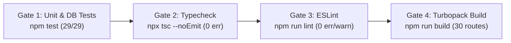

# Test Plan & Quality Assurance Strategy — TalentSphere

## 1. Quality Philosophy

In TalentSphere, tests make requirements concrete, measurable, and regression-proof. Every functional capability specified in `TalentSphere Project & Product Specification.md` and tracked in `IMPLEMENTATION_TRACKER.md` must be verifiable through automated unit tests, live database integration tests, and end-to-end browser journeys.

---

## 2. Test Execution Hierarchy

| Tier | Framework / Tool | Scope | Target Execution Time |
|------|-----------------|-------|-----------------------|
| **Unit Tests** | Node.js Test Runner (`node --test`) | Pure helper functions, formatting, XP calculations, utility validators (`src/utils/index.test.ts`) | < 50ms |
| **Database Integration** | Node.js Test Runner + `pg` / `@supabase/supabase-js` | Live PostgreSQL pooler queries, schema integrity, relational joins, foreign keys, RLS sanity (`tests/*.test.mjs`) | < 10s |
| **End-to-End (E2E)** | Playwright (`@playwright/test`) | Real browser user journeys, authentication flows, responsive breakpoints (`tests/e2e/`) | < 60s |

---

## 3. Verified Automated Test Suite (29 Tests Passing)

### A. Pure Unit Tests (14 Tests in `src/utils/index.test.ts`)
1. `getInitials` — extracts uppercase initials from names with multi-word and whitespace edge cases.
2. `truncate` — truncates strings to length limit and appends ellipsis.
3. `isValidEmail` — validates standard and edge-case email address formats.
4. `formatCurrency` — formats numbers into standard USD currency strings.
5. `calculateLevel` — computes gamification level from total XP earned based on progressive curve.
6. `getLevelDetails` — returns current level, min XP, max XP, and progress percentage.
7. `calculateProgress` — bounds progression values safely between 0% and 100%.
8. `slugify` — converts job titles and course names into URL-safe slugs.
9. `isEmpty` — correctly detects null, undefined, empty strings, empty arrays, and empty objects.
10. `safeJsonParse` — parses JSON strings and gracefully returns fallbacks on invalid syntax.
11. `formatFileSize` — formats byte numbers into KB, MB, and GB with single-decimal precision.
12. `extractYouTubeId` — extracts 11-character video IDs from full, short, and embed YouTube URLs.
13. `isValidUrl` — validates HTTP and HTTPS URLs while rejecting malformed inputs.
14. `cn` — merges Tailwind CSS classes and resolves conflicting utility classes via `clsx` and `tailwind-merge`.

### B. Live Supabase Pooler Integration Tests (15 Tests in `tests/*.test.mjs`)
1. **Pooler Connectivity**: Successfully links to Supabase pooler on port 5432/6543, validating PostgreSQL 17.6 environment.
2. **Schema Table Audit**: Verifies presence of all 46 core public tables.
3. **Candidate Profile Sub-Entities**: Validates columns on `candidate_profiles`, `skills`, `candidate_skills`, `experience`, `education`, `certifications`, `portfolio_items`.
4. **Jobs & Organization Join**: Executes join between `jobs`, `users` (employer), and `organizations` without Postgres column resolution error 42703.
5. **LMS & Course Join**: Executes relational join between `courses`, `users` (instructor), and `organizations`.
6. **Candidate Profile & User Join**: Validates candidate profile join with `users` identity.
7. **Gamification Leaderboard Join**: Validates `user_levels` joined to `users` with total XP rankings.
8. **Direct Messaging Participation**: Validates `conversation_participants` join with `users` and `conversations`.
9. **Job Bookmarks**: Verifies bookmark constraints, columns (`id`, `user_id`, `job_id`), and foreign keys.
10. **Candidate Normalized Queries**: Queries sub-entity tables by candidate ID.
11. **Gamification Ledger & Balance**: Queries `xp_ledger` idempotency columns and `user_levels`.
12. **Hiring Pipeline Stages**: Verifies default 7-stage configuration in correct sequential order (`order_index`).
13. **Applications Multi-Table Join**: Validates application join with `candidate_profiles`, `users`, and `hiring_pipeline_stages`.
14. **Application Audit Trail**: Verifies `application_activity_log` schema, transition reasons, and reviewer metadata.
15. **Structured Scorecards**: Queries `scorecards` schema, criteria rubrics (1–5), recommendation enums, and private notes.

---

## 4. Playwright End-to-End Test Matrix (`tests/e2e/`)

### A. Authentication Journeys (`auth.spec.ts`)
- User signup with email/password validation.
- User signin with valid credentials and session redirect to `/dashboard`.
- Invalid credentials error state presentation.
- Unauthenticated access to protected route (`/dashboard`) redirected to `/auth/signin?redirect=/dashboard`.
- Authenticated user visiting `/auth/signin` redirected to `/dashboard`.
- Signout clears cookie session and redirects to landing page.

### B. Job Search & Application Flows (`jobs.spec.ts`)
- Browse job listings on `/jobs` with pagination / load more.
- Filter jobs by type (Full-time, Part-time, Remote, Contract).
- Real-time debounced keyword search against job titles and descriptions.
- Job detail page (`/jobs/[id]`) display with requirements and salary ranges.
- Job application submission with cover letter modal.
- Job bookmark toggle state persistence.

### C. Responsive Design Breakpoints (`responsive.spec.ts`)
- Mobile viewport (375px): Hamburger navigation drawer, single-column cards, full-width buttons.
- Tablet viewport (768px): Two-column job grids, responsive modal dialogs.
- Desktop viewport (1280px+): Persistent sidebar navigation, multi-column Kanban board, full Code Arena split pane.

---

## 5. Continuous Integration & Quality Gates

Every pull request and build must pass all four gates with zero warnings:



### Execution Commands
```bash
# 1. Run all 29 unit and live database integration tests
npm test

# 2. Verify strict TypeScript compliance
npx tsc --noEmit

# 3. Verify zero lint errors or warnings
npm run lint

# 4. Compile all 30 App Router routes
npm run build

# 5. Run end-to-end browser tests
npx playwright test
```

---

## 6. Pre-Production Manual QA Checklist

### Domain Verification Checklist
- [x] **Authentication**: Sign in, sign up, password reset, and email verification routes render with validation.
- [x] **Dashboard**: Candidate view displays XP level; recruiter view displays active pipeline summary.
- [x] **Job Board**: Filtering by job type, remote toggle, and salary range updates listings properly.
- [x] **Application Tracking**: Candidate can view status progression; recruiter can view applicants.
- [x] **Code Arena**: Challenge catalog lists problems; Monaco editor workspace loads syntax highlighting and starter code.
- [x] **LMS**: Course player loads video embed, lesson curriculum sidebar, and completion toggle.
- [x] **Leaderboard**: Displays user rankings by weekly, monthly, and all-time XP.
- [x] **Direct Messaging**: Conversation thread UI displays chat bubbles and message composer.
- [x] **Notifications**: Notification list renders with type badges and unread indicators.
- [x] **Profile**: Candidate profile displays career history, education, skills, and portfolio items.
- [x] **Admin Suite**: User moderation, course catalog, roles, and system health pages render for admin role.

---

*Test Plan v2.0.0 — TalentSphere Quality Assurance Specification*
