# Module Graphs (linked subgraphs of the master graph)

One diagram per API module: screens that call it, its endpoints, the domain rules and persistence it reaches. Node labels carry the master-graph IDs. Edge labels are the relationship types. Generated; do not edit.

## activity (MOD-086)

5 endpoints, 0 durable, 5 ephemeral. Green border = durable, yellow = ephemeral.

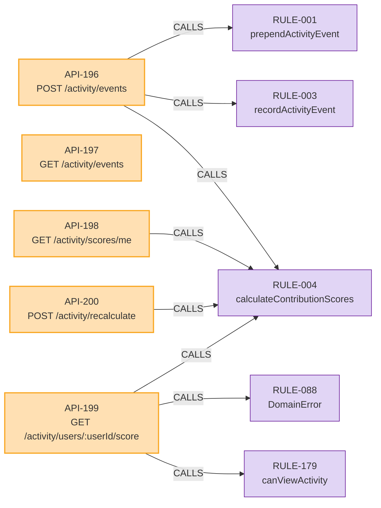
```mermaid
flowchart LR
  API_196["API-196<br/>POST /activity/events"]:::eph
  RULE_001["RULE-001<br/>prependActivityEvent"]:::logic
  API_196 -->|CALLS| RULE_001
  RULE_003["RULE-003<br/>recordActivityEvent"]:::logic
  API_196 -->|CALLS| RULE_003
  RULE_004["RULE-004<br/>calculateContributionScores"]:::logic
  API_196 -->|CALLS| RULE_004
  API_197["API-197<br/>GET /activity/events"]:::eph
  API_198["API-198<br/>GET /activity/scores/me"]:::eph
  API_198 -->|CALLS| RULE_004
  API_199["API-199<br/>GET /activity/users/:userId/score"]:::eph
  API_199 -->|CALLS| RULE_004
  RULE_088["RULE-088<br/>DomainError"]:::logic
  API_199 -->|CALLS| RULE_088
  RULE_179["RULE-179<br/>canViewActivity"]:::logic
  API_199 -->|CALLS| RULE_179
  API_200["API-200<br/>POST /activity/recalculate"]:::eph
  API_200 -->|CALLS| RULE_004
  classDef dur fill:#ffe0b3,stroke:#2e7d32,stroke-width:2px;
  classDef eph fill:#ffe0b3,stroke:#f9a825,stroke-width:2px;
  classDef ui fill:#cfe2ff,stroke:#1565c0;
  classDef logic fill:#e1d5f5,stroke:#6a1b9a;
  classDef data fill:#c8ece8,stroke:#00796b;
```

## admin (MOD-091)

8 endpoints, 3 durable, 5 ephemeral. Green border = durable, yellow = ephemeral.

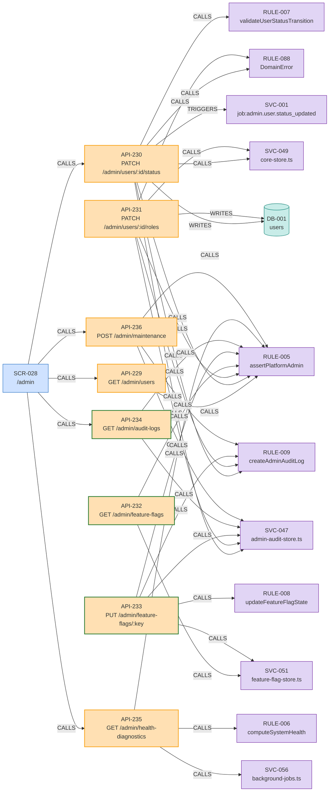
```mermaid
flowchart LR
  API_229["API-229<br/>GET /admin/users"]:::eph
  SCR_028["SCR-028<br/>/admin"]:::ui
  SCR_028 -->|CALLS| API_229
  RULE_005["RULE-005<br/>assertPlatformAdmin"]:::logic
  API_229 -->|CALLS| RULE_005
  API_230["API-230<br/>PATCH /admin/users/:id/status"]:::eph
  SCR_028 -->|CALLS| API_230
  API_230 -->|CALLS| RULE_005
  RULE_007["RULE-007<br/>validateUserStatusTransition"]:::logic
  API_230 -->|CALLS| RULE_007
  RULE_009["RULE-009<br/>createAdminAuditLog"]:::logic
  API_230 -->|CALLS| RULE_009
  RULE_088["RULE-088<br/>DomainError"]:::logic
  API_230 -->|CALLS| RULE_088
  SVC_047["SVC-047<br/>admin-audit-store.ts"]:::logic
  API_230 -->|CALLS| SVC_047
  SVC_049["SVC-049<br/>core-store.ts"]:::logic
  API_230 -->|CALLS| SVC_049
  DB_001[("DB-001<br/>users")]:::data
  API_230 -->|WRITES| DB_001
  SVC_001["SVC-001<br/>job:admin.user.status_updated"]:::logic
  API_230 -->|TRIGGERS| SVC_001
  API_231["API-231<br/>PATCH /admin/users/:id/roles"]:::eph
  API_231 -->|CALLS| RULE_005
  API_231 -->|CALLS| RULE_009
  API_231 -->|CALLS| RULE_088
  API_231 -->|CALLS| SVC_047
  API_231 -->|CALLS| SVC_049
  API_231 -->|WRITES| DB_001
  API_232["API-232<br/>GET /admin/feature-flags"]:::dur
  API_232 -->|CALLS| RULE_005
  SVC_051["SVC-051<br/>feature-flag-store.ts"]:::logic
  API_232 -->|CALLS| SVC_051
  API_233["API-233<br/>PUT /admin/feature-flags/:key"]:::dur
  API_233 -->|CALLS| RULE_005
  RULE_008["RULE-008<br/>updateFeatureFlagState"]:::logic
  API_233 -->|CALLS| RULE_008
  API_233 -->|CALLS| RULE_009
  API_233 -->|CALLS| SVC_047
  API_233 -->|CALLS| SVC_051
  API_234["API-234<br/>GET /admin/audit-logs"]:::dur
  SCR_028 -->|CALLS| API_234
  API_234 -->|CALLS| RULE_005
  API_234 -->|CALLS| SVC_047
  API_235["API-235<br/>GET /admin/health-diagnostics"]:::eph
  SCR_028 -->|CALLS| API_235
  API_235 -->|CALLS| RULE_005
  RULE_006["RULE-006<br/>computeSystemHealth"]:::logic
  API_235 -->|CALLS| RULE_006
  SVC_056["SVC-056<br/>background-jobs.ts"]:::logic
  API_235 -->|CALLS| SVC_056
  API_236["API-236<br/>POST /admin/maintenance"]:::eph
  SCR_028 -->|CALLS| API_236
  API_236 -->|CALLS| RULE_005
  API_236 -->|CALLS| RULE_009
  API_236 -->|CALLS| SVC_047
  classDef dur fill:#ffe0b3,stroke:#2e7d32,stroke-width:2px;
  classDef eph fill:#ffe0b3,stroke:#f9a825,stroke-width:2px;
  classDef ui fill:#cfe2ff,stroke:#1565c0;
  classDef logic fill:#e1d5f5,stroke:#6a1b9a;
  classDef data fill:#c8ece8,stroke:#00796b;
```

## ai (MOD-069)

6 endpoints, 0 durable, 6 ephemeral. Green border = durable, yellow = ephemeral.

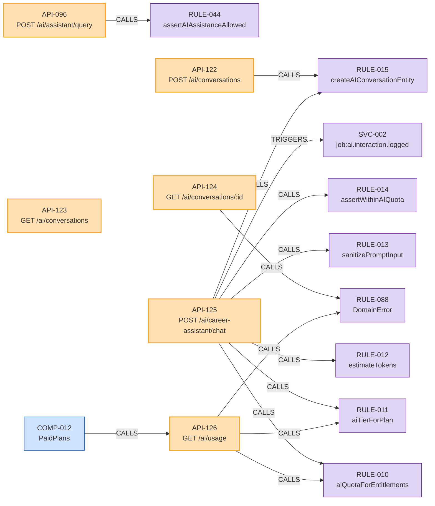
```mermaid
flowchart LR
  API_096["API-096<br/>POST /ai/assistant/query"]:::eph
  RULE_044["RULE-044<br/>assertAIAssistanceAllowed"]:::logic
  API_096 -->|CALLS| RULE_044
  API_122["API-122<br/>POST /ai/conversations"]:::eph
  RULE_015["RULE-015<br/>createAIConversationEntity"]:::logic
  API_122 -->|CALLS| RULE_015
  API_123["API-123<br/>GET /ai/conversations"]:::eph
  API_124["API-124<br/>GET /ai/conversations/:id"]:::eph
  RULE_088["RULE-088<br/>DomainError"]:::logic
  API_124 -->|CALLS| RULE_088
  API_125["API-125<br/>POST /ai/career-assistant/chat"]:::eph
  RULE_010["RULE-010<br/>aiQuotaForEntitlements"]:::logic
  API_125 -->|CALLS| RULE_010
  RULE_011["RULE-011<br/>aiTierForPlan"]:::logic
  API_125 -->|CALLS| RULE_011
  RULE_012["RULE-012<br/>estimateTokens"]:::logic
  API_125 -->|CALLS| RULE_012
  RULE_013["RULE-013<br/>sanitizePromptInput"]:::logic
  API_125 -->|CALLS| RULE_013
  RULE_014["RULE-014<br/>assertWithinAIQuota"]:::logic
  API_125 -->|CALLS| RULE_014
  API_125 -->|CALLS| RULE_015
  SVC_002["SVC-002<br/>job:ai.interaction.logged"]:::logic
  API_125 -->|TRIGGERS| SVC_002
  API_126["API-126<br/>GET /ai/usage"]:::eph
  COMP_012["COMP-012<br/>PaidPlans"]:::ui
  COMP_012 -->|CALLS| API_126
  API_126 -->|CALLS| RULE_010
  API_126 -->|CALLS| RULE_011
  API_126 -->|CALLS| RULE_088
  classDef dur fill:#ffe0b3,stroke:#2e7d32,stroke-width:2px;
  classDef eph fill:#ffe0b3,stroke:#f9a825,stroke-width:2px;
  classDef ui fill:#cfe2ff,stroke:#1565c0;
  classDef logic fill:#e1d5f5,stroke:#6a1b9a;
  classDef data fill:#c8ece8,stroke:#00796b;
```

## alumni (MOD-085)

11 endpoints, 0 durable, 11 ephemeral. Green border = durable, yellow = ephemeral.

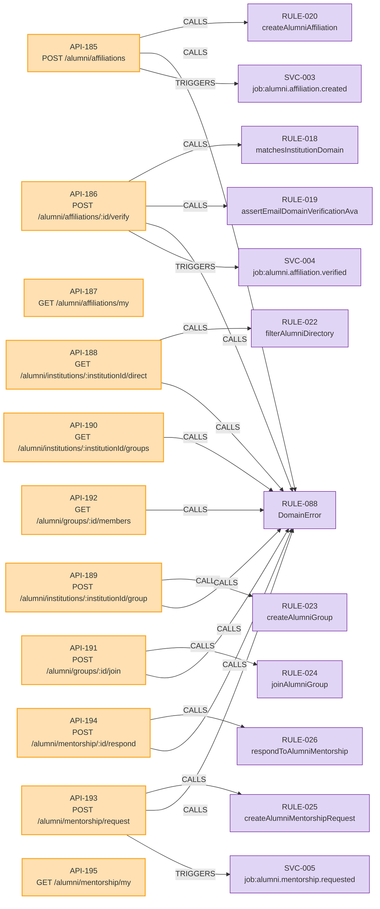
```mermaid
flowchart LR
  API_185["API-185<br/>POST /alumni/affiliations"]:::eph
  RULE_020["RULE-020<br/>createAlumniAffiliation"]:::logic
  API_185 -->|CALLS| RULE_020
  RULE_088["RULE-088<br/>DomainError"]:::logic
  API_185 -->|CALLS| RULE_088
  SVC_003["SVC-003<br/>job:alumni.affiliation.created"]:::logic
  API_185 -->|TRIGGERS| SVC_003
  API_186["API-186<br/>POST /alumni/affiliations/:id/verify"]:::eph
  RULE_018["RULE-018<br/>matchesInstitutionDomain"]:::logic
  API_186 -->|CALLS| RULE_018
  RULE_019["RULE-019<br/>assertEmailDomainVerificationAva"]:::logic
  API_186 -->|CALLS| RULE_019
  API_186 -->|CALLS| RULE_088
  SVC_004["SVC-004<br/>job:alumni.affiliation.verified"]:::logic
  API_186 -->|TRIGGERS| SVC_004
  API_187["API-187<br/>GET /alumni/affiliations/my"]:::eph
  API_188["API-188<br/>GET /alumni/institutions/:institutionId/direct"]:::eph
  RULE_022["RULE-022<br/>filterAlumniDirectory"]:::logic
  API_188 -->|CALLS| RULE_022
  API_188 -->|CALLS| RULE_088
  API_189["API-189<br/>POST /alumni/institutions/:institutionId/group"]:::eph
  RULE_023["RULE-023<br/>createAlumniGroup"]:::logic
  API_189 -->|CALLS| RULE_023
  API_189 -->|CALLS| RULE_088
  API_190["API-190<br/>GET /alumni/institutions/:institutionId/groups"]:::eph
  API_190 -->|CALLS| RULE_088
  API_191["API-191<br/>POST /alumni/groups/:id/join"]:::eph
  RULE_024["RULE-024<br/>joinAlumniGroup"]:::logic
  API_191 -->|CALLS| RULE_024
  API_191 -->|CALLS| RULE_088
  API_192["API-192<br/>GET /alumni/groups/:id/members"]:::eph
  API_192 -->|CALLS| RULE_088
  API_193["API-193<br/>POST /alumni/mentorship/request"]:::eph
  RULE_025["RULE-025<br/>createAlumniMentorshipRequest"]:::logic
  API_193 -->|CALLS| RULE_025
  API_193 -->|CALLS| RULE_088
  SVC_005["SVC-005<br/>job:alumni.mentorship.requested"]:::logic
  API_193 -->|TRIGGERS| SVC_005
  API_194["API-194<br/>POST /alumni/mentorship/:id/respond"]:::eph
  RULE_026["RULE-026<br/>respondToAlumniMentorship"]:::logic
  API_194 -->|CALLS| RULE_026
  API_194 -->|CALLS| RULE_088
  API_195["API-195<br/>GET /alumni/mentorship/my"]:::eph
  classDef dur fill:#ffe0b3,stroke:#2e7d32,stroke-width:2px;
  classDef eph fill:#ffe0b3,stroke:#f9a825,stroke-width:2px;
  classDef ui fill:#cfe2ff,stroke:#1565c0;
  classDef logic fill:#e1d5f5,stroke:#6a1b9a;
  classDef data fill:#c8ece8,stroke:#00796b;
```

## analytics (MOD-094)

3 endpoints, 0 durable, 3 ephemeral. Green border = durable, yellow = ephemeral.

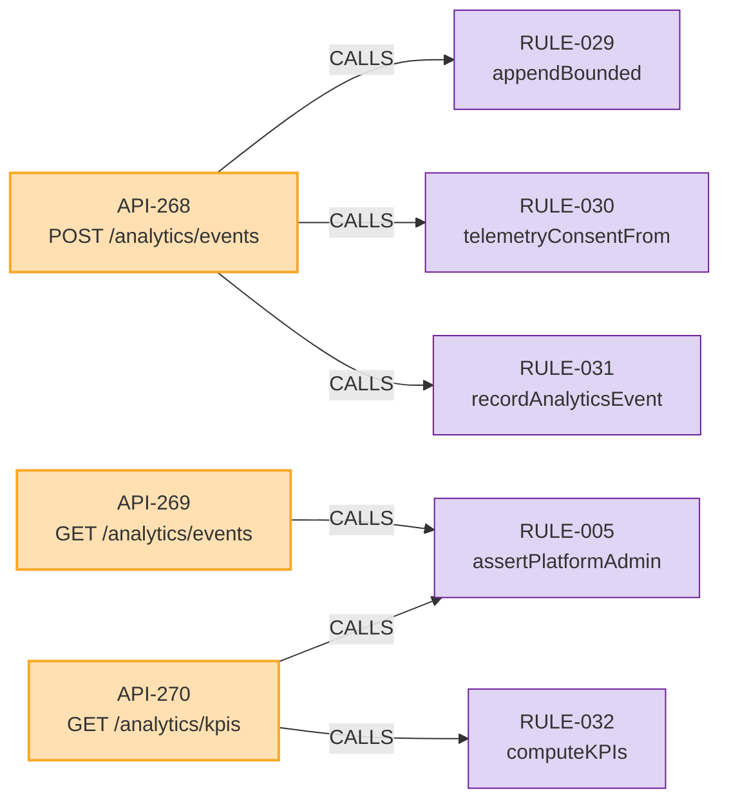
```mermaid
flowchart LR
  API_268["API-268<br/>POST /analytics/events"]:::eph
  RULE_029["RULE-029<br/>appendBounded"]:::logic
  API_268 -->|CALLS| RULE_029
  RULE_030["RULE-030<br/>telemetryConsentFrom"]:::logic
  API_268 -->|CALLS| RULE_030
  RULE_031["RULE-031<br/>recordAnalyticsEvent"]:::logic
  API_268 -->|CALLS| RULE_031
  API_269["API-269<br/>GET /analytics/events"]:::eph
  RULE_005["RULE-005<br/>assertPlatformAdmin"]:::logic
  API_269 -->|CALLS| RULE_005
  API_270["API-270<br/>GET /analytics/kpis"]:::eph
  API_270 -->|CALLS| RULE_005
  RULE_032["RULE-032<br/>computeKPIs"]:::logic
  API_270 -->|CALLS| RULE_032
  classDef dur fill:#ffe0b3,stroke:#2e7d32,stroke-width:2px;
  classDef eph fill:#ffe0b3,stroke:#f9a825,stroke-width:2px;
  classDef ui fill:#cfe2ff,stroke:#1565c0;
  classDef logic fill:#e1d5f5,stroke:#6a1b9a;
  classDef data fill:#c8ece8,stroke:#00796b;
```

## applications (MOD-063)

7 endpoints, 4 durable, 3 ephemeral. Green border = durable, yellow = ephemeral.

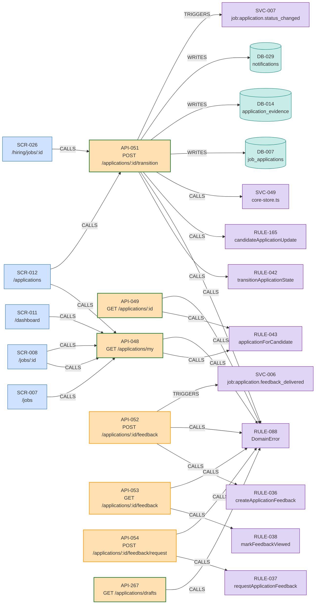
```mermaid
flowchart LR
  API_048["API-048<br/>GET /applications/my"]:::dur
  SCR_007["SCR-007<br/>/jobs"]:::ui
  SCR_007 -->|CALLS| API_048
  SCR_008["SCR-008<br/>/jobs/:id"]:::ui
  SCR_008 -->|CALLS| API_048
  SCR_008 -->|CALLS| API_048
  SCR_011["SCR-011<br/>/dashboard"]:::ui
  SCR_011 -->|CALLS| API_048
  SCR_012["SCR-012<br/>/applications"]:::ui
  SCR_012 -->|CALLS| API_048
  RULE_043["RULE-043<br/>applicationForCandidate"]:::logic
  API_048 -->|CALLS| RULE_043
  RULE_088["RULE-088<br/>DomainError"]:::logic
  API_048 -->|CALLS| RULE_088
  API_049["API-049<br/>GET /applications/:id"]:::dur
  API_049 -->|CALLS| RULE_043
  API_049 -->|CALLS| RULE_088
  API_051["API-051<br/>POST /applications/:id/transition"]:::dur
  SCR_012 -->|CALLS| API_051
  SCR_026["SCR-026<br/>/hiring/jobs/:id"]:::ui
  SCR_026 -->|CALLS| API_051
  RULE_042["RULE-042<br/>transitionApplicationState"]:::logic
  API_051 -->|CALLS| RULE_042
  API_051 -->|CALLS| RULE_088
  RULE_165["RULE-165<br/>candidateApplicationUpdate"]:::logic
  API_051 -->|CALLS| RULE_165
  SVC_049["SVC-049<br/>core-store.ts"]:::logic
  API_051 -->|CALLS| SVC_049
  DB_007[("DB-007<br/>job_applications")]:::data
  API_051 -->|WRITES| DB_007
  DB_014[("DB-014<br/>application_evidence")]:::data
  API_051 -->|WRITES| DB_014
  DB_029[("DB-029<br/>notifications")]:::data
  API_051 -->|WRITES| DB_029
  SVC_007["SVC-007<br/>job:application.status_changed"]:::logic
  API_051 -->|TRIGGERS| SVC_007
  API_052["API-052<br/>POST /applications/:id/feedback"]:::eph
  RULE_036["RULE-036<br/>createApplicationFeedback"]:::logic
  API_052 -->|CALLS| RULE_036
  API_052 -->|CALLS| RULE_088
  SVC_006["SVC-006<br/>job:application.feedback_delivered"]:::logic
  API_052 -->|TRIGGERS| SVC_006
  API_053["API-053<br/>GET /applications/:id/feedback"]:::eph
  RULE_038["RULE-038<br/>markFeedbackViewed"]:::logic
  API_053 -->|CALLS| RULE_038
  API_053 -->|CALLS| RULE_088
  API_054["API-054<br/>POST /applications/:id/feedback/request"]:::eph
  RULE_037["RULE-037<br/>requestApplicationFeedback"]:::logic
  API_054 -->|CALLS| RULE_037
  API_054 -->|CALLS| RULE_088
  API_267["API-267<br/>GET /applications/drafts"]:::dur
  API_267 -->|CALLS| RULE_088
  classDef dur fill:#ffe0b3,stroke:#2e7d32,stroke-width:2px;
  classDef eph fill:#ffe0b3,stroke:#f9a825,stroke-width:2px;
  classDef ui fill:#cfe2ff,stroke:#1565c0;
  classDef logic fill:#e1d5f5,stroke:#6a1b9a;
  classDef data fill:#c8ece8,stroke:#00796b;
```

## auth (MOD-055)

6 endpoints, 6 durable, 0 ephemeral. Green border = durable, yellow = ephemeral.

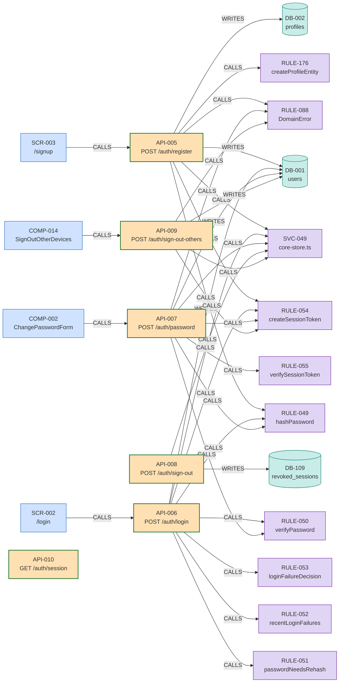
```mermaid
flowchart LR
  API_005["API-005<br/>POST /auth/register"]:::dur
  SCR_003["SCR-003<br/>/signup"]:::ui
  SCR_003 -->|CALLS| API_005
  RULE_049["RULE-049<br/>hashPassword"]:::logic
  API_005 -->|CALLS| RULE_049
  RULE_054["RULE-054<br/>createSessionToken"]:::logic
  API_005 -->|CALLS| RULE_054
  RULE_088["RULE-088<br/>DomainError"]:::logic
  API_005 -->|CALLS| RULE_088
  RULE_176["RULE-176<br/>createProfileEntity"]:::logic
  API_005 -->|CALLS| RULE_176
  SVC_049["SVC-049<br/>core-store.ts"]:::logic
  API_005 -->|CALLS| SVC_049
  DB_001[("DB-001<br/>users")]:::data
  API_005 -->|WRITES| DB_001
  DB_002[("DB-002<br/>profiles")]:::data
  API_005 -->|WRITES| DB_002
  API_006["API-006<br/>POST /auth/login"]:::dur
  SCR_002["SCR-002<br/>/login"]:::ui
  SCR_002 -->|CALLS| API_006
  API_006 -->|CALLS| RULE_049
  RULE_050["RULE-050<br/>verifyPassword"]:::logic
  API_006 -->|CALLS| RULE_050
  RULE_051["RULE-051<br/>passwordNeedsRehash"]:::logic
  API_006 -->|CALLS| RULE_051
  RULE_052["RULE-052<br/>recentLoginFailures"]:::logic
  API_006 -->|CALLS| RULE_052
  RULE_053["RULE-053<br/>loginFailureDecision"]:::logic
  API_006 -->|CALLS| RULE_053
  API_006 -->|CALLS| RULE_054
  API_006 -->|CALLS| SVC_049
  API_006 -->|WRITES| DB_001
  API_007["API-007<br/>POST /auth/password"]:::dur
  COMP_002["COMP-002<br/>ChangePasswordForm"]:::ui
  COMP_002 -->|CALLS| API_007
  API_007 -->|CALLS| RULE_049
  API_007 -->|CALLS| RULE_050
  API_007 -->|CALLS| RULE_054
  RULE_055["RULE-055<br/>verifySessionToken"]:::logic
  API_007 -->|CALLS| RULE_055
  API_007 -->|CALLS| RULE_088
  API_007 -->|CALLS| SVC_049
  API_007 -->|WRITES| DB_001
  API_008["API-008<br/>POST /auth/sign-out"]:::dur
  API_008 -->|CALLS| SVC_049
  DB_109[("DB-109<br/>revoked_sessions")]:::data
  API_008 -->|WRITES| DB_109
  API_009["API-009<br/>POST /auth/sign-out-others"]:::dur
  COMP_014["COMP-014<br/>SignOutOtherDevices"]:::ui
  COMP_014 -->|CALLS| API_009
  API_009 -->|CALLS| RULE_054
  API_009 -->|CALLS| RULE_088
  API_009 -->|CALLS| SVC_049
  API_009 -->|WRITES| DB_001
  API_010["API-010<br/>GET /auth/session"]:::dur
  classDef dur fill:#ffe0b3,stroke:#2e7d32,stroke-width:2px;
  classDef eph fill:#ffe0b3,stroke:#f9a825,stroke-width:2px;
  classDef ui fill:#cfe2ff,stroke:#1565c0;
  classDef logic fill:#e1d5f5,stroke:#6a1b9a;
  classDef data fill:#c8ece8,stroke:#00796b;
```

## billing (MOD-090)

12 endpoints, 12 durable, 0 ephemeral. Green border = durable, yellow = ephemeral.

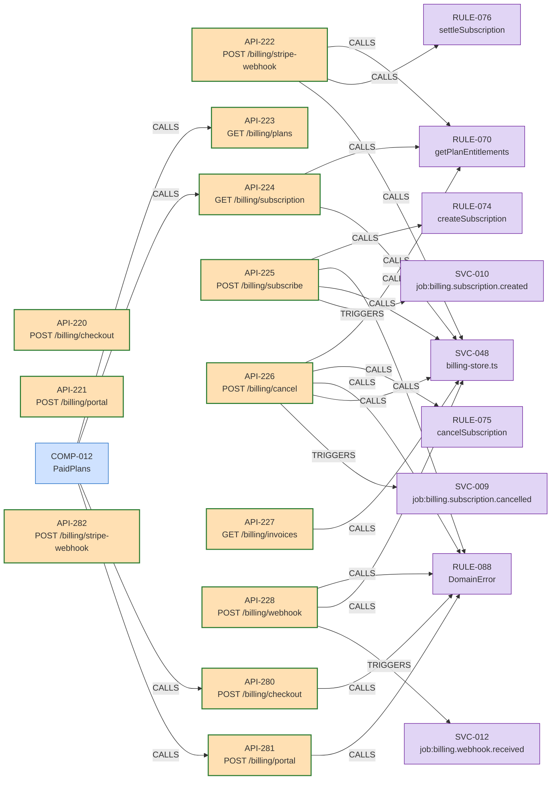
```mermaid
flowchart LR
  API_220["API-220<br/>POST /billing/checkout"]:::dur
  API_221["API-221<br/>POST /billing/portal"]:::dur
  API_222["API-222<br/>POST /billing/stripe-webhook"]:::dur
  RULE_070["RULE-070<br/>getPlanEntitlements"]:::logic
  API_222 -->|CALLS| RULE_070
  RULE_076["RULE-076<br/>settleSubscription"]:::logic
  API_222 -->|CALLS| RULE_076
  SVC_048["SVC-048<br/>billing-store.ts"]:::logic
  API_222 -->|CALLS| SVC_048
  API_223["API-223<br/>GET /billing/plans"]:::dur
  COMP_012["COMP-012<br/>PaidPlans"]:::ui
  COMP_012 -->|CALLS| API_223
  API_224["API-224<br/>GET /billing/subscription"]:::dur
  COMP_012 -->|CALLS| API_224
  API_224 -->|CALLS| RULE_070
  API_224 -->|CALLS| SVC_048
  API_225["API-225<br/>POST /billing/subscribe"]:::dur
  RULE_074["RULE-074<br/>createSubscription"]:::logic
  API_225 -->|CALLS| RULE_074
  RULE_088["RULE-088<br/>DomainError"]:::logic
  API_225 -->|CALLS| RULE_088
  API_225 -->|CALLS| SVC_048
  SVC_010["SVC-010<br/>job:billing.subscription.created"]:::logic
  API_225 -->|TRIGGERS| SVC_010
  API_226["API-226<br/>POST /billing/cancel"]:::dur
  API_226 -->|CALLS| RULE_070
  RULE_075["RULE-075<br/>cancelSubscription"]:::logic
  API_226 -->|CALLS| RULE_075
  API_226 -->|CALLS| RULE_088
  API_226 -->|CALLS| SVC_048
  SVC_009["SVC-009<br/>job:billing.subscription.cancelled"]:::logic
  API_226 -->|TRIGGERS| SVC_009
  API_227["API-227<br/>GET /billing/invoices"]:::dur
  API_227 -->|CALLS| SVC_048
  API_228["API-228<br/>POST /billing/webhook"]:::dur
  API_228 -->|CALLS| RULE_088
  API_228 -->|CALLS| SVC_048
  SVC_012["SVC-012<br/>job:billing.webhook.received"]:::logic
  API_228 -->|TRIGGERS| SVC_012
  API_280["API-280<br/>POST /billing/checkout"]:::dur
  COMP_012 -->|CALLS| API_280
  API_280 -->|CALLS| RULE_088
  API_281["API-281<br/>POST /billing/portal"]:::dur
  COMP_012 -->|CALLS| API_281
  API_281 -->|CALLS| RULE_088
  API_282["API-282<br/>POST /billing/stripe-webhook"]:::dur
  classDef dur fill:#ffe0b3,stroke:#2e7d32,stroke-width:2px;
  classDef eph fill:#ffe0b3,stroke:#f9a825,stroke-width:2px;
  classDef ui fill:#cfe2ff,stroke:#1565c0;
  classDef logic fill:#e1d5f5,stroke:#6a1b9a;
  classDef data fill:#c8ece8,stroke:#00796b;
```

## candidates (MOD-065)

8 endpoints, 7 durable, 1 ephemeral. Green border = durable, yellow = ephemeral.

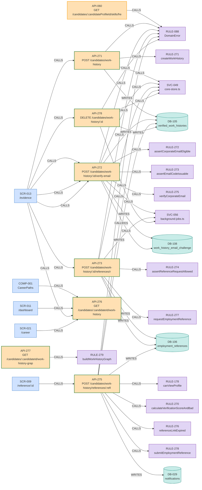
```mermaid
flowchart LR
  API_060["API-060<br/>GET /candidates/:candidateProfileId/skills/fre"]:::eph
  RULE_088["RULE-088<br/>DomainError"]:::logic
  API_060 -->|CALLS| RULE_088
  API_271["API-271<br/>POST /candidates/work-history"]:::dur
  SCR_013["SCR-013<br/>/evidence"]:::ui
  SCR_013 -->|CALLS| API_271
  API_271 -->|CALLS| RULE_088
  RULE_271["RULE-271<br/>createWorkHistory"]:::logic
  API_271 -->|CALLS| RULE_271
  SVC_049["SVC-049<br/>core-store.ts"]:::logic
  API_271 -->|CALLS| SVC_049
  DB_105[("DB-105<br/>verified_work_histories")]:::data
  API_271 -->|WRITES| DB_105
  API_272["API-272<br/>POST /candidates/work-history/:id/verify-email"]:::dur
  SCR_013 -->|CALLS| API_272
  SCR_013 -->|CALLS| API_272
  SCR_013 -->|CALLS| API_272
  API_272 -->|CALLS| RULE_088
  RULE_272["RULE-272<br/>assertCorporateEmailEligible"]:::logic
  API_272 -->|CALLS| RULE_272
  RULE_273["RULE-273<br/>assertEmailCodeIssuable"]:::logic
  API_272 -->|CALLS| RULE_273
  RULE_275["RULE-275<br/>verifyCorporateEmail"]:::logic
  API_272 -->|CALLS| RULE_275
  API_272 -->|CALLS| SVC_049
  SVC_056["SVC-056<br/>background-jobs.ts"]:::logic
  API_272 -->|CALLS| SVC_056
  API_272 -->|WRITES| DB_105
  DB_108[("DB-108<br/>work_history_email_challenge")]:::data
  API_272 -->|WRITES| DB_108
  API_272 -->|WRITES| DB_108
  API_273["API-273<br/>POST /candidates/work-history/:id/references/r"]:::dur
  SCR_013 -->|CALLS| API_273
  API_273 -->|CALLS| RULE_088
  RULE_274["RULE-274<br/>assertReferenceRequestAllowed"]:::logic
  API_273 -->|CALLS| RULE_274
  RULE_277["RULE-277<br/>requestEmploymentReference"]:::logic
  API_273 -->|CALLS| RULE_277
  API_273 -->|CALLS| SVC_049
  API_273 -->|CALLS| SVC_056
  DB_106[("DB-106<br/>employment_references")]:::data
  API_273 -->|WRITES| DB_106
  API_273 -->|WRITES| DB_106
  API_275["API-275<br/>POST /candidates/work-history/references/:refI"]:::dur
  SCR_009["SCR-009<br/>/reference/:id"]:::ui
  SCR_009 -->|CALLS| API_275
  API_275 -->|CALLS| RULE_088
  RULE_178["RULE-178<br/>canViewProfile"]:::logic
  API_275 -->|CALLS| RULE_178
  RULE_270["RULE-270<br/>calculateVerificationScoreAndBad"]:::logic
  API_275 -->|CALLS| RULE_270
  RULE_276["RULE-276<br/>referenceLinkExpired"]:::logic
  API_275 -->|CALLS| RULE_276
  RULE_278["RULE-278<br/>submitEmploymentReference"]:::logic
  API_275 -->|CALLS| RULE_278
  API_275 -->|CALLS| SVC_049
  DB_029[("DB-029<br/>notifications")]:::data
  API_275 -->|WRITES| DB_029
  API_275 -->|WRITES| DB_105
  API_275 -->|WRITES| DB_106
  API_276["API-276<br/>GET /candidates/:candidateId/work-history"]:::dur
  COMP_001["COMP-001<br/>CareerPaths"]:::ui
  COMP_001 -->|CALLS| API_276
  SCR_011["SCR-011<br/>/dashboard"]:::ui
  SCR_011 -->|CALLS| API_276
  SCR_013 -->|CALLS| API_276
  SCR_021["SCR-021<br/>/career"]:::ui
  SCR_021 -->|CALLS| API_276
  API_277["API-277<br/>GET /candidates/:candidateId/work-history-grap"]:::dur
  RULE_279["RULE-279<br/>buildWorkHistoryGraph"]:::logic
  API_277 -->|CALLS| RULE_279
  API_278["API-278<br/>DELETE /candidates/work-history/:id"]:::dur
  SCR_013 -->|CALLS| API_278
  API_278 -->|CALLS| RULE_088
  API_278 -->|CALLS| SVC_049
  API_278 -->|CALLS| SVC_056
  API_278 -->|WRITES| DB_105
  classDef dur fill:#ffe0b3,stroke:#2e7d32,stroke-width:2px;
  classDef eph fill:#ffe0b3,stroke:#f9a825,stroke-width:2px;
  classDef ui fill:#cfe2ff,stroke:#1565c0;
  classDef logic fill:#e1d5f5,stroke:#6a1b9a;
  classDef data fill:#c8ece8,stroke:#00796b;
```

## career (MOD-082)

6 endpoints, 0 durable, 6 ephemeral. Green border = durable, yellow = ephemeral.

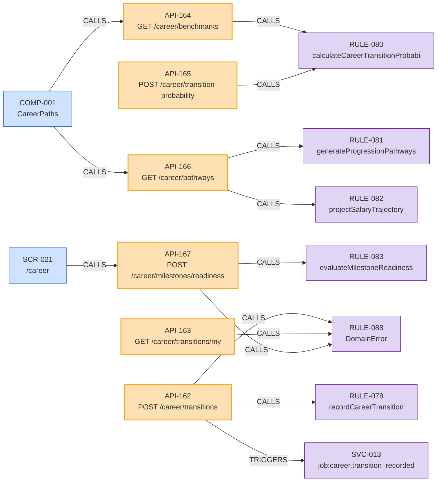
```mermaid
flowchart LR
  API_162["API-162<br/>POST /career/transitions"]:::eph
  RULE_078["RULE-078<br/>recordCareerTransition"]:::logic
  API_162 -->|CALLS| RULE_078
  RULE_088["RULE-088<br/>DomainError"]:::logic
  API_162 -->|CALLS| RULE_088
  SVC_013["SVC-013<br/>job:career.transition_recorded"]:::logic
  API_162 -->|TRIGGERS| SVC_013
  API_163["API-163<br/>GET /career/transitions/my"]:::eph
  API_163 -->|CALLS| RULE_088
  API_164["API-164<br/>GET /career/benchmarks"]:::eph
  COMP_001["COMP-001<br/>CareerPaths"]:::ui
  COMP_001 -->|CALLS| API_164
  RULE_080["RULE-080<br/>calculateCareerTransitionProbabi"]:::logic
  API_164 -->|CALLS| RULE_080
  API_165["API-165<br/>POST /career/transition-probability"]:::eph
  API_165 -->|CALLS| RULE_080
  API_166["API-166<br/>GET /career/pathways"]:::eph
  COMP_001 -->|CALLS| API_166
  RULE_081["RULE-081<br/>generateProgressionPathways"]:::logic
  API_166 -->|CALLS| RULE_081
  RULE_082["RULE-082<br/>projectSalaryTrajectory"]:::logic
  API_166 -->|CALLS| RULE_082
  API_167["API-167<br/>POST /career/milestones/readiness"]:::eph
  SCR_021["SCR-021<br/>/career"]:::ui
  SCR_021 -->|CALLS| API_167
  RULE_083["RULE-083<br/>evaluateMilestoneReadiness"]:::logic
  API_167 -->|CALLS| RULE_083
  API_167 -->|CALLS| RULE_088
  classDef dur fill:#ffe0b3,stroke:#2e7d32,stroke-width:2px;
  classDef eph fill:#ffe0b3,stroke:#f9a825,stroke-width:2px;
  classDef ui fill:#cfe2ff,stroke:#1565c0;
  classDef logic fill:#e1d5f5,stroke:#6a1b9a;
  classDef data fill:#c8ece8,stroke:#00796b;
```

## certificates (MOD-074)

4 endpoints, 0 durable, 4 ephemeral. Green border = durable, yellow = ephemeral.

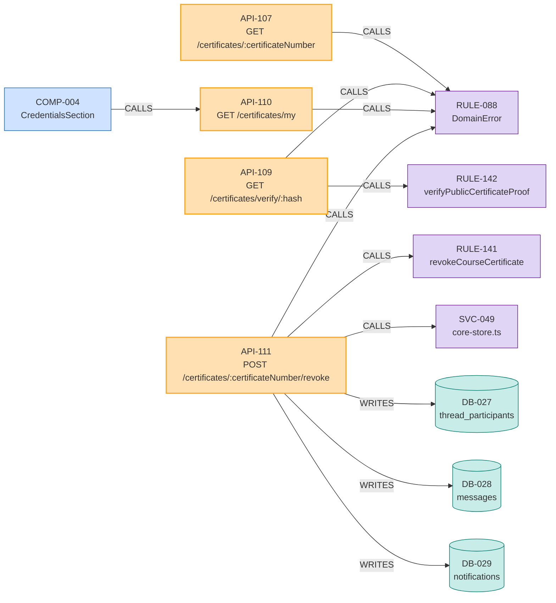
```mermaid
flowchart LR
  API_107["API-107<br/>GET /certificates/:certificateNumber"]:::eph
  RULE_088["RULE-088<br/>DomainError"]:::logic
  API_107 -->|CALLS| RULE_088
  API_109["API-109<br/>GET /certificates/verify/:hash"]:::eph
  API_109 -->|CALLS| RULE_088
  RULE_142["RULE-142<br/>verifyPublicCertificateProof"]:::logic
  API_109 -->|CALLS| RULE_142
  API_110["API-110<br/>GET /certificates/my"]:::eph
  COMP_004["COMP-004<br/>CredentialsSection"]:::ui
  COMP_004 -->|CALLS| API_110
  API_110 -->|CALLS| RULE_088
  API_111["API-111<br/>POST /certificates/:certificateNumber/revoke"]:::eph
  API_111 -->|CALLS| RULE_088
  RULE_141["RULE-141<br/>revokeCourseCertificate"]:::logic
  API_111 -->|CALLS| RULE_141
  SVC_049["SVC-049<br/>core-store.ts"]:::logic
  API_111 -->|CALLS| SVC_049
  DB_027[("DB-027<br/>thread_participants")]:::data
  API_111 -->|WRITES| DB_027
  DB_028[("DB-028<br/>messages")]:::data
  API_111 -->|WRITES| DB_028
  DB_029[("DB-029<br/>notifications")]:::data
  API_111 -->|WRITES| DB_029
  classDef dur fill:#ffe0b3,stroke:#2e7d32,stroke-width:2px;
  classDef eph fill:#ffe0b3,stroke:#f9a825,stroke-width:2px;
  classDef ui fill:#cfe2ff,stroke:#1565c0;
  classDef logic fill:#e1d5f5,stroke:#6a1b9a;
  classDef data fill:#c8ece8,stroke:#00796b;
```

## challenges (MOD-068)

5 endpoints, 0 durable, 5 ephemeral. Green border = durable, yellow = ephemeral.

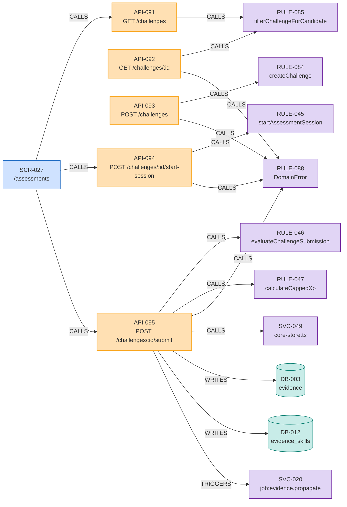
```mermaid
flowchart LR
  API_091["API-091<br/>GET /challenges"]:::eph
  SCR_027["SCR-027<br/>/assessments"]:::ui
  SCR_027 -->|CALLS| API_091
  RULE_085["RULE-085<br/>filterChallengeForCandidate"]:::logic
  API_091 -->|CALLS| RULE_085
  API_092["API-092<br/>GET /challenges/:id"]:::eph
  API_092 -->|CALLS| RULE_085
  RULE_088["RULE-088<br/>DomainError"]:::logic
  API_092 -->|CALLS| RULE_088
  API_093["API-093<br/>POST /challenges"]:::eph
  RULE_084["RULE-084<br/>createChallenge"]:::logic
  API_093 -->|CALLS| RULE_084
  API_093 -->|CALLS| RULE_088
  API_094["API-094<br/>POST /challenges/:id/start-session"]:::eph
  SCR_027 -->|CALLS| API_094
  RULE_045["RULE-045<br/>startAssessmentSession"]:::logic
  API_094 -->|CALLS| RULE_045
  API_094 -->|CALLS| RULE_088
  API_095["API-095<br/>POST /challenges/:id/submit"]:::eph
  SCR_027 -->|CALLS| API_095
  RULE_046["RULE-046<br/>evaluateChallengeSubmission"]:::logic
  API_095 -->|CALLS| RULE_046
  RULE_047["RULE-047<br/>calculateCappedXp"]:::logic
  API_095 -->|CALLS| RULE_047
  API_095 -->|CALLS| RULE_088
  SVC_049["SVC-049<br/>core-store.ts"]:::logic
  API_095 -->|CALLS| SVC_049
  DB_003[("DB-003<br/>evidence")]:::data
  API_095 -->|WRITES| DB_003
  DB_012[("DB-012<br/>evidence_skills")]:::data
  API_095 -->|WRITES| DB_012
  SVC_020["SVC-020<br/>job:evidence.propagate"]:::logic
  API_095 -->|TRIGGERS| SVC_020
  classDef dur fill:#ffe0b3,stroke:#2e7d32,stroke-width:2px;
  classDef eph fill:#ffe0b3,stroke:#f9a825,stroke-width:2px;
  classDef ui fill:#cfe2ff,stroke:#1565c0;
  classDef logic fill:#e1d5f5,stroke:#6a1b9a;
  classDef data fill:#c8ece8,stroke:#00796b;
```

## connections (MOD-079)

6 endpoints, 6 durable, 0 ephemeral. Green border = durable, yellow = ephemeral.

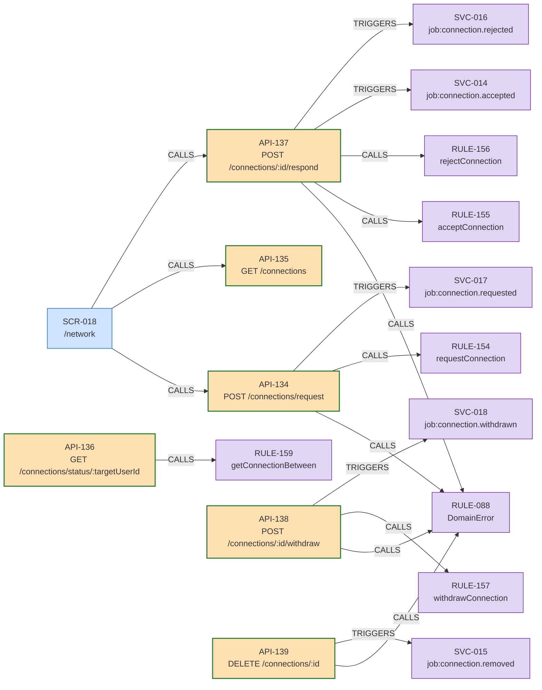
```mermaid
flowchart LR
  API_134["API-134<br/>POST /connections/request"]:::dur
  SCR_018["SCR-018<br/>/network"]:::ui
  SCR_018 -->|CALLS| API_134
  RULE_088["RULE-088<br/>DomainError"]:::logic
  API_134 -->|CALLS| RULE_088
  RULE_154["RULE-154<br/>requestConnection"]:::logic
  API_134 -->|CALLS| RULE_154
  SVC_017["SVC-017<br/>job:connection.requested"]:::logic
  API_134 -->|TRIGGERS| SVC_017
  API_135["API-135<br/>GET /connections"]:::dur
  SCR_018 -->|CALLS| API_135
  API_136["API-136<br/>GET /connections/status/:targetUserId"]:::dur
  RULE_159["RULE-159<br/>getConnectionBetween"]:::logic
  API_136 -->|CALLS| RULE_159
  API_137["API-137<br/>POST /connections/:id/respond"]:::dur
  SCR_018 -->|CALLS| API_137
  API_137 -->|CALLS| RULE_088
  RULE_155["RULE-155<br/>acceptConnection"]:::logic
  API_137 -->|CALLS| RULE_155
  RULE_156["RULE-156<br/>rejectConnection"]:::logic
  API_137 -->|CALLS| RULE_156
  SVC_014["SVC-014<br/>job:connection.accepted"]:::logic
  API_137 -->|TRIGGERS| SVC_014
  SVC_016["SVC-016<br/>job:connection.rejected"]:::logic
  API_137 -->|TRIGGERS| SVC_016
  API_138["API-138<br/>POST /connections/:id/withdraw"]:::dur
  API_138 -->|CALLS| RULE_088
  RULE_157["RULE-157<br/>withdrawConnection"]:::logic
  API_138 -->|CALLS| RULE_157
  SVC_018["SVC-018<br/>job:connection.withdrawn"]:::logic
  API_138 -->|TRIGGERS| SVC_018
  API_139["API-139<br/>DELETE /connections/:id"]:::dur
  API_139 -->|CALLS| RULE_088
  SVC_015["SVC-015<br/>job:connection.removed"]:::logic
  API_139 -->|TRIGGERS| SVC_015
  classDef dur fill:#ffe0b3,stroke:#2e7d32,stroke-width:2px;
  classDef eph fill:#ffe0b3,stroke:#f9a825,stroke-width:2px;
  classDef ui fill:#cfe2ff,stroke:#1565c0;
  classDef logic fill:#e1d5f5,stroke:#6a1b9a;
  classDef data fill:#c8ece8,stroke:#00796b;
```

## courses (MOD-071)

7 endpoints, 0 durable, 7 ephemeral. Green border = durable, yellow = ephemeral.

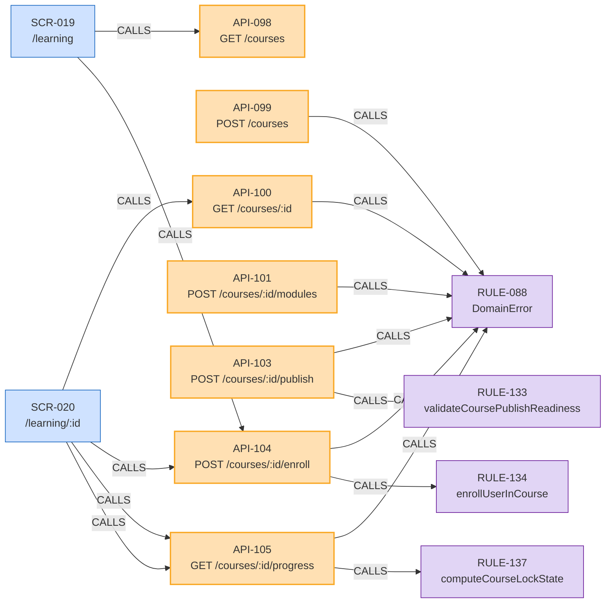
```mermaid
flowchart LR
  API_098["API-098<br/>GET /courses"]:::eph
  SCR_019["SCR-019<br/>/learning"]:::ui
  SCR_019 -->|CALLS| API_098
  API_099["API-099<br/>POST /courses"]:::eph
  RULE_088["RULE-088<br/>DomainError"]:::logic
  API_099 -->|CALLS| RULE_088
  API_100["API-100<br/>GET /courses/:id"]:::eph
  SCR_020["SCR-020<br/>/learning/:id"]:::ui
  SCR_020 -->|CALLS| API_100
  API_100 -->|CALLS| RULE_088
  API_101["API-101<br/>POST /courses/:id/modules"]:::eph
  API_101 -->|CALLS| RULE_088
  API_103["API-103<br/>POST /courses/:id/publish"]:::eph
  API_103 -->|CALLS| RULE_088
  RULE_133["RULE-133<br/>validateCoursePublishReadiness"]:::logic
  API_103 -->|CALLS| RULE_133
  API_104["API-104<br/>POST /courses/:id/enroll"]:::eph
  SCR_019 -->|CALLS| API_104
  SCR_020 -->|CALLS| API_104
  API_104 -->|CALLS| RULE_088
  RULE_134["RULE-134<br/>enrollUserInCourse"]:::logic
  API_104 -->|CALLS| RULE_134
  API_105["API-105<br/>GET /courses/:id/progress"]:::eph
  SCR_020 -->|CALLS| API_105
  SCR_020 -->|CALLS| API_105
  API_105 -->|CALLS| RULE_088
  RULE_137["RULE-137<br/>computeCourseLockState"]:::logic
  API_105 -->|CALLS| RULE_137
  classDef dur fill:#ffe0b3,stroke:#2e7d32,stroke-width:2px;
  classDef eph fill:#ffe0b3,stroke:#f9a825,stroke-width:2px;
  classDef ui fill:#cfe2ff,stroke:#1565c0;
  classDef logic fill:#e1d5f5,stroke:#6a1b9a;
  classDef data fill:#c8ece8,stroke:#00796b;
```

## evidence (MOD-057)

8 endpoints, 8 durable, 0 ephemeral. Green border = durable, yellow = ephemeral.

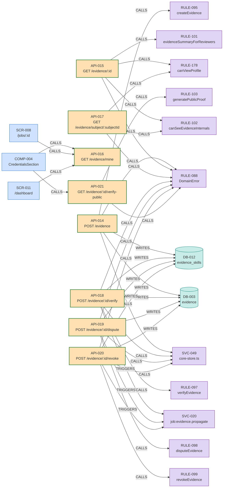
```mermaid
flowchart LR
  API_014["API-014<br/>POST /evidence"]:::dur
  RULE_088["RULE-088<br/>DomainError"]:::logic
  API_014 -->|CALLS| RULE_088
  RULE_095["RULE-095<br/>createEvidence"]:::logic
  API_014 -->|CALLS| RULE_095
  SVC_049["SVC-049<br/>core-store.ts"]:::logic
  API_014 -->|CALLS| SVC_049
  DB_003[("DB-003<br/>evidence")]:::data
  API_014 -->|WRITES| DB_003
  DB_012[("DB-012<br/>evidence_skills")]:::data
  API_014 -->|WRITES| DB_012
  API_015["API-015<br/>GET /evidence/:id"]:::dur
  API_015 -->|CALLS| RULE_088
  RULE_101["RULE-101<br/>evidenceSummaryForReviewers"]:::logic
  API_015 -->|CALLS| RULE_101
  RULE_102["RULE-102<br/>canSeeEvidenceInternals"]:::logic
  API_015 -->|CALLS| RULE_102
  RULE_178["RULE-178<br/>canViewProfile"]:::logic
  API_015 -->|CALLS| RULE_178
  API_016["API-016<br/>GET /evidence/mine"]:::dur
  COMP_004["COMP-004<br/>CredentialsSection"]:::ui
  COMP_004 -->|CALLS| API_016
  SCR_008["SCR-008<br/>/jobs/:id"]:::ui
  SCR_008 -->|CALLS| API_016
  SCR_011["SCR-011<br/>/dashboard"]:::ui
  SCR_011 -->|CALLS| API_016
  API_017["API-017<br/>GET /evidence/subject/:subjectId"]:::dur
  API_017 -->|CALLS| RULE_088
  API_017 -->|CALLS| RULE_102
  API_017 -->|CALLS| RULE_178
  API_018["API-018<br/>POST /evidence/:id/verify"]:::dur
  API_018 -->|CALLS| RULE_088
  RULE_097["RULE-097<br/>verifyEvidence"]:::logic
  API_018 -->|CALLS| RULE_097
  API_018 -->|CALLS| SVC_049
  API_018 -->|WRITES| DB_003
  API_018 -->|WRITES| DB_012
  SVC_020["SVC-020<br/>job:evidence.propagate"]:::logic
  API_018 -->|TRIGGERS| SVC_020
  API_019["API-019<br/>POST /evidence/:id/dispute"]:::dur
  API_019 -->|CALLS| RULE_088
  RULE_098["RULE-098<br/>disputeEvidence"]:::logic
  API_019 -->|CALLS| RULE_098
  API_019 -->|CALLS| SVC_049
  API_019 -->|WRITES| DB_003
  API_019 -->|WRITES| DB_012
  API_019 -->|TRIGGERS| SVC_020
  API_020["API-020<br/>POST /evidence/:id/revoke"]:::dur
  API_020 -->|CALLS| RULE_088
  RULE_099["RULE-099<br/>revokeEvidence"]:::logic
  API_020 -->|CALLS| RULE_099
  API_020 -->|CALLS| SVC_049
  API_020 -->|WRITES| DB_003
  API_020 -->|WRITES| DB_012
  API_020 -->|TRIGGERS| SVC_020
  API_021["API-021<br/>GET /evidence/:id/verify-public"]:::dur
  COMP_004 -->|CALLS| API_021
  API_021 -->|CALLS| RULE_088
  RULE_103["RULE-103<br/>generatePublicProof"]:::logic
  API_021 -->|CALLS| RULE_103
  classDef dur fill:#ffe0b3,stroke:#2e7d32,stroke-width:2px;
  classDef eph fill:#ffe0b3,stroke:#f9a825,stroke-width:2px;
  classDef ui fill:#cfe2ff,stroke:#1565c0;
  classDef logic fill:#e1d5f5,stroke:#6a1b9a;
  classDef data fill:#c8ece8,stroke:#00796b;
```

## feature-flags (MOD-054)

1 endpoints, 1 durable, 0 ephemeral. Green border = durable, yellow = ephemeral.

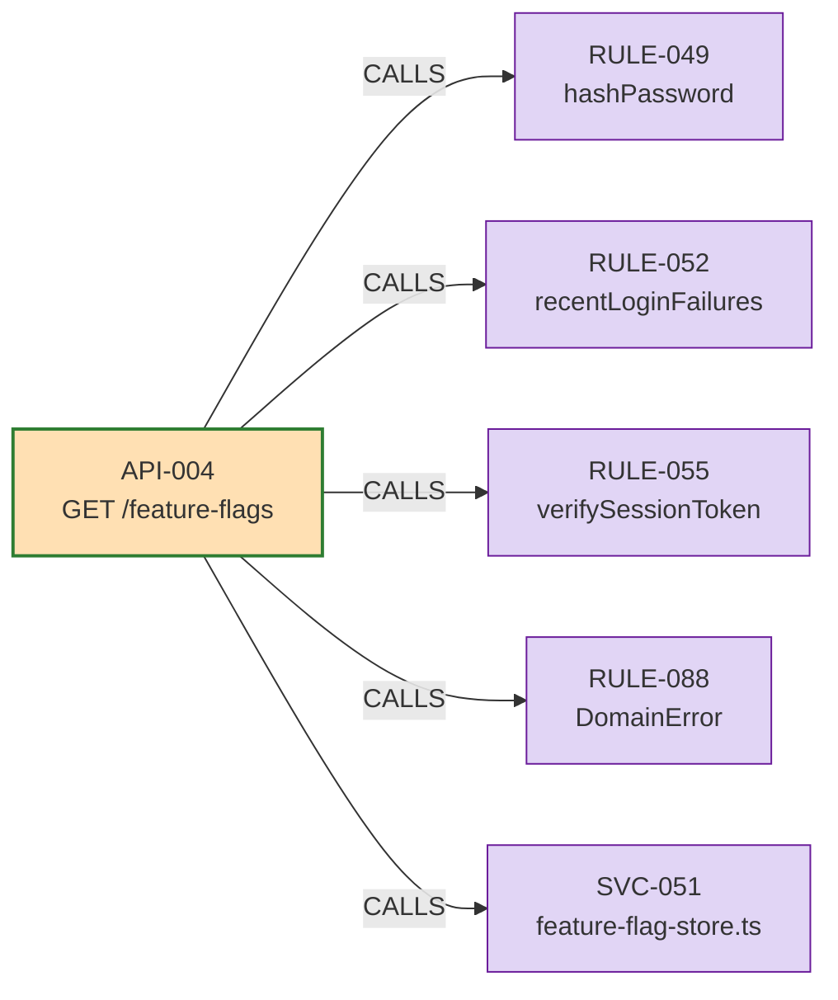
```mermaid
flowchart LR
  API_004["API-004<br/>GET /feature-flags"]:::dur
  RULE_049["RULE-049<br/>hashPassword"]:::logic
  API_004 -->|CALLS| RULE_049
  RULE_052["RULE-052<br/>recentLoginFailures"]:::logic
  API_004 -->|CALLS| RULE_052
  RULE_055["RULE-055<br/>verifySessionToken"]:::logic
  API_004 -->|CALLS| RULE_055
  RULE_088["RULE-088<br/>DomainError"]:::logic
  API_004 -->|CALLS| RULE_088
  SVC_051["SVC-051<br/>feature-flag-store.ts"]:::logic
  API_004 -->|CALLS| SVC_051
  classDef dur fill:#ffe0b3,stroke:#2e7d32,stroke-width:2px;
  classDef eph fill:#ffe0b3,stroke:#f9a825,stroke-width:2px;
  classDef ui fill:#cfe2ff,stroke:#1565c0;
  classDef logic fill:#e1d5f5,stroke:#6a1b9a;
  classDef data fill:#c8ece8,stroke:#00796b;
```

## feedback (MOD-064)

1 endpoints, 0 durable, 1 ephemeral. Green border = durable, yellow = ephemeral.

```mermaid
flowchart LR
  API_057["API-057<br/>GET /feedback/aggregate-insights"]:::eph
  RULE_039["RULE-039<br/>computeFeedbackAggregateInsights"]:::logic
  API_057 -->|CALLS| RULE_039
  classDef dur fill:#ffe0b3,stroke:#2e7d32,stroke-width:2px;
  classDef eph fill:#ffe0b3,stroke:#f9a825,stroke-width:2px;
  classDef ui fill:#cfe2ff,stroke:#1565c0;
  classDef logic fill:#e1d5f5,stroke:#6a1b9a;
  classDef data fill:#c8ece8,stroke:#00796b;
```

## gamification (MOD-088)

5 endpoints, 0 durable, 5 ephemeral. Green border = durable, yellow = ephemeral.

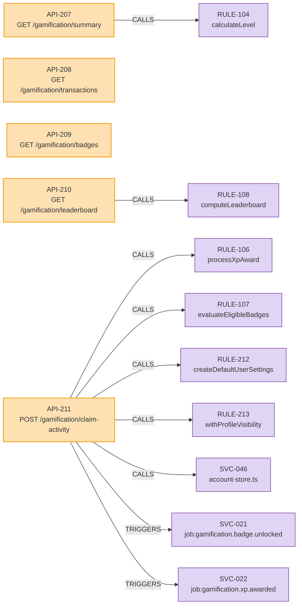
```mermaid
flowchart LR
  API_207["API-207<br/>GET /gamification/summary"]:::eph
  RULE_104["RULE-104<br/>calculateLevel"]:::logic
  API_207 -->|CALLS| RULE_104
  API_208["API-208<br/>GET /gamification/transactions"]:::eph
  API_209["API-209<br/>GET /gamification/badges"]:::eph
  API_210["API-210<br/>GET /gamification/leaderboard"]:::eph
  RULE_108["RULE-108<br/>computeLeaderboard"]:::logic
  API_210 -->|CALLS| RULE_108
  API_211["API-211<br/>POST /gamification/claim-activity"]:::eph
  RULE_106["RULE-106<br/>processXpAward"]:::logic
  API_211 -->|CALLS| RULE_106
  RULE_107["RULE-107<br/>evaluateEligibleBadges"]:::logic
  API_211 -->|CALLS| RULE_107
  RULE_212["RULE-212<br/>createDefaultUserSettings"]:::logic
  API_211 -->|CALLS| RULE_212
  RULE_213["RULE-213<br/>withProfileVisibility"]:::logic
  API_211 -->|CALLS| RULE_213
  SVC_046["SVC-046<br/>account-store.ts"]:::logic
  API_211 -->|CALLS| SVC_046
  SVC_021["SVC-021<br/>job:gamification.badge.unlocked"]:::logic
  API_211 -->|TRIGGERS| SVC_021
  SVC_022["SVC-022<br/>job:gamification.xp.awarded"]:::logic
  API_211 -->|TRIGGERS| SVC_022
  classDef dur fill:#ffe0b3,stroke:#2e7d32,stroke-width:2px;
  classDef eph fill:#ffe0b3,stroke:#f9a825,stroke-width:2px;
  classDef ui fill:#cfe2ff,stroke:#1565c0;
  classDef logic fill:#e1d5f5,stroke:#6a1b9a;
  classDef data fill:#c8ece8,stroke:#00796b;
```

## health (MOD-052)

2 endpoints, 2 durable, 0 ephemeral. Green border = durable, yellow = ephemeral.

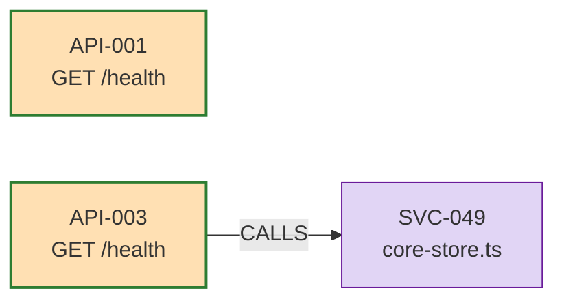
```mermaid
flowchart LR
  API_001["API-001<br/>GET /health"]:::dur
  API_003["API-003<br/>GET /health"]:::dur
  SVC_049["SVC-049<br/>core-store.ts"]:::logic
  API_003 -->|CALLS| SVC_049
  classDef dur fill:#ffe0b3,stroke:#2e7d32,stroke-width:2px;
  classDef eph fill:#ffe0b3,stroke:#f9a825,stroke-width:2px;
  classDef ui fill:#cfe2ff,stroke:#1565c0;
  classDef logic fill:#e1d5f5,stroke:#6a1b9a;
  classDef data fill:#c8ece8,stroke:#00796b;
```

## internal (MOD-096)

1 endpoints, 0 durable, 1 ephemeral. Green border = durable, yellow = ephemeral.

```mermaid
flowchart LR
  API_279["API-279<br/>GET /internal/worker-jobs"]:::eph
  SVC_056["SVC-056<br/>background-jobs.ts"]:::logic
  API_279 -->|CALLS| SVC_056
  classDef dur fill:#ffe0b3,stroke:#2e7d32,stroke-width:2px;
  classDef eph fill:#ffe0b3,stroke:#f9a825,stroke-width:2px;
  classDef ui fill:#cfe2ff,stroke:#1565c0;
  classDef logic fill:#e1d5f5,stroke:#6a1b9a;
  classDef data fill:#c8ece8,stroke:#00796b;
```

## interviews (MOD-066)

13 endpoints, 0 durable, 13 ephemeral. Green border = durable, yellow = ephemeral.

```mermaid
flowchart LR
  API_063["API-063<br/>POST /interviews/questions"]:::eph
  RULE_088["RULE-088<br/>DomainError"]:::logic
  API_063 -->|CALLS| RULE_088
  RULE_252["RULE-252<br/>createInterviewQuestion"]:::logic
  API_063 -->|CALLS| RULE_252
  API_064["API-064<br/>GET /interviews/questions"]:::eph
  API_064 -->|CALLS| RULE_088
  API_065["API-065<br/>POST /interviews/assessments"]:::eph
  API_065 -->|CALLS| RULE_088
  RULE_253["RULE-253<br/>scheduleInterviewAssessment"]:::logic
  API_065 -->|CALLS| RULE_253
  API_066["API-066<br/>GET /interviews/assessments/:id"]:::eph
  API_066 -->|CALLS| RULE_088
  API_067["API-067<br/>POST /interviews/assessments/:id/join"]:::eph
  API_067 -->|CALLS| RULE_088
  RULE_254["RULE-254<br/>joinInterviewAssessment"]:::logic
  API_067 -->|CALLS| RULE_254
  API_068["API-068<br/>POST /interviews/assessments/:id/consent"]:::eph
  API_068 -->|CALLS| RULE_088
  RULE_255["RULE-255<br/>updateRecordingConsent"]:::logic
  API_068 -->|CALLS| RULE_255
  API_069["API-069<br/>POST /interviews/assessments/:id/end"]:::eph
  API_069 -->|CALLS| RULE_088
  RULE_256["RULE-256<br/>endInterviewAssessment"]:::logic
  API_069 -->|CALLS| RULE_256
  API_070["API-070<br/>POST /interviews/assessments/:id/code"]:::eph
  API_070 -->|CALLS| RULE_088
  RULE_261["RULE-261<br/>executeInterviewCode"]:::logic
  API_070 -->|CALLS| RULE_261
  API_071["API-071<br/>POST /interviews/assessments/:id/scorecard"]:::eph
  RULE_086["RULE-086<br/>canTransitionApplication"]:::logic
  API_071 -->|CALLS| RULE_086
  API_071 -->|CALLS| RULE_088
  RULE_257["RULE-257<br/>submitInterviewScorecard"]:::logic
  API_071 -->|CALLS| RULE_257
  SVC_049["SVC-049<br/>core-store.ts"]:::logic
  API_071 -->|CALLS| SVC_049
  DB_007[("DB-007<br/>job_applications")]:::data
  API_071 -->|WRITES| DB_007
  DB_014[("DB-014<br/>application_evidence")]:::data
  API_071 -->|WRITES| DB_014
  API_072["API-072<br/>POST /interviews/assessments/:id/scorecard/com"]:::eph
  API_072 -->|CALLS| RULE_088
  RULE_258["RULE-258<br/>compensateInterviewScorecard"]:::logic
  API_072 -->|CALLS| RULE_258
  API_073["API-073<br/>GET /interviews/assessments/:id/scorecards"]:::eph
  API_073 -->|CALLS| RULE_088
  API_074["API-074<br/>POST /interviews/assessments/:id/ai-feedback"]:::eph
  API_074 -->|CALLS| RULE_088
  RULE_260["RULE-260<br/>generateAdvisoryAiFeedback"]:::logic
  API_074 -->|CALLS| RULE_260
  API_075["API-075<br/>POST /interviews/assessments/:id/review"]:::eph
  API_075 -->|CALLS| RULE_088
  RULE_259["RULE-259<br/>reviewInterviewAssessment"]:::logic
  API_075 -->|CALLS| RULE_259
  classDef dur fill:#ffe0b3,stroke:#2e7d32,stroke-width:2px;
  classDef eph fill:#ffe0b3,stroke:#f9a825,stroke-width:2px;
  classDef ui fill:#cfe2ff,stroke:#1565c0;
  classDef logic fill:#e1d5f5,stroke:#6a1b9a;
  classDef data fill:#c8ece8,stroke:#00796b;
```

## job-templates (MOD-061)

6 endpoints, 0 durable, 6 ephemeral. Green border = durable, yellow = ephemeral.

```mermaid
flowchart LR
  API_035["API-035<br/>POST /job-templates"]:::eph
  RULE_088["RULE-088<br/>DomainError"]:::logic
  API_035 -->|CALLS| RULE_088
  RULE_123["RULE-123<br/>createJobTemplate"]:::logic
  API_035 -->|CALLS| RULE_123
  API_036["API-036<br/>GET /job-templates"]:::eph
  API_036 -->|CALLS| RULE_088
  API_037["API-037<br/>GET /job-templates/:id"]:::eph
  API_037 -->|CALLS| RULE_088
  API_038["API-038<br/>PATCH /job-templates/:id"]:::eph
  API_038 -->|CALLS| RULE_088
  RULE_124["RULE-124<br/>updateJobTemplate"]:::logic
  API_038 -->|CALLS| RULE_124
  API_039["API-039<br/>DELETE /job-templates/:id"]:::eph
  API_039 -->|CALLS| RULE_088
  RULE_125["RULE-125<br/>archiveJobTemplate"]:::logic
  API_039 -->|CALLS| RULE_125
  API_040["API-040<br/>POST /job-templates/:id/instantiate"]:::eph
  API_040 -->|CALLS| RULE_088
  RULE_126["RULE-126<br/>instantiateJobFromTemplate"]:::logic
  API_040 -->|CALLS| RULE_126
  SVC_049["SVC-049<br/>core-store.ts"]:::logic
  API_040 -->|CALLS| SVC_049
  DB_006[("DB-006<br/>jobs")]:::data
  API_040 -->|WRITES| DB_006
  DB_013[("DB-013<br/>job_skills")]:::data
  API_040 -->|WRITES| DB_013
  classDef dur fill:#ffe0b3,stroke:#2e7d32,stroke-width:2px;
  classDef eph fill:#ffe0b3,stroke:#f9a825,stroke-width:2px;
  classDef ui fill:#cfe2ff,stroke:#1565c0;
  classDef logic fill:#e1d5f5,stroke:#6a1b9a;
  classDef data fill:#c8ece8,stroke:#00796b;
```

## jobs (MOD-060)

22 endpoints, 21 durable, 1 ephemeral. Green border = durable, yellow = ephemeral.

```mermaid
flowchart LR
  API_031["API-031<br/>POST /jobs"]:::dur
  SCR_025["SCR-025<br/>/hiring"]:::ui
  SCR_025 -->|CALLS| API_031
  RULE_088["RULE-088<br/>DomainError"]:::logic
  API_031 -->|CALLS| RULE_088
  RULE_128["RULE-128<br/>createJobPosting"]:::logic
  API_031 -->|CALLS| RULE_128
  RULE_202["RULE-202<br/>evaluateJobAlertsForPublishedJob"]:::logic
  API_031 -->|CALLS| RULE_202
  SVC_049["SVC-049<br/>core-store.ts"]:::logic
  API_031 -->|CALLS| SVC_049
  SVC_054["SVC-054<br/>saved-search-store.ts"]:::logic
  API_031 -->|CALLS| SVC_054
  DB_006[("DB-006<br/>jobs")]:::data
  API_031 -->|WRITES| DB_006
  DB_013[("DB-013<br/>job_skills")]:::data
  API_031 -->|WRITES| DB_013
  API_032["API-032<br/>GET /jobs"]:::dur
  SCR_007["SCR-007<br/>/jobs"]:::ui
  SCR_007 -->|CALLS| API_032
  SCR_011["SCR-011<br/>/dashboard"]:::ui
  SCR_011 -->|CALLS| API_032
  API_033["API-033<br/>GET /jobs/:id"]:::dur
  SCR_008["SCR-008<br/>/jobs/:id"]:::ui
  SCR_008 -->|CALLS| API_033
  SCR_026["SCR-026<br/>/hiring/jobs/:id"]:::ui
  SCR_026 -->|CALLS| API_033
  API_033 -->|CALLS| RULE_088
  API_034["API-034<br/>PATCH /jobs/:id/status"]:::dur
  SCR_025 -->|CALLS| API_034
  SCR_025 -->|CALLS| API_034
  SCR_026 -->|CALLS| API_034
  API_034 -->|CALLS| RULE_088
  RULE_129["RULE-129<br/>transitionJobStatus"]:::logic
  API_034 -->|CALLS| RULE_129
  API_034 -->|CALLS| RULE_202
  API_034 -->|CALLS| SVC_049
  API_034 -->|CALLS| SVC_054
  API_034 -->|WRITES| DB_006
  API_034 -->|WRITES| DB_013
  API_041["API-041<br/>POST /jobs/:id/save-as-template"]:::eph
  API_041 -->|CALLS| RULE_088
  RULE_123["RULE-123<br/>createJobTemplate"]:::logic
  API_041 -->|CALLS| RULE_123
  API_047["API-047<br/>POST /jobs/:id/apply"]:::dur
  SCR_008 -->|CALLS| API_047
  RULE_035["RULE-035<br/>markDraftSubmitted"]:::logic
  API_047 -->|CALLS| RULE_035
  RULE_041["RULE-041<br/>submitJobApplication"]:::logic
  API_047 -->|CALLS| RULE_041
  API_047 -->|CALLS| RULE_088
  RULE_100["RULE-100<br/>assertAttachableEvidence"]:::logic
  API_047 -->|CALLS| RULE_100
  API_047 -->|CALLS| SVC_049
  DB_007[("DB-007<br/>job_applications")]:::data
  API_047 -->|WRITES| DB_007
  DB_014[("DB-014<br/>application_evidence")]:::data
  API_047 -->|WRITES| DB_014
  DB_029[("DB-029<br/>notifications")]:::data
  API_047 -->|WRITES| DB_029
  SVC_008["SVC-008<br/>job:application.submitted"]:::logic
  API_047 -->|TRIGGERS| SVC_008
  API_050["API-050<br/>GET /jobs/:id/applications"]:::dur
  SCR_026 -->|CALLS| API_050
  API_050 -->|CALLS| RULE_088
  API_252["API-252<br/>POST /jobs/saved-searches"]:::dur
  RULE_199["RULE-199<br/>createSavedSearch"]:::logic
  API_252 -->|CALLS| RULE_199
  API_252 -->|CALLS| SVC_054
  API_253["API-253<br/>GET /jobs/saved-searches"]:::dur
  API_253 -->|CALLS| SVC_054
  API_254["API-254<br/>GET /jobs/saved-searches/:id"]:::dur
  API_254 -->|CALLS| RULE_088
  API_254 -->|CALLS| SVC_054
  API_255["API-255<br/>PATCH /jobs/saved-searches/:id"]:::dur
  API_255 -->|CALLS| RULE_088
  RULE_200["RULE-200<br/>updateSavedSearch"]:::logic
  API_255 -->|CALLS| RULE_200
  API_255 -->|CALLS| SVC_054
  API_256["API-256<br/>DELETE /jobs/saved-searches/:id"]:::dur
  API_256 -->|CALLS| RULE_088
  API_256 -->|CALLS| SVC_054
  API_257["API-257<br/>POST /jobs/saved-searches/:id/run"]:::dur
  API_257 -->|CALLS| RULE_088
  RULE_201["RULE-201<br/>matchJobAgainstCriteria"]:::logic
  API_257 -->|CALLS| RULE_201
  API_257 -->|CALLS| SVC_054
  API_258["API-258<br/>GET /jobs/alerts"]:::dur
  API_259["API-259<br/>PATCH /jobs/alerts/:id/read"]:::dur
  API_260["API-260<br/>POST /jobs/:id/save"]:::dur
  API_260 -->|CALLS| RULE_088
  SVC_053["SVC-053<br/>saved-job-store.ts"]:::logic
  API_260 -->|CALLS| SVC_053
  API_261["API-261<br/>DELETE /jobs/:id/save"]:::dur
  API_261 -->|CALLS| SVC_053
  API_262["API-262<br/>GET /jobs/saved"]:::dur
  API_262 -->|CALLS| SVC_053
  API_263["API-263<br/>PUT /jobs/:jobId/draft"]:::dur
  RULE_033["RULE-033<br/>saveApplicationDraft"]:::logic
  API_263 -->|CALLS| RULE_033
  API_263 -->|CALLS| RULE_088
  API_264["API-264<br/>GET /jobs/:jobId/draft"]:::dur
  API_264 -->|CALLS| RULE_088
  API_265["API-265<br/>DELETE /jobs/:jobId/draft"]:::dur
  API_265 -->|CALLS| RULE_088
  API_266["API-266<br/>POST /jobs/:jobId/draft/restore"]:::dur
  RULE_034["RULE-034<br/>restoreApplicationDraftVersion"]:::logic
  API_266 -->|CALLS| RULE_034
  API_266 -->|CALLS| RULE_088
  classDef dur fill:#ffe0b3,stroke:#2e7d32,stroke-width:2px;
  classDef eph fill:#ffe0b3,stroke:#f9a825,stroke-width:2px;
  classDef ui fill:#cfe2ff,stroke:#1565c0;
  classDef logic fill:#e1d5f5,stroke:#6a1b9a;
  classDef data fill:#c8ece8,stroke:#00796b;
```

## learning (MOD-083)

4 endpoints, 0 durable, 4 ephemeral. Green border = durable, yellow = ephemeral.

```mermaid
flowchart LR
  API_168["API-168<br/>POST /learning/impact/outcomes"]:::eph
  RULE_088["RULE-088<br/>DomainError"]:::logic
  API_168 -->|CALLS| RULE_088
  RULE_130["RULE-130<br/>recordLearningOutcome"]:::logic
  API_168 -->|CALLS| RULE_130
  SVC_028["SVC-028<br/>job:learning.outcome_recorded"]:::logic
  API_168 -->|TRIGGERS| SVC_028
  API_169["API-169<br/>GET /learning/impact/courses/:courseId"]:::eph
  RULE_131["RULE-131<br/>computeLearningImpactMetrics"]:::logic
  API_169 -->|CALLS| RULE_131
  API_170["API-170<br/>POST /learning/impact/courses/:courseId/comput"]:::eph
  API_170 -->|CALLS| RULE_088
  API_170 -->|CALLS| RULE_131
  API_171["API-171<br/>GET /learning/impact/dashboard"]:::eph
  API_171 -->|CALLS| RULE_131
  RULE_132["RULE-132<br/>aggregateLearningImpactDashboard"]:::logic
  API_171 -->|CALLS| RULE_132
  classDef dur fill:#ffe0b3,stroke:#2e7d32,stroke-width:2px;
  classDef eph fill:#ffe0b3,stroke:#f9a825,stroke-width:2px;
  classDef ui fill:#cfe2ff,stroke:#1565c0;
  classDef logic fill:#e1d5f5,stroke:#6a1b9a;
  classDef data fill:#c8ece8,stroke:#00796b;
```

## lessons (MOD-073)

1 endpoints, 0 durable, 1 ephemeral. Green border = durable, yellow = ephemeral.

```mermaid
flowchart LR
  API_106["API-106<br/>POST /lessons/:id/complete"]:::eph
  SCR_020["SCR-020<br/>/learning/:id"]:::ui
  SCR_020 -->|CALLS| API_106
  RULE_047["RULE-047<br/>calculateCappedXp"]:::logic
  API_106 -->|CALLS| RULE_047
  RULE_088["RULE-088<br/>DomainError"]:::logic
  API_106 -->|CALLS| RULE_088
  RULE_096["RULE-096<br/>courseCompletionEvidence"]:::logic
  API_106 -->|CALLS| RULE_096
  RULE_135["RULE-135<br/>verifySequentialModuleProgress"]:::logic
  API_106 -->|CALLS| RULE_135
  RULE_136["RULE-136<br/>verifyLessonPrerequisites"]:::logic
  API_106 -->|CALLS| RULE_136
  RULE_138["RULE-138<br/>calculateCourseProgress"]:::logic
  API_106 -->|CALLS| RULE_138
  SVC_049["SVC-049<br/>core-store.ts"]:::logic
  API_106 -->|CALLS| SVC_049
  DB_003[("DB-003<br/>evidence")]:::data
  API_106 -->|WRITES| DB_003
  DB_012[("DB-012<br/>evidence_skills")]:::data
  API_106 -->|WRITES| DB_012
  SVC_020["SVC-020<br/>job:evidence.propagate"]:::logic
  API_106 -->|TRIGGERS| SVC_020
  SVC_029["SVC-029<br/>job:lms.course.completed"]:::logic
  API_106 -->|TRIGGERS| SVC_029
  classDef dur fill:#ffe0b3,stroke:#2e7d32,stroke-width:2px;
  classDef eph fill:#ffe0b3,stroke:#f9a825,stroke-width:2px;
  classDef ui fill:#cfe2ff,stroke:#1565c0;
  classDef logic fill:#e1d5f5,stroke:#6a1b9a;
  classDef data fill:#c8ece8,stroke:#00796b;
```

## moderation (MOD-093)

10 endpoints, 0 durable, 10 ephemeral. Green border = durable, yellow = ephemeral.

```mermaid
flowchart LR
  API_242["API-242<br/>POST /moderation/scan"]:::eph
  RULE_147["RULE-147<br/>scanContentForAbuse"]:::logic
  API_242 -->|CALLS| RULE_147
  API_243["API-243<br/>POST /moderation/reports"]:::eph
  RULE_148["RULE-148<br/>createModerationReport"]:::logic
  API_243 -->|CALLS| RULE_148
  SVC_033["SVC-033<br/>job:moderation.report_created"]:::logic
  API_243 -->|TRIGGERS| SVC_033
  API_244["API-244<br/>GET /moderation/reports/my"]:::eph
  API_245["API-245<br/>GET /moderation/reports"]:::eph
  RULE_149["RULE-149<br/>assertModeratorAuthority"]:::logic
  API_245 -->|CALLS| RULE_149
  API_246["API-246<br/>GET /moderation/reports/:id"]:::eph
  RULE_088["RULE-088<br/>DomainError"]:::logic
  API_246 -->|CALLS| RULE_088
  API_247["API-247<br/>PATCH /moderation/reports/:id/status"]:::eph
  API_247 -->|CALLS| RULE_088
  RULE_150["RULE-150<br/>transitionReportStatus"]:::logic
  API_247 -->|CALLS| RULE_150
  API_248["API-248<br/>POST /moderation/reports/:id/resolve"]:::eph
  API_248 -->|CALLS| RULE_088
  RULE_151["RULE-151<br/>resolveModerationReport"]:::logic
  API_248 -->|CALLS| RULE_151
  SVC_049["SVC-049<br/>core-store.ts"]:::logic
  API_248 -->|CALLS| SVC_049
  DB_001[("DB-001<br/>users")]:::data
  API_248 -->|WRITES| DB_001
  DB_006[("DB-006<br/>jobs")]:::data
  API_248 -->|WRITES| DB_006
  DB_013[("DB-013<br/>job_skills")]:::data
  API_248 -->|WRITES| DB_013
  SVC_034["SVC-034<br/>job:moderation.report_resolved"]:::logic
  API_248 -->|TRIGGERS| SVC_034
  API_249["API-249<br/>POST /moderation/reports/:id/appeal"]:::eph
  API_249 -->|CALLS| RULE_088
  RULE_152["RULE-152<br/>createModerationAppeal"]:::logic
  API_249 -->|CALLS| RULE_152
  SVC_032["SVC-032<br/>job:moderation.appeal_submitted"]:::logic
  API_249 -->|TRIGGERS| SVC_032
  API_250["API-250<br/>GET /moderation/appeals"]:::eph
  API_250 -->|CALLS| RULE_149
  API_251["API-251<br/>POST /moderation/appeals/:id/review"]:::eph
  API_251 -->|CALLS| RULE_088
  RULE_153["RULE-153<br/>reviewModerationAppeal"]:::logic
  API_251 -->|CALLS| RULE_153
  API_251 -->|CALLS| SVC_049
  API_251 -->|WRITES| DB_001
  SVC_031["SVC-031<br/>job:moderation.appeal_reviewed"]:::logic
  API_251 -->|TRIGGERS| SVC_031
  classDef dur fill:#ffe0b3,stroke:#2e7d32,stroke-width:2px;
  classDef eph fill:#ffe0b3,stroke:#f9a825,stroke-width:2px;
  classDef ui fill:#cfe2ff,stroke:#1565c0;
  classDef logic fill:#e1d5f5,stroke:#6a1b9a;
  classDef data fill:#c8ece8,stroke:#00796b;
```

## modules (MOD-072)

1 endpoints, 0 durable, 1 ephemeral. Green border = durable, yellow = ephemeral.

```mermaid
flowchart LR
  API_102["API-102<br/>POST /modules/:id/lessons"]:::eph
  RULE_088["RULE-088<br/>DomainError"]:::logic
  API_102 -->|CALLS| RULE_088
  classDef dur fill:#ffe0b3,stroke:#2e7d32,stroke-width:2px;
  classDef eph fill:#ffe0b3,stroke:#f9a825,stroke-width:2px;
  classDef ui fill:#cfe2ff,stroke:#1565c0;
  classDef logic fill:#e1d5f5,stroke:#6a1b9a;
  classDef data fill:#c8ece8,stroke:#00796b;
```

## networking (MOD-080)

8 endpoints, 0 durable, 8 ephemeral. Green border = durable, yellow = ephemeral.

```mermaid
flowchart LR
  API_140["API-140<br/>POST /networking/warm-intros/preferences"]:::eph
  API_141["API-141<br/>GET /networking/warm-intros/preferences"]:::eph
  API_142["API-142<br/>GET /networking/warm-intros/paths"]:::eph
  RULE_088["RULE-088<br/>DomainError"]:::logic
  API_142 -->|CALLS| RULE_088
  RULE_262["RULE-262<br/>discoverWarmIntroPaths"]:::logic
  API_142 -->|CALLS| RULE_262
  API_143["API-143<br/>POST /networking/warm-intros/requests"]:::eph
  RULE_263["RULE-263<br/>createWarmIntroRequest"]:::logic
  API_143 -->|CALLS| RULE_263
  API_144["API-144<br/>GET /networking/warm-intros/requests/incoming"]:::eph
  API_145["API-145<br/>GET /networking/warm-intros/requests/outgoing"]:::eph
  API_146["API-146<br/>GET /networking/warm-intros/requests/:id"]:::eph
  API_146 -->|CALLS| RULE_088
  API_147["API-147<br/>POST /networking/warm-intros/requests/:id/resp"]:::eph
  API_147 -->|CALLS| RULE_088
  RULE_264["RULE-264<br/>respondToIntroRequest"]:::logic
  API_147 -->|CALLS| RULE_264
  classDef dur fill:#ffe0b3,stroke:#2e7d32,stroke-width:2px;
  classDef eph fill:#ffe0b3,stroke:#f9a825,stroke-width:2px;
  classDef ui fill:#cfe2ff,stroke:#1565c0;
  classDef logic fill:#e1d5f5,stroke:#6a1b9a;
  classDef data fill:#c8ece8,stroke:#00796b;
```

## notifications (MOD-077)

5 endpoints, 5 durable, 0 ephemeral. Green border = durable, yellow = ephemeral.

```mermaid
flowchart LR
  API_117["API-117<br/>GET /notifications"]:::dur
  SCR_022["SCR-022<br/>/notifications"]:::ui
  SCR_022 -->|CALLS| API_117
  RULE_088["RULE-088<br/>DomainError"]:::logic
  API_117 -->|CALLS| RULE_088
  API_118["API-118<br/>GET /notifications/summary"]:::dur
  COMP_011["COMP-011<br/>Layout"]:::ui
  COMP_011 -->|CALLS| API_118
  API_119["API-119<br/>POST /notifications/mark-read"]:::dur
  SCR_022 -->|CALLS| API_119
  API_119 -->|CALLS| RULE_088
  RULE_163["RULE-163<br/>resolveMarkReadTargets"]:::logic
  API_119 -->|CALLS| RULE_163
  RULE_164["RULE-164<br/>markNotificationsAsRead"]:::logic
  API_119 -->|CALLS| RULE_164
  SVC_049["SVC-049<br/>core-store.ts"]:::logic
  API_119 -->|CALLS| SVC_049
  DB_029[("DB-029<br/>notifications")]:::data
  API_119 -->|WRITES| DB_029
  API_120["API-120<br/>GET /notifications/preferences"]:::dur
  API_120 -->|CALLS| RULE_088
  RULE_160["RULE-160<br/>createDefaultNotificationPrefere"]:::logic
  API_120 -->|CALLS| RULE_160
  API_121["API-121<br/>PATCH /notifications/preferences"]:::dur
  API_121 -->|CALLS| RULE_088
  API_121 -->|CALLS| RULE_160
  API_121 -->|CALLS| SVC_049
  DB_030[("DB-030<br/>notification_preferences")]:::data
  API_121 -->|WRITES| DB_030
  classDef dur fill:#ffe0b3,stroke:#2e7d32,stroke-width:2px;
  classDef eph fill:#ffe0b3,stroke:#f9a825,stroke-width:2px;
  classDef ui fill:#cfe2ff,stroke:#1565c0;
  classDef logic fill:#e1d5f5,stroke:#6a1b9a;
  classDef data fill:#c8ece8,stroke:#00796b;
```

## organizations (MOD-059)

7 endpoints, 5 durable, 2 ephemeral. Green border = durable, yellow = ephemeral.

```mermaid
flowchart LR
  API_026["API-026<br/>POST /organizations"]:::dur
  SCR_025["SCR-025<br/>/hiring"]:::ui
  SCR_025 -->|CALLS| API_026
  RULE_088["RULE-088<br/>DomainError"]:::logic
  API_026 -->|CALLS| RULE_088
  SVC_049["SVC-049<br/>core-store.ts"]:::logic
  API_026 -->|CALLS| SVC_049
  DB_004[("DB-004<br/>organizations")]:::data
  API_026 -->|WRITES| DB_004
  DB_005[("DB-005<br/>org_memberships")]:::data
  API_026 -->|WRITES| DB_005
  API_027["API-027<br/>GET /organizations/mine"]:::dur
  SCR_011["SCR-011<br/>/dashboard"]:::ui
  SCR_011 -->|CALLS| API_027
  SCR_025 -->|CALLS| API_027
  API_028["API-028<br/>GET /organizations/:id/jobs"]:::dur
  SCR_011 -->|CALLS| API_028
  SCR_025 -->|CALLS| API_028
  API_028 -->|CALLS| RULE_088
  API_029["API-029<br/>GET /organizations/:id"]:::dur
  API_029 -->|CALLS| RULE_088
  API_030["API-030<br/>POST /organizations/:id/members"]:::dur
  RULE_072["RULE-072<br/>assertCanPublishAnotherJob"]:::logic
  API_030 -->|CALLS| RULE_072
  API_030 -->|CALLS| RULE_088
  RULE_232["RULE-232<br/>effectiveEntitlements"]:::logic
  API_030 -->|CALLS| RULE_232
  API_030 -->|CALLS| SVC_049
  API_030 -->|WRITES| DB_005
  API_055["API-055<br/>POST /organizations/:orgId/feedback-templates"]:::eph
  RULE_040["RULE-040<br/>createFeedbackTemplate"]:::logic
  API_055 -->|CALLS| RULE_040
  API_055 -->|CALLS| RULE_088
  API_056["API-056<br/>GET /organizations/:orgId/feedback-templates"]:::eph
  API_056 -->|CALLS| RULE_088
  classDef dur fill:#ffe0b3,stroke:#2e7d32,stroke-width:2px;
  classDef eph fill:#ffe0b3,stroke:#f9a825,stroke-width:2px;
  classDef ui fill:#cfe2ff,stroke:#1565c0;
  classDef logic fill:#e1d5f5,stroke:#6a1b9a;
  classDef data fill:#c8ece8,stroke:#00796b;
```

## portfolio (MOD-087)

6 endpoints, 0 durable, 6 ephemeral. Green border = durable, yellow = ephemeral.

```mermaid
flowchart LR
  API_201["API-201<br/>POST /portfolio/projects"]:::eph
  SCR_016["SCR-016<br/>/portfolio"]:::ui
  SCR_016 -->|CALLS| API_201
  RULE_173["RULE-173<br/>createPortfolioProject"]:::logic
  API_201 -->|CALLS| RULE_173
  SVC_035["SVC-035<br/>job:portfolio.project.created"]:::logic
  API_201 -->|TRIGGERS| SVC_035
  API_202["API-202<br/>GET /portfolio/projects"]:::eph
  SCR_016 -->|CALLS| API_202
  API_203["API-203<br/>GET /portfolio/projects/:id"]:::eph
  RULE_088["RULE-088<br/>DomainError"]:::logic
  API_203 -->|CALLS| RULE_088
  RULE_158["RULE-158<br/>areConnected"]:::logic
  API_203 -->|CALLS| RULE_158
  RULE_175["RULE-175<br/>canViewPortfolioProject"]:::logic
  API_203 -->|CALLS| RULE_175
  API_204["API-204<br/>PATCH /portfolio/projects/:id"]:::eph
  API_204 -->|CALLS| RULE_088
  RULE_174["RULE-174<br/>updatePortfolioProject"]:::logic
  API_204 -->|CALLS| RULE_174
  SVC_037["SVC-037<br/>job:portfolio.project.updated"]:::logic
  API_204 -->|TRIGGERS| SVC_037
  API_205["API-205<br/>DELETE /portfolio/projects/:id"]:::eph
  API_205 -->|CALLS| RULE_088
  SVC_036["SVC-036<br/>job:portfolio.project.removed"]:::logic
  API_205 -->|TRIGGERS| SVC_036
  API_206["API-206<br/>GET /portfolio/showcase/:targetUserId"]:::eph
  RULE_104["RULE-104<br/>calculateLevel"]:::logic
  API_206 -->|CALLS| RULE_104
  API_206 -->|CALLS| RULE_158
  API_206 -->|CALLS| RULE_175
  classDef dur fill:#ffe0b3,stroke:#2e7d32,stroke-width:2px;
  classDef eph fill:#ffe0b3,stroke:#f9a825,stroke-width:2px;
  classDef ui fill:#cfe2ff,stroke:#1565c0;
  classDef logic fill:#e1d5f5,stroke:#6a1b9a;
  classDef data fill:#c8ece8,stroke:#00796b;
```

## profile (MOD-056)

3 endpoints, 3 durable, 0 ephemeral. Green border = durable, yellow = ephemeral.

```mermaid
flowchart LR
  API_011["API-011<br/>GET /profile/me"]:::dur
  RULE_088["RULE-088<br/>DomainError"]:::logic
  API_011 -->|CALLS| RULE_088
  API_012["API-012<br/>PATCH /profile/me"]:::dur
  SCR_014["SCR-014<br/>/profile"]:::ui
  SCR_014 -->|CALLS| API_012
  API_012 -->|CALLS| RULE_088
  RULE_177["RULE-177<br/>updateProfileEntity"]:::logic
  API_012 -->|CALLS| RULE_177
  SVC_049["SVC-049<br/>core-store.ts"]:::logic
  API_012 -->|CALLS| SVC_049
  DB_002[("DB-002<br/>profiles")]:::data
  API_012 -->|WRITES| DB_002
  API_013["API-013<br/>GET /profile/:id"]:::dur
  RULE_029["RULE-029<br/>appendBounded"]:::logic
  API_013 -->|CALLS| RULE_029
  API_013 -->|CALLS| RULE_088
  RULE_161["RULE-161<br/>shouldDeliverNotification"]:::logic
  API_013 -->|CALLS| RULE_161
  RULE_162["RULE-162<br/>createNotificationEntity"]:::logic
  API_013 -->|CALLS| RULE_162
  RULE_178["RULE-178<br/>canViewProfile"]:::logic
  API_013 -->|CALLS| RULE_178
  API_013 -->|CALLS| SVC_049
  DB_029[("DB-029<br/>notifications")]:::data
  API_013 -->|WRITES| DB_029
  classDef dur fill:#ffe0b3,stroke:#2e7d32,stroke-width:2px;
  classDef eph fill:#ffe0b3,stroke:#f9a825,stroke-width:2px;
  classDef ui fill:#cfe2ff,stroke:#1565c0;
  classDef logic fill:#e1d5f5,stroke:#6a1b9a;
  classDef data fill:#c8ece8,stroke:#00796b;
```

## ready (MOD-053)

1 endpoints, 1 durable, 0 ephemeral. Green border = durable, yellow = ephemeral.

```mermaid
flowchart LR
  API_002["API-002<br/>GET /ready"]:::dur
  classDef dur fill:#ffe0b3,stroke:#2e7d32,stroke-width:2px;
  classDef eph fill:#ffe0b3,stroke:#f9a825,stroke-width:2px;
  classDef ui fill:#cfe2ff,stroke:#1565c0;
  classDef logic fill:#e1d5f5,stroke:#6a1b9a;
  classDef data fill:#c8ece8,stroke:#00796b;
```

## recruiter (MOD-084)

13 endpoints, 0 durable, 13 ephemeral. Green border = durable, yellow = ephemeral.

```mermaid
flowchart LR
  API_172["API-172<br/>POST /recruiter/talent-pools"]:::eph
  RULE_088["RULE-088<br/>DomainError"]:::logic
  API_172 -->|CALLS| RULE_088
  RULE_236["RULE-236<br/>createTalentPool"]:::logic
  API_172 -->|CALLS| RULE_236
  API_173["API-173<br/>GET /recruiter/talent-pools"]:::eph
  API_173 -->|CALLS| RULE_088
  API_174["API-174<br/>GET /recruiter/talent-pools/:poolId"]:::eph
  API_174 -->|CALLS| RULE_088
  API_175["API-175<br/>POST /recruiter/talent-pools/:poolId/members"]:::eph
  API_175 -->|CALLS| RULE_088
  RULE_237["RULE-237<br/>addCandidateToPool"]:::logic
  API_175 -->|CALLS| RULE_237
  API_176["API-176<br/>PATCH /recruiter/talent-pools/:poolId/members/"]:::eph
  API_176 -->|CALLS| RULE_088
  RULE_238["RULE-238<br/>updatePoolMemberStatus"]:::logic
  API_176 -->|CALLS| RULE_238
  API_177["API-177<br/>GET /recruiter/talent-pools/:poolId/intelligen"]:::eph
  API_177 -->|CALLS| RULE_088
  RULE_178["RULE-178<br/>canViewProfile"]:::logic
  API_177 -->|CALLS| RULE_178
  RULE_244["RULE-244<br/>generateTalentPoolIntelligence"]:::logic
  API_177 -->|CALLS| RULE_244
  API_178["API-178<br/>POST /recruiter/discovery/behavioral/compute"]:::eph
  RULE_068["RULE-068<br/>evaluateBehavioralTalentProfile"]:::logic
  API_178 -->|CALLS| RULE_068
  API_178 -->|CALLS| RULE_088
  API_179["API-179<br/>GET /recruiter/discovery/behavioral"]:::eph
  RULE_069["RULE-069<br/>filterAndRankBehavioralTalent"]:::logic
  API_179 -->|CALLS| RULE_069
  API_179 -->|CALLS| RULE_088
  API_180["API-180<br/>GET /recruiter/discovery/behavioral/:candidate"]:::eph
  API_180 -->|CALLS| RULE_068
  API_180 -->|CALLS| RULE_088
  API_181["API-181<br/>POST /recruiter/talent-segmentation/classify"]:::eph
  API_181 -->|CALLS| RULE_088
  RULE_249["RULE-249<br/>classifyCandidate"]:::logic
  API_181 -->|CALLS| RULE_249
  API_182["API-182<br/>GET /recruiter/talent-segmentation/segments"]:::eph
  API_182 -->|CALLS| RULE_088
  RULE_250["RULE-250<br/>aggregateSegmentDistribution"]:::logic
  API_182 -->|CALLS| RULE_250
  API_183["API-183<br/>GET /recruiter/talent-segmentation/candidates"]:::eph
  API_183 -->|CALLS| RULE_088
  RULE_251["RULE-251<br/>filterSegmentedTalent"]:::logic
  API_183 -->|CALLS| RULE_251
  API_184["API-184<br/>GET /recruiter/talent-segmentation/candidates/"]:::eph
  API_184 -->|CALLS| RULE_088
  API_184 -->|CALLS| RULE_249
  classDef dur fill:#ffe0b3,stroke:#2e7d32,stroke-width:2px;
  classDef eph fill:#ffe0b3,stroke:#f9a825,stroke-width:2px;
  classDef ui fill:#cfe2ff,stroke:#1565c0;
  classDef logic fill:#e1d5f5,stroke:#6a1b9a;
  classDef data fill:#c8ece8,stroke:#00796b;
```

## references (MOD-095)

1 endpoints, 1 durable, 0 ephemeral. Green border = durable, yellow = ephemeral.

```mermaid
flowchart LR
  API_274["API-274<br/>GET /references/:refId"]:::dur
  SCR_009["SCR-009<br/>/reference/:id"]:::ui
  SCR_009 -->|CALLS| API_274
  RULE_088["RULE-088<br/>DomainError"]:::logic
  API_274 -->|CALLS| RULE_088
  RULE_276["RULE-276<br/>referenceLinkExpired"]:::logic
  API_274 -->|CALLS| RULE_276
  classDef dur fill:#ffe0b3,stroke:#2e7d32,stroke-width:2px;
  classDef eph fill:#ffe0b3,stroke:#f9a825,stroke-width:2px;
  classDef ui fill:#cfe2ff,stroke:#1565c0;
  classDef logic fill:#e1d5f5,stroke:#6a1b9a;
  classDef data fill:#c8ece8,stroke:#00796b;
```

## referrals (MOD-081)

6 endpoints, 0 durable, 6 ephemeral. Green border = durable, yellow = ephemeral.

```mermaid
flowchart LR
  API_148["API-148<br/>POST /referrals/requests"]:::eph
  RULE_088["RULE-088<br/>DomainError"]:::logic
  API_148 -->|CALLS| RULE_088
  RULE_180["RULE-180<br/>createReferralRequest"]:::logic
  API_148 -->|CALLS| RULE_180
  API_149["API-149<br/>GET /referrals/requests/incoming"]:::eph
  API_150["API-150<br/>GET /referrals/requests/outgoing"]:::eph
  API_151["API-151<br/>GET /referrals/requests/:id"]:::eph
  API_151 -->|CALLS| RULE_088
  API_152["API-152<br/>POST /referrals/requests/:id/respond"]:::eph
  API_152 -->|CALLS| RULE_088
  RULE_181["RULE-181<br/>respondToReferralRequest"]:::logic
  API_152 -->|CALLS| RULE_181
  SVC_049["SVC-049<br/>core-store.ts"]:::logic
  API_152 -->|CALLS| SVC_049
  DB_007[("DB-007<br/>job_applications")]:::data
  API_152 -->|WRITES| DB_007
  DB_014[("DB-014<br/>application_evidence")]:::data
  API_152 -->|WRITES| DB_014
  API_153["API-153<br/>GET /referrals/outcomes"]:::eph
  API_153 -->|CALLS| RULE_088
  classDef dur fill:#ffe0b3,stroke:#2e7d32,stroke-width:2px;
  classDef eph fill:#ffe0b3,stroke:#f9a825,stroke-width:2px;
  classDef ui fill:#cfe2ff,stroke:#1565c0;
  classDef logic fill:#e1d5f5,stroke:#6a1b9a;
  classDef data fill:#c8ece8,stroke:#00796b;
```

## reputation (MOD-067)

15 endpoints, 0 durable, 15 ephemeral. Green border = durable, yellow = ephemeral.

```mermaid
flowchart LR
  API_076["API-076<br/>POST /reputation/signals"]:::eph
  RULE_088["RULE-088<br/>DomainError"]:::logic
  API_076 -->|CALLS| RULE_088
  RULE_183["RULE-183<br/>createReputationSignal"]:::logic
  API_076 -->|CALLS| RULE_183
  RULE_184["RULE-184<br/>calculateReputationScore"]:::logic
  API_076 -->|CALLS| RULE_184
  API_077["API-077<br/>GET /reputation/users/:userId"]:::eph
  API_077 -->|CALLS| RULE_088
  API_077 -->|CALLS| RULE_184
  API_078["API-078<br/>GET /reputation/my/signals"]:::eph
  API_079["API-079<br/>POST /reputation/recovery"]:::eph
  API_079 -->|CALLS| RULE_088
  RULE_185["RULE-185<br/>startReputationRecoveryPlan"]:::logic
  API_079 -->|CALLS| RULE_185
  API_080["API-080<br/>POST /reputation/recovery/:planId/tasks/:taskI"]:::eph
  API_080 -->|CALLS| RULE_088
  API_080 -->|CALLS| RULE_184
  RULE_186["RULE-186<br/>completeRecoveryTask"]:::logic
  API_080 -->|CALLS| RULE_186
  API_081["API-081<br/>POST /reputation/recalculate-all"]:::eph
  API_081 -->|CALLS| RULE_088
  API_081 -->|CALLS| RULE_184
  API_082["API-082<br/>GET /reputation/instructors/:instructorId"]:::eph
  RULE_121["RULE-121<br/>calculateInstructorReputation"]:::logic
  API_082 -->|CALLS| RULE_121
  API_083["API-083<br/>POST /reputation/instructors/:instructorId/met"]:::eph
  API_083 -->|CALLS| RULE_088
  API_083 -->|CALLS| RULE_121
  SVC_027["SVC-027<br/>job:instructor.reputation.updated"]:::logic
  API_083 -->|TRIGGERS| SVC_027
  API_084["API-084<br/>POST /reputation/instructors/:instructorId/end"]:::eph
  API_084 -->|CALLS| RULE_088
  API_084 -->|CALLS| RULE_121
  RULE_122["RULE-122<br/>createInstructorEndorsement"]:::logic
  API_084 -->|CALLS| RULE_122
  API_085["API-085<br/>POST /reputation/instructors/:instructorId/rev"]:::eph
  API_085 -->|CALLS| RULE_088
  API_085 -->|CALLS| RULE_121
  API_086["API-086<br/>POST /reputation/instructors/recompute"]:::eph
  RULE_005["RULE-005<br/>assertPlatformAdmin"]:::logic
  API_086 -->|CALLS| RULE_005
  API_086 -->|CALLS| RULE_121
  API_087["API-087<br/>GET /reputation/organizations/:organizationId"]:::eph
  API_087 -->|CALLS| RULE_088
  RULE_093["RULE-093<br/>calculateEmployerReputation"]:::logic
  API_087 -->|CALLS| RULE_093
  API_088["API-088<br/>POST /reputation/organizations/:organizationId"]:::eph
  API_088 -->|CALLS| RULE_088
  API_088 -->|CALLS| RULE_093
  RULE_094["RULE-094<br/>createEmployerReview"]:::logic
  API_088 -->|CALLS| RULE_094
  RULE_182["RULE-182<br/>determineReputationBand"]:::logic
  API_088 -->|CALLS| RULE_182
  SVC_019["SVC-019<br/>job:employer.reputation.updated"]:::logic
  API_088 -->|TRIGGERS| SVC_019
  API_089["API-089<br/>POST /reputation/organizations/:organizationId"]:::eph
  API_089 -->|CALLS| RULE_088
  API_089 -->|CALLS| RULE_093
  API_090["API-090<br/>GET /reputation/organizations/:organizationId/"]:::eph
  API_090 -->|CALLS| RULE_088
  RULE_089["RULE-089<br/>publicEmployerReview"]:::logic
  API_090 -->|CALLS| RULE_089
  classDef dur fill:#ffe0b3,stroke:#2e7d32,stroke-width:2px;
  classDef eph fill:#ffe0b3,stroke:#f9a825,stroke-width:2px;
  classDef ui fill:#cfe2ff,stroke:#1565c0;
  classDef logic fill:#e1d5f5,stroke:#6a1b9a;
  classDef data fill:#c8ece8,stroke:#00796b;
```

## resumes (MOD-078)

7 endpoints, 0 durable, 7 ephemeral. Green border = durable, yellow = ephemeral.

```mermaid
flowchart LR
  API_127["API-127<br/>POST /resumes"]:::eph
  SCR_017["SCR-017<br/>/resumes"]:::ui
  SCR_017 -->|CALLS| API_127
  RULE_187["RULE-187<br/>createResumeEntity"]:::logic
  API_127 -->|CALLS| RULE_187
  API_128["API-128<br/>GET /resumes"]:::eph
  SCR_017 -->|CALLS| API_128
  API_129["API-129<br/>GET /resumes/:id"]:::eph
  RULE_088["RULE-088<br/>DomainError"]:::logic
  API_129 -->|CALLS| RULE_088
  API_130["API-130<br/>PATCH /resumes/:id"]:::eph
  API_130 -->|CALLS| RULE_088
  RULE_188["RULE-188<br/>updateResumeEntity"]:::logic
  API_130 -->|CALLS| RULE_188
  API_131["API-131<br/>POST /resumes/:id/export"]:::eph
  API_131 -->|CALLS| RULE_088
  RULE_190["RULE-190<br/>createResumeExport"]:::logic
  API_131 -->|CALLS| RULE_190
  SVC_039["SVC-039<br/>job:resume.exported"]:::logic
  API_131 -->|TRIGGERS| SVC_039
  API_132["API-132<br/>GET /resumes/:id/exports"]:::eph
  API_132 -->|CALLS| RULE_088
  API_133["API-133<br/>DELETE /resumes/exports/:exportId"]:::eph
  API_133 -->|CALLS| RULE_088
  RULE_158["RULE-158<br/>areConnected"]:::logic
  API_133 -->|CALLS| RULE_158
  RULE_191["RULE-191<br/>softDeleteResumeExport"]:::logic
  API_133 -->|CALLS| RULE_191
  classDef dur fill:#ffe0b3,stroke:#2e7d32,stroke-width:2px;
  classDef eph fill:#ffe0b3,stroke:#f9a825,stroke-width:2px;
  classDef ui fill:#cfe2ff,stroke:#1565c0;
  classDef logic fill:#e1d5f5,stroke:#6a1b9a;
  classDef data fill:#c8ece8,stroke:#00796b;
```

## salaries (MOD-062)

5 endpoints, 0 durable, 5 ephemeral. Green border = durable, yellow = ephemeral.

```mermaid
flowchart LR
  API_042["API-042<br/>POST /salaries/reports"]:::eph
  RULE_088["RULE-088<br/>DomainError"]:::logic
  API_042 -->|CALLS| RULE_088
  RULE_194["RULE-194<br/>createSalaryReport"]:::logic
  API_042 -->|CALLS| RULE_194
  API_043["API-043<br/>GET /salaries/reports/my"]:::eph
  API_044["API-044<br/>DELETE /salaries/reports/:id"]:::eph
  API_044 -->|CALLS| RULE_088
  RULE_195["RULE-195<br/>withdrawSalaryReport"]:::logic
  API_044 -->|CALLS| RULE_195
  API_045["API-045<br/>GET /salaries/benchmarks"]:::eph
  RULE_197["RULE-197<br/>querySalaryBenchmark"]:::logic
  API_045 -->|CALLS| RULE_197
  API_046["API-046<br/>GET /salaries/company/:companyName"]:::eph
  RULE_198["RULE-198<br/>queryCompanySalarySummary"]:::logic
  API_046 -->|CALLS| RULE_198
  classDef dur fill:#ffe0b3,stroke:#2e7d32,stroke-width:2px;
  classDef eph fill:#ffe0b3,stroke:#f9a825,stroke-width:2px;
  classDef ui fill:#cfe2ff,stroke:#1565c0;
  classDef logic fill:#e1d5f5,stroke:#6a1b9a;
  classDef data fill:#c8ece8,stroke:#00796b;
```

## search (MOD-092)

5 endpoints, 0 durable, 5 ephemeral. Green border = durable, yellow = ephemeral.

```mermaid
flowchart LR
  API_237["API-237<br/>GET /search"]:::eph
  SCR_018["SCR-018<br/>/network"]:::ui
  SCR_018 -->|CALLS| API_237
  RULE_178["RULE-178<br/>canViewProfile"]:::logic
  API_237 -->|CALLS| RULE_178
  RULE_206["RULE-206<br/>scoreSearchMatch"]:::logic
  API_237 -->|CALLS| RULE_206
  RULE_208["RULE-208<br/>rankSearchResults"]:::logic
  API_237 -->|CALLS| RULE_208
  RULE_209["RULE-209<br/>getAvailableCommands"]:::logic
  API_237 -->|CALLS| RULE_209
  RULE_210["RULE-210<br/>filterCommandsByQuery"]:::logic
  API_237 -->|CALLS| RULE_210
  RULE_211["RULE-211<br/>createSearchHistoryRecord"]:::logic
  API_237 -->|CALLS| RULE_211
  SVC_040["SVC-040<br/>job:search.queried"]:::logic
  API_237 -->|TRIGGERS| SVC_040
  API_238["API-238<br/>GET /search/autocomplete"]:::eph
  API_238 -->|CALLS| RULE_178
  RULE_207["RULE-207<br/>generateAutocompleteSuggestions"]:::logic
  API_238 -->|CALLS| RULE_207
  API_239["API-239<br/>GET /search/commands"]:::eph
  API_239 -->|CALLS| RULE_209
  API_240["API-240<br/>GET /search/history"]:::eph
  API_241["API-241<br/>DELETE /search/history"]:::eph
  classDef dur fill:#ffe0b3,stroke:#2e7d32,stroke-width:2px;
  classDef eph fill:#ffe0b3,stroke:#f9a825,stroke-width:2px;
  classDef ui fill:#cfe2ff,stroke:#1565c0;
  classDef logic fill:#e1d5f5,stroke:#6a1b9a;
  classDef data fill:#c8ece8,stroke:#00796b;
```

## settings (MOD-089)

8 endpoints, 6 durable, 2 ephemeral. Green border = durable, yellow = ephemeral.

```mermaid
flowchart LR
  API_212["API-212<br/>GET /settings"]:::dur
  SCR_015["SCR-015<br/>/settings"]:::ui
  SCR_015 -->|CALLS| API_212
  API_213["API-213<br/>PATCH /settings"]:::dur
  SCR_015 -->|CALLS| API_213
  RULE_088["RULE-088<br/>DomainError"]:::logic
  API_213 -->|CALLS| RULE_088
  RULE_214["RULE-214<br/>updateUserSettings"]:::logic
  API_213 -->|CALLS| RULE_214
  SVC_046["SVC-046<br/>account-store.ts"]:::logic
  API_213 -->|CALLS| SVC_046
  SVC_049["SVC-049<br/>core-store.ts"]:::logic
  API_213 -->|CALLS| SVC_049
  DB_002[("DB-002<br/>profiles")]:::data
  API_213 -->|WRITES| DB_002
  SVC_044["SVC-044<br/>job:user.settings.updated"]:::logic
  API_213 -->|TRIGGERS| SVC_044
  API_214["API-214<br/>POST /settings/export"]:::eph
  SCR_014["SCR-014<br/>/profile"]:::ui
  SCR_014 -->|CALLS| API_214
  API_214 -->|CALLS| RULE_088
  RULE_213["RULE-213<br/>withProfileVisibility"]:::logic
  API_214 -->|CALLS| RULE_213
  RULE_218["RULE-218<br/>compileDataExportArchive"]:::logic
  API_214 -->|CALLS| RULE_218
  API_214 -->|CALLS| SVC_046
  SVC_023["SVC-023<br/>job:gdpr.data.exported"]:::logic
  API_214 -->|TRIGGERS| SVC_023
  API_215["API-215<br/>GET /settings/export/latest"]:::dur
  API_215 -->|CALLS| SVC_046
  API_216["API-216<br/>POST /settings/erasure/request"]:::dur
  RULE_215["RULE-215<br/>requestAccountErasure"]:::logic
  API_216 -->|CALLS| RULE_215
  SVC_050["SVC-050<br/>erasure-store.ts"]:::logic
  API_216 -->|CALLS| SVC_050
  SVC_026["SVC-026<br/>job:gdpr.erasure.requested"]:::logic
  API_216 -->|TRIGGERS| SVC_026
  API_217["API-217<br/>GET /settings/erasure/status"]:::dur
  API_217 -->|CALLS| SVC_050
  API_218["API-218<br/>POST /settings/erasure/cancel"]:::dur
  API_218 -->|CALLS| SVC_050
  SVC_024["SVC-024<br/>job:gdpr.erasure.cancelled"]:::logic
  API_218 -->|TRIGGERS| SVC_024
  API_219["API-219<br/>POST /settings/erasure/execute"]:::eph
  SCR_014 -->|CALLS| API_219
  RULE_050["RULE-050<br/>verifyPassword"]:::logic
  API_219 -->|CALLS| RULE_050
  RULE_055["RULE-055<br/>verifySessionToken"]:::logic
  API_219 -->|CALLS| RULE_055
  API_219 -->|CALLS| RULE_088
  RULE_217["RULE-217<br/>executeLogicalAnonymization"]:::logic
  API_219 -->|CALLS| RULE_217
  RULE_229["RULE-229<br/>buildPriceCatalog"]:::logic
  API_219 -->|CALLS| RULE_229
  API_219 -->|CALLS| SVC_046
  API_219 -->|CALLS| SVC_049
  API_219 -->|CALLS| SVC_050
  SVC_053["SVC-053<br/>saved-job-store.ts"]:::logic
  API_219 -->|CALLS| SVC_053
  SVC_054["SVC-054<br/>saved-search-store.ts"]:::logic
  API_219 -->|CALLS| SVC_054
  DB_001[("DB-001<br/>users")]:::data
  API_219 -->|WRITES| DB_001
  API_219 -->|WRITES| DB_002
  DB_003[("DB-003<br/>evidence")]:::data
  API_219 -->|WRITES| DB_003
  DB_007[("DB-007<br/>job_applications")]:::data
  API_219 -->|WRITES| DB_007
  DB_014[("DB-014<br/>application_evidence")]:::data
  API_219 -->|WRITES| DB_014
  DB_027[("DB-027<br/>thread_participants")]:::data
  API_219 -->|WRITES| DB_027
  DB_028[("DB-028<br/>messages")]:::data
  API_219 -->|WRITES| DB_028
  DB_029[("DB-029<br/>notifications")]:::data
  API_219 -->|WRITES| DB_029
  DB_105[("DB-105<br/>verified_work_histories")]:::data
  API_219 -->|WRITES| DB_105
  SVC_025["SVC-025<br/>job:gdpr.erasure.completed"]:::logic
  API_219 -->|TRIGGERS| SVC_025
  classDef dur fill:#ffe0b3,stroke:#2e7d32,stroke-width:2px;
  classDef eph fill:#ffe0b3,stroke:#f9a825,stroke-width:2px;
  classDef ui fill:#cfe2ff,stroke:#1565c0;
  classDef logic fill:#e1d5f5,stroke:#6a1b9a;
  classDef data fill:#c8ece8,stroke:#00796b;
```

## skills (MOD-058)

16 endpoints, 2 durable, 14 ephemeral. Green border = durable, yellow = ephemeral.

```mermaid
flowchart LR
  API_022["API-022<br/>GET /skills"]:::dur
  COMP_015["COMP-015<br/>SkillsSection"]:::ui
  COMP_015 -->|CALLS| API_022
  SCR_021["SCR-021<br/>/career"]:::ui
  SCR_021 -->|CALLS| API_022
  SCR_025["SCR-025<br/>/hiring"]:::ui
  SCR_025 -->|CALLS| API_022
  API_023["API-023<br/>POST /skills"]:::dur
  RULE_088["RULE-088<br/>DomainError"]:::logic
  API_023 -->|CALLS| RULE_088
  SVC_049["SVC-049<br/>core-store.ts"]:::logic
  API_023 -->|CALLS| SVC_049
  DB_010[("DB-010<br/>skills")]:::data
  API_023 -->|WRITES| DB_010
  API_024["API-024<br/>POST /skills/relationships"]:::eph
  API_024 -->|CALLS| RULE_088
  RULE_227["RULE-227<br/>createSkillRelationship"]:::logic
  API_024 -->|CALLS| RULE_227
  API_025["API-025<br/>GET /skills/:id/graph"]:::eph
  COMP_015 -->|CALLS| API_025
  API_025 -->|CALLS| RULE_088
  RULE_228["RULE-228<br/>traverseSkillGraph"]:::logic
  API_025 -->|CALLS| RULE_228
  API_058["API-058<br/>POST /skills/freshness"]:::eph
  COMP_015 -->|CALLS| API_058
  API_058 -->|CALLS| RULE_088
  RULE_221["RULE-221<br/>createSkillFreshnessRecord"]:::logic
  API_058 -->|CALLS| RULE_221
  API_059["API-059<br/>GET /skills/freshness/my"]:::eph
  COMP_015 -->|CALLS| API_059
  SCR_021 -->|CALLS| API_059
  API_059 -->|CALLS| RULE_088
  API_061["API-061<br/>POST /skills/:skillId/reverify"]:::eph
  API_061 -->|CALLS| RULE_088
  API_061 -->|CALLS| RULE_221
  RULE_222["RULE-222<br/>reverifySkill"]:::logic
  API_061 -->|CALLS| RULE_222
  API_062["API-062<br/>POST /skills/freshness/refresh-all"]:::eph
  API_062 -->|CALLS| RULE_088
  RULE_220["RULE-220<br/>calculateFreshnessScore"]:::logic
  API_062 -->|CALLS| RULE_220
  API_154["API-154<br/>POST /skills/endorsements"]:::eph
  API_154 -->|CALLS| RULE_088
  RULE_170["RULE-170<br/>createSkillEndorsement"]:::logic
  API_154 -->|CALLS| RULE_170
  SVC_041["SVC-041<br/>job:skill.endorsed"]:::logic
  API_154 -->|TRIGGERS| SVC_041
  API_155["API-155<br/>GET /skills/endorsements/recipients/:recipient"]:::eph
  RULE_172["RULE-172<br/>aggregateSkillEndorsements"]:::logic
  API_155 -->|CALLS| RULE_172
  API_156["API-156<br/>DELETE /skills/endorsements/:id"]:::eph
  API_156 -->|CALLS| RULE_088
  RULE_171["RULE-171<br/>revokeSkillEndorsement"]:::logic
  API_156 -->|CALLS| RULE_171
  API_157["API-157<br/>GET /skills/endorsements/my/given"]:::eph
  API_158["API-158<br/>GET /skills/forecast/top-growth"]:::eph
  RULE_224["RULE-224<br/>computeSkillForecast"]:::logic
  API_158 -->|CALLS| RULE_224
  RULE_225["RULE-225<br/>rankTopEmergingSkills"]:::logic
  API_158 -->|CALLS| RULE_225
  API_159["API-159<br/>POST /skills/:skillId/market-signals"]:::eph
  RULE_005["RULE-005<br/>assertPlatformAdmin"]:::logic
  API_159 -->|CALLS| RULE_005
  API_159 -->|CALLS| RULE_088
  RULE_223["RULE-223<br/>recordSkillMarketSignal"]:::logic
  API_159 -->|CALLS| RULE_223
  SVC_043["SVC-043<br/>job:skill.market_signal_recorded"]:::logic
  API_159 -->|TRIGGERS| SVC_043
  API_160["API-160<br/>GET /skills/:skillId/forecast"]:::eph
  API_160 -->|CALLS| RULE_088
  API_160 -->|CALLS| RULE_224
  API_161["API-161<br/>POST /skills/:skillId/forecast/generate"]:::eph
  API_161 -->|CALLS| RULE_088
  API_161 -->|CALLS| RULE_224
  SVC_042["SVC-042<br/>job:skill.forecast_generated"]:::logic
  API_161 -->|TRIGGERS| SVC_042
  classDef dur fill:#ffe0b3,stroke:#2e7d32,stroke-width:2px;
  classDef eph fill:#ffe0b3,stroke:#f9a825,stroke-width:2px;
  classDef ui fill:#cfe2ff,stroke:#1565c0;
  classDef logic fill:#e1d5f5,stroke:#6a1b9a;
  classDef data fill:#c8ece8,stroke:#00796b;
```

## threads (MOD-076)

5 endpoints, 5 durable, 0 ephemeral. Green border = durable, yellow = ephemeral.

```mermaid
flowchart LR
  API_112["API-112<br/>GET /threads"]:::dur
  SCR_023["SCR-023<br/>/messages"]:::ui
  SCR_023 -->|CALLS| API_112
  RULE_088["RULE-088<br/>DomainError"]:::logic
  API_112 -->|CALLS| RULE_088
  RULE_146["RULE-146<br/>calculateUnreadCount"]:::logic
  API_112 -->|CALLS| RULE_146
  API_113["API-113<br/>POST /threads"]:::dur
  SCR_026["SCR-026<br/>/hiring/jobs/:id"]:::ui
  SCR_026 -->|CALLS| API_113
  API_113 -->|CALLS| RULE_088
  RULE_143["RULE-143<br/>createThreadEntities"]:::logic
  API_113 -->|CALLS| RULE_143
  RULE_145["RULE-145<br/>createMessageEntity"]:::logic
  API_113 -->|CALLS| RULE_145
  SVC_049["SVC-049<br/>core-store.ts"]:::logic
  API_113 -->|CALLS| SVC_049
  DB_026[("DB-026<br/>message_threads")]:::data
  API_113 -->|WRITES| DB_026
  DB_027[("DB-027<br/>thread_participants")]:::data
  API_113 -->|WRITES| DB_027
  SVC_030["SVC-030<br/>job:messaging.message.sent"]:::logic
  API_113 -->|TRIGGERS| SVC_030
  API_114["API-114<br/>GET /threads/:id"]:::dur
  SCR_024["SCR-024<br/>/messages/:id"]:::ui
  SCR_024 -->|CALLS| API_114
  API_114 -->|CALLS| RULE_088
  RULE_144["RULE-144<br/>assertThreadParticipant"]:::logic
  API_114 -->|CALLS| RULE_144
  API_114 -->|CALLS| RULE_146
  API_114 -->|CALLS| SVC_049
  API_114 -->|WRITES| DB_027
  DB_029[("DB-029<br/>notifications")]:::data
  API_114 -->|WRITES| DB_029
  API_115["API-115<br/>POST /threads/:id/messages"]:::dur
  SCR_024 -->|CALLS| API_115
  API_115 -->|CALLS| RULE_088
  API_115 -->|CALLS| RULE_144
  API_115 -->|CALLS| RULE_145
  API_115 -->|CALLS| SVC_049
  API_115 -->|WRITES| DB_026
  API_115 -->|WRITES| DB_027
  API_115 -->|TRIGGERS| SVC_030
  API_116["API-116<br/>POST /threads/:id/read"]:::dur
  API_116 -->|CALLS| RULE_088
  API_116 -->|CALLS| RULE_144
  API_116 -->|CALLS| SVC_049
  API_116 -->|WRITES| DB_027
  classDef dur fill:#ffe0b3,stroke:#2e7d32,stroke-width:2px;
  classDef eph fill:#ffe0b3,stroke:#f9a825,stroke-width:2px;
  classDef ui fill:#cfe2ff,stroke:#1565c0;
  classDef logic fill:#e1d5f5,stroke:#6a1b9a;
  classDef data fill:#c8ece8,stroke:#00796b;
```

## verify (MOD-075)

1 endpoints, 0 durable, 1 ephemeral. Green border = durable, yellow = ephemeral.

```mermaid
flowchart LR
  API_108["API-108<br/>GET /verify/:hash"]:::eph
  SCR_010["SCR-010<br/>/verify/:hash"]:::ui
  SCR_010 -->|CALLS| API_108
  RULE_088["RULE-088<br/>DomainError"]:::logic
  API_108 -->|CALLS| RULE_088
  RULE_103["RULE-103<br/>generatePublicProof"]:::logic
  API_108 -->|CALLS| RULE_103
  RULE_142["RULE-142<br/>verifyPublicCertificateProof"]:::logic
  API_108 -->|CALLS| RULE_142
  classDef dur fill:#ffe0b3,stroke:#2e7d32,stroke-width:2px;
  classDef eph fill:#ffe0b3,stroke:#f9a825,stroke-width:2px;
  classDef ui fill:#cfe2ff,stroke:#1565c0;
  classDef logic fill:#e1d5f5,stroke:#6a1b9a;
  classDef data fill:#c8ece8,stroke:#00796b;
```

## xp (MOD-070)

1 endpoints, 0 durable, 1 ephemeral. Green border = durable, yellow = ephemeral.

```mermaid
flowchart LR
  API_097["API-097<br/>GET /xp/ledger"]:::eph
  classDef dur fill:#ffe0b3,stroke:#2e7d32,stroke-width:2px;
  classDef eph fill:#ffe0b3,stroke:#f9a825,stroke-width:2px;
  classDef ui fill:#cfe2ff,stroke:#1565c0;
  classDef logic fill:#e1d5f5,stroke:#6a1b9a;
  classDef data fill:#c8ece8,stroke:#00796b;
```
