# End-to-End Data Flows (Branch 13/14)

Every chain below is built from graph edges: screen/interaction → endpoint → contract schema → domain rules → store/persist kind → table. Chains stop where the evidence stops (for example, ephemeral endpoints end at the handler because their state lives in a process `Map`).

## 1. Persisted write paths (30 endpoints)

### API-005 POST /api/v1/auth/register

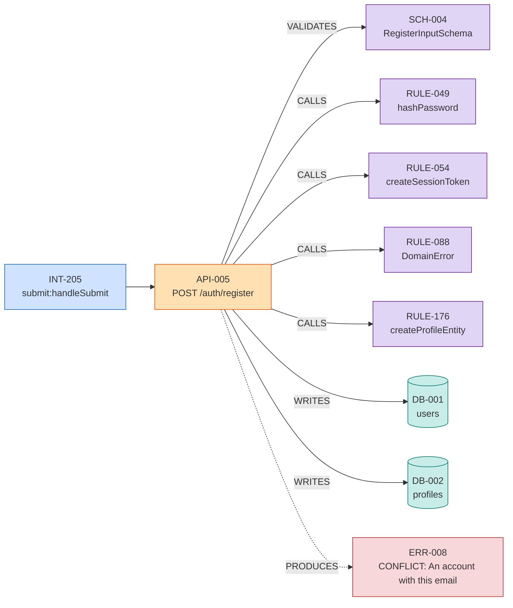
```mermaid
flowchart LR
  API_005["API-005<br/>POST /auth/register"]:::api
  INT_205["INT-205<br/>submit:handleSubmit"]:::ui --> API_005
  API_005 -->|VALIDATES| SCH_004["SCH-004<br/>RegisterInputSchema"]:::logic
  API_005 -->|CALLS| RULE_049["RULE-049<br/>hashPassword"]:::logic
  API_005 -->|CALLS| RULE_054["RULE-054<br/>createSessionToken"]:::logic
  API_005 -->|CALLS| RULE_088["RULE-088<br/>DomainError"]:::logic
  API_005 -->|CALLS| RULE_176["RULE-176<br/>createProfileEntity"]:::logic
  API_005 -->|WRITES| DB_001[("DB-001<br/>users")]:::data
  API_005 -->|WRITES| DB_002[("DB-002<br/>profiles")]:::data
  API_005 -.->|PRODUCES| ERR_008["ERR-008<br/>CONFLICT: An account with this email"]:::bad
  classDef api fill:#ffe0b3,stroke:#e65100;
  classDef ui fill:#cfe2ff,stroke:#1565c0;
  classDef logic fill:#e1d5f5,stroke:#6a1b9a;
  classDef data fill:#c8ece8,stroke:#00796b;
  classDef bad fill:#f8d7da,stroke:#c62828;
```

### API-006 POST /api/v1/auth/login

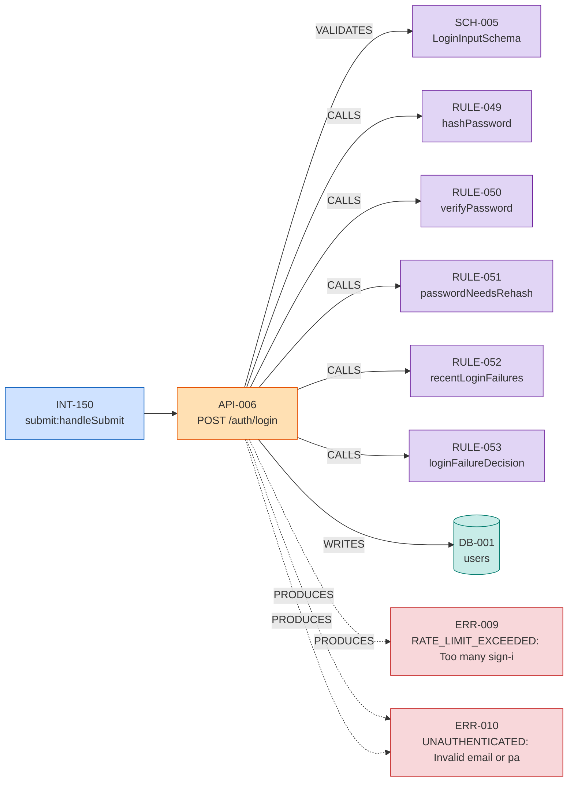
```mermaid
flowchart LR
  API_006["API-006<br/>POST /auth/login"]:::api
  INT_150["INT-150<br/>submit:handleSubmit"]:::ui --> API_006
  API_006 -->|VALIDATES| SCH_005["SCH-005<br/>LoginInputSchema"]:::logic
  API_006 -->|CALLS| RULE_049["RULE-049<br/>hashPassword"]:::logic
  API_006 -->|CALLS| RULE_050["RULE-050<br/>verifyPassword"]:::logic
  API_006 -->|CALLS| RULE_051["RULE-051<br/>passwordNeedsRehash"]:::logic
  API_006 -->|CALLS| RULE_052["RULE-052<br/>recentLoginFailures"]:::logic
  API_006 -->|CALLS| RULE_053["RULE-053<br/>loginFailureDecision"]:::logic
  API_006 -->|WRITES| DB_001[("DB-001<br/>users")]:::data
  API_006 -.->|PRODUCES| ERR_009["ERR-009<br/>RATE_LIMIT_EXCEEDED: Too many sign-i"]:::bad
  API_006 -.->|PRODUCES| ERR_010["ERR-010<br/>UNAUTHENTICATED: Invalid email or pa"]:::bad
  API_006 -.->|PRODUCES| ERR_010["ERR-010<br/>UNAUTHENTICATED: Invalid email or pa"]:::bad
  classDef api fill:#ffe0b3,stroke:#e65100;
  classDef ui fill:#cfe2ff,stroke:#1565c0;
  classDef logic fill:#e1d5f5,stroke:#6a1b9a;
  classDef data fill:#c8ece8,stroke:#00796b;
  classDef bad fill:#f8d7da,stroke:#c62828;
```

### API-007 POST /api/v1/auth/password

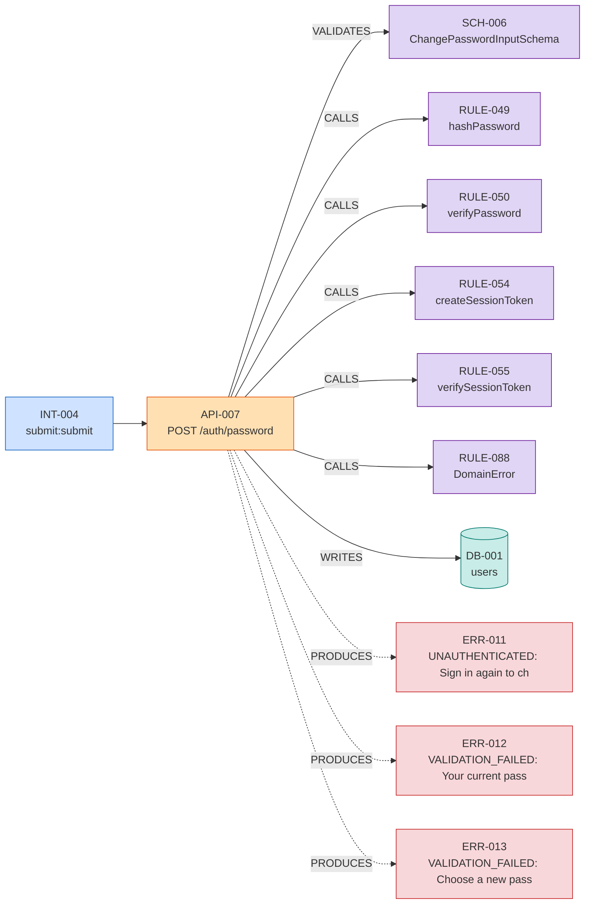
```mermaid
flowchart LR
  API_007["API-007<br/>POST /auth/password"]:::api
  INT_004["INT-004<br/>submit:submit"]:::ui --> API_007
  API_007 -->|VALIDATES| SCH_006["SCH-006<br/>ChangePasswordInputSchema"]:::logic
  API_007 -->|CALLS| RULE_049["RULE-049<br/>hashPassword"]:::logic
  API_007 -->|CALLS| RULE_050["RULE-050<br/>verifyPassword"]:::logic
  API_007 -->|CALLS| RULE_054["RULE-054<br/>createSessionToken"]:::logic
  API_007 -->|CALLS| RULE_055["RULE-055<br/>verifySessionToken"]:::logic
  API_007 -->|CALLS| RULE_088["RULE-088<br/>DomainError"]:::logic
  API_007 -->|WRITES| DB_001[("DB-001<br/>users")]:::data
  API_007 -.->|PRODUCES| ERR_011["ERR-011<br/>UNAUTHENTICATED: Sign in again to ch"]:::bad
  API_007 -.->|PRODUCES| ERR_012["ERR-012<br/>VALIDATION_FAILED: Your current pass"]:::bad
  API_007 -.->|PRODUCES| ERR_013["ERR-013<br/>VALIDATION_FAILED: Choose a new pass"]:::bad
  classDef api fill:#ffe0b3,stroke:#e65100;
  classDef ui fill:#cfe2ff,stroke:#1565c0;
  classDef logic fill:#e1d5f5,stroke:#6a1b9a;
  classDef data fill:#c8ece8,stroke:#00796b;
  classDef bad fill:#f8d7da,stroke:#c62828;
```

### API-008 POST /api/v1/auth/sign-out

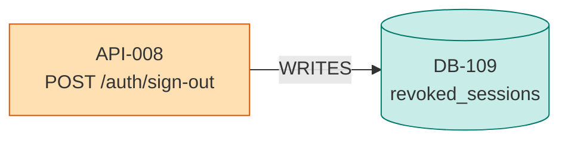
```mermaid
flowchart LR
  API_008["API-008<br/>POST /auth/sign-out"]:::api
  API_008 -->|WRITES| DB_109[("DB-109<br/>revoked_sessions")]:::data
  classDef api fill:#ffe0b3,stroke:#e65100;
  classDef ui fill:#cfe2ff,stroke:#1565c0;
  classDef logic fill:#e1d5f5,stroke:#6a1b9a;
  classDef data fill:#c8ece8,stroke:#00796b;
  classDef bad fill:#f8d7da,stroke:#c62828;
```

### API-009 POST /api/v1/auth/sign-out-others

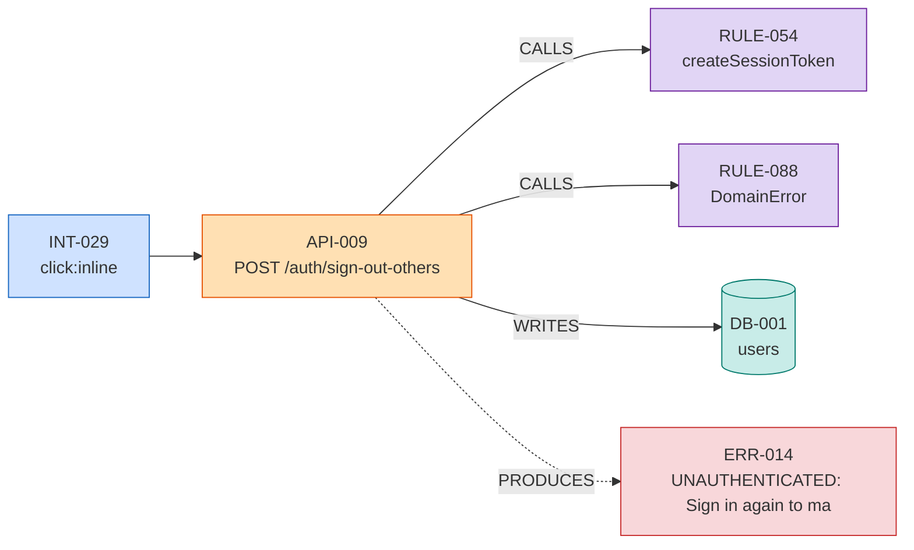
```mermaid
flowchart LR
  API_009["API-009<br/>POST /auth/sign-out-others"]:::api
  INT_029["INT-029<br/>click:inline"]:::ui --> API_009
  API_009 -->|CALLS| RULE_054["RULE-054<br/>createSessionToken"]:::logic
  API_009 -->|CALLS| RULE_088["RULE-088<br/>DomainError"]:::logic
  API_009 -->|WRITES| DB_001[("DB-001<br/>users")]:::data
  API_009 -.->|PRODUCES| ERR_014["ERR-014<br/>UNAUTHENTICATED: Sign in again to ma"]:::bad
  classDef api fill:#ffe0b3,stroke:#e65100;
  classDef ui fill:#cfe2ff,stroke:#1565c0;
  classDef logic fill:#e1d5f5,stroke:#6a1b9a;
  classDef data fill:#c8ece8,stroke:#00796b;
  classDef bad fill:#f8d7da,stroke:#c62828;
```

### API-012 PATCH /api/v1/profile/me

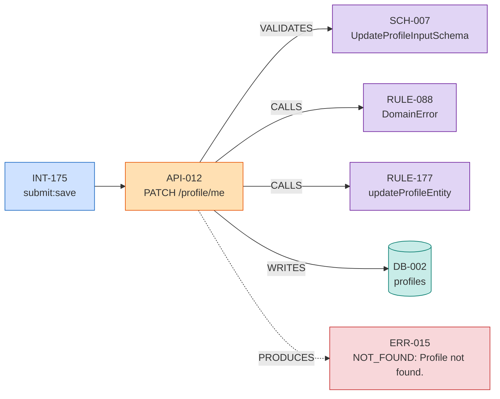
```mermaid
flowchart LR
  API_012["API-012<br/>PATCH /profile/me"]:::api
  INT_175["INT-175<br/>submit:save"]:::ui --> API_012
  API_012 -->|VALIDATES| SCH_007["SCH-007<br/>UpdateProfileInputSchema"]:::logic
  API_012 -->|CALLS| RULE_088["RULE-088<br/>DomainError"]:::logic
  API_012 -->|CALLS| RULE_177["RULE-177<br/>updateProfileEntity"]:::logic
  API_012 -->|WRITES| DB_002[("DB-002<br/>profiles")]:::data
  API_012 -.->|PRODUCES| ERR_015["ERR-015<br/>NOT_FOUND: Profile not found."]:::bad
  classDef api fill:#ffe0b3,stroke:#e65100;
  classDef ui fill:#cfe2ff,stroke:#1565c0;
  classDef logic fill:#e1d5f5,stroke:#6a1b9a;
  classDef data fill:#c8ece8,stroke:#00796b;
  classDef bad fill:#f8d7da,stroke:#c62828;
```

### API-013 GET /api/v1/profile/:id

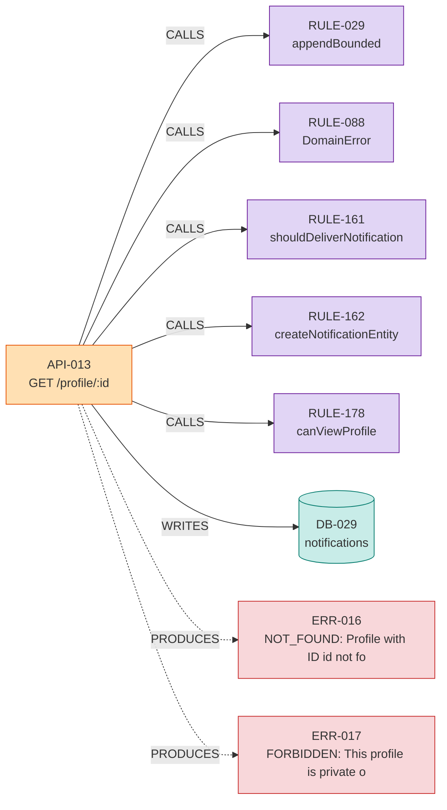
```mermaid
flowchart LR
  API_013["API-013<br/>GET /profile/:id"]:::api
  API_013 -->|CALLS| RULE_029["RULE-029<br/>appendBounded"]:::logic
  API_013 -->|CALLS| RULE_088["RULE-088<br/>DomainError"]:::logic
  API_013 -->|CALLS| RULE_161["RULE-161<br/>shouldDeliverNotification"]:::logic
  API_013 -->|CALLS| RULE_162["RULE-162<br/>createNotificationEntity"]:::logic
  API_013 -->|CALLS| RULE_178["RULE-178<br/>canViewProfile"]:::logic
  API_013 -->|WRITES| DB_029[("DB-029<br/>notifications")]:::data
  API_013 -.->|PRODUCES| ERR_016["ERR-016<br/>NOT_FOUND: Profile with ID id not fo"]:::bad
  API_013 -.->|PRODUCES| ERR_017["ERR-017<br/>FORBIDDEN: This profile is private o"]:::bad
  classDef api fill:#ffe0b3,stroke:#e65100;
  classDef ui fill:#cfe2ff,stroke:#1565c0;
  classDef logic fill:#e1d5f5,stroke:#6a1b9a;
  classDef data fill:#c8ece8,stroke:#00796b;
  classDef bad fill:#f8d7da,stroke:#c62828;
```

### API-014 POST /api/v1/evidence

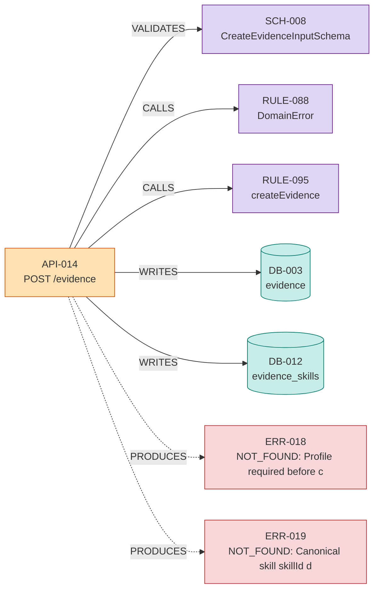
```mermaid
flowchart LR
  API_014["API-014<br/>POST /evidence"]:::api
  API_014 -->|VALIDATES| SCH_008["SCH-008<br/>CreateEvidenceInputSchema"]:::logic
  API_014 -->|CALLS| RULE_088["RULE-088<br/>DomainError"]:::logic
  API_014 -->|CALLS| RULE_095["RULE-095<br/>createEvidence"]:::logic
  API_014 -->|WRITES| DB_003[("DB-003<br/>evidence")]:::data
  API_014 -->|WRITES| DB_012[("DB-012<br/>evidence_skills")]:::data
  API_014 -.->|PRODUCES| ERR_018["ERR-018<br/>NOT_FOUND: Profile required before c"]:::bad
  API_014 -.->|PRODUCES| ERR_019["ERR-019<br/>NOT_FOUND: Canonical skill skillId d"]:::bad
  classDef api fill:#ffe0b3,stroke:#e65100;
  classDef ui fill:#cfe2ff,stroke:#1565c0;
  classDef logic fill:#e1d5f5,stroke:#6a1b9a;
  classDef data fill:#c8ece8,stroke:#00796b;
  classDef bad fill:#f8d7da,stroke:#c62828;
```

### API-018 POST /api/v1/evidence/:id/verify

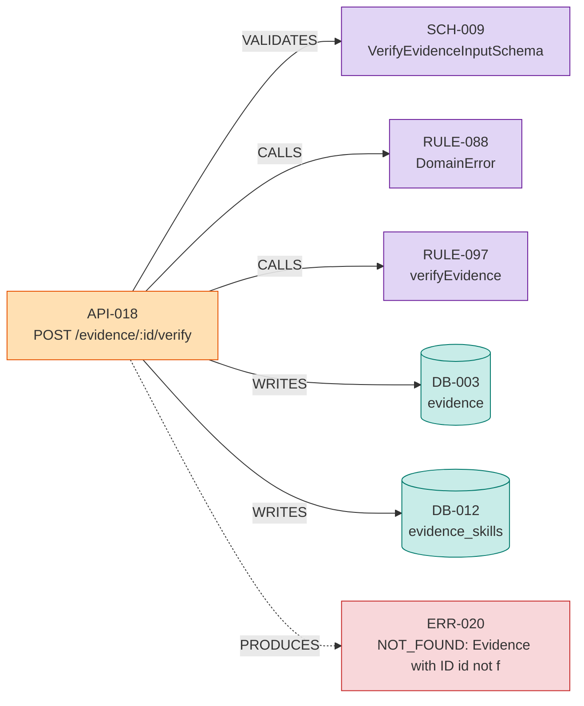
```mermaid
flowchart LR
  API_018["API-018<br/>POST /evidence/:id/verify"]:::api
  API_018 -->|VALIDATES| SCH_009["SCH-009<br/>VerifyEvidenceInputSchema"]:::logic
  API_018 -->|CALLS| RULE_088["RULE-088<br/>DomainError"]:::logic
  API_018 -->|CALLS| RULE_097["RULE-097<br/>verifyEvidence"]:::logic
  API_018 -->|WRITES| DB_003[("DB-003<br/>evidence")]:::data
  API_018 -->|WRITES| DB_012[("DB-012<br/>evidence_skills")]:::data
  API_018 -.->|PRODUCES| ERR_020["ERR-020<br/>NOT_FOUND: Evidence with ID id not f"]:::bad
  classDef api fill:#ffe0b3,stroke:#e65100;
  classDef ui fill:#cfe2ff,stroke:#1565c0;
  classDef logic fill:#e1d5f5,stroke:#6a1b9a;
  classDef data fill:#c8ece8,stroke:#00796b;
  classDef bad fill:#f8d7da,stroke:#c62828;
```

### API-019 POST /api/v1/evidence/:id/dispute

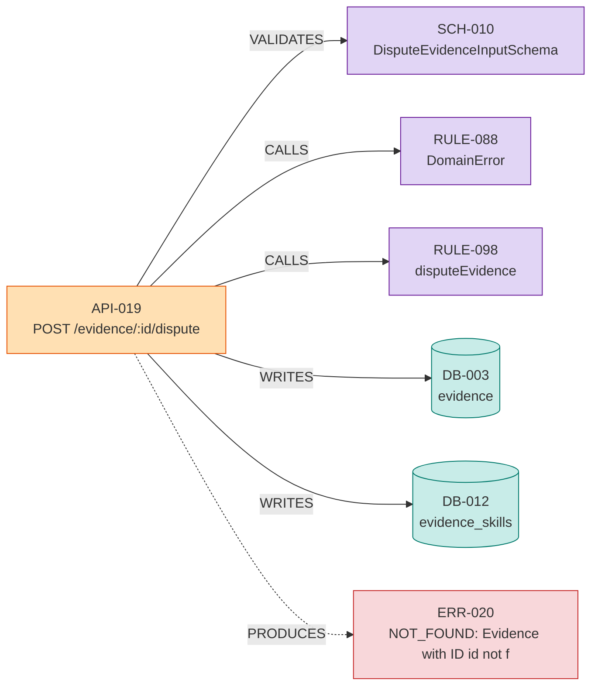
```mermaid
flowchart LR
  API_019["API-019<br/>POST /evidence/:id/dispute"]:::api
  API_019 -->|VALIDATES| SCH_010["SCH-010<br/>DisputeEvidenceInputSchema"]:::logic
  API_019 -->|CALLS| RULE_088["RULE-088<br/>DomainError"]:::logic
  API_019 -->|CALLS| RULE_098["RULE-098<br/>disputeEvidence"]:::logic
  API_019 -->|WRITES| DB_003[("DB-003<br/>evidence")]:::data
  API_019 -->|WRITES| DB_012[("DB-012<br/>evidence_skills")]:::data
  API_019 -.->|PRODUCES| ERR_020["ERR-020<br/>NOT_FOUND: Evidence with ID id not f"]:::bad
  classDef api fill:#ffe0b3,stroke:#e65100;
  classDef ui fill:#cfe2ff,stroke:#1565c0;
  classDef logic fill:#e1d5f5,stroke:#6a1b9a;
  classDef data fill:#c8ece8,stroke:#00796b;
  classDef bad fill:#f8d7da,stroke:#c62828;
```

### API-020 POST /api/v1/evidence/:id/revoke

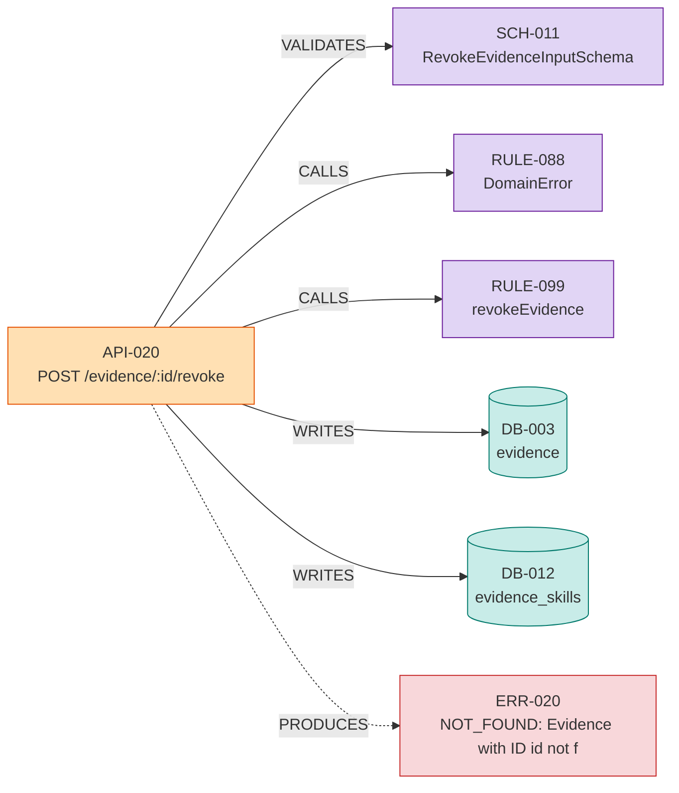
```mermaid
flowchart LR
  API_020["API-020<br/>POST /evidence/:id/revoke"]:::api
  API_020 -->|VALIDATES| SCH_011["SCH-011<br/>RevokeEvidenceInputSchema"]:::logic
  API_020 -->|CALLS| RULE_088["RULE-088<br/>DomainError"]:::logic
  API_020 -->|CALLS| RULE_099["RULE-099<br/>revokeEvidence"]:::logic
  API_020 -->|WRITES| DB_003[("DB-003<br/>evidence")]:::data
  API_020 -->|WRITES| DB_012[("DB-012<br/>evidence_skills")]:::data
  API_020 -.->|PRODUCES| ERR_020["ERR-020<br/>NOT_FOUND: Evidence with ID id not f"]:::bad
  classDef api fill:#ffe0b3,stroke:#e65100;
  classDef ui fill:#cfe2ff,stroke:#1565c0;
  classDef logic fill:#e1d5f5,stroke:#6a1b9a;
  classDef data fill:#c8ece8,stroke:#00796b;
  classDef bad fill:#f8d7da,stroke:#c62828;
```

### API-023 POST /api/v1/skills

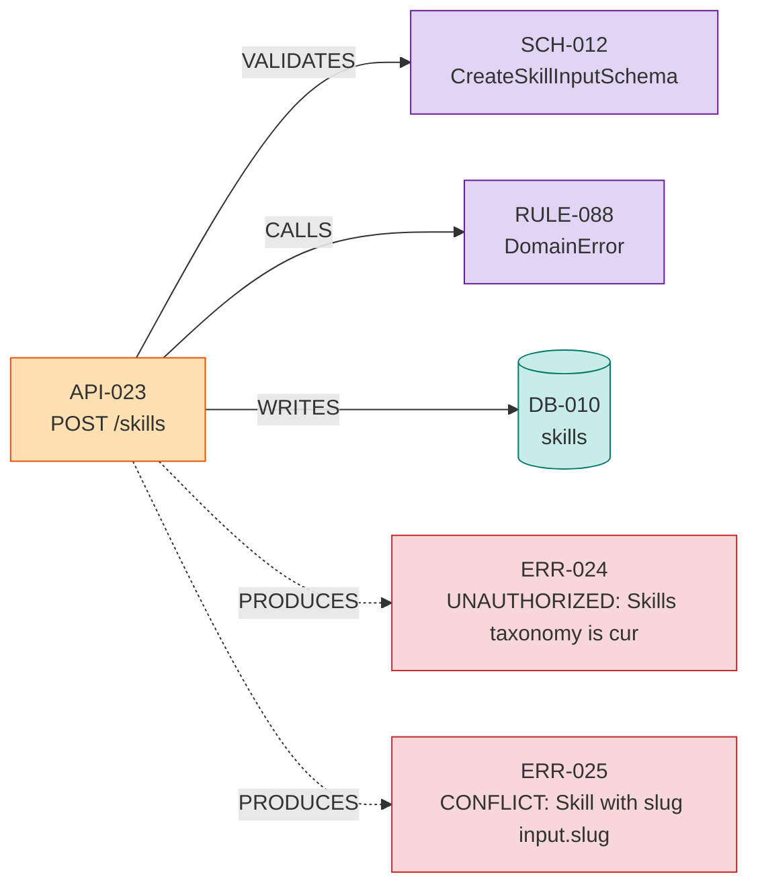
```mermaid
flowchart LR
  API_023["API-023<br/>POST /skills"]:::api
  API_023 -->|VALIDATES| SCH_012["SCH-012<br/>CreateSkillInputSchema"]:::logic
  API_023 -->|CALLS| RULE_088["RULE-088<br/>DomainError"]:::logic
  API_023 -->|WRITES| DB_010[("DB-010<br/>skills")]:::data
  API_023 -.->|PRODUCES| ERR_024["ERR-024<br/>UNAUTHORIZED: Skills taxonomy is cur"]:::bad
  API_023 -.->|PRODUCES| ERR_025["ERR-025<br/>CONFLICT: Skill with slug input.slug"]:::bad
  classDef api fill:#ffe0b3,stroke:#e65100;
  classDef ui fill:#cfe2ff,stroke:#1565c0;
  classDef logic fill:#e1d5f5,stroke:#6a1b9a;
  classDef data fill:#c8ece8,stroke:#00796b;
  classDef bad fill:#f8d7da,stroke:#c62828;
```

### API-026 POST /api/v1/organizations

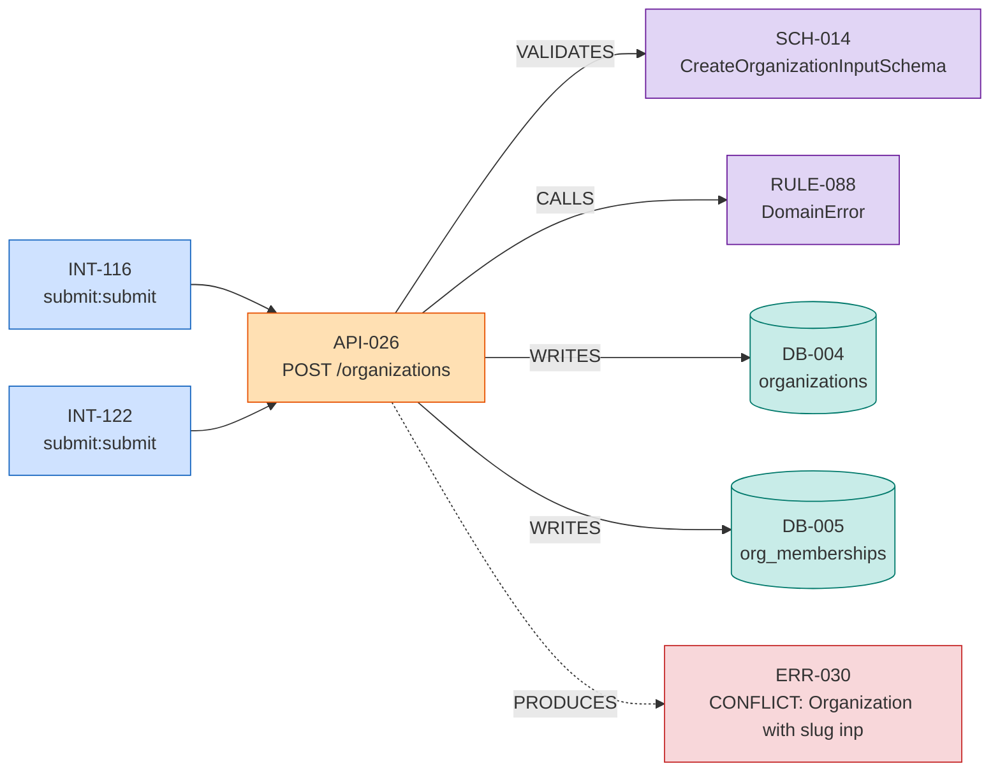
```mermaid
flowchart LR
  API_026["API-026<br/>POST /organizations"]:::api
  INT_116["INT-116<br/>submit:submit"]:::ui --> API_026
  INT_122["INT-122<br/>submit:submit"]:::ui --> API_026
  API_026 -->|VALIDATES| SCH_014["SCH-014<br/>CreateOrganizationInputSchema"]:::logic
  API_026 -->|CALLS| RULE_088["RULE-088<br/>DomainError"]:::logic
  API_026 -->|WRITES| DB_004[("DB-004<br/>organizations")]:::data
  API_026 -->|WRITES| DB_005[("DB-005<br/>org_memberships")]:::data
  API_026 -.->|PRODUCES| ERR_030["ERR-030<br/>CONFLICT: Organization with slug inp"]:::bad
  classDef api fill:#ffe0b3,stroke:#e65100;
  classDef ui fill:#cfe2ff,stroke:#1565c0;
  classDef logic fill:#e1d5f5,stroke:#6a1b9a;
  classDef data fill:#c8ece8,stroke:#00796b;
  classDef bad fill:#f8d7da,stroke:#c62828;
```

### API-030 POST /api/v1/organizations/:id/members

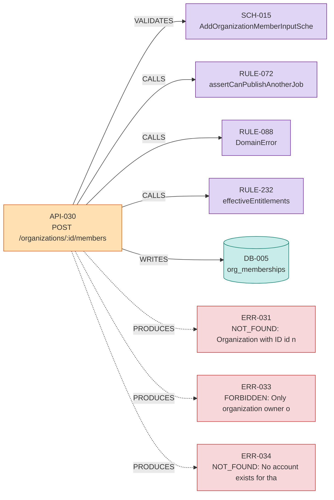
```mermaid
flowchart LR
  API_030["API-030<br/>POST /organizations/:id/members"]:::api
  API_030 -->|VALIDATES| SCH_015["SCH-015<br/>AddOrganizationMemberInputSche"]:::logic
  API_030 -->|CALLS| RULE_072["RULE-072<br/>assertCanPublishAnotherJob"]:::logic
  API_030 -->|CALLS| RULE_088["RULE-088<br/>DomainError"]:::logic
  API_030 -->|CALLS| RULE_232["RULE-232<br/>effectiveEntitlements"]:::logic
  API_030 -->|WRITES| DB_005[("DB-005<br/>org_memberships")]:::data
  API_030 -.->|PRODUCES| ERR_031["ERR-031<br/>NOT_FOUND: Organization with ID id n"]:::bad
  API_030 -.->|PRODUCES| ERR_033["ERR-033<br/>FORBIDDEN: Only organization owner o"]:::bad
  API_030 -.->|PRODUCES| ERR_034["ERR-034<br/>NOT_FOUND: No account exists for tha"]:::bad
  classDef api fill:#ffe0b3,stroke:#e65100;
  classDef ui fill:#cfe2ff,stroke:#1565c0;
  classDef logic fill:#e1d5f5,stroke:#6a1b9a;
  classDef data fill:#c8ece8,stroke:#00796b;
  classDef bad fill:#f8d7da,stroke:#c62828;
```

### API-031 POST /api/v1/jobs

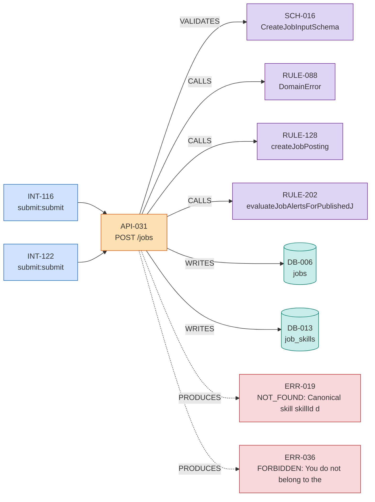
```mermaid
flowchart LR
  API_031["API-031<br/>POST /jobs"]:::api
  INT_116["INT-116<br/>submit:submit"]:::ui --> API_031
  INT_122["INT-122<br/>submit:submit"]:::ui --> API_031
  API_031 -->|VALIDATES| SCH_016["SCH-016<br/>CreateJobInputSchema"]:::logic
  API_031 -->|CALLS| RULE_088["RULE-088<br/>DomainError"]:::logic
  API_031 -->|CALLS| RULE_128["RULE-128<br/>createJobPosting"]:::logic
  API_031 -->|CALLS| RULE_202["RULE-202<br/>evaluateJobAlertsForPublishedJ"]:::logic
  API_031 -->|WRITES| DB_006[("DB-006<br/>jobs")]:::data
  API_031 -->|WRITES| DB_013[("DB-013<br/>job_skills")]:::data
  API_031 -.->|PRODUCES| ERR_019["ERR-019<br/>NOT_FOUND: Canonical skill skillId d"]:::bad
  API_031 -.->|PRODUCES| ERR_036["ERR-036<br/>FORBIDDEN: You do not belong to the "]:::bad
  classDef api fill:#ffe0b3,stroke:#e65100;
  classDef ui fill:#cfe2ff,stroke:#1565c0;
  classDef logic fill:#e1d5f5,stroke:#6a1b9a;
  classDef data fill:#c8ece8,stroke:#00796b;
  classDef bad fill:#f8d7da,stroke:#c62828;
```

### API-034 PATCH /api/v1/jobs/:id/status

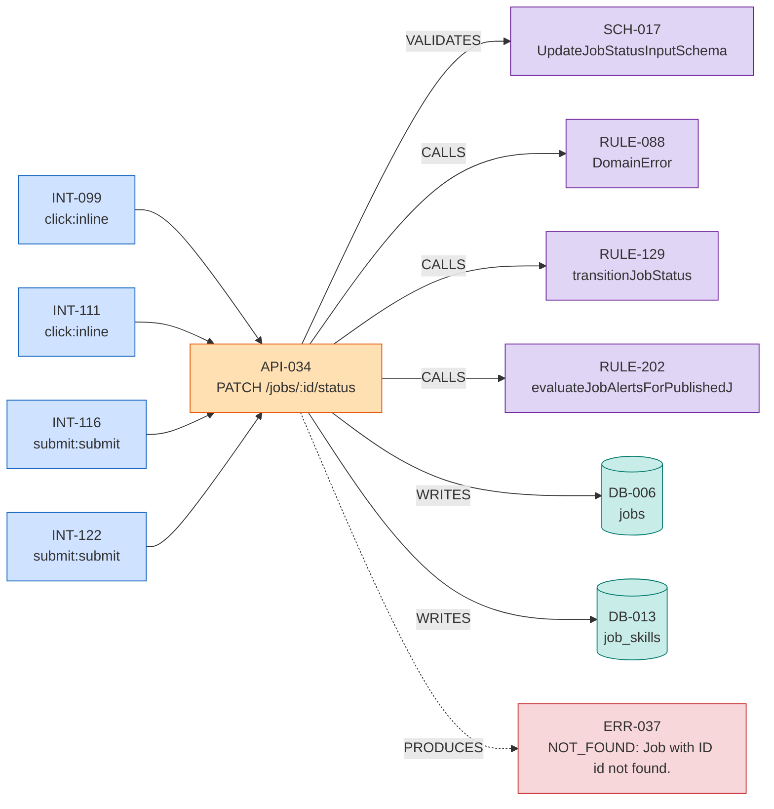
```mermaid
flowchart LR
  API_034["API-034<br/>PATCH /jobs/:id/status"]:::api
  INT_099["INT-099<br/>click:inline"]:::ui --> API_034
  INT_111["INT-111<br/>click:inline"]:::ui --> API_034
  INT_116["INT-116<br/>submit:submit"]:::ui --> API_034
  INT_122["INT-122<br/>submit:submit"]:::ui --> API_034
  API_034 -->|VALIDATES| SCH_017["SCH-017<br/>UpdateJobStatusInputSchema"]:::logic
  API_034 -->|CALLS| RULE_088["RULE-088<br/>DomainError"]:::logic
  API_034 -->|CALLS| RULE_129["RULE-129<br/>transitionJobStatus"]:::logic
  API_034 -->|CALLS| RULE_202["RULE-202<br/>evaluateJobAlertsForPublishedJ"]:::logic
  API_034 -->|WRITES| DB_006[("DB-006<br/>jobs")]:::data
  API_034 -->|WRITES| DB_013[("DB-013<br/>job_skills")]:::data
  API_034 -.->|PRODUCES| ERR_037["ERR-037<br/>NOT_FOUND: Job with ID id not found."]:::bad
  classDef api fill:#ffe0b3,stroke:#e65100;
  classDef ui fill:#cfe2ff,stroke:#1565c0;
  classDef logic fill:#e1d5f5,stroke:#6a1b9a;
  classDef data fill:#c8ece8,stroke:#00796b;
  classDef bad fill:#f8d7da,stroke:#c62828;
```

### API-047 POST /api/v1/jobs/:id/apply

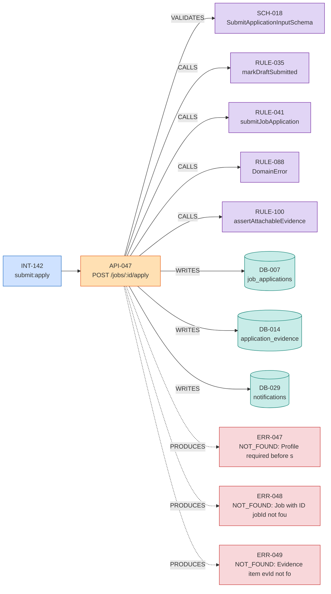
```mermaid
flowchart LR
  API_047["API-047<br/>POST /jobs/:id/apply"]:::api
  INT_142["INT-142<br/>submit:apply"]:::ui --> API_047
  API_047 -->|VALIDATES| SCH_018["SCH-018<br/>SubmitApplicationInputSchema"]:::logic
  API_047 -->|CALLS| RULE_035["RULE-035<br/>markDraftSubmitted"]:::logic
  API_047 -->|CALLS| RULE_041["RULE-041<br/>submitJobApplication"]:::logic
  API_047 -->|CALLS| RULE_088["RULE-088<br/>DomainError"]:::logic
  API_047 -->|CALLS| RULE_100["RULE-100<br/>assertAttachableEvidence"]:::logic
  API_047 -->|WRITES| DB_007[("DB-007<br/>job_applications")]:::data
  API_047 -->|WRITES| DB_014[("DB-014<br/>application_evidence")]:::data
  API_047 -->|WRITES| DB_029[("DB-029<br/>notifications")]:::data
  API_047 -.->|PRODUCES| ERR_047["ERR-047<br/>NOT_FOUND: Profile required before s"]:::bad
  API_047 -.->|PRODUCES| ERR_048["ERR-048<br/>NOT_FOUND: Job with ID jobId not fou"]:::bad
  API_047 -.->|PRODUCES| ERR_049["ERR-049<br/>NOT_FOUND: Evidence item evId not fo"]:::bad
  classDef api fill:#ffe0b3,stroke:#e65100;
  classDef ui fill:#cfe2ff,stroke:#1565c0;
  classDef logic fill:#e1d5f5,stroke:#6a1b9a;
  classDef data fill:#c8ece8,stroke:#00796b;
  classDef bad fill:#f8d7da,stroke:#c62828;
```

### API-051 POST /api/v1/applications/:id/transition

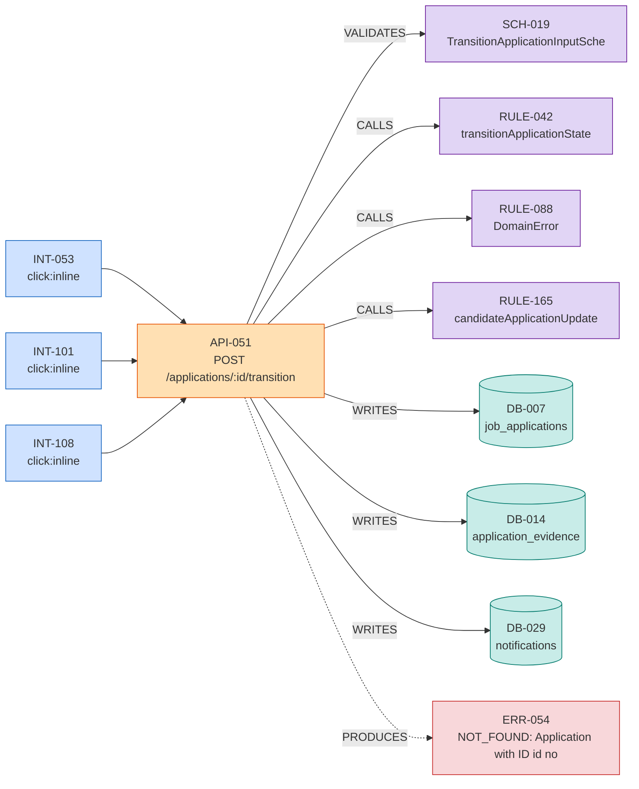
```mermaid
flowchart LR
  API_051["API-051<br/>POST /applications/:id/transition"]:::api
  INT_053["INT-053<br/>click:inline"]:::ui --> API_051
  INT_101["INT-101<br/>click:inline"]:::ui --> API_051
  INT_108["INT-108<br/>click:inline"]:::ui --> API_051
  API_051 -->|VALIDATES| SCH_019["SCH-019<br/>TransitionApplicationInputSche"]:::logic
  API_051 -->|CALLS| RULE_042["RULE-042<br/>transitionApplicationState"]:::logic
  API_051 -->|CALLS| RULE_088["RULE-088<br/>DomainError"]:::logic
  API_051 -->|CALLS| RULE_165["RULE-165<br/>candidateApplicationUpdate"]:::logic
  API_051 -->|WRITES| DB_007[("DB-007<br/>job_applications")]:::data
  API_051 -->|WRITES| DB_014[("DB-014<br/>application_evidence")]:::data
  API_051 -->|WRITES| DB_029[("DB-029<br/>notifications")]:::data
  API_051 -.->|PRODUCES| ERR_054["ERR-054<br/>NOT_FOUND: Application with ID id no"]:::bad
  classDef api fill:#ffe0b3,stroke:#e65100;
  classDef ui fill:#cfe2ff,stroke:#1565c0;
  classDef logic fill:#e1d5f5,stroke:#6a1b9a;
  classDef data fill:#c8ece8,stroke:#00796b;
  classDef bad fill:#f8d7da,stroke:#c62828;
```

### API-113 POST /api/v1/threads

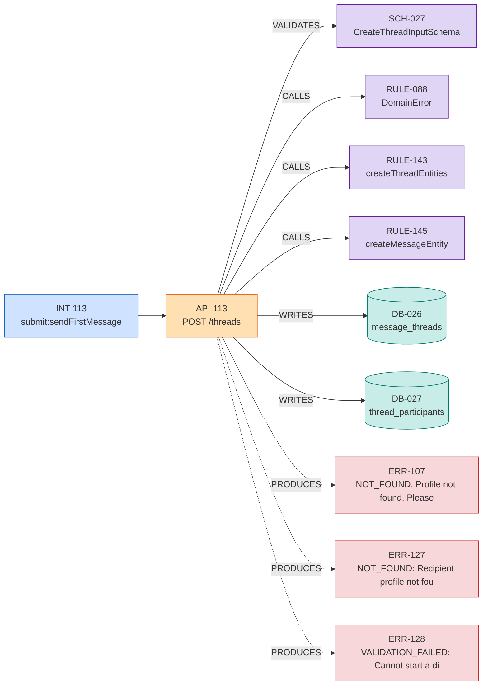
```mermaid
flowchart LR
  API_113["API-113<br/>POST /threads"]:::api
  INT_113["INT-113<br/>submit:sendFirstMessage"]:::ui --> API_113
  API_113 -->|VALIDATES| SCH_027["SCH-027<br/>CreateThreadInputSchema"]:::logic
  API_113 -->|CALLS| RULE_088["RULE-088<br/>DomainError"]:::logic
  API_113 -->|CALLS| RULE_143["RULE-143<br/>createThreadEntities"]:::logic
  API_113 -->|CALLS| RULE_145["RULE-145<br/>createMessageEntity"]:::logic
  API_113 -->|WRITES| DB_026[("DB-026<br/>message_threads")]:::data
  API_113 -->|WRITES| DB_027[("DB-027<br/>thread_participants")]:::data
  API_113 -.->|PRODUCES| ERR_107["ERR-107<br/>NOT_FOUND: Profile not found. Please"]:::bad
  API_113 -.->|PRODUCES| ERR_127["ERR-127<br/>NOT_FOUND: Recipient profile not fou"]:::bad
  API_113 -.->|PRODUCES| ERR_128["ERR-128<br/>VALIDATION_FAILED: Cannot start a di"]:::bad
  classDef api fill:#ffe0b3,stroke:#e65100;
  classDef ui fill:#cfe2ff,stroke:#1565c0;
  classDef logic fill:#e1d5f5,stroke:#6a1b9a;
  classDef data fill:#c8ece8,stroke:#00796b;
  classDef bad fill:#f8d7da,stroke:#c62828;
```

### API-114 GET /api/v1/threads/:id

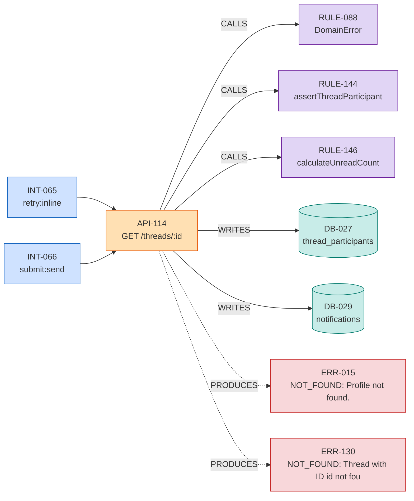
```mermaid
flowchart LR
  API_114["API-114<br/>GET /threads/:id"]:::api
  INT_065["INT-065<br/>retry:inline"]:::ui --> API_114
  INT_066["INT-066<br/>submit:send"]:::ui --> API_114
  API_114 -->|CALLS| RULE_088["RULE-088<br/>DomainError"]:::logic
  API_114 -->|CALLS| RULE_144["RULE-144<br/>assertThreadParticipant"]:::logic
  API_114 -->|CALLS| RULE_146["RULE-146<br/>calculateUnreadCount"]:::logic
  API_114 -->|WRITES| DB_027[("DB-027<br/>thread_participants")]:::data
  API_114 -->|WRITES| DB_029[("DB-029<br/>notifications")]:::data
  API_114 -.->|PRODUCES| ERR_015["ERR-015<br/>NOT_FOUND: Profile not found."]:::bad
  API_114 -.->|PRODUCES| ERR_130["ERR-130<br/>NOT_FOUND: Thread with ID id not fou"]:::bad
  classDef api fill:#ffe0b3,stroke:#e65100;
  classDef ui fill:#cfe2ff,stroke:#1565c0;
  classDef logic fill:#e1d5f5,stroke:#6a1b9a;
  classDef data fill:#c8ece8,stroke:#00796b;
  classDef bad fill:#f8d7da,stroke:#c62828;
```

### API-115 POST /api/v1/threads/:id/messages

```mermaid
flowchart LR
  API_115["API-115<br/>POST /threads/:id/messages"]:::api
  INT_066["INT-066<br/>submit:send"]:::ui --> API_115
  API_115 -->|VALIDATES| SCH_028["SCH-028<br/>SendMessageInputSchema"]:::logic
  API_115 -->|CALLS| RULE_088["RULE-088<br/>DomainError"]:::logic
  API_115 -->|CALLS| RULE_144["RULE-144<br/>assertThreadParticipant"]:::logic
  API_115 -->|CALLS| RULE_145["RULE-145<br/>createMessageEntity"]:::logic
  API_115 -->|WRITES| DB_026[("DB-026<br/>message_threads")]:::data
  API_115 -->|WRITES| DB_027[("DB-027<br/>thread_participants")]:::data
  API_115 -.->|PRODUCES| ERR_015["ERR-015<br/>NOT_FOUND: Profile not found."]:::bad
  API_115 -.->|PRODUCES| ERR_130["ERR-130<br/>NOT_FOUND: Thread with ID id not fou"]:::bad
  classDef api fill:#ffe0b3,stroke:#e65100;
  classDef ui fill:#cfe2ff,stroke:#1565c0;
  classDef logic fill:#e1d5f5,stroke:#6a1b9a;
  classDef data fill:#c8ece8,stroke:#00796b;
  classDef bad fill:#f8d7da,stroke:#c62828;
```

### API-116 POST /api/v1/threads/:id/read

```mermaid
flowchart LR
  API_116["API-116<br/>POST /threads/:id/read"]:::api
  API_116 -->|CALLS| RULE_088["RULE-088<br/>DomainError"]:::logic
  API_116 -->|CALLS| RULE_144["RULE-144<br/>assertThreadParticipant"]:::logic
  API_116 -->|WRITES| DB_027[("DB-027<br/>thread_participants")]:::data
  API_116 -.->|PRODUCES| ERR_015["ERR-015<br/>NOT_FOUND: Profile not found."]:::bad
  API_116 -.->|PRODUCES| ERR_130["ERR-130<br/>NOT_FOUND: Thread with ID id not fou"]:::bad
  classDef api fill:#ffe0b3,stroke:#e65100;
  classDef ui fill:#cfe2ff,stroke:#1565c0;
  classDef logic fill:#e1d5f5,stroke:#6a1b9a;
  classDef data fill:#c8ece8,stroke:#00796b;
  classDef bad fill:#f8d7da,stroke:#c62828;
```

### API-119 POST /api/v1/notifications/mark-read

```mermaid
flowchart LR
  API_119["API-119<br/>POST /notifications/mark-read"]:::api
  API_119 -->|VALIDATES| SCH_029["SCH-029<br/>MarkNotificationsReadInputSche"]:::logic
  API_119 -->|CALLS| RULE_088["RULE-088<br/>DomainError"]:::logic
  API_119 -->|CALLS| RULE_163["RULE-163<br/>resolveMarkReadTargets"]:::logic
  API_119 -->|CALLS| RULE_164["RULE-164<br/>markNotificationsAsRead"]:::logic
  API_119 -->|WRITES| DB_029[("DB-029<br/>notifications")]:::data
  API_119 -.->|PRODUCES| ERR_015["ERR-015<br/>NOT_FOUND: Profile not found."]:::bad
  classDef api fill:#ffe0b3,stroke:#e65100;
  classDef ui fill:#cfe2ff,stroke:#1565c0;
  classDef logic fill:#e1d5f5,stroke:#6a1b9a;
  classDef data fill:#c8ece8,stroke:#00796b;
  classDef bad fill:#f8d7da,stroke:#c62828;
```

### API-121 PATCH /api/v1/notifications/preferences

```mermaid
flowchart LR
  API_121["API-121<br/>PATCH /notifications/preferences"]:::api
  API_121 -->|VALIDATES| SCH_030["SCH-030<br/>UpdateNotificationPreferencesI"]:::logic
  API_121 -->|CALLS| RULE_088["RULE-088<br/>DomainError"]:::logic
  API_121 -->|CALLS| RULE_160["RULE-160<br/>createDefaultNotificationPrefe"]:::logic
  API_121 -->|WRITES| DB_030[("DB-030<br/>notification_preferences")]:::data
  API_121 -.->|PRODUCES| ERR_015["ERR-015<br/>NOT_FOUND: Profile not found."]:::bad
  classDef api fill:#ffe0b3,stroke:#e65100;
  classDef ui fill:#cfe2ff,stroke:#1565c0;
  classDef logic fill:#e1d5f5,stroke:#6a1b9a;
  classDef data fill:#c8ece8,stroke:#00796b;
  classDef bad fill:#f8d7da,stroke:#c62828;
```

### API-213 PATCH /api/v1/settings

```mermaid
flowchart LR
  API_213["API-213<br/>PATCH /settings"]:::api
  INT_200["INT-200<br/>submit:save"]:::ui --> API_213
  API_213 -->|VALIDATES| SCH_046["SCH-046<br/>UpdateUserSettingsInputSchema"]:::logic
  API_213 -->|CALLS| RULE_088["RULE-088<br/>DomainError"]:::logic
  API_213 -->|CALLS| RULE_214["RULE-214<br/>updateUserSettings"]:::logic
  API_213 -->|WRITES| DB_002[("DB-002<br/>profiles")]:::data
  API_213 -.->|PRODUCES| ERR_202["ERR-202<br/>SERVICE_UNAVAILABLE: Saving a BYO AI"]:::bad
  classDef api fill:#ffe0b3,stroke:#e65100;
  classDef ui fill:#cfe2ff,stroke:#1565c0;
  classDef logic fill:#e1d5f5,stroke:#6a1b9a;
  classDef data fill:#c8ece8,stroke:#00796b;
  classDef bad fill:#f8d7da,stroke:#c62828;
```

### API-271 POST /api/v1/candidates/work-history

```mermaid
flowchart LR
  API_271["API-271<br/>POST /candidates/work-history"]:::api
  INT_081["INT-081<br/>submit:handleAddSubmit"]:::ui --> API_271
  API_271 -->|VALIDATES| SCH_137["SCH-137<br/>CreateWorkHistoryInputSchema"]:::logic
  API_271 -->|CALLS| RULE_088["RULE-088<br/>DomainError"]:::logic
  API_271 -->|CALLS| RULE_271["RULE-271<br/>createWorkHistory"]:::logic
  API_271 -->|WRITES| DB_105[("DB-105<br/>verified_work_histories")]:::data
  API_271 -.->|PRODUCES| ERR_234["ERR-234<br/>VALIDATION_FAILED: companyId does no"]:::bad
  classDef api fill:#ffe0b3,stroke:#e65100;
  classDef ui fill:#cfe2ff,stroke:#1565c0;
  classDef logic fill:#e1d5f5,stroke:#6a1b9a;
  classDef data fill:#c8ece8,stroke:#00796b;
  classDef bad fill:#f8d7da,stroke:#c62828;
```

### API-272 POST /api/v1/candidates/work-history/:id/verify-email

```mermaid
flowchart LR
  API_272["API-272<br/>POST /candidates/work-history/:id/verify-ema"]:::api
  INT_072["INT-072<br/>submit:confirm"]:::ui --> API_272
  INT_074["INT-074<br/>click:inline"]:::ui --> API_272
  INT_075["INT-075<br/>submit:inline"]:::ui --> API_272
  INT_081["INT-081<br/>submit:handleAddSubmit"]:::ui --> API_272
  API_272 -->|VALIDATES| SCH_138["SCH-138<br/>VerifyWorkHistoryEmailInputSch"]:::logic
  API_272 -->|CALLS| RULE_088["RULE-088<br/>DomainError"]:::logic
  API_272 -->|CALLS| RULE_272["RULE-272<br/>assertCorporateEmailEligible"]:::logic
  API_272 -->|CALLS| RULE_273["RULE-273<br/>assertEmailCodeIssuable"]:::logic
  API_272 -->|CALLS| RULE_275["RULE-275<br/>verifyCorporateEmail"]:::logic
  API_272 -->|WRITES| DB_105[("DB-105<br/>verified_work_histories")]:::data
  API_272 -->|WRITES| DB_108[("DB-108<br/>work_history_email_challen")]:::data
  API_272 -->|WRITES| DB_108[("DB-108<br/>work_history_email_challen")]:::data
  API_272 -.->|PRODUCES| ERR_235["ERR-235<br/>NOT_FOUND: Work history record id no"]:::bad
  API_272 -.->|PRODUCES| ERR_236["ERR-236<br/>FORBIDDEN: Access denied to verify t"]:::bad
  API_272 -.->|PRODUCES| ERR_237["ERR-237<br/>SERVICE_UNAVAILABLE: Work-email veri"]:::bad
  classDef api fill:#ffe0b3,stroke:#e65100;
  classDef ui fill:#cfe2ff,stroke:#1565c0;
  classDef logic fill:#e1d5f5,stroke:#6a1b9a;
  classDef data fill:#c8ece8,stroke:#00796b;
  classDef bad fill:#f8d7da,stroke:#c62828;
```

### API-273 POST /api/v1/candidates/work-history/:id/references/request

```mermaid
flowchart LR
  API_273["API-273<br/>POST /candidates/work-history/:id/references"]:::api
  INT_090["INT-090<br/>submit:handleReferenceSubm"]:::ui --> API_273
  API_273 -->|VALIDATES| SCH_139["SCH-139<br/>RequestEmploymentReferenceInpu"]:::logic
  API_273 -->|CALLS| RULE_088["RULE-088<br/>DomainError"]:::logic
  API_273 -->|CALLS| RULE_274["RULE-274<br/>assertReferenceRequestAllowed"]:::logic
  API_273 -->|CALLS| RULE_277["RULE-277<br/>requestEmploymentReference"]:::logic
  API_273 -->|WRITES| DB_106[("DB-106<br/>employment_references")]:::data
  API_273 -->|WRITES| DB_106[("DB-106<br/>employment_references")]:::data
  API_273 -.->|PRODUCES| ERR_235["ERR-235<br/>NOT_FOUND: Work history record id no"]:::bad
  API_273 -.->|PRODUCES| ERR_243["ERR-243<br/>FORBIDDEN: Access denied to request "]:::bad
  API_273 -.->|PRODUCES| ERR_244["ERR-244<br/>SERVICE_UNAVAILABLE: Reference invit"]:::bad
  classDef api fill:#ffe0b3,stroke:#e65100;
  classDef ui fill:#cfe2ff,stroke:#1565c0;
  classDef logic fill:#e1d5f5,stroke:#6a1b9a;
  classDef data fill:#c8ece8,stroke:#00796b;
  classDef bad fill:#f8d7da,stroke:#c62828;
```

### API-275 POST /api/v1/candidates/work-history/references/:refId/submit

```mermaid
flowchart LR
  API_275["API-275<br/>POST /candidates/work-history/references/:re"]:::api
  INT_190["INT-190<br/>submit:submit"]:::ui --> API_275
  API_275 -->|VALIDATES| SCH_140["SCH-140<br/>SubmitEmploymentReferenceInput"]:::logic
  API_275 -->|CALLS| RULE_088["RULE-088<br/>DomainError"]:::logic
  API_275 -->|CALLS| RULE_178["RULE-178<br/>canViewProfile"]:::logic
  API_275 -->|CALLS| RULE_270["RULE-270<br/>calculateVerificationScoreAndB"]:::logic
  API_275 -->|CALLS| RULE_276["RULE-276<br/>referenceLinkExpired"]:::logic
  API_275 -->|CALLS| RULE_278["RULE-278<br/>submitEmploymentReference"]:::logic
  API_275 -->|WRITES| DB_029[("DB-029<br/>notifications")]:::data
  API_275 -->|WRITES| DB_105[("DB-105<br/>verified_work_histories")]:::data
  API_275 -->|WRITES| DB_106[("DB-106<br/>employment_references")]:::data
  API_275 -.->|PRODUCES| ERR_017["ERR-017<br/>FORBIDDEN: This profile is private o"]:::bad
  API_275 -.->|PRODUCES| ERR_247["ERR-247<br/>NOT_FOUND: Employment reference refI"]:::bad
  API_275 -.->|PRODUCES| ERR_248["ERR-248<br/>FORBIDDEN: Candidate cannot submit t"]:::bad
  classDef api fill:#ffe0b3,stroke:#e65100;
  classDef ui fill:#cfe2ff,stroke:#1565c0;
  classDef logic fill:#e1d5f5,stroke:#6a1b9a;
  classDef data fill:#c8ece8,stroke:#00796b;
  classDef bad fill:#f8d7da,stroke:#c62828;
```

### API-278 DELETE /api/v1/candidates/work-history/:id

```mermaid
flowchart LR
  API_278["API-278<br/>DELETE /candidates/work-history/:id"]:::api
  INT_097["INT-097<br/>click:inline"]:::ui --> API_278
  API_278 -->|CALLS| RULE_088["RULE-088<br/>DomainError"]:::logic
  API_278 -->|WRITES| DB_105[("DB-105<br/>verified_work_histories")]:::data
  API_278 -.->|PRODUCES| ERR_235["ERR-235<br/>NOT_FOUND: Work history record id no"]:::bad
  API_278 -.->|PRODUCES| ERR_251["ERR-251<br/>FORBIDDEN: Only the person this role"]:::bad
  classDef api fill:#ffe0b3,stroke:#e65100;
  classDef ui fill:#cfe2ff,stroke:#1565c0;
  classDef logic fill:#e1d5f5,stroke:#6a1b9a;
  classDef data fill:#c8ece8,stroke:#00796b;
  classDef bad fill:#f8d7da,stroke:#c62828;
```

## 2. Chain table for every endpoint

Chain = callers (interactions/screens/components) → endpoint → rules → stores → tables → tests.

| API     | Endpoint                                                          | Callers                               | Rules | Stores                                                                                       | Tables (persist kinds)                                                                                                                   | Durability | Tests |
| ------- | ----------------------------------------------------------------- | ------------------------------------- | ----- | -------------------------------------------------------------------------------------------- | ---------------------------------------------------------------------------------------------------------------------------------------- | ---------- | ----- |
| API-001 | GET /health                                                       |                                       | 0     |                                                                                              |                                                                                                                                          | durable    | 6     |
| API-002 | GET /ready                                                        |                                       | 0     |                                                                                              |                                                                                                                                          | durable    | 2     |
| API-003 | GET /api/v1/health                                                |                                       | 0     | core-store.ts                                                                                |                                                                                                                                          | durable    | 6     |
| API-004 | GET /api/v1/feature-flags                                         |                                       | 4     | feature-flag-store.ts                                                                        |                                                                                                                                          | durable    | 4     |
| API-005 | POST /api/v1/auth/register                                        | INT-205, SCR-003                      | 4     | core-store.ts                                                                                | users, profiles                                                                                                                          | durable    | 113   |
| API-006 | POST /api/v1/auth/login                                           | INT-150, SCR-002                      | 7     | core-store.ts                                                                                | users                                                                                                                                    | durable    | 19    |
| API-007 | POST /api/v1/auth/password                                        | COMP-002, INT-004                     | 5     | core-store.ts                                                                                | users                                                                                                                                    | durable    | 2     |
| API-008 | POST /api/v1/auth/sign-out                                        |                                       | 0     | core-store.ts                                                                                | revoked_sessions                                                                                                                         | durable    | 3     |
| API-009 | POST /api/v1/auth/sign-out-others                                 | COMP-014, INT-029                     | 2     | core-store.ts                                                                                | users                                                                                                                                    | durable    | 2     |
| API-010 | GET /api/v1/auth/session                                          |                                       | 0     |                                                                                              |                                                                                                                                          | durable    | 5     |
| API-011 | GET /api/v1/profile/me                                            |                                       | 1     |                                                                                              |                                                                                                                                          | durable    | 10    |
| API-012 | PATCH /api/v1/profile/me                                          | INT-175, SCR-014                      | 2     | core-store.ts                                                                                | profiles                                                                                                                                 | durable    | 10    |
| API-013 | GET /api/v1/profile/:id                                           |                                       | 5     | core-store.ts                                                                                | notifications                                                                                                                            | durable    | 11    |
| API-014 | POST /api/v1/evidence                                             |                                       | 2     | core-store.ts                                                                                | evidence, evidence_skills                                                                                                                | durable    | 10    |
| API-015 | GET /api/v1/evidence/:id                                          |                                       | 4     |                                                                                              |                                                                                                                                          | durable    | 10    |
| API-016 | GET /api/v1/evidence/mine                                         | COMP-004, INT-014, SCR-008, SCR-011   | 0     |                                                                                              |                                                                                                                                          | durable    | 5     |
| API-017 | GET /api/v1/evidence/subject/:subjectId                           |                                       | 3     |                                                                                              |                                                                                                                                          | durable    | 3     |
| API-018 | POST /api/v1/evidence/:id/verify                                  |                                       | 2     | core-store.ts                                                                                | evidence, evidence_skills                                                                                                                | durable    | 3     |
| API-019 | POST /api/v1/evidence/:id/dispute                                 |                                       | 2     | core-store.ts                                                                                | evidence, evidence_skills                                                                                                                | durable    | 3     |
| API-020 | POST /api/v1/evidence/:id/revoke                                  |                                       | 2     | core-store.ts                                                                                | evidence, evidence_skills                                                                                                                | durable    | 3     |
| API-021 | GET /api/v1/evidence/:id/verify-public                            | COMP-004, INT-014                     | 2     |                                                                                              |                                                                                                                                          | durable    | 3     |
| API-022 | GET /api/v1/skills                                                | COMP-015, INT-030, INT-031, INT-060 … | 0     |                                                                                              |                                                                                                                                          | durable    | 14    |
| API-023 | POST /api/v1/skills                                               |                                       | 1     | core-store.ts                                                                                | skills                                                                                                                                   | durable    | 3     |
| API-024 | POST /api/v1/skills/relationships                                 |                                       | 2     |                                                                                              |                                                                                                                                          | ephemeral  | 2     |
| API-025 | GET /api/v1/skills/:id/graph                                      | COMP-015, INT-030, INT-031            | 2     |                                                                                              |                                                                                                                                          | ephemeral  | 3     |
| API-026 | POST /api/v1/organizations                                        | INT-116, INT-122, SCR-025             | 1     | core-store.ts                                                                                | organizations, org_memberships                                                                                                           | durable    | 37    |
| API-027 | GET /api/v1/organizations/mine                                    | SCR-011, SCR-025                      | 0     |                                                                                              |                                                                                                                                          | durable    | 0     |
| API-028 | GET /api/v1/organizations/:id/jobs                                | SCR-011, SCR-025                      | 1     |                                                                                              |                                                                                                                                          | durable    | 1     |
| API-029 | GET /api/v1/organizations/:id                                     |                                       | 1     |                                                                                              |                                                                                                                                          | durable    | 4     |
| API-030 | POST /api/v1/organizations/:id/members                            |                                       | 3     | core-store.ts                                                                                | org_memberships                                                                                                                          | durable    | 8     |
| API-031 | POST /api/v1/jobs                                                 | INT-116, INT-122, SCR-025             | 3     | core-store.ts, saved-search-store.ts                                                         | jobs, job_skills                                                                                                                         | durable    | 29    |
| API-032 | GET /api/v1/jobs                                                  | SCR-007, SCR-011                      | 0     |                                                                                              |                                                                                                                                          | durable    | 25    |
| API-033 | GET /api/v1/jobs/:id                                              | INT-098, SCR-008, SCR-026             | 1     |                                                                                              |                                                                                                                                          | durable    | 14    |
| API-034 | PATCH /api/v1/jobs/:id/status                                     | INT-099, INT-111, INT-116, INT-122 …  | 3     | core-store.ts, saved-search-store.ts                                                         | jobs, job_skills                                                                                                                         | durable    | 29    |
| API-035 | POST /api/v1/job-templates                                        |                                       | 2     |                                                                                              |                                                                                                                                          | ephemeral  | 2     |
| API-036 | GET /api/v1/job-templates                                         |                                       | 1     |                                                                                              |                                                                                                                                          | ephemeral  | 1     |
| API-037 | GET /api/v1/job-templates/:id                                     |                                       | 1     |                                                                                              |                                                                                                                                          | ephemeral  | 2     |
| API-038 | PATCH /api/v1/job-templates/:id                                   |                                       | 2     |                                                                                              |                                                                                                                                          | ephemeral  | 2     |
| API-039 | DELETE /api/v1/job-templates/:id                                  |                                       | 2     |                                                                                              |                                                                                                                                          | ephemeral  | 2     |
| API-040 | POST /api/v1/job-templates/:id/instantiate                        |                                       | 2     | core-store.ts                                                                                | jobs, job_skills                                                                                                                         | ephemeral  | 2     |
| API-041 | POST /api/v1/jobs/:id/save-as-template                            |                                       | 2     |                                                                                              |                                                                                                                                          | ephemeral  | 2     |
| API-042 | POST /api/v1/salaries/reports                                     |                                       | 2     |                                                                                              |                                                                                                                                          | ephemeral  | 3     |
| API-043 | GET /api/v1/salaries/reports/my                                   |                                       | 0     |                                                                                              |                                                                                                                                          | ephemeral  | 1     |
| API-044 | DELETE /api/v1/salaries/reports/:id                               |                                       | 2     |                                                                                              |                                                                                                                                          | ephemeral  | 2     |
| API-045 | GET /api/v1/salaries/benchmarks                                   |                                       | 1     |                                                                                              |                                                                                                                                          | ephemeral  | 4     |
| API-046 | GET /api/v1/salaries/company/:companyName                         |                                       | 1     |                                                                                              |                                                                                                                                          | ephemeral  | 3     |
| API-047 | POST /api/v1/jobs/:id/apply                                       | INT-142, SCR-008                      | 4     | core-store.ts                                                                                | job_applications, application_evidence, notifications                                                                                    | durable    | 25    |
| API-048 | GET /api/v1/applications/my                                       | INT-050, INT-142, SCR-007, SCR-008 …  | 2     |                                                                                              |                                                                                                                                          | durable    | 4     |
| API-049 | GET /api/v1/applications/:id                                      |                                       | 2     |                                                                                              |                                                                                                                                          | durable    | 11    |
| API-050 | GET /api/v1/jobs/:id/applications                                 | INT-098, SCR-026                      | 1     |                                                                                              |                                                                                                                                          | durable    | 4     |
| API-051 | POST /api/v1/applications/:id/transition                          | INT-053, INT-101, INT-108, SCR-012 …  | 3     | core-store.ts                                                                                | job_applications, application_evidence, notifications                                                                                    | durable    | 9     |
| API-052 | POST /api/v1/applications/:id/feedback                            |                                       | 2     |                                                                                              |                                                                                                                                          | ephemeral  | 2     |
| API-053 | GET /api/v1/applications/:id/feedback                             |                                       | 2     |                                                                                              |                                                                                                                                          | ephemeral  | 2     |
| API-054 | POST /api/v1/applications/:id/feedback/request                    |                                       | 2     |                                                                                              |                                                                                                                                          | ephemeral  | 2     |
| API-055 | POST /api/v1/organizations/:orgId/feedback-templates              |                                       | 2     |                                                                                              |                                                                                                                                          | ephemeral  | 2     |
| API-056 | GET /api/v1/organizations/:orgId/feedback-templates               |                                       | 1     |                                                                                              |                                                                                                                                          | ephemeral  | 2     |
| API-057 | GET /api/v1/feedback/aggregate-insights                           |                                       | 1     |                                                                                              |                                                                                                                                          | ephemeral  | 2     |
| API-058 | POST /api/v1/skills/freshness                                     | COMP-015, INT-031                     | 2     |                                                                                              |                                                                                                                                          | ephemeral  | 4     |
| API-059 | GET /api/v1/skills/freshness/my                                   | COMP-015, INT-030, INT-031, INT-060 … | 1     |                                                                                              |                                                                                                                                          | ephemeral  | 2     |
| API-060 | GET /api/v1/candidates/:candidateProfileId/skills/freshness       |                                       | 1     |                                                                                              |                                                                                                                                          | ephemeral  | 2     |
| API-061 | POST /api/v1/skills/:skillId/reverify                             |                                       | 3     |                                                                                              |                                                                                                                                          | ephemeral  | 2     |
| API-062 | POST /api/v1/skills/freshness/refresh-all                         |                                       | 2     |                                                                                              |                                                                                                                                          | ephemeral  | 2     |
| API-063 | POST /api/v1/interviews/questions                                 |                                       | 2     |                                                                                              |                                                                                                                                          | ephemeral  | 3     |
| API-064 | GET /api/v1/interviews/questions                                  |                                       | 1     |                                                                                              |                                                                                                                                          | ephemeral  | 3     |
| API-065 | POST /api/v1/interviews/assessments                               |                                       | 2     |                                                                                              |                                                                                                                                          | ephemeral  | 3     |
| API-066 | GET /api/v1/interviews/assessments/:id                            |                                       | 1     |                                                                                              |                                                                                                                                          | ephemeral  | 3     |
| API-067 | POST /api/v1/interviews/assessments/:id/join                      |                                       | 2     |                                                                                              |                                                                                                                                          | ephemeral  | 2     |
| API-068 | POST /api/v1/interviews/assessments/:id/consent                   |                                       | 2     |                                                                                              |                                                                                                                                          | ephemeral  | 2     |
| API-069 | POST /api/v1/interviews/assessments/:id/end                       |                                       | 2     |                                                                                              |                                                                                                                                          | ephemeral  | 2     |
| API-070 | POST /api/v1/interviews/assessments/:id/code                      |                                       | 2     |                                                                                              |                                                                                                                                          | ephemeral  | 3     |
| API-071 | POST /api/v1/interviews/assessments/:id/scorecard                 |                                       | 3     | core-store.ts                                                                                | job_applications, application_evidence                                                                                                   | ephemeral  | 3     |
| API-072 | POST /api/v1/interviews/assessments/:id/scorecard/compensate      |                                       | 2     |                                                                                              |                                                                                                                                          | ephemeral  | 2     |
| API-073 | GET /api/v1/interviews/assessments/:id/scorecards                 |                                       | 1     |                                                                                              |                                                                                                                                          | ephemeral  | 2     |
| API-074 | POST /api/v1/interviews/assessments/:id/ai-feedback               |                                       | 2     |                                                                                              |                                                                                                                                          | ephemeral  | 2     |
| API-075 | POST /api/v1/interviews/assessments/:id/review                    |                                       | 2     |                                                                                              |                                                                                                                                          | ephemeral  | 2     |
| API-076 | POST /api/v1/reputation/signals                                   |                                       | 3     |                                                                                              |                                                                                                                                          | ephemeral  | 2     |
| API-077 | GET /api/v1/reputation/users/:userId                              |                                       | 2     |                                                                                              |                                                                                                                                          | ephemeral  | 3     |
| API-078 | GET /api/v1/reputation/my/signals                                 |                                       | 0     |                                                                                              |                                                                                                                                          | ephemeral  | 2     |
| API-079 | POST /api/v1/reputation/recovery                                  |                                       | 2     |                                                                                              |                                                                                                                                          | ephemeral  | 2     |
| API-080 | POST /api/v1/reputation/recovery/:planId/tasks/:taskId/complete   |                                       | 3     |                                                                                              |                                                                                                                                          | ephemeral  | 2     |
| API-081 | POST /api/v1/reputation/recalculate-all                           |                                       | 2     |                                                                                              |                                                                                                                                          | ephemeral  | 2     |
| API-082 | GET /api/v1/reputation/instructors/:instructorId                  |                                       | 1     |                                                                                              |                                                                                                                                          | ephemeral  | 4     |
| API-083 | POST /api/v1/reputation/instructors/:instructorId/metrics         |                                       | 2     |                                                                                              |                                                                                                                                          | ephemeral  | 2     |
| API-084 | POST /api/v1/reputation/instructors/:instructorId/endorse         |                                       | 3     |                                                                                              |                                                                                                                                          | ephemeral  | 1     |
| API-085 | POST /api/v1/reputation/instructors/:instructorId/reviews         |                                       | 2     |                                                                                              |                                                                                                                                          | ephemeral  | 3     |
| API-086 | POST /api/v1/reputation/instructors/recompute                     |                                       | 2     |                                                                                              |                                                                                                                                          | ephemeral  | 1     |
| API-087 | GET /api/v1/reputation/organizations/:organizationId              |                                       | 2     |                                                                                              |                                                                                                                                          | ephemeral  | 3     |
| API-088 | POST /api/v1/reputation/organizations/:organizationId/reviews     |                                       | 4     |                                                                                              |                                                                                                                                          | ephemeral  | 2     |
| API-089 | POST /api/v1/reputation/organizations/:organizationId/metrics     |                                       | 2     |                                                                                              |                                                                                                                                          | ephemeral  | 2     |
| API-090 | GET /api/v1/reputation/organizations/:organizationId/reviews      |                                       | 2     |                                                                                              |                                                                                                                                          | ephemeral  | 3     |
| API-091 | GET /api/v1/challenges                                            | INT-058, SCR-027                      | 1     |                                                                                              |                                                                                                                                          | ephemeral  | 3     |
| API-092 | GET /api/v1/challenges/:id                                        |                                       | 2     |                                                                                              |                                                                                                                                          | ephemeral  | 2     |
| API-093 | POST /api/v1/challenges                                           |                                       | 2     |                                                                                              |                                                                                                                                          | ephemeral  | 1     |
| API-094 | POST /api/v1/challenges/:id/start-session                         | INT-059, SCR-027                      | 2     |                                                                                              |                                                                                                                                          | ephemeral  | 4     |
| API-095 | POST /api/v1/challenges/:id/submit                                | INT-054, SCR-027                      | 3     | core-store.ts                                                                                | evidence, evidence_skills                                                                                                                | ephemeral  | 4     |
| API-096 | POST /api/v1/ai/assistant/query                                   |                                       | 1     |                                                                                              |                                                                                                                                          | ephemeral  | 3     |
| API-097 | GET /api/v1/xp/ledger                                             |                                       | 0     |                                                                                              |                                                                                                                                          | ephemeral  | 1     |
| API-098 | GET /api/v1/courses                                               | SCR-019                               | 0     |                                                                                              |                                                                                                                                          | ephemeral  | 4     |
| API-099 | POST /api/v1/courses                                              |                                       | 1     |                                                                                              |                                                                                                                                          | ephemeral  | 1     |
| API-100 | GET /api/v1/courses/:id                                           | INT-068, SCR-020                      | 1     |                                                                                              |                                                                                                                                          | ephemeral  | 10    |
| API-101 | POST /api/v1/courses/:id/modules                                  |                                       | 1     |                                                                                              |                                                                                                                                          | ephemeral  | 1     |
| API-102 | POST /api/v1/modules/:id/lessons                                  |                                       | 1     |                                                                                              |                                                                                                                                          | ephemeral  | 1     |
| API-103 | POST /api/v1/courses/:id/publish                                  |                                       | 2     |                                                                                              |                                                                                                                                          | ephemeral  | 1     |
| API-104 | POST /api/v1/courses/:id/enroll                                   | INT-069, INT-149, SCR-019, SCR-020    | 2     |                                                                                              |                                                                                                                                          | ephemeral  | 9     |
| API-105 | GET /api/v1/courses/:id/progress                                  | INT-068, SCR-020                      | 2     |                                                                                              |                                                                                                                                          | ephemeral  | 2     |
| API-106 | POST /api/v1/lessons/:id/complete                                 | INT-071, SCR-020                      | 7     | core-store.ts                                                                                | evidence, evidence_skills                                                                                                                | ephemeral  | 6     |
| API-107 | GET /api/v1/certificates/:certificateNumber                       |                                       | 1     |                                                                                              |                                                                                                                                          | ephemeral  | 5     |
| API-108 | GET /api/v1/verify/:hash                                          | INT-210, SCR-010                      | 3     |                                                                                              |                                                                                                                                          | ephemeral  | 5     |
| API-109 | GET /api/v1/certificates/verify/:hash                             |                                       | 2     |                                                                                              |                                                                                                                                          | ephemeral  | 3     |
| API-110 | GET /api/v1/certificates/my                                       | COMP-004, INT-014                     | 1     |                                                                                              |                                                                                                                                          | ephemeral  | 2     |
| API-111 | POST /api/v1/certificates/:certificateNumber/revoke               |                                       | 2     | core-store.ts                                                                                | thread_participants, messages, notifications                                                                                             | ephemeral  | 3     |
| API-112 | GET /api/v1/threads                                               | INT-154, SCR-023                      | 2     |                                                                                              |                                                                                                                                          | durable    | 4     |
| API-113 | POST /api/v1/threads                                              | INT-113, SCR-026                      | 3     | core-store.ts                                                                                | message_threads, thread_participants                                                                                                     | durable    | 6     |
| API-114 | GET /api/v1/threads/:id                                           | INT-065, INT-066, SCR-024             | 3     | core-store.ts                                                                                | thread_participants, notifications                                                                                                       | durable    | 3     |
| API-115 | POST /api/v1/threads/:id/messages                                 | INT-066, SCR-024                      | 3     | core-store.ts                                                                                | message_threads, thread_participants                                                                                                     | durable    | 6     |
| API-116 | POST /api/v1/threads/:id/read                                     |                                       | 2     | core-store.ts                                                                                | thread_participants                                                                                                                      | durable    | 2     |
| API-117 | GET /api/v1/notifications                                         | INT-166, SCR-022                      | 1     |                                                                                              |                                                                                                                                          | durable    | 10    |
| API-118 | GET /api/v1/notifications/summary                                 | COMP-011                              | 0     |                                                                                              |                                                                                                                                          | durable    | 4     |
| API-119 | POST /api/v1/notifications/mark-read                              | SCR-022                               | 3     | core-store.ts                                                                                | notifications                                                                                                                            | durable    | 4     |
| API-120 | GET /api/v1/notifications/preferences                             |                                       | 2     |                                                                                              |                                                                                                                                          | durable    | 3     |
| API-121 | PATCH /api/v1/notifications/preferences                           |                                       | 2     | core-store.ts                                                                                | notification_preferences                                                                                                                 | durable    | 4     |
| API-122 | POST /api/v1/ai/conversations                                     |                                       | 1     |                                                                                              |                                                                                                                                          | ephemeral  | 2     |
| API-123 | GET /api/v1/ai/conversations                                      |                                       | 0     |                                                                                              |                                                                                                                                          | ephemeral  | 1     |
| API-124 | GET /api/v1/ai/conversations/:id                                  |                                       | 1     |                                                                                              |                                                                                                                                          | ephemeral  | 1     |
| API-125 | POST /api/v1/ai/career-assistant/chat                             |                                       | 9     |                                                                                              |                                                                                                                                          | ephemeral  | 4     |
| API-126 | GET /api/v1/ai/usage                                              | COMP-012                              | 3     |                                                                                              |                                                                                                                                          | ephemeral  | 3     |
| API-127 | POST /api/v1/resumes                                              | INT-193, SCR-017                      | 1     |                                                                                              |                                                                                                                                          | ephemeral  | 4     |
| API-128 | GET /api/v1/resumes                                               | SCR-017                               | 0     |                                                                                              |                                                                                                                                          | ephemeral  | 5     |
| API-129 | GET /api/v1/resumes/:id                                           |                                       | 1     |                                                                                              |                                                                                                                                          | ephemeral  | 2     |
| API-130 | PATCH /api/v1/resumes/:id                                         |                                       | 2     |                                                                                              |                                                                                                                                          | ephemeral  | 2     |
| API-131 | POST /api/v1/resumes/:id/export                                   |                                       | 2     |                                                                                              |                                                                                                                                          | ephemeral  | 2     |
| API-132 | GET /api/v1/resumes/:id/exports                                   |                                       | 1     |                                                                                              |                                                                                                                                          | ephemeral  | 2     |
| API-133 | DELETE /api/v1/resumes/exports/:exportId                          |                                       | 3     |                                                                                              |                                                                                                                                          | ephemeral  | 2     |
| API-134 | POST /api/v1/connections/request                                  | INT-158, INT-159, SCR-018             | 2     |                                                                                              |                                                                                                                                          | ephemeral  | 13    |
| API-135 | GET /api/v1/connections                                           | INT-155, SCR-018                      | 0     |                                                                                              |                                                                                                                                          | ephemeral  | 2     |
| API-136 | GET /api/v1/connections/status/:targetUserId                      |                                       | 1     |                                                                                              |                                                                                                                                          | ephemeral  | 2     |
| API-137 | POST /api/v1/connections/:id/respond                              | INT-162, INT-163, INT-164, SCR-018    | 3     |                                                                                              |                                                                                                                                          | ephemeral  | 12    |
| API-138 | POST /api/v1/connections/:id/withdraw                             |                                       | 2     |                                                                                              |                                                                                                                                          | ephemeral  | 1     |
| API-139 | DELETE /api/v1/connections/:id                                    |                                       | 1     |                                                                                              |                                                                                                                                          | ephemeral  | 1     |
| API-140 | POST /api/v1/networking/warm-intros/preferences                   |                                       | 0     |                                                                                              |                                                                                                                                          | ephemeral  | 3     |
| API-141 | GET /api/v1/networking/warm-intros/preferences                    |                                       | 0     |                                                                                              |                                                                                                                                          | ephemeral  | 1     |
| API-142 | GET /api/v1/networking/warm-intros/paths                          |                                       | 2     |                                                                                              |                                                                                                                                          | ephemeral  | 2     |
| API-143 | POST /api/v1/networking/warm-intros/requests                      |                                       | 1     |                                                                                              |                                                                                                                                          | ephemeral  | 2     |
| API-144 | GET /api/v1/networking/warm-intros/requests/incoming              |                                       | 0     |                                                                                              |                                                                                                                                          | ephemeral  | 1     |
| API-145 | GET /api/v1/networking/warm-intros/requests/outgoing              |                                       | 0     |                                                                                              |                                                                                                                                          | ephemeral  | 1     |
| API-146 | GET /api/v1/networking/warm-intros/requests/:id                   |                                       | 1     |                                                                                              |                                                                                                                                          | ephemeral  | 2     |
| API-147 | POST /api/v1/networking/warm-intros/requests/:id/respond          |                                       | 2     |                                                                                              |                                                                                                                                          | ephemeral  | 2     |
| API-148 | POST /api/v1/referrals/requests                                   |                                       | 2     |                                                                                              |                                                                                                                                          | ephemeral  | 4     |
| API-149 | GET /api/v1/referrals/requests/incoming                           |                                       | 0     |                                                                                              |                                                                                                                                          | ephemeral  | 3     |
| API-150 | GET /api/v1/referrals/requests/outgoing                           |                                       | 0     |                                                                                              |                                                                                                                                          | ephemeral  | 2     |
| API-151 | GET /api/v1/referrals/requests/:id                                |                                       | 1     |                                                                                              |                                                                                                                                          | ephemeral  | 3     |
| API-152 | POST /api/v1/referrals/requests/:id/respond                       |                                       | 2     | core-store.ts                                                                                | job_applications, application_evidence                                                                                                   | ephemeral  | 2     |
| API-153 | GET /api/v1/referrals/outcomes                                    |                                       | 1     |                                                                                              |                                                                                                                                          | ephemeral  | 2     |
| API-154 | POST /api/v1/skills/endorsements                                  |                                       | 2     |                                                                                              |                                                                                                                                          | ephemeral  | 3     |
| API-155 | GET /api/v1/skills/endorsements/recipients/:recipientId           |                                       | 1     |                                                                                              |                                                                                                                                          | ephemeral  | 4     |
| API-156 | DELETE /api/v1/skills/endorsements/:id                            |                                       | 2     |                                                                                              |                                                                                                                                          | ephemeral  | 2     |
| API-157 | GET /api/v1/skills/endorsements/my/given                          |                                       | 0     |                                                                                              |                                                                                                                                          | ephemeral  | 2     |
| API-158 | GET /api/v1/skills/forecast/top-growth                            |                                       | 2     |                                                                                              |                                                                                                                                          | ephemeral  | 3     |
| API-159 | POST /api/v1/skills/:skillId/market-signals                       |                                       | 3     |                                                                                              |                                                                                                                                          | ephemeral  | 2     |
| API-160 | GET /api/v1/skills/:skillId/forecast                              |                                       | 2     |                                                                                              |                                                                                                                                          | ephemeral  | 3     |
| API-161 | POST /api/v1/skills/:skillId/forecast/generate                    |                                       | 2     |                                                                                              |                                                                                                                                          | ephemeral  | 2     |
| API-162 | POST /api/v1/career/transitions                                   |                                       | 2     |                                                                                              |                                                                                                                                          | ephemeral  | 3     |
| API-163 | GET /api/v1/career/transitions/my                                 |                                       | 1     |                                                                                              |                                                                                                                                          | ephemeral  | 2     |
| API-164 | GET /api/v1/career/benchmarks                                     | COMP-001, INT-001                     | 1     |                                                                                              |                                                                                                                                          | ephemeral  | 4     |
| API-165 | POST /api/v1/career/transition-probability                        |                                       | 1     |                                                                                              |                                                                                                                                          | ephemeral  | 3     |
| API-166 | GET /api/v1/career/pathways                                       | COMP-001, INT-002                     | 2     |                                                                                              |                                                                                                                                          | ephemeral  | 3     |
| API-167 | POST /api/v1/career/milestones/readiness                          | INT-061, SCR-021                      | 2     |                                                                                              |                                                                                                                                          | ephemeral  | 3     |
| API-168 | POST /api/v1/learning/impact/outcomes                             |                                       | 2     |                                                                                              |                                                                                                                                          | ephemeral  | 2     |
| API-169 | GET /api/v1/learning/impact/courses/:courseId                     |                                       | 1     |                                                                                              |                                                                                                                                          | ephemeral  | 3     |
| API-170 | POST /api/v1/learning/impact/courses/:courseId/compute            |                                       | 2     |                                                                                              |                                                                                                                                          | ephemeral  | 2     |
| API-171 | GET /api/v1/learning/impact/dashboard                             |                                       | 2     |                                                                                              |                                                                                                                                          | ephemeral  | 3     |
| API-172 | POST /api/v1/recruiter/talent-pools                               |                                       | 2     |                                                                                              |                                                                                                                                          | ephemeral  | 2     |
| API-173 | GET /api/v1/recruiter/talent-pools                                |                                       | 1     |                                                                                              |                                                                                                                                          | ephemeral  | 2     |
| API-174 | GET /api/v1/recruiter/talent-pools/:poolId                        |                                       | 1     |                                                                                              |                                                                                                                                          | ephemeral  | 1     |
| API-175 | POST /api/v1/recruiter/talent-pools/:poolId/members               |                                       | 2     |                                                                                              |                                                                                                                                          | ephemeral  | 2     |
| API-176 | PATCH /api/v1/recruiter/talent-pools/:poolId/members/:memberId    |                                       | 2     |                                                                                              |                                                                                                                                          | ephemeral  | 2     |
| API-177 | GET /api/v1/recruiter/talent-pools/:poolId/intelligence           |                                       | 3     |                                                                                              |                                                                                                                                          | ephemeral  | 2     |
| API-178 | POST /api/v1/recruiter/discovery/behavioral/compute               |                                       | 2     |                                                                                              |                                                                                                                                          | ephemeral  | 2     |
| API-179 | GET /api/v1/recruiter/discovery/behavioral                        |                                       | 2     |                                                                                              |                                                                                                                                          | ephemeral  | 2     |
| API-180 | GET /api/v1/recruiter/discovery/behavioral/:candidateId           |                                       | 2     |                                                                                              |                                                                                                                                          | ephemeral  | 2     |
| API-181 | POST /api/v1/recruiter/talent-segmentation/classify               |                                       | 2     |                                                                                              |                                                                                                                                          | ephemeral  | 3     |
| API-182 | GET /api/v1/recruiter/talent-segmentation/segments                |                                       | 2     |                                                                                              |                                                                                                                                          | ephemeral  | 2     |
| API-183 | GET /api/v1/recruiter/talent-segmentation/candidates              |                                       | 2     |                                                                                              |                                                                                                                                          | ephemeral  | 3     |
| API-184 | GET /api/v1/recruiter/talent-segmentation/candidates/:candidateId |                                       | 2     |                                                                                              |                                                                                                                                          | ephemeral  | 2     |
| API-185 | POST /api/v1/alumni/affiliations                                  |                                       | 2     |                                                                                              |                                                                                                                                          | ephemeral  | 4     |
| API-186 | POST /api/v1/alumni/affiliations/:id/verify                       |                                       | 3     |                                                                                              |                                                                                                                                          | ephemeral  | 4     |
| API-187 | GET /api/v1/alumni/affiliations/my                                |                                       | 0     |                                                                                              |                                                                                                                                          | ephemeral  | 2     |
| API-188 | GET /api/v1/alumni/institutions/:institutionId/directory          |                                       | 2     |                                                                                              |                                                                                                                                          | ephemeral  | 3     |
| API-189 | POST /api/v1/alumni/institutions/:institutionId/groups            |                                       | 2     |                                                                                              |                                                                                                                                          | ephemeral  | 4     |
| API-190 | GET /api/v1/alumni/institutions/:institutionId/groups             |                                       | 1     |                                                                                              |                                                                                                                                          | ephemeral  | 2     |
| API-191 | POST /api/v1/alumni/groups/:id/join                               |                                       | 2     |                                                                                              |                                                                                                                                          | ephemeral  | 3     |
| API-192 | GET /api/v1/alumni/groups/:id/members                             |                                       | 1     |                                                                                              |                                                                                                                                          | ephemeral  | 3     |
| API-193 | POST /api/v1/alumni/mentorship/request                            |                                       | 2     |                                                                                              |                                                                                                                                          | ephemeral  | 2     |
| API-194 | POST /api/v1/alumni/mentorship/:id/respond                        |                                       | 2     |                                                                                              |                                                                                                                                          | ephemeral  | 2     |
| API-195 | GET /api/v1/alumni/mentorship/my                                  |                                       | 0     |                                                                                              |                                                                                                                                          | ephemeral  | 1     |
| API-196 | POST /api/v1/activity/events                                      |                                       | 3     |                                                                                              |                                                                                                                                          | ephemeral  | 2     |
| API-197 | GET /api/v1/activity/events                                       |                                       | 0     |                                                                                              |                                                                                                                                          | ephemeral  | 2     |
| API-198 | GET /api/v1/activity/scores/me                                    |                                       | 1     |                                                                                              |                                                                                                                                          | ephemeral  | 2     |
| API-199 | GET /api/v1/activity/users/:userId/score                          |                                       | 3     |                                                                                              |                                                                                                                                          | ephemeral  | 3     |
| API-200 | POST /api/v1/activity/recalculate                                 |                                       | 1     |                                                                                              |                                                                                                                                          | ephemeral  | 1     |
| API-201 | POST /api/v1/portfolio/projects                                   | INT-168, SCR-016                      | 1     |                                                                                              |                                                                                                                                          | ephemeral  | 4     |
| API-202 | GET /api/v1/portfolio/projects                                    | SCR-016                               | 0     |                                                                                              |                                                                                                                                          | ephemeral  | 1     |
| API-203 | GET /api/v1/portfolio/projects/:id                                |                                       | 3     |                                                                                              |                                                                                                                                          | ephemeral  | 3     |
| API-204 | PATCH /api/v1/portfolio/projects/:id                              |                                       | 2     |                                                                                              |                                                                                                                                          | ephemeral  | 1     |
| API-205 | DELETE /api/v1/portfolio/projects/:id                             |                                       | 1     |                                                                                              |                                                                                                                                          | ephemeral  | 1     |
| API-206 | GET /api/v1/portfolio/showcase/:targetUserId                      |                                       | 3     |                                                                                              |                                                                                                                                          | ephemeral  | 2     |
| API-207 | GET /api/v1/gamification/summary                                  |                                       | 1     |                                                                                              |                                                                                                                                          | ephemeral  | 3     |
| API-208 | GET /api/v1/gamification/transactions                             |                                       | 0     |                                                                                              |                                                                                                                                          | ephemeral  | 1     |
| API-209 | GET /api/v1/gamification/badges                                   |                                       | 0     |                                                                                              |                                                                                                                                          | ephemeral  | 1     |
| API-210 | GET /api/v1/gamification/leaderboard                              |                                       | 1     |                                                                                              |                                                                                                                                          | ephemeral  | 2     |
| API-211 | POST /api/v1/gamification/claim-activity                          |                                       | 4     | account-store.ts                                                                             |                                                                                                                                          | ephemeral  | 2     |
| API-212 | GET /api/v1/settings                                              | SCR-015                               | 0     |                                                                                              |                                                                                                                                          | durable    | 9     |
| API-213 | PATCH /api/v1/settings                                            | INT-200, SCR-015                      | 2     | account-store.ts, core-store.ts                                                              | profiles                                                                                                                                 | durable    | 8     |
| API-214 | POST /api/v1/settings/export                                      | INT-181, SCR-014                      | 3     | account-store.ts                                                                             |                                                                                                                                          | ephemeral  | 4     |
| API-215 | GET /api/v1/settings/export/latest                                |                                       | 0     | account-store.ts                                                                             |                                                                                                                                          | durable    | 2     |
| API-216 | POST /api/v1/settings/erasure/request                             |                                       | 1     | erasure-store.ts                                                                             |                                                                                                                                          | durable    | 3     |
| API-217 | GET /api/v1/settings/erasure/status                               |                                       | 0     | erasure-store.ts                                                                             |                                                                                                                                          | durable    | 2     |
| API-218 | POST /api/v1/settings/erasure/cancel                              |                                       | 0     | erasure-store.ts                                                                             |                                                                                                                                          | durable    | 3     |
| API-219 | POST /api/v1/settings/erasure/execute                             | INT-187, SCR-014                      | 5     | account-store.ts, core-store.ts, erasure-store.ts, saved-job-store.ts, saved-search-store.ts | users, profiles, evidence, job_applications, application_evidence, thread_participants, messages, notifications, verified_work_histories | ephemeral  | 12    |
| API-220 | POST /api/v1/billing/checkout                                     |                                       | 0     |                                                                                              |                                                                                                                                          | durable    | 2     |
| API-221 | POST /api/v1/billing/portal                                       |                                       | 0     |                                                                                              |                                                                                                                                          | durable    | 0     |
| API-222 | POST /api/v1/billing/stripe-webhook                               |                                       | 2     | billing-store.ts                                                                             |                                                                                                                                          | durable    | 3     |
| API-223 | GET /api/v1/billing/plans                                         | COMP-012                              | 0     |                                                                                              |                                                                                                                                          | durable    | 6     |
| API-224 | GET /api/v1/billing/subscription                                  | COMP-012                              | 1     | billing-store.ts                                                                             |                                                                                                                                          | durable    | 6     |
| API-225 | POST /api/v1/billing/subscribe                                    |                                       | 2     | billing-store.ts                                                                             |                                                                                                                                          | durable    | 3     |
| API-226 | POST /api/v1/billing/cancel                                       |                                       | 3     | billing-store.ts                                                                             |                                                                                                                                          | durable    | 1     |
| API-227 | GET /api/v1/billing/invoices                                      |                                       | 0     | billing-store.ts                                                                             |                                                                                                                                          | durable    | 3     |
| API-228 | POST /api/v1/billing/webhook                                      |                                       | 1     | billing-store.ts                                                                             |                                                                                                                                          | durable    | 4     |
| API-229 | GET /api/v1/admin/users                                           | SCR-028                               | 1     |                                                                                              |                                                                                                                                          | ephemeral  | 4     |
| API-230 | PATCH /api/v1/admin/users/:id/status                              | INT-045, SCR-028                      | 4     | admin-audit-store.ts, core-store.ts                                                          | users                                                                                                                                    | ephemeral  | 5     |
| API-231 | PATCH /api/v1/admin/users/:id/roles                               |                                       | 3     | admin-audit-store.ts, core-store.ts                                                          | users                                                                                                                                    | ephemeral  | 7     |
| API-232 | GET /api/v1/admin/feature-flags                                   |                                       | 1     | feature-flag-store.ts                                                                        |                                                                                                                                          | durable    | 2     |
| API-233 | PUT /api/v1/admin/feature-flags/:key                              |                                       | 3     | admin-audit-store.ts, feature-flag-store.ts                                                  |                                                                                                                                          | durable    | 2     |
| API-234 | GET /api/v1/admin/audit-logs                                      | SCR-028                               | 1     | admin-audit-store.ts                                                                         |                                                                                                                                          | durable    | 1     |
| API-235 | GET /api/v1/admin/health-diagnostics                              | INT-046, SCR-028                      | 2     | background-jobs.ts                                                                           |                                                                                                                                          | ephemeral  | 6     |
| API-236 | POST /api/v1/admin/maintenance                                    | INT-047, SCR-028                      | 2     | admin-audit-store.ts                                                                         |                                                                                                                                          | ephemeral  | 2     |
| API-237 | GET /api/v1/search                                                | INT-156, SCR-018                      | 6     |                                                                                              |                                                                                                                                          | ephemeral  | 5     |
| API-238 | GET /api/v1/search/autocomplete                                   |                                       | 2     |                                                                                              |                                                                                                                                          | ephemeral  | 3     |
| API-239 | GET /api/v1/search/commands                                       |                                       | 1     |                                                                                              |                                                                                                                                          | ephemeral  | 3     |
| API-240 | GET /api/v1/search/history                                        |                                       | 0     |                                                                                              |                                                                                                                                          | ephemeral  | 1     |
| API-241 | DELETE /api/v1/search/history                                     |                                       | 0     |                                                                                              |                                                                                                                                          | ephemeral  | 1     |
| API-242 | POST /api/v1/moderation/scan                                      |                                       | 1     |                                                                                              |                                                                                                                                          | ephemeral  | 3     |
| API-243 | POST /api/v1/moderation/reports                                   |                                       | 1     |                                                                                              |                                                                                                                                          | ephemeral  | 4     |
| API-244 | GET /api/v1/moderation/reports/my                                 |                                       | 0     |                                                                                              |                                                                                                                                          | ephemeral  | 4     |
| API-245 | GET /api/v1/moderation/reports                                    |                                       | 1     |                                                                                              |                                                                                                                                          | ephemeral  | 3     |
| API-246 | GET /api/v1/moderation/reports/:id                                |                                       | 1     |                                                                                              |                                                                                                                                          | ephemeral  | 4     |
| API-247 | PATCH /api/v1/moderation/reports/:id/status                       |                                       | 2     |                                                                                              |                                                                                                                                          | ephemeral  | 4     |
| API-248 | POST /api/v1/moderation/reports/:id/resolve                       |                                       | 2     | core-store.ts                                                                                | users, jobs, job_skills                                                                                                                  | ephemeral  | 4     |
| API-249 | POST /api/v1/moderation/reports/:id/appeal                        |                                       | 2     |                                                                                              |                                                                                                                                          | ephemeral  | 3     |
| API-250 | GET /api/v1/moderation/appeals                                    |                                       | 1     |                                                                                              |                                                                                                                                          | ephemeral  | 3     |
| API-251 | POST /api/v1/moderation/appeals/:id/review                        |                                       | 2     | core-store.ts                                                                                | users                                                                                                                                    | ephemeral  | 3     |
| API-252 | POST /api/v1/jobs/saved-searches                                  |                                       | 1     | saved-search-store.ts                                                                        |                                                                                                                                          | durable    | 3     |
| API-253 | GET /api/v1/jobs/saved-searches                                   |                                       | 0     | saved-search-store.ts                                                                        |                                                                                                                                          | durable    | 3     |
| API-254 | GET /api/v1/jobs/saved-searches/:id                               |                                       | 1     | saved-search-store.ts                                                                        |                                                                                                                                          | durable    | 2     |
| API-255 | PATCH /api/v1/jobs/saved-searches/:id                             |                                       | 2     | saved-search-store.ts                                                                        |                                                                                                                                          | durable    | 3     |
| API-256 | DELETE /api/v1/jobs/saved-searches/:id                            |                                       | 1     | saved-search-store.ts                                                                        |                                                                                                                                          | durable    | 3     |
| API-257 | POST /api/v1/jobs/saved-searches/:id/run                          |                                       | 2     | saved-search-store.ts                                                                        |                                                                                                                                          | durable    | 2     |
| API-258 | GET /api/v1/jobs/alerts                                           |                                       | 0     |                                                                                              |                                                                                                                                          | ephemeral  | 2     |
| API-259 | PATCH /api/v1/jobs/alerts/:id/read                                |                                       | 1     |                                                                                              |                                                                                                                                          | ephemeral  | 2     |
| API-260 | POST /api/v1/jobs/:id/save                                        |                                       | 1     | saved-job-store.ts                                                                           |                                                                                                                                          | durable    | 2     |
| API-261 | DELETE /api/v1/jobs/:id/save                                      |                                       | 0     | saved-job-store.ts                                                                           |                                                                                                                                          | durable    | 2     |
| API-262 | GET /api/v1/jobs/saved                                            |                                       | 0     | saved-job-store.ts                                                                           |                                                                                                                                          | durable    | 3     |
| API-263 | PUT /api/v1/jobs/:jobId/draft                                     |                                       | 2     |                                                                                              |                                                                                                                                          | ephemeral  | 3     |
| API-264 | GET /api/v1/jobs/:jobId/draft                                     |                                       | 1     |                                                                                              |                                                                                                                                          | ephemeral  | 2     |
| API-265 | DELETE /api/v1/jobs/:jobId/draft                                  |                                       | 1     |                                                                                              |                                                                                                                                          | ephemeral  | 2     |
| API-266 | POST /api/v1/jobs/:jobId/draft/restore                            |                                       | 2     |                                                                                              |                                                                                                                                          | ephemeral  | 2     |
| API-267 | GET /api/v1/applications/drafts                                   |                                       | 1     |                                                                                              |                                                                                                                                          | ephemeral  | 2     |
| API-268 | POST /api/v1/analytics/events                                     |                                       | 3     |                                                                                              |                                                                                                                                          | ephemeral  | 5     |
| API-269 | GET /api/v1/analytics/events                                      |                                       | 1     |                                                                                              |                                                                                                                                          | ephemeral  | 4     |
| API-270 | GET /api/v1/analytics/kpis                                        |                                       | 2     |                                                                                              |                                                                                                                                          | ephemeral  | 2     |
| API-271 | POST /api/v1/candidates/work-history                              | INT-081, SCR-013                      | 2     | core-store.ts                                                                                | verified_work_histories                                                                                                                  | durable    | 14    |
| API-272 | POST /api/v1/candidates/work-history/:id/verify-email             | INT-072, INT-074, INT-075, INT-081 …  | 4     | core-store.ts, background-jobs.ts                                                            | verified_work_histories, work_history_email_challenges, work_history_email_challenges                                                    | durable    | 5     |
| API-273 | POST /api/v1/candidates/work-history/:id/references/request       | INT-090, SCR-013                      | 3     | core-store.ts, background-jobs.ts                                                            | employment_references, employment_references                                                                                             | durable    | 10    |
| API-274 | GET /api/v1/references/:refId                                     | SCR-009                               | 2     |                                                                                              |                                                                                                                                          | durable    | 8     |
| API-275 | POST /api/v1/candidates/work-history/references/:refId/submit     | INT-190, SCR-009                      | 5     | core-store.ts                                                                                | notifications, verified_work_histories, employment_references                                                                            | durable    | 7     |
| API-276 | GET /api/v1/candidates/:candidateId/work-history                  | COMP-001, INT-001, INT-060, INT-081 … | 0     |                                                                                              |                                                                                                                                          | durable    | 7     |
| API-277 | GET /api/v1/candidates/:candidateId/work-history-graph            |                                       | 1     |                                                                                              |                                                                                                                                          | durable    | 3     |
| API-278 | DELETE /api/v1/candidates/work-history/:id                        | INT-097, SCR-013                      | 1     | core-store.ts, background-jobs.ts                                                            | verified_work_histories                                                                                                                  | durable    | 2     |
| API-279 | GET /api/v1/internal/worker-jobs                                  |                                       | 0     | background-jobs.ts                                                                           |                                                                                                                                          | ephemeral  | 21    |
| API-280 | POST /api/v1/billing/checkout                                     | COMP-012, INT-026                     | 1     |                                                                                              |                                                                                                                                          | durable    | 2     |
| API-281 | POST /api/v1/billing/portal                                       | COMP-012, INT-027                     | 1     |                                                                                              |                                                                                                                                          | durable    | 0     |
| API-282 | POST /api/v1/billing/stripe-webhook                               |                                       | 0     |                                                                                              |                                                                                                                                          | durable    | 3     |

## 3. Asynchronous flow: email via the worker

```mermaid
sequenceDiagram
  participant R as API route (work-history / reference)
  participant S as storage.jobs (background_jobs)
  participant W as apps/worker claim loop
  participant E as email service (Brevo or dev outbox)
  R->>S: enqueue(kind, payload) via dispatchJob
  W->>S: claim with FOR UPDATE SKIP LOCKED (lease)
  W->>E: renderTemplate + deliver (two kinds only)
  E-->>W: ok or EmailError
  W->>S: complete / fail (attempt fence)
```

Evidence: `server.ts` `dispatchJob`; `apps/worker/src/index.ts` `claimHandlers`; `apps/worker/src/claim.ts`; `packages/domain/src/background-jobs.ts`. Every other dispatch kind is recorded with a no-op handler.

## 4. State machines (Branch 14)

### STATE-012 ALLOWED_APPLICATION_TRANSITIONS

Evidence: packages/domain/src/core.ts:99. Terminal states have no outgoing transitions.

```mermaid
stateDiagram-v2
  draft --> submitted
  draft --> withdrawn
  submitted --> in_review
  submitted --> withdrawn
  submitted --> rejected
  in_review --> shortlisted
  in_review --> rejected
  in_review --> withdrawn
  shortlisted --> interviewing
  shortlisted --> rejected
  shortlisted --> withdrawn
  interviewing --> offered
  interviewing --> rejected
  interviewing --> withdrawn
  offered --> hired
  offered --> rejected
  offered --> withdrawn
  hired --> [*]
  rejected --> [*]
  withdrawn --> [*]
  expired --> [*]
```

### STATE-014 ALLOWED_JOB_TRANSITIONS

Evidence: packages/domain/src/jobs.ts:25. Terminal states have no outgoing transitions.

```mermaid
stateDiagram-v2
  draft --> pending_approval
  draft --> published
  draft --> archived
  pending_approval --> approved
  pending_approval --> draft
  pending_approval --> archived
  approved --> published
  approved --> draft
  approved --> archived
  published --> paused
  published --> closed
  published --> archived
  paused --> published
  paused --> closed
  paused --> archived
  closed --> archived
  archived --> [*]
```

### Other state definitions

| ID        | Name                                             | Kind          | Values                                                                                                                                                        | Location                                          |
| --------- | ------------------------------------------------ | ------------- | ------------------------------------------------------------------------------------------------------------------------------------------------------------- | ------------------------------------------------- |
| STATE-001 | AdminUserStatus                                  | union-type    | active, suspended, deactivated                                                                                                                                | packages/domain/src/admin.ts:9                    |
| STATE-002 | SystemHealthStatus                               | union-type    | healthy, degraded, maintenance, not_configured                                                                                                                | packages/domain/src/admin.ts:10                   |
| STATE-003 | AlumniVerificationStatus                         | union-type    | unverified, pending, verified, rejected                                                                                                                       | packages/domain/src/alumni-networks.ts:16         |
| STATE-004 | AlumniMentorshipStatus                           | union-type    | requested, active, completed, declined                                                                                                                        | packages/domain/src/alumni-networks.ts:49         |
| STATE-005 | FeedbackStatus                                   | union-type    | pending, provided, viewed, requested, responded, skipped                                                                                                      | packages/domain/src/application-feedback.ts:12    |
| STATE-006 | BackgroundJobStatus                              | union-type    | queued, running, succeeded, failed, dead, canceled                                                                                                            | packages/domain/src/background-jobs.ts:12         |
| STATE-007 | SubscriptionStatus                               | union-type    | active, past_due, canceled, incomplete, trialing                                                                                                              | packages/domain/src/billing.ts:11                 |
| STATE-008 | InvoiceStatus                                    | union-type    | draft, open, paid, void, uncollectible                                                                                                                        | packages/domain/src/billing.ts:12                 |
| STATE-009 | UserStatus                                       | union-type    | active, suspended, pending_verification, deactivated                                                                                                          | packages/domain/src/core.ts:26                    |
| STATE-010 | EvidenceStatus                                   | union-type    | pending, verified, disputed, revoked, expired                                                                                                                 | packages/domain/src/core.ts:66                    |
| STATE-011 | ApplicationState                                 | union-type    | draft, submitted, in_review, shortlisted, interviewing, offered, hired, rejected, withdrawn, expired                                                          | packages/domain/src/core.ts:87                    |
| STATE-013 | JobStatus                                        | union-type    | draft, pending_approval, approved, published, paused, closed, archived                                                                                        | packages/domain/src/jobs.ts:3                     |
| STATE-015 | CourseStatus                                     | union-type    | draft, published, archived                                                                                                                                    | packages/domain/src/lms.ts:4                      |
| STATE-016 | EnrollmentStatus                                 | union-type    | enrolled, completed, dropped, expired                                                                                                                         | packages/domain/src/lms.ts:7                      |
| STATE-017 | CertificateStatus                                | union-type    | verified, revoked, expired                                                                                                                                    | packages/domain/src/lms.ts:8                      |
| STATE-018 | MessageStatus                                    | union-type    | sent, delivered, read                                                                                                                                         | packages/domain/src/messaging.ts:3                |
| STATE-019 | ModerationReportStatus                           | union-type    | pending, under_review, resolved, dismissed                                                                                                                    | packages/domain/src/moderation.ts:15              |
| STATE-020 | ModerationAppealStatus                           | union-type    | pending, under_review, upheld, denied                                                                                                                         | packages/domain/src/moderation.ts:22              |
| STATE-021 | ConnectionStatus                                 | union-type    | pending, accepted, rejected, withdrawn                                                                                                                        | packages/domain/src/networking.ts:9               |
| STATE-022 | ReferralRequestStatus                            | union-type    | pending, approved, forwarded, declined, expired                                                                                                               | packages/domain/src/referral-requests.ts:4        |
| STATE-023 | ReferralOutcomeStatus                            | union-type    | referred, interviewing, hired, rejected                                                                                                                       | packages/domain/src/referral-requests.ts:5        |
| STATE-024 | SalaryReportStatus                               | union-type    | submitted, verified, flagged_outlier, withdrawn                                                                                                               | packages/domain/src/salary-intelligence.ts:7      |
| STATE-025 | ErasureRequestStatus                             | union-type    | pending, grace_period, processing, completed, cancelled                                                                                                       | packages/domain/src/settings.ts:36                |
| STATE-026 | ExportStatus                                     | union-type    | pending, processing, completed, failed                                                                                                                        | packages/domain/src/settings.ts:54                |
| STATE-027 | StripeSubscriptionStatus                         | union-type    | incomplete, incomplete_expired, trialing, active, past_due, canceled, unpaid, paused                                                                          | packages/domain/src/stripe-billing.ts:24          |
| STATE-028 | TalentPoolStatus                                 | union-type    | sourced, contacted, screening, interviewing, offered, hired, archived                                                                                         | packages/domain/src/talent-pool-intelligence.ts:6 |
| STATE-029 | InterviewAssessmentStatus                        | union-type    | scheduled, in_progress, completed, cancelled, no_show, scored, reviewed                                                                                       | packages/domain/src/technical-interview.ts:6      |
| STATE-030 | RecordingStatus                                  | union-type    | disabled, consented, active, completed                                                                                                                        | packages/domain/src/technical-interview.ts:8      |
| STATE-031 | WarmIntroStatus                                  | union-type    | pending_introducer, approved, declined, completed, cancelled                                                                                                  | packages/domain/src/warm-introductions.ts:4       |
| STATE-032 | VerificationStatus                               | union-type    | unverified, pending_verification, verified, disputed, rejected                                                                                                | packages/domain/src/work-history-graph.ts:12      |
| STATE-033 | ReferenceStatus                                  | union-type    | requested, submitted, declined, flagged                                                                                                                       | packages/domain/src/work-history-graph.ts:19      |
| STATE-034 | UpdateJobStatusInputSchema.status                | contract-enum | draft, pending_approval, approved, published, paused, closed, archived                                                                                        | packages/contracts/src/index.ts:258               |
| STATE-035 | TransitionApplicationInputSchema.targetState     | contract-enum | draft, submitted, in_review, shortlisted, interviewing, offered, hired, rejected, withdrawn                                                                   | packages/contracts/src/index.ts:283               |
| STATE-036 | AdminUpdateUserStatusInputSchema.status          | contract-enum | active, suspended, deactivated                                                                                                                                | packages/contracts/src/index.ts:721               |
| STATE-037 | UpdateModerationReportStatusInputSchema.status   | contract-enum | pending, under_review, resolved, dismissed                                                                                                                    | packages/contracts/src/index.ts:839               |
| STATE-038 | SubmitEmployerReviewInputSchema.employmentStatus | contract-enum | current, former, candidate                                                                                                                                    | packages/contracts/src/index.ts:1439              |
| STATE-039 | UpdatePoolMemberStatusInputSchema.status         | contract-enum | sourced, contacted, screening, interviewing, offered, hired, archived                                                                                         | packages/contracts/src/index.ts:1628              |
| STATE-040 | pg:user_role                                     | postgres-enum | candidate, recruiter, hiring_manager, course_author, instructor, institution_admin, platform_admin                                                            | supabase/migrations/00001_core_schema.sql         |
| STATE-041 | pg:profile_privacy                               | postgres-enum | public, connections_only, recruiters_only, private                                                                                                            | supabase/migrations/00001_core_schema.sql         |
| STATE-042 | pg:application_status                            | postgres-enum | draft, submitted, in_review, shortlisted, interviewing, offered, hired, rejected, withdrawn, expired                                                          | supabase/migrations/00001_core_schema.sql         |
| STATE-043 | pg:evidence_type                                 | postgres-enum | self_declaration, course_completion, assessment, project, work_experience, contribution, employer_verification, institution_credential, external_verification | supabase/migrations/00001_core_schema.sql         |
| STATE-044 | pg:verification_level                            | postgres-enum | unverified, peer_reviewed, institution_verified, authority_verified                                                                                           | supabase/migrations/00001_core_schema.sql         |
| STATE-045 | pg:evidence_status                               | postgres-enum | pending, verified, disputed, revoked, expired                                                                                                                 | supabase/migrations/00001_core_schema.sql         |

Only the application and job lifecycles have explicit transition tables in code; the other status vocabularies are enumerations without a stated transition rule in the scanned source (missing-transition finding, see gaps).
