# Master Diagrams (Mermaid)

The master mind map as Mermaid only, generated from the graph by `tools/mermaid_master.py`. Every item is a node or a count of nodes in [`MASTER_PROJECT_GRAPH.json`](MASTER_PROJECT_GRAPH.json).

- **Master mind map** (20 branches, sub-branches): [`MASTER_PROJECT_MINDMAP.mmd`](MASTER_PROJECT_MINDMAP.mmd), embedded in [`MASTER_PROJECT_MINDMAP.md`](MASTER_PROJECT_MINDMAP.md).
- **One detail mind map per branch** (every item, with status): section 3 below.
- **Overview flowchart** (hub to zones to branches) and **cross-connection chain**: sections 1 and 2.
- Zone colours: blue = product and experience, purple = application and logic, teal = data, platform and quality, orange = APIs.

| Marker | Meaning                                                                                                    |
| ------ | ---------------------------------------------------------------------------------------------------------- |
| ✅     | IMPLEMENTED: source supports it (HIGH confidence where a linked test passed; see the master map section 4) |
| ⚠️     | PARTIALLY_IMPLEMENTED: works but ephemeral, no-op, or opt-in                                               |
| ❌     | NOT_IMPLEMENTED / BROKEN: schema-only, absent, or CI red                                                   |
| 🟠     | MOCKED: a template stands in for an integration                                                            |
| ⚪     | UNKNOWN: the scan could not tell                                                                           |
| ▫️     | informational (no status applies)                                                                          |

## 1. Overview: hub, zones and the 20 branches

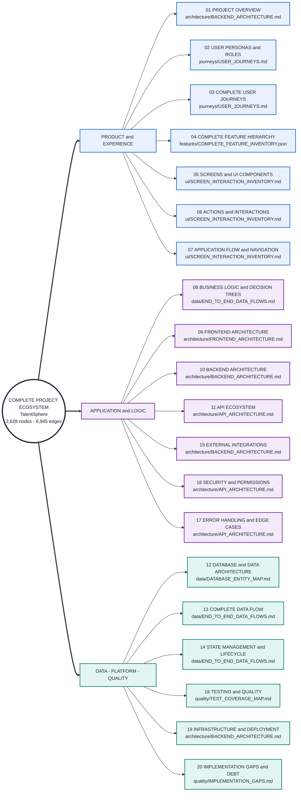
```mermaid
flowchart LR
  HUB(("COMPLETE PROJECT ECOSYSTEM<br/>TalentSphere<br/>2,628 nodes - 6,945 edges")):::hub
  ZA["PRODUCT and EXPERIENCE"]:::grpA
  HUB ==> ZA
  B01["01 PROJECT OVERVIEW<br/>architecture/BACKEND_ARCHITECTURE.md"]:::grpA
  ZA --> B01
  B02["02 USER PERSONAS and ROLES<br/>journeys/USER_JOURNEYS.md"]:::grpA
  ZA --> B02
  B03["03 COMPLETE USER JOURNEYS<br/>journeys/USER_JOURNEYS.md"]:::grpA
  ZA --> B03
  B04["04 COMPLETE FEATURE HIERARCHY<br/>features/COMPLETE_FEATURE_INVENTORY.json"]:::grpA
  ZA --> B04
  B05["05 SCREENS and UI COMPONENTS<br/>ui/SCREEN_INTERACTION_INVENTORY.md"]:::grpA
  ZA --> B05
  B06["06 ACTIONS and INTERACTIONS<br/>ui/SCREEN_INTERACTION_INVENTORY.md"]:::grpA
  ZA --> B06
  B07["07 APPLICATION FLOW and NAVIGATION<br/>ui/SCREEN_INTERACTION_INVENTORY.md"]:::grpA
  ZA --> B07
  ZB["APPLICATION and LOGIC"]:::grpB
  HUB ==> ZB
  B08["08 BUSINESS LOGIC and DECISION TREES<br/>data/END_TO_END_DATA_FLOWS.md"]:::grpB
  ZB --> B08
  B09["09 FRONTEND ARCHITECTURE<br/>architecture/FRONTEND_ARCHITECTURE.md"]:::grpB
  ZB --> B09
  B10["10 BACKEND ARCHITECTURE<br/>architecture/BACKEND_ARCHITECTURE.md"]:::grpB
  ZB --> B10
  B11["11 API ECOSYSTEM<br/>architecture/API_ARCHITECTURE.md"]:::grpB
  ZB --> B11
  B15["15 EXTERNAL INTEGRATIONS<br/>architecture/BACKEND_ARCHITECTURE.md"]:::grpB
  ZB --> B15
  B16["16 SECURITY and PERMISSIONS<br/>architecture/API_ARCHITECTURE.md"]:::grpB
  ZB --> B16
  B17["17 ERROR HANDLING and EDGE CASES<br/>architecture/API_ARCHITECTURE.md"]:::grpB
  ZB --> B17
  ZC["DATA - PLATFORM - QUALITY"]:::grpC
  HUB ==> ZC
  B12["12 DATABASE and DATA ARCHITECTURE<br/>data/DATABASE_ENTITY_MAP.md"]:::grpC
  ZC --> B12
  B13["13 COMPLETE DATA FLOW<br/>data/END_TO_END_DATA_FLOWS.md"]:::grpC
  ZC --> B13
  B14["14 STATE MANAGEMENT and LIFECYCLE<br/>data/END_TO_END_DATA_FLOWS.md"]:::grpC
  ZC --> B14
  B18["18 TESTING and QUALITY<br/>quality/TEST_COVERAGE_MAP.md"]:::grpC
  ZC --> B18
  B19["19 INFRASTRUCTURE and DEPLOYMENT<br/>architecture/BACKEND_ARCHITECTURE.md"]:::grpC
  ZC --> B19
  B20["20 IMPLEMENTATION GAPS and DEBT<br/>quality/IMPLEMENTATION_GAPS.md"]:::grpC
  ZC --> B20
  classDef grpA fill:#e8f1fd,stroke:#1565c0,color:#1b2733,stroke-width:2px;
  classDef grpB fill:#f3eafa,stroke:#6a1b9a,color:#1b2733,stroke-width:2px;
  classDef grpC fill:#e3f5f2,stroke:#00796b,color:#1b2733,stroke-width:2px;
  classDef hub fill:#ffffff,stroke:#1b2733,stroke-width:4px,color:#1b2733;
  classDef api fill:#fff3e0,stroke:#e65100,color:#1b2733;
```

## 2. Cross-connection chain (edge counts from the graph)

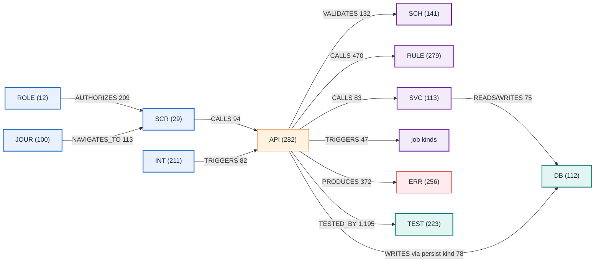
```mermaid
flowchart LR
  R["ROLE (12)"]:::grpA -->|"AUTHORIZES 209"| S["SCR (29)"]:::grpA
  S -->|"CALLS 94"| P["API (282)"]:::api
  I["INT (211)"]:::grpA -->|"TRIGGERS 82"| P
  J["JOUR (100)"]:::grpA -->|"NAVIGATES_TO 113"| S
  P -->|"VALIDATES 132"| SC["SCH (141)"]:::grpB
  P -->|"CALLS 470"| RU["RULE (279)"]:::grpB
  P -->|"CALLS 83"| SV["SVC (113)"]:::grpB
  P -->|"TRIGGERS 47"| JB["job kinds"]:::grpB
  SV -->|"READS/WRITES 75"| D["DB (112)"]:::grpC
  P -->|"WRITES via persist kind 78"| D
  P -->|"PRODUCES 372"| E["ERR (256)"]:::bad
  P -->|"TESTED_BY 1,195"| T["TEST (223)"]:::grpC
  classDef grpA fill:#e8f1fd,stroke:#1565c0,color:#1b2733,stroke-width:2px;
  classDef grpB fill:#f3eafa,stroke:#6a1b9a,color:#1b2733,stroke-width:2px;
  classDef grpC fill:#e3f5f2,stroke:#00796b,color:#1b2733,stroke-width:2px;
  classDef hub fill:#ffffff,stroke:#1b2733,stroke-width:4px,color:#1b2733;
  classDef api fill:#fff3e0,stroke:#e65100,color:#1b2733;
  classDef bad fill:#ffebee,stroke:#c62828,color:#1b2733;
```

## 3. Detail mind maps, one per branch

### Branch 01: Project Overview

Detail file: [`architecture/BACKEND_ARCHITECTURE.md`](../architecture/BACKEND_ARCHITECTURE.md)

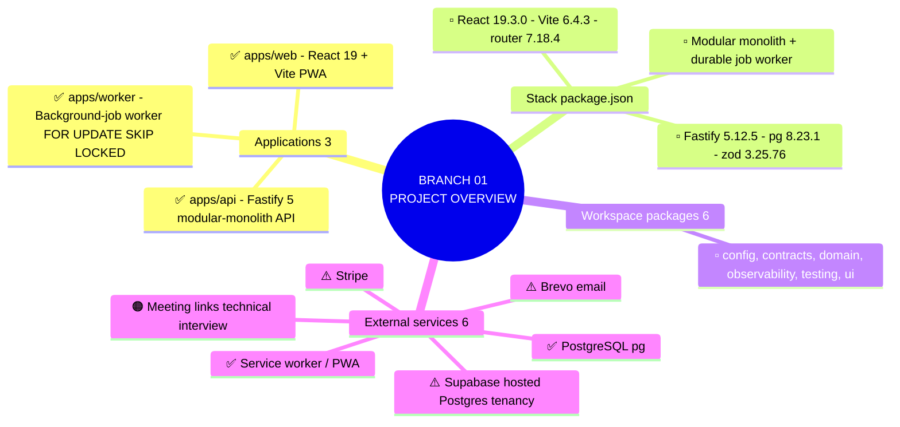
```mermaid
mindmap
  root(("BRANCH 01<br/>PROJECT OVERVIEW"))
    Applications 3
      ✅ apps/api - Fastify 5 modular-monolith API
      ✅ apps/web - React 19 + Vite PWA
      ✅ apps/worker - Background-job worker FOR UPDATE SKIP LOCKED
    Stack package.json
      ▫️ React 19.3.0 - Vite 6.4.3 - router 7.18.4
      ▫️ Fastify 5.12.5 - pg 8.23.1 - zod 3.25.76
      ▫️ Modular monolith + durable job worker
    Workspace packages 6
      ▫️ config, contracts, domain, observability, testing, ui
    External services 6
      ✅ PostgreSQL pg
      ⚠️ Stripe
      ⚠️ Brevo email
      ✅ Service worker / PWA
      ⚠️ Supabase hosted Postgres tenancy
      🟠 Meeting links technical interview
```

### Branch 02: User Personas & Roles

Detail file: [`journeys/USER_JOURNEYS.md`](../journeys/USER_JOURNEYS.md)

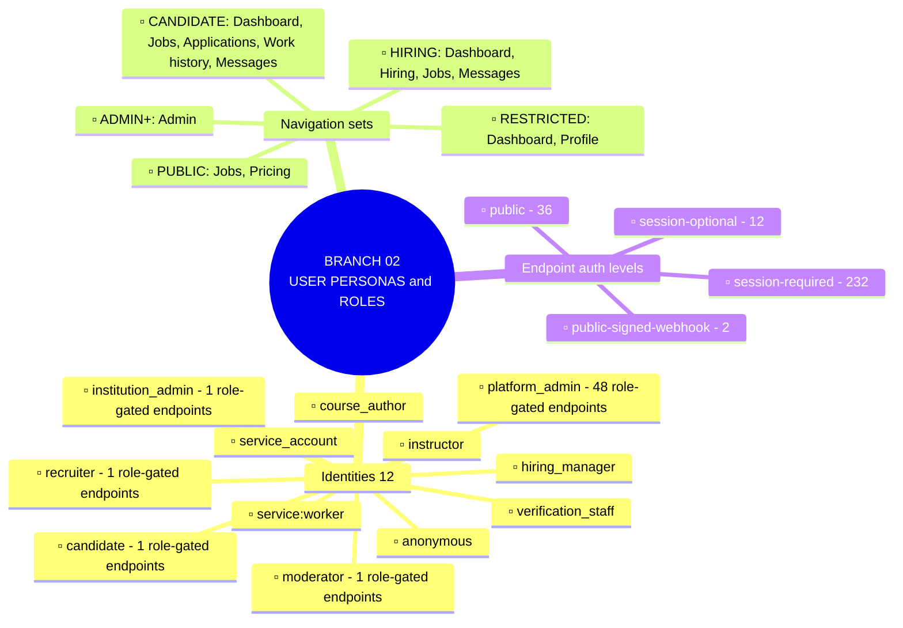
```mermaid
mindmap
  root(("BRANCH 02<br/>USER PERSONAS and ROLES"))
    Identities 12
      ▫️ anonymous
      ▫️ candidate - 1 role-gated endpoints
      ▫️ recruiter - 1 role-gated endpoints
      ▫️ hiring_manager
      ▫️ course_author
      ▫️ instructor
      ▫️ institution_admin - 1 role-gated endpoints
      ▫️ platform_admin - 48 role-gated endpoints
      ▫️ moderator - 1 role-gated endpoints
      ▫️ verification_staff
      ▫️ service_account
      ▫️ service:worker
    Navigation sets
      ▫️ PUBLIC: Jobs, Pricing
      ▫️ CANDIDATE: Dashboard, Jobs, Applications, Work history, Messages
      ▫️ HIRING: Dashboard, Hiring, Jobs, Messages
      ▫️ RESTRICTED: Dashboard, Profile
      ▫️ ADMIN+: Admin
    Endpoint auth levels
      ▫️ session-required - 232
      ▫️ public - 36
      ▫️ session-optional - 12
      ▫️ public-signed-webhook - 2
```

### Branch 03: Complete User Journeys

Detail file: [`journeys/USER_JOURNEYS.md`](../journeys/USER_JOURNEYS.md)

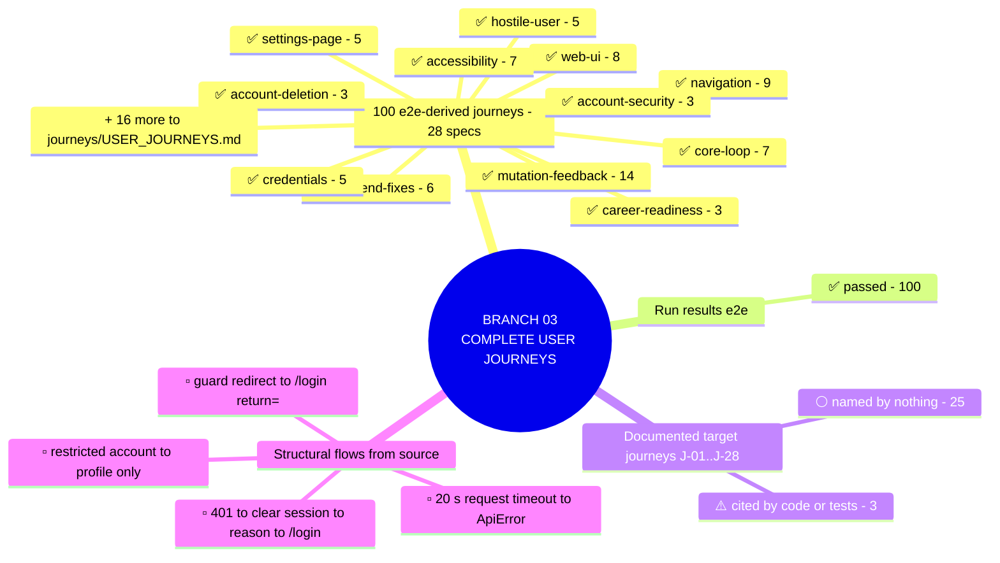
```mermaid
mindmap
  root(("BRANCH 03<br/>COMPLETE USER JOURNEYS"))
    100 e2e-derived journeys - 28 specs
      ✅ mutation-feedback - 14
      ✅ navigation - 9
      ✅ web-ui - 8
      ✅ accessibility - 7
      ✅ core-loop - 7
      ✅ frontend-fixes - 6
      ✅ credentials - 5
      ✅ hostile-user - 5
      ✅ settings-page - 5
      ✅ account-deletion - 3
      ✅ account-security - 3
      ✅ career-readiness - 3
      + 16 more to journeys/USER_JOURNEYS.md
    Run results e2e
      ✅ passed - 100
    Documented target journeys J-01..J-28
      ⚠️ cited by code or tests - 3
      ⚪ named by nothing - 25
    Structural flows from source
      ▫️ guard redirect to /login return=
      ▫️ 401 to clear session to reason to /login
      ▫️ restricted account to profile only
      ▫️ 20 s request timeout to ApiError
```

### Branch 04: Complete Feature Hierarchy

Detail file: [`features/COMPLETE_FEATURE_INVENTORY.json`](../features/COMPLETE_FEATURE_INVENTORY.json)

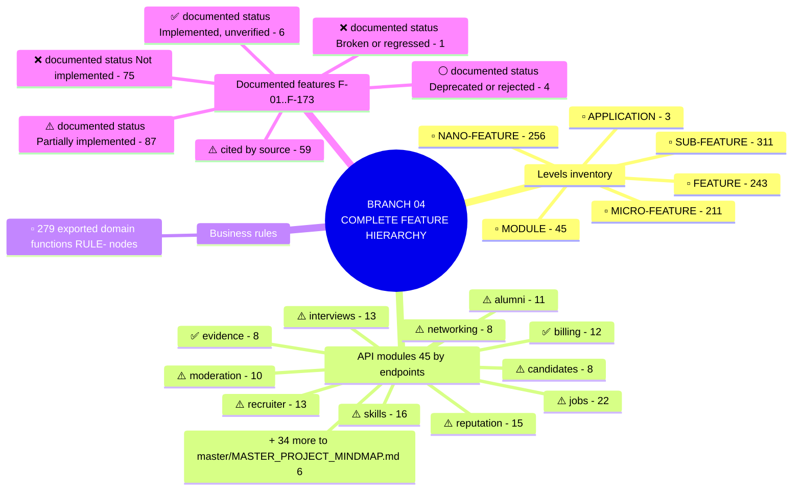
```mermaid
mindmap
  root(("BRANCH 04<br/>COMPLETE FEATURE HIERARCHY"))
    Levels inventory
      ▫️ APPLICATION - 3
      ▫️ MODULE - 45
      ▫️ FEATURE - 243
      ▫️ SUB-FEATURE - 311
      ▫️ MICRO-FEATURE - 211
      ▫️ NANO-FEATURE - 256
    API modules 45 by endpoints
      ⚠️ jobs - 22
      ⚠️ skills - 16
      ⚠️ reputation - 15
      ⚠️ interviews - 13
      ⚠️ recruiter - 13
      ✅ billing - 12
      ⚠️ alumni - 11
      ⚠️ moderation - 10
      ✅ evidence - 8
      ⚠️ candidates - 8
      ⚠️ networking - 8
      + 34 more to master/MASTER_PROJECT_MINDMAP.md 6
    Business rules
      ▫️ 279 exported domain functions RULE- nodes
    Documented features F-01..F-173
      ⚠️ cited by source - 59
      ⚠️ documented status Partially implemented - 87
      ❌ documented status Not implemented - 75
      ✅ documented status Implemented, unverified - 6
      ⚪ documented status Deprecated or rejected - 4
      ❌ documented status Broken or regressed - 1
```

### Branch 05: Screens & Ui Components

Detail file: [`ui/SCREEN_INTERACTION_INVENTORY.md`](../ui/SCREEN_INTERACTION_INVENTORY.md)

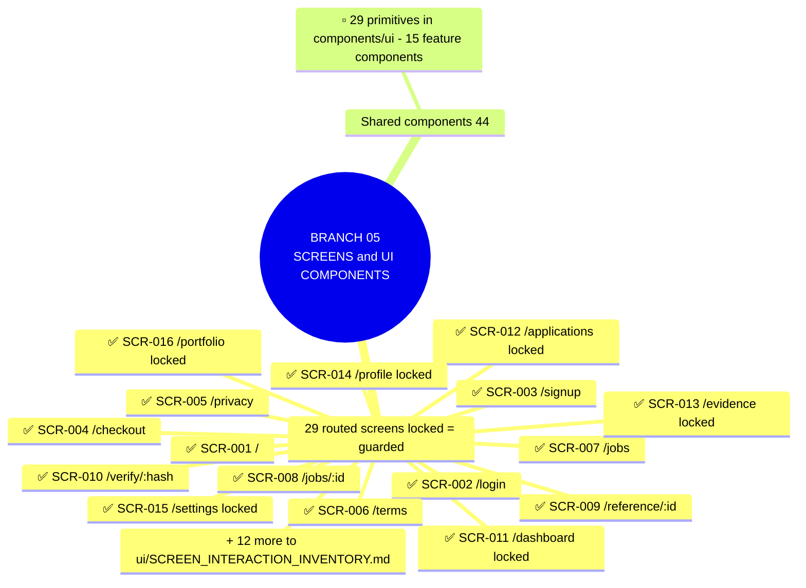
```mermaid
mindmap
  root(("BRANCH 05<br/>SCREENS and UI COMPONENTS"))
    29 routed screens locked = guarded
      ✅ SCR-001 /
      ✅ SCR-002 /login
      ✅ SCR-003 /signup
      ✅ SCR-004 /checkout
      ✅ SCR-005 /privacy
      ✅ SCR-006 /terms
      ✅ SCR-007 /jobs
      ✅ SCR-008 /jobs/:id
      ✅ SCR-009 /reference/:id
      ✅ SCR-010 /verify/:hash
      ✅ SCR-011 /dashboard locked
      ✅ SCR-012 /applications locked
      ✅ SCR-013 /evidence locked
      ✅ SCR-014 /profile locked
      ✅ SCR-015 /settings locked
      ✅ SCR-016 /portfolio locked
      + 12 more to ui/SCREEN_INTERACTION_INVENTORY.md
    Shared components 44
      ▫️ 29 primitives in components/ui - 15 feature components
```

### Branch 06: Actions & Interactions

Detail file: [`ui/SCREEN_INTERACTION_INVENTORY.md`](../ui/SCREEN_INTERACTION_INVENTORY.md)

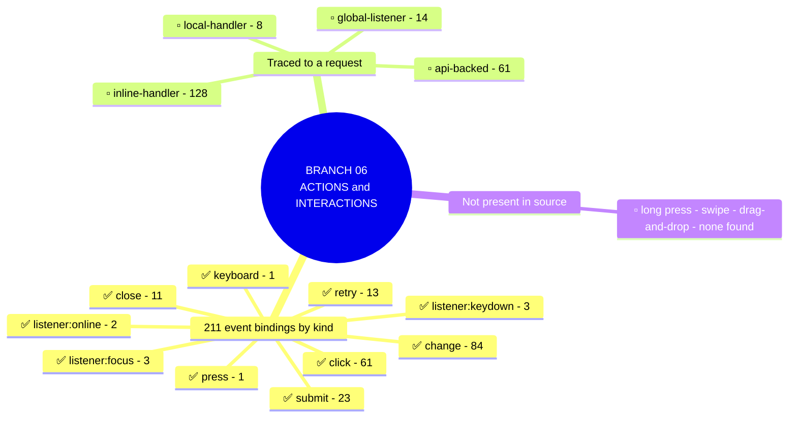
```mermaid
mindmap
  root(("BRANCH 06<br/>ACTIONS and INTERACTIONS"))
    211 event bindings by kind
      ✅ change - 84
      ✅ click - 61
      ✅ submit - 23
      ✅ retry - 13
      ✅ close - 11
      ✅ listener:keydown - 3
      ✅ listener:focus - 3
      ✅ listener:online - 2
      ✅ press - 1
      ✅ keyboard - 1
    Traced to a request
      ▫️ inline-handler - 128
      ▫️ api-backed - 61
      ▫️ global-listener - 14
      ▫️ local-handler - 8
    Not present in source
      ▫️ long press - swipe - drag-and-drop - none found
```

### Branch 07: Application Flow & Navigation

Detail file: [`ui/SCREEN_INTERACTION_INVENTORY.md`](../ui/SCREEN_INTERACTION_INVENTORY.md)

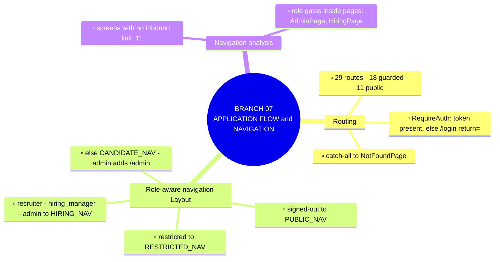
```mermaid
mindmap
  root(("BRANCH 07<br/>APPLICATION FLOW and NAVIGATION"))
    Routing
      ▫️ 29 routes - 18 guarded - 11 public
      ▫️ RequireAuth: token present, else /login return=
      ▫️ catch-all to NotFoundPage
    Role-aware navigation Layout
      ▫️ signed-out to PUBLIC_NAV
      ▫️ restricted to RESTRICTED_NAV
      ▫️ recruiter - hiring_manager - admin to HIRING_NAV
      ▫️ else CANDIDATE_NAV - admin adds /admin
    Navigation analysis
      ▫️ screens with no inbound link: 11
      ▫️ role gates inside pages: AdminPage, HiringPage
```

### Branch 08: Business Logic & Decision Trees

Detail file: [`data/END_TO_END_DATA_FLOWS.md`](../data/END_TO_END_DATA_FLOWS.md)

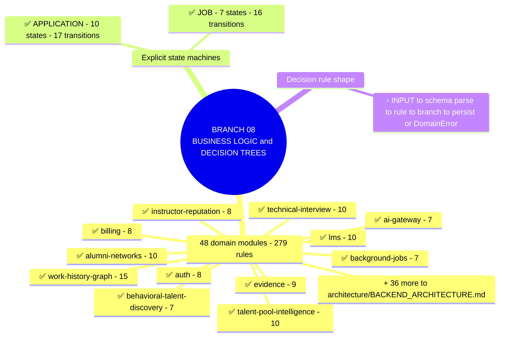
```mermaid
mindmap
  root(("BRANCH 08<br/>BUSINESS LOGIC and DECISION TREES"))
    48 domain modules - 279 rules
      ✅ work-history-graph - 15
      ✅ alumni-networks - 10
      ✅ lms - 10
      ✅ talent-pool-intelligence - 10
      ✅ technical-interview - 10
      ✅ evidence - 9
      ✅ auth - 8
      ✅ billing - 8
      ✅ instructor-reputation - 8
      ✅ ai-gateway - 7
      ✅ background-jobs - 7
      ✅ behavioral-talent-discovery - 7
      + 36 more to architecture/BACKEND_ARCHITECTURE.md
    Explicit state machines
      ✅ APPLICATION - 10 states - 17 transitions
      ✅ JOB - 7 states - 16 transitions
    Decision rule shape
      ▫️ INPUT to schema parse to rule to branch to persist or DomainError
```

### Branch 09: Frontend Architecture

Detail file: [`architecture/FRONTEND_ARCHITECTURE.md`](../architecture/FRONTEND_ARCHITECTURE.md)

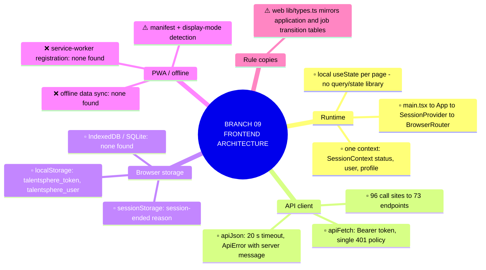
```mermaid
mindmap
  root(("BRANCH 09<br/>FRONTEND ARCHITECTURE"))
    Runtime
      ▫️ main.tsx to App to SessionProvider to BrowserRouter
      ▫️ one context: SessionContext status, user, profile
      ▫️ local useState per page - no query/state library
    API client
      ▫️ apiFetch: Bearer token, single 401 policy
      ▫️ apiJson: 20 s timeout, ApiError with server message
      ▫️ 96 call sites to 73 endpoints
    Browser storage
      ▫️ localStorage: talentsphere_token, talentsphere_user
      ▫️ sessionStorage: session-ended reason
      ▫️ IndexedDB / SQLite: none found
    PWA / offline
      ⚠️ manifest + display-mode detection
      ❌ service-worker registration: none found
      ❌ offline data sync: none found
    Rule copies
      ⚠️ web lib/types.ts mirrors application and job transition tables
```

### Branch 10: Backend Architecture

Detail file: [`architecture/BACKEND_ARCHITECTURE.md`](../architecture/BACKEND_ARCHITECTURE.md)

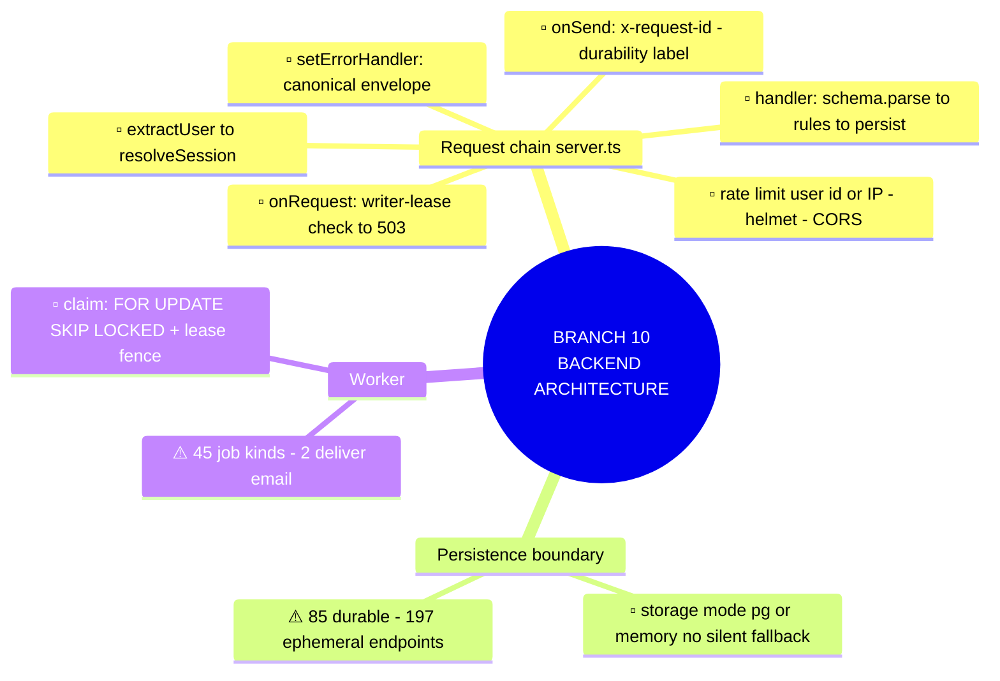
```mermaid
mindmap
  root(("BRANCH 10<br/>BACKEND ARCHITECTURE"))
    Request chain server.ts
      ▫️ onRequest: writer-lease check to 503
      ▫️ rate limit user id or IP - helmet - CORS
      ▫️ extractUser to resolveSession
      ▫️ handler: schema.parse to rules to persist
      ▫️ onSend: x-request-id - durability label
      ▫️ setErrorHandler: canonical envelope
    Persistence boundary
      ▫️ storage mode pg or memory no silent fallback
      ⚠️ 85 durable - 197 ephemeral endpoints
    Worker
      ⚠️ 45 job kinds - 2 deliver email
      ▫️ claim: FOR UPDATE SKIP LOCKED + lease fence
```

### Branch 11: Api Ecosystem

Detail file: [`architecture/API_ARCHITECTURE.md`](../architecture/API_ARCHITECTURE.md)

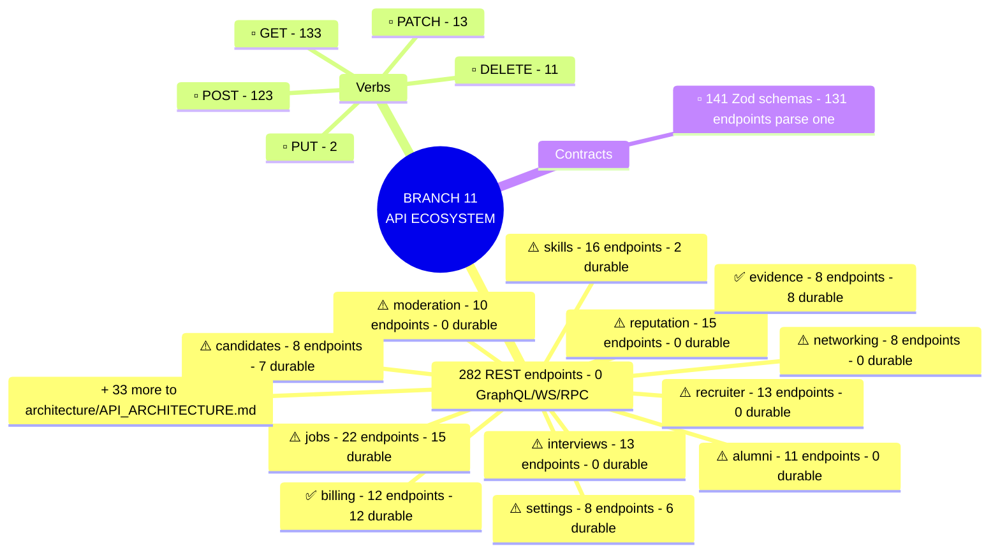
```mermaid
mindmap
  root(("BRANCH 11<br/>API ECOSYSTEM"))
    282 REST endpoints - 0 GraphQL/WS/RPC
      ⚠️ jobs - 22 endpoints - 15 durable
      ⚠️ skills - 16 endpoints - 2 durable
      ⚠️ reputation - 15 endpoints - 0 durable
      ⚠️ interviews - 13 endpoints - 0 durable
      ⚠️ recruiter - 13 endpoints - 0 durable
      ✅ billing - 12 endpoints - 12 durable
      ⚠️ alumni - 11 endpoints - 0 durable
      ⚠️ moderation - 10 endpoints - 0 durable
      ✅ evidence - 8 endpoints - 8 durable
      ⚠️ candidates - 8 endpoints - 7 durable
      ⚠️ networking - 8 endpoints - 0 durable
      ⚠️ settings - 8 endpoints - 6 durable
      + 33 more to architecture/API_ARCHITECTURE.md
    Verbs
      ▫️ GET - 133
      ▫️ POST - 123
      ▫️ PATCH - 13
      ▫️ DELETE - 11
      ▫️ PUT - 2
    Contracts
      ▫️ 141 Zod schemas - 131 endpoints parse one
```

### Branch 12: Database & Data Architecture

Detail file: [`data/DATABASE_ENTITY_MAP.md`](../data/DATABASE_ENTITY_MAP.md)

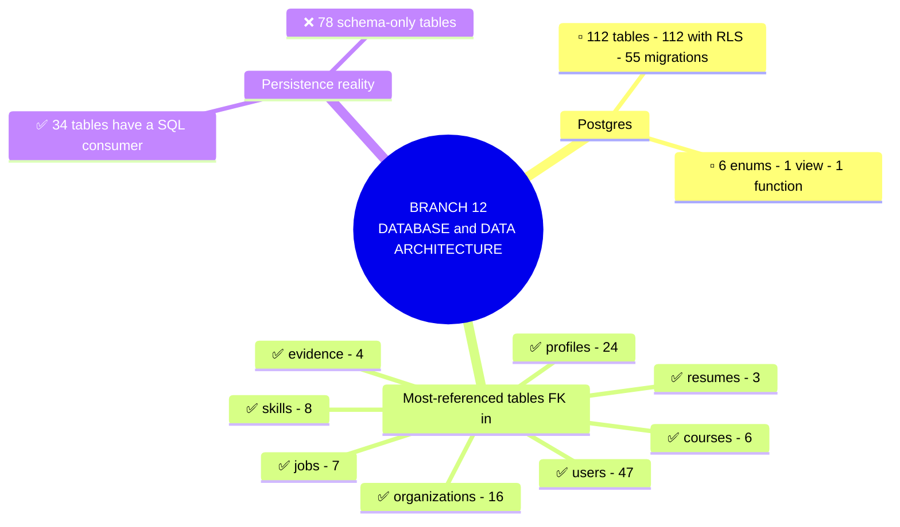
```mermaid
mindmap
  root(("BRANCH 12<br/>DATABASE and DATA ARCHITECTURE"))
    Postgres
      ▫️ 112 tables - 112 with RLS - 55 migrations
      ▫️ 6 enums - 1 view - 1 function
    Most-referenced tables FK in
      ✅ users - 47
      ✅ profiles - 24
      ✅ organizations - 16
      ✅ skills - 8
      ✅ jobs - 7
      ✅ courses - 6
      ✅ evidence - 4
      ✅ resumes - 3
    Persistence reality
      ✅ 34 tables have a SQL consumer
      ❌ 78 schema-only tables
```

### Branch 13: Complete Data Flow

Detail file: [`data/END_TO_END_DATA_FLOWS.md`](../data/END_TO_END_DATA_FLOWS.md)

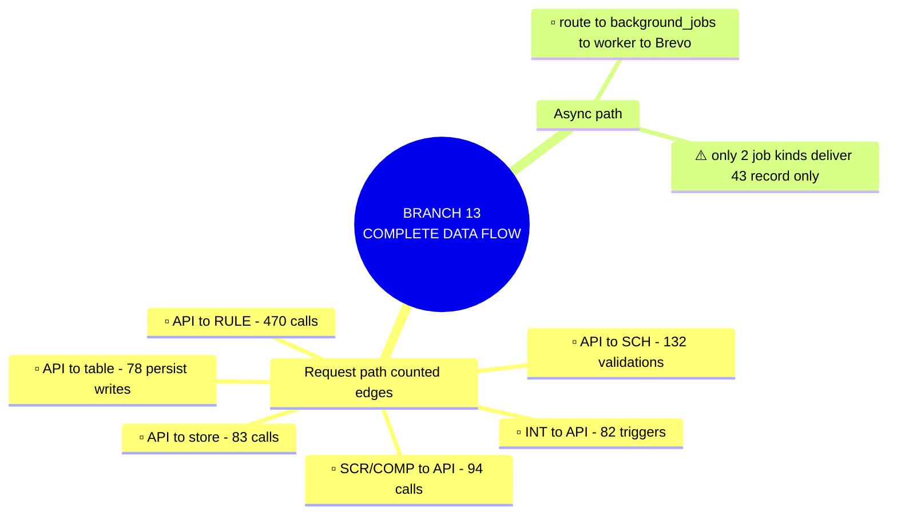
```mermaid
mindmap
  root(("BRANCH 13<br/>COMPLETE DATA FLOW"))
    Request path counted edges
      ▫️ INT to API - 82 triggers
      ▫️ SCR/COMP to API - 94 calls
      ▫️ API to SCH - 132 validations
      ▫️ API to RULE - 470 calls
      ▫️ API to store - 83 calls
      ▫️ API to table - 78 persist writes
    Async path
      ▫️ route to background_jobs to worker to Brevo
      ⚠️ only 2 job kinds deliver 43 record only
```

### Branch 14: State Management & Lifecycle

Detail file: [`data/END_TO_END_DATA_FLOWS.md`](../data/END_TO_END_DATA_FLOWS.md)

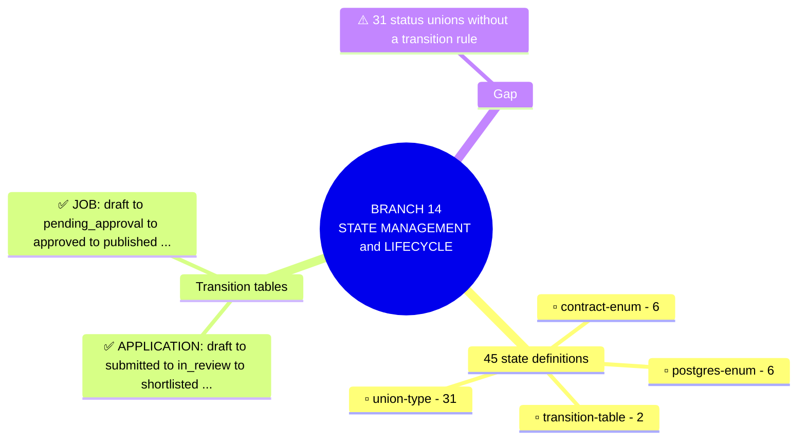
```mermaid
mindmap
  root(("BRANCH 14<br/>STATE MANAGEMENT and LIFECYCLE"))
    45 state definitions
      ▫️ union-type - 31
      ▫️ contract-enum - 6
      ▫️ postgres-enum - 6
      ▫️ transition-table - 2
    Transition tables
      ✅ APPLICATION: draft to submitted to in_review to shortlisted ...
      ✅ JOB: draft to pending_approval to approved to published ...
    Gap
      ⚠️ 31 status unions without a transition rule
```

### Branch 15: External Integrations

Detail file: [`architecture/BACKEND_ARCHITECTURE.md`](../architecture/BACKEND_ARCHITECTURE.md)

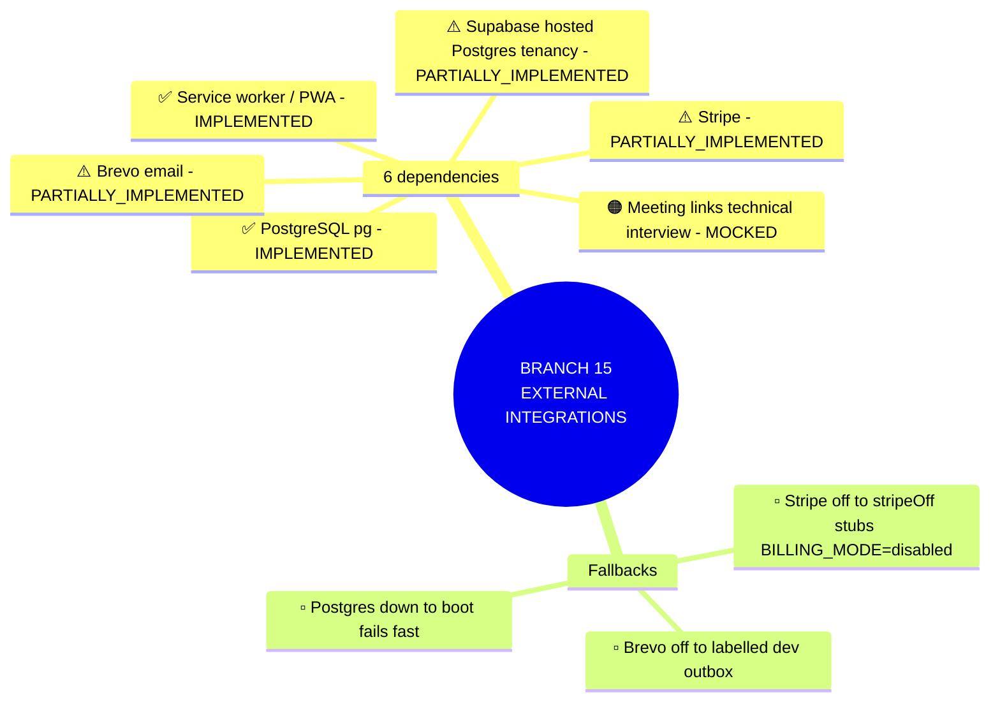
```mermaid
mindmap
  root(("BRANCH 15<br/>EXTERNAL INTEGRATIONS"))
    6 dependencies
      ✅ PostgreSQL pg - IMPLEMENTED
      ⚠️ Stripe - PARTIALLY_IMPLEMENTED
      ⚠️ Brevo email - PARTIALLY_IMPLEMENTED
      ✅ Service worker / PWA - IMPLEMENTED
      ⚠️ Supabase hosted Postgres tenancy - PARTIALLY_IMPLEMENTED
      🟠 Meeting links technical interview - MOCKED
    Fallbacks
      ▫️ Stripe off to stripeOff stubs BILLING_MODE=disabled
      ▫️ Brevo off to labelled dev outbox
      ▫️ Postgres down to boot fails fast
```

### Branch 16: Security & Permissions

Detail file: [`architecture/API_ARCHITECTURE.md`](../architecture/API_ARCHITECTURE.md)

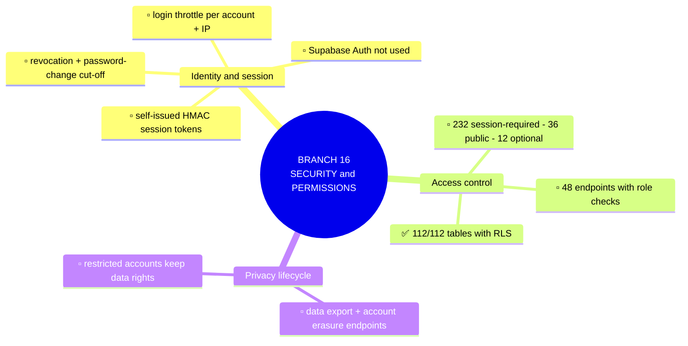
```mermaid
mindmap
  root(("BRANCH 16<br/>SECURITY and PERMISSIONS"))
    Identity and session
      ▫️ self-issued HMAC session tokens
      ▫️ revocation + password-change cut-off
      ▫️ login throttle per account + IP
      ▫️ Supabase Auth not used
    Access control
      ▫️ 232 session-required - 36 public - 12 optional
      ▫️ 48 endpoints with role checks
      ✅ 112/112 tables with RLS
    Privacy lifecycle
      ▫️ data export + account erasure endpoints
      ▫️ restricted accounts keep data rights
```

### Branch 17: Error Handling & Edge Cases

Detail file: [`architecture/API_ARCHITECTURE.md`](../architecture/API_ARCHITECTURE.md)

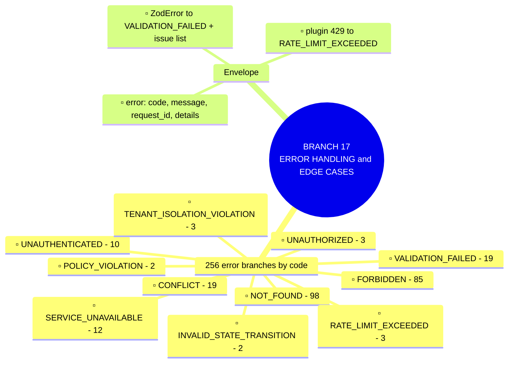
```mermaid
mindmap
  root(("BRANCH 17<br/>ERROR HANDLING and EDGE CASES"))
    256 error branches by code
      ▫️ NOT_FOUND - 98
      ▫️ FORBIDDEN - 85
      ▫️ CONFLICT - 19
      ▫️ VALIDATION_FAILED - 19
      ▫️ SERVICE_UNAVAILABLE - 12
      ▫️ UNAUTHENTICATED - 10
      ▫️ RATE_LIMIT_EXCEEDED - 3
      ▫️ UNAUTHORIZED - 3
      ▫️ TENANT_ISOLATION_VIOLATION - 3
      ▫️ POLICY_VIOLATION - 2
      ▫️ INVALID_STATE_TRANSITION - 2
    Envelope
      ▫️ error: code, message, request_id, details
      ▫️ ZodError to VALIDATION_FAILED + issue list
      ▫️ plugin 429 to RATE_LIMIT_EXCEEDED
```

### Branch 18: Testing & Quality

Detail file: [`quality/TEST_COVERAGE_MAP.md`](../quality/TEST_COVERAGE_MAP.md)

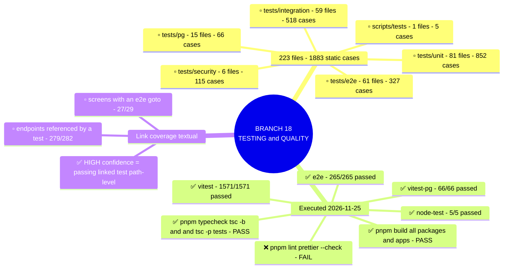
```mermaid
mindmap
  root(("BRANCH 18<br/>TESTING and QUALITY"))
    223 files - 1883 static cases
      ▫️ scripts/tests - 1 files - 5 cases
      ▫️ tests/e2e - 61 files - 327 cases
      ▫️ tests/integration - 59 files - 518 cases
      ▫️ tests/pg - 15 files - 66 cases
      ▫️ tests/security - 6 files - 115 cases
      ▫️ tests/unit - 81 files - 852 cases
    Executed 2026-11-25
      ✅ vitest - 1571/1571 passed
      ✅ vitest-pg - 66/66 passed
      ✅ e2e - 265/265 passed
      ✅ node-test - 5/5 passed
      ✅ pnpm build all packages and apps - PASS
      ✅ pnpm typecheck tsc -b and and tsc -p tests - PASS
      ❌ pnpm lint prettier --check - FAIL
    Link coverage textual
      ▫️ endpoints referenced by a test - 279/282
      ▫️ screens with an e2e goto - 27/29
      ✅ HIGH confidence = passing linked test path-level
```

### Branch 19: Infrastructure & Deployment

Detail file: [`architecture/BACKEND_ARCHITECTURE.md`](../architecture/BACKEND_ARCHITECTURE.md)

```mermaid
mindmap
  root(("BRANCH 19<br/>INFRASTRUCTURE and DEPLOYMENT"))
    CI workflows
      ⚠️ ci.yml - 16 steps
      ✅ hosted-supabase-audit.yml - 2 steps
      ✅ oracle-staging.yml - 1 steps
    Deploy targets
      ▫️ deploy/coolify - Caddyfile, compose.yaml
      ▫️ deploy/oracle - .env.example, .omc, Caddyfile, Dockerfil
    Config
      ▫️ 49 env vars validated zod
      ▫️ 9 scripts - 55 SQL migrations
      ❌ CI on main red since 2026-10-26 at the Prettier step
```

### Branch 20: Implementation Gaps & Debt

Detail file: [`quality/IMPLEMENTATION_GAPS.md`](../quality/IMPLEMENTATION_GAPS.md)

```mermaid
mindmap
  root(("BRANCH 20<br/>IMPLEMENTATION GAPS and DEBT"))
    Status distribution capabilities
      ✅ IMPLEMENTED - 1044
      ❌ NOT_IMPLEMENTED - 78
      ⚠️ PARTIALLY_IMPLEMENTED - 46
      ⚪ UNKNOWN - 21
      🟠 MOCKED - 1
    Gaps with evidence
      ⚠️ 197 ephemeral endpoints
      ❌ 78 schema-only tables
      ⚪ 206 endpoints with no web caller
      ⚠️ 43 no-op job kinds
      🟠 interview meeting link: fixed template
      ❌ no service-worker registration
    Documentation vs code
      ⚪ features documented as built but cited nowhere - 30
      ⚠️ features documented as missing but cited by handlers - 1
      ⚪ endpoints citing no documented ID - 78
```
